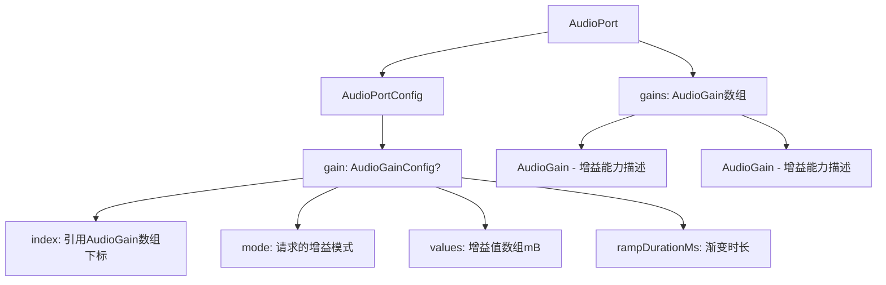
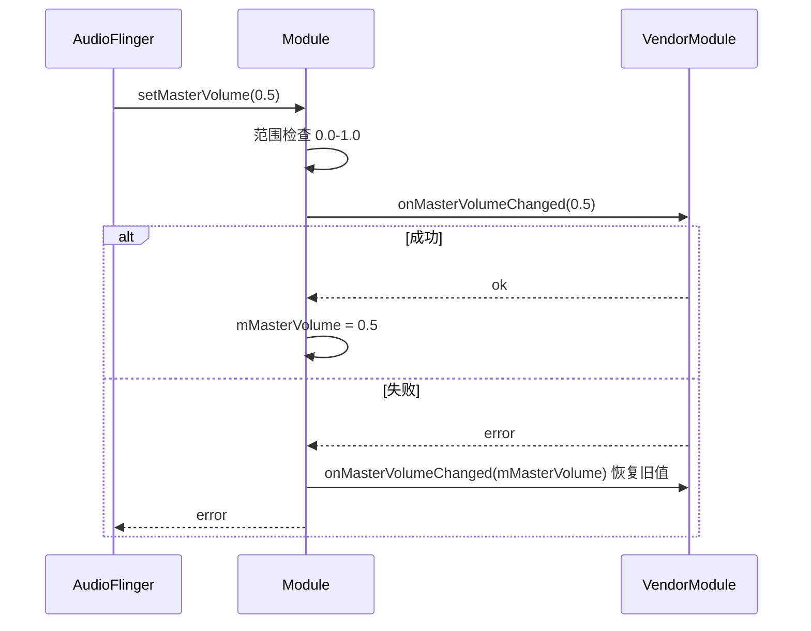
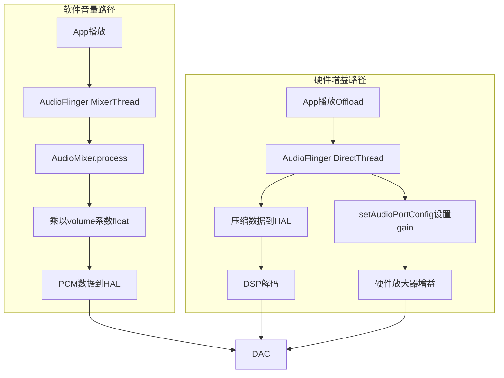
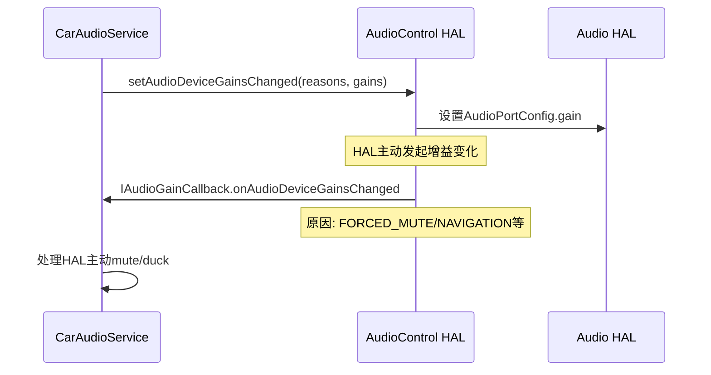

## 8.7 AudioGain — HAL增益控制模型

[← 上一个](08_8.6_Vendor实现要点.md) | [← 返回第8章](README.md) | [返回导航](../README.md) | [下一个 →](08_8.8_IModule_AIDL接口-HAL核心入口深度解析.md)

---

> **AIDL定义**: [`AudioGain.aidl`](system/hardware/interfaces/media/aidl/android/media/audio/common/AudioGain.aidl) | [`AudioGainConfig.aidl`](system/hardware/interfaces/media/aidl/android/media/audio/common/AudioGainConfig.aidl) | [`AudioGainMode.aidl`](system/hardware/interfaces/media/aidl/android/media/audio/common/AudioGainMode.aidl)
> **C定义**: [`audio.h`](system/media/audio/include/system/audio.h:549) (audio_gain/audio_gain_config) | [`audio-hal-enums.h`](system/media/audio/include/system/audio-hal-enums.h:657)
> **Module实现**: [`Module.cpp`](hardware/interfaces/audio/aidl/default/Module.cpp:953) (gain协商) | [`Module.cpp`](hardware/interfaces/audio/aidl/default/Module.cpp:1041) (setMasterMute/setMasterVolume)
> **AAOS扩展**: [`AudioGainConfigInfo.aidl`](hardware/interfaces/automotive/audiocontrol/aidl/android/hardware/automotive/audiocontrol/AudioGainConfigInfo.aidl) | [`IAudioGainCallback.aidl`](hardware/interfaces/automotive/audiocontrol/aidl/android/hardware/automotive/audiocontrol/IAudioGainCallback.aidl)

### 8.7.1 AudioGain双层模型

AudioGain在HAL层表现为两个互补的数据结构：**AudioGain**描述增益能力，**AudioGainConfig**描述增益运行时配置。



**AudioGain vs AudioGainConfig定位**：

| 维度 | AudioGain | AudioGainConfig |
|------|-----------|-----------------|
| 角色 | 端口增益**能力声明** | 端口增益**运行时配置** |
| 位置 | AudioPort.gains[] | AudioPortConfig.gain |
| 关系 | 可多个（多增益级） | 引用其中一个（index字段） |
| 值范围 | min/max/default/step | 实际设置值 |
| 修改 | 静态，配置时确定 | 动态，setAudioPortConfig修改 |
| AIDL文件 | AudioGain.aidl | AudioGainConfig.aidl |

### 8.7.2 AudioGain数据结构详解

[`AudioGain.aidl`](system/hardware/interfaces/media/aidl/android/media/audio/common/AudioGain.aidl:29)定义：

| 字段 | 类型 | 说明 | 示例 |
|------|------|------|------|
| `mode` | `int` (bitmask) | 支持的增益模式组合，按AudioGainMode位索引 | JOINT|RAMP = 0b101 = 5 |
| `channelMask` | `AudioChannelLayout` | CHANNELS模式时的可控通道布局 | layoutMask=STEREO |
| `minValue` | `int` | 最小增益(毫贝mB)，1mB=0.1dB | -8400mB = -84dB |
| `maxValue` | `int` | 最大增益(毫贝mB) | 4000mB = +40dB |
| `defaultValue` | `int` | 默认增益(毫贝mB) | 0mB = 0dB(无增减) |
| `stepValue` | `int` | 增益步进(毫贝mB)，相邻可设值间距 | 100mB = 1dB |
| `minRampMs` | `int` | 最小渐变时长(ms)，RAMP模式有效 | 50ms |
| `maxRampMs` | `int` | 最大渐变时长(ms)，RAMP模式有效 | 500ms |
| `useForVolume` | `boolean` | **关键**: 是否允许用于音量控制 | true/false |

**useForVolume**的特殊含义（AIDL新增字段，C结构体中不存在）：
- `true`: AudioPolicyManager将该增益级用于音量控制，调用`setAudioPortConfig`设置增益而非软件乘法
- `false`: 该增益级仅供特定场景使用（如电话侧音补偿），不用于一般音量控制
- **DirectOutput/Offload路径零拷贝音量**: 当`useForVolume=true`时，音量通过硬件增益控制而非修改PCM数据

**毫贝(mB)换算**：
- 1 mB = 0.1 dB
- -8400 mB = -84 dB (极小音量)
- 0 mB = 0 dB (参考音量)
- 4000 mB = +40 dB (极大音量)
- 步进100 mB = 1 dB步进

### 8.7.3 AudioGainMode枚举

[`AudioGainMode.aidl`](system/hardware/interfaces/media/aidl/android/media/audio/common/AudioGainMode.aidl:27)定义3种模式，作为bitmask位索引：

| 模式 | AIDL值 | C值 | 位位置 | 说明 |
|------|--------|-----|--------|------|
| `JOINT` | 0 | 1 | bit 0 | 所有通道统一增益 |
| `CHANNELS` | 1 | 2 | bit 1 | 每通道独立增益 |
| `RAMP` | 2 | 4 | bit 2 | 渐变增益(防爆音) |

**常见组合**：
- `JOINT` (mode=1): 最常见，所有通道一起调
- `JOINT|RAMP` (mode=5): 统一渐变，如车载Speaker
- `CHANNELS|RAMP` (mode=6): 多通道渐变，如多声道DSP
- `JOINT|CHANNELS|RAMP` (mode=7): 全功能增益级

### 8.7.4 AudioGainConfig运行时配置

[`AudioGainConfig.aidl`](system/hardware/interfaces/media/aidl/android/media/audio/common/AudioGainConfig.aidl:29)定义：

| 字段 | 类型 | 说明 |
|------|------|------|
| `index` | `int` | 对应AudioPort.gains[]数组的下标，标识使用哪个增益级 |
| `mode` | `int` (bitmask) | 本次配置请求的增益模式 |
| `channelMask` | `AudioChannelLayout` | CHANNELS模式时的受控通道 |
| `values[]` | `int[]` | 增益值数组(mB)，JOINT模式1个值，CHANNELS模式按通道数 |
| `rampDurationMs` | `int` | 渐变时长(ms)，RAMP模式有效 |

**values数组长度规则**：
- JOINT模式: 1个值（所有通道相同）
- CHANNELS模式: `__builtin_popcount(channelMask)`个值，从LSb到MSb排列
- 例: STEREO layoutMask=2(bit1) → popcount=2 → values=[左通道mB, 右通道mB]

### 8.7.5 setAudioPortConfig中的Gain协商

[`Module::setAudioPortConfig()`](hardware/interfaces/audio/aidl/default/Module.cpp:953)对gain的处理：

```cpp
if (in_requested.gain.has_value()) {
    // Let's pretend that gain can always be applied.
    out_suggested->gain = in_requested.gain.value();
}
```

默认实现**无条件接受**任何增益配置——"假装增益总是可以应用"。实际Vendor实现需增加验证逻辑：

```mermaid
flowchart TB
    REQ[请求AudioPortConfig.gain] --> HAS{gain.has_value?}
    HAS -->|否| SKIP[不修改gain, 保持原值]
    HAS -->|是| EXIST{index < port.gains.size?}
    EXIST -->|否| ERR1[EX_ILLEGAL_ARGUMENT - 增益级不存在]
    EXIST -->|是| MODE{mode在port.gains[index].mode中?}
    MODE -->|否| ERR2[EX_ILLEGAL_ARGUMENT - 模式不支持]
    MODE -->|是| RANGE{values在min/max范围内?}
    RANGE -->|否| SUGGEST[返回建议值 - 最近的有效值]
    RANGE -->|是| RAMP{需要渐变?}
    RAMP -->|是| CHECK_RAMP[rampDurationMs在min/max范围?]
    CHECK_RAMP -->|否| SUGGEST_RAMP[建议clamp到有效范围]
    CHECK_RAMP -->|是| ACCEPT[接受增益配置]
    RAMP -->|否| ACCEPT
```

**Vendor应实现的增益验证逻辑**：

```cpp
// Vendor扩展的gain验证
if (in_requested.gain.has_value()) {
    auto& reqGain = in_requested.gain.value();
    auto& portGains = port.gains;
    if (reqGain.index >= portGains.size()) {
        return ndk::ScopedAStatus::fromExceptionCode(EX_ILLEGAL_ARGUMENT);
    }
    auto& gainStage = portGains[reqGain.index];
    if (!(reqGain.mode & gainStage.mode)) {
        // 模式不支持，返回建议值
        out_suggested->gain = reqGain;
        out_suggested->gain->mode = gainStage.mode; // 建议可用模式
    }
    // 值范围检查...
}
```

### 8.7.6 MasterMute与MasterVolume

[`Module::setMasterMute()`](hardware/interfaces/audio/aidl/default/Module.cpp:1041)和[`Module::setMasterVolume()`](hardware/interfaces/audio/aidl/default/Module.cpp:1062)：

```cpp
ndk::ScopedAStatus Module::setMasterMute(bool in_mute) {
    auto result = mDebug.simulateDeviceConnections
                    ? ndk::ScopedAStatus::ok()
                    : onMasterMuteChanged(in_mute);
    if (result.isOk()) {
        mMasterMute = in_mute;
    } else {
        // Reset master mute if it failed.
        onMasterMuteChanged(mMasterMute);
    }
    return std::move(result);
}

ndk::ScopedAStatus Module::setMasterVolume(float in_volume) {
    if (in_volume >= 0.0f && in_volume <= 1.0f) {
        auto result = mDebug.simulateDeviceConnections
                        ? ndk::ScopedAStatus::ok()
                        : onMasterVolumeChanged(in_volume);
        if (result.isOk()) {
            mMasterVolume = in_volume;
        } else {
            onMasterVolumeChanged(mMasterVolume); // Reset on failure
        }
        return std::move(result);
    }
    return ndk::ScopedAStatus::fromExceptionCode(EX_ILLEGAL_ARGUMENT);
}
```

**关键设计要点**：
- `onMasterMuteChanged/onMasterVolumeChanged`是虚函数，Vendor可覆盖
- 失败时自动恢复旧值（fail-safe机制）
- Volume范围[0.0, 1.0]（float归一化值，非mB）
- `simulateDeviceConnections`调试模式跳过硬件操作



### 8.7.7 软件音量 vs 硬件增益全路径对比



| 维度 | 软件音量 | 硬件增益 |
|------|---------|---------|
| 实现层 | AudioMixer浮点乘法 | HAL AudioGainConfig |
| 数据修改 | **修改PCM采样值** | **不修改PCM，控制放大器** |
| 适用流 | MixerThread混合流 | DirectOutput/Offload压缩流 |
| 精度 | float高精度 | mB步进（步进值） |
| 动态范围 | 受限于位深(16bit≈96dB) | 取决于放大器硬件 |
| 渐变方式 | VolumeShaper | RAMP模式(min/max_ramp_ms) |
| AIDL入口 | setStreamVolume | setAudioPortConfig(gain) |
| 配置标记 | 无 | useForVolume=true |
| 零拷贝 | 不可能(必须修改数据) | **可以实现**(PCM不变) |

### 8.7.8 HIDL Gain机制对比

**HIDL audio_gain C结构体**（[`audio.h`](system/media/audio/include/system/audio.h:551)）：

| 维度 | HIDL (C结构体) | AIDL (parcelable) |
|------|---------------|-------------------|
| 定义方式 | `struct audio_gain` | `parcelable AudioGain` |
| mode类型 | `audio_gain_mode_t`(enum值1/2/4) | `int`(bitmask位索引0/1/2) |
| channelMask | `audio_channel_mask_t` | `AudioChannelLayout` |
| 值单位 | 毫贝(mB) | 毫贝(mB)，一致 |
| useForVolume | **不存在** | **AIDL新增**boolean字段 |
| 最大增益级数 | `AUDIO_PORT_MAX_GAINS`(16) | 无限制(AudioGain[]) |
| 设置方式 | `audio_port_config.gain` | `AudioPortConfig.gain(@nullable)` |
| 流级增益 | `StreamIn.setGain(float)` | 通过AudioPortConfig |

**HIDL StreamIn.setGain**（[`StreamIn.cpp`](hardware/interfaces/audio/core/all-versions/default/StreamIn.cpp:354)）：

```cpp
Return<Result> StreamIn::setGain(float gain) {
    if (!util::isGainNormalized(gain)) {
        ALOGW("Can not set a stream input gain (%f) outside [0,1]", gain);
        return Result::INVALID_ARGUMENTS;
    }
    return Stream::analyzeStatus("set_gain", mStream->set_gain(mStream, gain));
}
```

AIDL中移除了流级setGain，所有增益通过AudioPortConfig统一管理。

### 8.7.9 AAOS AudioControl Gain扩展

AAOS通过[`AudioGainConfigInfo`](hardware/interfaces/automotive/audiocontrol/aidl/android/hardware/automotive/audiocontrol/AudioGainConfigInfo.aidl)和[`IAudioGainCallback`](hardware/interfaces/automotive/audiocontrol/aidl/android/hardware/automotive/audiocontrol/IAudioGainCallback.aidl)实现车载特定增益控制：

**AudioGainConfigInfo**（精简版，防止aidl_api重复）：

| 字段 | 类型 | 说明 |
|------|------|------|
| `zoneId` | `int` | 音频Zone标识 |
| `devicePortAddress` | `String` | AudioPort设备端口地址 |
| `volumeIndex` | `int` | 对应AudioPort.gains[]的UI下标 |

**IAudioGainCallback双向增益通知**：



**车载增益典型场景**：

| 场景 | 触发者 | 增益操作 | AudioControl Reason |
|------|--------|---------|-------------------|
| 主动安全静音 | HAL | 立即mute | FORCED_MUTE |
| 导航提示音降低媒体 | CarAudioService | duck媒体 | NAVIGATION |
| 电话来电降低媒体 | CarAudioService | duck媒体 | PHONE_CALL |
| 声剂量限制 | HAL | 限制最大增益 | CSD |
| 外部音源(AUX)增益 | HAL | 调整输入增益 | EXTERNAL_SOURCE |

### 8.7.10 Configuration中Gain的XML加载

[`Configuration.cpp`](hardware/interfaces/audio/aidl/default/Configuration.cpp:117)初始化AudioPortConfig时设置空Gain：

```cpp
config.gain = AudioGainConfig(); // 默认空增益配置
```

XML中的`<gain>`元素通过Configuration解析器转换为AudioGain对象，附加到AudioPort.gains数组。AudioPortConfig的gain字段初始为null/空，通过setAudioPortConfig激活。

**XML配置示例**（车载多增益级）：

```xml
<devicePort tagName="Speaker" type="AUDIO_DEVICE_OUT_SPEAKER" role="sink">
    <gains>
        <!-- 增益级0: 主音量，JOINT+RAMP -->
        <gain name="gain_1" mode="AUDIO_GAIN_MODE_JOINT|AUDIO_GAIN_MODE_RAMP"
              minValueMB="-8400" maxValueMB="4000" defaultValueMB="0" stepValueMB="100"
              minRampMs="50" maxRampMs="500" useForVolume="true"/>
        <!-- 增益级1: 限制级，仅JOINT -->
        <gain name="gain_limit" mode="AUDIO_GAIN_MODE_JOINT"
              minValueMB="-4200" maxValueMB="0" defaultValueMB="0" stepValueMB="50"/>
    </gains>
</devicePort>
```

---

[← 上一个](08_8.6_Vendor实现要点.md) | [← 返回第8章](README.md) | [返回导航](../README.md) | [下一个 →](08_8.8_IModule_AIDL接口-HAL核心入口深度解析.md)