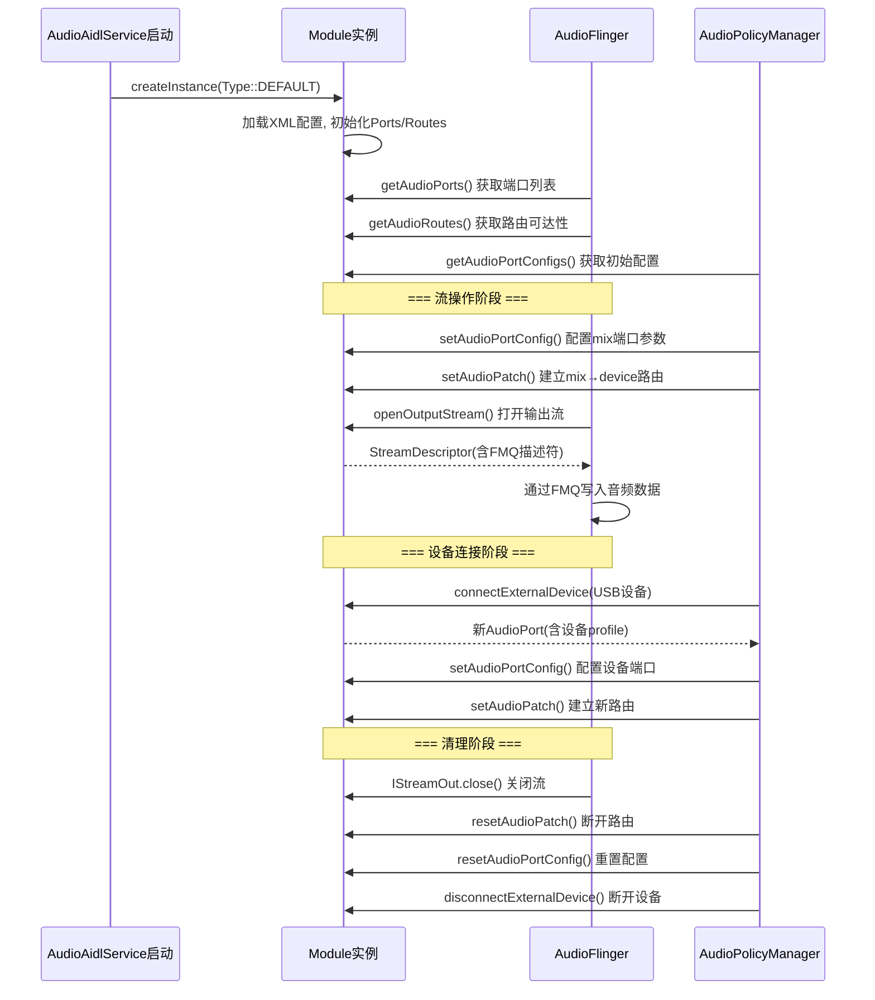
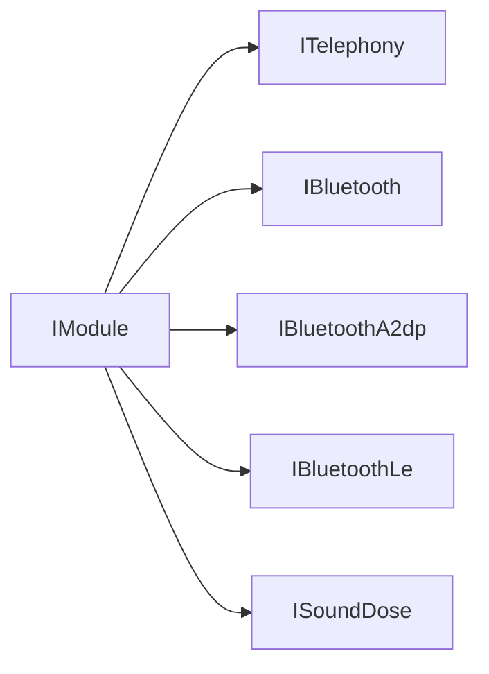
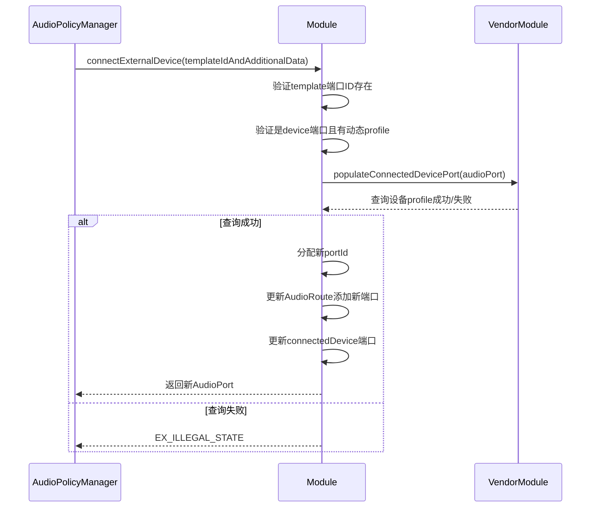
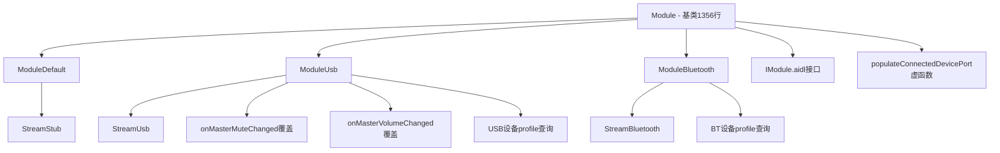

## 8.8 IModule AIDL接口 — HAL核心入口深度解析

[← 上一个](08_8.7_AudioGain-HAL增益控制模型.md) | [← 返回第8章](README.md) | [返回导航](../README.md) | [下一个 →](08_8.9_ISoundDose_AIDL接口-声剂量HAL接口.md)

---

> **接口定义**: [`IModule.aidl`](hardware/interfaces/audio/aidl/android/hardware/audio/core/IModule.aidl) (915行, 46方法)
> **默认实现**: [`Module.cpp`](hardware/interfaces/audio/aidl/default/Module.cpp) (1356行) | [`Module.h`](hardware/interfaces/audio/aidl/default/include/core-impl/Module.h)
> **子模块**: [`ModuleUsb.cpp`](hardware/interfaces/audio/aidl/default/usb/ModuleUsb.cpp) | [`ModuleBluetooth.cpp`](hardware/interfaces/audio/aidl/default/bluetooth/ModuleBluetooth.cpp)

IModule是AIDL Audio HAL的**唯一入口接口**，替代了HIDL时代的`IDevicesFactory`。每个IModule实例对应一个独立的音频模块（主DSP、USB音频、远程Submix等），系统可包含多个IModule实例并行运行。

### 8.8.1 IModule方法全景分类

IModule.aidl共定义46个方法，按功能分为8组：

```mermaid
graph TB
    IMODULE[IModule 46方法] --> A[流管理 3方法]
    IMODULE --> B[路由/端口 10方法]
    IMODULE --> C[音量/静音 6方法]
    IMODULE --> D[子接口getter 7方法]
    IMODULE --> E[设备连接 2方法]
    IMODULE --> F[通知 4方法]
    IMODULE --> G[音效/扩展 4方法]
    IMODULE --> H[AAudio/调试 10方法]
    
    A --> A1[openOutputStream]
    A --> A2[openInputStream]
    A --> A3[getSupportedPlaybackRateFactors]
    
    B --> B1[setAudioPatch]
    B --> B2[resetAudioPatch]
    B --> B3[getAudioPatches]
    B --> B4[setAudioPortConfig]
    B --> B5[resetAudioPortConfig]
    B --> B6[getAudioPort/getAudioPorts]
    B --> B7[getAudioPortConfigs]
    B --> B8[getAudioRoutes/ForAudioPort]
    
    C --> C1[get/setMasterMute]
    C --> C2[get/setMasterVolume]
    C --> C3[get/setMicMute]
    
    D --> D1[getTelephony]
    D --> D2[getBluetooth]
    D --> D3[getBluetoothA2dp]
    D --> D4[getBluetoothLe]
    D --> D5[getSoundDose]
    D --> D6[getMicrophones]
    D --> D7[generateHwAvSyncId]
    
    E --> E1[connectExternalDevice]
    E --> E2[disconnectExternalDevice]
    
    F --> F1[updateAudioMode]
    F --> F2[updateScreenRotation]
    F --> F3[updateScreenState]
    
    G --> G1[addDeviceEffect]
    G --> G2[removeDeviceEffect]
    G --> G3[getVendorParameters]
    G --> G4[setVendorParameters]
    
    H --> H1[setModuleDebug]
    H --> H2[getMmapPolicyInfos]
    H --> H3[supportsVariableLatency]
    H --> H4[getAAudioMixerBurstCount]
    H --> H5[getAAudioHardwareBurstMinUsec]
```



### 8.8.2 IModule生命周期全流程



### 8.8.3 流管理方法深度解析

#### openOutputStream

[`Module::openOutputStream()`](hardware/interfaces/audio/aidl/default/Module.cpp:683) — 打开输出流，返回StreamDescriptor：

```cpp
ndk::ScopedAStatus Module::openOutputStream(
        const OpenOutputStreamArguments& in_args,
        OpenOutputStreamReturn* _aidl_return) {
    // 1. 验证portConfigId对应的端口
    AudioPort* port = nullptr;
    auto status = findPortIdForNewStream(in_args.portConfigId, &port);
    if (!status.isOk()) return status;
    
    // 2. 检查是否为输出mix端口
    if (port->ext.getTag() != AudioPortExt::Tag::mix) { ... }
    
    // 3. 检查maxOpenStreamCount限制
    // 4. 创建StreamContext(FMQ)
    auto context = createStreamContext(portConfig, in_args.bufferSizeFrames, ...);
    
    // 5. 创建StreamOut实例
    _aidl_return->stream = ndk::SharedRefBase::make<StreamOut>(context, ...);
    _aidl_return->desc = context.getDescriptor();
    return ndk::ScopedAStatus::ok();
}
```

**OpenOutputStreamArguments** parcelable字段：

| 字段 | 类型 | 说明 |
|------|------|------|
| `portConfigId` | `int` | setAudioPortConfig返回的mix端口配置ID |
| `sourceMetadata` | `SourceMetadata` | 音频内容描述(usage/contentType/capturePreset) |
| `offloadInfo` | `@nullable AudioOffloadInfo` | COMPRESS_OFFLOAD必须提供 |
| `bufferSizeFrames` | `long` | 请求的最小缓冲帧数 |
| `callback` | `@nullable IStreamCallback` | NON_BLOCKING必须提供 |
| `eventCallback` | `@nullable IStreamOutEventCallback` | 可选的流事件通知 |

#### openInputStream

[`Module::openInputStream()`](hardware/interfaces/audio/aidl/default/Module.cpp:645) — 与openOutputStream对称，参数用SinkMetadata代替SourceMetadata。

#### findPortIdForNewStream

[`Module::findPortIdForNewStream()`](hardware/interfaces/audio/aidl/default/Module.cpp:257) — 流打开前的端口验证：

1. 查找portConfigId对应的AudioPortConfig
2. 通过portConfig.portId找到AudioPort
3. 验证是否已有流在portConfig上打开
4. 验证maxOpenStreamCount限制
5. PRIMARY输出端口只能有一个流

### 8.8.4 路由/端口方法深度解析

**setAudioPatch / resetAudioPatch / getAudioPatches** — 见8.3节详细解析
**setAudioPortConfig / resetAudioPortConfig** — 见8.4节详细解析

#### getAudioRoutesForAudioPort

[`Module::getAudioRoutesForAudioPort()`](hardware/interfaces/audio/aidl/default/Module.cpp:628) — 过滤特定端口的路由：

```cpp
ndk::ScopedAStatus Module::getAudioRoutesForAudioPort(
        int32_t in_portId, std::vector<AudioRoute>* _aidl_return) {
    auto routes = getAudioRoutes();
    _aidl_return->clear();
    for (auto& route : routes) {
        if (route.sinkPortId == in_portId || 
            contains(route.sourcePortIds, in_portId)) {
            _aidl_return->push_back(route);
        }
    }
    return ndk::ScopedAStatus::ok();
}
```

### 8.8.5 子接口Getter方法

所有子接口getter遵循统一模式：首次调用创建，后续返回同一实例。



| getter方法 | 默认实现 | 返回值 | 说明 |
|-----------|---------|--------|------|
| [`getTelephony()`](hardware/interfaces/audio/aidl/default/Module.cpp:388) | `make<Telephony>()` | 单例 | 电话音频控制 |
| [`getBluetooth()`](hardware/interfaces/audio/aidl/default/Module.cpp:397) | `make<Bluetooth>()` | 单例 | BT SCO/HFP |
| [`getBluetoothA2dp()`](hardware/interfaces/audio/aidl/default/Module.cpp:406) | `null` | null | 默认不支持A2DP |
| [`getBluetoothLe()`](hardware/interfaces/audio/aidl/default/Module.cpp:415) | `null` | null | 默认不支持LE Audio |
| [`getSoundDose()`](hardware/interfaces/audio/aidl/default/Module.cpp:1119) | `make<SoundDose>()` | 单例 | 声剂量 |

**单例模式实现**（以getTelephony为例）：

```cpp
ndk::ScopedAStatus Module::getTelephony(std::shared_ptr<ITelephony>* _aidl_return) {
    if (mTelephony == nullptr) {
        mTelephony = ndk::SharedRefBase::make<Telephony>();
    }
    *_aidl_return = mTelephony;
    return ndk::ScopedAStatus::ok();
}
```

### 8.8.6 设备连接方法深度解析

#### connectExternalDevice

[`Module::connectExternalDevice()`](hardware/interfaces/audio/aidl/default/Module.cpp:424) — 动态连接外部设备（USB/BT/HDMI），创建新AudioPort：



#### disconnectExternalDevice

[`Module::disconnectExternalDevice()`](hardware/interfaces/audio/aidl/default/Module.cpp:534) — 断开外部设备：

```cpp
ndk::ScopedAStatus Module::disconnectExternalDevice(int32_t in_portId) {
    // 1. 查找portId对应的AudioPort
    // 2. 验证是connected device端口
    // 3. 检查是否有active portConfig(如果有则EX_ILLEGAL_STATE)
    // 4. 移除关联AudioRoute
    // 5. 移除AudioPort
    // 6. 清理引用
    return ndk::ScopedAStatus::ok();
}
```

**设备连接/断开协议**（IModule.aidl注释）：
1. 连接: 获取端口列表 → 选择模板 → connectExternalDevice → 配置端口 → 查询路由
2. 断开: resetAudioPortConfig → disconnectExternalDevice（逆序）

### 8.8.7 音量/静音方法

| 方法 | 行号 | 实现要点 |
|------|------|---------|
| [`getMasterMute()`](hardware/interfaces/audio/aidl/default/Module.cpp:1035) | L1035 | 返回mMasterMute缓存值 |
| [`setMasterMute()`](hardware/interfaces/audio/aidl/default/Module.cpp:1041) | L1041 | 调用onMasterMuteChanged虚函数，失败恢复旧值 |
| [`getMasterVolume()`](hardware/interfaces/audio/aidl/default/Module.cpp:1056) | L1056 | 返回mMasterVolume缓存值 |
| [`setMasterVolume()`](hardware/interfaces/audio/aidl/default/Module.cpp:1062) | L1062 | 范围检查[0,1]，调用onMasterVolumeChanged虚函数 |
| [`getMicMute()`](hardware/interfaces/audio/aidl/default/Module.cpp:1081) | L1081 | 返回mMicMute缓存值 |
| [`setMicMute()`](hardware/interfaces/audio/aidl/default/Module.cpp:1087) | L1087 | 设置mMicMute，无硬件回调 |

setMasterVolume的fail-safe机制已在8.7.6详述。

### 8.8.8 通知方法

| 方法 | 说明 | Vendor使用场景 |
|------|------|---------------|
| [`updateAudioMode()`](hardware/interfaces/audio/aidl/default/Module.cpp:1099) | 通知当前AudioMode(NORMAL/RING/IN_CALL) | 电话模块调整DSP路径 |
| [`updateScreenRotation()`](hardware/interfaces/audio/aidl/default/Module.cpp:1109) | 通知屏幕旋转(0/90/180/270度) | 调整扬声器声道映射 |
| [`updateScreenState()`](hardware/interfaces/audio/aidl/default/Module.cpp:1114) | 通知屏幕开关状态 | 屏幕关闭时降低功耗 |

这三个通知方法均为**单向通知**，HAL不需要回复。默认实现仅保存状态值。

### 8.8.9 音效/扩展方法

#### addDeviceEffect / removeDeviceEffect

[`Module::addDeviceEffect()`](hardware/interfaces/audio/aidl/default/Module.cpp:1199)和[`Module::removeDeviceEffect()`](hardware/interfaces/audio/aidl/default/Module.cpp:1211)：

```cpp
ndk::ScopedAStatus Module::addDeviceEffect(int32_t in_portConfigId,
                                              const std::shared_ptr<IEffect>& in_effect) {
    // 1. 查找portConfigId
    // 2. 验证是device端口配置
    // 3. 打开effect
    // 4. 将effect绑定到端口
    LOG(DEBUG) << __func__ << ": portConfigId=" << in_portConfigId;
    return ndk::ScopedAStatus::ok();
}
```

#### VendorParameter — 见8.5节深度解析

### 8.8.10 AAudio/调试方法

| 方法/常量 | 说明 |
|----------|------|
| [`setModuleDebug()`](hardware/interfaces/audio/aidl/default/Module.cpp:368) | 设置调试配置(ModuleDebug)，仅xTS测试使用 |
| [`getMmapPolicyInfos()`](hardware/interfaces/audio/aidl/default/Module.cpp:1223) | 返回AAudio MMAP策略信息 |
| [`supportsVariableLatency()`](hardware/interfaces/audio/aidl/default/Module.cpp:1285) | 是否支持可变延迟(如A2DP/LE Audio) |
| [`getAAudioMixerBurstCount()`](hardware/interfaces/audio/aidl/default/Module.cpp:1291) | 返回AAudio mixer每周期burst数，默认DEFAULT_AAUDIO_MIXER_BURST_COUNT=2 |
| [`getAAudioHardwareBurstMinUsec()`](hardware/interfaces/audio/aidl/default/Module.cpp:1301) | 返回MMAP硬件burst最小持续时间，默认DEFAULT_AAUDIO_HARDWARE_BURST_MIN_DURATION_US=1000 |
| [`generateHwAvSyncId()`](hardware/interfaces/audio/aidl/default/Module.cpp:1128) | 生成HW AV Sync ID，用于音视频同步 |
| [`getMicrophones()`](hardware/interfaces/audio/aidl/default/Module.cpp:1093) | 返回内置麦克风信息 |

### 8.8.11 IModule vs HIDL IDevicesFactory架构对比

| 维度 | IModule (AIDL) | IDevicesFactory (HIDL) |
|------|---------------|----------------------|
| 接口范式 | 单一模块入口，子接口getter获取 | 工厂模式，按设备类型openDevice |
| 流管理 | openInputStream/openOutputStream + StreamDescriptor | openOutputDevice/openInputDevice + write/read回调 |
| 路由模型 | setAudioPatch显式路由，支持多源多目的 | 隐式路由，setDeviceConnectionState |
| 端口配置 | setAudioPortConfig细粒度控制 | 配置嵌入流参数(openDevice时设置) |
| 设备连接 | connectExternalDevice动态创建端口+profile | setDeviceConnectionState声明式 |
| 音效挂载 | addDeviceEffect设备级音效 | 无直接支持 |
| 增益控制 | setAudioPortConfig(gain) + useForVolume | StreamIn.setGain(float) |
| 子接口 | getTelephony/getBluetooth/getSoundDose | IDevice的setMode等方法 |
| 扩展性 | VendorParameter + ParcelableHolder | setParameters键值对 |
| Binder稳定性 | @VintfStability，跨版本稳定 | HIDL稳定性保证 |
| 数据传输 | FMQ共享内存零拷贝 | binder回调序列化 |

### 8.8.12 Module类继承体系



**虚函数覆盖点**（Vendor定制入口）：

| 虚函数 | 默认行为 | ModuleUsb覆盖 | ModuleBluetooth覆盖 |
|--------|---------|--------------|-------------------|
| `onMasterMuteChanged` | 返回ok(空操作) | 设置USB DAC静音 | 返回EX_UNSUPPORTED_OPERATION |
| `onMasterVolumeChanged` | 返回ok(空操作) | 设置USB DAC音量 | 返回EX_UNSUPPORTED_OPERATION |
| `populateConnectedDevicePort` | 返回ok | 查询USB设备profile | 查询BT设备profile |
| `checkAudioPatchEndpointsMatch` | 返回ok | 检查USB端点匹配 | 检查BT端点匹配 |

### 8.8.13 关键内部方法

Module.cpp除了IModule接口方法，还有多个关键内部方法支撑核心逻辑：

| 方法 | 行号 | 说明 |
|------|------|------|
| [`createInstance()`](hardware/interfaces/audio/aidl/default/Module.cpp:111) | L111 | 根据Type创建Module子类 |
| [`createStreamContext()`](hardware/interfaces/audio/aidl/default/Module.cpp:165) | L165 | 创建StreamContext(含FMQ)，kMinimumStreamBufferSizeFrames=256 |
| [`findPortIdForNewStream()`](hardware/interfaces/audio/aidl/default/Module.cpp:257) | L257 | 流打开前端口验证(5步) |
| [`registerPatch()`](hardware/interfaces/audio/aidl/default/Module.cpp:325) | L325 | 将AudioPatch注册到mPatches multimap |
| [`updateStreamsConnectedState()`](hardware/interfaces/audio/aidl/default/Module.cpp:342) | L342 | 更新流的连接状态(断开旧Patch/连接新Patch) |
| [`generateDefaultPortConfig()`](hardware/interfaces/audio/aidl/default/Module.cpp:68) | L68 | 从AudioPort生成默认AudioPortConfig |
| [`findAudioProfile()`](hardware/interfaces/audio/aidl/default/Module.cpp:96) | L96 | 查找匹配的AudioProfile |

### 8.8.14 ModuleDebug调试机制

[`ModuleDebug`](hardware/interfaces/audio/aidl/default/Module.cpp:368) 仅用于xTS测试：

```cpp
ndk::ScopedAStatus Module::setModuleDebug(const ModuleDebug& in_debug) {
    // 1. 验证simulateDeviceConnections标志
    // 2. 验证logLevel有效
    if (in_debug.logLevel != ModuleDebug::LogLevel::INFO &&
        in_debug.logLevel != ModuleDebug::LogLevel::VERBOSE) {
        return ndk::ScopedAStatus::fromExceptionCode(EX_ILLEGAL_ARGUMENT);
    }
    mDebug = in_debug;
    return ndk::ScopedAStatus::ok();
}
```

**ModuleDebug字段**：

| 字段 | 说明 |
|------|------|
| `simulateDeviceConnections` | 调试模式跳过onMasterMuteChanged/onMasterVolumeChanged等硬件操作 |
| `logLevel` | INFO/VERBOSE日志级别 |

---

[← 上一个](08_8.7_AudioGain-HAL增益控制模型.md) | [← 返回第8章](README.md) | [返回导航](../README.md) | [下一个 →](08_8.9_ISoundDose_AIDL接口-声剂量HAL接口.md)