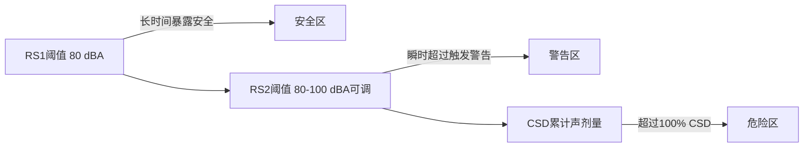
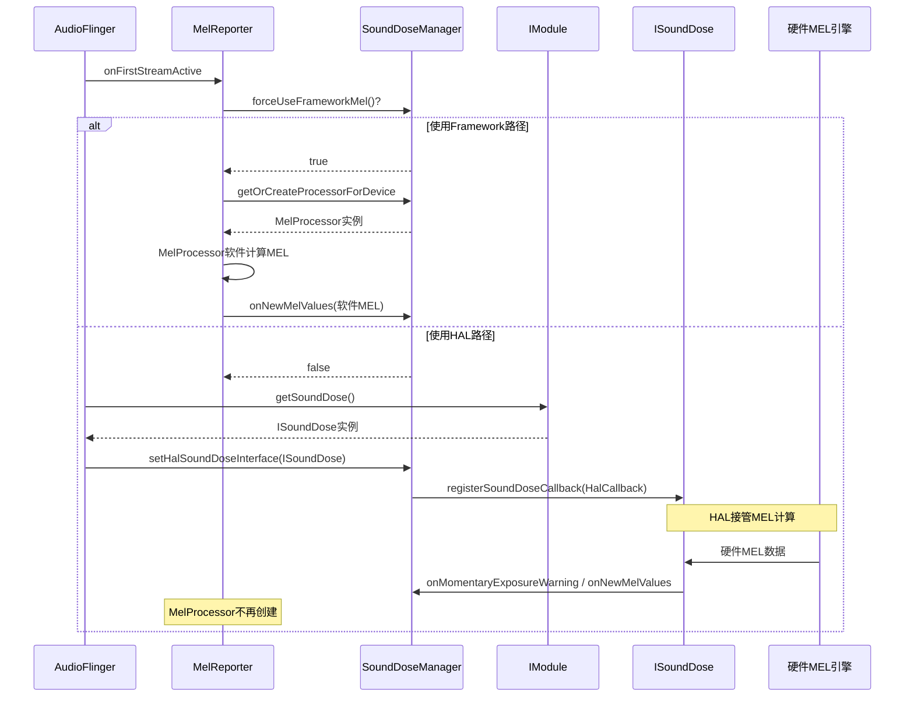
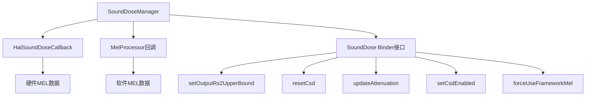

## 8.9 ISoundDose AIDL接口 — 声剂量HAL接口

[← 上一个](08_8.8_IModule_AIDL接口-HAL核心入口深度解析.md) | [← 返回第8章](README.md) | [返回导航](../README.md) | [下一个 →](08_8.10_ITelephony_AIDL接口-电话音频HAL.md)

---

> **接口定义**: [`ISoundDose.aidl`](hardware/interfaces/audio/aidl/android/hardware/audio/core/sounddose/ISoundDose.aidl) (106行)
> **默认实现**: [`SoundDose.cpp`](hardware/interfaces/audio/aidl/default/SoundDose.cpp) (58行) | [`SoundDose.h`](hardware/interfaces/audio/aidl/default/include/core-impl/SoundDose.h) (43行)
> **Framework管理**: [`SoundDoseManager.cpp`](frameworks/av/services/audioflinger/sounddose/SoundDoseManager.cpp) | [`MelReporter.cpp`](frameworks/av/services/audioflinger/MelReporter.cpp)
> **获取方式**: [`IModule.getSoundDose()`](hardware/interfaces/audio/aidl/default/Module.cpp:1119)

ISoundDose是AIDL HAL的声剂量（Sound Dose）接口，用于IEC 62368-1第3版标准合规的硬件级MEL（Momentary Exposure Level）计算。对于实现了音频Offload解码或直通播放路径（音量控制在Audio HAL之下）的设备，**必须**实现此接口。

### 8.9.1 IEC 62368-1声剂量标准核心概念

IEC 62368-1定义了声剂量安全阈值体系：



| 概念 | 定义 | 数值范围 |
|------|------|----------|
| **RS1** | 长时间暴露参考阈值 | 固定80 dBA |
| **RS2** | 瞬时暴露警告阈值 | 80-100 dBA可调 |
| **MEL** | Momentary Exposure Level，瞬时声级 | >=RS1时记录 |
| **CSD** | Cumulative Sound Dose，累计声剂量 | 7天窗口计算 |
| **DEFAULT_MAX_RS2** | RS2默认上限 | 100 dBA |
| **MIN_RS2** | RS2最低阈值 | 80 dBA |

### 8.9.2 ISoundDose接口方法详解

[`ISoundDose.aidl`](hardware/interfaces/audio/aidl/android/hardware/audio/core/sounddose/ISoundDose.aidl)定义3个方法+2个常量+1个嵌套回调接口：

| 方法 | 参数 | 返回值 | 异常 |
|------|------|--------|------|
| `setOutputRs2UpperBound(rs2ValueDbA)` | float: 80-100 dBA | void | EX_ILLEGAL_ARGUMENT: 越界 |
| `getOutputRs2UpperBound()` | 无 | float dBA值 | 无 |
| `registerSoundDoseCallback(callback)` | IHalSoundDoseCallback | void | EX_ILLEGAL_STATE: 重复注册; EX_ILLEGAL_ARGUMENT: null |

**常量定义**：
- `DEFAULT_MAX_RS2 = 100` — IEC标准默认RS2上限
- `MIN_RS2 = 80` — RS2最低阈值

#### setOutputRs2UpperBound源码解析

[`SoundDose::setOutputRs2UpperBound()`](hardware/interfaces/audio/aidl/default/SoundDose.cpp:28)：

```cpp
ndk::ScopedAStatus SoundDose::setOutputRs2UpperBound(float in_rs2ValueDbA) {
    if (in_rs2ValueDbA < MIN_RS2 || in_rs2ValueDbA > DEFAULT_MAX_RS2) {
        LOG(ERROR) << __func__ << ": RS2 value is invalid: " << in_rs2ValueDbA;
        return ndk::ScopedAStatus::fromExceptionCode(EX_ILLEGAL_ARGUMENT);
    }
    mRs2Value = in_rs2ValueDbA;
    return ndk::ScopedAStatus::ok();
}
```

**Vendor实现要点**：Vendor必须在设置RS2后立即生效，新阈值应用于后续所有MEL判断。

#### registerSoundDoseCallback源码解析

[`SoundDose::registerSoundDoseCallback()`](hardware/interfaces/audio/aidl/default/SoundDose.cpp:42)：

```cpp
ndk::ScopedAStatus SoundDose::registerSoundDoseCallback(
        const std::shared_ptr<ISoundDose::IHalSoundDoseCallback>& in_callback) {
    if (in_callback.get() == nullptr) {
        return ndk::ScopedAStatus::fromExceptionCode(EX_ILLEGAL_ARGUMENT);
    }
    if (mCallback != nullptr) {
        return ndk::ScopedAStatus::fromExceptionCode(EX_ILLEGAL_STATE);
    }
    mCallback = in_callback;
    return ndk::ScopedAStatus::ok();
}
```

**关键约束**（IModule.aidl注释）：
1. 一次性注册：不可取消，HAL需在生命周期内持续提供MEL数据
2. null检查：callback为null返回EX_ILLEGAL_ARGUMENT
3. 重复注册：第二次调用返回EX_ILLEGAL_STATE
4. 注册成功后Framework内部MEL计算被**禁用**

### 8.9.3 IHalSoundDoseCallback回调接口

[`IHalSoundDoseCallback`](hardware/interfaces/audio/aidl/android/hardware/audio/core/sounddose/ISoundDose.aidl:58)采用`oneway`异步通知：

| 回调方法 | 触发条件 | 参数 | 说明 |
|---------|---------|------|------|
| `onMomentaryExposureWarning(currentDbA, audioDevice)` | 瞬时MEL > RS2上限 | currentDbA: float; audioDevice: AudioDevice | 即时警告 |
| `onNewMelValues(melRecord, audioDevice)` | 连续MEL值可用 | MelRecord; audioDevice: AudioDevice | 每秒一条记录 |

**MelRecord parcelable**字段：

| 字段 | 类型 | 说明 |
|------|------|------|
| `melValues` | `float[]` | 每秒一个>=MIN_RS2的MEL值数组 |
| `timestamp` | `long` | CLOCK_MONOTONIC秒数，首条MEL记录时间 |

**MelRecord规则**：
- melValues每个值>=MIN_RS2(80 dBA)，低于80的不上报
- 相同timestamp的值在多个设备间会被聚合
- 多设备需分别回调（一次回调只含一个audioDevice的数据）

### 8.9.4 SoundDose类结构

[`SoundDose.h`](hardware/interfaces/audio/aidl/default/include/core-impl/SoundDose.h)：

```cpp
class SoundDose : public BnSoundDose {
  public:
    SoundDose() : mRs2Value(DEFAULT_MAX_RS2){};
    // 3个接口方法override
  private:
    std::shared_ptr<ISoundDose::IHalSoundDoseCallback> mCallback;  // HAL回调引用
    float mRs2Value;  // 当前RS2阈值，初始DEFAULT_MAX_RS2=100
};
```

**成员变量初始化**：`mRs2Value`初始值为`DEFAULT_MAX_RS2`(100 dBA)，`mCallback`初始为nullptr。

### 8.9.5 HAL vs Framework声剂量双路径



**路径选择逻辑**（[`MelReporter.cpp`](frameworks/av/services/audioflinger/MelReporter.cpp)）：

1. `SoundDoseManager::forceUseFrameworkMel()` 默认返回true → 使用Framework路径
2. 当ISoundDose可用且`registerSoundDoseCallback`成功 → HAL路径激活
3. HAL路径激活后，`getOrCreateProcessorForDevice`返回null → 不创建MelProcessor
4. HAL路径不可逆：一旦注册callback，不能回退到Framework路径

### 8.9.6 SoundDoseManager Framework侧管理

[`SoundDoseManager`](frameworks/av/services/audioflinger/sounddose/SoundDoseManager.h:35)继承`MelProcessor::MelCallback`，统一管理双路径：



**SoundDoseManager关键方法**：

| 方法 | 说明 |
|------|------|
| `setHalSoundDoseInterface(ISoundDose)` | 注册HAL接口，禁用Framework MEL |
| `getOrCreateProcessorForDevice()` | 创建MelProcessor(FW路径)或返回null(HAL路径) |
| `onNewMelValues()` | MelProcessor回调(FW路径)或HAL回调转发 |
| `onMomentaryExposure()` | 瞬时暴露警告(双路径统一) |
| `forceUseFrameworkMel()` | 是否强制使用Framework MEL(默认true) |
| `isCsdEnabled()` | CSD功能是否启用 |

### 8.9.7 IModule.getSoundDose获取路径

[`Module::getSoundDose()`](hardware/interfaces/audio/aidl/default/Module.cpp:1119) — 单例模式获取：

```cpp
ndk::ScopedAStatus Module::getSoundDose(
        std::shared_ptr<ISoundDose>* _aidl_return) {
    if (mSoundDose == nullptr) {
        mSoundDose = ndk::SharedRefBase::make<sounddose::SoundDose>();
    }
    *_aidl_return = mSoundDose;
    return ndk::ScopedAStatus::ok();
}
```

**AudioFlinger侧调用链**：
1. [`AudioFlinger`](frameworks/av/services/audioflinger/AudioFlinger.h) → `DevicesFactoryHalAidl::getSoundDoseInterface()`
2. → [`Module::getSoundDose()`](hardware/interfaces/audio/aidl/default/Module.cpp:1119) → 创建`SoundDose`单例
3. → [`SoundDoseManager::setHalSoundDoseInterface()`](frameworks/av/services/audioflinger/sounddose/SoundDoseManager.cpp:86) → 注册到Framework

### 8.9.8 Vendor实现指南

Vendor实现ISoundDose需关注以下要点：

| 要点 | 说明 |
|------|------|
| **MEL计算引擎** | 必须在DSP/HW实现MEL计算，不能依赖Framework |
| **RS2阈值生效** | setOutputRs2UpperBound后立即应用于MEL判断 |
| **callback生命周期** | 注册后需在整个HAL生命周期内持续回调 |
| **MelRecord时序** | melValues按秒排序，timestamp使用CLOCK_MONOTONIC |
| **多设备上报** | 每个audioDevice单独回调onNewMelValues |
| **Offload路径必须** | 音量控制在HAL之下的Offload路径必须实现 |
| **直通路径必须** | HDMI/USB等直通播放路径必须实现 |

**最小Vendor实现**（伪代码）：

```cpp
class VendorSoundDose : public BnSoundDose {
    // 硬件MEL计算引擎
    dsp_mel_engine_t mMelEngine;
    std::shared_ptr<IHalSoundDoseCallback> mCallback;
    float mRs2Value = DEFAULT_MAX_RS2;
    
    ScopedAStatus setOutputRs2UpperBound(float rs2) override {
        mRs2Value = rs2;
        dsp_mel_engine_set_threshold(mMelEngine, rs2);  // 立即生效
        return ok();
    }
    
    // DSP中断回调 → IHalSoundDoseCallback
    void onDspMelWarning(float currentDbA, AudioDevice dev) {
        mCallback->onMomentaryExposureWarning(currentDbA, dev);
    }
    void onDspMelData(const float* mels, size_t count, AudioDevice dev) {
        MelRecord record;
        record.melValues = std::vector(mels, mels + count);
        record.timestamp = clock_gettime(CLOCK_MONOTONIC);
        mCallback->onNewMelValues(record, dev);
    }
};
```

### 8.9.9 HIDL声剂量对比

HIDL时代无独立ISoundDose接口，声剂量功能完全由Framework软件实现。AIDL的改进：

| 维度 | AIDL ISoundDose | HIDL时代 |
|------|----------------|----------|
| 接口独立性 | 独立接口，通过IModule.getSoundDose获取 | 无HAL接口 |
| MEL计算 | 支持硬件MEL引擎(Offload必须) | 仅Framework软件计算 |
| 路径选择 | HAL优先，Framework fallback | 仅Framework路径 |
| RS2配置 | setOutputRs2UpperBound动态配置 | 固定100 dBA |
| 回调通知 | IHalSoundDoseCallback oneway异步 | 无硬件回调 |
| CSD累计 | HAL提供MelRecord，Framework聚合 | Framework自行计算 |
| 适用场景 | Offload/直通/低延迟路径 | 仅软件混音路径 |

### 8.9.10 AAOS车载声剂量考量

车载场景下声剂量合规的特殊性：

| 场景 | 说明 |
|------|------|
| **车内扬声器** | 车载扬声器功率大(可达100+ dBA)，MEL超标风险高 |
| **Offload路径** | 车载多用DSP Offload解码，音量在HAL之下控制 |
| **多音区** | 不同zone可能有不同RS2阈值(驾驶区更严格) |
| **蓝牙耳机** | BT A2dp Offload路径需单独MEL计算 |
| **紧急通知** | 紧急音频(Emergency Alert)可临时豁免RS2限制 |

---

[← 上一个](08_8.8_IModule_AIDL接口-HAL核心入口深度解析.md) | [← 返回第8章](README.md) | [返回导航](../README.md) | [下一个 →](08_8.10_ITelephony_AIDL接口-电话音频HAL.md)