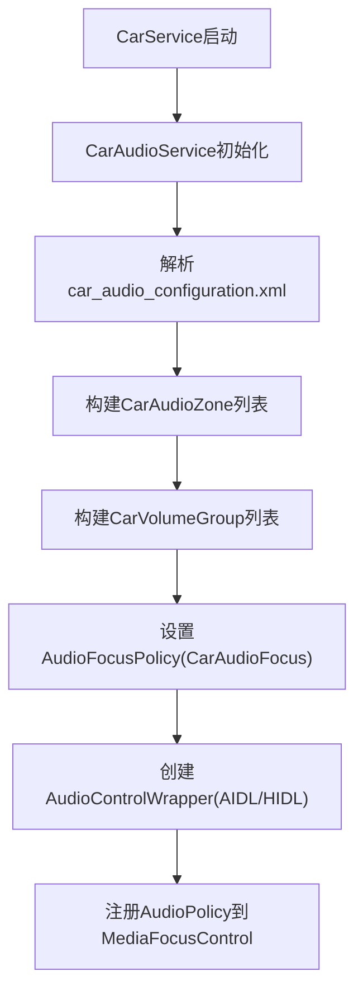
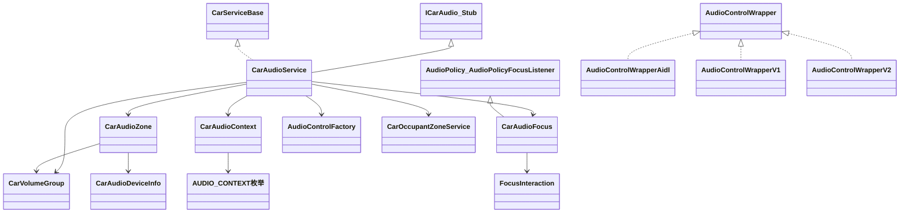
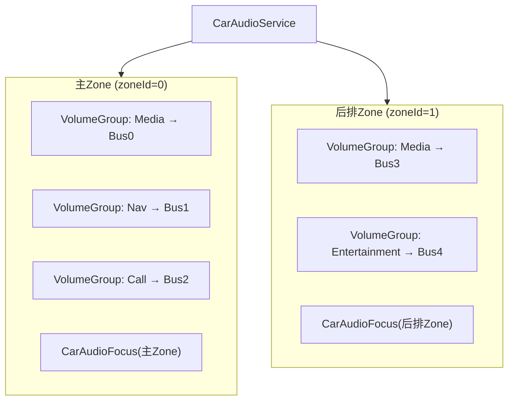
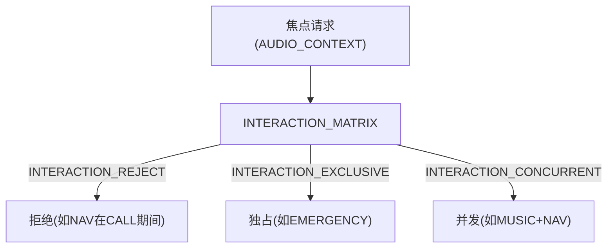
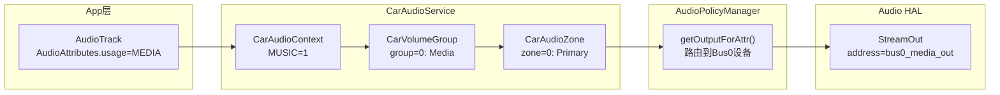
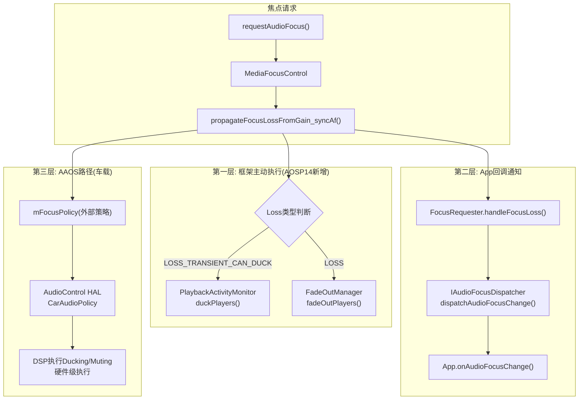

# 第九篇：AAOS Car Audio

> [← 上一篇：HAL Layer](08_HAL_Layer.md) | [返回导航](README.md) | [下一篇：AudioControl HAL →](10_AudioControl_HAL.md)

---

## 9.1 AAOS音频系统总览

### AAOS vs 标准Android Audio

AAOS（Android Automotive OS）在标准Android Audio之上增加了车载特有能力：

| 维度 | 标准Android | AAOS |
|------|-------------|------|
| 音频Zone | 单Zone（所有音频到同一输出） | 多Zone（主Zone/后排Zone/乘客Zone） |
| 焦点管理 | MediaFocusControl栈 | CarAudioFocus + 交互矩阵 |
| 音量控制 | Stream Type音量 | VolumeGroup音量 + 车载音量组 |
| 设备映射 | AudioPolicyManager路由 | CarAudioZone → Bus地址映射 |
| HAL交互 | Audio HAL | Audio HAL + AudioControl HAL |
| 紧急音频 | 无特殊处理 | 紧急/安全音频强制输出 |
| Ducking | App自行处理 | 系统级自动Ducking（导航ducking音乐） |

### 为什么AAOS需要这些扩展？

1. **多Zone**: 车内不同座位听不同音频（主驾导航，后排看电影）
2. **安全优先**: 紧急报警、安全提示必须立即播放，不受焦点限制
3. **并发需求**: 音乐和导航可以同时播放（导航ducking音乐）
4. **OEM深度定制**: 车厂需要完全控制音频路由和焦点策略

---

## 9.2 CarAudioService — 车载音频核心服务

### 模块职责
[`CarAudioService`](packages/services/Car/service/src/com/android/car/audio/CarAudioService.java:152)是AAOS音频系统的核心服务，管理多Zone、车载焦点、音量组、AudioControl HAL交互。

### 初始化流程



### 核心类关系



---

## 9.3 CarAudioZone — 多Zone音频管理

### 模块职责
CarAudioZone将车内音频设备划分为独立的Zone，每个Zone有独立的输出设备、音量组、焦点策略。

### Zone架构



### Zone → Bus → 设备映射

`car_audio_configuration.xml`定义Zone与Bus地址的映射：
```xml
<zone name="primary zone" id="0" isPrimary="true">
    <volumeGroup name="media group" id="0">
        <device context="music" bus="0" address="bus0_media_out"/>
        <device context="navigation" bus="1" address="bus1_nav_out"/>
    </volumeGroup>
</zone>
```

每个Bus地址对应Audio HAL的一个输出设备，通过`setDeviceConnectionState()`注册到AudioPolicy。

---

## 9.4 CarAudioFocus — 车载焦点管理

### 模块职责
[`CarAudioFocus`](packages/services/Car/service/src/com/android/car/audio/CarAudioFocus.java)实现AAOS特有的焦点仲裁，使用交互矩阵替代标准Android的栈模型。

### 交互矩阵（[`FocusInteraction`](packages/services/Car/service/src/com/android/car/audio/FocusInteraction.java:62)）



| 交互结果 | 说明 | 对当前持有者的影响 |
|----------|------|-------------------|
| REJECT | 不授予焦点 | 无影响 |
| EXCLUSIVE | 独占焦点 | 持有者收到LOSS |
| CONCURRENT | 并发焦点 | 持有者收到LOSS_TRANSIENT_CAN_DUCK |

### 焦点决策流程

[`evaluateFocusRequestInternallyLocked()`](packages/services/Car/service/src/com/android/car/audio/CarAudioFocus.java:451)：

1. 查找当前Zone的焦点持有者列表
2. 对每个持有者，查询矩阵：`matrix[holderContext][requesterContext]`
3. 综合所有持有者的交互结果，决定最终焦点行为
4. 通知AudioControl HAL：`onAudioFocusChange(zoneId, focusChange)`

### AAOS焦点 vs 标准焦点

| 维度 | 标准Android | AAOS |
|------|-------------|------|
| 管理器 | MediaFocusControl(栈) | CarAudioFocus(矩阵) |
| 决策方式 | LIFO栈入出 | 2D交互矩阵查表 |
| 并发支持 | 不支持(同一时间只有一个焦点) | 支持(音乐+导航同时) |
| Zone感知 | 无 | 每Zone独立焦点管理 |
| HAL通知 | 无 | AudioControl HAL通知 |

---

## 9.5 CarVolumeGroup — 车载音量组

### 模块职责
CarVolumeGroup将同一Zone内的音频上下文分组管理音量，每个组对应一组Bus地址。

### 音量调节链路

```mermaid
sequenceDiagram
    participant CarApp, CarAM, CarSvc, VG, AudioSvc, APS, HAL
    CarApp->>CarAM: setGroupVolume(zoneId, groupId, index)
    CarAM->>CarSvc: setGroupVolume() [Binder]
    CarSvc->>VG: CarVolumeGroup.setVolumeIndex()
    VG->>APS: setVolumeIndexForAttributes() [Binder]
    APS->>APM: VolumeGroup + 曲线映射
    APM->>HAL: setVolume() (per Bus device)
```

### 音量组配置

```xml
<volumeGroup name="media group" id="0">
    <device context="music" bus="0" address="bus0_media_out"/>
    <device context="navigation" bus="1" address="bus1_nav_out"/>
</volumeGroup>
```

同一VolumeGroup内的Bus设备共享同一个音量指数。

---

## 9.6 CarAudioContext — 车载音频上下文深度解析

### 上下文枚举（[`CarAudioContext.java:50-130`](packages/services/Car/service/src/com/android/car/audio/CarAudioContext.java:50)）

| Context | 值 | 说明 | 对应AudioAttributes.usage | 交互优先级 |
|---------|-----|------|--------------------------|-----------|
| `INVALID` | 0 | 不使用 | — | — |
| `MUSIC` | 1 | 音乐播放 | USAGE_MEDIA | 低(可被duck) |
| `NAVIGATION` | 2 | 导航提示 | USAGE_ASSISTANCE_NAVIGATION | 中(可并发+duck其他) |
| `VOICE_COMMAND` | 3 | 语音命令 | USAGE_ASSISTANT | 高(独占) |
| `CALL_RING` | 4 | 来电铃声 | USAGE_NOTIFICATION_RINGTONE | 高(独占) |
| `CALL` | 5 | 通话 | USAGE_VOICE_COMMUNICATION | 高(独占) |
| `ALARM` | 6 | 闹钟 | USAGE_ALARM | 中 |
| `NOTIFICATION` | 7 | 通知 | USAGE_NOTIFICATION | 低 |
| `SYSTEM_SOUND` | 8 | 系统音效 | USAGE_ASSISTANCE_SONIFICATION | 低 |
| `EMERGENCY` | 9 | **紧急报警(碰撞预警)** | USAGE_EMERGENCY | **最高(强制输出)** |
| `SAFETY` | 10 | **安全提示(倒车雷达)** | USAGE_SAFETY | **次高(强制输出)** |
| `VEHICLE_STATUS` | 11 | 车辆状态(安全带提醒) | USAGE_VEHICLE_STATUS | 中 |
| `ANNOUNCEMENT` | 12 | 广播通知(交通广播) | USAGE_ANNOUNCEMENT | 中 |

> **与AudioAttributes.usage的映射关系**：CarAudioContext在内部通过`CarAudioContextInfo`映射到AudioAttributes.usage。AAOS14新增了USAGE_EMERGENCY、USAGE_SAFETY、USAGE_VEHICLE_STATUS、USAGE_ANNOUNCEMENT等车载特有usage。

### CarAudioContext → Bus → HAL的完整映射链



**完整映射过程**：
1. App创建AudioTrack，设置AudioAttributes.usage=MEDIA
2. CarAudioService将usage映射为CarAudioContext.MUSIC(1)
3. 根据car_audio_configuration.xml，MUSIC属于VolumeGroup 0
4. VolumeGroup 0对应Bus地址bus0_media_out
5. AudioPolicyManager将AudioAttributes路由到Bus0设备
6. AudioFlinger打开Audio HAL的Bus0输出流
7. PCM数据通过AudioFlinger写入Bus0的StreamOut

### 焦点交互矩阵详解

[`FocusInteraction`](packages/services/Car/service/src/com/android/car/audio/FocusInteraction.java)使用2D矩阵决定不同Context之间的焦点交互：

**交互结果类型**：

| 结果 | 含义 | 对持有者 | 对请求者 |
|------|------|---------|---------|
| `REJECT` | 拒绝 | 无影响 | 焦点请求失败 |
| `EXCLUSIVE` | 独占 | 收到LOSS | 获得GAIN |
| `CONCURRENT` | 并发 | 收到LOSS_TRANSIENT_CAN_DUCK | 获得GAIN |

**典型交互场景矩阵**：

| 持有者\请求者 | MUSIC | NAV | CALL | EMERGENCY | SAFETY |
|-------------|-------|-----|------|-----------|--------|
| **MUSIC** | EXCLUSIVE | CONCURRENT | EXCLUSIVE | EXCLUSIVE | CONCURRENT |
| **NAV** | CONCURRENT | EXCLUSIVE | EXCLUSIVE | EXCLUSIVE | CONCURRENT |
| **CALL** | EXCLUSIVE | EXCLUSIVE | EXCLUSIVE | EXCLUSIVE | CONCURRENT |
| **EMERGENCY** | EXCLUSIVE | EXCLUSIVE | EXCLUSIVE | EXCLUSIVE | EXCLUSIVE |
| **SAFETY** | CONCURRENT | CONCURRENT | CONCURRENT | EXCLUSIVE | CONCURRENT |

> **关键交互规则**：
> - **MUSIC + NAV = CONCURRENT**：导航提示时音乐ducking降低音量，这是AAOS最常见的并发场景
> - **CALL + MUSIC = EXCLUSIVE**：来电时音乐停止
> - **EMERGENCY + * = EXCLUSIVE**：紧急报警强制打断一切
> - **SAFETY + * = CONCURRENT**：安全提示与任何音频并发播放（duck其他）
> - **同Context = EXCLUSIVE**：同类型音频互斥（如两首音乐不能同时播放）

> **与标准Android焦点栈的根本区别**：标准Android使用LIFO栈，新请求者总是胜出旧持有者。AAOS使用2D矩阵，允许特定Context组合并发共存，满足车内多音频同时播放的需求。

---

## 9.7 Audio Mirroring — 音频镜像

### 模块职责
Audio Mirroring允许将一个Zone的音频镜像到另一个Zone，实现多Zone同步播放同一内容。

### 使用场景
- 主驾导航提示镜像到后排（让乘客也听到导航）
- 紧急报警镜像到所有Zone

---

## 9.8 AAOS多Zone全栈调用链

### 音量调节链路

```mermaid
sequenceDiagram
    participant CarApp, CarAM, CarSvc, CZ, CVG, CAF, ACW, HAL
    CarApp->>CarAM: setGroupVolume(zoneId=0, groupId=0, index=50)
    CarAM->>CarSvc: setGroupVolume() [Binder]
    CarSvc->>CVG: CarVolumeGroup.setVolumeIndex(50)
    CarSvc->>CAF: 评估焦点是否影响音量
    CarSvc->>ACW: onAudioFocusChange()
    ACW->>HAL: IAudioControl.onAudioFocusChange() [AIDL]
    CarSvc->>APM: setVolumeIndexForAttributes() [Binder]
    APM->>AF: setStreamVolume() [Binder]
    AF->>HAL: setVolume() per Bus设备
```

### 焦点请求链路

```mermaid
sequenceDiagram
    participant App, AS, MFC, CarAF, FI, ACW, HAL
    App->>AS: requestAudioFocus(GAIN)
    AS->>MFC: requestAudioFocus()
    MFC->>MFC: 检测外部AudioPolicy
    MFC->>CarAF: onAudioFocusRequest(afi)
    CarAF->>FI: evaluateAgainstFocusHoldersLocked()
    FI-->>CarAF: INTERACTION_CONCURRENT
    CarAF->>ACW: onAudioFocusChange(zone, FOCUS_GAIN)
    ACW->>HAL: IAudioControl.onAudioFocusChange() [AIDL]
    CarAF-->>MFC: setFocusRequestResult(GRANTED)
    MFC-->>App: AUDIOFOCUS_REQUEST_GRANTED
```

### CarAudioFocus三层执行机制



**关键交互**: AOSP14中框架优先执行ducking/fadeout，再通知App。AAOS路径则由DSP硬件执行Ducking/Muting，效率最高。

---

> [← 上一篇：HAL Layer](08_HAL_Layer.md) | [返回导航](README.md) | [下一篇：AudioControl HAL →](10_AudioControl_HAL.md)