# 第九篇：AAOS Car Audio

> [← 上一篇：HAL Layer](08_HAL_Layer.md) | [返回导航](README.md) | [下一篇：AudioControl HAL →](10_AudioControl_HAL.md)

---

## 9.1 AAOS音频系统总览

### AAOS vs 标准Android Audio

AAOS（Android Automotive OS）在标准Android Audio之上增加了车载特有能力：

| 维度 | 标准Android | AAOS |
|------|-------------|------|
| 音频Zone | 单Zone（所有音频到同一输出） | 多Zone（主Zone/后排Zone/乘客Zone） |
| 焦点管理 | MediaFocusControl栈 | CarAudioFocus + 交互矩阵 |
| 音量控制 | Stream Type音量 | VolumeGroup音量 + 车载音量组 |
| 设备映射 | AudioPolicyManager路由 | CarAudioZone → Bus地址映射 |
| HAL交互 | Audio HAL | Audio HAL + AudioControl HAL |
| 紧急音频 | 无特殊处理 | 紧急/安全音频强制输出 |
| Ducking | App自行处理 | 系统级自动Ducking（导航ducking音乐） |

### 为什么AAOS需要这些扩展？

1. **多Zone**: 车内不同座位听不同音频（主驾导航，后排看电影）
2. **安全优先**: 紧急报警、安全提示必须立即播放，不受焦点限制
3. **并发需求**: 音乐和导航可以同时播放（导航ducking音乐）
4. **OEM深度定制**: 车厂需要完全控制音频路由和焦点策略

---

## 9.2 CarAudioService — 车载音频核心服务

### 模块职责
[`CarAudioService`](packages/services/Car/service/src/com/android/car/audio/CarAudioService.java:152)是AAOS音频系统的核心服务，管理多Zone、车载焦点、音量组、AudioControl HAL交互。

### 初始化流程

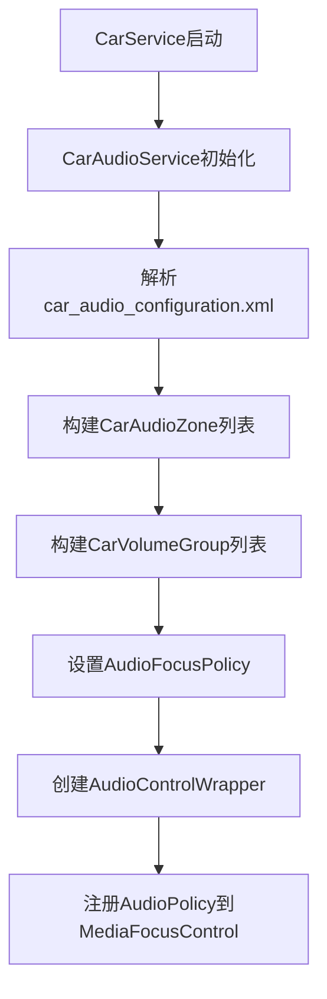

### 核心类关系


---

## 9.3 CarAudioZone — 多Zone音频管理

### 模块职责
CarAudioZone将车内音频设备划分为独立的Zone，每个Zone有独立的输出设备、音量组、焦点策略。

### Zone架构

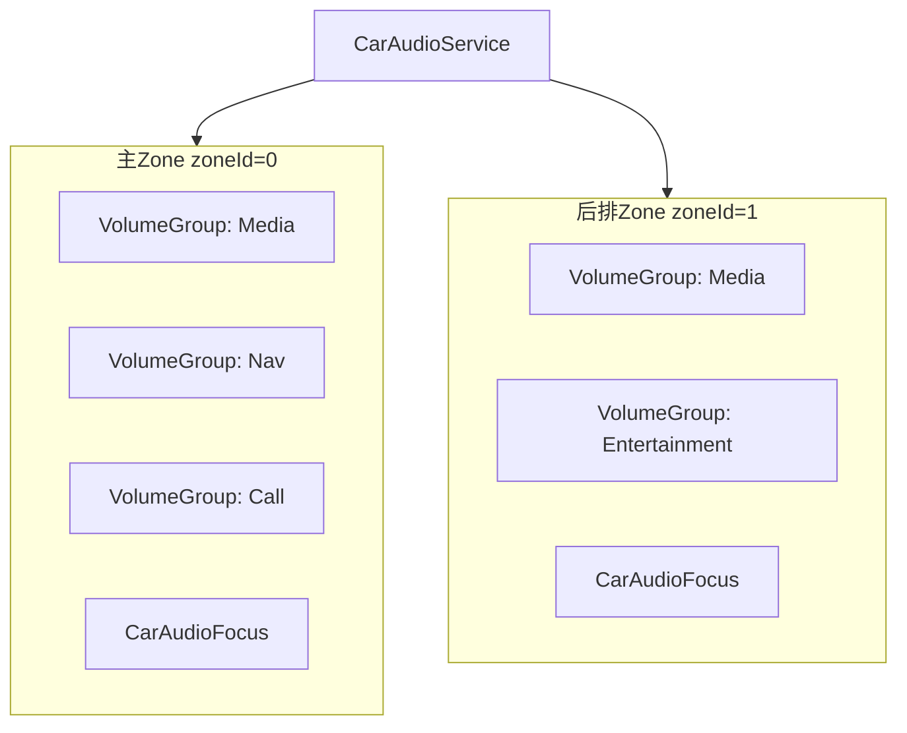

### Zone → Bus → 设备映射

`car_audio_configuration.xml`定义Zone与Bus地址的映射：
```xml
<zone name="primary zone" id="0" isPrimary="true">
    <volumeGroup name="media group" id="0">
        <device context="music" bus="0" address="bus0_media_out"/>
        <device context="navigation" bus="1" address="bus1_nav_out"/>
    </volumeGroup>
</zone>
```

每个Bus地址对应Audio HAL的一个输出设备，通过`setDeviceConnectionState()`注册到AudioPolicy。

---

## 9.4 CarAudioFocus — 车载焦点管理

### 模块职责
[`CarAudioFocus`](packages/services/Car/service/src/com/android/car/audio/CarAudioFocus.java)实现AAOS特有的焦点仲裁，使用交互矩阵替代标准Android的栈模型。

### 交互矩阵（[`FocusInteraction`](packages/services/Car/service/src/com/android/car/audio/FocusInteraction.java:62)）

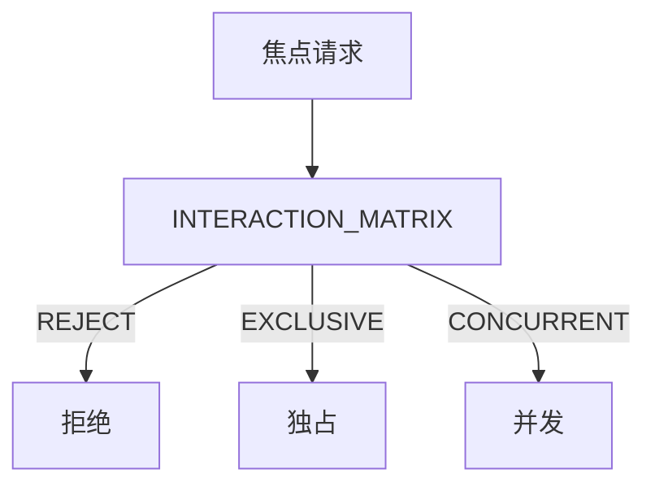

| 交互结果 | 说明 | 对当前持有者的影响 |
|----------|------|-------------------|
| REJECT | 不授予焦点 | 无影响 |
| EXCLUSIVE | 独占焦点 | 持有者收到LOSS |
| CONCURRENT | 并发焦点 | 持有者收到LOSS_TRANSIENT_CAN_DUCK |

### 焦点决策流程

[`evaluateFocusRequestInternallyLocked()`](packages/services/Car/service/src/com/android/car/audio/CarAudioFocus.java:451)：

1. 查找当前Zone的焦点持有者列表
2. 对每个持有者，查询矩阵：`matrix[holderContext][requesterContext]`
3. 综合所有持有者的交互结果，决定最终焦点行为
4. 通知AudioControl HAL：`onAudioFocusChange(zoneId, focusChange)`

### AAOS焦点 vs 标准焦点

| 维度 | 标准Android | AAOS |
|------|-------------|------|
| 管理器 | MediaFocusControl栈 | CarAudioFocus矩阵 |
| 策策方式 | LIFO栈入出 | 2D交互矩阵查表 |
| 并发支持 | 不支持 | 支持 |
| Zone感知 | 无 | 每Zone独立焦点管理 |
| HAL通知 | 无 | AudioControl HAL通知 |

---

## 9.5 CarVolumeGroup — 车载音量组

### 模块职责
CarVolumeGroup将同一Zone内的音频上下文分组管理音量，每个组对应一组Bus地址。

### 音量调节链路

```mermaid
sequenceDiagram
    participant CarApp, CarAM, CarSvc, VG, AudioSvc, APS, HAL
    CarApp->>CarAM: setGroupVolume(zoneId, groupId, index)
    CarAM->>CarSvc: setGroupVolume() [Binder]
    CarSvc->>VG: CarVolumeGroup.setVolumeIndex()
    VG->>APS: setVolumeIndexForAttributes()
    APS->>APM: VolumeGroup + 曲线映射
    APM->>HAL: setVolume() per Bus device
```

### 音量组配置

```xml
<volumeGroup name="media group" id="0">
    <device context="music" bus="0" address="bus0_media_out"/>
    <device context="navigation" bus="1" address="bus1_nav_out"/>
</volumeGroup>
```

同一VolumeGroup内的Bus设备共享同一个音量指数。

---

## 9.6 CarAudioContext — 车载音频上下文深度解析

### 上下文枚举（[`CarAudioContext.java:50-130`](packages/services/Car/service/src/com/android/car/audio/CarAudioContext.java:50)）

| Context | 值 | 说明 | 对应AudioAttributes.usage | 交互优先级 |
|---------|-----|------|--------------------------|-----------|
| `INVALID` | 0 | 不使用 | — | — |
| `MUSIC` | 1 | 音乐播放 | USAGE_MEDIA | 低(可被duck) |
| `NAVIGATION` | 2 | 导航提示 | USAGE_ASSISTANCE_NAVIGATION | 中(可并发+duck其他) |
| `VOICE_COMMAND` | 3 | 语音命令 | USAGE_ASSISTANT | 高(独占) |
| `CALL_RING` | 4 | 来电铃声 | USAGE_NOTIFICATION_RINGTONE | 高(独占) |
| `CALL` | 5 | 通话 | USAGE_VOICE_COMMUNICATION | 高(独占) |
| `ALARM` | 6 | 闹钟 | USAGE_ALARM | 中 |
| `NOTIFICATION` | 7 | 通知 | USAGE_NOTIFICATION | 低 |
| `SYSTEM_SOUND` | 8 | 系统音效 | USAGE_ASSISTANCE_SONIFICATION | 低 |
| `EMERGENCY` | 9 | **紧急报警** | USAGE_EMERGENCY | **最高(强制输出)** |
| `SAFETY` | 10 | **安全提示** | USAGE_SAFETY | **次高(强制输出)** |
| `VEHICLE_STATUS` | 11 | 车辆状态 | USAGE_VEHICLE_STATUS | 中 |
| `ANNOUNCEMENT` | 12 | 广播通知 | USAGE_ANNOUNCEMENT | 中 |

### CarAudioContext → Bus → HAL的完整映射链

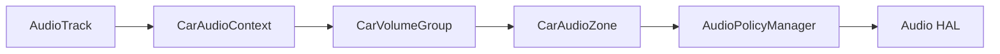

### 焦点交互矩阵详解

**交互结果类型**：

| 结果 | 含义 | 对持有者 | 对请求者 |
|------|------|---------|---------|
| `REJECT` | 拒绝 | 无影响 | 焦点请求失败 |
| `EXCLUSIVE` | 独占 | 收到LOSS | 获得GAIN |
| `CONCURRENT` | 并发 | 收到LOSS_TRANSIENT_CAN_DUCK | 获得GAIN |

**典型交互场景矩阵**：

| 持有者\请求者 | MUSIC | NAV | CALL | EMERGENCY | SAFETY |
|-------------|-------|-----|------|-----------|--------|
| **MUSIC** | EXCLUSIVE | CONCURRENT | EXCLUSIVE | EXCLUSIVE | CONCURRENT |
| **NAV** | CONCURRENT | EXCLUSIVE | EXCLUSIVE | EXCLUSIVE | CONCURRENT |
| **CALL** | EXCLUSIVE | EXCLUSIVE | EXCLUSIVE | EXCLUSIVE | CONCURRENT |
| **EMERGENCY** | EXCLUSIVE | EXCLUSIVE | EXCLUSIVE | EXCLUSIVE | EXCLUSIVE |
| **SAFETY** | CONCURRENT | CONCURRENT | CONCURRENT | EXCLUSIVE | CONCURRENT |

---

## 9.7 Audio Mirroring — 音频镜像

### 模块职责
Audio Mirroring允许将一个Zone的音频镜像到另一个Zone，实现多Zone同步播放同一内容。

### 使用场景
- 主驾导航提示镜像到后排
- 紧急报警镜像到所有Zone

---

## 9.8 AAOS多Zone全栈调用链

### 音量调节链路

```mermaid
sequenceDiagram
    participant CarApp, CarAM, CarSvc, CZ, CVG, CAF, ACW, HAL
    CarApp->>CarAM: setGroupVolume(zoneId=0, groupId=0, index=50)
    CarAM->>CarSvc: setGroupVolume() [Binder]
    CarSvc->>CVG: CarVolumeGroup.setVolumeIndex(50)
    CarSvc->>CAF: 评估焦点是否影响音量
    CarSvc->>ACW: onAudioFocusChange()
    ACW->>HAL: IAudioControl.onAudioFocusChange() [AIDL]
    CarSvc->>APM: setVolumeIndexForAttributes()
    APM->>AF: setStreamVolume()
    AF->>HAL: setVolume() per Bus设备
```

### 焦点请求链路

```mermaid
sequenceDiagram
    participant App, AS, MFC, CarAF, FI, ACW, HAL
    App->>AS: requestAudioFocus(GAIN)
    AS->>MFC: requestAudioFocus()
    MFC->>MFC: 检测外部AudioPolicy
    MFC->>CarAF: onAudioFocusRequest(afi)
    CarAF->>FI: evaluateAgainstFocusHoldersLocked()
    FI-->>CarAF: INTERACTION_CONCURRENT
    CarAF->>ACW: onAudioFocusChange(zone, FOCUS_GAIN)
    ACW->>HAL: IAudioControl.onAudioFocusChange()
    CarAF-->>MFC: setFocusRequestResult(GRANTED)
    MFC-->>App: AUDIOFOCUS_REQUEST_GRANTED
```

### CarAudioFocus三层执行机制

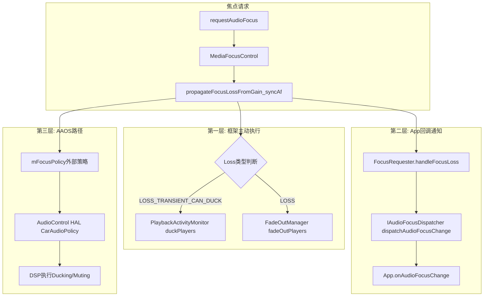

---

## 9.9 CarAudioZoneConfig — Zone配置管理

### 模块职责

[`CarAudioZoneConfig`](packages/services/Car/service/src/com/android/car/audio/CarAudioZoneConfig.java:52)封装单个Zone的音频配置，包含`CarVolumeGroup`列表、设备地址到GroupId的映射、以及Dynamic Mix路由验证逻辑。一个Zone可以拥有多个Config（如默认配置和备用配置），支持运行时切换。

### 核心数据结构

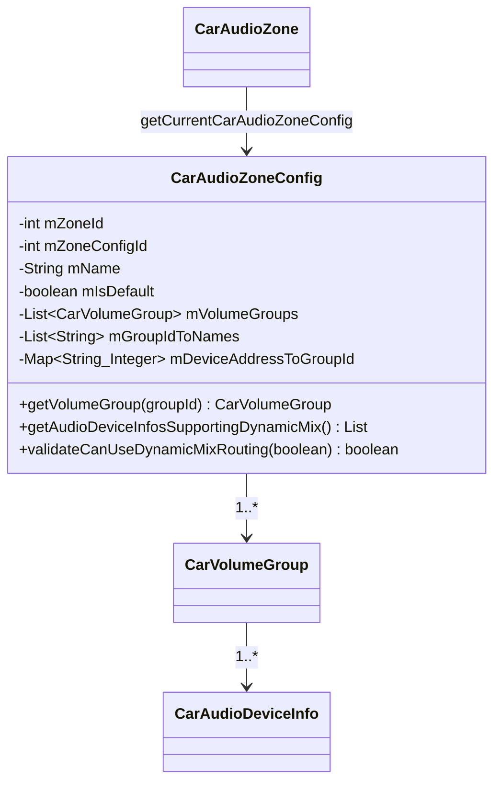

### 多配置切换机制

AAOS14支持同一Zone内多个`CarAudioZoneConfig`，通过`isDefault`标记默认配置：

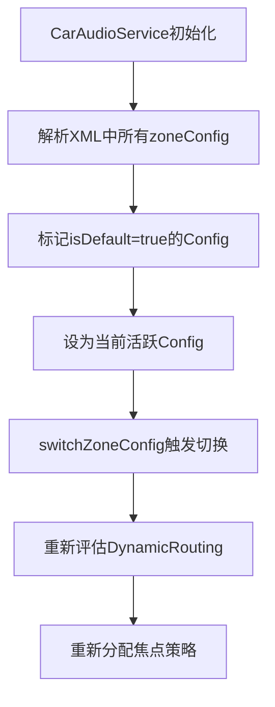

### validateCanUseDynamicMixRouting验证

[`validateCanUseDynamicMixRouting()`](packages/services/Car/service/src/com/android/car/audio/CarAudioZoneConfig.java:159)验证两个关键约束：
1. **同一usage不能路由到两个不同设备地址**：Dynamic Mix仅支持usage级别匹配，同一usage路由到不同地址会导致规则冲突
2. **同一地址不能出现在两个VolumeGroup中**：AudioPolicy无法为同一地址建立多条路由规则

当`useCoreAudioRouting=true`时，冲突设备会被标记`resetCanBeRoutedWithDynamicPolicyMix()`而非直接返回false，允许Core Audio路由兜底。

---

## 9.10 CarZonesAudioFocus — 多Zone焦点分发器

### 模块职责

[`CarZonesAudioFocus`](packages/services/Car/service/src/com/android/car/audio/CarZonesAudioFocus.java:52)继承`AudioPolicy.AudioPolicyFocusListener`，是AAOS多Zone焦点管理的顶层分发器。它为每个Zone维护独立的`CarAudioFocus`实例，实现Zone间焦点隔离。

### 架构设计

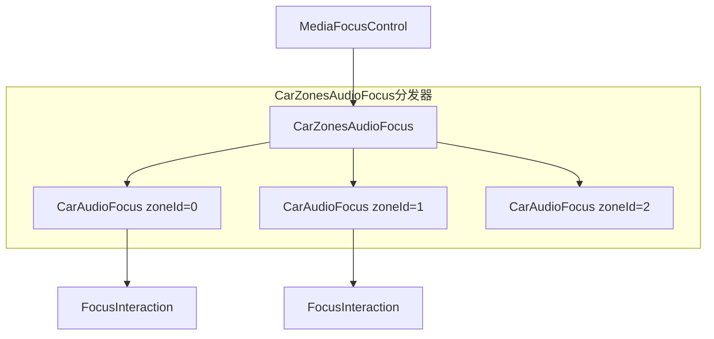

### Per-Zone焦点实例创建

[`createCarZonesAudioFocus()`](packages/services/Car/service/src/com/android/car/audio/CarZonesAudioFocus.java:61)为每个Zone创建独立的焦点管理器：

```mermaid
sequenceDiagram
    participant CAS, CZAF, Zone0, Zone1, MFC
    CAS->>CZAF: createCarZonesAudioFocus(zones)
    CZAF->>Zone0: new CarAudioFocus(zoneId=0, FocusInteraction)
    CZAF->>Zone1: new CarAudioFocus(zoneId=1, FocusInteraction)
    CZAF-->>CAS: 返回CarZonesAudioFocus
    CAS->>MFC: setFocusPolicy(audioPolicy)
    MFC->>CZAF: onAudioFocusRequest回调
    CZAF->>Zone0: 根据zoneId分发焦点请求
```

每个`CarAudioFocus`实例拥有独立的`FocusInteraction`（交互矩阵）和`CarAudioContext`（上下文映射），确保Zone间焦点决策完全独立。

---

## 9.11 CarAudioDynamicRouting — 动态路由构建

### 模块职责

[`CarAudioDynamicRouting`](packages/services/Car/service/src/com/android/car/audio/CarAudioDynamicRouting.java:41)负责将XML配置中的Zone/VolumeGroup/Bus地址映射转换为`AudioMixingRule`+`AudioPolicy`注册，实现AAOS特有的动态音频路由。

### 路由构建流程

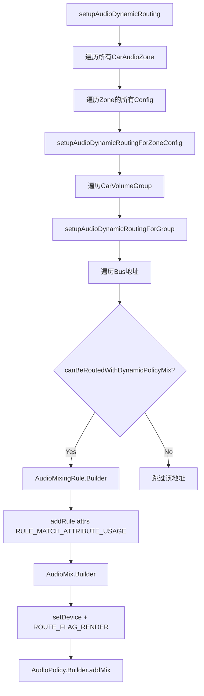

### AudioMixingRule构建细节

[`setupAudioDynamicRoutingForGroup()`](packages/services/Car/service/src/com/android/car/audio/CarAudioDynamicRouting.java:81)对每个Bus地址：
1. 查询该地址关联的所有`contextIdsForAddress`
2. 对每个context，获取对应的`AudioAttributes[]`数组
3. 逐个添加`RULE_MATCH_ATTRIBUTE_USAGE`规则
4. 构建`AudioMix`：设置`AudioFormat`（采样率/编码/声道）、目标设备、`ROUTE_FLAG_RENDER`

### 镜像设备路由

[`setupAudioDynamicRoutingForMirrorDevice()`](packages/services/Car/service/src/com/android/car/audio/CarAudioDynamicRouting.java:131)为镜像设备单独建立路由规则，使用`USAGE_MEDIA`作为匹配规则。

---

## 9.12 CarVolume — 音量优先级算法

### 模块职责

[`CarVolume`](packages/services/Car/service/src/com/android/car/audio/CarVolume.java:64)负责确定音量调节时应优先响应的音频Context，实现"按键音量跟随最活跃音频"的逻辑。

### V1/V2优先级列表

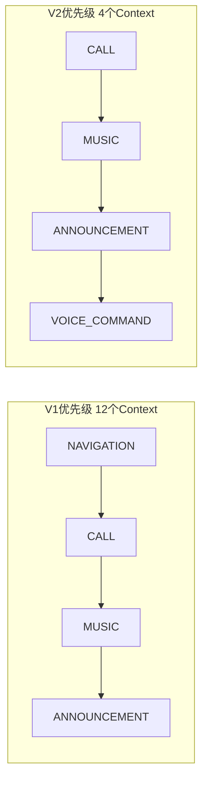

| 版本 | 优先级数量 | 设计理念 | 适用场景 |
|------|-----------|---------|---------|
| V1 | 12个Context全覆盖 | 细粒度优先级，每个Context独立排序 | 全功能车载系统 |
| V2 | 4个核心Context | 精简优先级，仅关注关键音频 | 简化车载系统 |

> V1优先级中NAVIGATION最高（最先响应导航音量键），V2中CALL最高。

### getSuggestedAudioContextAndSaveIfFound算法

[`getSuggestedAudioContextAndSaveIfFound()`](packages/services/Car/service/src/com/android/car/audio/CarVolume.java:182)的决策流程：

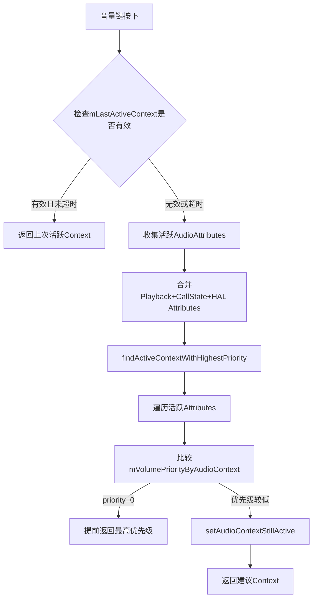

**超时机制**：`mVolumeKeyEventTimeoutMs`控制上次活跃Context的有效期，超时后重新评估当前活跃音频。

---

## 9.13 CarAudioGainMonitor — HAL Gain事件分发

### 模块职责

[`CarAudioGainMonitor`](packages/services/Car/service/src/com/android/car/audio/CarAudioGainMonitor.java:38)管理AudioControl HAL的Gain回调注册，并将HAL Gain变更事件按Zone分发，生成`CarVolumeGroupEvent`通知上层。

### Gain事件处理链路

```mermaid
sequenceDiagram
    participant HAL, ACW, CAGM, Zone, VG, CVI
    HAL->>ACW: IAudioGainCallback.onAudioDeviceGainsChanged
    ACW->>CAGM: handleAudioDeviceGainsChanged(reasons, gains)
    CAGM->>CAGM: 按ZoneId分组gains
    CAGM->>Zone: onAudioGainChanged(reasons, zoneGains)
    Zone->>VG: CarVolumeGroup.onAudioGainChanged
    VG-->>Zone: 生成CarVolumeGroupEvent列表
    Zone-->>CAGM: 返回events
    CAGM->>CVI: onVolumeGroupEvent(events)
```

### Reasons枚举与ExtraInfo映射

[`REASONS_TO_EXTRA_INFO`](packages/services/Car/service/src/com/android/car/audio/CarAudioGainMonitor.java:137)将HAL Reasons映射到CarVolumeGroupEvent ExtraInfo：

| Reasons（HAL层） | ExtraInfo（Framework层） | 说明 |
|------------------|------------------------|------|
| FORCED_MASTER_MUTE | EXTRA_INFO_NONE | 强制主静音 |
| REMOTE_MUTE | EXTRA_INFO_MUTE_TOGGLED_BY_AUDIO_SYSTEM | 远程静音 |
| TCU_MUTE | EXTRA_INFO_MUTE_TOGGLED_BY_EMERGENCY | TCU紧急静音 |
| ADAS_DUCKING | EXTRA_INFO_TRANSIENT_ATTENUATION_EXTERNAL | ADAS外部衰减 |
| NAV_DUCKING | EXTRA_INFO_TRANSIENT_ATTENUATION_NAVIGATION | 导航衰减 |
| PROJECTION_DUCKING | EXTRA_INFO_TRANSIENT_ATTENUATION_PROJECTION | 投射衰减 |
| THERMAL_LIMITATION | EXTRA_INFO_TRANSIENT_ATTENUATION_THERMAL | 温度限制 |
| SUSPEND_EXIT_VOL_LIMITATION | EXTRA_INFO_ATTENUATION_ACTIVATION | 挂起恢复限制 |
| EXTERNAL_AMP_VOL_FEEDBACK | EXTRA_INFO_VOLUME_INDEX_CHANGED_BY_AUDIO_SYSTEM | 外部放大器反馈 |

### Gain事件分类判断

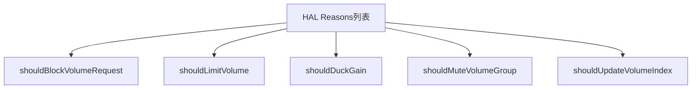

---

## 9.14 CarDucking — AAOS系统级Ducking

### 模块职责

[`CarDucking`](packages/services/Car/service/src/com/android/car/audio/CarDucking.java:40)实现AAOS系统级自动Ducking。当焦点变化时，自动计算需要duck的设备列表，通知AudioControl HAL执行硬件级Ducking。

### Ducking执行流程

```mermaid
sequenceDiagram
    participant CAF, CZAF, CDuck, Zone, Utils, ACW, HAL
    CAF->>CZAF: evaluateFocusRequest结果
    CZAF->>CDuck: onFocusChange(zoneIds, focusHolders)
    CDuck->>Zone: getCurrentVolumeGroupInfos
    CDuck->>Utils: getAudioAttributesHoldingFocus
    CDuck->>CDuck: evaluateAttributesToDuck
    CDuck->>Utils: generateDuckingInfo
    CDuck->>ACW: onDevicesToDuckChange(duckingInfos)
    ACW->>HAL: IAudioControl.setDevicesToDuckChange
```

### Ducking评估策略

[`evaluateAttributesToDuck()`](packages/services/Car/service/src/com/android/car/audio/CarDucking.java:129)支持两种评估路径：

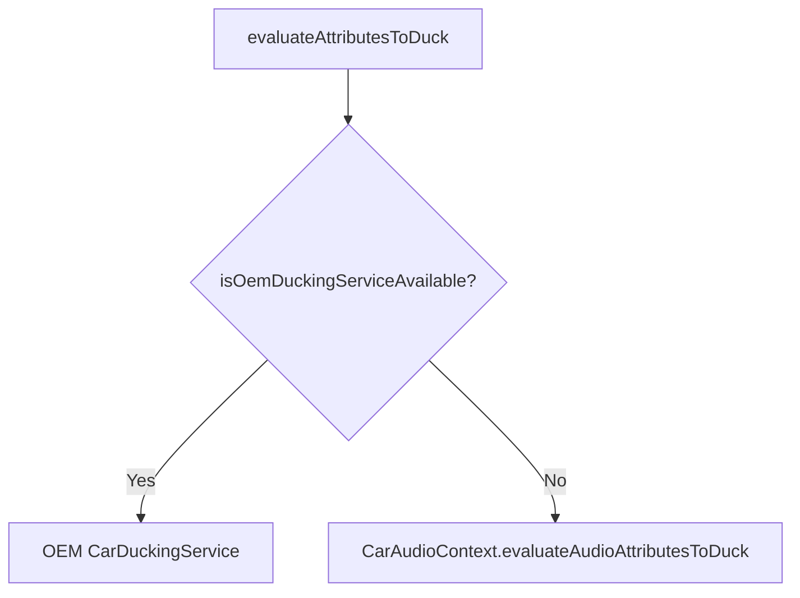

**默认AAOS策略**：当NAVIGATION持有焦点时，MUSIC类Attribute需要duck；EMERGENCY/SAFETY持有焦点时，所有非安全Attribute需要duck。

### CarDuckingInfo数据结构

[`CarDuckingInfo`](packages/services/Car/service/src/com/android/car/audio/CarDuckingInfo.java:37)封装每个Zone的Ducking状态：
- `mZoneId`：Zone标识
- `mAddressesToDuck`：需要duck的设备地址列表
- `mAddressesToUnduck`：需要取消duck的设备地址列表
- `mPlaybackAttributesHoldingFocus`：当前持有焦点的AudioAttributes

---

## 9.15 CarAudioMirrorRequestHandler — 音频镜像请求管理

### 模块职责

[`CarAudioMirrorRequestHandler`](packages/services/Car/service/src/com/android/car/audio/CarAudioMirrorRequestHandler.java:44)管理音频镜像请求的全生命周期，维护requestId到镜像设备、requestId到Zone列表、Zone到requestId的三重映射关系。

### 三重映射数据结构

```mermaid
classDiagram
    class CarAudioMirrorRequestHandler {
        -SparseArray~String~ mRequestIdToMirrorDevice
        -SparseArray~List_Integer~ mRequestIdToZones
        -Map~Integer_Integer~ mZonesToMirrorRequestId
        +enableMirrorForZones(requestId, zones)
        +rejectMirrorForZones(requestId, zones)
        +updateRemoveMirrorConfigurationForZones(zones)
    }
```

| 映射 | 类型 | 说明 |
|------|------|------|
| `mRequestIdToMirrorDevice` | SparseArray<String> | requestId → 镜像设备地址 |
| `mRequestIdToZones` | SparseArray<List<Integer>> | requestId → 目标Zone列表 |
| `mZonesToMirrorRequestId` | Map<Integer, Integer> | zoneId → requestId（反向查找） |

### 镜像请求处理流程

```mermaid
sequenceDiagram
    participant App, CAS, CAMRH, ACW, HAL
    App->>CAS: requestMirrorAudioOnZones(zones)
    CAS->>CAMRH: requestMirrorAudioOnZones
    CAMRH->>CAMRH: 分配requestId + 记录映射
    CAMRH->>CAS: 返回requestId
    CAS->>ACW: onMirrorRequest(requestId)
    ACW->>HAL: IAudioControl.onMirrorRequest
    HAL-->>ACW: accept/reject
    ACW-->>CAS: 回调结果
    CAS->>CAMRH: enableMirrorForZones 或 rejectMirrorForZones
    CAMRH->>CAMRH: 更新映射表
```

### enableMirrorForZones与rejectMirrorForZones

[`enableMirrorForZones()`](packages/services/Car/service/src/com/android/car/audio/CarAudioMirrorRequestHandler.java:105)成功时将目标Zone加入映射，并更新`mZonesToMirrorRequestId`反向映射。

[`rejectMirrorForZones()`](packages/services/Car/service/src/com/android/car/audio/CarAudioMirrorRequestHandler.java:140)拒绝时清理映射记录，触发`mMirrorRequestCallback.onMirrorAudioRequestRejected()`通知App。

---

## 9.16 MediaRequestHandler — 媒体音频请求管理

### 模块职责

[`MediaRequestHandler`](packages/services/Car/service/src/com/android/car/audio/MediaRequestHandler.java:43)管理媒体音频从OccupantZone到PrimaryZone的请求协商，实现后排乘客媒体播放请求到主驾Zone的授权流程。

### 核心数据结构

```mermaid
classDiagram
    class MediaRequestHandler {
        -Map~Long_MediaAudioRequestCallback~ mMediaAudioRequestIdToCallback
        -Map~Long_OccupantZoneInfo~ mAssignedOccupants
        -Map~Long_String~ mRequestIdToApprover
        +requestMediaAudioOnPrimaryZone(occupantZoneId)
        +acceptMediaAudioRequest(requestId, approver)
        +rejectMediaAudioRequest(requestId, approver)
        +cancelMediaAudioRequest(requestId)
        +stopMediaAudioRequest(requestId)
    }
```

### 媒体请求完整生命周期

```mermaid
flowchart TB
    Req["requestMediaAudioOnPrimaryZone"] --> Assign["分配OccupantZoneInfo"]
    Assign --> GenId["生成requestId"]
    GenId --> Store["存储callback+occupant映射"]
    Store --> NotifyApprover["通知PrimaryZone Approver"]
    NotifyApprover --> Decision{"Approver决策"}
    Decision -->|"accept"| Accept["acceptMediaAudioRequest"]
    Decision -->|"reject"| Reject["rejectMediaAudioRequest"]
    Accept --> Route["路由媒体音频到PrimaryZone"]
    Reject --> Cleanup["清理映射记录"]
    Route --> Stop["stopMediaAudioRequest"]
    Stop --> FinalCleanup["最终清理所有映射"]
```

### registerPrimaryZoneMediaAudioRequestCallback

[`registerPrimaryZoneMediaAudioRequestCallback()`](packages/services/Car/service/src/com/android/car/audio/MediaRequestHandler.java:89)允许PrimaryZone注册回调，当后排乘客请求媒体播放时，通过回调通知主驾用户进行授权决策。

**典型场景**：后排儿童想看电影→请求路由到主驾Zone→主驾用户通过UI授权→媒体音频路由到主驾扬声器。

---

## 9.17 CoreAudioHelper — Core Audio路由适配

### 模块职责

[`CoreAudioHelper`](packages/services/Car/service/src/com/android/car/audio/CoreAudioHelper.java:32)是AAOS与Android Core Audio框架的桥接层，将`AudioProductStrategy`和`AudioVolumeGroup`映射到AAOS的`CarAudioContext`体系。

### 桥接架构

```mermaid
graph TB
    subgraph AAOS["AAOS层"]
        CAC["CarAudioContext"]
        CVG["CarVolumeGroup"]
    end
    subgraph Core["Core Audio层"]
        APS["AudioProductStrategy"]
        AVG["AudioVolumeGroup"]
    end
    subgraph Helper["CoreAudioHelper"]
        StrategyMap["getStrategyForAudioAttributes"]
        VolGroupMap["getVolumeGroupIdForAudioAttributes"]
    end
    CAC --> Helper
    Helper --> APS
    Helper --> AVG
    APS --> APM["AudioPolicyManager"]
    AVG --> APM
```

### StaticLazyInitializer懒加载

[`StaticLazyInitializer`](packages/services/Car/service/src/com/android/car/audio/CoreAudioHelper.java:48)使用静态懒加载模式，在首次访问时通过`AudioManager.getAudioProductStrategies()`和`AudioManager.getAudioVolumeGroups()`获取系统级路由信息：

```mermaid
sequenceDiagram
    participant CAH, SLI, AM, APM
    CAH->>SLI: getAudioProductStrategies
    SLI->>SLI: 检查是否已初始化
    SLI->>AM: getAudioProductStrategies
    AM->>APM: 查询所有策略
    APM-->>AM: 返回策略列表
    AM-->>SLI: 返回AudioProductStrategy数组
    SLI->>SLI: 缓存策略列表
    SLI-->>CAH: 返回策略
```

### 关键桥接方法

| 方法 | 功能 | 返回类型 |
|------|------|---------|
| `getStrategyForAudioAttributes` | 根据AudioAttributes查找对应AudioProductStrategy | int (strategyId) |
| `getVolumeGroupIdForAudioAttributes` | 根据AudioAttributes查找对应AudioVolumeGroup | int (groupId) |
| `getProductStrategies` | 获取所有AudioProductStrategy | AudioProductStrategy[] |
| `getVolumeGroups` | 获取所有AudioVolumeGroup | AudioVolumeGroup[] |

---

## 9.18 CarAudioZonesHelper — XML配置解析

### 模块职责

[`CarAudioZonesHelper`](packages/services/Car/service/src/com/android/car/audio/CarAudioZonesHelper.java:46)负责从`car_audio_configuration.xml`解析完整的AAOS音频配置，构建`CarAudioZone`列表、`CarVolumeGroup`列表和设备映射关系。

### XML解析完整流程

```mermaid
flowchart TB
    Load["加载car_audio_configuration.xml"] --> ParseRoot["解析TAG_ROOT"]
    ParseRoot --> ParseOEM["解析TAG_OEM_CONTEXTS"]
    ParseOEM --> BuildOEM["构建OEM Context映射"]
    ParseRoot --> ParseZones["解析TAG_AUDIO_ZONES"]
    ParseZones --> LoopZ["遍历每个zone元素"]
    LoopZ --> ParseZId["解析zoneId+isPrimary"]
    ParseZId --> ParseConfigs["解析TAG_AUDIO_ZONE_CONFIG"]
    ParseConfigs --> ParseVG["解析volumeGroup"]
    ParseVG --> ParseDev["解析device元素"]
    ParseDev --> BuildAddr["构建bus地址+context映射"]
    BuildAddr --> BuildVGObj["构建CarVolumeGroup对象"]
    BuildVGObj --> BuildZone["构建CarAudioZone对象"]
```

### XML标签层级

| 标签 | 层级 | 关键属性 | 说明 |
|------|------|---------|------|
| `<audioZoneConfiguration>` | Root | version | 配置版本(V1/V2/V3) |
| `<oemContexts>` | 1 | — | OEM自定义Context映射 |
| `<audioZones>` | 1 | — | Zone列表容器 |
| `<zone>` | 2 | id, name, isPrimary | Zone定义 |
| `<zoneConfig>` | 3 | id, name, isDefault | Zone配置 |
| `<volumeGroup>` | 4 | id, name | 音量组定义 |
| `<device>` | 5 | context, bus, address | 设备映射 |
| `<mirroringDevices>` | 3(V3) | — | 镜像设备(V3新增) |

### 版本演进

| 版本 | 新增能力 | 说明 |
|------|---------|------|
| V1 | 基础Zone+VolumeGroup+Bus | 最小功能集 |
| V2 | OEM Context映射 | 支持自定义AudioAttributes到Context映射 |
| V3 | mirroringDevices | 音频镜像设备配置 |

---

### 9.18.1 AAOS音频系统初始化完整时序图

### 从XML解析到AudioPolicy注册的完整链路

```mermaid
sequenceDiagram
    participant CS, CAZH, CAZ, CZAF, CADR, AM, MFC
    CS->>CAZH: parseCarAudioZonesConfiguration
    CAZH->>CAZH: 解析XML构建CarAudioZone列表
    CAZH-->>CS: 返回zones列表
    CS->>CZAF: createCarZonesAudioFocus(zones)
    CZAF->>CZAF: 为每个Zone创建CarAudioFocus实例
    CZAF-->>CS: 返回CarZonesAudioFocus
    CS->>CADR: setupAudioDynamicRouting(zones)
    CADR->>CADR: 构建AudioMixingRule + AudioMix
    CADR->>AM: AudioPolicy.Builder.addMix注册所有Mix
    CADR-->>CS: 返回AudioPolicy对象
    CS->>AM: registerAudioPolicy(audioPolicy)
    AM->>MFC: setFocusPolicy(audioPolicy)
    MFC-->>CS: 焦点策略已注册
    CS->>CS: CarAudioGainMonitor.registerAudioGainListener
    CS->>CS: CarDucking初始化
```

### 全模块协同关系总览

```mermaid
graph TB
    CAS["CarAudioService"] --> CAZH["CarAudioZonesHelper"]
    CAS --> CZAF["CarZonesAudioFocus"]
    CAS --> CADR["CarAudioDynamicRouting"]
    CAS --> CVolume["CarVolume"]
    CAS --> CAGM["CarAudioGainMonitor"]
    CAS --> CDuck["CarDucking"]
    CAS --> CAMRH["CarAudioMirrorRequestHandler"]
    CAS --> MRH["MediaRequestHandler"]
    CAS --> CAH["CoreAudioHelper"]
    CAZH --> CAZ["CarAudioZone"]
    CAZ --> CZC["CarAudioZoneConfig"]
    CZC --> CVG["CarVolumeGroup"]
    CZAF --> CAF["CarAudioFocus"]
    CAF --> FI["FocusInteraction"]
    CADR --> AMR["AudioMixingRule"]
    CADR --> APMix["AudioPolicy"]
    CAGM --> CVGE["CarVolumeGroupEvent"]
    CDuck --> CDI["CarDuckingInfo"]
    CAH --> APS["AudioProductStrategy"]
    CAH --> AVG["AudioVolumeGroup"]
```

---

> [← 上一篇：HAL Layer](08_HAL_Layer.md) | [返回导航](README.md) | [下一篇：AudioControl HAL →](10_AudioControl_HAL.md)