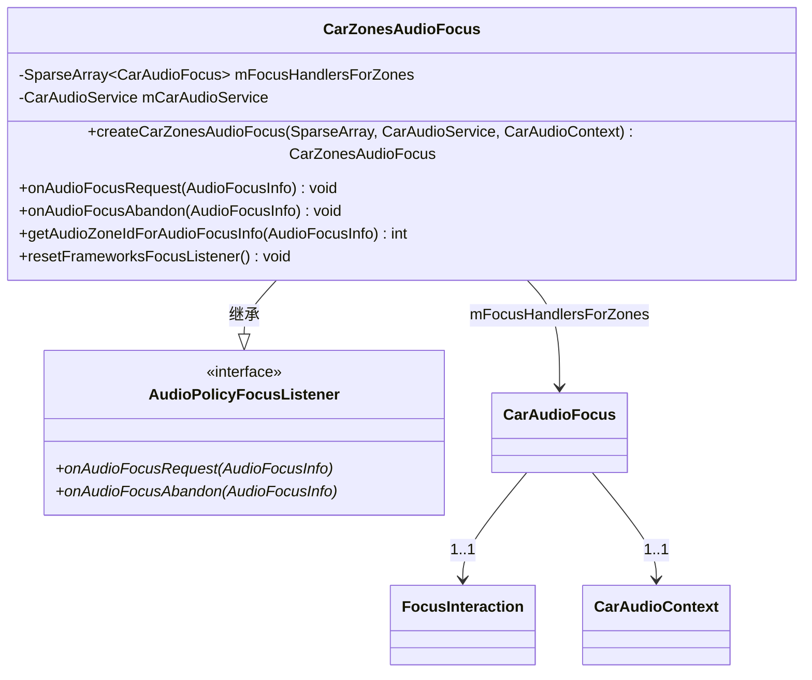
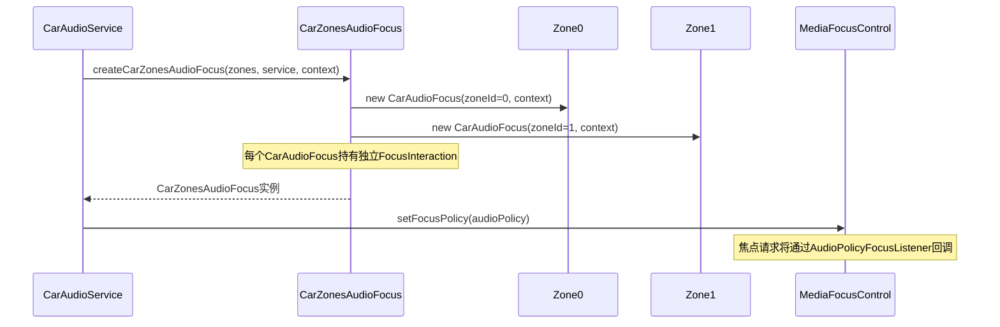
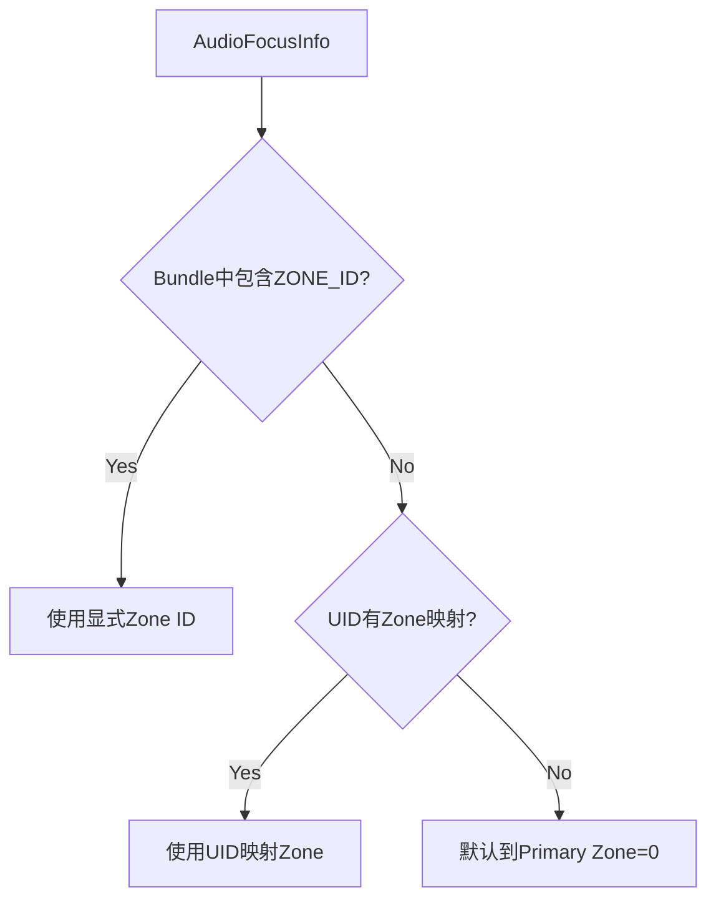
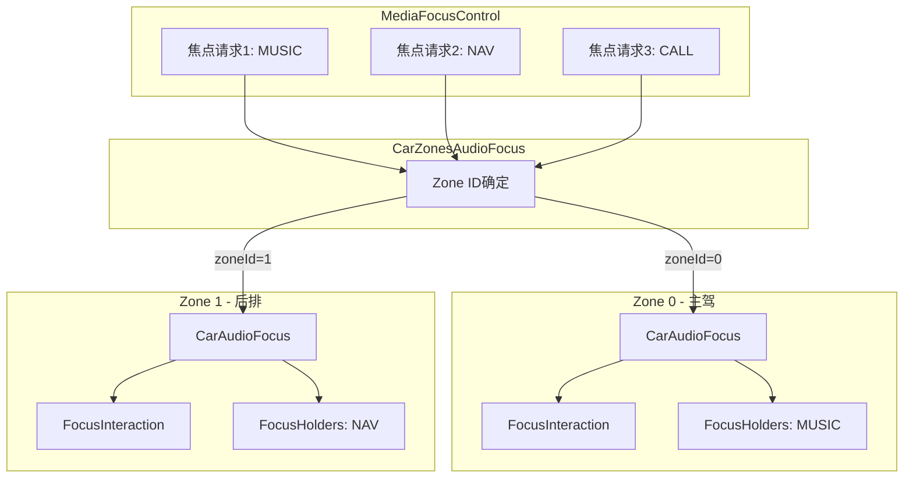
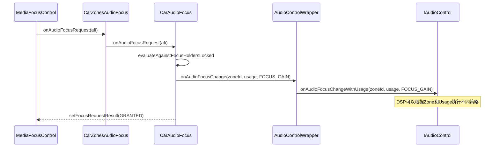

## 9.10 CarZonesAudioFocus — 多Zone焦点分发器

> [← 上一个](09_9.9_CarAudioZoneConfig-Zone配置管理.md) | [返回目录](README.md) | [下一个 →](09_9.11_CarAudioDynamicRouting-动态路由构建.md)

---

### 9.10.1 模块概述

[`CarZonesAudioFocus`](packages/services/Car/service/src/com/android/car/audio/CarZonesAudioFocus.java)继承`AudioPolicy.AudioPolicyFocusListener`，是AAOS多Zone焦点管理的**顶层分发器**。它为每个Zone维护独立的`CarAudioFocus`实例，实现Zone间焦点隔离——一个Zone的焦点变化不会影响其他Zone。

**核心职责：**
- 将MediaFocusControl的焦点请求分发到正确的Zone
- 维护Per-Zone独立`CarAudioFocus`实例与`FocusInteraction`
- 处理Zone ID确定逻辑（显式Bundle / UID映射）
- 透传焦点放弃请求到对应Zone

### 9.10.2 类结构



### 9.10.3 Per-Zone焦点实例创建

```java
// CarZonesAudioFocus.java:61
static CarZonesAudioFocus createCarZonesAudioFocus(
        SparseArray<CarAudioZone> zones,
        CarAudioService carAudioService,
        CarAudioContext carAudioContext) {
    SparseArray<CarAudioFocus> focusHandlersForZones = new SparseArray<>();
    for (int index = 0; index < zones.size(); index++) {
        CarAudioZone zone = zones.valueAt(index);
        // 每个Zone创建独立的CarAudioFocus实例
        CarAudioFocus zoneFocus = new CarAudioFocus(carAudioService,
                zone.getId(), carAudioContext);
        focusHandlersForZones.put(zone.getId(), zoneFocus);
    }
    return new CarZonesAudioFocus(focusHandlersForZones, carAudioService);
}
```

**创建时序图：**



### 9.10.4 焦点请求分发 — onAudioFocusRequest

```java
// CarZonesAudioFocus.java:211
@Override
public void onAudioFocusRequest(AudioFocusInfo afi) {
    // 1. 确定焦点请求所属Zone
    int zoneId = getAudioZoneIdForAudioFocusInfo(afi);
    // 2. 获取Zone对应的CarAudioFocus
    CarAudioFocus focusHandler = mFocusHandlersForZones.get(zoneId);
    if (focusHandler == null) {
        Slogf.e(TAG, "No focus handler for zone " + zoneId);
        return;
    }
    // 3. 分发到对应Zone的CarAudioFocus
    focusHandler.onAudioFocusRequest(afi);
}
```

### 9.10.5 Zone ID确定逻辑

```java
// CarZonesAudioFocus.java — 确定AudioFocusInfo所属Zone
private int getAudioZoneIdForAudioFocusInfo(AudioFocusInfo afi) {
    // 优先级1: 从AudioAttributes Bundle中获取显式Zone ID
    Bundle bundle = afi.getAttributes().getBundle();
    if (bundle != null && bundle.containsKey(
            CarAudioManager.AUDIOFOCUS_EXTRA_REQUEST_ZONE_ID)) {
        return bundle.getInt(CarAudioManager.AUDIOFOCUS_EXTRA_REQUEST_ZONE_ID);
    }
    // 优先级2: 通过UID到Zone的映射
    return mCarAudioService.getZoneIdForUid(afi.getUid());
}
```

**Zone ID确定优先级：**



**显式Zone ID设置方式：**

```java
// App通过Bundle指定目标Zone
Bundle bundle = new Bundle();
bundle.putInt(CarAudioManager.AUDIOFOCUS_EXTRA_REQUEST_ZONE_ID, targetZoneId);
AudioAttributes attributes = new AudioAttributes.Builder()
        .setUsage(AudioAttributes.USAGE_MEDIA)
        .addBundle(bundle)
        .build();
AudioManager.requestAudioFocus(attributes, ...);
```

### 9.10.6 焦点放弃分发 — onAudioFocusAbandon

```java
// CarZonesAudioFocus.java
@Override
public void onAudioFocusAbandon(AudioFocusInfo afi) {
    int zoneId = getAudioZoneIdForAudioFocusInfo(afi);
    CarAudioFocus focusHandler = mFocusHandlersForZones.get(zoneId);
    if (focusHandler != null) {
        focusHandler.onAudioFocusAbandon(afi);
    }
}
```

### 9.10.7 Zone间焦点隔离机制



**隔离要点：**
1. 每个Zone的`CarAudioFocus`维护独立的`FocusInteraction`交互矩阵
2. Zone0的焦点获取不会导致Zone1的焦点丢失
3. Zone1的Ducking计算完全独立于Zone0
4. `AudioControl HAL`通知携带zoneId参数，HAL可区分Zone

### 9.10.8 与AudioControl HAL的交互

当焦点变化时，`CarAudioFocus`通过`AudioControlWrapper`通知HAL：



### 9.10.9 resetFrameworksFocusListener

```java
// CarZonesAudioFocus.java
void resetFrameworksFocusListener() {
    for (int index = 0; index < mFocusHandlersForZones.size(); index++) {
        mFocusHandlersForZones.valueAt(index).resetFrameworksFocusListener();
    }
}
```

在CarAudioService释放AudioPolicy时调用，确保每个Zone的`CarAudioFocus`清除对Frameworks焦点监听器的引用。

### 9.10.10 多Zone焦点调试

```bash
# dumpsys查看各Zone焦点状态
adb shell dumpsys car_service | grep -A 20 "Audio focus"

# 输出示例:
# Zone 0 focus handler:
#   Focus holders: [MUSIC uid=10100]
#   Focus losers: []
# Zone 1 focus handler:
#   Focus holders: [NAV uid=10101]
#   Focus losers: []
```

---