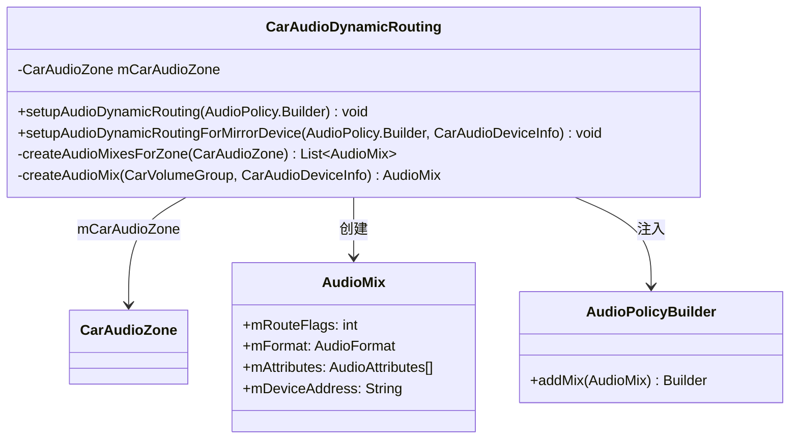
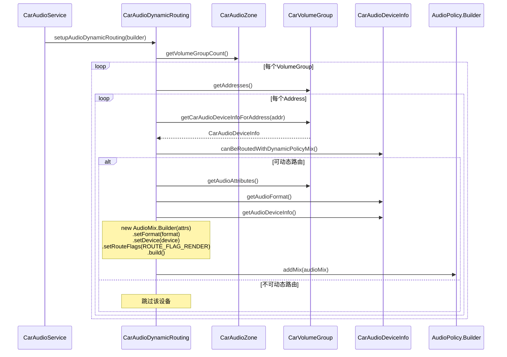
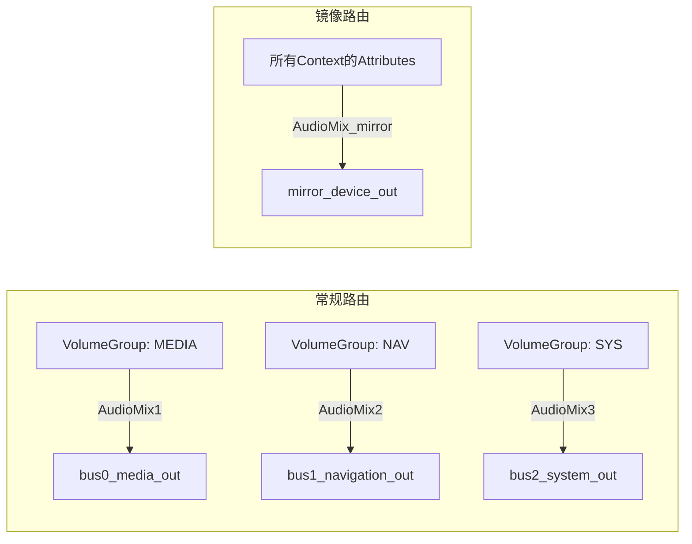
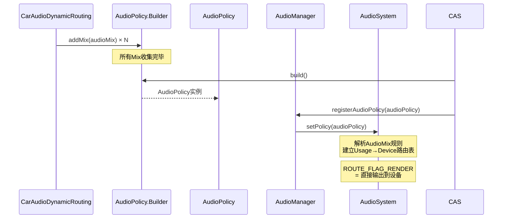
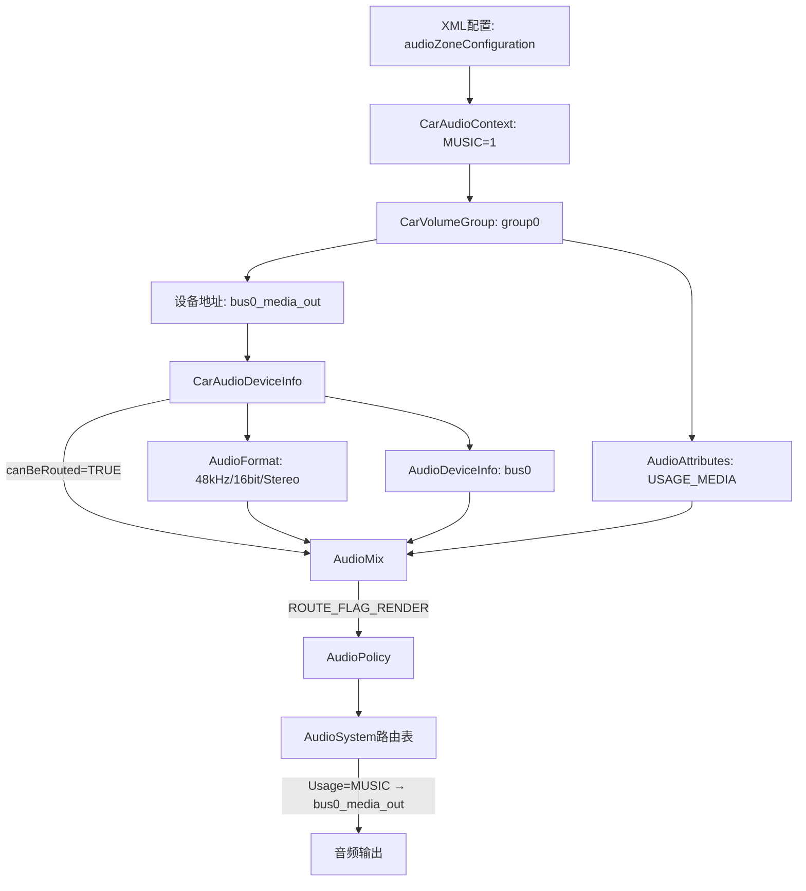

## 9.11 CarAudioDynamicRouting — 动态路由构建

> [← 上一个](09_9.10_CarZonesAudioFocus-多Zone焦点分发器.md) | [返回目录](README.md) | [下一个 →](09_9.12_CarVolume-音量优先级算法.md)

---

### 9.11.1 模块概述

[`CarAudioDynamicRouting`](packages/services/Car/service/src/com/android/car/audio/CarAudioDynamicRouting.java)负责将AAOS XML配置中的**Context→设备地址映射**转化为Android AudioPolicy可识别的**AudioMix动态路由规则**。它是配置到运行时路由的桥梁。

**核心职责：**
- 为每个CarVolumeGroup构建`AudioMix`路由规则
- 将Context的AudioAttributes绑定到对应设备地址
- 支持常规路由和镜像路由两种模式
- 通过`AudioPolicy.addMix()`注册到AudioSystem

### 9.11.2 类结构



### 9.11.3 常规动态路由构建 — setupAudioDynamicRouting

```java
// CarAudioDynamicRouting.java:55
void setupAudioDynamicRouting(AudioPolicy.Builder builder) {
    // 遍历Zone下所有VolumeGroup，为每个Group创建AudioMix
    List<AudioMix> audioMixes = createAudioMixesForZone(mCarAudioZone);
    for (AudioMix audioMix : audioMixes) {
        builder.addMix(audioMix);
    }
}
```

### 9.11.4 AudioMix创建核心逻辑

```java
// CarAudioDynamicRouting.java — createAudioMixesForZone
private List<AudioMix> createAudioMixesForZone(CarAudioZone zone) {
    List<AudioMix> audioMixes = new ArrayList<>();
    for (int i = 0; i < zone.getVolumeGroupCount(); i++) {
        CarVolumeGroup volumeGroup = zone.getCarVolumeGroup(i);
        for (String address : volumeGroup.getAddresses()) {
            // 每个设备地址对应一个CarAudioDeviceInfo
            CarAudioDeviceInfo info = volumeGroup.getCarAudioDeviceInfoForAddress(address);
            if (info != null && info.canBeRoutedWithDynamicPolicyMix()) {
                AudioMix audioMix = createAudioMix(volumeGroup, info);
                audioMixes.add(audioMix);
            }
        }
    }
    return audioMixes;
}
```

```java
// CarAudioDynamicRouting.java — createAudioMix
private AudioMix createAudioMix(CarVolumeGroup volumeGroup, CarAudioDeviceInfo info) {
    // 1. 收集VolumeGroup内所有Context对应的AudioAttributes
    AudioAttributes[] attributes = volumeGroup.getAudioAttributes();
    // 2. 构建AudioMix
    AudioMix.Builder builder = new AudioMix.Builder(attributes)
            .setFormat(info.getAudioFormat())
            .setDevice(info.getAudioDeviceInfo())
            .setRouteFlags(AudioMix.ROUTE_FLAG_RENDER);
    return builder.build();
}
```

**关键：`ROUTE_FLAG_RENDER`** 表示音频数据将渲染到指定设备，而非回环捕获。

### 9.11.5 动态路由构建时序图



### 9.11.6 镜像路由构建 — setupAudioDynamicRoutingForMirrorDevice

```java
// CarAudioDynamicRouting.java:131
void setupAudioDynamicRoutingForMirrorDevice(
        AudioPolicy.Builder builder, CarAudioDeviceInfo mirrorDeviceInfo) {
    // 收集Zone内所有Context的AudioAttributes
    List<AudioAttributes> attributesList = new ArrayList<>();
    for (int i = 0; i < mCarAudioZone.getVolumeGroupCount(); i++) {
        CarVolumeGroup volumeGroup = mCarAudioZone.getCarVolumeGroup(i);
        for (AudioAttributes attributes : volumeGroup.getAudioAttributes()) {
            attributesList.add(attributes);
        }
    }
    AudioAttributes[] attributes = attributesList.toArray(
            new AudioAttributes[0]);
    // 构建镜像AudioMix — 所有Context路由到镜像设备
    AudioMix audioMix = new AudioMix.Builder(attributes)
            .setFormat(mirrorDeviceInfo.getAudioFormat())
            .setDevice(mirrorDeviceInfo.getAudioDeviceInfo())
            .setRouteFlags(AudioMix.ROUTE_FLAG_RENDER)
            .build();
    builder.addMix(audioMix);
}
```

### 9.11.7 常规路由 vs 镜像路由对比



| 特性 | 常规路由 | 镜像路由 |
|------|----------|----------|
| AudioMix数量 | 每VolumeGroup每地址一个 | 整个Zone一个 |
| 覆盖Context | VolumeGroup内Context | Zone内所有Context |
| 目标设备 | 各自的bus设备 | 共享mirror设备 |
| 音量控制 | 独立VolumeGroup控制 | 主Zone音量控制 |
| 应用场景 | 正常多Zone播放 | 跨Zone音频镜像 |

### 9.11.8 CarAudioDeviceInfo.canBeRoutedWithDynamicPolicyMix

```java
// CarAudioDeviceInfo.java:95
boolean canBeRoutedWithDynamicPolicyMix() {
    return mCanBeRoutedWithDynamicPolicyMixRule;
}
```

该标志由`resetCanBeRoutedWithDynamicPolicyMix()`重置，基于设备类型判断是否支持动态策略混合路由：

```java
// CarAudioDeviceInfo.java
void resetCanBeRoutedWithDynamicPolicyMix() {
    mCanBeRoutedWithDynamicPolicyMixRule =
            mAudioDeviceInfo.getType() == AudioManager.DEVICE_OUT_BUS;
}
```

仅`DEVICE_OUT_BUS`类型设备支持动态路由，确保A2DP等非Bus设备不参与策略混合。

### 9.11.9 AudioMix与AudioPolicy注册流程



### 9.11.10 Context→Attributes→Device路由映射全链路



### 9.11.11 动态路由与AudioFlinger的协作

当AudioPolicy注册后，AudioFlinger的`ThreadBase`将根据路由规则：

1. App创建AudioTrack时指定`USAGE_MEDIA`
2. AudioSystem查找路由表，匹配到`bus0_media_out`对应的AudioMix
3. AudioFlinger将AudioTrack路由到bus0对应的输出线程
4. HAL层bus0输出线程将PCM数据写入对应DSP通道

### 9.11.12 调试与验证

```bash
# 查看当前AudioPolicy的Mix规则
adb shell dumpsys audio | grep -A 5 "Audio Mix"

# 查看路由表
adb shell dumpsys media.audio_flinger | grep -A 10 "Routing"

# 验证特定Usage的路由目标
adb shell dumpsys audio | grep "Usage MEDIA"
```

---