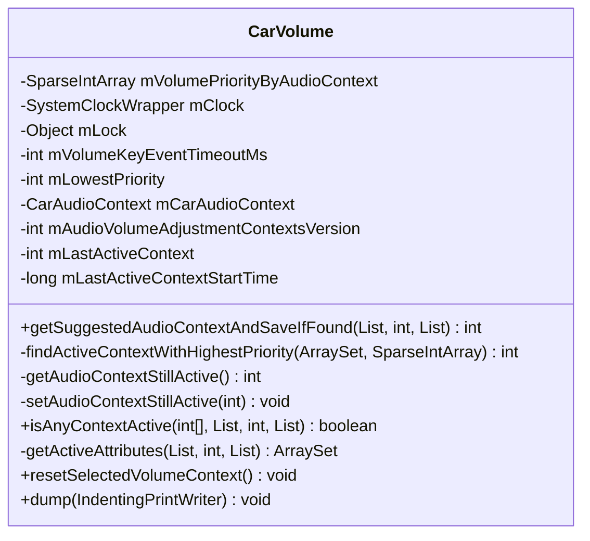
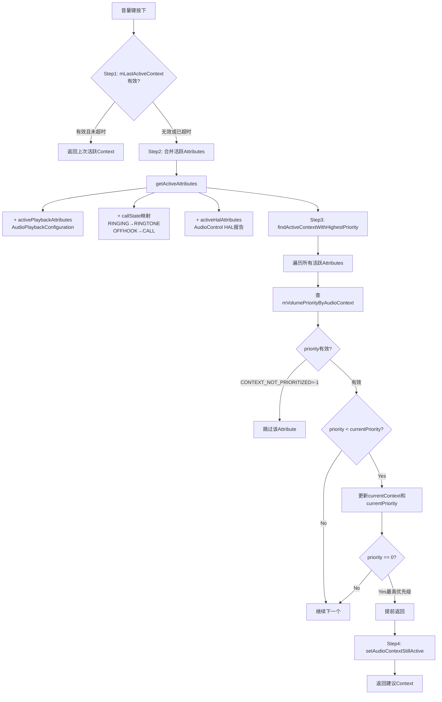
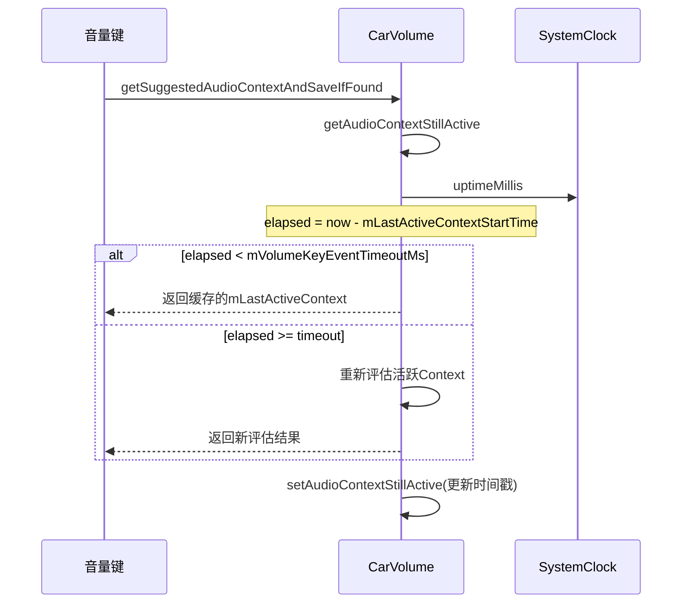
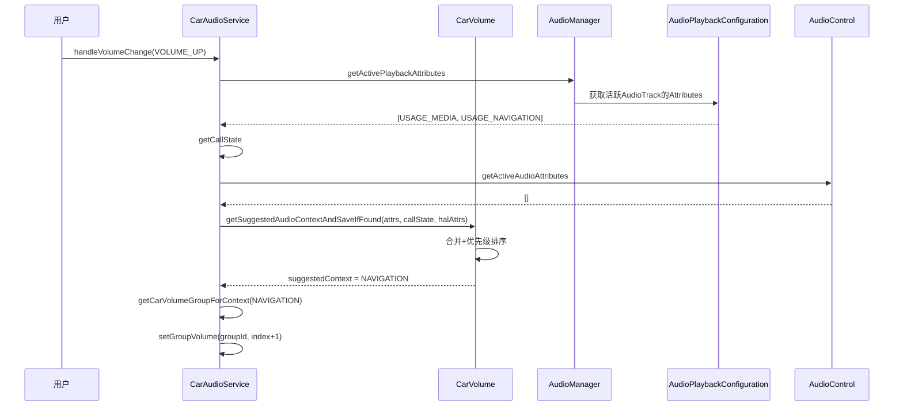

## 9.12 CarVolume — 音量优先级算法

> [← 上一个](09_9.11_CarAudioDynamicRouting-动态路由构建.md) | [返回目录](README.md) | [下一个 →](09_9.13_CarAudioGainMonitor-HAL_Gain事件分发.md)

---

### 9.12.1 模块概述

[`CarVolume`](packages/services/Car/service/src/com/android/car/audio/CarVolume.java)负责确定音量键调节时应优先响应的音频Context，实现**"按键音量跟随最活跃音频"**的逻辑。当用户按下音量键时，系统需要判断应该调节哪个VolumeGroup——这取决于当前哪个音频Context最活跃且优先级最高。

**核心职责：**
- 维护V1/V2两套音量优先级列表
- 实现`getSuggestedAudioContextAndSaveIfFound`建议Context算法
- 超时机制缓存上次活跃Context
- 合并多源活跃Attributes（播放态+通话态+HAL活跃态）

### 9.12.2 类结构



### 9.12.3 V1/V2优先级列表

```java
// CarVolume.java:73-93
// V1: 12个Usage全覆盖
static final List<AudioAttributes> AUDIO_ATTRIBUTE_VOLUME_PRIORITY_V1 = List.of(
    USAGE_ASSISTANCE_NAVIGATION_GUIDANCE,  // 0: NAVIGATION — 最高优先级
    USAGE_VOICE_COMMUNICATION,              // 1: CALL
    USAGE_MEDIA,                            // 2: MUSIC
    USAGE_ANNOUNCEMENT,                     // 3: ANNOUNCEMENT
    USAGE_ASSISTANT,                        // 4: ASSISTANT
    USAGE_NOTIFICATION_RINGTONE,            // 5: RINGTONE
    USAGE_ASSISTANCE_SONIFICATION,          // 6: SYSTEM_SOUND
    USAGE_SAFETY,                           // 7: SAFETY
    USAGE_ALARM,                            // 8: ALARM
    USAGE_NOTIFICATION,                     // 9: NOTIFICATION
    USAGE_VEHICLE_STATUS,                   // 10: VEHICLE_STATUS
    USAGE_EMERGENCY                         // 11: EMERGENCY
);

// CarVolume.java:95-100
// V2: 4个核心Usage
static final List<AudioAttributes> AUDIO_ATTRIBUTE_VOLUME_PRIORITY_V2 = List.of(
    USAGE_VOICE_COMMUNICATION,              // 0: CALL — 最高优先级
    USAGE_MEDIA,                            // 1: MUSIC
    USAGE_ANNOUNCEMENT,                     // 2: ANNOUNCEMENT
    USAGE_ASSISTANT                         // 3: ASSISTANT
);
```

**V1 vs V2对比：**

| 特性 | V1 | V2 |
|------|----|----|
| 优先级数量 | 12个Context全覆盖 | 4个核心Context |
| 最高优先级 | NAVIGATION | CALL |
| 安全相关 | SAFETY/EMERGENCY独立优先级 | 不包含 |
| 设计理念 | 细粒度优先级排序 | 精简优先级，仅关注关键音频 |
| 适用场景 | 全功能车载系统 | 简化车载系统 |
| 配置项 | `audioVolumeAdjustmentContextsVersion=1` | `audioVolumeAdjustmentContextsVersion=2` |

### 9.12.4 优先级映射构建

```java
// CarVolume.java 构造函数中
CarVolume(CarAudioContext carAudioContext, SystemClockWrapper clockWrapper,
        @CarVolumeListVersion int audioVolumeAdjustmentContextsVersion,
        int volumeKeyEventTimeoutMs) {
    // ...
    @AudioContext int[] contextVolumePriority =
            getContextPriorityList(audioVolumeAdjustmentContextsVersion);
    // 将Context→Priority映射存入SparseIntArray
    for (int priority = CONTEXT_HIGHEST_PRIORITY;
            priority < contextVolumePriority.length; priority++) {
        mVolumePriorityByAudioContext.append(contextVolumePriority[priority], priority);
    }
    mLowestPriority = CONTEXT_HIGHEST_PRIORITY + mVolumePriorityByAudioContext.size();
}
```

**V1映射结果（mVolumePriorityByAudioContext）：**

| Priority | Context | 说明 |
|----------|---------|------|
| 0 | NAVIGATION | 最高，音量键首先调节导航 |
| 1 | CALL | 通话次高 |
| 2 | MUSIC | 媒体第三 |
| 3 | ANNOUNCEMENT | 广播公告 |
| 4 | ASSISTANT | 语音助手 |
| 5 | RINGTONE | 来电铃声 |
| 6 | SYSTEM_SOUND | 系统音效 |
| 7 | SAFETY | 安全提示 |
| 8 | ALARM | 闹钟 |
| 9 | NOTIFICATION | 通知 |
| 10 | VEHICLE_STATUS | 车辆状态 |
| 11 | EMERGENCY | 紧急（最低） |

### 9.12.5 getSuggestedAudioContextAndSaveIfFound核心算法

```java
// CarVolume.java:188
@AudioContext int getSuggestedAudioContextAndSaveIfFound(
        List<AudioAttributes> activePlaybackAttributes, int callState,
        List<AudioAttributes> activeHalAttributes) {
    // Step 1: 检查上次活跃Context是否仍在超时窗口内
    int activeContext = getAudioContextStillActive();
    if (!CarAudioContext.isInvalidContextId(activeContext)) {
        setAudioContextStillActive(activeContext);
        return activeContext;
    }
    // Step 2: 合并所有活跃Attributes
    ArraySet<AudioAttributes> activeAttributes =
            getActiveAttributes(activePlaybackAttributes, callState, activeHalAttributes);
    // Step 3: 找到最高优先级的活跃Context
    @AudioContext int context = findActiveContextWithHighestPriority(activeAttributes,
                    mVolumePriorityByAudioContext);
    // Step 4: 保存为上次活跃Context
    setAudioContextStillActive(context);
    return context;
}
```

### 9.12.6 完整决策流程图



### 9.12.7 findActiveContextWithHighestPriority源码解析

```java
// CarVolume.java:218
private @AudioContext int findActiveContextWithHighestPriority(
        ArraySet<AudioAttributes> activeAttributes, SparseIntArray contextPriorities) {
    // 默认Context为DEFAULT_AUDIO_ATTRIBUTE对应的Context
    int currentContext = mCarAudioContext.getContextForAttributes(
            CAR_DEFAULT_AUDIO_ATTRIBUTE);
    int currentPriority = mLowestPriority; // 初始为最低优先级

    for (int index = 0; index < activeAttributes.size(); index++) {
        @AudioContext int context = mCarAudioContext.getContextForAudioAttribute(
                activeAttributes.valueAt(index));
        int priority = contextPriorities.get(context, CONTEXT_NOT_PRIORITIZED);
        // 未在优先级列表中的Context直接跳过
        if (priority == CONTEXT_NOT_PRIORITIZED) {
            continue;
        }
        // 数值越小优先级越高
        if (priority < currentPriority) {
            currentContext = context;
            currentPriority = priority;
            // 0是最高的优先级，可以提前返回
            if (currentPriority == CONTEXT_HIGHEST_PRIORITY) {
                break;
            }
        }
    }
    return currentContext;
}
```

**关键设计：**
1. **优先级数值越小越高**：`CONTEXT_HIGHEST_PRIORITY=0`
2. **提前退出优化**：找到priority=0的Context时立即返回
3. **默认回退**：无活跃Context时返回`CAR_DEFAULT_AUDIO_ATTRIBUTE`对应Context

### 9.12.8 getActiveAttributes三源合并

```java
// CarVolume.java:272
private static ArraySet<AudioAttributes> getActiveAttributes(
        List<AudioAttributes> activeAttributes, int callState,
        List<AudioAttributes> activeHalAudioAttributes) {
    // 源1: HAL报告的活跃Attributes（优先加入）
    ArraySet<AudioAttributes> attributes = new ArraySet<>(activeHalAudioAttributes);
    // 源2: 通话状态映射
    switch (callState) {
        case CALL_STATE_RINGING:
            attributes.add(CarAudioContext
                    .getAudioAttributeFromUsage(USAGE_NOTIFICATION_RINGTONE));
            break;
        case CALL_STATE_OFFHOOK:
            attributes.add(CarAudioContext
                    .getAudioAttributeFromUsage(USAGE_VOICE_COMMUNICATION));
            break;
        default:
            break;
    }
    // 源3: 播放中的Attributes（最后加入）
    attributes.addAll(activeAttributes);
    return attributes;
}
```

**三源优先级说明：**

| 数据源 | 获取方式 | 说明 |
|--------|---------|------|
| HAL活跃Attributes | `activeHalAudioAttributes` | AudioControl HAL主动报告，可能包含Android不可见的音频流 |
| 通话状态 | `TelephonyManager.getCallState()` | RINGING→RINGTONE, OFFHOOK→CALL |
| 播放配置 | `AudioPlaybackConfiguration` | Android侧活跃的AudioTrack |

### 9.12.9 超时缓存机制

```java
// CarVolume.java:296
private @AudioContext int getAudioContextStillActive() {
    @AudioContext int context;
    long contextStartTime;
    synchronized (mLock) {
        context = mLastActiveContext;
        contextStartTime = mLastActiveContextStartTime;
    }
    // 无效Context直接返回
    if (CarAudioContext.isInvalidContextId(context)) {
        return CarAudioContext.getInvalidContext();
    }
    // 超时检查
    if (hasExpired(contextStartTime, mClock.uptimeMillis(), mVolumeKeyEventTimeoutMs)) {
        return CarAudioContext.getInvalidContext();
    }
    return context;
}
```

```java
// CarVolume.java:289
private void setAudioContextStillActive(@AudioContext int context) {
    synchronized (mLock) {
        mLastActiveContext = context;
        mLastActiveContextStartTime = mClock.uptimeMillis();
    }
}
```

**超时机制流程图：**



**设计意图：** 短时间内连续按音量键时，保持调节同一个VolumeGroup，避免音量键"跳跃"到其他Context。

### 9.12.10 典型场景分析

**场景1：导航+音乐同时播放**

```
活跃Attributes: [USAGE_MEDIA, USAGE_ASSISTANCE_NAVIGATION_GUIDANCE]
V1优先级: NAVIGATION=0 < MUSIC=2
结果: 调节导航音量
```

**场景2：通话+音乐同时播放**

```
活跃Attributes: [USAGE_MEDIA, USAGE_VOICE_COMMUNICATION]
callState=CALL_STATE_OFFHOOK
V1优先级: CALL=1 < MUSIC=2
结果: 调节通话音量
```

**场景3：音乐停止5秒后按音量键**

```
mLastActiveContext = MUSIC (之前的活跃Context)
elapsed = 5000ms > mVolumeKeyEventTimeoutMs (假设3000ms)
→ 超时，重新评估
当前无活跃Attributes
结果: 返回DEFAULT_AUDIO_ATTRIBUTE对应Context
```

**场景4：V2模式下导航+音乐**

```
V2列表仅包含: CALL, MUSIC, ANNOUNCEMENT, ASSISTANT
NAVIGATION不在V2列表中 → CONTEXT_NOT_PRIORITIZED
MUSIC在V2中，priority=1
结果: 调节音乐音量
```

### 9.12.11 与CarAudioService的集成



### 9.12.12 resetSelectedVolumeContext

```java
// CarVolume.java:183
public void resetSelectedVolumeContext() {
    setAudioContextStillActive(CarAudioContext.getInvalidContext());
}
```

在CarAudioService主动切换Zone或用户切换时调用，清除缓存的活跃Context，强制下次音量键重新评估。

### 9.12.13 isAnyContextActive

```java
// CarVolume.java:245
boolean isAnyContextActive(@AudioContext int [] contexts,
        List<AudioAttributes> activePlaybackContext, int callState,
        List<AudioAttributes> activeHalAudioAttributes) {
    ArraySet<AudioAttributes> activeAttributes = getActiveAttributes(activePlaybackContext,
            callState, activeHalAudioAttributes);
    Set<Integer> activeContexts = new ArraySet<>(activeAttributes.size());
    for (int index = 0; index < activeAttributes.size(); index++) {
        activeContexts.add(mCarAudioContext
                .getContextForAttributes(activeAttributes.valueAt(index)));
    }
    for (int index = 0; index < contexts.length; index++) {
        if (activeContexts.contains(contexts[index])) {
            return true;
        }
    }
    return false;
}
```

用于检查指定Context列表中是否有任何一个处于活跃状态，CarAudioService用于判断是否需要触发Ducking。

### 9.12.14 调试与配置

```bash
# dumpsys查看优先级配置
adb shell dumpsys car_service | grep -A 30 "CarVolume"

# 输出示例:
# CarVolume
#   Volume priority list version 1
#   Volume key event timeout 3000 ms
#   Car audio contexts priorities
#     Car audio context NAVIGATION[id=2] priority 0
#     Car audio context CALL[id=4] priority 1
#     Car audio context MUSIC[id=1] priority 2
#     ...

# 配置优先级版本
# 在overlay配置中设置:
# audioVolumeAdjustmentContextsVersion=2
# volumeKeyEventTimeoutMs=3000
```

---