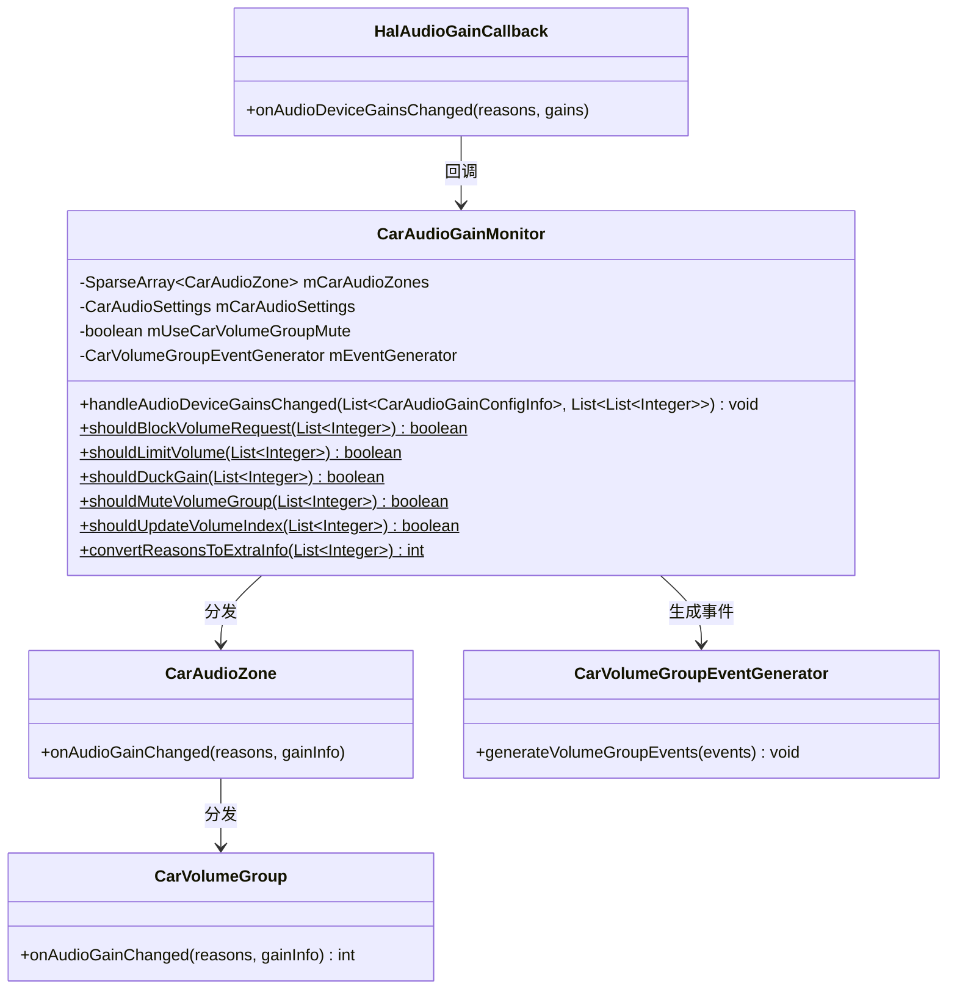
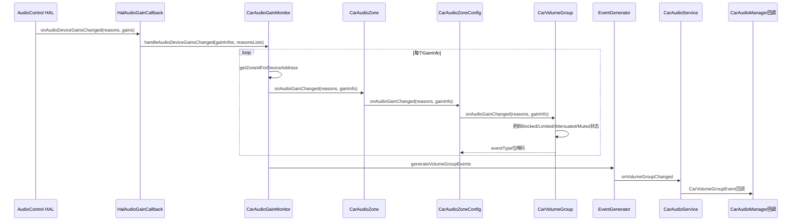
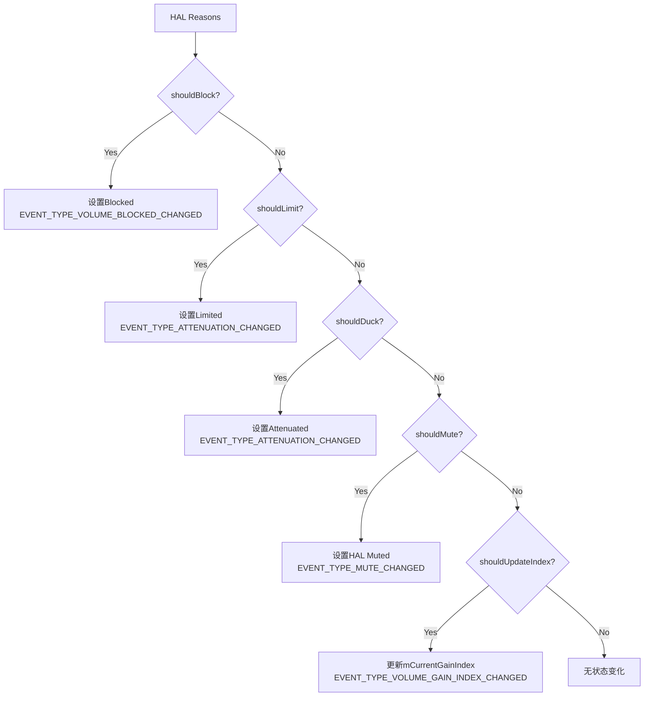

## 9.13 CarAudioGainMonitor — HAL Gain事件分发

> [← 上一个](09_9.12_CarVolume-音量优先级算法.md) | [返回目录](README.md) | [下一个 →](09_9.14_CarDucking-AAOS系统级Ducking.md)

---

### 9.13.1 模块概述

[`CarAudioGainMonitor`](packages/services/Car/service/src/com/android/car/audio/CarAudioGainMonitor.java)是AAOS音频系统中**HAL→CarAudioService的Gain事件桥梁**。它接收AudioControl HAL上报的Gain变化回调（含Reasons），将Reasons翻译为具体的Gain状态（Blocked/Limit/Attenuation/Mute/VolumeIndex），并分发到对应的`CarVolumeGroup`。

**核心职责：**
- 接收`HalAudioGainCallback`的回调并路由到正确Zone/Group
- Reasons到Gain状态的映射判断
- 生成`CarVolumeGroupEvent`事件通知上层
- 维护Reasons→EXTRA_INFO的转换

### 9.13.2 类结构



### 9.13.3 HAL Gain回调处理 — handleAudioDeviceGainsChanged

```java
// CarAudioGainMonitor.java:77
void handleAudioDeviceGainsChanged(
        List<CarAudioGainConfigInfo> gainInfos,
        List<List<Integer>> halReasonsPerGain) {
    // 遍历每个Gain变化通知
    for (int index = 0; index < gainInfos.size(); index++) {
        CarAudioGainConfigInfo gainInfo = gainInfos.get(index);
        List<Integer> reasons = halReasonsPerGain.get(index);
        // 根据设备地址查找对应Zone
        int zoneId = getZoneIdForDeviceAddress(gainInfo.getDeviceAddress());
        if (zoneId == CarAudioManager.INVALID_AUDIO_ZONE) {
            Slogf.w(TAG, "Unknown zone for address " + gainInfo.getDeviceAddress());
            continue;
        }
        // 分发到Zone
        CarAudioZone zone = mCarAudioZones.get(zoneId);
        zone.onAudioGainChanged(reasons, gainInfo);
    }
    // 生成VolumeGroup事件通知上层
    mEventGenerator.generateVolumeGroupEvents();
}
```

### 9.13.4 Gain事件处理时序图



### 9.13.5 Reasons到Gain状态映射

```java
// CarAudioGainMonitor.java:115
static boolean shouldBlockVolumeRequest(List<Integer> reasons) {
    return reasons.contains(Reasons.FORCED_MASTER_MUTE)
            || reasons.contains(Reasons.REMOTE_MUTE)
            || reasons.contains(Reasons.BLACKOUT);
}

static boolean shouldLimitVolume(List<Integer> reasons) {
    return reasons.contains(Reasons.THERMAL_LIMITATION)
            || reasons.contains(Reasons.SATURATION_PROTECTION)
            || reasons.contains(Reasons.FREQUENCY_PROTECTION);
}

static boolean shouldDuckGain(List<Integer> reasons) {
    return reasons.contains(Reasons.DUCKING);
}

static boolean shouldMuteVolumeGroup(List<Integer> reasons) {
    return reasons.contains(Reasons.FORCED_MASTER_MUTE)
            || reasons.contains(Reasons.REMOTE_MUTE);
}

static boolean shouldUpdateVolumeIndex(List<Integer> reasons) {
    return reasons.contains(Reasons.EXTERNAL_AMP_VOLUME_CHANGE)
            || reasons.contains(Reasons.DEVICE_INIT)
            || reasons.contains(Reasons.NAV_DUCKING)
            || reasons.contains(Reasons.PROJECTION_DUCKING);
}
```

### 9.13.6 Reasons完整映射表

| Reason常量 | 值 | Blocked | Limited | Attenuated | Muted | UpdateIndex |
|------------|---|---------|---------|------------|-------|-------------|
| FORCED_MASTER_MUTE | 1 | Yes | - | - | Yes | - |
| REMOTE_MUTE | 2 | Yes | - | - | Yes | - |
| BLACKOUT | 3 | Yes | - | - | - | - |
| THERMAL_LIMITATION | 4 | - | Yes | - | - | - |
| SATURATION_PROTECTION | 5 | - | Yes | - | - | - |
| FREQUENCY_PROTECTION | 6 | - | Yes | - | - | - |
| DUCKING | 7 | - | - | Yes | - | - |
| EXTERNAL_AMP_VOLUME_CHANGE | 8 | - | - | - | - | Yes |
| DEVICE_INIT | 9 | - | - | - | - | Yes |
| NAV_DUCKING | 10 | - | - | - | - | Yes |
| PROJECTION_DUCKING | 11 | - | - | - | - | Yes |

### 9.13.7 Gain四层状态机

CarVolumeGroup在`onAudioGainChanged`中按优先级处理四种状态：



**优先级：Blocked > Limited > Attenuated > Muted > UpdateIndex**

### 9.13.8 convertReasonsToExtraInfo

```java
// CarAudioGainMonitor.java — Reasons到EXTRA_INFO转换
static int convertReasonsToExtraInfo(List<Integer> reasons) {
    int extraInfo = 0;
    for (int index = 0; index < reasons.size(); index++) {
        int reason = reasons.get(index);
        switch (reason) {
            case Reasons.FORCED_MASTER_MUTE:
            case Reasons.REMOTE_MUTE:
                extraInfo |= CarVolumeGroupEvent.EXTRA_INFO_MUTE_FIXED_VOLUME;
                break;
            case Reasons.BLACKOUT:
                extraInfo |= CarVolumeGroupEvent.EXTRA_INFO_TRANSMITTED_MUTE;
                break;
            case Reasons.THERMAL_LIMITATION:
                extraInfo |= CarVolumeGroupEvent.EXTRA_INFO_THERMAL_LIMITATION;
                break;
            case Reasons.SATURATION_PROTECTION:
                extraInfo |= CarVolumeGroupEvent.EXTRA_INFO_SATURATION_PROTECTION;
                break;
            case Reasons.FREQUENCY_PROTECTION:
                extraInfo |= CarVolumeGroupEvent.EXTRA_INFO_FREQUENCY_PROTECTION;
                break;
            case Reasons.DUCKING:
                extraInfo |= CarVolumeGroupEvent.EXTRA_INFO_DUCKING;
                break;
            case Reasons.EXTERNAL_AMP_VOLUME_CHANGE:
                extraInfo |= CarVolumeGroupEvent.EXTRA_INFO_EXTERNAL_AMP_VOLUME_CHANGE;
                break;
            case Reasons.DEVICE_INIT:
                extraInfo |= CarVolumeGroupEvent.EXTRA_INFO_DEVICE_INIT;
                break;
            default:
                break;
        }
    }
    return extraInfo;
}
```

**Reasons → EXTRA_INFO映射表：**

| Reason | EXTRA_INFO | 说明 |
|--------|-----------|------|
| FORCED_MASTER_MUTE / REMOTE_MUTE | MUTE_FIXED_VOLUME | 固定音量静音 |
| BLACKOUT | TRANSMITTED_MUTE | 传输静音 |
| THERMAL_LIMITATION | THERMAL_LIMITATION | 热保护限音量 |
| SATURATION_PROTECTION | SATURATION_PROTECTION | 饱和保护限音量 |
| FREQUENCY_PROTECTION | FREQUENCY_PROTECTION | 频率保护限音量 |
| DUCKING | DUCKING | Ducking降低音量 |
| EXTERNAL_AMP_VOLUME_CHANGE | EXTERNAL_AMP_VOLUME_CHANGE | 外部功放音量变化 |
| DEVICE_INIT | DEVICE_INIT | 设备初始化 |

### 9.13.9 CarVolumeGroup.onAudioGainChanged完整源码

```java
// CarVolumeGroup.java:679
int onAudioGainChanged(List<Integer> halReasons, CarAudioGainConfigInfo gain) {
    int eventType = 0;
    int halIndex = gain.getVolumeIndex();
    synchronized (mLock) {
        int previousRestrictedIndex = getRestrictedGainForIndexLocked(mCurrentGainIndex);
        mReasons = new ArrayList<>(halReasons);

        // Blocked处理
        boolean shouldBlock = CarAudioGainMonitor.shouldBlockVolumeRequest(halReasons);
        if ((shouldBlock != isBlockedLocked())
                || (shouldBlock && (halIndex != mBlockedGainIndex))) {
            setBlockedLocked(shouldBlock ? halIndex : UNINITIALIZED);
            eventType |= EVENT_TYPE_VOLUME_BLOCKED_CHANGED;
        }

        // Limited处理
        boolean shouldLimit = CarAudioGainMonitor.shouldLimitVolume(halReasons);
        if ((shouldLimit != isLimitedLocked())
                || (shouldLimit && (halIndex != mLimitedGainIndex))) {
            setLimitLocked(shouldLimit ? halIndex : getMaxGainIndex());
            eventType |= EVENT_TYPE_ATTENUATION_CHANGED;
        }

        // Attenuated处理
        boolean shouldDuck = CarAudioGainMonitor.shouldDuckGain(halReasons);
        if ((shouldDuck != isAttenuatedLocked())
                || (shouldDuck && (halIndex != mAttenuatedGainIndex))) {
            setAttenuatedGainLocked(shouldDuck ? halIndex : UNINITIALIZED);
            eventType |= EVENT_TYPE_ATTENUATION_CHANGED;
        }

        // HAL Mute处理
        boolean shouldMute = CarAudioGainMonitor.shouldMuteVolumeGroup(halReasons);
        if (mUseCarVolumeGroupMute && (shouldMute != isHalMutedLocked())) {
            setHalMuteLocked(shouldMute);
            eventType |= EVENT_TYPE_MUTE_CHANGED;
        }

        // Volume Index更新
        if (CarAudioGainMonitor.shouldUpdateVolumeIndex(halReasons)
                && (halIndex != getRestrictedGainForIndexLocked(mCurrentGainIndex))) {
            mCurrentGainIndex = halIndex;
            eventType |= EVENT_TYPE_VOLUME_GAIN_INDEX_CHANGED;
        }

        // 同步应用新状态到HAL
        int newRestrictedIndex = getRestrictedGainForIndexLocked(mCurrentGainIndex);
        setCurrentGainIndexLocked(newRestrictedIndex);
        applyMuteLocked(isFullyMutedLocked());

        if (newRestrictedIndex != previousRestrictedIndex) {
            eventType |= EVENT_TYPE_VOLUME_GAIN_INDEX_CHANGED;
        }
    }
    return eventType;
}
```

### 9.13.10 getRestrictedGainForIndexLocked四层优先级

```java
// CarVolumeGroup.java:414
protected int getRestrictedGainForIndexLocked(int index) {
    if (isBlockedLocked()) {
        return mBlockedGainIndex;       // 层1: Blocked — 完全阻止
    }
    if (isOverLimitLocked()) {
        return mLimitedGainIndex;       // 层2: OverLimit — 限制到上限
    }
    if (isAttenuatedLocked()) {
        return mAttenuatedGainIndex;    // 层3: Attenuated — 降低音量
    }
    return index;                       // 层4: Normal — 正常音量
}
```

**四层状态机对比：**

| 层级 | 状态 | 索引行为 | 用户可见 | 用户可调 |
|------|------|---------|---------|---------|
| 1 | Blocked | 返回BlockedIndex | 显示Blocked标记 | 不可调 |
| 2 | OverLimit | 返回LimitedIndex | 显示Attenuated标记 | 只能调低 |
| 3 | Attenuated | 返回AttenuatedIndex | 显示Attenuated标记 | 可调(清除衰减) |
| 4 | Normal | 返回当前Index | 正常显示 | 完全可调 |

### 9.13.11 setCurrentGainIndex中的状态处理

```java
// CarVolumeGroup.java:434
void setCurrentGainIndex(int gainIndex) {
    synchronized (mLock) {
        if (isBlockedLocked()) {
            return;  // Blocked状态下完全拒绝音量调节
        }
        if (isOverLimitLocked(currentgainIndex)) {
            currentgainIndex = mLimitedGainIndex;  // OverLimit时截断到上限
        }
        if (isAttenuatedLocked()) {
            resetAttenuationLocked();  // 用户主动调节时清除衰减
        }
        mCurrentGainIndex = currentgainIndex;
        if (mIsMuted) {
            setMuteLocked(false);  // 调节音量自动解除静音
        }
        setCurrentGainIndexLocked(mCurrentGainIndex);
    }
}
```

### 9.13.12 事件去重机制

`onAudioGainChanged`中每个状态变化都有条件判断：

```java
// 只有状态真正变化时才生成事件
boolean shouldBlock = CarAudioGainMonitor.shouldBlockVolumeRequest(halReasons);
if ((shouldBlock != isBlockedLocked())                          // 状态切换
        || (shouldBlock && (halIndex != mBlockedGainIndex))) {  // 同状态但索引变化
    setBlockedLocked(shouldBlock ? halIndex : UNINITIALIZED);
    eventType |= EVENT_TYPE_VOLUME_BLOCKED_CHANGED;
}
```

**去重逻辑：**
1. 状态未变且索引未变 → 不生成事件
2. 状态切换 → 生成事件
3. 状态相同但索引变化 → 生成事件

### 9.13.13 调试与监控

```bash
# 查看Gain状态
adb shell dumpsys car_service | grep -A 30 "Gain infos"

# 输出示例:
# Gain infos:
#   Blocked: false
#   Limited: true (at: 25)
#   Attenuated: false
#   Muted by HAL: false
# Reported reasons:
#   THERMAL_LIMITATION

# 监听Gain变化事件
adb shell dumpsys car_service | grep -A 5 "Volume group event"
```

---