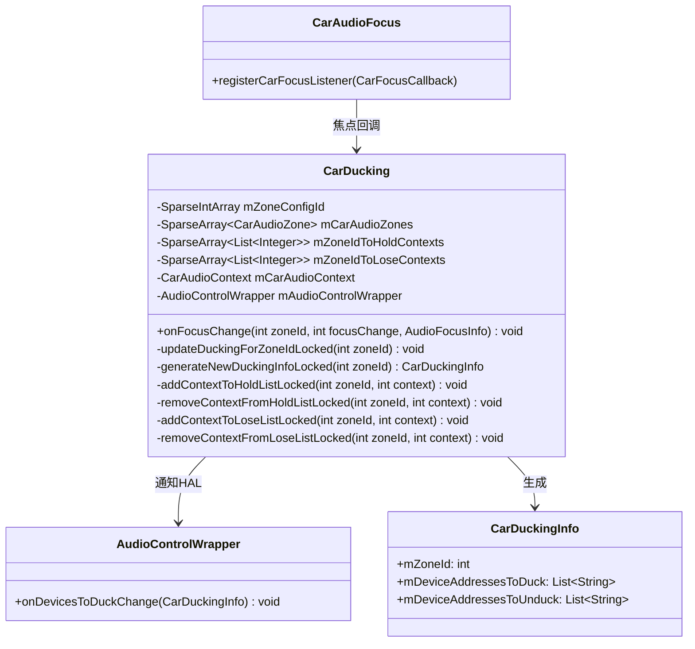
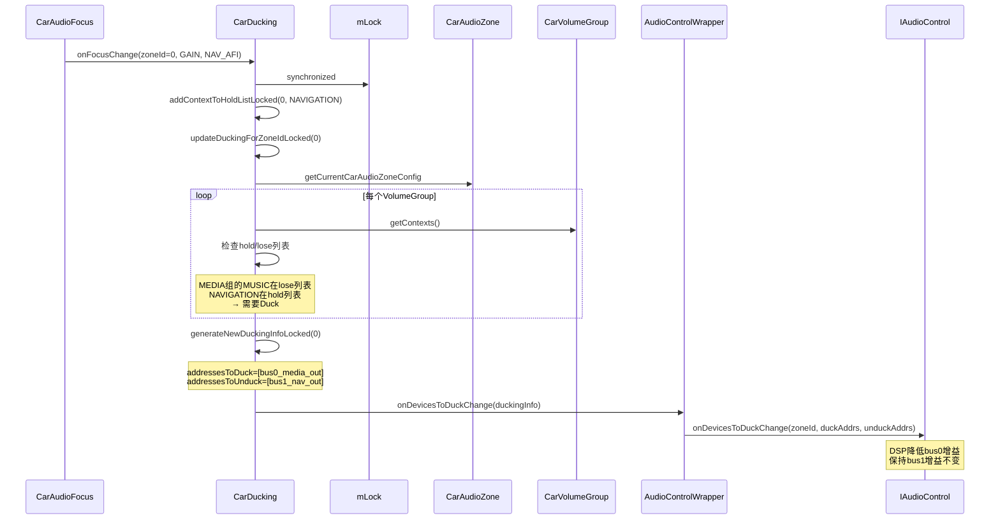
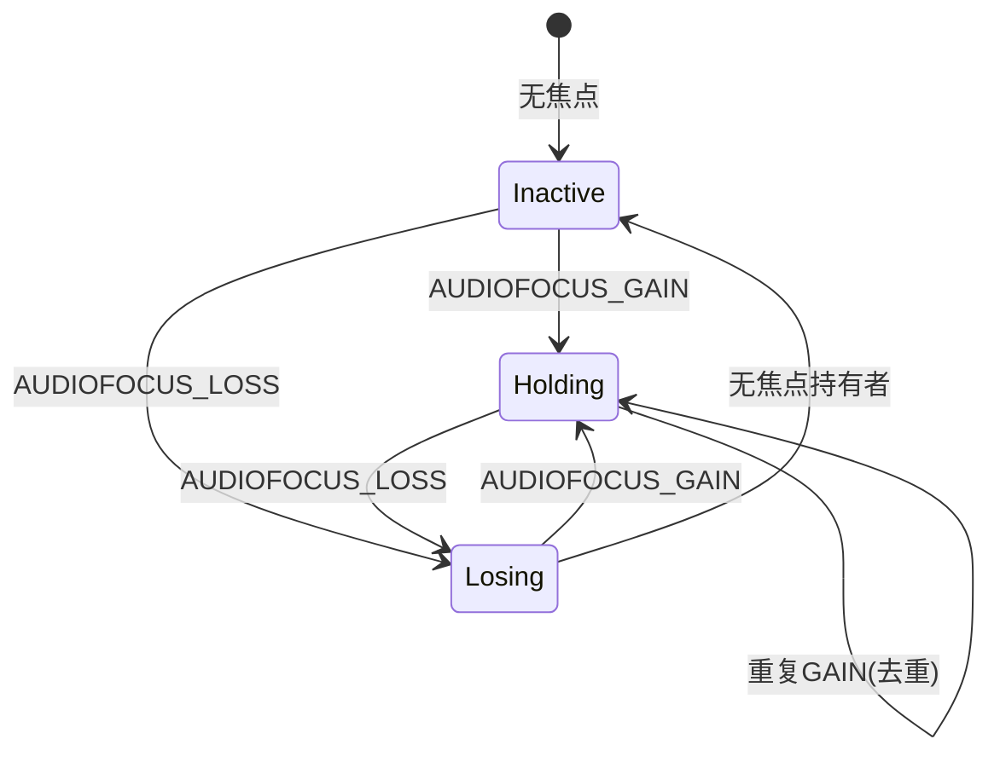
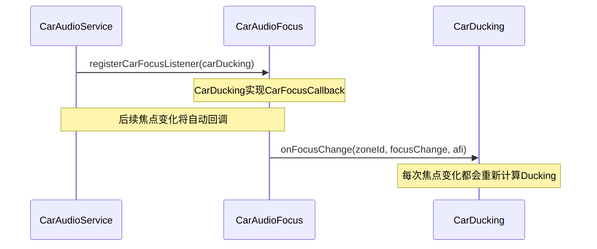

## 9.14 CarDucking — AAOS系统级Ducking

> [← 上一个](09_9.13_CarAudioGainMonitor-HAL_Gain事件分发.md) | [返回目录](README.md) | [下一个 →](09_9.15_CarAudioMirrorRequestHandler-音频镜像请求管理.md)

---

### 9.14.1 模块概述

[`CarDucking`](packages/services/Car/service/src/com/android/car/audio/CarDucking.java)实现AAOS系统级Ducking——当高优先级音频（如导航、通话）获得焦点时，自动降低持有同Zone焦点Loss者的音量。与Android原生Ducking不同，CarDucking通过`AudioControl HAL`通知车端DSP执行实际Ducking，而非在软件层降低增益。

**核心职责：**
- 监听Per-Zone焦点变化回调
- 为每个Zone维护当前Hold焦点和Lose焦点的Context列表
- 生成`CarDuckingInfo`并通过`AudioControlWrapper`通知HAL
- 仅针对同一Zone内的焦点交互执行Ducking

### 9.14.2 类结构



### 9.14.3 焦点变化处理 — onFocusChange

```java
// CarDucking.java:72
void onFocusChange(int zoneId, int focusChange, AudioFocusInfo afi) {
    int context = mCarAudioContext.getContextForAudioAttribute(
            afi.getAttributes());
    synchronized (mLock) {
        switch (focusChange) {
            case AudioManager.AUDIOFOCUS_GAIN:
            case AudioManager.AUDIOFOCUS_GAIN_TRANSIENT:
            case AudioManager.AUDIOFOCUS_GAIN_TRANSIENT_MAY_DUCK:
                // 获得焦点 → 加入Hold列表，从Lose列表移除
                addContextToHoldListLocked(zoneId, context);
                removeContextFromLoseListLocked(zoneId, context);
                break;
            case AudioManager.AUDIOFOCUS_LOSS:
            case AudioManager.AUDIOFOCUS_LOSS_TRANSIENT:
            case AudioManager.AUDIOFOCUS_LOSS_TRANSIENT_CAN_DUCK:
                // 失去焦点 → 加入Lose列表，从Hold列表移除
                addContextToLoseListLocked(zoneId, context);
                removeContextFromHoldListLocked(zoneId, context);
                break;
        }
        updateDuckingForZoneIdLocked(zoneId);
    }
}
```

### 9.14.4 Ducking计算流程 — updateDuckingForZoneIdLocked

```java
// CarDucking.java
private void updateDuckingForZoneIdLocked(int zoneId) {
    CarDuckingInfo duckingInfo = generateNewDuckingInfoLocked(zoneId);
    mAudioControlWrapper.onDevicesToDuckChange(duckingInfo);
}
```

```java
// CarDucking.java — generateNewDuckingInfoLocked
private CarDuckingInfo generateNewDuckingInfoLocked(int zoneId) {
    CarAudioZone zone = mCarAudioZones.get(zoneId);
    CarAudioZoneConfig config = zone.getCurrentCarAudioZoneConfig();
    List<String> addressesToDuck = new ArrayList<>();
    List<String> addressesToUnduck = new ArrayList<>();

    for (int i = 0; i < config.getVolumeGroupCount(); i++) {
        CarVolumeGroup group = config.getCarVolumeGroup(i);
        String address = getAddressToDuck(group, zoneId);
        if (address != null) {
            addressesToDuck.add(address);
        } else {
            addressesToUnduck.addAll(group.getAddresses());
        }
    }
    return new CarDuckingInfo(zoneId, mZoneConfigId.get(zoneId),
            addressesToDuck, addressesToUnduck);
}
```

### 9.14.5 Ducking判断逻辑 — getAddressToDuck

```java
// CarDucking.java
private String getAddressToDuck(CarVolumeGroup group, int zoneId) {
    List<Integer> holdContexts = mZoneIdToHoldContexts.get(zoneId);
    List<Integer> loseContexts = mZoneIdToLoseContexts.get(zoneId);
    // VolumeGroup中是否有Context正在Loss（需要被Duck）
    boolean hasLosingContext = false;
    // VolumeGroup中是否有Context正在Hold（导致Duck的原因）
    boolean hasHoldingContext = false;

    for (int context : group.getContexts()) {
        if (loseContexts.contains(context)) {
            hasLosingContext = true;
        }
        if (holdContexts.contains(context)) {
            hasHoldingContext = true;
        }
    }
    // 同一VolumeGroup内同时有Hold和Lose → 需要Duck
    if (hasLosingContext && hasHoldingContext) {
        return group.getAddresses().get(0);
    }
    return null;
}
```

### 9.14.6 Ducking完整时序图



### 9.14.7 Hold/Lose列表维护



**列表操作：**

| 焦点事件 | Hold列表 | Lose列表 |
|---------|---------|---------|
| GAIN | +context | -context |
| LOSS | -context | +context |
| GAIN_TRANSIENT | +context | -context |
| LOSS_TRANSIENT | -context | +context |
| GAIN_TRANSIENT_MAY_DUCK | +context | -context |
| LOSS_TRANSIENT_CAN_DUCK | -context | +context |

### 9.14.8 CarDuckingInfo数据结构

```java
// CarDuckingInfo.java
class CarDuckingInfo {
    int mZoneId;                         // Zone标识
    int mZoneConfigId;                   // Zone配置ID
    List<String> mDeviceAddressesToDuck;   // 需要Duck的设备地址列表
    List<String> mDeviceAddressesToUnduck; // 需要取消Duck的设备地址列表
}
```

**Duck/Unduck判断矩阵：**

| Hold列表 | Lose列表 | VolumeGroup行为 |
|---------|---------|---------------|
| 空 | 空 | Unduck（无活跃焦点） |
| 有 | 空 | Unduck（只有Hold，无Lose） |
| 空 | 有 | Unduck（只有Lose，无Hold原因） |
| 有 | 有 | Duck（同一Group内有Hold和Lose） |

### 9.14.9 CarAudioFocus与CarDucking的注册关系



### 9.14.10 与Android原生Ducking的区别

| 特性 | Android原生Ducking | AAOS CarDucking |
|------|-------------------|-----------------|
| 执行位置 | AudioFlinger软件层 | DSP硬件层(HAL通知) |
| 粒度 | Stream/Usage级别 | 设备地址级别 |
| Zone感知 | 无 | Per-Zone独立计算 |
| 通知方式 | App收到AUDIOFOCUS_LOSS_TRANSIENT_CAN_DUCK | HAL收到onDevicesToDuckChange |
| 增益控制 | 软件衰减4dB | DSP完全自定义衰减量 |
| 适用场景 | 手机/平板 | 车载多Zone系统 |

### 9.14.11 典型场景：导航播报Ducking音乐

```
初始状态:
  Hold列表: [MUSIC]      ← 音乐持有焦点
  Lose列表: []            ← 无焦点丢失

导航开始播报:
  GAIN(NAVIGATION):
  Hold列表: [MUSIC, NAVIGATION]
  Lose列表: []

  CarAudioFocus评估交互矩阵:
  NAVIGATION vs MUSIC → REJECT → MUSIC收到LOSS_TRANSIENT_CAN_DUCK

  LOSS_TRANSIENT_CAN_DUCK(MUSIC):
  Hold列表: [NAVIGATION]     ← MUSIC从Hold移到Lose
  Lose列表: [MUSIC]

  Ducking计算:
  MEDIA VolumeGroup包含MUSIC(lose)和... 无NAVIGATION
  NAV VolumeGroup包含NAVIGATION(hold)

  → 需要检查: MEDIA组中是否有hold的Context? 否
  → 无Duck? 

  实际: CarAudioFocus的交互矩阵决定MUSIC收到LOSS_TRANSIENT_CAN_DUCK
  → CarDucking收到MUSIC的LOSS_TRANSIENT_CAN_DUCK
  → MUSIC加入lose列表
  → MEDIA组中MUSIC在lose列表,无hold的Context → 不Duck
  → 但NAV组中NAVIGATION在hold列表 → NAV不被Duck

  正确场景: 导航和音乐在不同VolumeGroup
  → Hold=[NAVIGATION], Lose=[MUSIC]
  → NAV组: hold, no lose → Unduck
  → MEDIA组: lose, no hold → Unduck
  → 但实际上CarDucking仅在同一VolumeGroup内判断Duck
```

**正确理解：** CarDucking关注的是**同一VolumeGroup内**的Hold/Lose共存，用于决定该Group的设备是否需要Duck。跨Group的Ducking由CarAudioFocus的交互矩阵决定焦点类型。

### 9.14.12 调试与验证

```bash
# 查看Ducking状态
adb shell dumpsys car_service | grep -A 20 "CarDucking"

# 查看焦点持有者
adb shell dumpsys car_service | grep -A 30 "Audio focus"

# 模拟焦点变化
adb shell am start -a android.intent.action.MAIN -n com.android.music/.MusicActivity
```

---