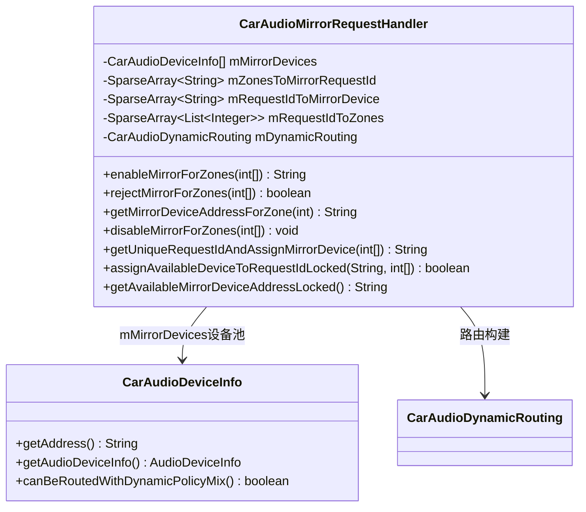
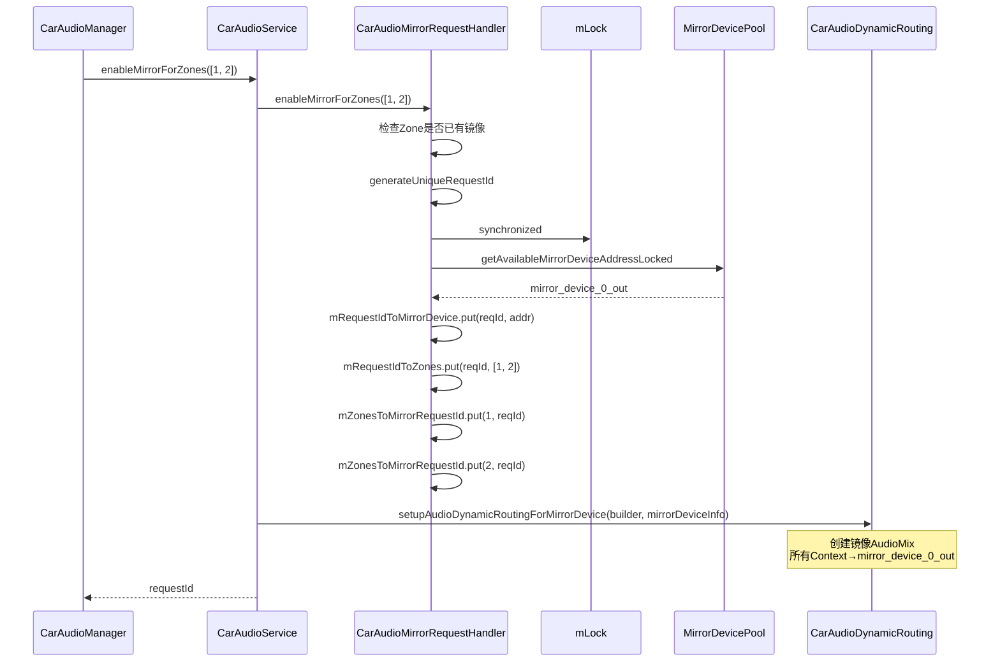
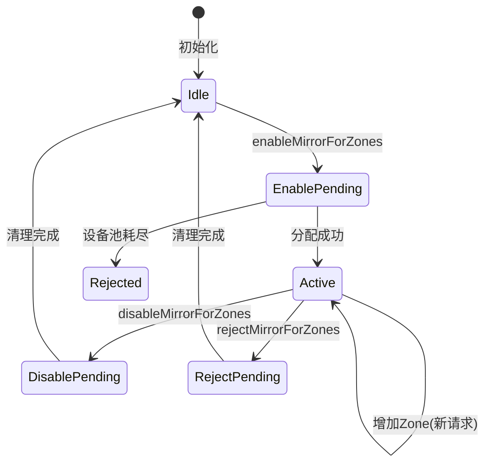
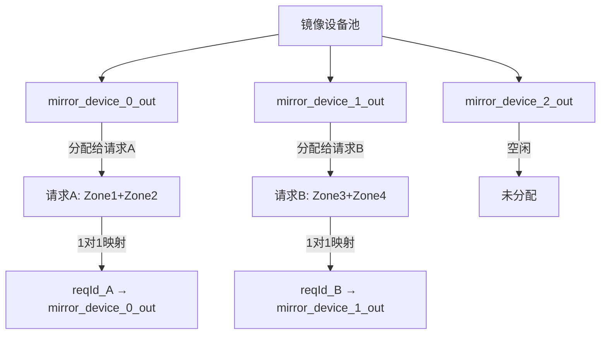
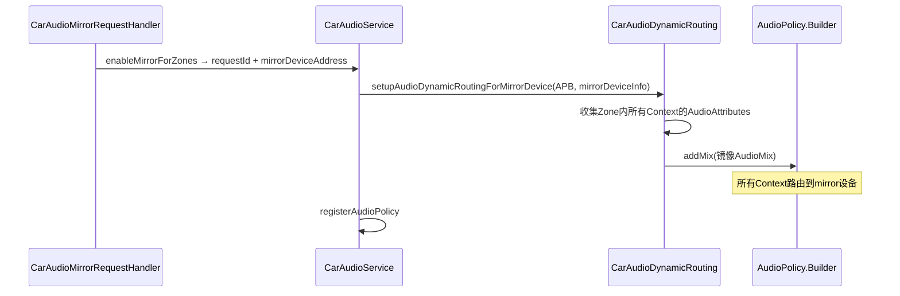

## 9.15 CarAudioMirrorRequestHandler — 音频镜像请求管理

> [← 上一个](09_9.14_CarDucking-AAOS系统级Ducking.md) | [返回目录](README.md) | [下一个 →](09_9.16_MediaRequestHandler-媒体音频请求管理.md)

---

### 9.15.1 模块概述

[`CarAudioMirrorRequestHandler`](packages/services/Car/service/src/com/android/car/audio/CarAudioMirrorRequestHandler.java)管理AAOS音频镜像功能的请求生命周期。它维护一个**镜像设备池**，将可用设备分配给跨Zone镜像请求，并跟踪请求ID到镜像设备的映射关系。

**核心职责：**
- 为镜像请求分配可用镜像设备
- 拒绝超出设备池容量的镜像请求
- 跟踪请求ID→镜像设备→Zone集合的映射
- 禁用镜像时清理分配关系

### 9.15.2 类结构



### 9.15.3 数据结构详解

| 字段 | 类型 | 说明 |
|------|------|------|
| `mMirrorDevices` | `CarAudioDeviceInfo[]` | 镜像设备池（XML配置中定义） |
| `mZonesToMirrorRequestId` | `SparseArray<String>` | Zone ID → 当前活跃请求ID |
| `mRequestIdToMirrorDevice` | `SparseArray<String>` | 请求ID → 分配的镜像设备地址 |
| `mRequestIdToZones` | `SparseArray<List<Integer>>` | 请求ID → 参与Zone ID列表 |

### 9.15.4 enableMirrorForZones流程

```java
// CarAudioMirrorRequestHandler.java:133
String enableMirrorForZones(int[] zoneIds) {
    // 检查是否已有部分Zone在镜像中
    for (int zoneId : zoneIds) {
        if (mZonesToMirrorRequestId.contains(zoneId)) {
            Slogf.w(TAG, "Zone " + zoneId + " already in mirror");
            return null;
        }
    }
    // 分配请求ID和镜像设备
    String requestId = getUniqueRequestIdAndAssignMirrorDevice(zoneIds);
    if (requestId == null) {
        return null;  // 设备池耗尽
    }
    // 为每个Zone注册请求ID
    for (int zoneId : zoneIds) {
        mZonesToMirrorRequestId.put(zoneId, requestId);
    }
    return requestId;
}
```

### 9.15.5 镜像设备分配 — getUniqueRequestIdAndAssignMirrorDevice

```java
// CarAudioMirrorRequestHandler.java:255
private String getUniqueRequestIdAndAssignMirrorDevice(int[] zoneIds) {
    String requestId = generateUniqueRequestId();
    synchronized (mLock) {
        boolean assigned = assignAvailableDeviceToRequestIdLocked(requestId, zoneIds);
        if (!assigned) {
            return null;
        }
    }
    return requestId;
}
```

```java
// CarAudioMirrorRequestHandler.java:355
private boolean assignAvailableDeviceToRequestIdLocked(
        String requestId, int[] zoneIds) {
    String deviceAddress = getAvailableMirrorDeviceAddressLocked();
    if (deviceAddress == null) {
        Slogf.w(TAG, "No available mirror device");
        return false;
    }
    mRequestIdToMirrorDevice.put(requestId, deviceAddress);
    List<Integer> zoneList = new ArrayList<>();
    for (int zoneId : zoneIds) {
        zoneList.add(zoneId);
    }
    mRequestIdToZones.put(requestId, zoneList);
    return true;
}
```

### 9.15.6 getAvailableMirrorDeviceAddressLocked

```java
// CarAudioMirrorRequestHandler.java
private String getAvailableMirrorDeviceAddressLocked() {
    for (CarAudioDeviceInfo device : mMirrorDevices) {
        String address = device.getAddress();
        // 检查设备是否已被分配
        boolean alreadyAssigned = false;
        for (int i = 0; i < mRequestIdToMirrorDevice.size(); i++) {
            if (mRequestIdToMirrorDevice.valueAt(i).equals(address)) {
                alreadyAssigned = true;
                break;
            }
        }
        if (!alreadyAssigned) {
            return address;
        }
    }
    return null;  // 所有镜像设备已分配
}
```

### 9.15.7 镜像请求时序图



### 9.15.8 rejectMirrorForZones

```java
// CarAudioMirrorRequestHandler.java:178
boolean rejectMirrorForZones(int[] zoneIds) {
    // 检查所有Zone是否已有镜像请求
    for (int zoneId : zoneIds) {
        if (!mZonesToMirrorRequestId.contains(zoneId)) {
            return false;
        }
    }
    // 获取共享请求ID
    String requestId = mZonesToMirrorRequestId.get(zoneIds[0]);
    // 清理映射关系
    for (int zoneId : zoneIds) {
        mZonesToMirrorRequestId.remove(zoneId);
    }
    mRequestIdToMirrorDevice.remove(requestId);
    mRequestIdToZones.remove(requestId);
    return true;
}
```

### 9.15.9 disableMirrorForZones

```java
// CarAudioMirrorRequestHandler.java
void disableMirrorForZones(int[] zoneIds) {
    synchronized (mLock) {
        for (int zoneId : zoneIds) {
            String requestId = mZonesToMirrorRequestId.get(zoneId);
            if (requestId != null) {
                mRequestIdToMirrorDevice.remove(requestId);
                mRequestIdToZones.remove(requestId);
                mZonesToMirrorRequestId.remove(zoneId);
            }
        }
    }
}
```

### 9.15.10 生命周期状态图



### 9.15.11 镜像设备池管理



**设备池关键特性：**
1. 每个请求分配一个独立的镜像设备（1:1映射）
2. 同一请求的多个Zone共享同一镜像设备
3. 设备池耗尽时新请求被拒绝
4. 请求释放后设备返回池中可复用

### 9.15.12 多请求场景映射示例

```
配置: 3个镜像设备(mirror_device_0/1/2_out)

请求1: enableMirrorForZones([1, 2])
  → requestId_0 → mirror_device_0_out
  → Zone1: requestId_0
  → Zone2: requestId_0

请求2: enableMirrorForZones([3, 4])
  → requestId_1 → mirror_device_1_out
  → Zone3: requestId_1
  → Zone4: requestId_1

请求3: enableMirrorForZones([5])
  → requestId_2 → mirror_device_2_out
  → Zone5: requestId_2

请求4: enableMirrorForZones([6])  ← 设备池耗尽
  → return null (拒绝)
```

### 9.15.13 与CarAudioDynamicRouting的协作



### 9.15.14 XML配置示例

```xml
<!-- car_audio_configuration.xml -->
<audioZoneConfiguration>
    <mirrorDevices>
        <mirrorDevice address="mirror_device_0_out" />
        <mirrorDevice address="mirror_device_1_out" />
        <mirrorDevice address="mirror_device_2_out" />
    </mirrorDevices>
</audioZoneConfiguration>
```

**设备数量规划：**
- 每个镜像请求需要一个独立的镜像设备
- 设备数量 = 最大并发镜像请求数
- 典型配置：2-3个镜像设备（后排2Zone + 1备选）

### 9.15.15 调试与Dump

```bash
# 查看镜像设备分配状态
adb shell dumpsys car_service | grep -A 20 "Mirror"

# 输出示例:
# Mirror devices: [mirror_device_0_out, mirror_device_1_out, mirror_device_2_out]
# Active mirror requests:
#   Request 0 → mirror_device_0_out → Zones [1, 2]
#   Request 1 → mirror_device_1_out → Zones [3, 4]
# Available: mirror_device_2_out
```

---