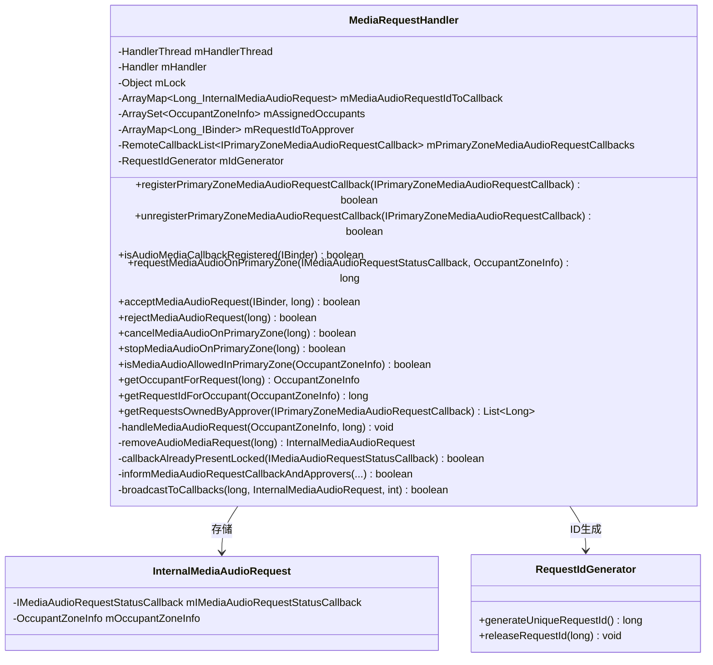
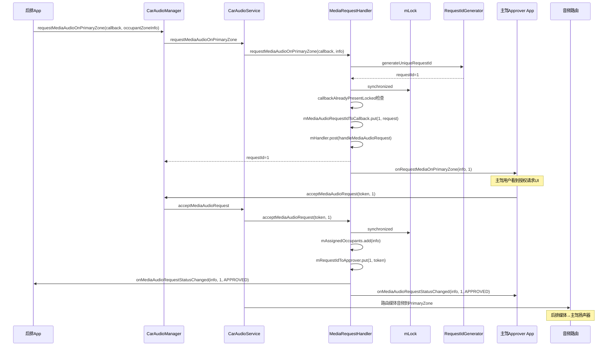
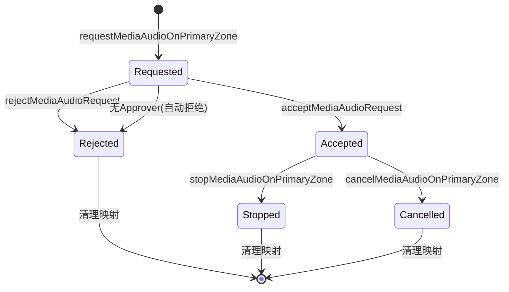
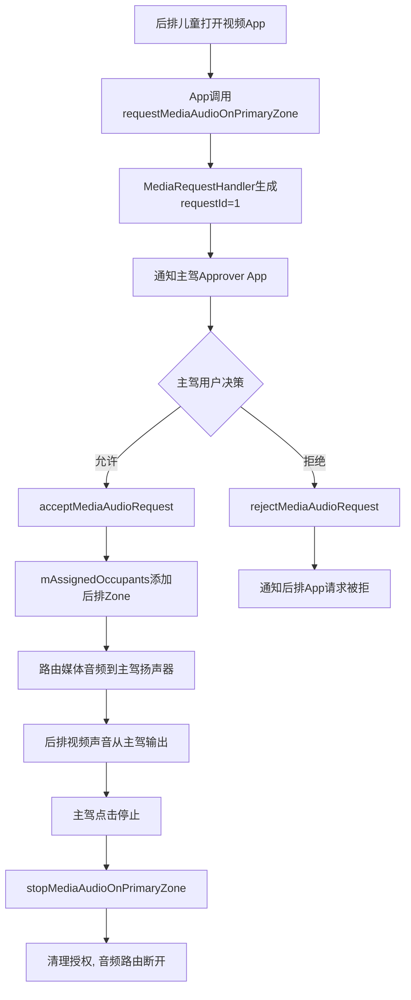
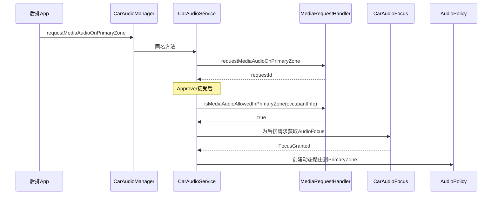

## 9.16 MediaRequestHandler — 媒体音频请求管理

> [← 上一个](09_9.15_CarAudioMirrorRequestHandler-音频镜像请求管理.md) | [返回目录](README.md) | [下一个 →](09_9.17_CoreAudioHelper-Core_Audio路由适配.md)

---

### 9.16.1 模块概述

[`MediaRequestHandler`](packages/services/Car/service/src/com/android/car/audio/MediaRequestHandler.java:47)管理AAOS中后排乘客(OccupantZone)请求在主驾Zone(PrimaryZone)播放媒体音频的授权协商流程。它维护请求ID到回调的映射，通过PrimaryZone注册的回调通知主驾用户进行授权决策。

**核心职责：**
- 管理媒体音频请求的完整生命周期（请求→授权→停止）
- 维护OccupantZone→PrimaryZone的授权映射
- 防止同一Callback重复请求
- 无Approver注册时自动拒绝请求

### 9.16.2 类结构



### 9.16.3 数据结构详解

| 字段 | 类型 | 说明 |
|------|------|------|
| `mMediaAudioRequestIdToCallback` | `ArrayMap<Long, InternalMediaAudioRequest>` | 请求ID → 请求内部数据（callback+occupant） |
| `mAssignedOccupants` | `ArraySet<OccupantZoneInfo>` | 已获授权的OccupantZone集合 |
| `mRequestIdToApprover` | `ArrayMap<Long, IBinder>` | 请求ID → Approver的IBinder标识 |
| `mPrimaryZoneMediaAudioRequestCallbacks` | `RemoteCallbackList` | PrimaryZone注册的Approver回调列表 |

### 9.16.4 requestMediaAudioOnPrimaryZone源码

```java
// MediaRequestHandler.java:108
long requestMediaAudioOnPrimaryZone(IMediaAudioRequestStatusCallback callback,
        CarOccupantZoneManager.OccupantZoneInfo info) {
    Objects.requireNonNull(callback, "Media audio request status callback can not be null");
    Objects.requireNonNull(info, "Occupant zone info can not be null");
    long requestId = mIdGenerator.generateUniqueRequestId();

    synchronized (mLock) {
        // 防止同一Callback重复请求
        if (callbackAlreadyPresentLocked(callback)) {
            Slogf.e(TAG, "Can not register media request callback, do not re-use callbacks");
            return INVALID_REQUEST_ID;
        }
        mMediaAudioRequestIdToCallback.put(requestId,
                new InternalMediaAudioRequest(callback, info));
    }
    // 异步处理请求通知
    mHandler.post(() -> handleMediaAudioRequest(info, requestId));
    return requestId;
}
```

**关键设计：**
1. `callbackAlreadyPresentLocked` — 通过Binder标识比对，防止同一客户端重复请求
2. `mHandler.post` — 异步通知Approver，避免调用方阻塞
3. 返回`INVALID_REQUEST_ID`(=0)表示请求失败

### 9.16.5 handleMediaAudioRequest源码

```java
// MediaRequestHandler.java:250
private void handleMediaAudioRequest(CarOccupantZoneManager.OccupantZoneInfo info,
        long requestId) {
    boolean handled = false;
    int n;
    synchronized (mLock) {
        n = mPrimaryZoneMediaAudioRequestCallbacks.beginBroadcast();
        for (int i = 0; i < n; i++) {
            IPrimaryZoneMediaAudioRequestCallback callback =
                    mPrimaryZoneMediaAudioRequestCallbacks.getBroadcastItem(i);
            try {
                callback.onRequestMediaOnPrimaryZone(info, requestId);
                handled = true;
            } catch (RemoteException e) {
                Slogf.e(TAG, e, "Could not handle Media request for request id %d", requestId);
            }
        }
        mPrimaryZoneMediaAudioRequestCallbacks.finishBroadcast();
    }
    // 无Approver注册 → 自动拒绝
    if (!handled) {
        rejectMediaAudioRequest(requestId);
    }
}
```

**自动拒绝机制：** 若无PrimaryZone Approver注册，请求无人处理，自动调用`rejectMediaAudioRequest`。

### 9.16.6 acceptMediaAudioRequest源码

```java
// MediaRequestHandler.java:129
boolean acceptMediaAudioRequest(IBinder token, long requestId) {
    Objects.requireNonNull(token, "Media request token can not be null");
    InternalMediaAudioRequest request;
    synchronized (mLock) {
        request = mMediaAudioRequestIdToCallback.get(requestId);
        if (request == null) {
            Slogf.w(TAG, "Request %d was remove before it was accepted", requestId);
            return false;
        }
        // 标记OccupantZone已授权
        mAssignedOccupants.add(request.mOccupantZoneInfo);
        // 记录Approver标识
        mRequestIdToApprover.put(requestId, token);
    }
    // 通知请求者和所有Approver
    return informMediaAudioRequestCallbackAndApprovers(
            request.mIMediaAudioRequestStatusCallback, request.mOccupantZoneInfo,
            "acceptance", requestId, /* allowed= */ true);
}
```

**Accept操作做了两件事：**
1. 将OccupantZone加入`mAssignedOccupants` — 后续`isMediaAudioAllowedInPrimaryZone`返回true
2. 记录Approver的IBinder到`mRequestIdToApprover` — 追踪谁授权了请求

### 9.16.7 rejectMediaAudioRequest源码

```java
// MediaRequestHandler.java:147
boolean rejectMediaAudioRequest(long requestId) {
    InternalMediaAudioRequest request = removeAudioMediaRequest(requestId);
    if (request == null) {
        Slogf.w(TAG, "Request %d was remove before it was rejected", requestId);
        return false;
    }
    mHandler.post(() -> informMediaAudioRequestCallbackAndApprovers(
            request.mIMediaAudioRequestStatusCallback, request.mOccupantZoneInfo,
            "rejection", requestId, /* allowed= */ false));
    return true;
}
```

### 9.16.8 removeAudioMediaRequest — 清理核心

```java
// MediaRequestHandler.java:310
private InternalMediaAudioRequest removeAudioMediaRequest(long requestId) {
    InternalMediaAudioRequest request;
    synchronized (mLock) {
        request = mMediaAudioRequestIdToCallback.remove(requestId);
        mIdGenerator.releaseRequestId(requestId);  // ID回收复用
        if (request == null) {
            return null;
        }
        mAssignedOccupants.remove(request.mOccupantZoneInfo);  // 移除授权
        mRequestIdToApprover.remove(requestId);  // 移除Approver映射
    }
    return request;
}
```

**清理操作三步：**
1. 从`mMediaAudioRequestIdToCallback`移除请求
2. 从`mAssignedOccupants`移除OccupantZone授权
3. 从`mRequestIdToApprover`移除Approver映射

### 9.16.9 媒体请求完整时序图



### 9.16.10 请求生命周期状态图



### 9.16.11 cancelMediaAudioOnPrimaryZone vs stopMediaAudioOnPrimaryZone

```java
// cancel: 由请求方主动取消 (MediaRequestHandler.java:160)
boolean cancelMediaAudioOnPrimaryZone(long requestId) {
    InternalMediaAudioRequest request = removeAudioMediaRequest(requestId);
    if (request == null) return false;
    // 通知请求方: CANCELLED
    request.mIMediaAudioRequestStatusCallback.onMediaAudioRequestStatusChanged(
            request.mOccupantZoneInfo, requestId,
            CarAudioManager.AUDIO_REQUEST_STATUS_CANCELLED);
    // 广播给Approver: CANCELLED
    return broadcastToCallbacks(requestId, request,
            CarAudioManager.AUDIO_REQUEST_STATUS_CANCELLED);
}

// stop: 由Approver主动停止 (MediaRequestHandler.java:179)
boolean stopMediaAudioOnPrimaryZone(long requestId) {
    InternalMediaAudioRequest request = removeAudioMediaRequest(requestId);
    if (request == null) return false;
    // 通知请求方: STOPPED
    request.mIMediaAudioRequestStatusCallback.onMediaAudioRequestStatusChanged(
            request.mOccupantZoneInfo, requestId,
            CarAudioManager.AUDIO_REQUEST_STATUS_STOPPED);
    // 广播给Approver: STOPPED
    return broadcastToCallbacks(requestId, request,
            CarAudioManager.AUDIO_REQUEST_STATUS_STOPPED);
}
```

| 对比维度 | cancel | stop |
|----------|--------|------|
| 发起方 | 后排乘客(请求方) | 主驾(Approver) |
| 状态码 | `AUDIO_REQUEST_STATUS_CANCELLED` | `AUDIO_REQUEST_STATUS_STOPPED` |
| 触发场景 | 后排乘客关闭App | 主驾不再允许后排播放 |
| 清理操作 | 相同(removeAudioMediaRequest) | 相同(removeAudioMediaRequest) |

### 9.16.12 callbackAlreadyPresentLocked — 防重复请求

```java
// MediaRequestHandler.java:239
@GuardedBy("mLock")
private boolean callbackAlreadyPresentLocked(IMediaAudioRequestStatusCallback callback) {
    for (int index = 0; index < mMediaAudioRequestIdToCallback.size(); index++) {
        InternalMediaAudioRequest request = mMediaAudioRequestIdToCallback.valueAt(index);
        if (request.mIMediaAudioRequestStatusCallback.asBinder().equals(callback.asBinder())) {
            return true;
        }
    }
    return false;
}
```

**为什么用Binder标识而非对象引用？** 跨进程场景下，同一客户端的Callback代理对象可能被重新创建，但Binder底层标识不变。

### 9.16.13 informMediaAudioRequestCallbackAndApprovers

```java
// MediaRequestHandler.java:326
private boolean informMediaAudioRequestCallbackAndApprovers(
        IMediaAudioRequestStatusCallback callback, OccupantZoneInfo info,
        String message, long requestId, boolean allowed) {
    int status = allowed ? CarAudioManager.AUDIO_REQUEST_STATUS_APPROVED :
            CarAudioManager.AUDIO_REQUEST_STATUS_REJECTED;
    // 1. 通知请求方(Accept/Reject结果)
    callback.onMediaAudioRequestStatusChanged(info, requestId, status);
    // 2. 广播给所有Approver(状态变更通知)
    synchronized (mLock) {
        int n = mPrimaryZoneMediaAudioRequestCallbacks.beginBroadcast();
        for (int i = 0; i < n; i++) {
            primaryCallback.onMediaAudioRequestStatusChanged(info, requestId, status);
        }
        mPrimaryZoneMediaAudioRequestCallbacks.finishBroadcast();
    }
    return handled;
}
```

### 9.16.14 辅助查询方法

```java
// 查询OccupantZone是否已获授权 (line 217)
boolean isMediaAudioAllowedInPrimaryZone(OccupantZoneInfo info) {
    if (info == null) return false;
    synchronized (mLock) {
        return mAssignedOccupants.contains(info);
    }
}

// 请求ID→OccupantZone反向查询 (line 197)
OccupantZoneInfo getOccupantForRequest(long requestId) {
    synchronized (mLock) {
        InternalMediaAudioRequest request = mMediaAudioRequestIdToCallback.get(requestId);
        return request == null ? null : request.mOccupantZoneInfo;
    }
}

// OccupantZone→请求ID正向查询 (line 205)
long getRequestIdForOccupant(OccupantZoneInfo info) {
    synchronized (mLock) {
        for (int index = 0; index < mMediaAudioRequestIdToCallback.size(); index++) {
            InternalMediaAudioRequest request = mMediaAudioRequestIdToCallback.valueAt(index);
            if (request.mOccupantZoneInfo.equals(info)) {
                return mMediaAudioRequestIdToCallback.keyAt(index);
            }
        }
    }
    return INVALID_REQUEST_ID;
}

// 查询Approver拥有的所有请求 (line 227)
List<Long> getRequestsOwnedByApprover(IPrimaryZoneMediaAudioRequestCallback callback) {
    List<Long> ownedRequests = new ArrayList<>();
    synchronized (mLock) {
        for (int index = 0; index < mRequestIdToApprover.size(); index++) {
            if (callback.asBinder().equals(mRequestIdToApprover.valueAt(index))) {
                ownedRequests.add(mRequestIdToApprover.keyAt(index));
            }
        }
    }
    return ownedRequests;
}
```

### 9.16.15 典型场景：后排儿童观看视频



### 9.16.16 与CarAudioService的集成



### 9.16.17 线程模型

```
主线程: requestMediaAudioOnPrimaryZone (同步生成ID, 异步post通知)
  ↓ mHandler.post
CarAudioMediaRequest线程: handleMediaAudioRequest (通知Approver)
  ↓ Approver响应
主线程: acceptMediaAudioRequest / rejectMediaAudioRequest (同步更新映射)
  ↓ mHandler.post
CarAudioMediaRequest线程: informMediaAudioRequestCallbackAndApprovers (通知请求方)
```

- `mHandlerThread`名称: `CarAudioMediaRequest`
- 所有广播通知在HandlerThread上执行
- 映射操作(`mLock`保护)在调用方线程同步执行

### 9.16.18 调试与Dump

```bash
# 查看媒体请求状态
adb shell dumpsys car_service | grep -A 30 "Media request handler"

# 输出示例:
# Media request handler:
#   Media request callbacks[1]:
#     Callback[0]: android.car.media.IPrimaryZoneMediaAudioRequestCallback$Stub$Proxy@abc123
#   Assigned occupant zones[1]:
#     OccupantZoneInfo{zoneId=2, occupantType=OCCUPANT_TYPE_REAR_PASSENGER, seat=SEAT_ROW2_LEFT}
#   Request id to callback[1]:
#     1 : Occupant zone info: OccupantZoneInfo{zoneId=2...} Callback: ...
#   Request id to approver[1]:
#     1 : android.os.BinderProxy@def456

# 检查授权状态
adb shell dumpsys car_service | grep "isMediaAudioAllowed"
```

---