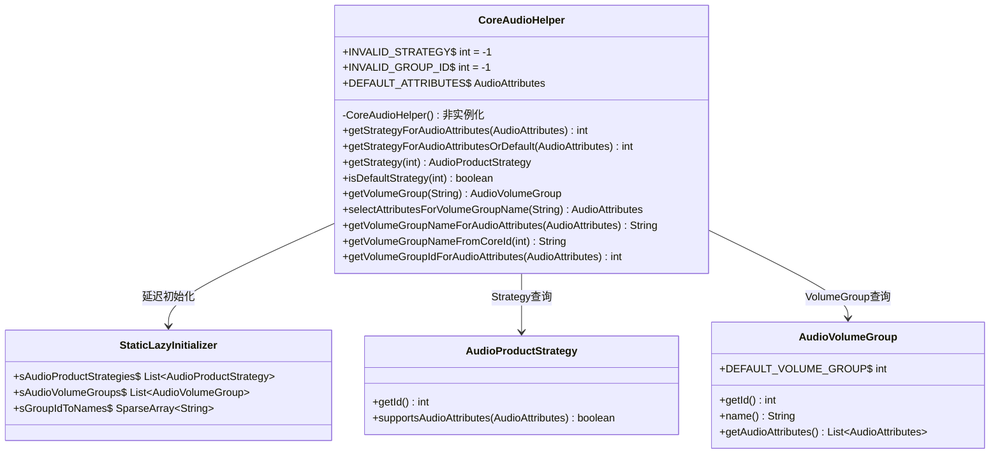
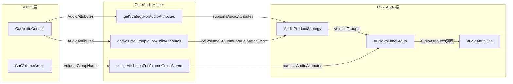
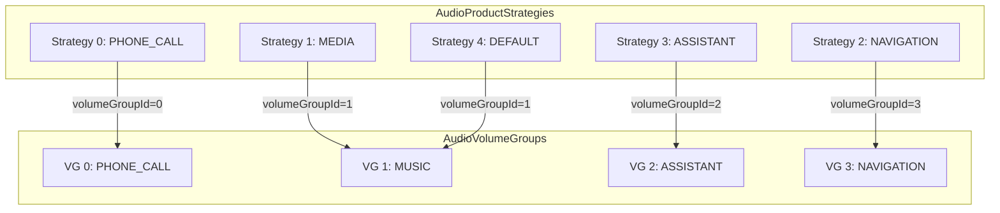
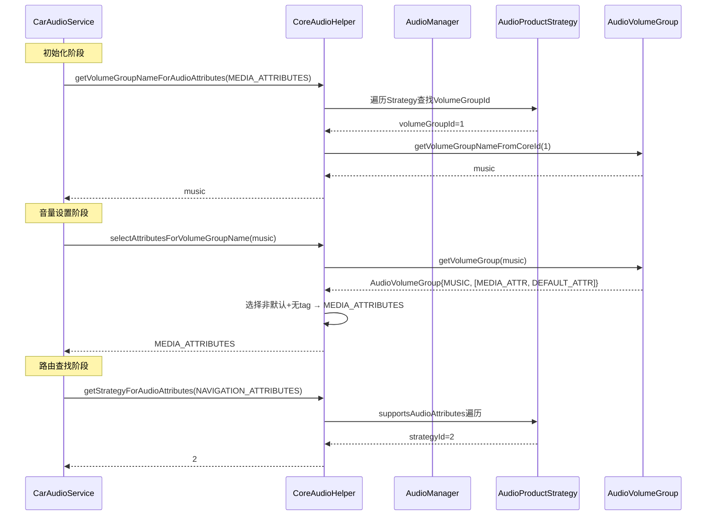

## 9.17 CoreAudioHelper — Core Audio路由适配

> [← 上一个](09_9.16_MediaRequestHandler-媒体音频请求管理.md) | [返回目录](README.md) | [下一个 →](09_9.18_CarAudioZonesHelper-XML配置解析.md)

---

### 9.17.1 模块概述

[`CoreAudioHelper`](packages/services/Car/service/src/com/android/car/audio/CoreAudioHelper.java:41)是AAOS与Android Core Audio框架的静态桥接层。它将`AudioProductStrategy`和`AudioVolumeGroup`映射到AAOS的`CarAudioContext`体系，使CarAudioService能利用Core Audio的路由和音量管理能力。

**核心职责：**
- 根据AudioAttributes查找匹配的AudioProductStrategy
- 根据AudioAttributes查找所属的AudioVolumeGroup
- 为VolumeGroupName选择最佳AudioAttributes
- 提供Strategy和VolumeGroup的查询接口

**设计特点：** 纯静态工具类，不可实例化，所有方法为static。

### 9.17.2 类结构



### 9.17.3 延迟初始化机制

```java
// CoreAudioHelper.java:77
private static class StaticLazyInitializer {
    static final List<AudioProductStrategy> sAudioProductStrategies =
            AudioManager.getAudioProductStrategies();
    static final List<AudioVolumeGroup> sAudioVolumeGroups =
            AudioManager.getAudioVolumeGroups();
    static final SparseArray<String> sGroupIdToNames = new SparseArray<>() {
        {
            for (int index = 0; index < sAudioVolumeGroups.size(); index++) {
                AudioVolumeGroup group = sAudioVolumeGroups.get(index);
                put(group.getId(), group.name());
            }
        }
    };
}
```

**为什么用延迟初始化而非静态块？**
- 单元测试需要mock静态方法，静态块在类加载时执行导致mock时机不对
- `StaticLazyInitializer`内部类在首次访问时才加载，给测试框架留出mock窗口

### 9.17.4 getStrategyForAudioAttributes源码

```java
// CoreAudioHelper.java:105
public static int getStrategyForAudioAttributes(AudioAttributes attributes) {
    Preconditions.checkNotNull(attributes, "Audio Attributes must not be null");
    for (int index = 0; index < getAudioProductStrategies().size(); index++) {
        AudioProductStrategy strategy = getAudioProductStrategies().get(index);
        if (strategy.supportsAudioAttributes(attributes)) {
            return strategy.getId();
        }
    }
    return INVALID_STRATEGY;  // -1
}
```

### 9.17.5 getStrategyForAudioAttributesOrDefault源码

```java
// CoreAudioHelper.java:126
public static int getStrategyForAudioAttributesOrDefault(AudioAttributes attributes) {
    int strategyId = getStrategyForAudioAttributes(attributes);
    return strategyId == INVALID_STRATEGY
            ? getStrategyForAudioAttributes(DEFAULT_ATTRIBUTES) : strategyId;
}
```

**Fallback策略：** 若AudioAttributes无匹配Strategy，则回退到默认Strategy（支持`DEFAULT_ATTRIBUTES`的Strategy）。

### 9.17.6 selectAttributesForVolumeGroupName源码

```java
// CoreAudioHelper.java:199
public static AudioAttributes selectAttributesForVolumeGroupName(String groupName) {
    AudioVolumeGroup group = getVolumeGroup(groupName);
    AudioAttributes bestAttributes = DEFAULT_ATTRIBUTES;
    if (group == null) {
        return bestAttributes;
    }
    for (int index = 0; index < group.getAudioAttributes().size(); index++) {
        AudioAttributes attributes = group.getAudioAttributes().get(index);
        // 选择非默认且无tag的Attributes(最通用)
        if (!attributes.equals(DEFAULT_ATTRIBUTES)) {
            bestAttributes = attributes;
            if (!VersionUtils.isPlatformVersionAtLeastU()
                    || Objects.equals(AudioManagerHelper.getFormattedTags(attributes), "")) {
                break;  // 找到最佳: 非默认 + 无tag
            }
        }
    }
    return bestAttributes;
}
```

**选择优先级：**
1. 非DEFAULT_ATTRIBUTES + 无tag → 最佳（最通用）
2. 非DEFAULT_ATTRIBUTES + 有tag → 次选（U版本以上）
3. DEFAULT_ATTRIBUTES → 兜底

### 9.17.7 getVolumeGroupIdForAudioAttributes源码

```java
// CoreAudioHelper.java:254
public static int getVolumeGroupIdForAudioAttributes(AudioAttributes attributes) {
    Preconditions.checkNotNull(attributes, "Audio Attributes must not be null");
    if (!VersionUtils.isPlatformVersionAtLeastU()) {
        Slogf.e(TAG, "AudioManagerHelper.getVolumeGroupIdForAudioAttributes()"
                + " not supported for this build version");
        return INVALID_GROUP_ID;
    }
    for (int index = 0; index < getAudioProductStrategies().size(); index++) {
        AudioProductStrategy strategy = getAudioProductStrategies().get(index);
        int volumeGroupId =
                AudioManagerHelper.getVolumeGroupIdForAudioAttributes(strategy, attributes);
        if (volumeGroupId != AudioVolumeGroup.DEFAULT_VOLUME_GROUP) {
            return volumeGroupId;
        }
    }
    return INVALID_GROUP_ID;  // -1
}
```

**查找逻辑：** 遍历所有AudioProductStrategy，通过`AudioManagerHelper`查询每个Strategy下AudioAttributes所属的VolumeGroup ID。

### 9.17.8 AAOS与Core Audio映射关系



### 9.17.9 查询方法汇总

| 方法 | 输入 | 输出 | 回退值 |
|------|------|------|--------|
| `getStrategyForAudioAttributes` | AudioAttributes | strategyId | `INVALID_STRATEGY`(-1) |
| `getStrategyForAudioAttributesOrDefault` | AudioAttributes | strategyId | 默认Strategy的ID |
| `getStrategy` | strategyId | AudioProductStrategy | null |
| `isDefaultStrategy` | strategyId | boolean | false |
| `getVolumeGroup` | groupName | AudioVolumeGroup | null |
| `selectAttributesForVolumeGroupName` | groupName | AudioAttributes | `DEFAULT_ATTRIBUTES` |
| `getVolumeGroupNameForAudioAttributes` | AudioAttributes | groupName | null |
| `getVolumeGroupNameFromCoreId` | coreGroupId | groupName | null |
| `getVolumeGroupIdForAudioAttributes` | AudioAttributes | volumeGroupId | `INVALID_GROUP_ID`(-1) |

### 9.17.10 Strategy与VolumeGroup关系图



### 9.17.11 CarAudioService中的使用



### 9.17.12 版本兼容性

| API | 最低版本要求 | 降级处理 |
|-----|-------------|---------|
| `AudioManager.getAudioProductStrategies()` | R+ | 空列表 |
| `AudioManager.getAudioVolumeGroups()` | R+ | 空列表 |
| `AudioManagerHelper.getVolumeGroupIdForAudioAttributes()` | U+ | 返回`INVALID_GROUP_ID` |
| `AudioManagerHelper.getFormattedTags()` | U+ | 不影响核心逻辑 |

### 9.17.13 典型数据流：从CarAudioContext到Core Audio

```
CarAudioContext.MUSIC
  → AudioAttributes.Builder()
      .setUsage(AudioAttributes.USAGE_MEDIA)
      .build()
  → CoreAudioHelper.getStrategyForAudioAttributes(MEDIA_ATTR)
  → Strategy 1 (supportsAudioAttributes返回true)
  → strategyId = 1
  → CoreAudioHelper.getVolumeGroupIdForAudioAttributes(MEDIA_ATTR)
  → volumeGroupId = 1
  → CoreAudioHelper.getVolumeGroupNameFromCoreId(1)
  → music
  → 匹配CarVolumeGroup中的coreAudioGroupName=music
```

### 9.17.14 调试与验证

```bash
# 查看所有AudioProductStrategy
adb shell dumpsys audio | grep -A 5 "Product Strategies"

# 查看所有AudioVolumeGroup
adb shell dumpsys audio | grep -A 10 "Volume Groups"

# 输出示例:
# Volume Groups (count: 4)
#   Group 0: name=phone_call
#     Audio Attributes: USAGE_VOICE_COMMUNICATION
#   Group 1: name=music
#     Audio Attributes: USAGE_MEDIA, USAGE_GAME
#   Group 2: name=assistant
#     Audio Attributes: USAGE_ASSISTANCE_NAVIGATION_GUIDE
#   Group 3: name=navigation
#     Audio Attributes: USAGE_ASSISTANCE_NAVIGATION_GUIDE

# 验证Strategy映射
adb shell dumpsys audio | grep "Strategy"
```

---