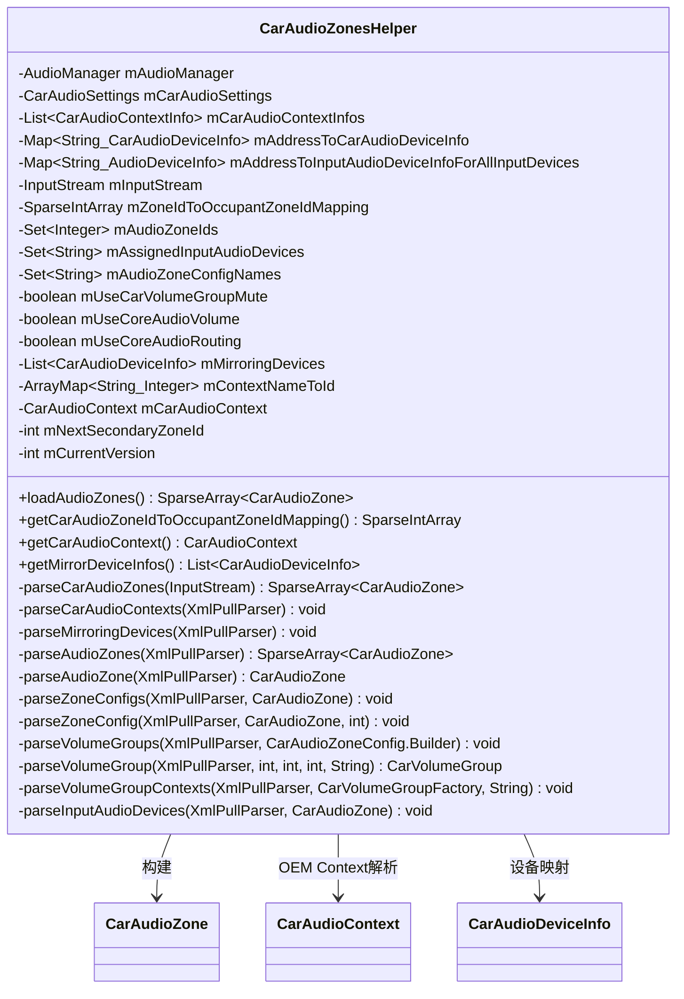
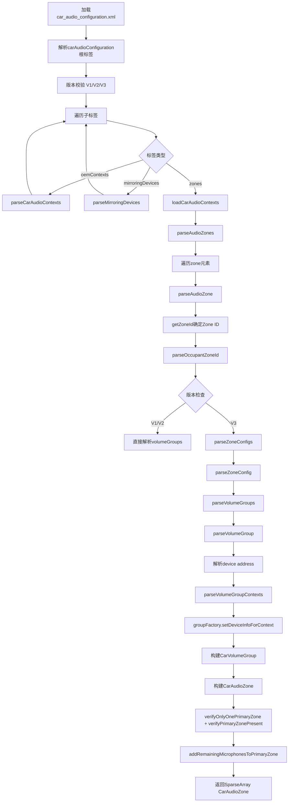
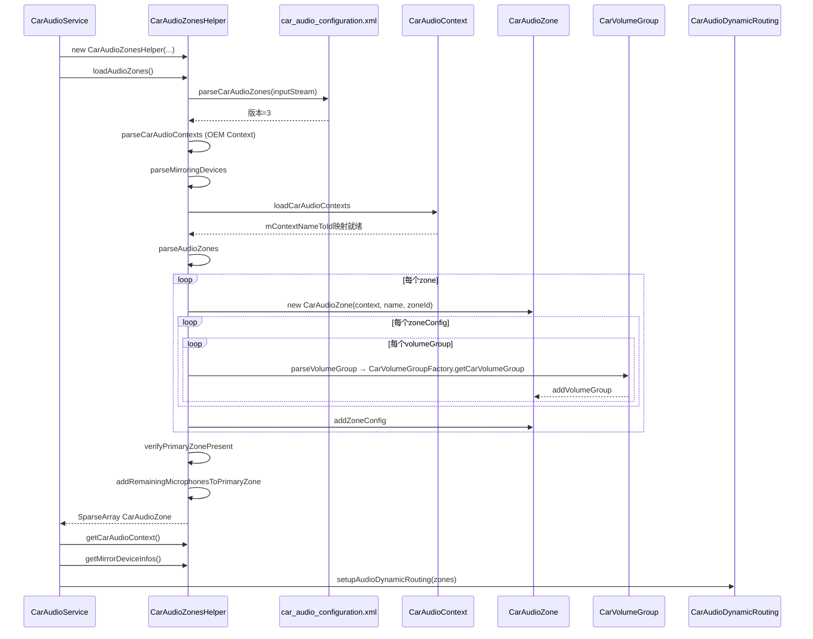

## 9.18 CarAudioZonesHelper — XML配置解析

> [← 上一个](09_9.17_CoreAudioHelper-Core_Audio路由适配.md) | [返回目录](README.md) | [下一篇 →](../10_AudioControl_HAL/README.md)

---

### 9.18.1 模块概述

[`CarAudioZonesHelper`](packages/services/Car/service/src/com/android/car/audio/CarAudioZonesHelper.java:61)负责从`car_audio_configuration.xml`解析完整的AAOS音频配置，构建`CarAudioZone`列表、`CarVolumeGroup`列表、设备映射关系和镜像设备池。它是AAOS音频系统的**配置入口**。

**核心职责：**
- 解析XML构建CarAudioZone和CarVolumeGroup对象树
- 支持V1/V2/V3三个版本的XML格式
- 解析OEM自定义Context和AudioAttributes映射
- 解析镜像设备池和输入设备
- 校验配置合法性（Zone ID唯一、Primary唯一、设备不重复）

### 9.18.2 类结构



### 9.18.3 XML配置版本对比

| 特性 | V1 | V2 | V3 |
|------|----|----|-----|
| Zone ID自动分配 | 是(递增) | 需显式指定 | 需显式指定 |
| OccupantZoneId | 不支持 | 支持 | 支持 |
| 输入设备配置 | 不支持 | 支持 | 支持 |
| ZoneConfig多配置 | 不支持 | 不支持 | 支持 |
| 镜像设备 | 不支持 | 不支持 | 支持 |
| OEM Context | 不支持 | 不支持 | 支持 |
| AudioAttribute标签 | 仅usage | 仅usage | usage+contentType+tags |
| VolumeGroup名称 | 自动生成 | 自动生成 | 需显式指定(Core Volume) |

### 9.18.4 XML标签层级结构

```
carAudioConfiguration (version="3")
├── oemContexts                           [V3+]
│   └── oemContext (name="...")
│       └── audioAttributes
│           └── usage (value="AUDIO_USAGE_...")  [V1/V2]
│           └── audioAttribute (usage="...", contentType="...", tags="...")  [V3+]
├── mirroringDevices                      [V3+]
│   └── mirroringDevice (address="...")
└── zones
    └── zone (audioZoneId="0" isPrimary="true" name="..." occupantZoneId="...")
        ├── inputDevices                   [V2+]
        │   └── inputDevice (address="...")
        ├── volumeGroups                  [V1/V2 直接在zone下]
        │   └── group (name="...")
        │       └── device (address="...")
        │           └── context (context="...")
        └── zoneConfigs                   [V3+]
            └── zoneConfig (name="..." isDefault="true")
                └── volumeGroups
                    └── group (name="...")
                        └── device (address="...")
                            └── context (context="...")
```

### 9.18.5 parseCarAudioZones源码 — 解析入口

```java
// CarAudioZonesHelper.java:188
private SparseArray<CarAudioZone> parseCarAudioZones(InputStream stream)
        throws XmlPullParserException, IOException {
    XmlPullParser parser = Xml.newPullParser();
    parser.setInput(stream, null);
    // 确认根标签
    parser.nextTag();
    parser.require(XmlPullParser.START_TAG, NAMESPACE, TAG_ROOT);
    // 版本校验
    final int versionNumber = Integer.parseInt(
            parser.getAttributeValue(NAMESPACE, ATTR_VERSION));
    if (SUPPORTED_VERSIONS.get(versionNumber, INVALID_VERSION) == INVALID_VERSION) {
        throw new IllegalArgumentException("Latest Supported version:"
                + SUPPORTED_VERSION_3 + " , got version:" + versionNumber);
    }
    mCurrentVersion = versionNumber;
    // 按标签分发解析
    while (parser.next() != XmlPullParser.END_TAG) {
        if (parser.getEventType() != XmlPullParser.START_TAG) continue;
        if (TAG_OEM_CONTEXTS.equals(parser.getName())) {
            parseCarAudioContexts(parser);
        } else if (TAG_MIRRORING_DEVICES.equals(parser.getName())) {
            parseMirroringDevices(parser);
        } else if (TAG_AUDIO_ZONES.equals(parser.getName())) {
            loadCarAudioContexts();  // 加载Context映射
            return parseAudioZones(parser);
        } else {
            skip(parser);
        }
    }
    throw new MissingResourceException(TAG_AUDIO_ZONES + " is missing", ...);
}
```

### 9.18.6 OEM Context解析

```java
// CarAudioZonesHelper.java:285
private void parseCarAudioContext(XmlPullParser parser, int contextId)
        throws XmlPullParserException, IOException {
    String contextName = parser.getAttributeValue(NAMESPACE, ATTR_NAME);
    while (parser.next() != XmlPullParser.END_TAG) {
        if (parser.getEventType() != XmlPullParser.START_TAG) continue;
        if (TAG_AUDIO_ATTRIBUTES.equals(parser.getName())) {
            List<AudioAttributes> attributes = parseAudioAttributes(parser, contextName);
            // Core Audio Routing模式下, contextId = strategyId
            if (mUseCoreAudioRouting) {
                contextId = CoreAudioHelper.getStrategyForAudioAttributes(attributes.get(0));
                if (contextId == CoreAudioHelper.INVALID_STRATEGY) {
                    throw new IllegalArgumentException(
                            "Cannot find strategy id for context: " + contextName);
                }
            }
            validateCarAudioContextAttributes(contextId, attributes, contextName);
            context = new CarAudioContextInfo(
                    attributes.toArray(new AudioAttributes[0]), contextName, contextId);
            mCarAudioContextInfos.add(context);
        }
    }
}
```

**OEM Context机制：** V3允许自定义Context名称和AudioAttributes映射，替代默认的CarAudioContext定义。

### 9.18.7 loadCarAudioContexts源码

```java
// CarAudioZonesHelper.java:257
private void loadCarAudioContexts() {
    // 无OEM Context时使用默认Context
    if (isVersionLessThanThree() || mCarAudioContextInfos.isEmpty()) {
        mCarAudioContextInfos.addAll(CarAudioContext.getAllContextsInfo());
    }
    // 构建名称→ID映射
    for (int index = 0; index < mCarAudioContextInfos.size(); index++) {
        CarAudioContextInfo info = mCarAudioContextInfos.get(index);
        mContextNameToId.put(info.getName().toLowerCase(ROOT), info.getId());
    }
    mCarAudioContext = new CarAudioContext(mCarAudioContextInfos, mUseCoreAudioRouting);
}
```

### 9.18.8 Zone解析 — parseAudioZone

```java
// CarAudioZonesHelper.java:458
private CarAudioZone parseAudioZone(XmlPullParser parser)
        throws XmlPullParserException, IOException {
    final boolean isPrimary = Boolean.parseBoolean(
            parser.getAttributeValue(NAMESPACE, ATTR_IS_PRIMARY));
    final String zoneName = parser.getAttributeValue(NAMESPACE, ATTR_ZONE_NAME);
    final int audioZoneId = getZoneId(isPrimary, parser);
    parseOccupantZoneId(audioZoneId, parser);
    final CarAudioZone zone = new CarAudioZone(mCarAudioContext, zoneName, audioZoneId);

    if (isVersionLessThanThree()) {
        // V1/V2: volumeGroups直接在zone下
        CarAudioZoneConfig.Builder zoneConfigBuilder = new CarAudioZoneConfig.Builder(
                zoneName, audioZoneId, 0, true);
        while (parser.next() != XmlPullParser.END_TAG) {
            if (TAG_VOLUME_GROUPS.equals(parser.getName())) {
                parseVolumeGroups(parser, zoneConfigBuilder);
            } else if (TAG_INPUT_DEVICES.equals(parser.getName())) {
                parseInputAudioDevices(parser, zone);
            }
        }
        zone.addZoneConfig(zoneConfigBuilder.build());
    } else {
        // V3: zoneConfigs包装volumeGroups
        while (parser.next() != XmlPullParser.END_TAG) {
            if (TAG_AUDIO_ZONE_CONFIGS.equals(parser.getName())) {
                parseZoneConfigs(parser, zone);
            } else if (TAG_INPUT_DEVICES.equals(parser.getName())) {
                parseInputAudioDevices(parser, zone);
            }
        }
    }
    return zone;
}
```

### 9.18.9 Zone ID确定逻辑

```java
// CarAudioZonesHelper.java:497
private int getZoneId(boolean isPrimary, XmlPullParser parser) {
    String audioZoneIdString = parser.getAttributeValue(NAMESPACE, ATTR_ZONE_ID);
    if (isVersionOne()) {
        // V1: 不允许显式指定Zone ID
        return isPrimary ? PRIMARY_AUDIO_ZONE : getNextSecondaryZoneId();
    }
    // V2+: Primary可不指定(默认0), 非Primary必须指定
    if (isPrimary && audioZoneIdString == null) {
        return PRIMARY_AUDIO_ZONE;
    }
    int zoneId = parsePositiveIntAttribute(ATTR_ZONE_ID, audioZoneIdString);
    // Primary Zone ID必须是0, 非Primary不能是0
    if (isPrimary) {
        Preconditions.checkArgument(zoneId == PRIMARY_AUDIO_ZONE, ...);
    } else {
        Preconditions.checkArgument(zoneId != PRIMARY_AUDIO_ZONE, ...);
    }
    validateAudioZoneIdIsUnique(zoneId);
    return zoneId;
}
```

### 9.18.10 VolumeGroup解析 — parseVolumeGroup

```java
// CarAudioZonesHelper.java:685
private CarVolumeGroup parseVolumeGroup(XmlPullParser parser, int zoneId, int configId,
        int groupId, String groupName) throws XmlPullParserException, IOException {
    CarVolumeGroupFactory groupFactory = new CarVolumeGroupFactory(mAudioManager,
            mCarAudioSettings, mCarAudioContext, zoneId, configId, groupId, groupName,
            mUseCarVolumeGroupMute);
    while (parser.next() != XmlPullParser.END_TAG) {
        if (parser.getEventType() != XmlPullParser.START_TAG) continue;
        if (TAG_AUDIO_DEVICE.equals(parser.getName())) {
            String address = parser.getAttributeValue(NAMESPACE, ATTR_DEVICE_ADDRESS);
            validateOutputDeviceExist(address);  // 验证设备存在
            parseVolumeGroupContexts(parser, groupFactory, address);
        }
    }
    return groupFactory.getCarVolumeGroup(mUseCoreAudioVolume);
}
```

### 9.18.11 Context→Device映射 — parseVolumeGroupContexts

```java
// CarAudioZonesHelper.java:711
private void parseVolumeGroupContexts(XmlPullParser parser,
        CarVolumeGroupFactory groupFactory, String address)
        throws XmlPullParserException, IOException {
    while (parser.next() != XmlPullParser.END_TAG) {
        if (parser.getEventType() != XmlPullParser.START_TAG) continue;
        if (TAG_CONTEXT.equals(parser.getName())) {
            int carAudioContextId = parseCarAudioContextId(
                    parser.getAttributeValue(NAMESPACE, ATTR_CONTEXT_NAME));
            validateCarAudioContextSupport(carAudioContextId);
            CarAudioDeviceInfo info = mAddressToCarAudioDeviceInfo.get(address);
            groupFactory.setDeviceInfoForContext(carAudioContextId, info);
            // V1: 默认Context也映射到同一设备
            if (isVersionOne() && carAudioContextId == mCarAudioContext
                    .getContextForAudioAttribute(CAR_DEFAULT_AUDIO_ATTRIBUTE)) {
                groupFactory.setNonLegacyContexts(info);
            }
        }
    }
}
```

### 9.18.12 XML解析完整流程图



### 9.18.13 镜像设备解析

```java
// CarAudioZonesHelper.java:246
private void parseMirroringDevice(XmlPullParser parser) {
    String address = parser.getAttributeValue(NAMESPACE, ATTR_DEVICE_ADDRESS);
    validateOutputDeviceExist(address);  // 设备必须存在
    CarAudioDeviceInfo info = mAddressToCarAudioDeviceInfo.get(address);
    if (mMirroringDevices.contains(info)) {
        throw new IllegalArgumentException(TAG_MIRRORING_DEVICE + " " + address
                + " repeats, " + TAG_MIRRORING_DEVICES + " can not repeat.");
    }
    mMirroringDevices.add(info);
}
```

**镜像设备约束：**
- 仅V3+支持
- 设备地址不能重复
- 设备必须存在于AudioPolicy配置中

### 9.18.14 配置校验规则

| 校验项 | 规则 | 错误类型 |
|--------|------|---------|
| 版本号 | 必须为1/2/3 | `IllegalArgumentException` |
| Primary Zone | 有且仅有一个 | `RuntimeException` |
| Zone ID | V1自动分配; V2+非Primary必须显式指定; 全局唯一 | `IllegalArgumentException` |
| OccupantZoneId | V2+支持; 全局唯一 | `IllegalArgumentException` |
| 输出设备地址 | 必须存在于AudioPolicy配置 | `IllegalStateException` |
| 输入设备地址 | V2+支持; 不能重复 | `IllegalArgumentException` |
| 镜像设备 | V3+支持; 不能重复 | `IllegalArgumentException` |
| VolumeGroup名称 | Core Volume模式下必须指定; ZoneConfig内不能重复 | `IllegalArgumentException` |
| ZoneConfig | Primary Zone只能有一个; 名称全局唯一 | `IllegalArgumentException` |
| OEM Context | Attributes必须匹配Core Audio Strategy | `IllegalArgumentException` |
| Context | V1不支持系统Context(EMERGENCY/SAFETY等) | `IllegalArgumentException` |

### 9.18.15 V3 ZoneConfig多配置机制

```java
// CarAudioZonesHelper.java:608
private void parseZoneConfigs(XmlPullParser parser, CarAudioZone zone)
        throws XmlPullParserException, IOException {
    int zoneConfigId = 0;
    while (parser.next() != XmlPullParser.END_TAG) {
        if (TAG_AUDIO_ZONE_CONFIG.equals(parser.getName())) {
            // Primary Zone不允许有多个Config
            if (zone.getId() == PRIMARY_AUDIO_ZONE && zoneConfigId > 0) {
                throw new IllegalArgumentException(
                        "Primary zone cannot have multiple zone configurations");
            }
            parseZoneConfig(parser, zone, zoneConfigId);
            zoneConfigId++;
        }
    }
}
```

**ZoneConfig设计：**
- 非Primary Zone可配置多个ZoneConfig（如白天模式/夜间模式）
- Primary Zone只能有一个Config
- 每个Config包含独立的VolumeGroup集合
- `isDefault`标记默认激活的Config

### 9.18.16 CarAudioService集成时序图



### 9.18.17 输入设备自动分配

```java
// CarAudioZonesHelper.java:435
private void addRemainingMicrophonesToPrimaryZone(SparseArray<CarAudioZone> carAudioZones) {
    CarAudioZone primaryAudioZone = carAudioZones.get(PRIMARY_AUDIO_ZONE);
    for (AudioDeviceInfo info : mAddressToInputAudioDeviceInfoForAllInputDevices.values()) {
        // 未被任何Zone显式分配的麦克风 → 自动分配给Primary Zone
        if (!mAssignedInputAudioDevices.contains(info.getAddress())
                && isMicrophoneInputDevice(info)) {
            primaryAudioZone.addInputAudioDevice(new AudioDeviceAttributes(info));
        }
    }
}
```

**自动分配规则：** 未在XML中显式配置的麦克风设备，自动归入Primary Zone。

### 9.18.18 典型XML配置示例(V3)

```xml
<?xml version="1.0" encoding="utf-8"?>
<carAudioConfiguration version="3">
    <oemContexts>
        <oemContext name="system">
            <audioAttributes>
                <audioAttribute usage="AUDIO_USAGE_ASSISTANCE_SAFETY"/>
            </audioAttributes>
        </oemContext>
    </oemContexts>
    <mirroringDevices>
        <mirroringDevice address="mirror_device_0_out"/>
    </mirroringDevices>
    <zones>
        <zone name="primary zone" isPrimary="true">
            <zoneConfigs>
                <zoneConfig name="primary config" isDefault="true">
                    <volumeGroups>
                        <group name="media">
                            <device address="bus0_media_out">
                                <context context="music"/>
                            </device>
                        </group>
                        <group name="navigation">
                            <device address="bus1_nav_out">
                                <context context="navigation"/>
                            </device>
                        </group>
                    </volumeGroups>
                </zoneConfig>
            </zoneConfigs>
        </zone>
        <zone name="rear zone" audioZoneId="1" occupantZoneId="2">
            <zoneConfigs>
                <zoneConfig name="day config" isDefault="true">
                    <volumeGroups>
                        <group name="rear media">
                            <device address="bus100_rear_media_out">
                                <context context="music"/>
                            </device>
                        </group>
                    </volumeGroups>
                </zoneConfig>
                <zoneConfig name="night config" isDefault="false">
                    <volumeGroups>
                        <group name="rear media night">
                            <device address="bus100_rear_media_out">
                                <context context="music"/>
                            </device>
                        </group>
                    </volumeGroups>
                </zoneConfig>
            </zoneConfigs>
            <inputDevices>
                <inputDevice address="bus_100_rear_mic_in"/>
            </inputDevices>
        </zone>
    </zones>
</carAudioConfiguration>
```

### 9.18.19 调试与验证

```bash
# 查看解析后的Zone配置
adb shell dumpsys car_service | grep -A 50 "Audio Zone"

# 输出示例:
# Primary Zone:
#   Zone config 0: primary config (default)
#     Volume Group 0: media
#       Device: bus0_media_out
#         Context: music
#     Volume Group 1: navigation
#       Device: bus1_nav_out
#         Context: navigation
# Rear Zone (id=1, occupantZoneId=2):
#   Zone config 0: day config (default)
#     Volume Group 0: rear media
#       Device: bus100_rear_media_out
#         Context: music
#   Zone config 1: night config

# 查看镜像设备
adb shell dumpsys car_service | grep -A 5 "Mirroring"

# 验证Context映射
adb shell dumpsys car_service | grep "CarAudioContext"
```

---