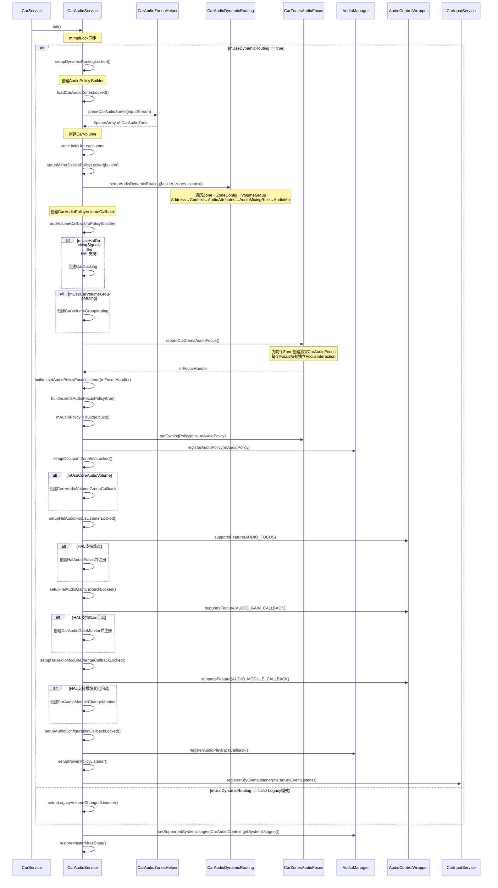
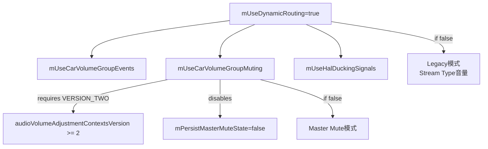
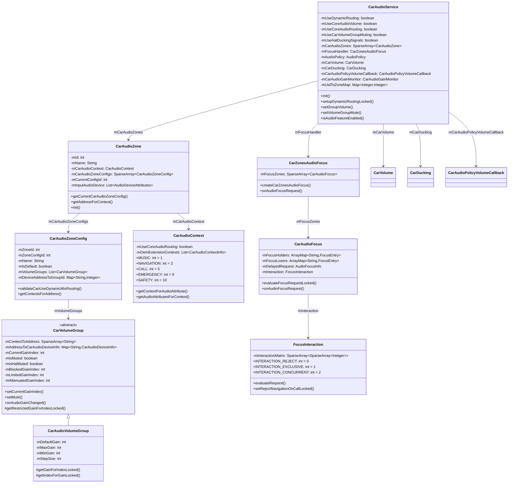
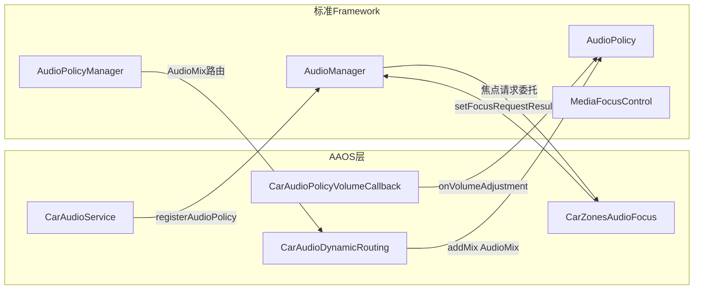
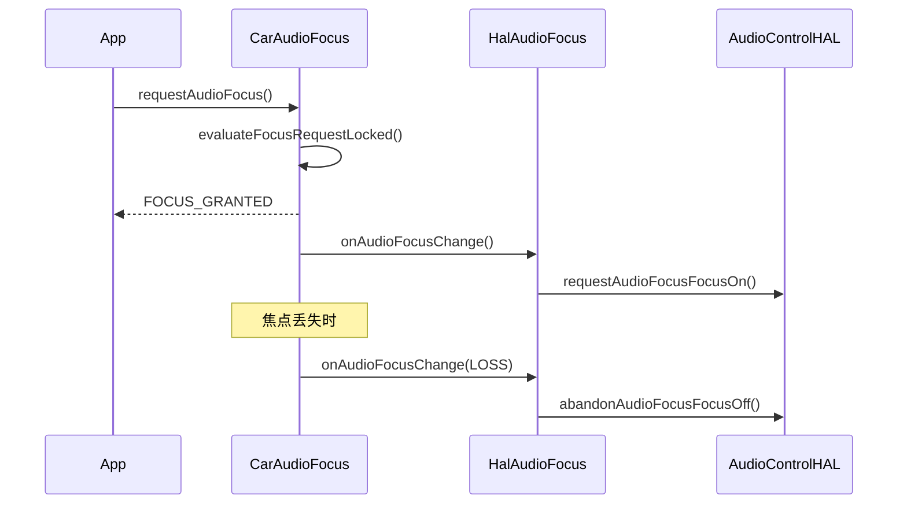
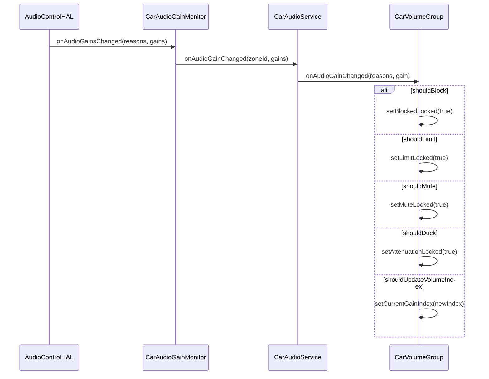
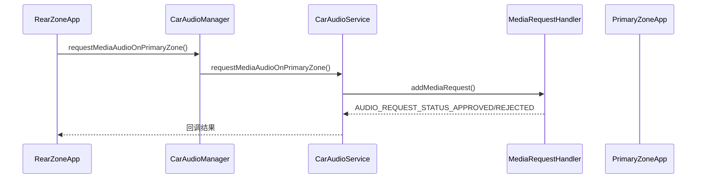
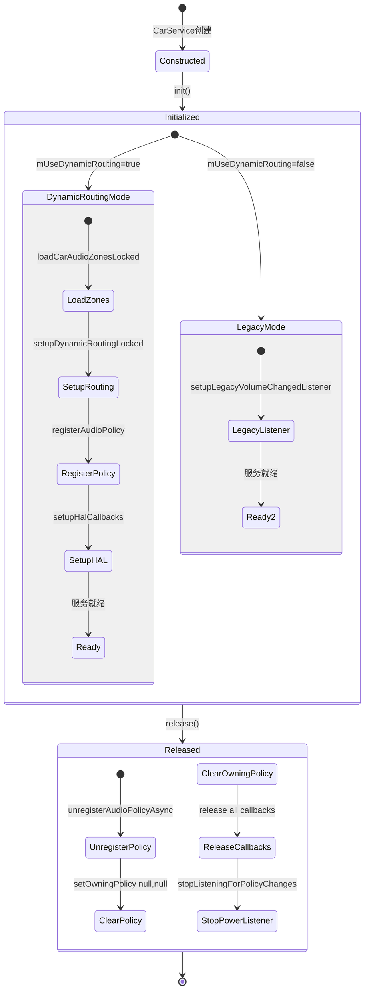
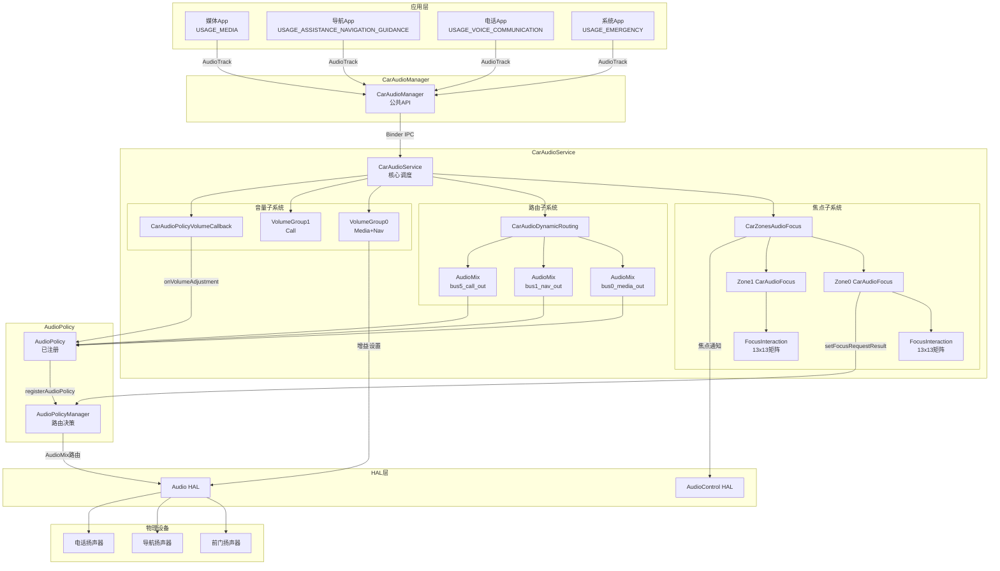

## 9.1 AAOS音频系统总览

> AAOS车载音频系统在标准Android Audio之上构建了多Zone、交互矩阵焦点、VolumeGroup音量、系统级Ducking等车载特有能力，由CarAudioService统一协调

---

### 9.1.1 AAOS vs 标准Android Audio全维度对比

AAOS（Android Automotive OS）并非简单扩展标准Android Audio，而是针对车载场景进行了架构级重构。下表从源码层面展示两者在每个维度的本质差异：

| 维度 | 标准Android Audio | AAOS Car Audio | 源码依据 |
|------|-------------------|----------------|----------|
| 音频Zone | 单Zone，所有音频路由到同一输出 | 多Zone独立路由，主Zone/后排/乘客Zone | [`CarAudioZone`](packages/services/Car/service/src/com/android/car/audio/CarAudioZone.java:51) |
| 焦点管理 | MediaFocusControl栈模型 | CarAudioFocus + 13x13交互矩阵 | [`FocusInteraction`](packages/services/Car/service/src/com/android/car/audio/FocusInteraction.java) |
| 焦点并发 | 严格栈顶获取，其他LOSE | REJECT/EXCLUSIVE/CONCURRENT三种交互 | [`FocusInteraction.evaluateRequest()`](packages/services/Car/service/src/com/android/car/audio/FocusInteraction.java:414) |
| 音量控制 | Stream Type音量 | VolumeGroup音量 + Gain Index映射 | [`CarVolumeGroup`](packages/services/Car/service/src/com/android/car/audio/CarVolumeGroup.java) |
| 设备路由 | AudioPolicyManager策略引擎 | CarAudioZone→Bus地址→AudioMix动态路由 | [`CarAudioDynamicRouting`](packages/services/Car/service/src/com/android/car/audio/CarAudioDynamicRouting.java:41) |
| HAL交互 | Audio HAL单一接口 | Audio HAL + AudioControl HAL双接口 | [`AudioControlWrapper`](packages/services/Car/service/src/com/android/car/audio/CarAudioService.java:209) |
| 紧急音频 | 无特殊处理 | EMERGENCY/SAFETY强制输出，交互优先级最高 | [`CarAudioContext`](packages/services/Car/service/src/com/android/car/audio/CarAudioContext.java:50) |
| Ducking | App自行处理 | 系统级自动Ducking，sContextsToDuck预定义映射 | [`CarAudioContext.sContextsToDuck`](packages/services/Car/service/src/com/android/car/audio/CarAudioContext.java:274) |
| 静音控制 | Master Mute全局静音 | VolumeGroup静音 + HAL静音双状态 | [`CarVolumeGroup.setMute()`](packages/services/Car/service/src/com/android/car/audio/CarVolumeGroup.java:557) |
| 音频上下文 | AudioAttributes Usage | CarAudioContext 12个预定义Context | [`CarAudioContext`](packages/services/Car/service/src/com/android/car/audio/CarAudioContext.java) |
| 进程隔离 | 无Zone感知 | UID→Zone映射，mUidToZoneMap | [`CarAudioService.mUidToZoneMap`](packages/services/Car/service/src/com/android/car/audio/CarAudioService.java:302) |
| OccupantZone | 无映射 | AudioZoneId↔OccupantZoneId双向映射 | [`CarAudioService.mAudioZoneIdToOccupantZoneIdMapping`](packages/services/Car/service/src/com/android/car/audio/CarAudioService.java:285) |
| 配置方式 | audio_policy_configuration.xml | car_audio_configuration.xml V1/V2/V3 | [`CarAudioZonesHelper`](packages/services/Car/service/src/com/android/car/audio/CarAudioZonesHelper.java:61) |
| OEM扩展 | 无标准扩展点 | OemCarAudioFocusService/VolumeService/DuckingService | [`CarAudioService.isAnyOemFeatureEnabled()`](packages/services/Car/service/src/com/android/car/audio/CarAudioService.java:589) |
| 音频镜像 | 无 | 跨Zone音频镜像，CarAudioMirrorRequestHandler | [`CarAudioMirrorRequestHandler`](packages/services/Car/service/src/com/android/car/audio/CarAudioMirrorRequestHandler.java:53) |
| Gain控制 | 无 | HAL Gain四层状态：Blocked>OverLimit>Attenuated>Normal | [`CarVolumeGroup.getRestrictedGainForIndexLocked()`](packages/services/Car/service/src/com/android/car/audio/CarVolumeGroup.java) |

---

### 9.1.2 AAOS音频架构分层图

AAOS音频系统采用经典分层架构，从应用层到HAL层逐级抽象：

```mermaid
graph TB
    subgraph AppLayer[应用层]
        MediaApp[媒体应用]
        NavApp[导航应用]
        SysApp[系统应用]
        TelephonyApp[电话应用]
    end

    subgraph CarLibLayer[Car Lib层 - 公共API]
        CarAudioManager[CarAudioManager]
        CarVolumeGroupInfo[CarVolumeGroupInfo]
        CarAudioZoneConfigInfo[CarAudioZoneConfigInfo]
    end

    subgraph CarServiceLayer[Car Service层 - 核心服务]
        CarAudioService[CarAudioService<br>ICarAudio.Stub]
        CarZonesAudioFocus[CarZonesAudioFocus<br>多Zone焦点分发]
        CarAudioDynamicRouting[CarAudioDynamicRouting<br>动态路由构建]
        CarVolume[CarVolume<br>音量优先级]
        CarDucking[CarDucking<br>系统级Ducking]
        CarAudioGainMonitor[CarAudioGainMonitor<br>HAL Gain监控]
        CarAudioMirrorRequestHandler[CarAudioMirrorRequestHandler<br>音频镜像]
        MediaRequestHandler[MediaRequestHandler<br>媒体请求]
    end

    subgraph CoreSubsystem[核心子系统]
        CarAudioFocus[CarAudioFocus<br>单Zone焦点评估]
        FocusInteraction[FocusInteraction<br>13x13交互矩阵]
        CarAudioZone[CarAudioZone<br>Zone管理]
        CarAudioZoneConfig[CarAudioZoneConfig<br>Zone配置]
        CarVolumeGroup[CarVolumeGroup<br>音量组抽象]
        CarAudioVolumeGroup[CarAudioVolumeGroup<br>Gain/Index转换]
        CarAudioContext[CarAudioContext<br>12Context映射]
    end

    subgraph ConfigLayer[配置与解析层]
        CarAudioZonesHelper[CarAudioZonesHelper<br>XML V1/V2/V3解析]
        CarAudioZonesValidator[CarAudioZonesValidator<br>配置校验]
        CarAudioSettings[CarAudioSettings<br>Settings持久化]
    end

    subgraph FrameworkLayer[标准Framework层]
        AudioManager[AudioManager]
        AudioPolicy[AudioPolicy]
        AudioPolicyMixinRule[AudioMixingRule]
        MediaFocusControl[MediaFocusControl]
    end

    subgraph HALLayer[HAL层]
        AudioControlHAL[AudioControl HAL<br>焦点/音量/Ducking/Gain]
        AudioHAL[Audio HAL<br>音频流输入输出]
    end

    MediaApp --> CarAudioManager
    NavApp --> CarAudioManager
    SysApp --> CarAudioManager
    TelephonyApp --> CarAudioManager

    CarAudioManager --> CarAudioService

    CarAudioService --> CarZonesAudioFocus
    CarAudioService --> CarAudioDynamicRouting
    CarAudioService --> CarVolume
    CarAudioService --> CarDucking
    CarAudioService --> CarAudioGainMonitor
    CarAudioService --> CarAudioMirrorRequestHandler
    CarAudioService --> MediaRequestHandler

    CarZonesAudioFocus --> CarAudioFocus
    CarAudioFocus --> FocusInteraction

    CarAudioService --> CarAudioZone
    CarAudioZone --> CarAudioZoneConfig
    CarAudioZoneConfig --> CarVolumeGroup
    CarVolumeGroup --> CarAudioVolumeGroup
    CarAudioZone --> CarAudioContext

    CarAudioService --> CarAudioZonesHelper
    CarAudioZonesHelper --> CarAudioZonesValidator
    CarAudioService --> CarAudioSettings

    CarAudioService --> AudioPolicy
    CarAudioDynamicRouting --> AudioPolicyMixinRule
    CarZonesAudioFocus --> MediaFocusControl
    CarAudioService --> AudioManager

    CarAudioService --> AudioControlHAL
    CarAudioService --> AudioHAL
```



---

### 9.1.3 核心模块一览表

AAOS音频系统由以下核心类构成，每个类职责单一、边界清晰：

| 模块 | 源码类 | 行数 | 职责 | 关键方法 |
|------|--------|------|------|----------|
| 核心服务 | [`CarAudioService`](packages/services/Car/service/src/com/android/car/audio/CarAudioService.java:152) | 3039 | 统一入口，协调所有子系统 | `init()`, `setupDynamicRoutingLocked()` |
| 焦点分发 | [`CarZonesAudioFocus`](packages/services/Car/service/src/com/android/car/audio/CarZonesAudioFocus.java) | ~300 | 为每个Zone创建独立焦点处理器 | `createCarZonesAudioFocus()`, `onAudioFocusRequest()` |
| 焦点评估 | [`CarAudioFocus`](packages/services/Car/service/src/com/android/car/audio/CarAudioFocus.java:65) | 1082 | 单Zone焦点请求评估与持有者管理 | `evaluateFocusRequestLocked()`, `onAudioFocusRequest()` |
| 交互矩阵 | [`FocusInteraction`](packages/services/Car/service/src/com/android/car/audio/FocusInteraction.java) | 816 | 13x13 Context交互矩阵与评估 | `evaluateRequest()`, `setRejectNavigationOnCallLocked()` |
| 动态路由 | [`CarAudioDynamicRouting`](packages/services/Car/service/src/com/android/car/audio/CarAudioDynamicRouting.java:41) | ~200 | 将Zone配置转为AudioMix规则 | `setupAudioDynamicRouting()`, `setupAudioDynamicRoutingForGroup()` |
| Zone管理 | [`CarAudioZone`](packages/services/Car/service/src/com/android/car/audio/CarAudioZone.java:51) | 369 | 音频Zone定义与VolumeGroup容器 | `getCurrentCarAudioZoneConfig()`, `getAddressForContext()` |
| Zone配置 | [`CarAudioZoneConfig`](packages/services/Car/service/src/com/android/car/audio/CarAudioZoneConfig.java:52) | ~300 | Zone内VolumeGroup与设备地址映射 | `validateCanUseDynamicMixRouting()`, `getContextsForAddress()` |
| 音量组 | [`CarVolumeGroup`](packages/services/Car/service/src/com/android/car/audio/CarVolumeGroup.java) | 810 | 音量组抽象，Gain状态管理 | `setCurrentGainIndex()`, `setMute()`, `onAudioGainChanged()` |
| 音量组实现 | [`CarAudioVolumeGroup`](packages/services/Car/service/src/com/android/car/audio/CarAudioVolumeGroup.java:39) | ~200 | Gain↔Index转换，设备增益设置 | `getGainForIndexLocked()`, `getIndexForGainLocked()` |
| 音频上下文 | [`CarAudioContext`](packages/services/Car/service/src/com/android/car/audio/CarAudioContext.java:50) | 816 | 12个Context定义与Usage双向映射 | `getContextForAudioAttribute()`, `getAudioAttributesForContext()` |
| XML解析 | [`CarAudioZonesHelper`](packages/services/Car/service/src/com/android/car/audio/CarAudioZonesHelper.java:61) | ~600 | car_audio_configuration.xml解析 | `loadAudioZones()`, `parseCarAudioZones()` |
| 音量回调 | [`CarAudioPolicyVolumeCallback`](packages/services/Car/service/src/com/android/car/audio/CarAudioPolicyVolumeCallback.java:50) | ~200 | 音量键事件处理 | `onVolumeAdjustment()`, `evaluateVolumeAdjustmentInternal()` |
| Ducking | [`CarDucking`](packages/services/Car/service/src/com/android/car/audio/CarAudioService.java:210) | ~300 | 系统级Ducking，通知AudioControl HAL | `duckUsagesChanged()` |
| Gain监控 | [`CarAudioGainMonitor`](packages/services/Car/service/src/com/android/car/audio/CarAudioGainMonitor.java:38) | ~200 | HAL Gain变化监听与分发 | `registerAudioGainListener()` |
| 镜像请求 | [`CarAudioMirrorRequestHandler`](packages/services/Car/service/src/com/android/car/audio/CarAudioMirrorRequestHandler.java:53) | ~400 | 跨Zone音频镜像管理 | `enableMirrorForAudioZones()`, `disableAudioMirror()` |
| 媒体请求 | [`MediaRequestHandler`](packages/services/Car/service/src/com/android/car/audio/CarAudioService.java:204) | ~300 | 后排Zone向主Zone请求媒体音频 | `requestMediaAudioOnPrimaryZone()` |
| HAL焦点 | [`HalAudioFocus`](packages/services/Car/service/src/com/android/car/audio/CarAudioService.java:212) | ~200 | 焦点变化通知AudioControl HAL | `registerFocusListener()` |
| 电源监听 | [`CarAudioPowerListener`](packages/services/Car/service/src/com/android/car/audio/CarAudioPowerListener.java:35) | ~100 | 电源策略变化监听 | `isAudioEnabled()`, `startListeningForPolicyChanges()` |

---

### 9.1.4 CarAudioService init()完整初始化时序

[`CarAudioService.init()`](packages/services/Car/service/src/com/android/car/audio/CarAudioService.java:391)是整个AAOS音频系统的启动入口，所有子系统在此按序初始化：



#### 初始化关键步骤详解

**步骤1：loadCarAudioZonesLocked()** — 从XML加载Zone配置

配置文件搜索路径优先级（定义在[`AUDIO_CONFIGURATION_PATHS`](packages/services/Car/service/src/com/android/car/audio/CarAudioService.java:172)）：
1. `/vendor/etc/car_audio_configuration.xml` — OEM定制配置，优先级最高
2. `/system/etc/car_audio_configuration.xml` — 系统默认配置

[`CarAudioZonesHelper.parseCarAudioZones()`](packages/services/Car/service/src/com/android/car/audio/CarAudioZonesHelper.java:188)解析XML根节点`<carAudioConfiguration>`，读取`version`属性确定配置版本（V1/V2/V3），然后依次解析`<oemContexts>`、`<zones>`、`<inputDevices>`、`<mirroringDevices>`。

**步骤2：zone.init()** — 初始化每个Zone的初始Gain值

为每个Zone的每个VolumeGroup设置初始增益，确保HAL获取到初始值。

**步骤3：setupMirrorDevicePolicyLocked()** — 镜像设备路由

如果音频镜像启用，为镜像设备设置AudioMix路由规则。

**步骤4：CarAudioDynamicRouting.setupAudioDynamicRouting()** — 构建动态路由

纯静态工具类，将Zone配置转换为AudioPolicy的AudioMix规则。核心逻辑：遍历Zone→ZoneConfig→VolumeGroup→Address→Context→AudioAttributes→AudioMixingRule→AudioMix(ROUTE_FLAG_RENDER)。

**步骤5：CarZonesAudioFocus.createCarZonesAudioFocus()** — 创建多Zone焦点处理器

为每个Zone创建独立的[`CarAudioFocus`](packages/services/Car/service/src/com/android/car/audio/CarAudioFocus.java:65)实例，每个实例持有独立的[`FocusInteraction`](packages/services/Car/service/src/com/android/car/audio/FocusInteraction.java)交互矩阵。这意味着不同Zone的焦点评估完全独立。

**步骤6：registerAudioPolicy()** — 注册AudioPolicy

将构建好的AudioPolicy注册到AudioManager，使CarAudioService获得焦点策略控制权，绕过标准MediaFocusControl的栈模型。

---

### 9.1.5 配置文件体系

AAOS音频系统通过XML配置文件定义Zone、VolumeGroup、设备地址等核心结构。

#### car_audio_configuration.xml版本演进

| 版本 | 新增特性 | TAG_ROOT属性 | 关键子节点 |
|------|----------|-------------|-----------|
| V1 | 基础多Zone、VolumeGroup、Bus地址映射 | `version="1"` | `<zones>` → `<zone>` → `<volumeGroups>` → `<group>` → `<device>` |
| V2 | ZoneConfig多配置、VolumeGroup静音、OccupantZone映射 | `version="2"` | 新增 `<zoneConfigs>` → `<zoneConfig>`，`occupantZoneId` 属性 |
| V3 | OEM Context扩展、CoreAudioRouting支持 | `version="3"` | 新增 `<oemContexts>` → `<oemContext>` → `<audioAttributes>` |

#### XML结构示例

```xml
<carAudioConfiguration version="3">
    <!-- V3新增：OEM自定义Context -->
    <oemContexts>
        <oemContext name="FOOD_DELIVERY">
            <audioAttributes>
                <audioAttribute usage="USAGE_ASSISTANCE_NAVIGATION_GUIDANCE" contentType="CONTENT_TYPE_SPEECH"/>
            </audioAttributes>
        </oemContext>
    </oemContexts>

    <zones>
        <zone name="primary zone" isPrimary="true" occupantZoneId="0">
            <zoneConfigs>
                <zoneConfig name="primary config" isDefault="true">
                    <volumeGroups>
                        <group name="Media Group">
                            <device address="bus0_media_out">
                                <context context="music"/>
                                <context context="announcement"/>
                            </device>
                            <device address="bus1_navigation_out">
                                <context context="navigation"/>
                            </device>
                        </group>
                    </volumeGroups>
                </zoneConfig>
            </zoneConfigs>
            <inputDevices>
                <inputDevice address="bus100_input"/>
            </inputDevices>
        </zone>

        <zone name="rear zone" audioZoneId="1" occupantZoneId="1">
            <zoneConfigs>
                <zoneConfig name="rear config" isDefault="true">
                    <volumeGroups>
                        <group name="Rear Media">
                            <device address="bus10_rear_media_out">
                                <context context="music"/>
                            </device>
                        </group>
                    </volumeGroups>
                </zoneConfig>
            </zoneConfigs>
        </zone>
    </zones>

    <mirroringDevices>
        <mirroringDevice address="bus1000_mirror_out"/>
    </mirroringDevices>
</carAudioConfiguration>
```

#### 配置解析流程

[`CarAudioZonesHelper`](packages/services/Car/service/src/com/android/car/audio/CarAudioZonesHelper.java:61)的解析流程：

1. **版本检测**：读取`<carAudioConfiguration version="N">`，V1/V2/V3分别支持
2. **OEM Context解析**（V3）：解析`<oemContexts>`，构建`CarAudioContextInfo`列表
3. **Zone解析**：遍历`<zones>`，为每个`<zone>`创建`CarAudioZone`
   - `isPrimary="true"` → Zone ID = 0（PRIMARY_AUDIO_ZONE）
   - 否则自动分配递增Zone ID（从1开始）
4. **ZoneConfig解析**：每个Zone下可有多个`<zoneConfig>`，通过`isDefault`标识默认配置
5. **VolumeGroup解析**：每个`<zoneConfig>`下包含多个`<group>`
6. **Device-Context映射**：每个`<device address="...">`下包含多个`<context>`
7. **InputDevice解析**：Zone级输入设备
8. **MirroringDevice解析**：全局级镜像设备

#### 配置校验

[`CarAudioZonesValidator`](packages/services/Car/service/src/com/android/car/audio/CarAudioZonesValidator.java:31)和[`CarAudioZoneConfig.validateCanUseDynamicMixRouting()`](packages/services/Car/service/src/com/android/car/audio/CarAudioZoneConfig.java:52)执行两项关键校验：

1. **Usage唯一性约束**：同一AudioAttributes Usage不能路由到两个不同的Bus地址
2. **地址唯一性约束**：同一Bus地址不能出现在两个不同的VolumeGroup中

---

### 9.1.6 功能开关体系

AAOS音频系统的行为由6个功能开关控制，均在[`CarAudioService`构造函数](packages/services/Car/service/src/com/android/car/audio/CarAudioService.java:350)中从`R.bool`资源读取：

| 开关 | R.bool资源 | 默认值 | 作用 | 影响范围 |
|------|-----------|--------|------|----------|
| `mUseDynamicRouting` | `audioUseDynamicRouting` | true | 启用动态路由（AAOS核心开关） | 决定init()走setupDynamicRoutingLocked还是Legacy |
| `mUseCoreAudioVolume` | `audioUseCoreVolume` | false | 使用Core Audio音量管理 | 影响VolumeGroup与Core Audio的同步 |
| `mUseCoreAudioRouting` | `audioUseCoreRouting` | false | 使用Core Audio路由策略 | 影响FocusInteraction默认全CONCURRENT |
| `mUseCarVolumeGroupMuting` | `audioUseCarVolumeGroupMuting` | false | 启用VolumeGroup级静音 | 需VERSION_TWO，替代Master Mute |
| `mUseCarVolumeGroupEvents` | `audioUseCarVolumeGroupEvent` | false | 启用VolumeGroup事件回调 | 依赖mUseDynamicRouting |
| `mUseHalDuckingSignals` | `audioUseHalDuckingSignals` | false | 启用HAL Ducking信号 | 影响CarDucking创建 |

#### 开关依赖关系



#### 开关读取源码

```java
// CarAudioService构造函数 (行358-383)
mUseDynamicRouting = mContext.getResources().getBoolean(R.bool.audioUseDynamicRouting);
mUseCoreAudioVolume = mContext.getResources().getBoolean(R.bool.audioUseCoreVolume);
mUseCoreAudioRouting = mContext.getResources().getBoolean(R.bool.audioUseCoreRouting);
mUseHalDuckingSignals = mContext.getResources().getBoolean(R.bool.audioUseHalDuckingSignals);

// mUseCarVolumeGroupMuting需要VERSION_TWO
boolean useCarVolumeGroupMuting = mUseDynamicRouting
    && mContext.getResources().getBoolean(R.bool.audioUseCarVolumeGroupMuting);
if (mAudioVolumeAdjustmentContextsVersion != VERSION_TWO && useCarVolumeGroupMuting) {
    throw new IllegalArgumentException("audioUseCarVolumeGroupMuting requires VERSION_TWO");
}
mUseCarVolumeGroupMuting = useCarVolumeGroupMuting;

// mPersistMasterMuteState与mUseCarVolumeGroupMuting互斥
mPersistMasterMuteState = !mUseCarVolumeGroupMuting
    && mContext.getResources().getBoolean(R.bool.audioPersistMasterMuteState);
```

#### CarAudioManager AUDIO_FEATURE映射

[`CarAudioManager`](packages/services/Car/car-lib/src/android/car/media/CarAudioManager.java:82)定义了5个`AUDIO_FEATURE`常量，通过[`isAudioFeatureEnabled()`](packages/services/Car/service/src/com/android/car/audio/CarAudioService.java:570)映射到CarAudioService内部开关：

| AUDIO_FEATURE | 值 | 映射到 |
|---------------|---|--------|
| `AUDIO_FEATURE_DYNAMIC_ROUTING` | 1 | `mUseDynamicRouting` |
| `AUDIO_FEATURE_VOLUME_GROUP_MUTING` | 2 | `mUseCarVolumeGroupMuting` |
| `AUDIO_FEATURE_OEM_AUDIO_SERVICE` | 3 | `isAnyOemFeatureEnabled()` |
| `AUDIO_FEATURE_VOLUME_GROUP_EVENTS` | 4 | `mUseCarVolumeGroupEvents` |
| `AUDIO_FEATURE_AUDIO_MIRRORING` | 5 | `mCarAudioMirrorRequestHandler.isMirrorAudioEnabled()` |

---

### 9.1.7 核心类关系图

AAOS音频核心类之间的引用和依赖关系：



---

### 9.1.8 与标准AudioService的交互边界

AAOS音频系统并非完全替代标准Android AudioService，而是在特定边界内接管控制权：

#### 接管区域

| 接管功能 | AAOS实现 | 标准实现被绕过方式 |
|----------|---------|-------------------|
| 焦点管理 | `CarZonesAudioFocus` + `AudioPolicy.setIsAudioFocusPolicy(true)` | MediaFocusControl将焦点请求委托给AudioPolicy |
| 设备路由 | `CarAudioDynamicRouting` + `AudioMix(ROUTE_FLAG_RENDER)` | AudioPolicyManager按AudioMix规则路由 |
| 音量控制 | `CarVolumeGroup` + `AudioPolicy.AudioPolicyVolumeCallback` | 音量键事件由AudioPolicy回调处理 |
| 系统Usage | `CarAudioContext.getSystemUsages()` → `AudioManager.setSupportedSystemUsages()` | 限制AudioPolicyManager只识别CarAudioContext定义的Usage |

#### 保留标准实现区域

| 保留功能 | 标准实现 | AAOS不干预原因 |
|----------|---------|---------------|
| 音频流创建 | AudioFlinger | AAOS只控制路由，不干预流创建和Buffer管理 |
| 音效处理 | AudioFlinger EffectChain | AAOS不干预音效框架 |
| AudioTrack/AudioRecord | 应用层API | AAOS通过AudioMix规则路由，不干预Track创建 |
| 蓝牙音频 | A2dpProfile / HearingAidProfile | AAOS只处理Bus地址路由，蓝牙走标准路径 |
| 音频录制 | AudioRecord + MediaRecorder | AAOS通过InputDevice配置路由 |

#### 关键交互接口



---

### 9.1.9 HAL交互层

AAOS音频系统与HAL层的交互通过AudioControl HAL扩展接口实现，涵盖焦点通知、Gain监控、模块变化通知三个维度：

#### HAL特性检查机制

所有HAL回调设置均通过[`AudioControlWrapper.supportsFeature()`](packages/services/Car/service/src/com/android/car/audio/CarAudioService.java:209)前置检查：

| HAL回调 | setup方法 | 需要的特性 | 不支持时行为 |
|---------|----------|-----------|-------------|
| HalAudioFocus | `setupHalAudioFocusListenerLocked()` | `AUDIOCONTROL_FEATURE_AUDIO_FOCUS` | 跳过，不创建HalAudioFocus |
| CarAudioGainMonitor | `setupHalAudioGainCallbackLocked()` | `AUDIOCONTROL_FEATURE_AUDIO_GAIN_CALLBACK` | 跳过，不创建GainMonitor |
| CarAudioModuleChangeMonitor | `setupHalAudioModuleChangeCallbackLocked()` | `AUDIOCONTROL_FEATURE_AUDIO_MODULE_CALLBACK` | 跳过，不创建ModuleMonitor |

#### HAL焦点通知流程

当焦点变化时，[`HalAudioFocus`](packages/services/Car/service/src/com/android/car/audio/CarAudioService.java:212)将焦点获取/丢失事件通知AudioControl HAL，使外部音频模块（如DSP）了解当前音频焦点状态：



#### HAL Gain回调流程

[`CarAudioGainMonitor`](packages/services/Car/service/src/com/android/car/audio/CarAudioGainMonitor.java:38)监听AudioControl HAL报告的增益变化，并将变化分发到对应的VolumeGroup：



---

### 9.1.10 OEM扩展体系

AAOS提供三个OEM扩展服务接口，允许厂商自定义焦点、音量和Ducking策略：

| OEM服务 | 接口类 | 启用条件 | 功能 |
|---------|-------|----------|------|
| OemCarAudioFocusService | `OemCarAudioFocusService` | `isOemAudioFocusServiceEnabled()` | 替代内部矩阵进行焦点评估 |
| OemCarAudioVolumeService | `OemCarAudioVolumeService` | `isOemAudioVolumeServiceEnabled()` | 替代内部音量调节逻辑 |
| OemCarAudioDuckingService | `OemCarAudioDuckingService` | `isOemAudioDuckingServiceEnabled()` | 替代内部Ducking逻辑 |

三个OEM服务统一由[`isAnyOemFeatureEnabled()`](packages/services/Car/service/src/com/android/car/audio/CarAudioService.java:589)判断，对应`AUDIO_FEATURE_OEM_AUDIO_SERVICE`特性。

#### OEM焦点评估路径

当`isExternalFocusEnabled()`返回true时，焦点评估走外部OEM服务：

```java
// CarAudioFocus.evaluateFocusRequestLocked()
private OemCarAudioFocusResult evaluateFocusRequestLocked(FocusEntry replaced, AudioFocusInfo afi) {
    return isExternalFocusEnabled()
        ? evaluateFocusRequestExternallyLocked(afi, replaced)  // OEM路径
        : evaluateFocusRequestInternallyLocked(afi, replaced); // 内部矩阵路径
}
```

#### OEM音量评估路径

[`CarAudioPolicyVolumeCallback.onVolumeAdjustment()`](packages/services/Car/service/src/com/android/car/audio/CarAudioPolicyVolumeCallback.java:78)在处理音量键事件时，检查`isOemDuckingServiceAvailable()`决定使用外部还是内部评估：

```java
void onVolumeAdjustment(int adjustment, int zoneId) {
    if (isOemDuckingServiceAvailable())
        evaluateVolumeAdjustmentExternal(adjustment, zoneId);
    else
        evaluateVolumeAdjustmentInternal(adjustment, zoneId);
}
```

---

### 9.1.11 音频镜像与媒体请求

#### 音频镜像

[`CarAudioMirrorRequestHandler`](packages/services/Car/service/src/com/android/car/audio/CarAudioMirrorRequestHandler.java:53)实现跨Zone音频镜像，允许一个Zone的音频输出在另一个Zone同时播放。镜像设备通过XML配置的`<mirroringDevices>`指定。

#### 媒体请求

[`MediaRequestHandler`](packages/services/Car/service/src/com/android/car/audio/CarAudioService.java:204)处理后排Zone向主Zone请求媒体音频的场景。当后排乘客请求在主Zone播放媒体时，需经过审批流程：



---

### 9.1.12 服务生命周期

AAOS音频服务的完整生命周期：



#### release()清理顺序

[`CarAudioService.release()`](packages/services/Car/service/src/com/android/car/audio/CarAudioService.java:431)按以下顺序清理资源：

1. `mAudioManager.unregisterAudioPolicyAsync(mAudioPolicy)` — 异步注销AudioPolicy
2. `mFocusHandler.setOwningPolicy(null, null)` — 清除焦点处理器的策略引用
3. `mCoreAudioVolumeGroupCallback.release()` — 释放Core Audio回调
4. `mCarVolumeCallbackHandler.release()` — 释放音量回调
5. `mOccupantZoneService.unregisterCallback()` — 注销OccupantZone回调
6. `mHalAudioFocus.unregisterFocusListener()` — 注销HAL焦点监听
7. `mAudioControlWrapper.unlinkToDeath()` — 解除HAL死亡通知
8. `mCarAudioPowerListener.stopListeningForPolicyChanges()` — 停止电源策略监听

---

### 9.1.13 公共API层：CarAudioManager

[`CarAudioManager`](packages/services/Car/car-lib/src/android/car/media/CarAudioManager.java:82)是AAOS音频系统的公共API入口，应用通过它访问所有车载音频功能：

#### 关键常量

| 常量 | 值 | 用途 |
|------|---|------|
| `PRIMARY_AUDIO_ZONE` | 0x0 | 主音频Zone标识 |
| `INVALID_AUDIO_ZONE` | 0xffffffff | 无效Zone标识 |
| `AUDIOFOCUS_EXTRA_REQUEST_ZONE_ID` | `"android.car.media.AUDIOFOCUS_EXTRA_REQUEST_ZONE_ID"` | 焦点请求指定Zone的Bundle Key |
| `AUDIOFOCUS_EXTRA_RECEIVE_DUCKING_EVENTS` | `"android.car.media.AUDIOFOCUS_EXTRA_RECEIVE_DUCKING_EVENTS"` | 请求接收Ducking事件的Bundle Key |
| `AUDIO_REQUEST_STATUS_APPROVED` | 1 | 请求审批通过 |
| `AUDIO_REQUEST_STATUS_REJECTED` | 2 | 请求审批拒绝 |
| `AUDIO_REQUEST_STATUS_CANCELLED` | 3 | 请求审批取消 |

#### CarAudioManager API→CarAudioService方法映射

| CarAudioManager API | CarAudioService方法 | 功能 |
|---------------------|---------------------|------|
| `setGroupVolume(zoneId, groupId, index, flags)` | `setGroupVolume()` | 设置VolumeGroup音量 |
| `getGroupVolume(zoneId, groupId)` | `getGroupVolume()` | 获取VolumeGroup当前音量 |
| `getGroupMaxVolume(zoneId, groupId)` | `getGroupMaxVolume()` | 获取VolumeGroup最大音量 |
| `getGroupMinVolume(zoneId, groupId)` | `getGroupMinVolume()` | 获取VolumeGroup最小音量 |
| `setVolumeGroupMute(zoneId, groupId, mute, flags)` | `setVolumeGroupMute()` | 设置VolumeGroup静音 |
| `isVolumeGroupMuted(zoneId, groupId)` | `isVolumeGroupMuted()` | 查询VolumeGroup静音状态 |
| `getAudioZoneId(uid)` | `getZoneIdForUid()` | 根据UID获取Zone ID |
| `setZoneIdForUid(zoneId, uid)` | `setZoneIdForUid()` | 设置UID→Zone映射 |
| `isAudioFeatureEnabled(feature)` | `isAudioFeatureEnabled()` | 查询音频特性是否启用 |
| `getVolumeGroupCount(zoneId)` | `getVolumeGroupCount()` | 获取Zone的VolumeGroup数量 |
| `getVolumeGroupInfo(zoneId, groupId)` | `getVolumeGroupInfo()` | 获取VolumeGroup信息 |
| `getAudioZoneConfigInfos(zoneId)` | `getAudioZoneConfigInfos()` | 获取Zone配置列表 |
| `enableMirrorForAudioZones(mirrorRequest)` | `enableMirrorForAudioZones()` | 启用音频镜像 |
| `requestMediaAudioOnPrimaryZone(info)` | `requestMediaAudioOnPrimaryZone()` | 请求主Zone媒体音频 |
| `isPlaybackOnVolumeGroupActive(zoneId, groupId)` | `isPlaybackOnVolumeGroupActive()` | 查询VolumeGroup是否有活跃播放 |

---

### 9.1.14 数据流总览

AAOS音频系统中，从应用发出音频请求到最终输出到物理设备的完整数据流：



---

### 9.1.15 关键设计决策总结

AAOS音频系统在架构设计上做出了以下关键决策，这些决策决定了系统的整体行为：

1. **AudioPolicy替代策略**：通过注册自定义AudioPolicy（`setIsAudioFocusPolicy(true)`），完全接管焦点管理，绕过标准MediaFocusControl的栈模型
2. **Zone隔离**：每个Zone拥有独立的CarAudioFocus和FocusInteraction，焦点评估完全隔离，不同Zone可以并发持有相同Context的焦点
3. **交互矩阵可配置**：13x13交互矩阵在运行时可通过`setRejectNavigationOnCallLocked()`动态修改，适应不同市场法规需求
4. **Gain四层状态**：Blocked > OverLimit > Attenuated > Normal的优先级链，确保HAL层安全约束（如紧急音频不被音量限制阻断）
5. **HAL静音优先**：`isHalMutedLocked()`时拒绝用户取消静音请求，确保外部安全逻辑不被应用层覆盖
6. **OEM双路径**：每个核心功能（焦点/音量/Ducking）都保留OEM外部服务接口，允许厂商完全替换内部实现
7. **配置版本演进**：XML配置从V1→V2→V3逐步扩展，V2引入ZoneConfig多配置，V3引入OEM Context，保持向后兼容

---

[← 返回09章](README.md) | [返回导航](../README.md) | [下一个 →](09_9.2_CarAudioService-车载音频核心服务.md)