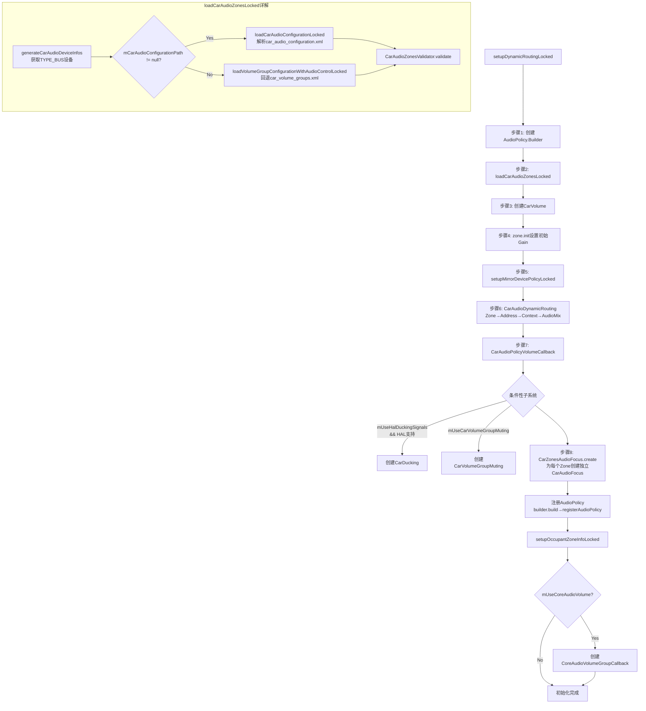
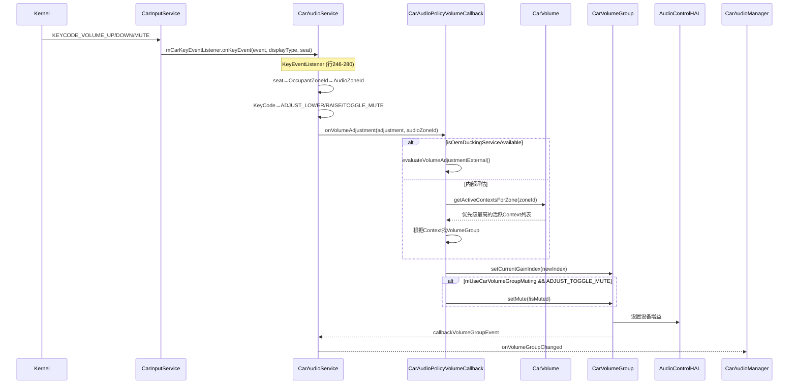
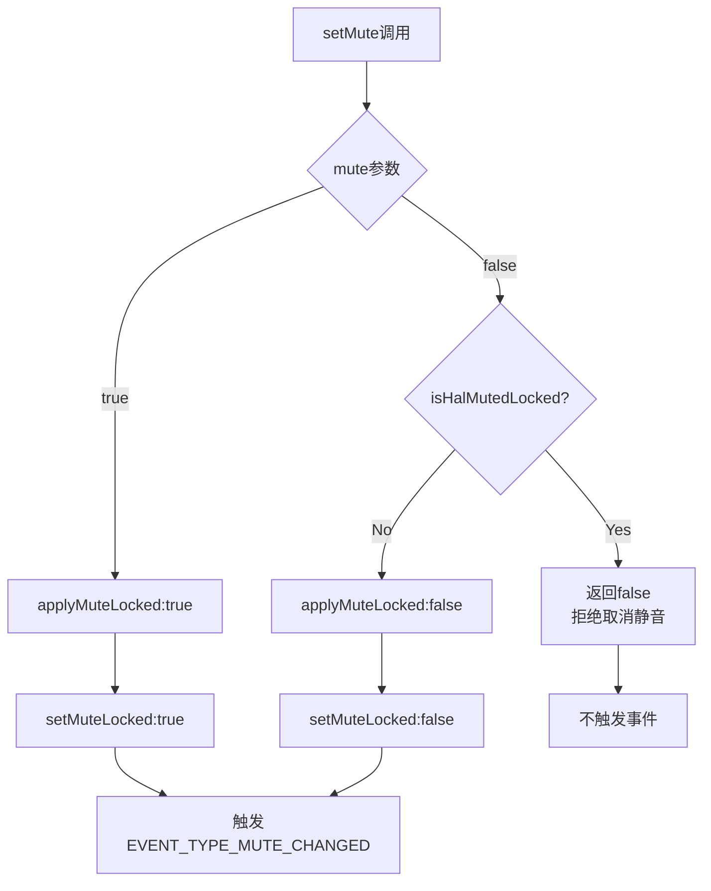
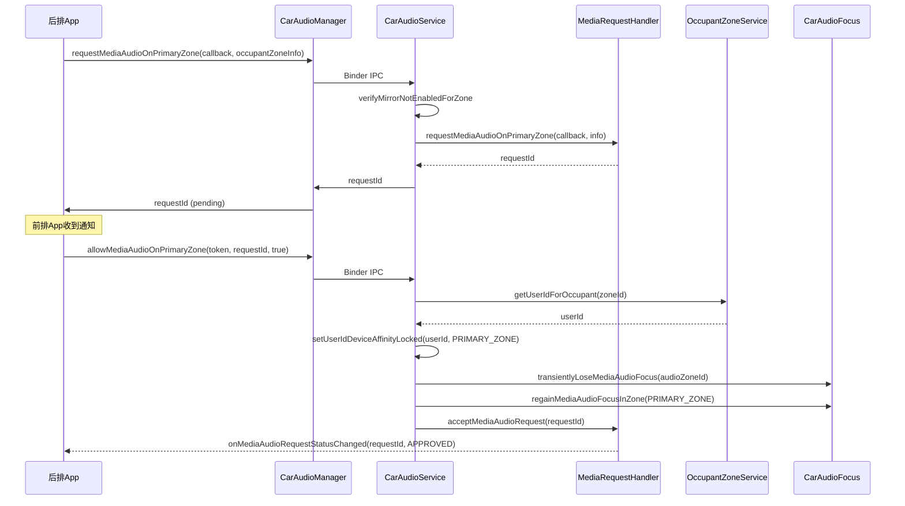
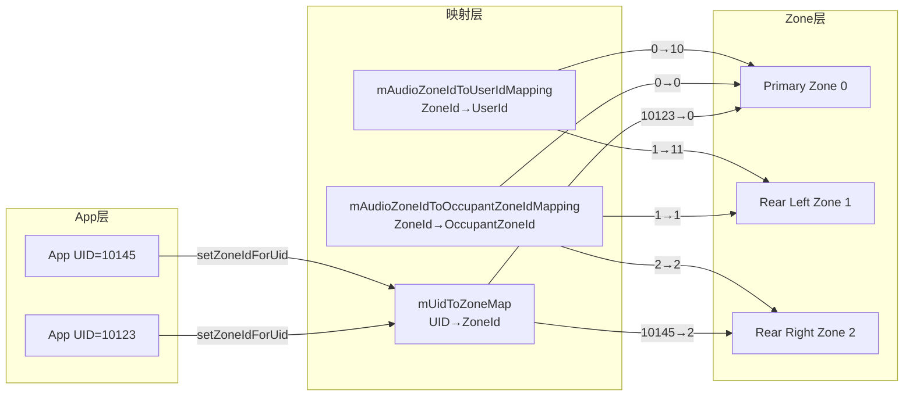

## 9.2 CarAudioService核心服务

> CarAudioService是AAOS音频系统的中枢，实现ICarAudio.Stub和CarServiceBase接口，统一协调动态路由、焦点管理、音量控制、HAL交互等所有子系统

---

### 9.2.1 类定义与继承体系

[`CarAudioService`](packages/services/Car/service/src/com/android/car/audio/CarAudioService.java:152)是AAOS音频系统的唯一入口服务：

```java
public final class CarAudioService extends ICarAudio.Stub implements CarServiceBase
```

- `ICarAudio.Stub`：Binder服务端实现，提供跨进程API给CarAudioManager
- `CarServiceBase`：CarService生命周期接口，要求实现`init()`和`release()`

#### 类访问修饰符

`final`修饰确保不可继承，所有逻辑自包含。这是设计决策——AAOS音频逻辑高度内聚，不允许外部扩展服务本身。

---

### 9.2.2 完整成员变量一览

CarAudioService的成员变量可按功能分组，理解这些变量是理解服务行为的基础：

#### 特性开关组（构造时确定，运行时不可变）

| 变量 | 类型 | 来源 | 作用 |
|------|------|------|------|
| [`mUseDynamicRouting`](packages/services/Car/service/src/com/android/car/audio/CarAudioService.java:194) | `boolean` | `R.bool.audioUseDynamicRouting` | 核心开关，决定AAOS vs Legacy模式 |
| [`mUseCoreAudioVolume`](packages/services/Car/service/src/com/android/car/audio/CarAudioService.java:195) | `boolean` | `R.bool.audioUseCoreVolume` | Core Audio音量管理 |
| [`mUseCoreAudioRouting`](packages/services/Car/service/src/com/android/car/audio/CarAudioService.java:196) | `boolean` | `R.bool.audioUseCoreRouting` | Core Audio路由策略 |
| [`mUseCarVolumeGroupEvents`](packages/services/Car/service/src/com/android/car/audio/CarAudioService.java:197) | `boolean` | `R.bool.audioUseCarVolumeGroupEvent` && `mUseDynamicRouting` | VolumeGroup事件回调 |
| [`mUseCarVolumeGroupMuting`](packages/services/Car/service/src/com/android/car/audio/CarAudioService.java:198) | `boolean` | `R.bool.audioUseCarVolumeGroupMuting` && `mUseDynamicRouting` | VolumeGroup级静音 |
| [`mUseHalDuckingSignals`](packages/services/Car/service/src/com/android/car/audio/CarAudioService.java:199) | `boolean` | `R.bool.audioUseHalDuckingSignals` | HAL Ducking信号 |
| [`mPersistMasterMuteState`](packages/services/Car/service/src/com/android/car/audio/CarAudioService.java:201) | `boolean` | `!mUseCarVolumeGroupMuting && R.bool.audioPersistMasterMuteState` | 持久化Master Mute |
| [`mAudioVolumeAdjustmentContextsVersion`](packages/services/Car/service/src/com/android/car/audio/CarAudioService.java:200) | `int` | `R.integer.audioVolumeAdjustmentContextsVersion` | 音量调节Context版本 |
| [`mKeyEventTimeoutMs`](packages/services/Car/service/src/com/android/car/audio/CarAudioService.java:203) | `int` | `R.integer.audioVolumeKeyEventTimeoutMs` | 音量键超时 |

#### 核心子系统引用组

| 变量 | 类型 | 初始化时机 | 作用 |
|------|------|-----------|------|
| [`mCarAudioZones`](packages/services/Car/service/src/com/android/car/audio/CarAudioService.java:287) | `SparseArray<CarAudioZone>` | `loadCarAudioZonesLocked()` | 所有音频Zone |
| [`mFocusHandler`](packages/services/Car/service/src/com/android/car/audio/CarAudioService.java:283) | `CarZonesAudioFocus` | `setupDynamicRoutingLocked()` | 多Zone焦点分发器 |
| [`mAudioPolicy`](packages/services/Car/service/src/com/android/car/audio/CarAudioService.java:282) | `AudioPolicy` | `setupDynamicRoutingLocked()` | 已注册的AudioPolicy |
| [`mCarVolume`](packages/services/Car/service/src/com/android/car/audio/CarAudioService.java:289) | `CarVolume` | `setupDynamicRoutingLocked()` | 音量优先级管理 |
| [`mCarAudioContext`](packages/services/Car/service/src/com/android/car/audio/CarAudioService.java:291) | `CarAudioContext` | `loadCarAudioConfigurationLocked()` | 音频上下文映射 |
| [`mCarAudioPolicyVolumeCallback`](packages/services/Car/service/src/com/android/car/audio/CarAudioService.java:333) | `CarAudioPolicyVolumeCallback` | `setupDynamicRoutingLocked()` | 音量键回调 |

#### HAL交互组

| 变量 | 类型 | 初始化时机 | 需要HAL特性 |
|------|------|-----------|------------|
| [`mAudioControlWrapper`](packages/services/Car/service/src/com/android/car/audio/CarAudioService.java:209) | `AudioControlWrapper` | `getAudioControlWrapperLocked()` | — |
| [`mCarDucking`](packages/services/Car/service/src/com/android/car/audio/CarAudioService.java:210) | `CarDucking` | `setupDynamicRoutingLocked()` | `AUDIO_DUCKING` |
| [`mCarVolumeGroupMuting`](packages/services/Car/service/src/com/android/car/audio/CarAudioService.java:211) | `CarVolumeGroupMuting` | `setupDynamicRoutingLocked()` | — |
| [`mHalAudioFocus`](packages/services/Car/service/src/com/android/car/audio/CarAudioService.java:212) | `HalAudioFocus` | `setupHalAudioFocusListenerLocked()` | `AUDIO_FOCUS` |
| [`mCarAudioGainMonitor`](packages/services/Car/service/src/com/android/car/audio/CarAudioService.java:213) | `CarAudioGainMonitor` | `setupHalAudioGainCallbackLocked()` | `AUDIO_GAIN_CALLBACK` |
| [`mCarAudioModuleChangeMonitor`](packages/services/Car/service/src/com/android/car/audio/CarAudioService.java:218) | `CarAudioModuleChangeMonitor` | `setupHalAudioModuleChangeCallbackLocked()` | `AUDIO_MODULE_CALLBACK` |

#### 映射关系组

| 变量 | 类型 | 作用 |
|------|------|------|
| [`mUidToZoneMap`](packages/services/Car/service/src/com/android/car/audio/CarAudioService.java:302) | `Map<Integer, Integer>` | UID→ZoneId映射，用于App音频路由 |
| [`mAudioZoneIdToOccupantZoneIdMapping`](packages/services/Car/service/src/com/android/car/audio/CarAudioService.java:285) | `SparseIntArray` | AudioZoneId→OccupantZoneId映射 |
| [`mAudioZoneIdToUserIdMapping`](packages/services/Car/service/src/com/android/car/audio/CarAudioService.java:293) | `SparseIntArray` | AudioZoneId→UserId映射 |

#### 回调与监听组

| 变量 | 类型 | 作用 |
|------|------|------|
| [`mCarKeyEventListener`](packages/services/Car/service/src/com/android/car/audio/CarAudioService.java:246) | `KeyEventListener` | 音量键事件监听，seat→zoneId→adjustment |
| [`mHalAudioGainCallback`](packages/services/Car/service/src/com/android/car/audio/CarAudioService.java:307) | `HalAudioGainCallback` | HAL Gain变化回调→handleAudioDeviceGainsChangedLocked |
| [`mOccupantZoneCallback`](packages/services/Car/service/src/com/android/car/audio/CarAudioService.java:318) | `ICarOccupantZoneCallback` | OccupantZone配置变化回调 |
| [`mHalAudioModuleChangeCallback`](packages/services/Car/service/src/com/android/car/audio/CarAudioService.java:335) | `HalAudioModuleChangeCallback` | HAL音频模块变化回调 |
| [`mCarAudioPlaybackCallback`](packages/services/Car/service/src/com/android/car/audio/CarAudioService.java:303) | `CarAudioPlaybackCallback` | 音频播放回调 |
| [`mCarAudioPowerListener`](packages/services/Car/service/src/com/android/car/audio/CarAudioService.java:304) | `CarAudioPowerListener` | 电源策略变化监听 |

#### 基础设施组

| 变量 | 类型 | 作用 |
|------|------|------|
| [`mImplLock`](packages/services/Car/service/src/com/android/car/audio/CarAudioService.java:189) | `Object` | 主同步锁，保护所有状态变更 |
| [`mHandlerThread`](packages/services/Car/service/src/com/android/car/audio/CarAudioService.java:185) | `HandlerThread` | 专用工作线程 |
| [`mHandler`](packages/services/Car/service/src/com/android/car/audio/CarAudioService.java:187) | `Handler` | 工作线程Handler |
| [`mContext`](packages/services/Car/service/src/com/android/car/audio/CarAudioService.java:191) | `Context` | 系统上下文 |
| [`mAudioManager`](packages/services/Car/service/src/com/android/car/audio/CarAudioService.java:193) | `AudioManager` | 标准音频管理器 |
| [`mCarAudioSettings`](packages/services/Car/service/src/com/android/car/audio/CarAudioService.java:202) | `CarAudioSettings` | Settings持久化 |
| [`mCarAudioConfigurationPath`](packages/services/Car/service/src/com/android/car/audio/CarAudioService.java:284) | `String` | 配置文件路径 |

---

### 9.2.3 CarAudioService完整类结构图

```mermaid
classDiagram
    class CarAudioService {
        <<final>>
        <<ICarAudio.Stub>>
        <<CarServiceBase>>
        
        % 特性开关
        -mUseDynamicRouting: boolean
        -mUseCoreAudioVolume: boolean
        -mUseCoreAudioRouting: boolean
        -mUseCarVolumeGroupEvents: boolean
        -mUseCarVolumeGroupMuting: boolean
        -mUseHalDuckingSignals: boolean
        -mPersistMasterMuteState: boolean
        -mAudioVolumeAdjustmentContextsVersion: int
        -mKeyEventTimeoutMs: int
        
        % 核心子系统
        -mCarAudioZones: SparseArray~CarAudioZone~
        -mFocusHandler: CarZonesAudioFocus
        -mAudioPolicy: AudioPolicy
        -mCarVolume: CarVolume
        -mCarAudioContext: CarAudioContext
        -mCarAudioPolicyVolumeCallback: CarAudioPolicyVolumeCallback
        
        % HAL交互
        -mAudioControlWrapper: AudioControlWrapper
        -mCarDucking: CarDucking
        -mCarVolumeGroupMuting: CarVolumeGroupMuting
        -mHalAudioFocus: HalAudioFocus
        -mCarAudioGainMonitor: CarAudioGainMonitor
        -mCarAudioModuleChangeMonitor: CarAudioModuleChangeMonitor
        
        % 映射关系
        -mUidToZoneMap: Map~Integer,Integer~
        -mAudioZoneIdToOccupantZoneIdMapping: SparseIntArray
        -mAudioZoneIdToUserIdMapping: SparseIntArray
        
        % 回调监听
        -mCarKeyEventListener: KeyEventListener
        -mHalAudioGainCallback: HalAudioGainCallback
        -mOccupantZoneCallback: ICarOccupantZoneCallback
        -mHalAudioModuleChangeCallback: HalAudioModuleChangeCallback
        -mCarAudioPlaybackCallback: CarAudioPlaybackCallback
        -mCarAudioPowerListener: CarAudioPowerListener
        
        % 基础设施
        -mImplLock: Object
        -mHandlerThread: HandlerThread
        -mHandler: Handler
        -mContext: Context
        -mAudioManager: AudioManager
        -mCarAudioSettings: CarAudioSettings
        -mCarAudioConfigurationPath: String
        -mCarVolumeCallbackHandler: CarVolumeCallbackHandler
        -mCarVolumeEventHandler: CarVolumeEventHandler
        -mMediaRequestHandler: MediaRequestHandler
        -mCarAudioMirrorRequestHandler: CarAudioMirrorRequestHandler
        
        % 生命周期
        +init()
        +release()
        
        % 音量控制
        +setGroupVolume(zoneId, groupId, index, flags)
        +getGroupVolume(zoneId, groupId)
        +getGroupMaxVolume(zoneId, groupId)
        +getGroupMinVolume(zoneId, groupId)
        +setVolumeGroupMute(zoneId, groupId, mute, flags)
        +isVolumeGroupMuted(zoneId, groupId)
        
        % 焦点管理
        +setRejectNavigationOnCallInCall(rejected)
        +setRejectNavigationOnCallWithFocus(rejected)
        
        % Zone管理
        +getZoneIdForUid(uid)
        +setZoneIdForUid(zoneId, uid)
        +clearZoneIdForUid(uid)
        +getOutputDeviceAddressForUsage(zoneId, usage)
        
        % 特性查询
        +isAudioFeatureEnabled(audioFeatureType)
        
        % 镜像与媒体请求
        +enableMirrorForAudioZones(mirrorRequest)
        +disableAudioMirrorForAudioZone(requestId)
        +requestMediaAudioOnPrimaryZone(callback, info)
        +allowMediaAudioOnPrimaryZone(token, requestId, allow)
        +resetMediaAudioOnPrimaryZone(info)
        
        % 回调注册
        +registerCarVolumeEventCallback(callback)
        +unregisterCarVolumeEventCallback(callback)
        +registerVolumeCallback(binder)
        +unregisterVolumeCallback(binder)
        +registerPrimaryZoneMediaAudioRequestCallback(callback)
        +unregisterPrimaryZoneMediaAudioRequestCallback(callback)
        
        % 配置查询
        +getAudioZoneConfigInfos(zoneId)
        +getCurrentAudioZoneConfigInfo(zoneId)
        +setSwitchAudioZoneConfig(zoneId, configId)
        +getVolumeGroupCount(zoneId)
        +getVolumeGroupInfo(zoneId, groupId)
        +getInputDevicesForZoneId(zoneId)
        
        % 播放状态
        +isPlaybackOnVolumeGroupActive(zoneId, groupId)
        
        % 内部方法
        -setupDynamicRoutingLocked()
        -loadCarAudioZonesLocked()
        -setupMirrorDevicePolicyLocked()
        -setupHalAudioFocusListenerLocked()
        -setupHalAudioGainCallbackLocked()
        -setupHalAudioModuleChangeCallbackLocked()
        -setupAudioConfigurationCallbackLocked()
        -setupPowerPolicyListener()
        -setupOccupantZoneInfoLocked()
        -setupLegacyVolumeChangedListener()
        -handleAudioDeviceGainsChangedLocked()
        -handleOccupantZoneUserChanged()
        -setUserIdDeviceAffinityLocked()
        -setZoneIdForUidNoCheckLocked()
        -checkAndRemoveUidLocked()
        
        +dump(writer)
    }
```



---

### 9.2.4 构造函数源码级解析

[`CarAudioService`构造函数](packages/services/Car/service/src/com/android/car/audio/CarAudioService.java:350)在CarService启动时被调用，负责读取所有配置参数：

#### 构造函数链

```java
// 公开构造函数 (行345-347)
public CarAudioService(Context context) {
    this(context, getAudioConfigurationPath(), new CarVolumeCallbackHandler());
}

// 内部构造函数 (行350-384)
CarAudioService(Context context, @Nullable String audioConfigurationPath,
        CarVolumeCallbackHandler carVolumeCallbackHandler) {
```

#### 配置文件路径确定

[`getAudioConfigurationPath()`](packages/services/Car/service/src/com/android/car/audio/CarAudioService.java:172)按优先级搜索配置文件：

```java
private static final String[] AUDIO_CONFIGURATION_PATHS = new String[] {
    "/vendor/etc/car_audio_configuration.xml",    // 优先级1：OEM定制
    "/system/etc/car_audio_configuration.xml"     // 优先级2：系统默认
};
```

如果两个路径都不存在，`audioConfigurationPath`为`null`，将回退到[`loadVolumeGroupConfigurationWithAudioControlLocked()`](packages/services/Car/service/src/com/android/car/audio/CarAudioService.java:1448)使用旧版`car_volume_groups.xml`资源。

#### 特性开关初始化顺序

```java
// 1. 基础开关 - 直接从R.bool读取
mUseDynamicRouting = mContext.getResources().getBoolean(R.bool.audioUseDynamicRouting);    // 行358
mUseCoreAudioVolume = mContext.getResources().getBoolean(R.bool.audioUseCoreVolume);        // 行359
mUseCoreAudioRouting = mContext.getResources().getBoolean(R.bool.audioUseCoreRouting);      // 行360

// 2. 超时参数
mKeyEventTimeoutMs = mContext.getResources().getInteger(R.integer.audioVolumeKeyEventTimeoutMs); // 行361-362

// 3. HAL Ducking开关
mUseHalDuckingSignals = mContext.getResources().getBoolean(R.bool.audioUseHalDuckingSignals);   // 行363-364

// 4. 基础数据结构初始化
mUidToZoneMap = new HashMap<>();                       // 行366
mCarVolumeCallbackHandler = carVolumeCallbackHandler;  // 行367
mCarAudioSettings = new CarAudioSettings(mContext);    // 行368
mAudioZoneIdToUserIdMapping = new SparseIntArray();    // 行369

// 5. 版本号
mAudioVolumeAdjustmentContextsVersion =
    mContext.getResources().getInteger(R.integer.audioVolumeAdjustmentContextsVersion);  // 行370-371

// 6. VolumeGroup Muting - 需要VERSION_TWO约束
boolean useCarVolumeGroupMuting = mUseDynamicRouting
    && mContext.getResources().getBoolean(R.bool.audioUseCarVolumeGroupMuting);          // 行372-373
if (mAudioVolumeAdjustmentContextsVersion != VERSION_TWO && useCarVolumeGroupMuting) {  // 行374
    throw new IllegalArgumentException(                                                  // 行375-377
        "audioUseCarVolumeGroupMuting is enabled but this requires version 2");
}
mUseCarVolumeGroupMuting = useCarVolumeGroupMuting;  // 行381

// 7. VolumeGroup Events - 依赖DynamicRouting
mUseCarVolumeGroupEvents = mUseDynamicRouting
    && mContext.getResources().getBoolean(R.bool.audioUseCarVolumeGroupEvent);           // 行379-380

// 8. Master Mute持久化 - 与VolumeGroupMuting互斥
mPersistMasterMuteState = !mUseCarVolumeGroupMuting
    && mContext.getResources().getBoolean(R.bool.audioPersistMasterMuteState);           // 行382-383
```

#### 关键约束

1. **mUseCarVolumeGroupMuting需VERSION_TWO**：如果版本号不是2但启用了VolumeGroup静音，直接抛`IllegalArgumentException`，阻止服务启动
2. **mPersistMasterMuteState与mUseCarVolumeGroupMuting互斥**：启用VolumeGroup静音后，Master Mute持久化自动禁用
3. **mUseCarVolumeGroupEvents依赖mUseDynamicRouting**：没有动态路由，VolumeGroup事件无意义

---

### 9.2.5 init()方法源码级解析

[`init()`](packages/services/Car/service/src/com/android/car/audio/CarAudioService.java:391)在构造完成后由CarService调用，是整个AAOS音频系统的启动入口：

```java
@Override
public void init() {
    synchronized (mImplLock) {
        // 获取依赖的CarService
        mOccupantZoneService = CarLocalServices.getService(CarOccupantZoneService.class);  // 行393
        mCarInputService = CarLocalServices.getService(CarInputService.class);              // 行394
        
        if (mUseDynamicRouting) {
            // AAOS模式：完整初始化链
            setupDynamicRoutingLocked();                    // 核心8步初始化
            setupHalAudioFocusListenerLocked();             // HAL焦点回调
            setupHalAudioGainCallbackLocked();              // HAL Gain回调
            setupHalAudioModuleChangeCallbackLocked();      // HAL模块变化回调
            setupAudioConfigurationCallbackLocked();        // 音频配置变化回调
            setupPowerPolicyListener();                     // 电源策略监听
            mCarInputService.registerKeyEventListener(     // 音量键监听
                mCarKeyEventListener, KEYCODES_OF_INTEREST);
        } else {
            // Legacy模式：仅监听标准音量变化
            setupLegacyVolumeChangedListener();
        }
        
        // 全局设置：限制系统只识别CarAudioContext定义的Usage
        mAudioManager.setSupportedSystemUsages(CarAudioContext.getSystemUsages());  // 行409
    }
    
    // 恢复Master Mute状态（mImplLock外执行）
    restoreMasterMuteState();  // 行412
}
```

#### init()关键设计点

1. **mImplLock保护**：整个初始化过程在同步块内完成，防止并发初始化
2. **CarLocalServices依赖**：`CarOccupantZoneService`和`CarInputService`通过`CarLocalServices.getService()`获取，不通过Binder
3. **setSupportedSystemUsages**：限制AudioPolicyManager只识别CarAudioContext定义的Usage，其他Usage的音频请求将被拒绝
4. **restoreMasterMuteState在锁外**：避免持锁调用AudioManager（可能触发Binder调用导致死锁）

---

### 9.2.6 setupDynamicRoutingLocked()完整流程

[`setupDynamicRoutingLocked()`](packages/services/Car/service/src/com/android/car/audio/CarAudioService.java:1482)是AAOS模式的核心初始化方法，按严格顺序完成8个步骤：

```java
@GuardedBy("mImplLock")
private void setupDynamicRoutingLocked() {
    // 步骤1：创建AudioPolicy Builder
    AudioPolicy.Builder builder = new AudioPolicy.Builder(mContext);
    builder.setLooper(Looper.getMainLooper());
    
    // 步骤2：加载Zone配置
    loadCarAudioZonesLocked();
    
    // 步骤3：创建CarVolume
    mCarVolume = new CarVolume(mCarAudioContext, mClock,
        mAudioVolumeAdjustmentContextsVersion, mKeyEventTimeoutMs);
    
    // 步骤4：初始化每个Zone
    for (int i = 0; i < mCarAudioZones.size(); i++) {
        CarAudioZone zone = mCarAudioZones.valueAt(i);
        zone.init();  // 确保HAL获取初始Gain值
    }
    
    // 步骤5：设置镜像设备路由策略
    setupMirrorDevicePolicyLocked(builder);
    
    // 步骤6：构建动态路由AudioMix规则
    CarAudioDynamicRouting.setupAudioDynamicRouting(builder, mCarAudioZones, mCarAudioContext);
    
    // 步骤7：设置音量回调
    mCarAudioPolicyVolumeCallback = new CarAudioPolicyVolumeCallback(
        volumeCallbackInternal, mAudioManager, ...);
    CarAudioPolicyVolumeCallback.addVolumeCallbackToPolicy(builder, mCarAudioPolicyVolumeCallback);
    
    // 步骤7b：条件性创建Ducking和Muting
    if (mUseHalDuckingSignals && audioControlWrapper.supportsFeature(AUDIOCONTROL_FEATURE_AUDIO_DUCKING))
        mCarDucking = new CarDucking(mCarAudioZones, audioControlWrapper);
    if (mUseCarVolumeGroupMuting)
        mCarVolumeGroupMuting = new CarVolumeGroupMuting(mCarAudioZones, audioControlWrapper);
    
    // 步骤8：创建焦点处理器并注册AudioPolicy
    mFocusHandler = CarZonesAudioFocus.createCarZonesAudioFocus(...);
    builder.setAudioPolicyFocusListener(mFocusHandler);
    builder.setIsAudioFocusPolicy(true);
    mAudioPolicy = builder.build();
    mFocusHandler.setOwningPolicy(this, mAudioPolicy);
    mAudioManager.registerAudioPolicy(mAudioPolicy);
    
    // 后续步骤
    setupOccupantZoneInfoLocked();
    if (mUseCoreAudioVolume) {
        mCoreAudioVolumeGroupCallback = new CoreAudioVolumeGroupCallback(...);
    }
}
```

#### setupDynamicRoutingLocked流程图



#### loadCarAudioZonesLocked()详解

[`loadCarAudioZonesLocked()`](packages/services/Car/service/src/com/android/car/audio/CarAudioService.java:1466)负责从配置文件或HAL加载Zone定义：

```java
@GuardedBy("mImplLock")
private void loadCarAudioZonesLocked() {
    // 1. 获取系统中所有TYPE_BUS输出设备
    List<CarAudioDeviceInfo> carAudioDeviceInfos = generateCarAudioDeviceInfos();
    
    // 2. 获取所有输入设备
    AudioDeviceInfo[] inputDevices = getAllInputDevices();
    
    // 3. 根据配置文件路径选择加载方式
    if (mCarAudioConfigurationPath != null) {
        // 从XML文件加载
        mCarAudioZones = loadCarAudioConfigurationLocked(carAudioDeviceInfos, inputDevices);
    } else {
        // 从旧版HAL加载（需AudioControlWrapperV1）
        mCarAudioZones = loadVolumeGroupConfigurationWithAudioControlLocked(
            carAudioDeviceInfos, inputDevices);
    }
    
    // 4. 校验Zone配置
    CarAudioZonesValidator.validate(mCarAudioZones, mUseCoreAudioRouting);
}
```

[`generateCarAudioDeviceInfos()`](packages/services/Car/service/src/com/android/car/audio/CarAudioService.java:1407)只收集`TYPE_BUS`类型的设备，这是AAOS动态路由的基础——所有音频输出都通过Bus设备路由：

```java
private List<CarAudioDeviceInfo> generateCarAudioDeviceInfos() {
    AudioDeviceInfo[] deviceInfos = mAudioManager.getDevices(AudioManager.GET_DEVICES_OUTPUTS);
    List<CarAudioDeviceInfo> infos = new ArrayList<>();
    for (int index = 0; index < deviceInfos.length; index++) {
        if (deviceInfos[index].getType() == AudioDeviceInfo.TYPE_BUS) {  // 只取Bus设备
            infos.add(new CarAudioDeviceInfo(mAudioManager, deviceInfos[index]));
        }
    }
    return infos;
}
```

---

### 9.2.7 音量键处理链路

音量键事件从物理按键到最终增益设置的完整链路：



#### KeyEventListener详解

[`mCarKeyEventListener`](packages/services/Car/service/src/com/android/car/audio/CarAudioService.java:246)是音量键事件的核心处理器：

```java
private final KeyEventListener mCarKeyEventListener = new KeyEventListener() {
    @Override
    public void onKeyEvent(KeyEvent event, int displayType, int seat) {
        if (event.getAction() != ACTION_DOWN) return;  // 只处理按下事件
        
        // 通过seat→OccupantZone→AudioZone确定目标Zone
        int audioZoneId = mOccupantZoneService.getAudioZoneIdForOccupant(
            mOccupantZoneService.getOccupantZoneIdForSeat(seat));
        
        // KeyCode→adjustment映射
        int adjustment;
        switch (event.getKeyCode()) {
            case KEYCODE_VOLUME_DOWN: adjustment = ADJUST_LOWER; break;
            case KEYCODE_VOLUME_UP:   adjustment = ADJUST_RAISE; break;
            case KEYCODE_VOLUME_MUTE: adjustment = ADJUST_TOGGLE_MUTE; break;
            default:                  adjustment = ADJUST_SAME; break;
        }
        
        synchronized (mImplLock) {
            mCarAudioPolicyVolumeCallback.onVolumeAdjustment(adjustment, audioZoneId);
        }
    }
};
```

关键设计：**seat→zone映射**，不同座位上的音量键控制不同Zone的音量，实现了后排独立音量控制。

---

### 9.2.8 CarAudioManager API→CarAudioService方法映射表

应用通过[`CarAudioManager`](packages/services/Car/car-lib/src/android/car/media/CarAudioManager.java:82)访问AAOS音频功能，每个API通过Binder IPC映射到CarAudioService的对应方法：

#### 音量控制API

| CarAudioManager API | CarAudioService方法 | 权限 | 前置条件 | 源码行号 |
|---------------------|---------------------|------|---------|---------|
| `setGroupVolume(zoneId, groupId, index, flags)` | `setGroupVolume()` | `CAR_CONTROL_AUDIO_VOLUME` | `mUseDynamicRouting` | ~601 |
| `getGroupVolume(zoneId, groupId)` | `getGroupVolume()` | `CAR_CONTROL_AUDIO_VOLUME` | 无 | ~715 |
| `getGroupMaxVolume(zoneId, groupId)` | `getGroupMaxVolume()` | `CAR_CONTROL_AUDIO_VOLUME` | 无 | ~688 |
| `getGroupMinVolume(zoneId, groupId)` | `getGroupMinVolume()` | `CAR_CONTROL_AUDIO_VOLUME` | 无 | ~700 |
| `setVolumeGroupMute(zoneId, groupId, mute, flags)` | `setVolumeGroupMute()` | `CAR_CONTROL_AUDIO_VOLUME` | DynamicRouting + VolumeGroupMuting | ~2381 |
| `isVolumeGroupMuted(zoneId, groupId)` | `isVolumeGroupMuted()` | `CAR_CONTROL_AUDIO_VOLUME` | DynamicRouting + VolumeGroupMuting | ~2365 |

#### Zone管理API

| CarAudioManager API | CarAudioService方法 | 权限 | 前置条件 |
|---------------------|---------------------|------|---------|
| `getZoneIdForUid(uid)` | `getZoneIdForUid()` | `CAR_CONTROL_AUDIO_SETTINGS` | DynamicRouting |
| `setZoneIdForUid(zoneId, uid)` | `setZoneIdForUid()` | `CAR_CONTROL_AUDIO_SETTINGS` | DynamicRouting |
| `clearZoneIdForUid(uid)` | `clearZoneIdForUid()` | `CAR_CONTROL_AUDIO_SETTINGS` | DynamicRouting |
| `getOutputDeviceAddressForUsage(zoneId, usage)` | `getOutputDeviceAddressForUsage()` | `CAR_CONTROL_AUDIO_SETTINGS` | DynamicRouting |

#### 镜像与媒体请求API

| CarAudioManager API | CarAudioService方法 | 权限 |
|---------------------|---------------------|------|
| `enableMirrorForAudioZones(request)` | `enableMirrorForAudioZones()` | `CAR_CONTROL_AUDIO_SETTINGS` |
| `disableAudioMirrorForAudioZone(requestId)` | `disableAudioMirrorForAudioZone()` | `CAR_CONTROL_AUDIO_SETTINGS` |
| `requestMediaAudioOnPrimaryZone(callback, info)` | `requestMediaAudioOnPrimaryZone()` | `CAR_CONTROL_AUDIO_SETTINGS` |
| `allowMediaAudioOnPrimaryZone(token, requestId, allow)` | `allowMediaAudioOnPrimaryZone()` | `CAR_CONTROL_AUDIO_SETTINGS` |
| `resetMediaAudioOnPrimaryZone(info)` | `resetMediaAudioOnPrimaryZone()` | `CAR_CONTROL_AUDIO_SETTINGS` |

#### 特性查询API

| CarAudioManager API | CarAudioService方法 | 返回值 |
|---------------------|---------------------|-------|
| `isAudioFeatureEnabled(DYNAMIC_ROUTING)` | `isAudioFeatureEnabled(1)` | `mUseDynamicRouting` |
| `isAudioFeatureEnabled(VOLUME_GROUP_MUTING)` | `isAudioFeatureEnabled(2)` | `mUseCarVolumeGroupMuting` |
| `isAudioFeatureEnabled(OEM_AUDIO_SERVICE)` | `isAudioFeatureEnabled(3)` | `isAnyOemFeatureEnabled()` |
| `isAudioFeatureEnabled(VOLUME_GROUP_EVENTS)` | `isAudioFeatureEnabled(4)` | `mUseCarVolumeGroupEvents` |
| `isAudioFeatureEnabled(AUDIO_MIRRORING)` | `isAudioFeatureEnabled(5)` | `mCarAudioMirrorRequestHandler.isMirrorAudioEnabled()` |

---

### 9.2.9 音量控制双模式详解

CarAudioService的音量控制存在两种模式，由`mUseDynamicRouting`决定：

#### Legacy模式（!mUseDynamicRouting）

使用标准Android的StreamType音量体系，通过[`CarAudioDynamicRouting.STREAM_TYPES`](packages/services/Car/service/src/com/android/car/audio/CarAudioDynamicRouting.java:28)数组做映射：

```java
// CarAudioDynamicRouting.java 行28-30
static final int[] STREAM_TYPES = {
    STREAM_MUSIC,                          // groupId=0 → MEDIA
    STREAM_ALARM,                          // groupId=1 → ALARM
    STREAM_RING                            // groupId=2 → RINGTONE
};
static final int[] STREAM_TYPE_USAGES = {
    USAGE_MEDIA,                           // 对应STREAM_MUSIC
    USAGE_ALARM,                           // 对应STREAM_ALARM
    USAGE_NOTIFICATION_RINGTONE            // 对应STREAM_RING
};
```

Legacy模式下`setGroupVolume()`直接委托给`AudioManager.setStreamVolume()`：

```java
public void setGroupVolume(int zoneId, int groupId, int index, int flags) {
    if (!mUseDynamicRouting) {
        mAudioManager.setStreamVolume(STREAM_TYPES[groupId], index, flags);  // 行611
        return;
    }
    // AAOS模式逻辑...
}
```

#### AAOS模式（mUseDynamicRouting=true）

使用CarVolumeGroup的Gain Index体系，直接控制Bus设备的增益：

```java
public void setGroupVolume(int zoneId, int groupId, int index, int flags) {
    // ... 已在前面做了Legacy分支
    synchronized (mImplLock) {
        CarVolumeGroup group = getCarVolumeGroupLocked(zoneId, groupId);
        int currentGainIndex = group.getCurrentGainIndex();
        
        // 音量变化处理
        if (currentGainIndex != index) {
            group.setCurrentGainIndex(index);  // 设置新Gain Index
            // 持久化
            mCarAudioSettings.storeVolumeIndexForGroup(groupId, zoneId, index);
        }
    }
    // VolumeGroup事件回调
    callbackVolumeGroupEvent(List.of(convertVolumeChangeToEvent(
        zoneId, groupId, index, EVENT_TYPE_VOLUME_CHANGED)));
}
```

#### 音量双模式对比表

| 维度 | Legacy模式 | AAOS模式 |
|------|-----------|---------|
| 音量单位 | StreamType Index | Gain Index (millibel) |
| 设备控制 | AudioManager.setStreamVolume | CarVolumeGroup.setCurrentGainIndex |
| 范围获取 | AudioManager.getStreamMaxVolume/MinVolume | group.getMaxGainIndex/getMinGainIndex |
| Zone支持 | 不支持 | 完整支持(每个Zone独立VolumeGroup) |
| 持久化 | Settings.System | CarAudioSettings |
| 静音 | Master Mute | VolumeGroup Mute |
| 事件 | VolumeCallback | CarVolumeEventCallback |

---

### 9.2.10 VolumeGroup静音机制

[`setVolumeGroupMute()`](packages/services/Car/service/src/com/android/car/audio/CarAudioService.java:2381)提供VolumeGroup级别的静音控制：

```java
@Override
public void setVolumeGroupMute(int zoneId, int groupId, boolean mute, int flags) {
    requireVolumeGroupMuting();  // 前置检查：必须启用mUseCarVolumeGroupMuting
    
    boolean muteStateChanged;
    synchronized (mImplLock) {
        CarVolumeGroup group = getCarVolumeGroupLocked(zoneId, groupId);
        muteStateChanged = group.setMute(mute);  // 调用CarVolumeGroup.setMute
    }
    
    if (muteStateChanged) {
        handleMuteChanged(zoneId, groupId, flags);  // 处理静音变化逻辑
        callbackVolumeGroupEvent(List.of(convertVolumeChangeToEvent(
            zoneId, groupId, /* index */ 0, EVENT_TYPE_MUTE_CHANGED)));
    }
}
```

#### CarVolumeGroup.setMute()源码级解析

[`CarVolumeGroup.setMute()`](packages/services/Car/service/src/com/android/car/audio/CarVolumeGroup.java:449)有两层静音状态和重要约束：

```java
boolean setMute(boolean mute) {
    synchronized (mLock) {
        // 关键约束：HAL静音时，不允许用户取消静音
        if (!mute && isHalMutedLocked()) {
            return false;  // HAL静音优先级高于用户静音
        }
        applyMuteLocked(mute);  // 实际应用静音状态
        return setMuteLocked(mute);  // 更新用户静音状态
    }
}

// 静音状态判断：用户静音 OR HAL静音
protected boolean isMutedLocked() {
    return isUserMutedLocked() || isHalMutedLocked();
}
```

#### 静音状态优先级



---

### 9.2.11 HAL回调管理

CarAudioService在init()中注册三个HAL回调，每个都通过`supportsFeature()`前置检查：

#### setupHalAudioFocusListenerLocked()

```java
@GuardedBy("mImplLock")
private void setupHalAudioFocusListenerLocked() {
    AudioControlWrapper audioControlWrapper = getAudioControlWrapperLocked();
    if (audioControlWrapper.supportsFeature(AUDIOCONTROL_FEATURE_AUDIO_FOCUS)) {
        mHalAudioFocus = new HalAudioFocus(mFocusHandler, mCarAudioZones, audioControlWrapper);
        mHalAudioFocus.registerFocusListener();  // 向HAL注册焦点回调
    }
}
```

功能：HAL可主动请求/放弃音频焦点。例如：导航系统通过HAL请求焦点，绕过Android框架层。

#### setupHalAudioGainCallbackLocked()

```java
@GuardedBy("mImplLock")
private void setupHalAudioGainCallbackLocked() {
    AudioControlWrapper audioControlWrapper = getAudioControlWrapperLocked();
    if (audioControlWrapper.supportsFeature(AUDIOCONTROL_FEATURE_AUDIO_GAIN_CALLBACK)) {
        mCarAudioGainMonitor = new CarAudioGainMonitor(
            mCarAudioZones, audioControlWrapper, mHalAudioGainCallback, mHandler);
        mCarAudioGainMonitor.startMonitoring();
    }
}
```

HAL Gain回调触发[`handleAudioDeviceGainsChangedLocked()`](packages/services/Car/service/src/com/android/car/audio/CarAudioService.java:2650)：

```java
private void handleAudioDeviceGainsChangedLocked(
        List<CarAudioGainConfigInfo> gainInfos) {
    for (CarAudioGainConfigInfo gainInfo : gainInfos) {
        int zoneId = gainInfo.getZoneId();
        int groupId = gainInfo.getGroupId();
        CarVolumeGroup group = getCarVolumeGroupLocked(zoneId, groupId);
        
        // 根据HAL返回的Reason设置不同增益状态
        switch (gainInfo.getReason()) {
            case REASON_FORCED_MUTE:
                group.setBlockedLocked(true);     // 阻塞状态
                break;
            case REASON_INTERIOR_ZONE:
                group.setOverLimitLocked(true);   // 超限状态
                break;
            case REASON_THERMAL_LIMITATION:
                group.setAttenuatedGainIndexLocked(gainInfo.getGainIndex());
                break;
            case REASON_NONE:
                // 清除所有HAL控制状态
                group.setBlockedLocked(false);
                group.setOverLimitLocked(false);
                group.resetAttenuationLocked();
                break;
        }
    }
}
```

#### setupHalAudioModuleChangeCallbackLocked()

```java
@GuardedBy("mImplLock")
private void setupHalAudioModuleChangeCallbackLocked() {
    AudioControlWrapper audioControlWrapper = getAudioControlWrapperLocked();
    if (audioControlWrapper.supportsFeature(AUDIOCONTROL_FEATURE_AUDIO_MODULE_CALLBACK)) {
        mCarAudioModuleChangeMonitor = new CarAudioModuleChangeMonitor(
            audioControlWrapper, mHalAudioModuleChangeCallback);
        mCarAudioModuleChangeMonitor.startMonitoring();
    }
}
```

HAL模块变化回调触发音频模块热插拔处理，例如新增或移除音频输出设备。

#### HAL特性检查汇总

| HAL特性常量 | CarAudioService方法 | 对应子系统 | 功能 |
|-------------|---------------------|-----------|------|
| `AUDIOCONTROL_FEATURE_AUDIO_FOCUS` | `setupHalAudioFocusListenerLocked()` | `HalAudioFocus` | HAL焦点请求 |
| `AUDIOCONTROL_FEATURE_AUDIO_GAIN_CALLBACK` | `setupHalAudioGainCallbackLocked()` | `CarAudioGainMonitor` | HAL增益回调 |
| `AUDIOCONTROL_FEATURE_AUDIO_DUCKING` | `setupDynamicRoutingLocked()` | `CarDucking` | HAL Ducking信号 |
| `AUDIOCONTROL_FEATURE_AUDIO_MODULE_CALLBACK` | `setupHalAudioModuleChangeCallbackLocked()` | `CarAudioModuleChangeMonitor` | 模块变化回调 |

---

### 9.2.12 镜像管理

音频镜像允许一个Zone的音频输出复制到另一个Zone，通过[`CarAudioMirrorRequestHandler`](packages/services/Car/service/src/com/android/car/audio/CarAudioMirrorRequestHandler.java)管理：

#### enableMirrorForAudioZones()

```java
@Override
public long enableMirrorForAudioZones(MirrorRequest request) {
    requireDynamicRouting();
    CarServiceUtils.assertPermission(mContext, CAR_CONTROL_AUDIO_SETTINGS);
    
    synchronized (mImplLock) {
        // 检查镜像和媒体请求互斥
        verifyMirrorNotEnabledForZone(/* zones= */ null, "enable mirror",
            request.getAudioZones());
        return mCarAudioMirrorRequestHandler.enableMirrorForAudioZones(request);
    }
}
```

#### modifyAudioMirrorForZones()焦点处理

[`modifyAudioMirrorForZones()`](packages/services/Car/service/src/com/android/car/audio/CarAudioService.java:1300)修改镜像配置时需要临时处理焦点：

```java
private void modifyAudioMirrorForZones(int[] audioZoneIds, int[] newConfig) {
    // 阶段1：临时失去所有涉及Zone的焦点
    for (int zoneId : audioZoneIds) {
        transientlyLoseAudioFocusForZone(zoneId);
    }
    
    // 阶段2：重新设置路由
    setupAudioRoutingForUsersZoneLocked();
    
    // 阶段3：恢复每个Zone的焦点
    for (int zoneId : audioZoneIds) {
        regainMediaAudioFocusInZone(zoneId);
    }
}
```

#### 镜像与媒体请求互斥

[`verifyMirrorNotEnabledForZone()`](packages/services/Car/service/src/com/android/car/audio/CarAudioService.java)确保同一Zone不能同时启用镜像和媒体请求：

```java
private void verifyMirrorNotEnabledForZone(@Nullable int[] zones,
        String operation, int... audioZoneIds) {
    for (int zoneId : audioZoneIds) {
        if (mCarAudioMirrorRequestHandler.isMirrorEnabledForZone(zoneId)) {
            throw new IllegalArgumentException(
                "Cannot " + operation + " for zone " + zoneId
                + " while audio mirroring is enabled");
        }
    }
}
```

---

### 9.2.13 媒体请求管理

媒体请求允许非主Zone的App将音频路由到主Zone，实现如后排乘客将媒体分享到前排音响的功能：

#### requestMediaAudioOnPrimaryZone()

```java
@Override
public long requestMediaAudioOnPrimaryZone(
        IMediaAudioRequestStatusCallback callback, OccupantZoneInfo info) {
    requireDynamicRouting();
    CarServiceUtils.assertPermission(mContext, CAR_CONTROL_AUDIO_SETTINGS);
    
    synchronized (mImplLock) {
        int audioZoneId = mOccupantZoneService.getAudioZoneIdForOccupant(info.zoneId);
        // 检查镜像互斥
        verifyMirrorNotEnabledForZone(null, "request", audioZoneId);
        return mMediaRequestHandler.requestMediaAudioOnPrimaryZone(callback, info);
    }
}
```

#### allowMediaAudioOnPrimaryZone()审批流程

```java
@Override
public boolean allowMediaAudioOnPrimaryZone(IBinder token, long requestId, boolean allow) {
    requireDynamicRouting();
    
    if (!allow || !mMediaRequestHandler.isAudioMediaCallbackRegistered(token)) {
        return mMediaRequestHandler.rejectMediaAudioRequest(requestId);
    }
    
    // 允许请求：将音频路由到主Zone
    return handleAssignAudioFromUserIdToPrimaryAudioZoneLocked(token, userId, audioZoneId, requestId);
}
```

#### handleAssignAudioFromUserIdToPrimaryAudioZoneLocked详解

```java
private boolean handleAssignAudioFromUserIdToPrimaryAudioZoneLocked(
        IBinder token, int userId, int audioZoneId, long requestId) {
    // 1. 将userId路由到主Zone的媒体设备
    setUserIdDeviceAffinityLocked(userId, PRIMARY_AUDIO_ZONE);
    
    // 2. 临时失去当前Zone的媒体焦点
    transientlyLoseMediaAudioFocus(audioZoneId);
    
    // 3. 监听请求者死亡
    token.linkToDeath(() -> {
        synchronized (mImplLock) { resetMediaAudioForUser(userId, audioZoneId); }
    }, 0);
    
    // 4. 恢复主Zone的媒体焦点
    regainMediaAudioFocusInZone(PRIMARY_AUDIO_ZONE);
    
    // 5. 通知请求被接受
    acceptMediaAudioRequest(requestId);
    return true;
}
```

#### 媒体请求完整时序图



---

### 9.2.14 UID路由管理

UID路由允许将指定App（通过UID标识）的音频强制路由到特定Zone：

#### setZoneIdForUid()

```java
@Override
public boolean setZoneIdForUid(int zoneId, int uid) {
    requireDynamicRouting();
    CarServiceUtils.assertPermission(mContext, CAR_CONTROL_AUDIO_SETTINGS);
    
    synchronized (mImplLock) {
        // 检查Zone是否存在
        if (getCarAudioZoneLocked(zoneId) == null) return false;
        // 如果已有映射，先清除
        checkAndRemoveUidLocked(uid);
        // 设置新映射
        return setZoneIdForUidNoCheckLocked(zoneId, uid);
    }
}
```

#### setZoneIdForUidNoCheckLocked()

```java
private boolean setZoneIdForUidNoCheckLocked(int zoneId, int uid) {
    // 获取目标Zone的当前输出设备列表
    List<AudioDeviceInfo> deviceInfos = getCarAudioZoneLocked(zoneId)
        .getCurrentAudioDeviceInfos();
    
    // 调用AudioPolicy设置UID设备亲和性
    if (mAudioPolicy.setUidDeviceAffinity(uid, deviceInfos)) {
        mUidToZoneMap.put(uid, zoneId);  // 更新本地映射
        return true;
    }
    return false;
}
```

#### clearZoneIdForUid()

```java
@Override
public boolean clearZoneIdForUid(int uid) {
    requireDynamicRouting();
    CarServiceUtils.assertPermission(mContext, CAR_CONTROL_AUDIO_SETTINGS);
    
    synchronized (mImplLock) {
        return checkAndRemoveUidLocked(uid);
    }
}

private boolean checkAndRemoveUidLocked(int uid) {
    if (!mUidToZoneMap.containsKey(uid)) return false;
    // 从AudioPolicy移除UID设备亲和性
    if (mAudioPolicy.removeUidDeviceAffinity(uid)) {
        mUidToZoneMap.remove(uid);
        return true;
    }
    return false;
}
```

#### UID路由与OccupantZone映射

UID路由和OccupantZone映射协同工作：



---

### 9.2.15 release()清理流程

[`release()`](packages/services/Car/service/src/com/android/car/audio/CarAudioService.java:431)在CarService关闭时调用，逆序释放所有资源：

```java
@Override
public void release() {
    synchronized (mImplLock) {
        if (mUseDynamicRouting) {
            // 1. 注销AudioPolicy（停止焦点接管和路由控制）
            mAudioManager.unregisterAudioPolicyAsync(mAudioPolicy);
            // 2. 解除焦点处理器与AudioPolicy的关联
            mFocusHandler.setOwningPolicy(null, null);
        } else {
            // Legacy模式：注销音量变化接收器
            AudioManagerHelper.unregisterVolumeAndMuteReceiver(mContext, mLegacyVolumeChangedHelper);
        }
        
        // 3. 释放CoreAudio回调
        if (mCoreAudioVolumeGroupCallback != null) {
            mCoreAudioVolumeGroupCallback.release();
        }
        
        // 4. 释放Volume回调处理器
        mCarVolumeCallbackHandler.release();
        
        // 5. 注销OccupantZone回调
        mOccupantZoneService.unregisterCallback(mOccupantZoneCallback);
        
        // 6. 注销HAL焦点监听
        if (mHalAudioFocus != null) {
            mHalAudioFocus.unregisterFocusListener();
        }
        
        // 7. 解除AudioControl HAL死亡通知
        if (mAudioControlWrapper != null) {
            mAudioControlWrapper.unlinkToDeath();
        }
        
        // 8. 停止电源策略监听
        if (mCarAudioPowerListener != null) {
            mCarAudioPowerListener.stopListeningForPolicyChanges();
        }
    }
}
```

#### release()顺序设计原则

1. **先停止外部交互**（unregisterAudioPolicyAsync）→ 再清理内部状态
2. **异步注销AudioPolicy**（`unregisterAudioPolicyAsync`而非`unregisterAudioPolicy`），避免持锁时触发Binder回调导致死锁
3. **解除HAL关联**（unlinkToDeath、unregisterFocusListener）在最后执行，确保HAL不会在清理过程中回调已释放的对象

---

### 9.2.16 dump()调试输出详解

[`dump()`](packages/services/Car/service/src/com/android/car/audio/CarAudioService.java:2720)输出完整的AAOS音频状态，是调试的核心工具：

#### dump输出维度

| 输出项 | 格式 | 内容 |
|-------|------|------|
| Service Info | `CarAudioService:` | 特性开关状态、配置路径、版本号 |
| Audio Zones | `Zone{id}:` | 每个Zone的配置、VolumeGroup、设备 |
| Volume Groups | `Group{id}:` | Gain Index、Min/Max/Default、Context列表、设备地址 |
| Focus Handler | `CarZonesAudioFocus:` | 每个Zone的焦点持有者、焦点丢失者 |
| UID Mapping | `Uid Mapping:` | UID→ZoneId映射表 |
| Mirror Handler | `CarAudioMirrorRequestHandler:` | 镜像请求状态 |
| Media Request | `MediaRequestHandler:` | 媒体请求状态 |
| Car Volume | `CarVolume:` | 音量优先级状态 |
| Car Ducking | `CarDucking:` | Ducking状态（如果启用） |
| Volume Group Muting | `CarVolumeGroupMuting:` | 静音状态（如果启用） |
| Hal Audio Focus | `HalAudioFocus:` | HAL焦点交互状态 |
| Gain Monitor | `CarAudioGainMonitor:` | Gain监控状态 |
| Power Listener | `CarAudioPowerListener:` | 电源策略状态 |

#### dump典型输出片段

```
CarAudioService:
  Use dynamic routing: true
  Use core audio volume: true
  Use core audio routing: false
  Use car volume group muting: true
  Use car volume group events: true
  Use HAL ducking signals: false
  Persist master mute state: false
  Audio volume adjustment contexts version: 2
  Key event timeout ms: 3000
  Car audio configuration path: /vendor/etc/car_audio_configuration.xml

  Zone 0: Primary Zone
    Config 1: Default Config (current)
      Volume Group 0:
        Address: bus0_media_out
        Contexts: MUSIC
        Gain Index: 15 (min=0, max=30, default=15)
        Is Muted: false
        Gain: Blocked=false, OverLimit=false, Attenuated=false
```

---

### 9.2.17 CarAudioService设计决策总结

| 设计决策 | 原因 | 影响 |
|---------|------|------|
| `final`修饰类 | 音频逻辑高度内聚，不允许外部扩展 | 所有扩展通过HAL回调或OEM服务实现 |
| `mImplLock`全局锁 | 简化并发控制，避免多锁死锁 | 高频音量操作可能竞争，但车载场景可接受 |
| 双模式音量控制 | 兼容非AAOS设备 | Legacy设备无需CarAudioZone配置 |
| VolumeGroup Muting需VERSION_TWO | API兼容性约束 | 旧版本设备只能用Master Mute |
| HAL静音优先于用户静音 | 安全考虑（如倒车蜂鸣器不可被用户静音） | 用户无法通过UI取消HAL静音 |
| 镜像与媒体请求互斥 | 防止路由冲突 | 同一Zone只能选择镜像或媒体请求之一 |
| `unregisterAudioPolicyAsync` | 避免持锁时Binder回调死锁 | 释放过程可能残留短暂路由 |
| seat→ZoneId映射 | 物理按键→逻辑Zone的自然映射 | 不同座位音量键控制不同Zone |
| UID设备亲和性 | 按App粒度路由 | App迁移到新Zone后音频自动跟随 |

---

[← 上一个](09_9.1_AAOS音频系统总览.md) | [← 返回09章](README.md) | [返回导航](../README.md) | [下一个 →](09_9.3_CarAudioZone-多Zone音频管理.md)