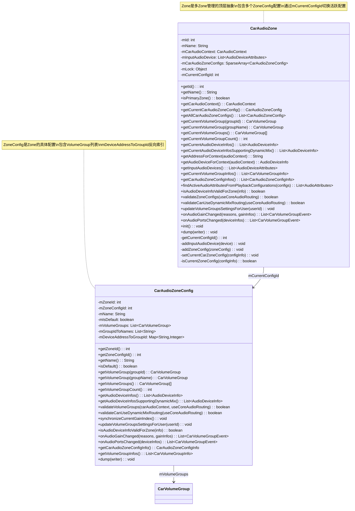
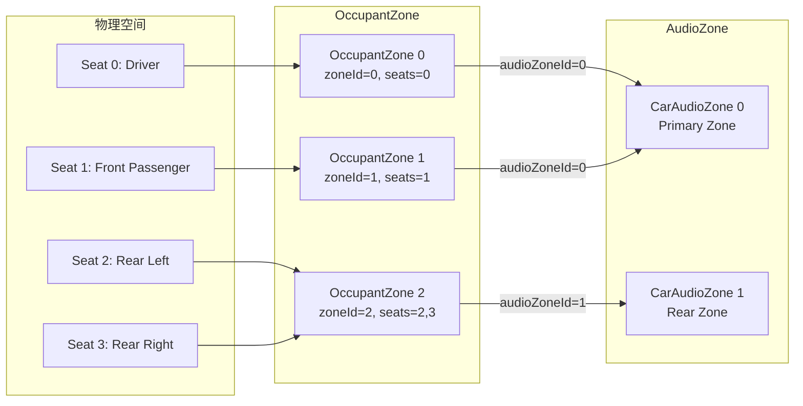
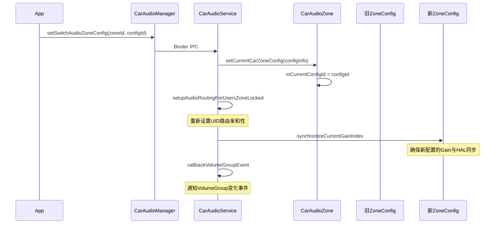
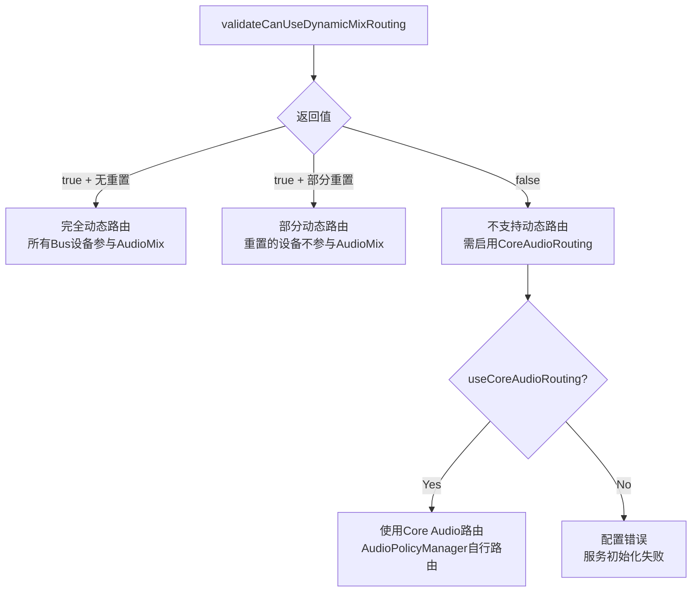

## 9.3 CarAudioZone多Zone管理

> CarAudioZone是AAOS多Zone音频架构的核心抽象，每个Zone拥有独立的音量组、焦点处理器和Bus设备，实现车内不同区域的音频隔离与独立控制

---

### 9.3.1 CarAudioZone类定义与结构

[`CarAudioZone`](packages/services/Car/service/src/com/android/car/audio/CarAudioZone.java:51)封装了一个车载音频Zone的全部信息：

```java
public class CarAudioZone {
    private final int mId;                                    // Zone唯一标识
    private final String mName;                               // Zone名称（如"Primary Zone"）
    private final CarAudioContext mCarAudioContext;           // 音频上下文映射
    private final List<AudioDeviceAttributes> mInputAudioDevice;  // 输入设备列表
    private final SparseArray<CarAudioZoneConfig> mCarAudioZoneConfigs;  // Zone配置映射
    private final Object mLock = new Object();                // 当前配置保护锁
    @GuardedBy("mLock")
    private int mCurrentConfigId;                             // 当前激活的配置ID
}
```

#### CarAudioZone完整类结构图



---

### 9.3.2 Zone→VolumeGroup→DeviceAddress三级映射

AAOS音频架构的核心数据结构是Zone→VolumeGroup→DeviceAddress三级映射：

```mermaid
flowchart TB
    subgraph Zone0[Primary Zone id=0]
        subgraph Config0[ZoneConfig id=1 Default]
            subgraph VG0[VolumeGroup 0: Media]
                Bus0[bus0_media_out<br>Context: MUSIC]
            end
            subgraph VG1[VolumeGroup 1: Navigation]
                Bus1[bus1_navigation_out<br>Context: NAVIGATION]
            end
            subgraph VG2[VolumeGroup 2: Voice]
                Bus2[bus2_voice_command_out<br>Context: VOICE_COMMAND]
            end
            subgraph VG3[VolumeGroup 3: Ring+Call]
                Bus3[bus3_call_ring_out<br>Context: CALL_RING, CALL]
            end
            subgraph VG4[VolumeGroup 4: Alarm+Notification]
                Bus4[bus4_alarm_out<br>Context: ALARM, NOTIFICATION]
            end
            subgraph VG5[VolumeGroup 5: System]
                Bus5[bus5_system_out<br>Context: SYSTEM_SOUND]
            end
            subgraph VG6[VolumeGroup 6: Safety+Emergency]
                Bus6[bus6_safety_out<br>Context: EMERGENCY, SAFETY]
            end
        end
    end
    
    subgraph Zone1[Rear Zone id=1]
        subgraph Config1[ZoneConfig id=1 Default]
            subgraph VG10[VolumeGroup 0: Media]
                Bus10[bus10_media_out<br>Context: MUSIC]
            end
            subgraph VG11[VolumeGroup 1: Navigation]
                Bus11[bus11_navigation_out<br>Context: NAVIGATION]
            end
        end
    end
```



#### 反向索引：DeviceAddress→GroupId

[`CarAudioZoneConfig`](packages/services/Car/service/src/com/android/car/audio/CarAudioZoneConfig.java:45)维护了`mDeviceAddressToGroupId`映射，用于快速从Bus地址定位VolumeGroup：

```java
private final Map<String, Integer> mDeviceAddressToGroupId;  // address→groupId

// Builder中构建映射
private void addGroupAddressesToMap(List<String> addresses, int groupId) {
    for (int index = 0; index < addresses.size(); index++) {
        mDeviceAddressToGroupId.put(addresses.get(index), groupId);
    }
}
```

这个映射在HAL Gain回调时使用——HAL报告某个Bus地址的Gain变化，通过`mDeviceAddressToGroupId`快速找到对应的VolumeGroup。

---

### 9.3.3 getVolumeGroupIdForAudioContext()方法解析

[`getAddressForContext()`](packages/services/Car/service/src/com/android/car/audio/CarAudioZone.java:207)和[`getAudioDeviceForContext()`](packages/services/Car/service/src/com/android/car/audio/CarAudioZone.java:218)是从Context查找设备的两个关键方法：

```java
public String getAddressForContext(int audioContext) {
    mCarAudioContext.preconditionCheckAudioContext(audioContext);  // 上下文合法性检查
    String deviceAddress = null;
    for (CarVolumeGroup volumeGroup : getCurrentVolumeGroups()) {
        deviceAddress = volumeGroup.getAddressForContext(audioContext);
        if (deviceAddress != null) {
            return deviceAddress;  // 找到即返回
        }
    }
    // 不应到达此处：每个Context必须分配到某个VolumeGroup
    throw new IllegalStateException("Could not find output device in zone " + mId
            + " for audio context " + audioContext);
}
```

查找逻辑：
1. 遍历当前ZoneConfig的所有VolumeGroup
2. 对每个VolumeGroup调用`getAddressForContext(audioContext)`
3. 找到第一个匹配即返回
4. 如果遍历完毕仍未找到，抛出`IllegalStateException`

这保证了配置校验的约束——**所有Context必须分配到某个VolumeGroup**，由[`validateVolumeGroups()`](packages/services/Car/service/src/com/android/car/audio/CarAudioZoneConfig.java:159)强制执行。

---

### 9.3.4 isPrimaryZone标记和约束

[`isPrimaryZone()`](packages/services/Car/service/src/com/android/car/audio/CarAudioZone.java:87)检查当前Zone是否为主Zone：

```java
boolean isPrimaryZone() {
    return mId == CarAudioManager.PRIMARY_AUDIO_ZONE;  // PRIMARY_AUDIO_ZONE = 0
}
```

#### 主Zone的特殊约束

主Zone（id=0）在AAOS中有特殊地位，享有以下独有能力：

| 能力 | 主Zone | 非主Zone | 说明 |
|------|--------|---------|------|
| 媒体请求目标 | 是 | 否 | 非主Zone的媒体可路由到主Zone |
| 音频镜像源 | 是 | 否 | 主Zone可作为镜像音频源 |
| 默认音频输出 | 是 | 否 | 未指定Zone的音频默认路由到主Zone |
| OccupantZone默认绑定 | 是 | 否 | 主驾驶位默认绑定主Zone |
| 音量键默认Zone | 是 | 否 | 无Seat信息时音量键作用于主Zone |

#### 主Zone配置约束

[`validateZoneConfigs()`](packages/services/Car/service/src/com/android/car/audio/CarAudioZone.java:131)对每个Zone（包括主Zone）施加统一校验：

1. **至少一个ZoneConfig存在**：`mCarAudioZoneConfigs.size() == 0` → 校验失败
2. **当前ZoneConfig存在**：`mCurrentConfigId`必须在`mCarAudioZoneConfigs`中
3. **所有ZoneConfig的zoneId一致**：每个Config的`getZoneId()`必须等于Zone的`mId`
4. **恰好一个默认Config**：只能有一个`isDefault()==true`的Config
5. **VolumeGroup校验通过**：每个Config的`validateVolumeGroups()`必须通过

---

### 9.3.5 Zone与OccupantZoneService的映射关系

CarAudioZone与OccupantZone通过[`CarOccupantZoneService`](packages/services/Car/service/src/com/android/car/CarOccupantZoneService.java)建立映射：



#### 映射建立过程

[`setupOccupantZoneInfoLocked()`](packages/services/Car/service/src/com/android/car/audio/CarAudioService.java)在init()中建立映射：

1. 遍历所有OccupantZone
2. 获取每个OccupantZone的`audioZoneId`
3. 构建双向映射表：
   - `mAudioZoneIdToOccupantZoneIdMapping`：AudioZoneId→OccupantZoneId
   - `mAudioZoneIdToUserIdMapping`：AudioZoneId→UserId

#### 映射变化的回调

当OccupantZone的用户变化时，[`mOccupantZoneCallback`](packages/services/Car/service/src/com/android/car/audio/CarAudioService.java:318)触发音频路由更新：

```java
private final ICarOccupantZoneCallback mOccupantZoneCallback =
    new ICarOccupantZoneCallback.Stub() {
        @Override
        public void onOccupantZoneUserChanged(int occupantZoneId, int userId) {
            synchronized (mImplLock) {
                handleOccupantZoneUserChanged(occupantZoneId, userId);
            }
        }
    };
```

`handleOccupantZoneUserChanged()`更新`mAudioZoneIdToUserIdMapping`并调用`setUserIdDeviceAffinityLocked()`重新设置用户→Zone的路由亲和性。

---

### 9.3.6 ZoneConfig动态切换

CarAudioZone支持多个ZoneConfig配置，运行时可通过[`setSwitchAudioZoneConfig()`](packages/services/Car/service/src/com/android/car/audio/CarAudioService.java)切换：

#### 切换流程



#### ZoneConfig的设计意义

多个ZoneConfig允许OEM为同一Zone定义不同的音频配置方案：
- **驾驶模式**：强调导航和系统声音
- **停车模式**：全功能媒体输出
- **夜间模式**：降低最大音量

切换ZoneConfig时，音频路由规则、音量组数量和设备绑定都会改变。

---

### 9.3.7 Zone配置校验详解

#### validateVolumeGroups()校验规则

[`CarAudioZoneConfig.validateVolumeGroups()`](packages/services/Car/service/src/com/android/car/audio/CarAudioZoneConfig.java:159)执行四项校验：

| 校验项 | 规则 | CoreAudioRouting例外 |
|-------|------|---------------------|
| Context唯一性 | 一个Context不能出现在两个VolumeGroup | 无例外 |
| Context完整性 | 所有CarAudioContext定义的Context都必须被分配 | 无例外 |
| Address唯一性 | 一个Bus地址不能出现在两个VolumeGroup | CoreAudioRouting允许（同一设备多Context共享） |
| Gain步长一致性 | 同一VolumeGroup内所有设备的步长必须相同 | 无例外 |

#### validateCanUseDynamicMixRouting()校验规则

[`validateCanUseDynamicMixRouting()`](packages/services/Car/service/src/com/android/car/audio/CarAudioZoneConfig.java:103)确保AudioPolicy动态混合路由的约束：

1. **Usage唯一性**：同一个AudioAttributes Usage不能路由到两个不同的Bus地址
   - 原因：AudioMixingRule只能按Usage匹配，无法区分同一Usage的不同设备
   - CoreAudioRouting模式：允许但标记设备`resetCanBeRoutedWithDynamicPolicyMix()`
2. **Address唯一性**：同一Bus地址不能出现在两个VolumeGroup
   - 原因：CarAudioService无法为同一地址建立属于不同VolumeGroup的路由规则
   - CoreAudioRouting模式：仅警告，不阻止

#### 校验结果影响



---

### 9.3.8 Zone与Gain回调处理

#### onAudioGainChanged()

[`onAudioGainChanged()`](packages/services/Car/service/src/com/android/car/audio/CarAudioZone.java:262)处理HAL Gain变化，只返回当前活跃Config的事件：

```java
List<CarVolumeGroupEvent> onAudioGainChanged(List<Integer> halReasons,
        List<CarAudioGainConfigInfo> gainInfos) {
    List<CarVolumeGroupEvent> events = new ArrayList<>();
    for (int index = 0; index < mCarAudioZoneConfigs.size(); index++) {
        List<CarVolumeGroupEvent> eventsForZoneConfig =
            mCarAudioZoneConfigs.valueAt(index).onAudioGainChanged(halReasons, gainInfos);
        // 只返回当前活跃Config的事件
        if (mCarAudioZoneConfigs.keyAt(index) == getCurrentConfigId()) {
            events.addAll(eventsForZoneConfig);
        }
    }
    return events;
}
```

#### onAudioPortsChanged()

[`onAudioPortsChanged()`](packages/services/Car/service/src/com/android/car/audio/CarAudioZone.java:275)处理HAL音频端口变化（设备热插拔），逻辑类似但触发不同的VolumeGroup方法：

```java
List<CarVolumeGroupEvent> onAudioPortsChanged(List<HalAudioDeviceInfo> deviceInfos) {
    // 同样遍历所有Config，只返回当前Config的事件
    // 对每个匹配的VolumeGroup调用updateAudioDeviceInfo + calculateNewGainStageFromDeviceInfos
}
```

---

### 9.3.9 Zone初始化init()详解

[`init()`](packages/services/Car/service/src/com/android/car/audio/CarAudioZone.java:187)在`setupDynamicRoutingLocked()`步骤4中被调用：

```java
void init() {
    for (int index = 0; index < mCarAudioZoneConfigs.size(); index++) {
        mCarAudioZoneConfigs.valueAt(index).synchronizeCurrentGainIndex();
    }
}
```

[`synchronizeCurrentGainIndex()`](packages/services/Car/service/src/com/android/car/audio/CarAudioZoneConfig.java:219)确保每个VolumeGroup的Gain Index与HAL实际状态同步：

```java
void synchronizeCurrentGainIndex() {
    for (int index = 0; index < mVolumeGroups.size(); index++) {
        CarVolumeGroup group = mVolumeGroups.get(index);
        // 用当前Index重新设置，触发HAL增益设置
        group.setCurrentGainIndex(group.getCurrentGainIndex());
    }
}
```

这个"自己设置自己"的设计意图：确保HAL侧的增益值与CarAudioService内部状态一致。在配置加载阶段，VolumeGroup的Index可能从Settings恢复，但HAL可能处于不同的增益值。

---

### 9.3.10 CarAudioZone设计决策总结

| 设计决策 | 原因 | 影响 |
|---------|------|------|
| ZoneConfig多配置 | 支持场景化音频配置 | 切换Config无需重启服务 |
| mCurrentConfigId用锁保护 | ZoneConfig切换可能并发 | 读取当前Config必须同步 |
| mCarAudioZoneConfigs不加锁 | XML解析时写入，运行时只读 | 简化并发控制 |
| Address→GroupId反向索引 | HAL回调快速定位VolumeGroup | O(1)查找效率 |
| 只返回当前Config的Gain事件 | 非活跃Config不影响输出 | 避免无效事件通知 |
| Context必须全分配 | 确保任何音频请求都有路由 | validateVolumeGroups强制 |
| isPrimaryZone=0 | 与CarAudioManager常量一致 | 主Zone id硬编码为0 |

---

[← 上一个](09_9.2_CarAudioService-车载音频核心服务.md) | [← 返回09章](README.md) | [返回导航](../README.md) | [下一个 →](09_9.4_CarAudioFocus-车载焦点管理.md)