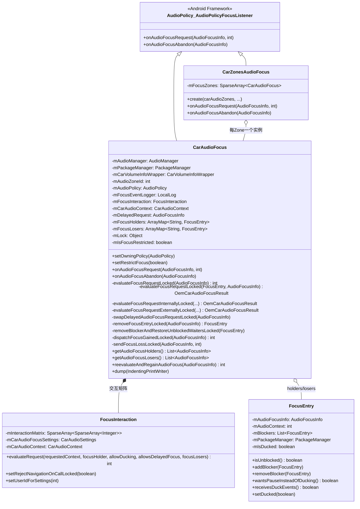
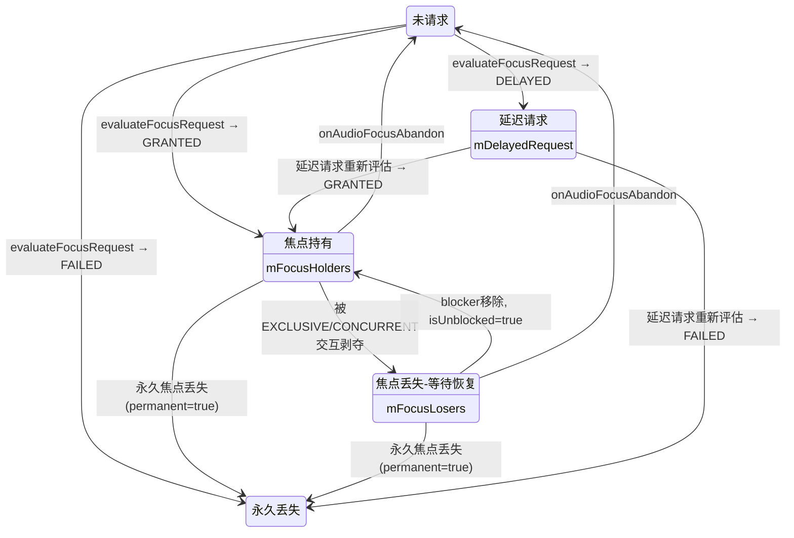
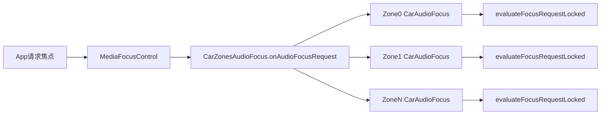
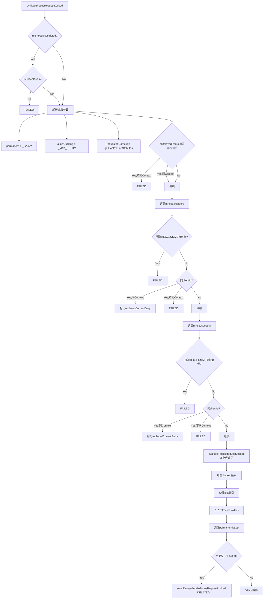
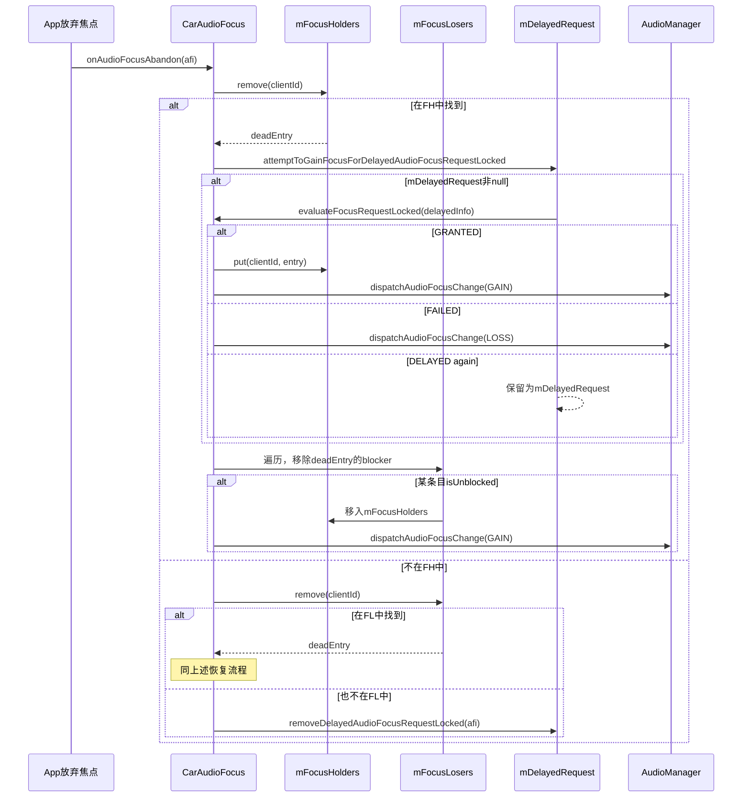
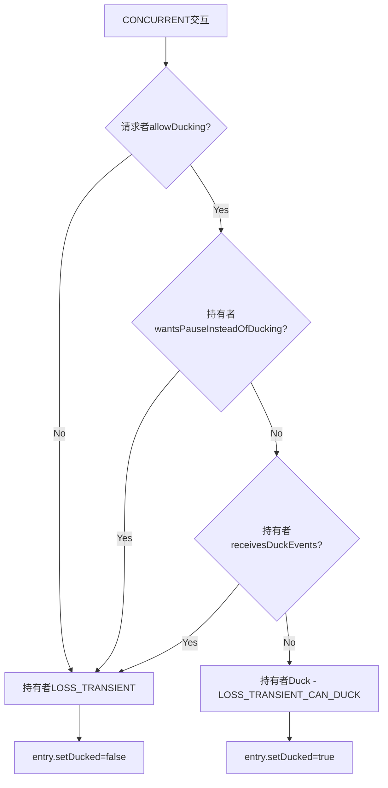
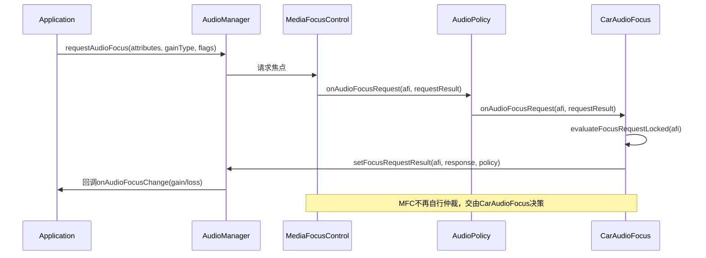

## 9.4 CarAudioFocus — 车载焦点管理

> [← 上一个](09_9.3_CarAudioZone-多Zone音频管理.md) | [← 返回09章](README.md) | [返回导航](../README.md) | [下一个 →](09_9.5_CarVolumeGroup-车载音量组.md)

---

### 9.4.1 类定义与继承体系

[`CarAudioFocus`](packages/services/Car/service/src/com/android/car/audio/CarAudioFocus.java:65) 继承自 `AudioPolicy.AudioPolicyFocusListener`，是AAOS焦点仲裁的核心实现。标准Android使用MediaFocusControl的LIFO栈模型，AAOS则采用基于交互矩阵的二维决策模型，天然支持多音频并发（如导航+音乐同时播放）。



### 9.4.2 核心数据结构

#### 焦点持有者与丢失者

| 数据结构 | 类型 | 键 | 说明 |
|----------|------|-----|------|
| [`mFocusHolders`](packages/services/Car/service/src/com/android/car/audio/CarAudioFocus.java:97) | `ArrayMap<String, FocusEntry>` | clientId | 当前持有焦点的条目 |
| [`mFocusLosers`](packages/services/Car/service/src/com/android/car/audio/CarAudioFocus.java:99) | `ArrayMap<String, FocusEntry>` | clientId | 因EXCLUSIVE/CONCURRENT交互暂时丢失焦点，等待恢复的条目 |
| [`mDelayedRequest`](packages/services/Car/service/src/com/android/car/audio/CarAudioFocus.java:83) | `AudioFocusInfo` | — | 被延迟的焦点请求（仅一个），等待高优先级释放后重新评估 |
| [`mIsFocusRestricted`](packages/services/Car/service/src/com/android/car/audio/CarAudioFocus.java:104) | `boolean` | — | 焦点限制标志，为true时仅允许critical音频获取焦点 |

#### FocusEntry关键成员

[`FocusEntry`](packages/services/Car/service/src/com/android/car/audio/FocusEntry.java:36) 是焦点条目的核心封装：

| 成员 | 类型 | 说明 |
|------|------|------|
| [`mAudioFocusInfo`](packages/services/Car/service/src/com/android/car/audio/FocusEntry.java:39) | `AudioFocusInfo` | 框架层焦点信息（clientId/uid/attributes/gainRequest/flags） |
| [`mAudioContext`](packages/services/Car/service/src/com/android/car/audio/FocusEntry.java:40) | `@AudioContext int` | CarAudioContext值，用于交互矩阵查表 |
| [`mBlockers`](packages/services/Car/service/src/com/android/car/audio/FocusEntry.java:42) | `List<FocusEntry>` | 阻止此条目恢复焦点的所有FocusEntry列表 |
| [`mIsDucked`](packages/services/Car/service/src/com/android/car/audio/FocusEntry.java:44) | `boolean` | 当前是否处于Duck状态 |

**mBlockers机制**：当一个FocusEntry因EXCLUSIVE交互丢失焦点时，导致其丢失的FocusEntry被添加到其mBlockers列表。只有mBlockers清空（`isUnblocked()`返回true），该条目才能从mFocusLosers移回mFocusHolders并重新获得焦点。

#### 焦点状态转换模型



### 9.4.3 CarZonesAudioFocus多Zone焦点分发

[`CarZonesAudioFocus`](packages/services/Car/service/src/com/android/car/audio/CarZonesAudioFocus.java) 是AAOS多Zone焦点架构的入口分发器。它为每个AudioZone创建独立的[`CarAudioFocus`](packages/services/Car/service/src/com/android/car/audio/CarAudioFocus.java:65)实例，确保Zone间焦点互不干扰。

**创建流程**（`create()`静态工厂方法）：
1. 遍历所有`CarAudioZone`
2. 为每个Zone创建独立的`FocusInteraction`实例（携带Zone专属的CarAudioContext）
3. 构造`CarAudioFocus`实例并放入`mFocusZones` SparseArray

**焦点分发逻辑**（[`onAudioFocusRequest`](packages/services/Car/service/src/com/android/car/audio/CarZonesAudioFocus.java)）：
1. 通过`getAudioZoneIdForAudioFocusInfo(afi)`确定请求所属Zone
2. 路由到对应Zone的`CarAudioFocus.onAudioFocusRequest()`



### 9.4.4 焦点请求入口 — onAudioFocusRequest

[`onAudioFocusRequest()`](packages/services/Car/service/src/com/android/car/audio/CarAudioFocus.java:621) 是焦点请求的回调入口，由AudioPolicy框架在App请求焦点时调用：

```java
// CarAudioFocus.java:621-634
@Override
public void onAudioFocusRequest(AudioFocusInfo afi, int requestResult) {
    int response;
    AudioPolicy policy;
    synchronized (mLock) {
        policy = mAudioPolicy;
        response = evaluateFocusRequestLocked(afi);  // 核心评估逻辑
    }
    // 将评估结果回传给AudioManager
    mAudioManager.setFocusRequestResult(afi, response, policy);
}
```

**关键设计**：在mLock保护下完成评估，然后通过`setFocusRequestResult()`将结果（GRANTED/FAILED/DELAYED）回传给原始请求者。

### 9.4.5 evaluateFocusRequestLocked源码级解析

[`evaluateFocusRequestLocked(AudioFocusInfo)`](packages/services/Car/service/src/com/android/car/audio/CarAudioFocus.java:207) 是焦点评估的核心方法（1082行源码中最复杂的方法，行207-439），完整流程如下：



**核心决策步骤详解**：

1. **焦点限制检查**（行212-216）：若`mIsFocusRestricted=true`，非critical音频直接FAILED
2. **请求参数解析**（行224-227）：permanent/allowDucking/requestedContext
3. **延迟请求冲突检查**（行231-243）：同clientId不同Context直接FAILED；同Context则继续
4. **焦点持有者扫描**（行250-288）：
   - 通知+EXCLUSIVE持有者→FAILED（硬编码规则，绕过矩阵）
   - 同clientId同Context→替换（`replacedCurrentEntry`）
   - 同clientId不同Context→FAILED（不允许同一监听器同时持有不同Context焦点）
5. **焦点丢失者扫描**（行291-325）：逻辑与持有者扫描类似
6. **双路径评估**（行327-328）：调用`evaluateFocusRequestLocked(replacedCurrentEntry, afi)`
7. **处理受影响条目**（行339-430）：
   - 替换条目移入permanentlyLost
   - 新建FocusEntry
   - 处理blocked条目（已丢失但新增阻塞→永久LOSS或添加blocker）
   - 处理lost条目（当前持有者丢失→发送LOSS、移入mFocusLosers、添加blocker）
   - 延迟请求处理
   - 清理permanentlyLost（`removeBlockerAndRestoreUnblockedWaitersLocked`）

### 9.4.6 焦点评估双路径机制

[`evaluateFocusRequestLocked(FocusEntry, AudioFocusInfo)`](packages/services/Car/service/src/com/android/car/audio/CarAudioFocus.java:442) 根据OEM服务状态选择评估路径：

```java
// CarAudioFocus.java:442-448
private OemCarAudioFocusResult evaluateFocusRequestLocked(
        FocusEntry replacedCurrentEntry, AudioFocusInfo audioFocusInfo) {
    return isExternalFocusEnabled()
            ? evaluateFocusRequestExternallyLocked(audioFocusInfo, replacedCurrentEntry)
            : evaluateFocusRequestInternallyLocked(audioFocusInfo, replacedCurrentEntry);
}
```

| 路径 | 方法 | 条件 | 说明 |
|------|------|------|------|
| 内部评估 | [`evaluateFocusRequestInternallyLocked()`](packages/services/Car/service/src/com/android/car/audio/CarAudioFocus.java:451) | `!isExternalFocusEnabled()` | 使用FocusInteraction交互矩阵 |
| 外部评估 | [`evaluateFocusRequestExternallyLocked()`](packages/services/Car/service/src/com/android/car/audio/CarAudioFocus.java:491) | `isExternalFocusEnabled()` | 委托给OemCarAudioFocusService |

**`isExternalFocusEnabled()`判定条件**（行535-547）：
- `CarOemProxyService.isOemServiceEnabled()` → true
- `CarOemProxyService.isOemServiceReady()` → true
- `CarOemProxyService.getCarOemAudioFocusService()` → 非null

**内部评估流程**（[`evaluateFocusRequestInternallyLocked`](packages/services/Car/service/src/com/android/car/audio/CarAudioFocus.java:451)）：
1. 解析allowDucking和allowDelayedFocus
2. `evaluateAgainstFocusHoldersLocked()` → 遍历mFocusHolders，对每个条目调用`FocusInteraction.evaluateRequest()`
3. `evaluateAgainstFocusLosersLocked()` → 遍历mFocusLosers，同样调用`evaluateRequest()`
4. 若任一评估FAILED → 返回EMPTY结果
5. 若任一评估DELAYED → 最终结果DELAYED
6. 构造`AudioFocusEntry`和`OemCarAudioFocusResult`返回

**外部评估流程**（[`evaluateFocusRequestExternallyLocked`](packages/services/Car/service/src/com/android/car/audio/CarAudioFocus.java:491)）：
1. 构造`OemCarAudioFocusEvaluationRequest`（含mutedVolumeGroups + focusHolders + focusLosers + zoneId）
2. 调用`OemCarAudioFocusService.evaluateAudioFocusRequest(request)`
3. 直接返回OEM评估结果

### 9.4.7 FocusInteraction交互矩阵详解

[`FocusInteraction`](packages/services/Car/service/src/com/android/car/audio/FocusInteraction.java:62) 维护一个13x13的二维交互矩阵`INTERACTION_MATRIX`，定义了所有AudioContext之间的焦点交互关系。

#### 三种交互类型

| 类型 | 值 | 含义 | 对当前持有者的影响 |
|------|-----|------|-------------------|
| `INTERACTION_REJECT` | 0 | 拒绝请求 | 请求者FAILED或DELAYED（若支持延迟） |
| `INTERACTION_EXCLUSIVE` | 1 | 独占焦点 | 当前持有者收到LOSS，移入mFocusLosers |
| `INTERACTION_CONCURRENT` | 2 | 并发焦点 | 当前持有者可能Duck或LOSS（取决于allowDucking和持有者标志） |

#### CONCURRENT交互的细化处理

在[`evaluateRequest()`](packages/services/Car/service/src/com/android/car/audio/FocusInteraction.java:414)中，CONCURRENT交互有三种子结果：

```
CONCURRENT + !allowDucking       → focusHolder加入focusLosers（收到LOSS_TRANSIENT）
CONCURRENT + allowDucking + 持有者wantsPauseInsteadOfDucking → focusHolder加入focusLosers
CONCURRENT + allowDucking + 持有者receivesDuckEvents       → focusHolder加入focusLosers
CONCURRENT + allowDucking + 其他                              → 持有者Duck，请求GRANTED
```

#### 完整交互矩阵表

行=当前焦点持有者Context，列=新请求Context，值=交互类型

| 持有者\请求 | INVALID | MUSIC | NAV | VOICE | RING | CALL | ALARM | NOTIF | SYS | EMER | SAFETY | VEH | ANN |
|-------------|---------|-------|-----|-------|------|------|-------|-------|-----|------|--------|-----|-----|
| INVALID | R | R | R | R | R | R | R | R | R | E | E | R | R |
| MUSIC | R | E | C | E | E | E | E | C | C | E | C | C | E |
| NAV | R | C | C | E | C | E | C | C | C | E | C | C | C |
| VOICE | R | C | R | C | E | E | R | R | R | E | C | C | R |
| RING | R | R | C | C | C | C | R | R | C | E | C | C | R |
| CALL | R | R | C | R | C | C | C | C | R | C | C | C | R |
| ALARM | R | C | C | E | E | E | C | C | C | E | C | C | R |
| NOTIF | R | C | C | E | E | E | C | C | C | E | C | C | C |
| SYS | R | C | C | E | E | E | C | C | C | E | C | C | C |
| EMER | R | R | R | R | R | C | R | R | R | C | C | R | R |
| SAFETY | R | C | C | C | C | C | C | C | C | C | C | C | C |
| VEH | R | C | C | C | C | C | C | C | C | E | C | C | C |
| ANN | R | E | C | E | E | E | E | C | C | E | C | C | E |

> R=REJECT, E=EXCLUSIVE, C=CONCURRENT

**关键交互规则解读**：
- **EMERGENCY**：几乎拒绝所有其他请求，仅允许CALL和SAFETY并发 → 最高优先级
- **SAFETY**：允许所有Context并发 → 最低干扰
- **CALL vs NAV**：默认CONCURRENT（通话期间导航可并发），可通过`setRejectNavigationOnCallLocked`动态修改为REJECT
- **MUSIC vs NAV**：CONCURRENT → 音乐和导航可同时播放（AAOS核心特性）
- **VOICE_COMMAND**：对NAV/ALARM/NOTIF/SYS/ANN为REJECT → 语音助手需要安静环境

#### 动态交互修改 — setRejectNavigationOnCallLocked

[`setRejectNavigationOnCallLocked()`](packages/services/Car/service/src/com/android/car/audio/FocusInteraction.java:374) 允许运行时动态修改CALL vs NAVIGATION交互：

```java
// FocusInteraction.java:374-383
public void setRejectNavigationOnCallLocked(boolean navigationRejectedWithCall) {
    int callContext = mCarAudioContext.getContextForAttributes(
            CarAudioContext.getAudioAttributeFromUsage(
                    AudioAttributes.USAGE_VOICE_COMMUNICATION));
    int navContext = mCarAudioContext.getContextForAttributes(
            CarAudioContext.getAudioAttributeFromUsage(
                    AudioAttributes.USAGE_ASSISTANCE_NAVIGATION_GUIDANCE));
    mInteractionMatrix.get(callContext).put(navContext,
            navigationRejectedWithCall ? INTERACTION_REJECT : INTERACTION_CONCURRENT);
}
```

**触发机制**：通过`CarSettings.Secure.KEY_AUDIO_FOCUS_NAVIGATION_REJECTED_DURING_CALL`设置项变化，由`ContentObserver`监听并调用`navigationOnCallSettingChanged()`。用户可在设置中切换"通话期间拒绝导航"。

#### CoreAudioRouting模式下的矩阵初始化

当`CarAudioContext.useCoreAudioRouting()`返回true时（行348-363），交互矩阵初始化为**全CONCURRENT**：

```java
// FocusInteraction.java:352-363
if (!carAudioContext.useCoreAudioRouting()) {
    mInteractionMatrix = INTERACTION_MATRIX.clone();  // 使用预定义13x13矩阵
} else {
    // CoreAudioRouting模式：所有交互默认为CONCURRENT
    for (rowIndex...) {
        for (columnIndex...) {
            rowDecisions.append(columnInfo.getId(), INTERACTION_CONCURRENT);
        }
    }
}
```

这意味着OEM使用CoreAudioRouting时，所有Context默认并发，焦点交互完全由OEM自行定义。

### 9.4.8 焦点释放与恢复 — onAudioFocusAbandon

[`onAudioFocusAbandon()`](packages/services/Car/service/src/com/android/car/audio/CarAudioFocus.java:659) 在App放弃焦点时被调用：

```java
// CarAudioFocus.java:659-670
@Override
public void onAudioFocusAbandon(AudioFocusInfo afi) {
    synchronized (mLock) {
        FocusEntry deadEntry = removeFocusEntryLocked(afi);
        if (deadEntry != null) {
            removeBlockerAndRestoreUnblockedWaitersLocked(deadEntry);
        } else {
            removeDelayedAudioFocusRequestLocked(afi);
        }
    }
}
```

**处理流程**：
1. [`removeFocusEntryLocked()`](packages/services/Car/service/src/com/android/car/audio/CarAudioFocus.java:684)：从mFocusHolders或mFocusLosers中移除条目
2. 若找到条目 → [`removeBlockerAndRestoreUnblockedWaitersLocked()`](packages/services/Car/service/src/com/android/car/audio/CarAudioFocus.java:710)：
   - 先尝试恢复延迟焦点请求（`attemptToGainFocusForDelayedAudioFocusRequestLocked`）
   - 再遍历mFocusLosers，移除deadEntry的blocker引用
   - 若某条目的mBlockers清空（`isUnblocked()`）→ 移回mFocusHolders + `dispatchFocusGainedLocked()`
3. 若未找到条目 → `removeDelayedAudioFocusRequestLocked()`：清除延迟请求

#### 焦点恢复完整时序



### 9.4.9 延迟焦点请求机制

AAOS支持延迟焦点请求（Delayed Focus），允许焦点请求在当前无法获得时排队等待，而不是直接失败。

#### 延迟条件判定

[`canReceiveDelayedFocus()`](packages/services/Car/service/src/com/android/car/audio/CarAudioFocus.java:646)：

```java
// CarAudioFocus.java:646-651
private boolean canReceiveDelayedFocus(AudioFocusInfo afi) {
    if (afi.getGainRequest() != AUDIOFOCUS_GAIN) {
        return false;  // 仅永久焦点请求可延迟
    }
    return (afi.getFlags() & AUDIOFOCUS_FLAG_DELAY_OK) == AUDIOFOCUS_FLAG_DELAY_OK;
}
```

条件：请求类型必须是`AUDIOFOCUS_GAIN`（永久）且携带`AUDIOFOCUS_FLAG_DELAY_OK`标志。

#### 延迟请求存储与替换

[`swapDelayedAudioFocusRequestLocked()`](packages/services/Car/service/src/com/android/car/audio/CarAudioFocus.java:637)：

```java
// CarAudioFocus.java:637-644
private void swapDelayedAudioFocusRequestLocked(AudioFocusInfo afi) {
    if (mDelayedRequest != null
            && !afi.getClientId().equals(mDelayedRequest.getClientId())) {
        // 不同客户端：通知旧延迟请求者LOSS
        sendFocusLossLocked(mDelayedRequest, AUDIOFOCUS_LOSS);
    }
    mDelayedRequest = afi;
}
```

**关键设计**：
- 系统仅保留**一个**延迟请求（`mDelayedRequest`为单个AudioFocusInfo，非列表）
- 新延迟请求替换旧延迟请求时，若clientId不同，旧请求者收到LOSS
- 同clientId的延迟请求在`evaluateFocusRequestLocked`行231-243已处理

#### 延迟焦点恢复

[`attemptToGainFocusForDelayedAudioFocusRequestLocked()`](packages/services/Car/service/src/com/android/car/audio/CarAudioFocus.java:716) 在焦点释放时被调用：

```java
// CarAudioFocus.java:716-746
private void attemptToGainFocusForDelayedAudioFocusRequestLocked() {
    if (mDelayedRequest == null) return;
    AudioFocusInfo delayedFocusInfo = mDelayedRequest;
    mDelayedRequest = null;  // 先清空，防止递归
    int results = evaluateFocusRequestLocked(delayedFocusInfo);  // 重新评估
    if (results == AUDIOFOCUS_REQUEST_GRANTED) {
        dispatchFocusGainedLocked(focusEntry.getAudioFocusInfo());
    } else if (results == AUDIOFOCUS_REQUEST_FAILED) {
        sendFocusLossLocked(delayedFocusInfo, AUDIOFOCUS_LOSS);
    } else {
        // 又被延迟（DELAYED），mDelayedRequest已被重新设置
        assert mDelayedRequest.equals(delayedFocusInfo);
    }
}
```

**恢复结果**：
| 重新评估结果 | 处理 |
|-------------|------|
| GRANTED | 分发GAIN通知，延迟请求变为正常持有者 |
| FAILED | 分发LOSS通知，延迟请求永久失败 |
| DELAYED | mDelayedRequest保持不变（可能被不同client替换） |

### 9.4.10 焦点限制 — setRestrictFocus

[`setRestrictFocus()`](packages/services/Car/service/src/com/android/car/audio/CarAudioFocus.java:128) 用于在紧急场景（如驾驶安全限制）下限制非关键音频获取焦点：

```java
// CarAudioFocus.java:128-136
void setRestrictFocus(boolean isFocusRestricted) {
    synchronized (mLock) {
        mIsFocusRestricted = isFocusRestricted;
        if (mIsFocusRestricted) {
            abandonNonCriticalFocusLocked();
        }
    }
}
```

**限制效果**：
1. **新请求**：`evaluateFocusRequestLocked`行212-216，非critical音频直接FAILED
2. **现有持有**：`abandonNonCriticalFocusLocked()` → 遍历mFocusLosers和mFocusHolders，非critical条目收到LOSS并移除

**Critical音频判定**（[`CarAudioContext.isCriticalAudioAudioAttribute()`](packages/services/Car/service/src/com/android/car/audio/CarAudioContext.java)）：EMERGENCY和SAFETY Context对应的Usage被视为critical。

### 9.4.11 Ducking规则与并发焦点细节

AAOS的Ducking机制与标准Android类似但更精细，由三个因素共同决定：

| 因素 | 来源 | 说明 |
|------|------|------|
| `allowDucking` | 请求者的`AUDIOFOCUS_GAIN_TRANSIENT_MAY_DUCK` | 请求者是否允许其他持有者Duck |
| [`wantsPauseInsteadOfDucking()`](packages/services/Car/service/src/com/android/car/audio/FocusEntry.java:93) | 持有者的`AUDIOFOCUS_FLAG_PAUSES_ON_DUCKABLE_LOSS` | 持有者希望暂停而非Duck |
| [`receivesDuckEvents()`](packages/services/Car/service/src/com/android/car/audio/FocusEntry.java:98) | 持有者的`AUDIOFOCUS_EXTRA_RECEIVE_DUCKING_EVENTS` + `PERMISSION_RECEIVE_CAR_AUDIO_DUCKING_EVENTS` | 持有者需要接收所有Duck事件 |

**Duck状态转换**：



**Duck→Loss升级**：当一个新的非Duckable请求到来时，已Duck的条目可能升级为LOSS：

```java
// CarAudioFocus.java:368-374
if (!allowDucking && entry.isDucked()) {
    Slogf.i(TAG, "Converting duckable loss to non-duckable for " + entry.getClientId());
    sendFocusLossLocked(entry.getAudioFocusInfo(), AUDIOFOCUS_LOSS_TRANSIENT);
    entry.setDucked(false);
}
```

### 9.4.12 与标准MediaFocusControl的交互边界

AAOS焦点系统并非完全替代标准MediaFocusControl，而是作为AudioPolicy的FocusListener介入：



**关键边界**：
- **请求路径**：App → AudioManager → MediaFocusControl → AudioPolicy → CarAudioFocus
- **响应路径**：CarAudioFocus → `setFocusRequestResult()` → MediaFocusControl → App
- **通知路径**：CarAudioFocus → `dispatchAudioFocusChange()` → MediaFocusControl → App
- **AudioPolicy注册**：CarAudioService在init()中注册AudioPolicy，MediaFocusControl将焦点仲裁权委托给CarAudioFocus

| 维度 | 标准Android | AAOS |
|------|-------------|------|
| 管理器 | MediaFocusControl栈 | CarAudioFocus矩阵 |
| 决策方式 | LIFO栈入出 | 2D交互矩阵查表 |
| 并发支持 | 不支持（栈顶唯一） | 原生支持（CONCURRENT交互） |
| Zone感知 | 无 | 每Zone独立CarAudioFocus |
| 延迟焦点 | 不支持 | 支持（AUDIOFOCUS_FLAG_DELAY_OK） |
| OEM扩展 | 无 | OemCarAudioFocusService外部评估 |
| Duck精细度 | 仅allowDucking | allowDucking + wantsPause + receivesDuckEvents |

### 9.4.13 dump()调试输出

[`dump()`](packages/services/Car/service/src/com/android/car/audio/CarAudioFocus.java:878) 输出当前Zone焦点状态的全部信息：

```
*CarAudioFocus*
    Audio Zone ID: 0
    Is focus restricted? false
    Is external focus eval enabled? false
    Reject Navigation on Call: false

    Current Focus Holders:
        clientId1 - AudioAttributes: usage=USAGE_MEDIA
            Receives Duck Events: false, Wants Pause Instead of Ducking: false, Is Ducked: false
            Is Unblocked: true
    Transient Focus Losers:
        clientId2 - AudioAttributes: usage=USAGE_MEDIA
            Receives Duck Events: true, Wants Pause Instead of Ducking: false, Is Ducked: true
            Is Unblocked: false
                Blocker[0]: clientId3
    Queued Delayed Focus: None
    Focus Events:
        [最近25条焦点事件日志]
```

| 输出维度 | 说明 |
|----------|------|
| Audio Zone ID | 所属音频Zone |
| Is focus restricted | 焦点是否受限 |
| Is external focus eval enabled | OEM外部评估是否启用 |
| Reject Navigation on Call | 通话时是否拒绝导航 |
| Current Focus Holders | 当前焦点持有者列表（含Duck/Pause状态） |
| Transient Focus Losers | 暂时丢失焦点的条目（含blocker列表） |
| Queued Delayed Focus | 延迟焦点请求（clientId或None） |
| Focus Events | 焦点事件日志（最近25条） |

---

### 设计决策总结

| 决策 | 原因 | 影响 |
|------|------|------|
| 矩阵模型替代栈模型 | 车载场景需要多音频并发（导航+音乐） | 天然支持CONCURRENT交互 |
| 每Zone独立CarAudioFocus | 不同乘员独立音频空间 | Zone间焦点完全隔离 |
| 单延迟请求（mDelayedRequest） | 简化实现，避免延迟队列优先级问题 | 新延迟请求替换旧请求 |
| clientId唯一性约束 | 同一监听器无法区分不同Context的GAIN/LOSS | 同clientId不同Context直接FAILED |
| 通知+EXCLUSIVE硬编码规则 | 兼容标准Android的TRANSIENT_EXCLUSIVE行为 | 绕过交互矩阵直接拒绝 |
| OEM外部评估路径 | 允许OEM自定义焦点策略 | 矩阵可被OemCarAudioFocusService完全替换 |
| CoreAudioRouting全CONCURRENT | CoreAudioRouting模式下Context由OEM定义 | 初始矩阵不预设交互关系 |
| mBlockers列表机制 | 精确跟踪多个阻塞源 | 仅所有blocker移除才恢复焦点 |

---

[← 上一个](09_9.3_CarAudioZone-多Zone音频管理.md) | [← 返回09章](README.md) | [返回导航](../README.md) | [下一个 →](09_9.5_CarVolumeGroup-车载音量组.md)