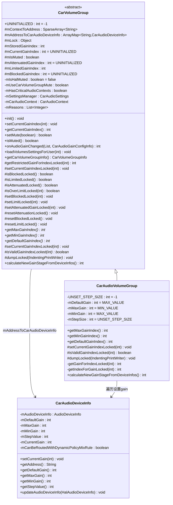
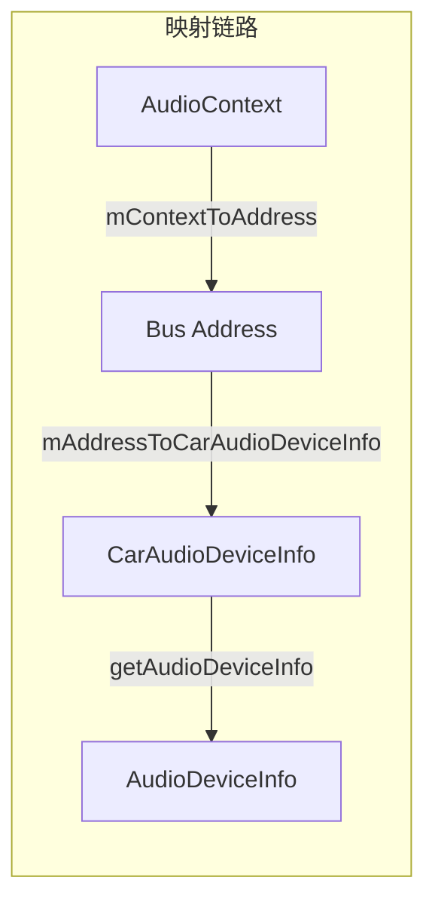
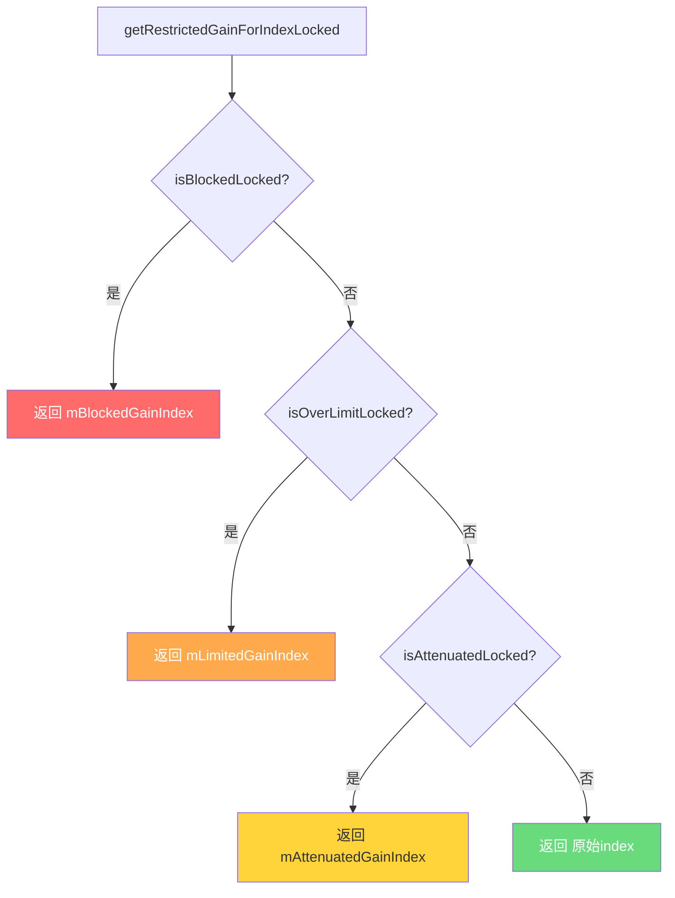
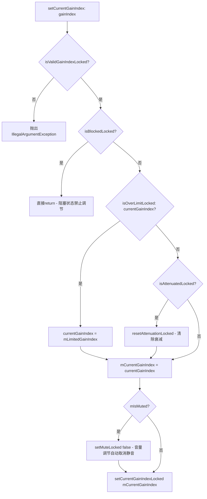
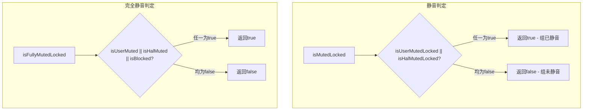
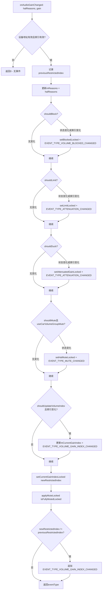
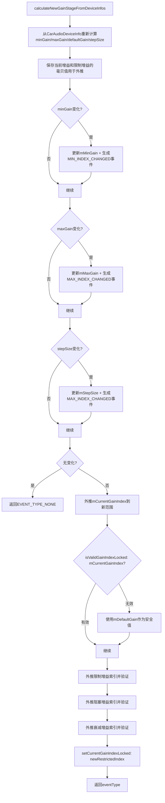

## 9.5 CarVolumeGroup — 车载音量组

> 源码位置：
> - [`CarVolumeGroup.java`](packages/services/Car/service/src/com/android/car/audio/CarVolumeGroup.java)（抽象类，810行）
> - [`CarAudioVolumeGroup.java`](packages/services/Car/service/src/com/android/car/audio/CarAudioVolumeGroup.java)（具体子类，237行）
> - [`CarAudioDeviceInfo.java`](packages/services/Car/service/src/com/android/car/audio/CarAudioDeviceInfo.java)（设备信息封装，236行）

### 9.5.1 类定义与继承体系

AAOS音量组采用抽象类+具体子类的模板方法模式。[`CarVolumeGroup`](packages/services/Car/service/src/com/android/car/audio/CarVolumeGroup.java:70)定义音量组的通用行为框架（映射管理、增益状态机、静音机制、HAL回调处理），[`CarAudioVolumeGroup`](packages/services/Car/service/src/com/android/car/audio/CarAudioVolumeGroup.java:39)实现基于`AudioManager.setAudioPortGain`的硬件增益控制方案。



### 9.5.2 核心成员变量一览

CarVolumeGroup的成员变量按功能分为五大类：

| 分类 | 变量 | 类型 | 初始值 | 说明 |
|------|------|------|--------|------|
| 映射关系 | `mContextToAddress` | `SparseArray<String>` | 构造传入 | AudioContext→Bus地址映射 |
| 映射关系 | `mAddressToCarAudioDeviceInfo` | `ArrayMap<String,CarAudioDeviceInfo>` | 构造传入 | Bus地址→设备信息映射 |
| 标识信息 | `mId` | `int` | 构造传入 | 音量组ID（0-based） |
| 标识信息 | `mName` | `String` | 构造传入 | 音量组名称 |
| 标识信息 | `mZoneId` | `int` | 构造传入 | 所属Zone ID |
| 标识信息 | `mConfigId` | `int` | 构造传入 | 所属Zone配置ID |
| Gain状态 | `mCurrentGainIndex` | `int` | `UNINITIALIZED(-1)` | 当前增益索引 |
| Gain状态 | `mStoredGainIndex` | `int` | 0 | 持久化存储的增益索引 |
| Gain状态 | `mBlockedGainIndex` | `int` | `UNINITIALIZED` | 阻塞增益索引（最高优先级） |
| Gain状态 | `mLimitedGainIndex` | `int` | `getMaxGainIndex()` | 限制增益索引（第二优先级） |
| Gain状态 | `mAttenuatedGainIndex` | `int` | `UNINITIALIZED` | 衰减增益索引（第三优先级） |
| 静音状态 | `mIsMuted` | `boolean` | `false` | 用户静音标志 |
| 静音状态 | `mIsHalMuted` | `boolean` | `false` | HAL静音标志 |
| 配置参数 | `mUseCarVolumeGroupMute` | `boolean` | 构造传入 | 是否启用组静音功能 |
| 配置参数 | `mHasCriticalAudioContexts` | `boolean` | 构造时计算 | 是否包含关键音频上下文 |
| HAL回调 | `mReasons` | `List<Integer>` | `ArrayList` | 当前生效的HAL原因列表 |
| 用户信息 | `mUserId` | `int` | `CURRENT` | 当前用户ID |

CarAudioVolumeGroup扩展的成员变量：

| 变量 | 类型 | 初始值 | 说明 |
|------|------|--------|------|
| `mDefaultGain` | `int` | `Integer.MAX_VALUE` | 默认增益（毫贝） |
| `mMaxGain` | `int` | `Integer.MIN_VALUE` | 最大增益（毫贝） |
| `mMinGain` | `int` | `Integer.MAX_VALUE` | 最小增益（毫贝） |
| `mStepSize` | `int` | `UNSET_STEP_SIZE(-1)` | 增益步进值（毫贝） |

### 9.5.3 Context→Address映射机制

CarVolumeGroup通过两个双向映射结构建立了AudioContext到物理音频设备的完整路由：



**正向查找：Context→Address→Device**

[`getAddressForContext()`](packages/services/Car/service/src/com/android/car/audio/CarVolumeGroup.java:338)方法直接从`mContextToAddress`获取Bus地址：

```java
// CarVolumeGroup.java:338
String getAddressForContext(int audioContext) {
    return mContextToAddress.get(audioContext);
}
```

[`getAudioDeviceForContext()`](packages/services/Car/service/src/com/android/car/audio/CarVolumeGroup.java:347)方法两级查找，先获取地址再获取设备：

```java
// CarVolumeGroup.java:347
AudioDeviceInfo getAudioDeviceForContext(int audioContext) {
    String address = getAddressForContext(audioContext);
    if (address == null) return null;
    CarAudioDeviceInfo info = mAddressToCarAudioDeviceInfo.get(address);
    if (info == null) return null;
    return info.getAudioDeviceInfo();
}
```

**反向查找：Address→Contexts**

[`getContextsForAddress()`](packages/services/Car/service/src/com/android/car/audio/CarVolumeGroup.java:362)遍历`mContextToAddress`查找所有映射到同一地址的上下文。多个Context可共享同一Bus地址（如MUSIC和ANNOUNCEMENT共用扬声器输出）。

**配置来源**

`mContextToAddress`在构造时由外部传入，源自`car_audio_configuration.xml`中`<volumeGroup>`的`<context>`元素：

```xml
<volumeGroup id="0" name="media group">
    <context context="music"/>
    <context context="announcement"/>
</volumeGroup>
```

XML解析时，每个`<context>`元素的`context`属性被映射为Bus地址（由`CarAudioZonesHelper`根据zone配置中的`<device>`分配），形成`SparseArray<String>`传入CarVolumeGroup构造函数。

### 9.5.4 Gain↔Index转换模型

CarAudioVolumeGroup的核心设计是将硬件增益值（毫贝单位）转换为离散的索引值，供上层应用和用户界面使用。

**转换公式**

[`getGainForIndexLocked()`](packages/services/Car/service/src/com/android/car/audio/CarAudioVolumeGroup.java:117) — Index→Gain：

```
gainInMillibel = mMinGain + gainIndex × mStepSize
```

[`getIndexForGainLocked()`](packages/services/Car/service/src/com/android/car/audio/CarAudioVolumeGroup.java:122) — Gain→Index：

```
gainIndex = (gainInMillibel - mMinGain) / mStepSize
```

**索引范围**

```
MinIndex = (mMinGain - mMinGain) / mStepSize = 0
MaxIndex = (mMaxGain - mMinGain) / mStepSize
DefaultIndex = (mDefaultGain - mMinGain) / mStepSize
```

**典型配置示例**

假设一个媒体音量组的HAL配置为：`mMinGain=-7200mB, mMaxGain=0mB, mStepSize=100mB, mDefaultGain=-3600mB`

| 参数 | 计算过程 | 结果 |
|------|---------|------|
| MinIndex | (-7200-(-7200))/100 | 0 |
| MaxIndex | (0-(-7200))/100 | 72 |
| DefaultIndex | (-3600-(-7200))/100 | 36 |
| Index 36 → Gain | -7200+36×100 | -3600mB |
| Index 72 → Gain | -7200+72×100 | 0mB |

**有效性校验**

[`isValidGainIndexLocked()`](packages/services/Car/service/src/com/android/car/audio/CarAudioVolumeGroup.java:95)确保索引在有效范围内：

```java
// CarAudioVolumeGroup.java:95
boolean isValidGainIndexLocked(int gainIndex) {
    return gainIndex >= getIndexForGainLocked(mMinGain)
            && gainIndex <= getIndexForGainLocked(mMaxGain);
}
```

### 9.5.5 四层Gain状态优先级

CarVolumeGroup最核心的设计是四层增益状态优先级机制。当HAL通过`onAudioGainChanged`回调报告增益变化时，系统根据HAL Reasons将增益状态分为四个层级，按优先级从高到低处理：



[`getRestrictedGainForIndexLocked()`](packages/services/Car/service/src/com/android/car/audio/CarVolumeGroup.java:414)源码：

```java
// CarVolumeGroup.java:414-429
int getRestrictedGainForIndexLocked(int index) {
    if (isBlockedLocked()) {
        return mBlockedGainIndex;           // 优先级1: 阻塞
    }
    if (isOverLimitLocked()) {
        return mLimitedGainIndex;           // 优先级2: 限幅
    }
    if (isAttenuatedLocked()) {
        return mAttenuatedGainIndex;        // 优先级3: 衰减
    }
    return index;                           // 优先级4: 正常
}
```

**四层状态详解**

| 层级 | 状态 | 判定条件 | HAL Reason触发 | 效果 |
|------|------|---------|---------------|------|
| 1-阻塞 | `isBlockedLocked()` | `mBlockedGainIndex != UNINITIALIZED` | FORCED_MASTER_MUTE, TCU_MUTE, REMOTE_MUTE | 完全锁定音量，用户无法调节 |
| 2-限幅 | `isOverLimitLocked()` | `isLimitedLocked() && index > mLimitedGainIndex` | THERMAL_LIMITATION, SUSPEND_EXIT_VOL_LIMITATION | 限制最大音量到指定值 |
| 3-衰减 | `isAttenuatedLocked()` | `mAttenuatedGainIndex != UNINITIALIZED` | ADAS_DUCKING, NAV_DUCKING | 暂时降低音量（如导航提示时） |
| 4-正常 | — | 以上条件均不满足 | — | 使用用户设定的当前索引 |

**限幅状态的精妙设计**

[`isLimitedLocked()`](packages/services/Car/service/src/com/android/car/audio/CarVolumeGroup.java:206)判定`mLimitedGainIndex != getMaxGainIndex()`，而[`isOverLimitLocked(int)`](packages/services/Car/service/src/com/android/car/audio/CarVolumeGroup.java:216)额外检查`index > mLimitedGainIndex`。这意味着：

- 只有当前索引**超过**限幅值时，才返回限幅索引
- 当前索引低于限幅值时，用户设定的索引不受影响
- 限幅本质是"限制上限"，而非"固定到某值"

**阻塞 vs 衰减的本质区别**

- **阻塞（Blocked）**：硬性禁止音量调节，`setCurrentGainIndex()`直接return，用户按键无效
- **衰减（Attenuated）**：软性降低音量，用户按键仍可调节（触发`resetAttenuationLocked()`清除衰减状态），衰减是临时的

### 9.5.6 setCurrentGainIndex源码解析

[`setCurrentGainIndex()`](packages/services/Car/service/src/com/android/car/audio/CarVolumeGroup.java:434)是用户音量调节的入口方法，包含完整的增益状态处理逻辑：



关键设计决策：

1. **阻塞优先**：`isBlockedLocked()`检查在索引校验之后立即执行，确保阻塞状态下任何音量调节请求都被拒绝
2. **限幅替代**：超过限幅值时，请求索引被替换为限幅索引，而非拒绝请求
3. **衰减自动清除**：用户主动调节音量时自动清除衰减状态（[`resetAttenuationLocked()`](packages/services/Car/service/src/com/android/car/audio/CarVolumeGroup.java:226)），意味着用户选择优先于HAL临时衰减
4. **静音自动取消**：音量调节自动取消用户静音（但**不取消HAL静音**，HAL静音在`setMute()`中独立处理）

CarAudioVolumeGroup的[`setCurrentGainIndexLocked()`](packages/services/Car/service/src/com/android/car/audio/CarAudioVolumeGroup.java:84)实现：

```java
// CarAudioVolumeGroup.java:84-91
protected void setCurrentGainIndexLocked(int gainIndex) {
    int gainInMillibels = getGainForIndexLocked(gainIndex);
    for (int index = 0; index < mAddressToCarAudioDeviceInfo.size(); index++) {
        CarAudioDeviceInfo info = mAddressToCarAudioDeviceInfo.valueAt(index);
        info.setCurrentGain(gainInMillibels);  // 逐一设置到硬件设备
    }
    super.setCurrentGainIndexLocked(gainIndex);  // 持久化存储
}
```

该方法遍历组内所有`CarAudioDeviceInfo`，将增益值设置到每个物理设备端口。[`CarAudioDeviceInfo.setCurrentGain()`](packages/services/Car/service/src/com/android/car/audio/CarAudioDeviceInfo.java:149)内部调用`AudioManagerHelper.setAudioPortGain()`，将增益值写入AudioFlinger的设备端口配置。

### 9.5.7 双源静音机制

CarVolumeGroup实现了用户静音和HAL静音的双源静音机制，二者在优先级和取消条件上有本质区别。

**静音状态组合**



| 方法 | 判定逻辑 | 用途 |
|------|---------|------|
| [`isMutedLocked()`](packages/services/Car/service/src/com/android/car/audio/CarVolumeGroup.java:592) | `mIsMuted \|\| mIsHalMuted` | 对外报告静音状态 |
| [`isUserMutedLocked()`](packages/services/Car/service/src/com/android/car/audio/CarVolumeGroup.java:598) | `mIsMuted` | 仅用户静音 |
| [`isHalMutedLocked()`](packages/services/Car/service/src/com/android/car/audio/CarVolumeGroup.java:241) | `mIsHalMuted` | 仅HAL静音 |
| [`isFullyMutedLocked()`](packages/services/Car/service/src/com/android/car/audio/CarVolumeGroup.java:603) | `mIsMuted \|\| mIsHalMuted \|\| isBlockedLocked()` | 包含阻塞的完全静音 |

**setMute()方法解析**

[`setMute()`](packages/services/Car/service/src/com/android/car/audio/CarVolumeGroup.java:557)是用户静音的入口：

```java
// CarVolumeGroup.java:557-569
boolean setMute(boolean mute) {
    synchronized (mLock) {
        // HAL静音生效时，禁止用户取消静音
        if (!mute && isHalMutedLocked()) {
            Slogf.e(CarLog.TAG_AUDIO, "Un-mute request cannot be processed "
                    + "due to active hal mute restriction!");
            return false;
        }
        applyMuteLocked(mute);   // 子类覆写，CarAudioVolumeGroup中为空实现
        return setMuteLocked(mute);
    }
}
```

关键约束：**HAL静音期间，用户无法取消静音**。这确保了紧急静音（如TCU_MUTE、REMOTE_MUTE）不会被用户操作覆盖。

**setMuteLocked()持久化逻辑**

[`setMuteLocked()`](packages/services/Car/service/src/com/android/car/audio/CarVolumeGroup.java:572)在修改`mIsMuted`后，如果启用了`mUseCarVolumeGroupMute`且`isPersistVolumeGroupMuteEnabled`，则将静音状态持久化到Settings：

```java
// CarVolumeGroup.java:572-579
boolean setMuteLocked(boolean mute) {
    boolean hasChanged = mIsMuted != mute;
    mIsMuted = mute;
    if (mSettingsManager.isPersistVolumeGroupMuteEnabled(mUserId)) {
        mSettingsManager.storeVolumeGroupMuteForUser(mUserId, mZoneId, mConfigId, mId, mute);
    }
    return hasChanged;
}
```

**音量调节自动取消静音**

在[`setCurrentGainIndex()`](packages/services/Car/service/src/com/android/car/audio/CarVolumeGroup.java:454)中，如果`mIsMuted`为true，音量调节会自动调用`setMuteLocked(false)`取消用户静音。但HAL静音不受影响——因为`setMuteLocked`只修改`mIsMuted`，不修改`mIsHalMuted`。

### 9.5.8 onAudioGainChanged回调处理

[`onAudioGainChanged()`](packages/services/Car/service/src/com/android/car/audio/CarVolumeGroup.java:679)是AudioControl HAL增益变化回调的核心处理方法，负责将HAL报告的增益原因转换为内部的增益状态变更和事件通知。



**HAL Reason到增益状态的映射**

[`CarAudioGainMonitor`](packages/services/Car/service/src/com/android/car/audio/CarAudioGainMonitor.java)提供静态方法将HAL Reasons映射为具体操作：

| CarAudioGainMonitor方法 | 触发Reason | 目标增益状态 |
|------------------------|-----------|-------------|
| [`shouldBlockVolumeRequest()`](packages/services/Car/service/src/com/android/car/audio/CarAudioGainMonitor.java:115) | FORCED_MASTER_MUTE, TCU_MUTE, REMOTE_MUTE | Blocked |
| [`shouldLimitVolume()`](packages/services/Car/service/src/com/android/car/audio/CarAudioGainMonitor.java:120) | THERMAL_LIMITATION, SUSPEND_EXIT_VOL_LIMITATION | Limited |
| [`shouldDuckGain()`](packages/services/Car/service/src/com/android/car/audio/CarAudioGainMonitor.java:125) | ADAS_DUCKING, NAV_DUCKING | Attenuated |
| [`shouldMuteVolumeGroup()`](packages/services/Car/service/src/com/android/car/audio/CarAudioGainMonitor.java:129) | TCU_MUTE, REMOTE_MUTE | HAL Muted |
| [`shouldUpdateVolumeIndex()`](packages/services/Car/service/src/com/android/car/audio/CarAudioGainMonitor.java:133) | EXTERNAL_AMP_VOL_FEEDBACK | 直接更新索引 |

**事件去重机制**

`onAudioGainChanged`在每个状态变更前都检查"状态是否真的发生了变化"或"状态未变但索引值是否变化"，避免重复事件：

```java
// CarVolumeGroup.java:694-698 - 阻塞状态变更检测
if ((shouldBlock != isBlockedLocked())
        || (shouldBlock && (halIndex != mBlockedGainIndex))) {
    setBlockedLocked(shouldBlock ? halIndex : UNINITIALIZED);
    eventType |= EVENT_TYPE_VOLUME_BLOCKED_CHANGED;
}
```

**同步到所有设备端口**

处理完所有状态后，方法调用`setCurrentGainIndexLocked(newRestrictedIndex)`将限制后的增益索引同步到组内所有物理设备端口（行734）。同时调用`applyMuteLocked(isFullyMutedLocked())`同步静音状态（行737）。

### 9.5.9 calculateNewGainStageFromDeviceInfos动态增益阶段重算

[`calculateNewGainStageFromDeviceInfos()`](packages/services/Car/service/src/com/android/car/audio/CarAudioVolumeGroup.java:127)是CarAudioVolumeGroup独有方法，在HAL报告设备增益配置变化时，重新计算音量组的增益阶段参数。



**外推逻辑详解**

当minGain/maxGain/stepSize发生变化时，不能简单沿用旧索引值，因为相同的索引在不同范围下对应不同的增益值。方法采用"毫贝外推"策略：

1. **保存旧毫贝值**：在更新范围前，先将旧索引转换为毫贝值
2. **更新范围参数**：用新计算的minGain/maxGain/stepSize覆盖旧值
3. **外推到新索引**：用新公式将旧毫贝值转换回新索引

```java
// CarAudioVolumeGroup.java:161-198
int epCurrentGainInMb = getGainForIndexLocked(getCurrentGainIndexLocked());
// ... 更新mMinGain/mMaxGain/mStepSize ...
mCurrentGainIndex = getIndexForGainLocked(epCurrentGainInMb);
if (!isValidGainIndexLocked(mCurrentGainIndex)) {
    mCurrentGainIndex = getIndexForGainLocked(mDefaultGain);  // 安全回退
}
```

**限制索引外推与安全回退**

对限制/阻塞/衰减增益索引也执行类似的外推。如果外推后的索引在新范围外（`isValidGainIndexLocked`返回false），则重置该限制状态：

```java
// CarAudioVolumeGroup.java:206-225
int newLimitedGainIndex = getIndexForGainLocked(epLimitedGainInMb);
if (isLimited && isValidGainIndexLocked(newLimitedGainIndex)) {
    setLimitLocked(newLimitedGainIndex);    // 外推有效，保留限制
} else {
    resetLimitLocked();                      // 外推无效，重置限制
}
```

设计注释（行227-232）指出：重置限制后，期望AudioControl HAL通过`onAudioGainChanged`重新发送限制回调，以恢复一致状态。

### 9.5.10 init与用户切换

**init()初始化**

[`init()`](packages/services/Car/service/src/com/android/car/audio/CarVolumeGroup.java:167)在CarAudioZone初始化期间调用：

```java
// CarVolumeGroup.java:167-173
void init() {
    synchronized (mLock) {
        mStoredGainIndex = mSettingsManager.getStoredVolumeGainIndexForUser(
                mUserId, mZoneId, mConfigId, mId);
        updateCurrentGainIndexLocked();
    }
}
```

[`updateCurrentGainIndexLocked()`](packages/services/Car/service/src/com/android/car/audio/CarVolumeGroup.java:635)判断存储索引是否有效，决定使用存储值还是默认值：

```java
// CarVolumeGroup.java:635-641
private void updateCurrentGainIndexLocked() {
    if (isValidGainIndexLocked(mStoredGainIndex)) {
        mCurrentGainIndex = mStoredGainIndex;
    } else {
        mCurrentGainIndex = getDefaultGainIndex();
    }
}
```

**用户切换loadVolumesSettingsForUser**

[`loadVolumesSettingsForUser()`](packages/services/Car/service/src/com/android/car/audio/CarVolumeGroup.java:539)在Android多用户切换时调用，恢复新用户的音量设置：

```java
// CarVolumeGroup.java:539-549
void loadVolumesSettingsForUser(int userId) {
    synchronized (mLock) {
        updateUserIdLocked(userId);           // 更新用户ID并读取存储的增益索引
        updateCurrentGainIndexLocked();       // 应用存储或默认索引
        setCurrentGainIndexLocked(getCurrentGainIndexLocked());  // 设置到硬件
        updateGroupMuteLocked();              // 恢复静音状态
    }
}
```

[`updateGroupMuteLocked()`](packages/services/Car/service/src/com/android/car/audio/CarVolumeGroup.java:659)逻辑：如果未启用`mUseCarVolumeGroupMute`则跳过；如果未启用持久化静音则重置为未静音；否则从Settings恢复静音状态。

### 9.5.11 CarVolumeGroupInfo与事件构建

**getCarVolumeGroupInfo()**

[`getCarVolumeGroupInfo()`](packages/services/Car/service/src/com/android/car/audio/CarVolumeGroup.java:746)将CarVolumeGroup内部状态转换为Parcelable对象，供跨进程传递：

```java
// CarVolumeGroup.java:746-762
CarVolumeGroupInfo getCarVolumeGroupInfo() {
    synchronized (mLock) {
        gainIndex = getRestrictedGainForIndexLocked(mCurrentGainIndex);
        isMuted = isMutedLocked();
        isBlocked = isBlockedLocked();
        isAttenuated = isAttenuatedLocked() || isLimitedLocked();
    }
    return new CarVolumeGroupInfo.Builder(...)
            .setVolumeGainIndex(gainIndex)
            .setMuted(isMuted)
            .setBlocked(isBlocked)
            .setAttenuated(isAttenuated)
            .setAudioAttributes(getAudioAttributes())
            .build();
}
```

注意：`isAttenuated`同时包含了衰减和限幅两种状态，因为对UI而言二者都是"音量被暂时降低"的语义。

**事件类型枚举**

`onAudioGainChanged()`返回的事件类型是`CarVolumeGroupEvent.EventTypeEnum`的位掩码组合：

| 事件类型 | 值 | 触发条件 |
|---------|-----|---------|
| `EVENT_TYPE_VOLUME_GAIN_INDEX_CHANGED` | 1 << 0 | 增益索引变化 |
| `EVENT_TYPE_VOLUME_MIN_INDEX_CHANGED` | 1 << 1 | 最小索引变化（动态增益重算） |
| `EVENT_TYPE_VOLUME_MAX_INDEX_CHANGED` | 1 << 2 | 最大索引变化（动态增益重算） |
| `EVENT_TYPE_VOLUME_BLOCKED_CHANGED` | 1 << 3 | 阻塞状态变化 |
| `EVENT_TYPE_ATTENUATION_CHANGED` | 1 << 4 | 衰减/限幅状态变化 |
| `EVENT_TYPE_MUTE_CHANGED` | 1 << 5 | 静音状态变化 |

### 9.5.12 dump()调试输出与设计决策总结

**dump()输出格式**

[`dump()`](packages/services/Car/service/src/com/android/car/audio/CarVolumeGroup.java:485)输出完整的音量组调试信息：

```
CarVolumeGroup(0)
  Name(media group)
  Zone Id(0)
  Configuration Id(1)
  Is Muted(false)
  UserId(0)
  Persist Volume Group Mute(true)
  Step size: 100
  Gain values (min / max / default / current): -7200 0 -3600 -3600
  Gain indexes (min / max / default / current): 0 72 36 36
  Context: MUSIC -> Address: bus0_media_out
  Context: ANNOUNCEMENT -> Address: bus0_media_out
  bus0_media_out: ...
  Reported reasons:
    ADAS_DUCKING
  Gain infos:
    Blocked: false
    Limited: false
    Attenuated: true (at: 18)
    Muted by HAL: false
```

**设计决策总结**

| 设计决策 | 选择 | 原因 |
|---------|------|------|
| 抽象类+子类模式 | CarVolumeGroup抽象 + CarAudioVolumeGroup实现 | 支持Core Audio Volume方案（直接用AudioManager API）和传统setAudioPortGain方案的统一框架 |
| 四层增益优先级 | Blocked > OverLimit > Attenuated > Normal | 紧急事件（主静音/TCU）需绝对优先，热限幅次之，ADAS/导航衰减再次，用户设定最次 |
| 双源静音 | mIsMuted + mIsHalMuted独立管理 | HAL紧急静音不可被用户操作覆盖 |
| 衰减可用户覆盖 | setCurrentGainIndex自动resetAttenuation | 用户主动调节优先于系统临时衰减 |
| 限幅是上限而非固定值 | isOverLimitLocked检查index > limit | 保护设备的同时允许用户在限制范围内自由调节 |
| 毫贝外推策略 | 动态增益阶段重算时先保存mB再转换 | 保持音量感知一致性，避免参数变化导致音量跳变 |
| 事件去重 | 每个状态变更前检查是否真的变化 | 避免UI无意义刷新，减少IPC开销 |
| 关键音频上下文标记 | hasCriticalAudioContexts() | 用于安全决策（如焦点限制时critical音频不受限） |

[← 上一个](09_9.4_CarAudioFocus-车载焦点管理.md) | [← 返回09章](README.md) | [返回导航](../README.md) | [下一个 →](09_9.6_CarAudioContext-车载音频上下文深度解析.md)