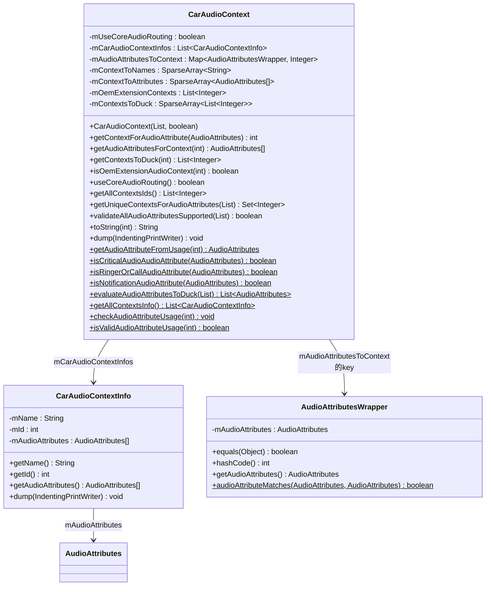
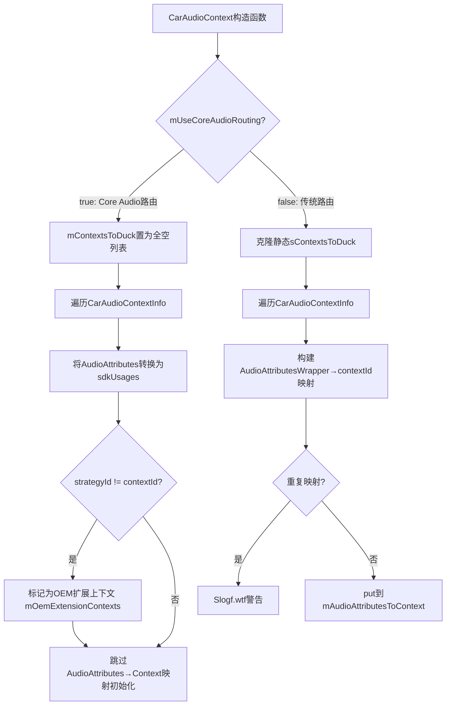
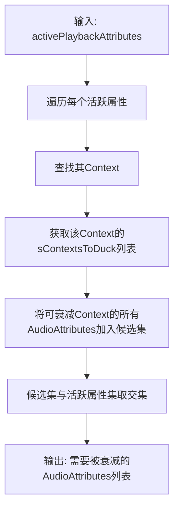
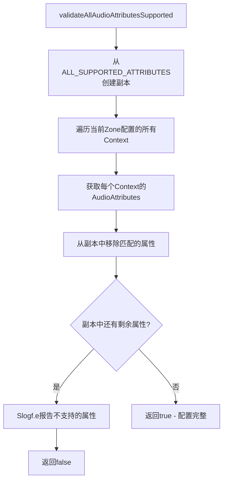

## 9.6 CarAudioContext — 车载音频上下文深度解析

> 源码位置：
> - [`CarAudioContext.java`](packages/services/Car/service/src/com/android/car/audio/CarAudioContext.java)（816行）
> - [`CarAudioContextInfo.java`](packages/services/Car/service/src/com/android/car/audio/CarAudioContextInfo.java)（85行）

### 9.6.1 类定义与核心结构

[`CarAudioContext`](packages/services/Car/service/src/com/android/car/audio/CarAudioContext.java:50)是AAOS音频系统的核心抽象层，将Android标准`AudioAttributes`的Usage分组为车载音频上下文（AudioContext），简化了路由配置、音量组分配和焦点交互的管理。



### 9.6.2 AUDIO_CONTEXT枚举详解

CarAudioContext定义了13个音频上下文常量（0-12），与AudioControl HAL的ContextNumber一一对应：

| 常量 | 值 | HAL对应 | 描述 | 包含的Usage |
|------|-----|---------|------|-----------|
| `INVALID` | 0 | ContextNumber.INVALID | 无效/虚拟源 | USAGE_VIRTUAL_SOURCE |
| `MUSIC` | 1 | MUSIC | 音乐播放 | USAGE_UNKNOWN, USAGE_GAME, USAGE_MEDIA |
| `NAVIGATION` | 2 | NAVIGATION | 导航指引 | USAGE_ASSISTANCE_NAVIGATION_GUIDANCE |
| `VOICE_COMMAND` | 3 | VOICE_COMMAND | 语音助手 | USAGE_ASSISTANCE_ACCESSIBILITY, USAGE_ASSISTANT |
| `CALL_RING` | 4 | CALL_RING | 来电铃声 | USAGE_NOTIFICATION_RINGTONE |
| `CALL` | 5 | CALL | 语音通话 | USAGE_VOICE_COMMUNICATION, USAGE_CALL_ASSISTANT, USAGE_VOICE_COMMUNICATION_SIGNALLING |
| `ALARM` | 6 | ALARM | 闹钟 | USAGE_ALARM |
| `NOTIFICATION` | 7 | NOTIFICATION | 通知 | USAGE_NOTIFICATION, USAGE_NOTIFICATION_EVENT |
| `SYSTEM_SOUND` | 8 | SYSTEM_SOUND | 系统音效 | USAGE_ASSISTANCE_SONIFICATION |
| `EMERGENCY` | 9 | EMERGENCY | 紧急警报 | USAGE_EMERGENCY |
| `SAFETY` | 10 | SAFETY | 安全提示 | USAGE_SAFETY |
| `VEHICLE_STATUS` | 11 | VEHICLE_STATUS | 车辆状态 | USAGE_VEHICLE_STATUS |
| `ANNOUNCEMENT` | 12 | ANNOUNCEMENT | 广播公告 | USAGE_ANNOUNCEMENT |

**上下文分类**

CarAudioContext将13个上下文分为三类：

| 分类 | 包含的Context | 特点 |
|------|-------------|------|
| **非车载系统上下文** | MUSIC, NAVIGATION, VOICE_COMMAND, CALL_RING, CALL, ALARM, NOTIFICATION, SYSTEM_SOUND | 手机/平板也存在的通用音频类型 |
| **车载系统上下文** | EMERGENCY, SAFETY, VEHICLE_STATUS, ANNOUNCEMENT | 车载特有的音频类型 |
| **无效上下文** | INVALID | 虚拟源，不参与路由和焦点 |

### 9.6.3 Context↔Usage双向映射

CarAudioContext的核心功能是在AudioContext和AudioAttributes Usage之间建立双向映射，使AAOS音频系统可以用简洁的Context编号操作，而底层仍使用标准Android AudioAttributes。

**Usage→Context映射（正向查找）**

[`getContextForAudioAttribute()`](packages/services/Car/service/src/com/android/car/audio/CarAudioContext.java:562)根据路由模式使用不同策略：

```java
// CarAudioContext.java:562-573
int getContextForAudioAttribute(AudioAttributes attributes) {
    if (mUseCoreAudioRouting) {
        // Core Audio路由模式：通过AudioProductStrategy ID查找
        int strategyId = CoreAudioHelper.getStrategyForAudioAttributes(attributes);
        if ((strategyId != CoreAudioHelper.INVALID_STRATEGY)
                && (mContextToNames.indexOfKey(strategyId) >= 0)) {
            return strategyId;
        }
        return INVALID;
    }
    // 传统模式：通过AudioAttributesWrapper查找映射表
    return mAudioAttributesToContext.getOrDefault(
            new AudioAttributesWrapper(attributes), INVALID);
}
```

**Context→Usage映射（反向查找）**

[`getAudioAttributesForContext()`](packages/services/Car/service/src/com/android/car/audio/CarAudioContext.java:549)直接从`mContextToAttributes`查找：

```java
// CarAudioContext.java:549-552
AudioAttributes[] getAudioAttributesForContext(int carAudioContext) {
    preconditionCheckAudioContext(carAudioContext);
    return mContextToAttributes.get(carAudioContext);
}
```

**映射初始化**

构造函数（[行393-446](packages/services/Car/service/src/com/android/car/audio/CarAudioContext.java:393)）根据路由模式采用不同的映射初始化策略：



**AudioAttributesWrapper的比较逻辑**

[`AudioAttributesWrapper`](packages/services/Car/service/src/com/android/car/audio/CarAudioContext.java:773)是CarAudioContext的内部类，仅基于`getSystemUsage()`进行equals/hashCode计算。这意味着在AAOS中，AudioAttributes的比较**只看Usage**，忽略ContentType、Flags等其他属性。

```java
// CarAudioContext.java:788-802
public boolean equals(Object object) {
    AudioAttributesWrapper that = (AudioAttributesWrapper) object;
    return audioAttributeMatches(mAudioAttributes, that.mAudioAttributes);
    // audioAttributeMatches比较的是getSystemUsage()
}

public int hashCode() {
    return Integer.hashCode(mAudioAttributes.getSystemUsage());
}
```

### 9.6.4 getAudioAttributeFromUsage方法解析

[`getAudioAttributeFromUsage()`](packages/services/Car/service/src/com/android/car/audio/CarAudioContext.java:579)是Usage→AudioAttributes的转换工厂方法，处理了系统Usage和标准Usage的区别：

```java
// CarAudioContext.java:579-587
public static AudioAttributes getAudioAttributeFromUsage(int usage) {
    AudioAttributes.Builder builder = new AudioAttributes.Builder();
    if (AudioAttributes.isSystemUsage(usage)) {
        builder.setSystemUsage(usage);   // EMERGENCY/SAFETY/VEHICLE_STATUS/ANNOUNCEMENT
    } else {
        builder.setUsage(usage);         // MEDIA/VOICE_COMMUNICATION/NOTIFICATION等
    }
    return builder.build();
}
```

**系统Usage（System Usage）**

Android定义了4个车载系统Usage，必须通过`setSystemUsage()`设置：

| 系统Usage | 值 | 对应Context |
|-----------|-----|-----------|
| `USAGE_EMERGENCY` | 17 | EMERGENCY(9) |
| `USAGE_SAFETY` | 18 | SAFETY(10) |
| `USAGE_VEHICLE_STATUS` | 19 | VEHICLE_STATUS(11) |
| `USAGE_ANNOUNCEMENT` | 20 | ANNOUNCEMENT(12) |

`isSystemUsage()`判定Usage值是否>=`USAGE_CALL_ASSISTANT`(16)且为系统定义值。

**Virtual Source Usage**

`INVALID`上下文对应`AudioManagerHelper.getUsageVirtualSource()`返回的隐藏Usage值。该Usage不在公开API中，专门用于标记不参与正常音频路由的虚拟源。

### 9.6.5 sContextsToDuck衰减映射矩阵

[`sContextsToDuck`](packages/services/Car/service/src/com/android/car/audio/CarAudioContext.java:274)定义了静态的"谁可以让谁衰减"映射关系，是CarDucking子系统的数据核心。

| 活跃Context | 可被衰减的Context列表 |
|------------|-------------------|
| INVALID | 无 |
| MUSIC | 无 |
| NAVIGATION | MUSIC, CALL_RING, CALL, ALARM, NOTIFICATION, SYSTEM_SOUND, VEHICLE_STATUS, ANNOUNCEMENT |
| VOICE_COMMAND | CALL_RING |
| CALL_RING | 无 |
| CALL | CALL_RING, ALARM, NOTIFICATION, VEHICLE_STATUS |
| ALARM | MUSIC |
| NOTIFICATION | MUSIC, ALARM, ANNOUNCEMENT |
| SYSTEM_SOUND | MUSIC, ALARM, ANNOUNCEMENT |
| EMERGENCY | CALL |
| SAFETY | MUSIC, NAVIGATION, VOICE_COMMAND, CALL_RING, CALL, ALARM, NOTIFICATION, SYSTEM_SOUND, VEHICLE_STATUS, ANNOUNCEMENT |
| VEHICLE_STATUS | MUSIC, CALL_RING, ANNOUNCEMENT |
| ANNOUNCEMENT | 无 |

**衰减优先级洞察**

从映射矩阵可推导出AAOS音频优先级排序（从高到低）：

1. **SAFETY** — 可衰减几乎所有其他Context，自身不被任何Context衰减
2. **EMERGENCY** — 仅可衰减CALL，但也不被衰减
3. **ANNOUNCEMENT** — 不衰减任何人，也不被NAVIGATION衰减（特殊保护）
4. **NAVIGATION** — 可衰减7个Context，仅被SAFETY衰减
5. **CALL** — 可衰减4个Context
6. **VEHICLE_STATUS** — 可衰减3个Context
7. **VOICE_COMMAND** — 仅可衰减CALL_RING
8. **NOTIFICATION/SYSTEM_SOUND** — 各可衰减3个Context
9. **ALARM** — 仅可衰减MUSIC
10. **CALL_RING** — 不衰减任何人
11. **MUSIC** — 不衰减任何人，可被最多Context衰减

**MUSIC和ANNOUNCEMENT的特殊地位**

- MUSIC是"最底层"音频，8个Context可以衰减它
- ANNOUNCEMENT不衰减任何人也不被NAVIGATION衰减，这保证了交通公告在导航播报期间仍然可听

**evaluateAudioAttributesToDuck静态方法**

[`evaluateAudioAttributesToDuck()`](packages/services/Car/service/src/com/android/car/audio/CarAudioContext.java:448)根据当前活跃的AudioAttributes列表，计算出需要被衰减的AudioAttributes集合：



关键步骤在行469：`attributesToDuck.retainAll(wrappers)`，只有**当前正在播放**的音频才会被实际衰减。这避免了不必要的Ducking操作。

### 9.6.6 OEM Context扩展机制

CarAudioContext支持OEM通过`car_audio_configuration.xml`定义自定义上下文，扩展标准的13个Context。

**OEM扩展判定逻辑**

在Core Audio路由模式下，构造函数（[行411-429](packages/services/Car/service/src/com/android/car/audio/CarAudioContext.java:411)）检测OEM扩展上下文：

```java
// CarAudioContext.java:411-429
if (mUseCoreAudioRouting) {
    int[] sdkUsages = convertAttributesToUsage(info.getAudioAttributes());
    boolean isOemExtension = false;
    for (int indexUsage = 0; indexUsage < sdkUsages.length; indexUsage++) {
        int usage = sdkUsages[indexUsage];
        AudioAttributes attributes = getAudioAttributeFromUsage(usage);
        // 如果AudioProductStrategy ID与Context ID不匹配，说明是OEM扩展
        if (CoreAudioHelper.getStrategyForAudioAttributes(attributes) != contextId) {
            isOemExtension = true;
            break;
        }
    }
    if (isOemExtension) {
        mOemExtensionContexts.add(info.getId());
    }
    // Core Audio模式下跳过AudioAttributes→Context映射初始化
    continue;
}
```

**OEM扩展的核心约束**

| 约束 | 说明 |
|------|------|
| 仅Core Audio路由模式 | OEM扩展检测仅在`mUseCoreAudioRouting=true`时执行 |
| 不能用DynamicPolicyMix路由 | OEM扩展Context的AudioAttributes无法仅通过Usage寻址，因此不能用`AudioMix`规则匹配 |
| 需要AudioProductStrategy | OEM扩展Context必须通过`audio_policy_engine_configuration.xml`定义对应的Strategy |
| [`isOemExtensionAudioContext()`](packages/services/Car/service/src/com/android/car/audio/CarAudioContext.java:483) | 外部查询OEM扩展状态 |

**传统模式 vs Core Audio模式对比**

| 维度 | 传统模式 (`mUseCoreAudioRouting=false`) | Core Audio模式 (`mUseCoreAudioRouting=true`) |
|------|---------------------------------------|---------------------------------------------|
| Context查找 | `mAudioAttributesToContext`映射表 | `CoreAudioHelper.getStrategyForAudioAttributes()` |
| Ducking映射 | 克隆静态`sContextsToDuck` | 所有Context的Duck列表为空 |
| OEM扩展 | 不支持 | 支持，标记到`mOemExtensionContexts` |
| 属性→Context映射 | 构造时初始化`mAudioAttributesToContext` | 跳过，依赖Strategy |
| 焦点交互 | FocusInteraction 13×13矩阵 | 全CONCURRENT |

### 9.6.7 关键判定方法

**isCriticalAudioAudioAttribute**

[`isCriticalAudioAudioAttribute()`](packages/services/Car/service/src/com/android/car/audio/CarAudioContext.java:626)判定音频属性是否为关键（紧急/安全）音频：

```java
// CarAudioContext.java:626-630
static boolean isCriticalAudioAudioAttribute(AudioAttributes attributes) {
    AudioAttributesWrapper wrapper = new AudioAttributesWrapper(attributes);
    return getAudioAttributeWrapperFromUsage(AudioAttributes.USAGE_EMERGENCY).equals(wrapper)
            || getAudioAttributeWrapperFromUsage(AudioAttributes.USAGE_SAFETY).equals(wrapper);
}
```

该判定在以下场景使用：
- CarVolumeGroup的`hasCriticalAudioContexts`标记（构造时计算）
- CarAudioFocus的`setRestrictFocus`焦点限制机制（critical音频不受焦点限制）

**isRingerOrCallAudioAttribute**

[`isRingerOrCallAudioAttribute()`](packages/services/Car/service/src/com/android/car/audio/CarAudioContext.java:632)判定是否为来电/通话相关音频：

涵盖4个Usage：`NOTIFICATION_RINGTONE`, `VOICE_COMMUNICATION`, `CALL_ASSISTANT`, `VOICE_COMMUNICATION_SIGNALLING`

该判定用于CarAudioFocus的`evaluateFocusRequestLocked`中，当来电/通话应用请求焦点时，走EXCLUSIVE硬编码逻辑（而非查询交互矩阵）。

**isNotificationAudioAttribute**

[`isNotificationAudioAttribute()`](packages/services/Car/service/src/com/android/car/audio/CarAudioContext.java:619)涵盖`USAGE_NOTIFICATION`和`USAGE_NOTIFICATION_EVENT`。

**isValidAudioAttributeUsage**

[`isValidAudioAttributeUsage()`](packages/services/Car/service/src/com/android/car/audio/CarAudioContext.java:509)校验Usage是否为AAOS支持的合法值，涵盖21个标准Usage加1个虚拟Usage。

### 9.6.8 validateAllAudioAttributesSupported校验

[`validateAllAudioAttributesSupported()`](packages/services/Car/service/src/com/android/car/audio/CarAudioContext.java:735)在Zone配置加载后调用，确保当前配置覆盖了所有标准AudioAttributes：



`ALL_SUPPORTED_ATTRIBUTES`在静态初始化块（[行350-372](packages/services/Car/service/src/com/android/car/audio/CarAudioContext.java:350)）中构建，包含所有非INVALID Context的AudioAttributes。如果OEM的`car_audio_configuration.xml`遗漏了某些Context，该方法会报告错误。

### 9.6.9 CarAudioContextInfo数据载体

[`CarAudioContextInfo`](packages/services/Car/service/src/com/android/car/audio/CarAudioContextInfo.java:25)是CarAudioContext的轻量数据载体，每个实例描述一个音频上下文的元信息：

**核心成员**

| 成员 | 类型 | 说明 |
|------|------|------|
| `mName` | String | 上下文显示名称（如"MUSIC"），用于dump输出 |
| `mId` | @AudioContext int | 上下文编号（0-12标准，或OEM自定义值） |
| `mAudioAttributes` | AudioAttributes[] | 该上下文包含的所有AudioAttributes |

**构造函数校验**

```java
// CarAudioContextInfo.java:31-39
CarAudioContextInfo(String name, @CarAudioContext.AudioContext int id,
        AudioAttributes[] audioAttributes) {
    Preconditions.checkNotNull(name, "Audio Context Name can not be null");
    Preconditions.checkNotNull(audioAttributes,
            "Audio Context Attributes can not be null");
    Preconditions.checkArgument(id >= 0, "Audio Context id must be >= 0");
    mName = name;
    mId = id;
    mAudioAttributes = audioAttributes;
}
```

**CAR_CONTEXT_INFO静态定义**

[`getAllContextsInfo()`](packages/services/Car/service/src/com/android/car/audio/CarAudioContext.java:184)返回13个预定义的CarAudioContextInfo列表，每个ContextInfo的AudioAttributes通过`getAudioAttributeFromUsage()`构建：

| ContextInfo | 属性数量 | 构建方式 |
|------------|---------|---------|
| MUSIC | 3个 | setUsage(UNKNOWN/GAME/MEDIA) |
| NAVIGATION | 1个 | setUsage(ASSISTANCE_NAVIGATION_GUIDANCE) |
| VOICE_COMMAND | 2个 | setUsage(ASSISTANCE_ACCESSIBILITY/ASSISTANT) |
| CALL_RING | 1个 | setUsage(NOTIFICATION_RINGTONE) |
| CALL | 3个 | setUsage(VOICE_COMMUNICATION/CALL_ASSISTANT/VOICE_COMMUNICATION_SIGNALLING) |
| ALARM | 1个 | setUsage(ALARM) |
| NOTIFICATION | 2个 | setUsage(NOTIFICATION/NOTIFICATION_EVENT) |
| SYSTEM_SOUND | 1个 | setUsage(ASSISTANCE_SONIFICATION) |
| EMERGENCY | 1个 | setSystemUsage(EMERGENCY) |
| SAFETY | 1个 | setSystemUsage(SAFETY) |
| VEHICLE_STATUS | 1个 | setSystemUsage(VEHICLE_STATUS) |
| ANNOUNCEMENT | 1个 | setSystemUsage(ANNOUNCEMENT) |

**XML配置来源**

在`car_audio_configuration.xml` V2/V3版本中，OEM可在`<audioContexts>`节点下自定义ContextInfo，覆盖默认的13个定义。如果不提供`<audioContexts>`节点，则使用`getAllContextsInfo()`返回的默认列表。

### 9.6.10 getUniqueContextsForAudioAttributes去重方法

[`getUniqueContextsForAudioAttributes()`](packages/services/Car/service/src/com/android/car/audio/CarAudioContext.java:489)将一组AudioAttributes去重为唯一的Context集合，广泛用于CarDucking和CarAudioFocus：

```java
// CarAudioContext.java:489-500
Set<Integer> getUniqueContextsForAudioAttributes(
        List<AudioAttributes> audioAttributes) {
    Set<Integer> contexts = new ArraySet<>();
    for (int index = 0; index < audioAttributes.size(); index++) {
        contexts.add(getContextForAudioAttribute(audioAttributes.get(index)));
    }
    return contexts;
}
```

**典型调用场景**

| 调用方 | 用途 |
|--------|------|
| `CarDucking.updateDuckingLocked()` | 获取需要Ducking的Context集合 |
| `CarAudioFocus`焦点评估 | 判断新请求与当前持有者的Context关系 |
| `CarAudioZone`音量查询 | 查找Context对应的VolumeGroup |

### 9.6.11 convertAttributesToUsage与getSystemUsage

[`convertAttributesToUsage()`](packages/services/Car/service/src/com/android/car/audio/CarAudioContext.java:646)是CarAudioContext的内部静态方法，将AudioAttributes数组转换为Usage值数组。在OEM扩展检测和Core Audio路由映射初始化中使用：

```java
// CarAudioContext.java:646-659
private static int[] convertAttributesToUsage(AudioAttributes[] attributes) {
    int[] usages = new int[attributes.length];
    for (int index = 0; index < attributes.length; index++) {
        usages[index] = attributes[index].getSystemUsage();
    }
    return usages;
}
```

注意：调用的是`getSystemUsage()`而非`getUsage()`。对于系统Usage（EMERGENCY/SAFETY等），`getSystemUsage()`返回正确的系统Usage值，而`getUsage()`可能返回`USAGE_UNKNOWN`。

**getSystemUsage vs getUsage**

| 场景 | getUsage() | getSystemUsage() |
|------|-----------|-----------------|
| 标准Usage（如MEDIA） | 返回USAGE_MEDIA(1) | 返回USAGE_MEDIA(1) |
| 系统Usage（如SAFETY） | 返回USAGE_UNKNOWN(0) | 返回USAGE_SAFETY(18) |
| OEM自定义 | 视实现而定 | 视实现而定 |

在CarAudioContext的所有内部比较中，**始终使用`getSystemUsage()`**，这确保了车载系统Usage的正确识别。AudioAttributesWrapper的equals/hashCode同样基于`getSystemUsage()`，保证映射表查找的一致性。

### 9.6.12 dump()输出与设计决策总结

**dump()输出格式**

```
CarAudioContext
  Context MUSIC id 1
    USAGE_UNKNOWN
    USAGE_GAME
    USAGE_MEDIA
  Context NAVIGATION id 2
    USAGE_ASSISTANCE_NAVIGATION_GUIDANCE
  ...
```

**设计决策总结**

| 设计决策 | 选择 | 原因 |
|---------|------|------|
| Context作为统一抽象 | 将多个Usage映射为单一Context | 简化XML配置和焦点交互矩阵的维度 |
| HAL ContextNumber对齐 | Context值与V1_0::ContextNumber一致 | HAL层无需额外转换 |
| AudioAttributesWrapper仅比较Usage | equals/hashCode只看getSystemUsage() | AAOS中Usage是路由的唯一决定因素 |
| 双路由模式 | 传统映射表 vs Core Audio Strategy | 支持渐进式迁移到AudioProductStrategy架构 |
| Ducking映射独立于焦点矩阵 | sContextsToDuck与FocusInteraction矩阵分离 | Ducking是音量级操作，焦点是独占/并发决策，语义不同 |
| Core Audio模式全CONCURRENT+无Duck | 交由AudioPolicy Engine处理 | 避免AAOS与Core Audio双层决策冲突 |
| OEM扩展检测 | strategyId != contextId判定 | 区分标准Context和OEM自定义Context的路由方式 |
| 关键音频独立判定 | EMERGENCY+SAFETY为critical | 车载安全优先：紧急/安全音频不受焦点限制、不受音量阻塞 |

[← 上一个](09_9.5_CarVolumeGroup-车载音量组.md) | [← 返回09章](README.md) | [返回导航](../README.md) | [下一个 →](09_9.7_Audio_Mirroring-音频镜像.md)

**dump()输出格式**

```
CarAudioContext
  Context MUSIC id 1
    USAGE_UNKNOWN
    USAGE_GAME
    USAGE_MEDIA
  Context NAVIGATION id 2
    USAGE_ASSISTANCE_NAVIGATION_GUIDANCE
  ...
```

**设计决策总结**

| 设计决策 | 选择 | 原因 |
|---------|------|------|
| Context作为统一抽象 | 将多个Usage映射为单一Context | 简化XML配置和焦点交互矩阵的维度 |
| HAL ContextNumber对齐 | Context值与V1_0::ContextNumber一致 | HAL层无需额外转换 |
| AudioAttributesWrapper仅比较Usage | equals/hashCode只看getSystemUsage() | AAOS中Usage是路由的唯一决定因素 |
| 双路由模式 | 传统映射表 vs Core Audio Strategy | 支持渐进式迁移到AudioProductStrategy架构 |
| Ducking映射独立于焦点矩阵 | sContextsToDuck与FocusInteraction矩阵分离 | Ducking是音量级操作，焦点是独占/并发决策，语义不同 |
| Core Audio模式全CONCURRENT+无Duck | 交由AudioPolicy Engine处理 | 避免AAOS与Core Audio双层决策冲突 |
| OEM扩展检测 | strategyId != contextId判定 | 区分标准Context和OEM自定义Context的路由方式 |
| 关键音频独立判定 | EMERGENCY+SAFETY为critical | 车载安全优先：紧急/安全音频不受焦点限制、不受音量阻塞 |

[← 上一个](09_9.5_CarVolumeGroup-车载音量组.md) | [← 返回09章](README.md) | [返回导航](../README.md) | [下一个 →](09_9.7_Audio_Mirroring-音频镜像.md)