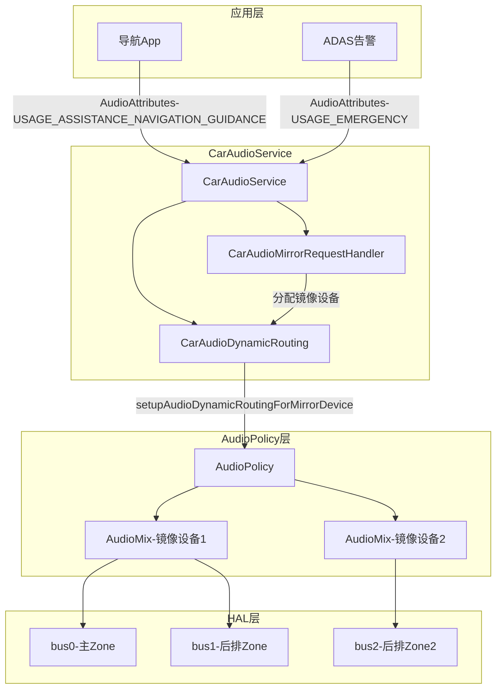
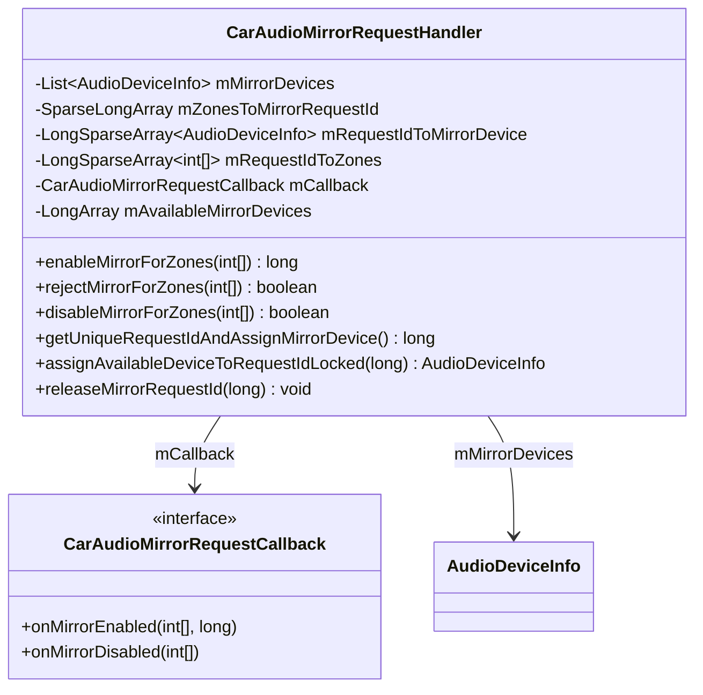
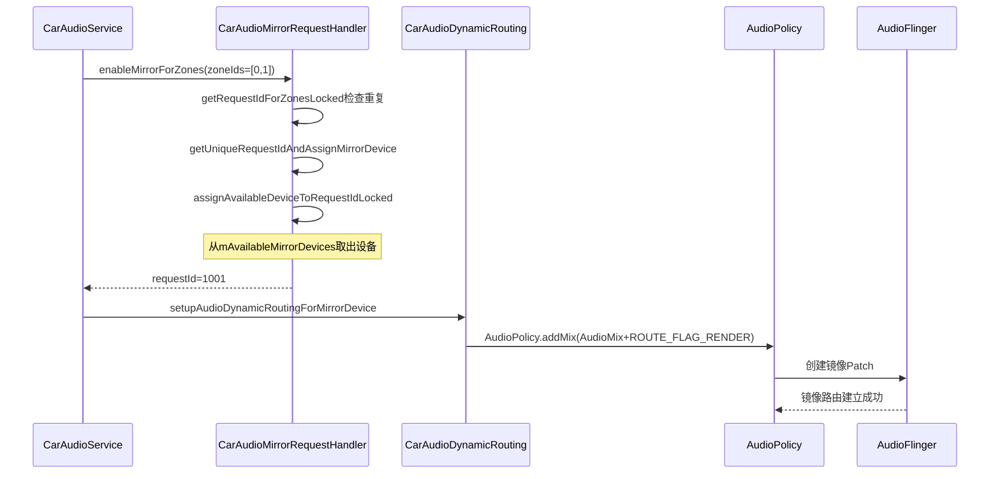
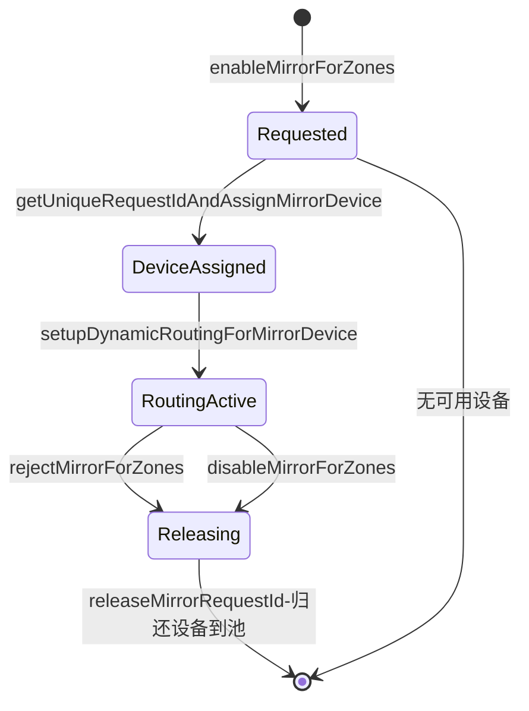
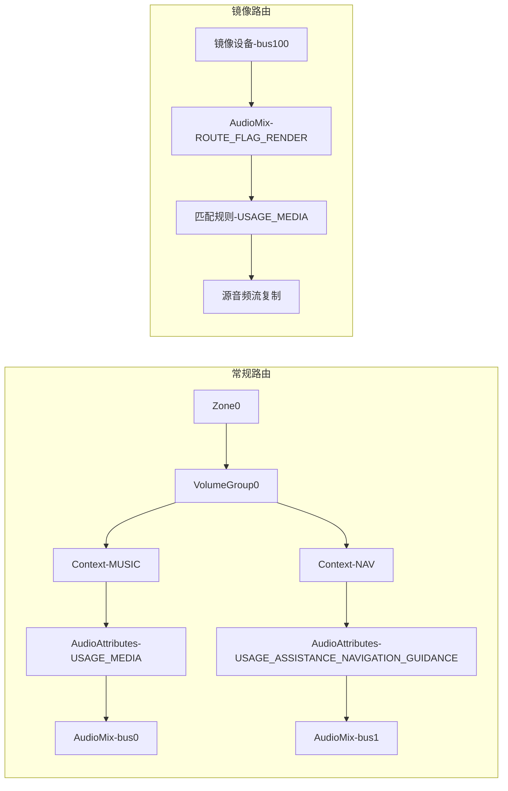
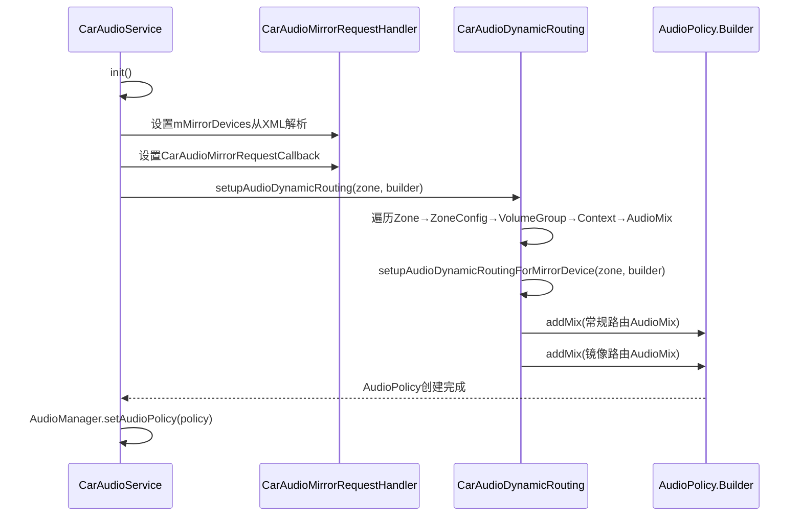
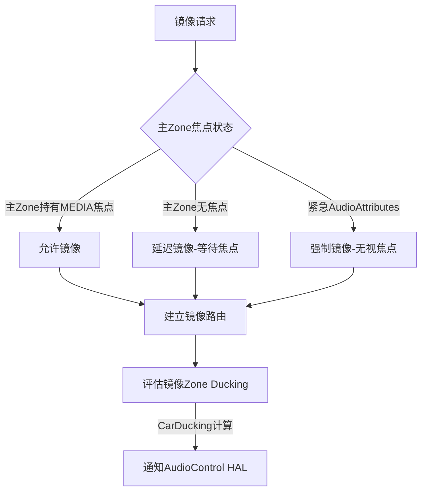
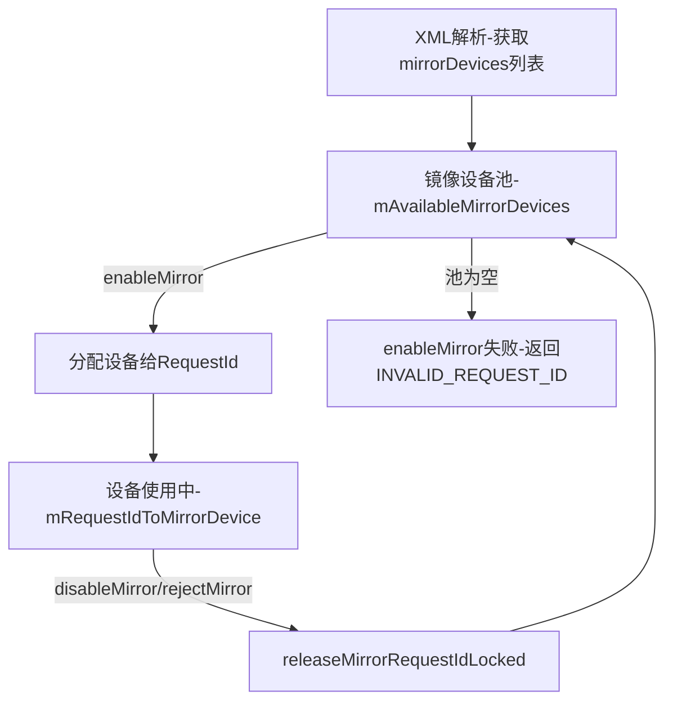

## 9.7 Audio Mirroring — 音频镜像机制

> [← 上一个](09_9.6_CarAudioContext-车载音频上下文深度解析.md) | [返回目录](README.md) | [下一个 →](09_9.8_AAOS多Zone全栈调用链.md)

---

### 9.7.1 音频镜像概述

Audio Mirroring是AAOS14引入的关键特性，允许将**同一音频流同时输出到多个Zone的设备**，实现多区域同步播放相同内容。与传统的音频焦点独占模式不同，镜像机制通过`AudioMix`路由规则在框架层复制音频流，而非要求App多次播放。

**核心设计目标：**
- 主驾导航提示同时镜像到后排娱乐屏
- 紧急报警（如ADAS告警）镜像到所有Zone
- 无需App感知多Zone，框架层自动完成流复制

**与普通多Zone播放的区别：**

| 维度 | 普通多Zone播放 | Audio Mirroring |
|------|---------------|-----------------|
| 音频源 | 每个Zone独立播放 | 单一音频流复制到多Zone |
| App感知 | App需为每个Zone创建Player | App无感知，框架层复制 |
| 音频焦点 | 各Zone独立焦点 | 主Zone持有焦点，镜像Zone共享 |
| 延迟 | 各Zone延迟独立 | 同一音频流，延迟接近 |
| 适用场景 | 不同乘客各自听不同内容 | 同一内容需多Zone同步 |

### 9.7.2 镜像架构总览



### 9.7.3 镜像请求管理 — CarAudioMirrorRequestHandler

[`CarAudioMirrorRequestHandler`](packages/services/Car/service/src/com/android/car/audio/CarAudioMirrorRequestHandler.java)是镜像请求的核心管理器，负责镜像设备分配、Zone→RequestId映射、请求生命周期管理。

#### 9.7.3.1 类结构与数据结构



**核心数据结构详解：**

| 字段 | 类型 | 用途 |
|------|------|------|
| `mMirrorDevices` | `List<AudioDeviceInfo>` | 系统中可用于镜像的设备列表，来自XML配置的mirrorDevice标签 |
| `mZonesToMirrorRequestId` | `SparseLongArray` | Zone组合→RequestId映射，key为zoneId哈希，value为唯一请求ID |
| `mRequestIdToMirrorDevice` | `LongSparseArray<AudioDeviceInfo>` | 请求ID→分配的镜像设备映射 |
| `mRequestIdToZones` | `LongSparseArray<int[]>` | 请求ID→参与镜像的Zone ID数组 |
| `mAvailableMirrorDevices` | `LongArray` | 当前可用的镜像设备地址索引 |

#### 9.7.3.2 镜像启用流程 — enableMirrorForZones

```java
// CarAudioMirrorRequestHandler.java:133
long enableMirrorForZones(int[] zoneIds) {
    synchronized (mLock) {
        // 1. 检查zones是否已有活跃的镜像请求
        long requestId = getRequestIdForZonesLocked(zoneIds);
        if (requestId != INVALID_REQUEST_ID) {
            Slogf.w(TAG, "Mirror already enabled for zones "
                    + Arrays.toString(zoneIds) + " with request id " + requestId);
            return requestId;
        }
        // 2. 生成唯一请求ID并分配镜像设备
        requestId = getUniqueRequestIdAndAssignMirrorDevice();
        if (requestId == INVALID_REQUEST_ID) {
            Slogf.e(TAG, "Failed to assign mirror device for zones "
                    + Arrays.toString(zoneIds));
            return INVALID_REQUEST_ID;
        }
        // 3. 建立映射关系
        mRequestIdToZones.put(requestId, zoneIds);
        for (int zoneId : zoneIds) {
            mZonesToMirrorRequestId.put(zoneId, requestId);
        }
        // 4. 通知回调
        if (mCallback != null) {
            mCallback.onMirrorEnabled(zoneIds, requestId);
        }
        return requestId;
    }
}
```

**镜像启用时序：**



#### 9.7.3.3 镜像设备分配 — getUniqueRequestIdAndAssignMirrorDevice

```java
// CarAudioMirrorRequestHandler.java:255
private long getUniqueRequestIdAndAssignMirrorDevice() {
    long requestId = INVALID_REQUEST_ID;
    synchronized (mLock) {
        // 1. 生成唯一请求ID（原子递增）
        requestId = mIdGenerator.getNewId();
        // 2. 尝试分配可用镜像设备
        AudioDeviceInfo device = assignAvailableDeviceToRequestIdLocked(requestId);
        if (device == null) {
            // 没有可用设备，释放requestId
            mIdGenerator.releaseRequestId(requestId);
            return INVALID_REQUEST_ID;
        }
    }
    return requestId;
}

// CarAudioMirrorRequestHandler.java:355
@GuardedBy("mLock")
private AudioDeviceInfo assignAvailableDeviceToRequestIdLocked(long requestId) {
    if (mAvailableMirrorDevices.size() == 0) {
        Slogf.e(TAG, "No available mirror devices");
        return null;
    }
    // 取第一个可用设备地址索引
    long deviceAddressIndex = mAvailableMirrorDevices.get(0);
    mAvailableMirrorDevices.remove(0);
    // 在mMirrorDevices中查找对应设备
    for (AudioDeviceInfo device : mMirrorDevices) {
        if (device.getId() == deviceAddressIndex) {
            mRequestIdToMirrorDevice.put(requestId, device);
            return device;
        }
    }
    return null;
}
```

**设备分配策略：** 采用先进先出（FIFO）策略从`mAvailableMirrorDevices`池中分配，确保镜像设备均匀使用。

#### 9.7.3.4 镜像拒绝与禁用

```java
// CarAudioMirrorRequestHandler.java:178 — 拒绝镜像
boolean rejectMirrorForZones(int[] zoneIds) {
    synchronized (mLock) {
        long requestId = getRequestIdForZonesLocked(zoneIds);
        if (requestId == INVALID_REQUEST_ID) {
            return false;
        }
        releaseMirrorRequestIdLocked(requestId);
        if (mCallback != null) {
            mCallback.onMirrorDisabled(zoneIds);
        }
    }
    return true;
}

// CarAudioMirrorRequestHandler.java:213 — 禁用镜像
boolean disableMirrorForZones(int[] zoneIds) {
    synchronized (mLock) {
        long requestId = getRequestIdForZonesLocked(zoneIds);
        if (requestId == INVALID_REQUEST_ID) {
            return false;
        }
        releaseMirrorRequestIdLocked(requestId);
        for (int zoneId : zoneIds) {
            mZonesToMirrorRequestId.delete(zoneId);
        }
        mRequestIdToZones.delete(requestId);
        if (mCallback != null) {
            mCallback.onMirrorDisabled(zoneIds);
        }
    }
    return true;
}
```

**镜像请求生命周期：**



### 9.7.4 镜像动态路由 — CarAudioDynamicRouting

[`CarAudioDynamicRouting`](packages/services/Car/service/src/com/android/car/audio/CarAudioDynamicRouting.java)是纯静态工具类，负责将镜像设备转换为`AudioMix`路由规则并注册到AudioPolicy。

#### 9.7.4.1 镜像路由构建 — setupAudioDynamicRoutingForMirrorDevice

```java
// CarAudioDynamicRouting.java:131
static void setupAudioDynamicRoutingForMirrorDevice(
        CarAudioZone zone, AudioPolicy.Builder builder) {
    List<AudioDeviceInfo> mirrorDevices =
            zone.getCurrentAudioDeviceInfosSupportingDynamicMix();
    for (int index = 0; index < mirrorDevices.size(); index++) {
        AudioDeviceInfo info = mirrorDevices.get(index);
        // 镜像设备仅匹配USAGE_MEDIA
        AudioAttributes attributes = new AudioAttributes.Builder()
                .setUsage(AudioAttributes.USAGE_MEDIA)
                .build();
        AudioMixingRule rule = new AudioMixingRule.Builder()
                .addRule(attributes, AudioMixingRule.RULE_MATCH_ATTRIBUTE_USAGE)
                .build();
        AudioMix mix = new AudioMix.Builder(rule)
                .setDevice(info)
                .setFormat(sAudioMixFormat)  // PCM_16BIT, 48000Hz, STEREO
                .setRouteFlags(AudioMix.ROUTE_FLAG_RENDER)
                .build();
        builder.addMix(mix);
    }
}
```

**关键设计决策：**
- 镜像设备仅匹配`USAGE_MEDIA`，确保只有媒体类音频被镜像
- 使用`ROUTE_FLAG_RENDER`标志，使AudioPolicy在指定设备上渲染音频
- 固定格式：PCM 16bit / 48kHz / Stereo，与CarAudioDeviceInfo默认配置一致

#### 9.7.4.2 常规动态路由与镜像路由的对比



### 9.7.5 CarAudioService中的镜像集成

[`CarAudioService`](packages/services/Car/service/src/com/android/car/audio/CarAudioService.java)是镜像机制的调用入口，在关键生命周期中触发镜像操作。

#### 9.7.5.1 初始化阶段



#### 9.7.5.2 CarAudioMirrorRequestCallback实现

`CarAudioService`实现了`CarAudioMirrorRequestCallback`接口，当镜像状态变化时触发路由重建：

```java
// CarAudioService中的回调逻辑
class CarAudioMirrorRequestCallbackImpl implements CarAudioMirrorRequestCallback {
    @Override
    public void onMirrorEnabled(int[] zoneIds, long requestId) {
        // 镜像启用后，需要重建AudioPolicy以包含新的镜像路由
        setupDynamicRouting();
    }
    @Override
    public void onMirrorDisabled(int[] zoneIds) {
        // 镜像禁用后，同样需要重建AudioPolicy移除镜像路由
        setupDynamicRouting();
    }
}
```

### 9.7.6 镜像与焦点协同

镜像机制与音频焦点系统存在协同关系：



**协同要点：**
1. 镜像请求不影响焦点分配，焦点仍由`CarAudioFocus`独立管理
2. 镜像路由建立后，镜像Zone的Ducking由`CarDucking`统一计算
3. 紧急音频（如ADAS告警）镜像时，可绕过常规焦点评估

### 9.7.7 镜像设备池管理

镜像设备是有限资源，系统通过设备池管理分配与回收：



**设备池容量：** 镜像设备数量由`car_audio_configuration.xml`中`<mirrorDevice>`标签决定，通常为2-4个。超出容量时新请求会被拒绝。

### 9.7.8 XML配置示例

```xml
<!-- car_audio_configuration.xml V3 镜像配置 -->
<audioZoneConfiguration version="3">
    <zones>
        <zone name="primary zone" isPrimary="true">
            <zoneConfigs>
                <zoneConfig name="primary config" isDefault="true">
                    <volumeGroups>
                        <group>
                            <device address="bus0_media_out">
                                <context context="music"/>
                            </device>
                        </group>
                    </volumeGroups>
                </zoneConfig>
            </zoneConfigs>
        </zone>
        <zone name="rear zone" occupantZoneId="1">
            <zoneConfigs>
                <zoneConfig name="rear config" isDefault="true">
                    <volumeGroups>
                        <group>
                            <device address="bus1_media_out">
                                <context context="music"/>
                            </device>
                        </group>
                    </volumeGroups>
                </zoneConfig>
            </zoneConfigs>
        </zone>
    </zones>
    <!-- 镜像设备配置 -->
    <mirrorDevices>
        <mirrorDevice address="bus100_mirror_out"/>
        <mirrorDevice address="bus101_mirror_out"/>
    </mirrorDevices>
</audioZoneConfiguration>
```

### 9.7.9 API接口

```java
// CarAudioManager.java 公开API
// 启用镜像
public long enableMirrorForZones(int[] zoneIds)
// 禁用镜像
public boolean disableMirrorForZones(int[] zoneIds)
// 拒绝镜像
public boolean rejectMirrorForZones(int[] zoneIds)
```

**调用约束：**
- `enableMirrorForZones`需要`CAR_AUDIO_PERMISSION`权限
- 重复启用同一Zone组合返回已有requestId
- 镜像设备池耗尽时返回`INVALID_REQUEST_ID`

### 9.7.10 调试与Dump

```bash
# dumpsys car_service 查看镜像状态
adb shell dumpsys car_service | grep -A 30 "Mirror"

# 输出示例:
# Mirror request handler:
#   Available mirror devices[2]:
#     Device[0]: bus100_mirror_out
#     Device[1]: bus101_mirror_out
#   Zones to request id:
#     zoneId=0 -> requestId=1001
#     zoneId=1 -> requestId=1001
#   Request id to mirror device:
#     requestId=1001 -> bus100_mirror_out
```

### 9.7.11 镜像 vs 多Zone播放决策矩阵

| 场景 | 推荐方案 | 原因 |
|------|---------|------|
| 导航提示全车同步 | Audio Mirroring | 需要同一流，延迟一致性 |
| 后排各自听音乐 | 多Zone独立播放 | 不同内容，无需镜像 |
| ADAS告警全车通知 | Audio Mirroring | 紧急性，需全Zone覆盖 |
| 电话铃声同步 | Audio Mirroring + 焦点抢占 | 需要同步且中断当前播放 |
| 语音助手单Zone响应 | 多Zone独立播放 | 仅需主Zone响应 |

---