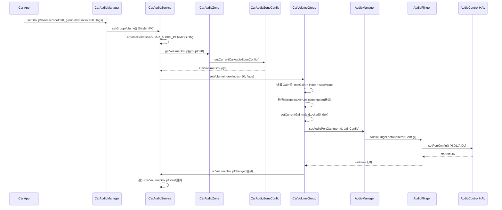
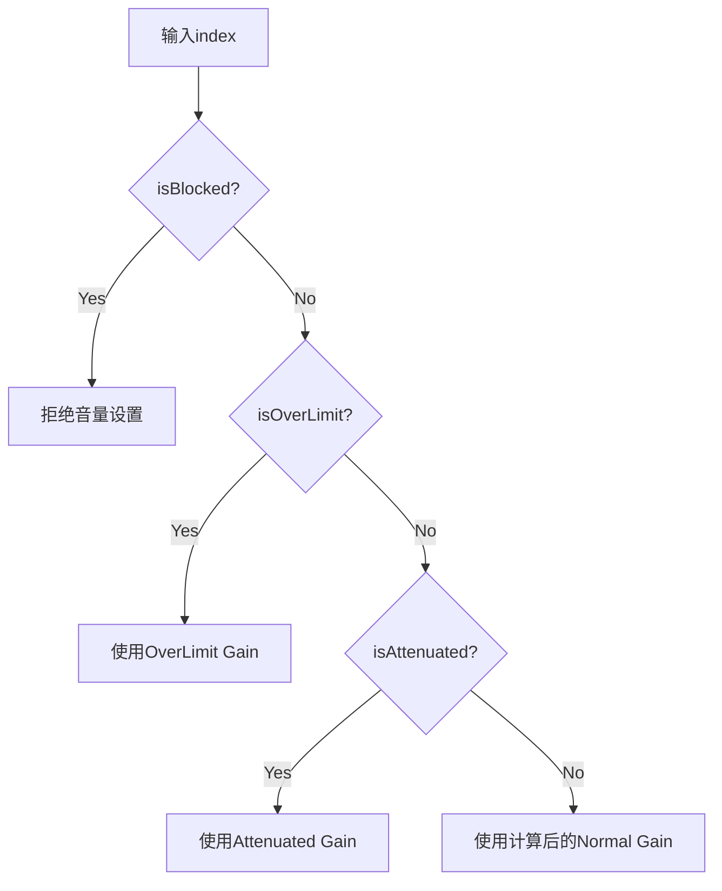
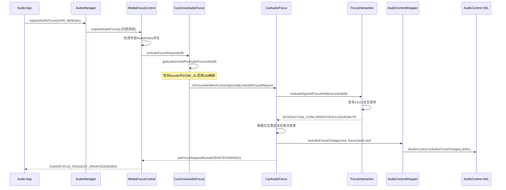
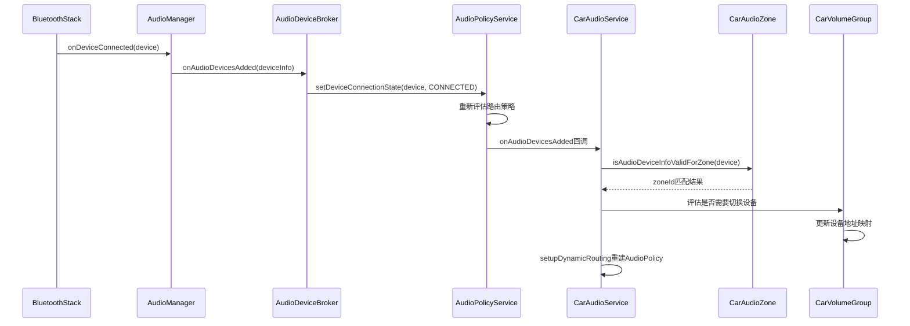
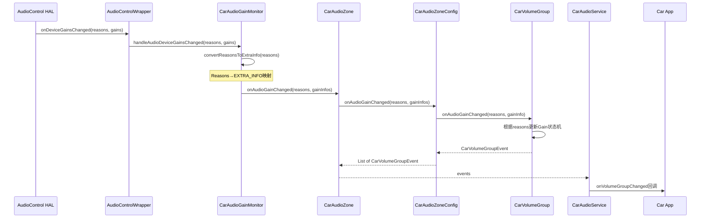
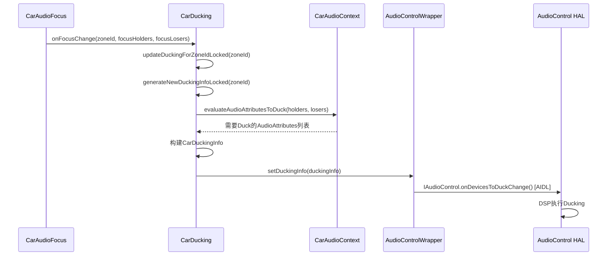
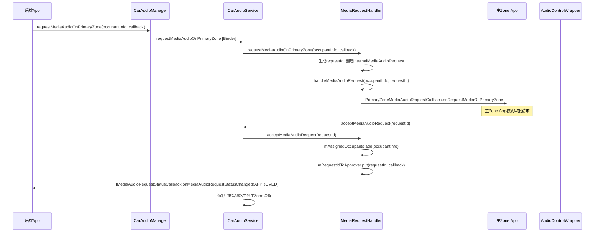
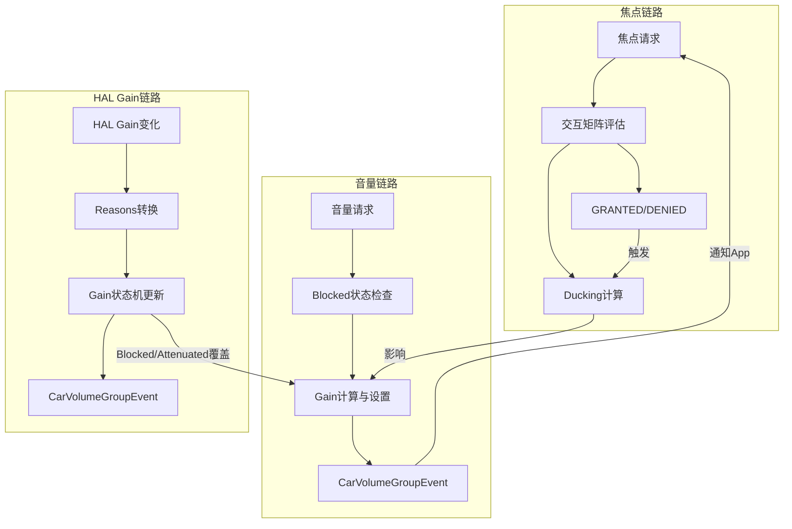

## 9.8 AAOS多Zone全栈调用链

> [← 上一个](09_9.7_Audio_Mirroring-音频镜像.md) | [返回目录](README.md) | [下一个 →](09_9.9_CarAudioZoneConfig-Zone配置管理.md)

---

### 9.8.1 全栈调用链概述

AAOS多Zone音频系统涉及从App层到HAL层的完整调用链路。本章将深入解析三条核心调用链：**音量调节链路**、**焦点请求链路**、**设备切换链路**，从方法调用级别追踪每一步数据流向。

### 9.8.2 音量调节全栈调用链

#### 9.8.2.1 音量调节时序图



#### 9.8.2.2 音量调节关键方法解析

**CarAudioService.setGroupVolume()**

```java
// CarAudioService.java
@Override
public void setGroupVolume(int zoneId, int groupId, int index, int flags) {
    // 1. 权限检查
    enforcePermission(Car.PERMISSION_CAR_AUDIO_VOLUME);
    // 2. 获取目标Zone的VolumeGroup
    CarVolumeGroup group = getCarVolumeGroup(zoneId, groupId);
    // 3. 检查音量是否被Blocked
    if (group.isBlocked()) {
        Slogf.w(TAG, "Volume group " + groupId + " is blocked");
        return;
    }
    // 4. 设置音量索引
    group.setVolumeIndex(index, flags);
    // 5. 持久化到Settings
    saveVolumeGroupSettingsLocked(zoneId, groupId, index);
}
```

**CarVolumeGroup.setVolumeIndex() Gain计算核心**

```java
// CarVolumeGroup.java
void setVolumeIndex(int index, int flags) {
    synchronized (mLock) {
        // 1. 范围限制
        index = Math.max(0, Math.min(index, getMaxGainIndex()));
        // 2. 计算Gain (millibels)
        int gainInMillibels = getMinGain() + index * getStepValue();
        // 3. 四层状态机检查
        if (isBlockedLocked()) return;          // Blocked优先级最高
        if (isOverLimitLocked()) gainInMillibels = mOverLimitGain; // OverLimit覆盖
        if (isAttenuatedLocked()) gainInMillibels = mAttenuatedGain; // Attenuated覆盖
        // 4. 设置到HAL
        mCurrentGainIndex = index;
        setDeviceGainGainLocked(gainInMillibels);
        // 5. 事件通知
        notifyVolumeGroupChangeLocked(flags);
    }
}
```

**Gain四层状态机优先级：**



### 9.8.3 焦点请求全栈调用链

#### 9.8.3.1 焦点请求时序图



#### 9.8.3.2 Zone ID确定逻辑

```java
// CarZonesAudioFocus.java:211
public void onAudioFocusRequest(AudioFocusInfo afi) {
    // 确定焦点请求所属Zone
    int zoneId = getAudioZoneIdForAudioFocusInfo(afi);
    CarAudioFocus focusHandler = mFocusHandlersForZones.get(zoneId);
    if (focusHandler != null) {
        focusHandler.onAudioFocusRequest(afi);
    }
}

// Zone ID确定优先级
private int getAudioZoneIdForAudioFocusInfo(AudioFocusInfo afi) {
    // 1. 优先从Bundle中获取显式Zone ID
    Bundle bundle = afi.getAttributes().getBundle();
    if (bundle != null && bundle.containsKey(
            CarAudioManager.AUDIOFOCUS_EXTRA_REQUEST_ZONE_ID)) {
        return bundle.getInt(CarAudioManager.AUDIOFOCUS_EXTRA_REQUEST_ZONE_ID);
    }
    // 2. 通过UID到Zone的映射确定
    return mCarAudioService.getZoneIdForUid(afi.getUid());
}
```

#### 9.8.3.3 交互矩阵评估

```java
// FocusInteraction.java — 13x13交互矩阵
int evaluateAgainstFocusHoldersLocked(AudioFocusInfo afi) {
    int requestContext = mCarAudioContext.getContextForAttributes(
            afi.getAttributes());
    for (AudioFocusInfo holder : mFocusHolders) {
        int holderContext = mCarAudioContext.getContextForAttributes(
                holder.getAttributes());
        // 查询交互矩阵
        int interaction = sInteractionMatrix[requestContext][holderContext];
        switch (interaction) {
            case INTERACTION_CONCURRENT:
                // 允许共存，不做处理
                break;
            case INTERACTION_EXCLUSIVE:
                // 需要独占，失去焦点的Holder收到LOSS
                notifyFocusLoss(holder);
                break;
            case INTERACTION_MUTE:
                // Mute而非Loss，保持焦点但静音
                notifyFocusMute(holder);
                break;
        }
    }
}
```

### 9.8.4 CarAudioFocus三层执行机制

AAOS焦点系统存在三层执行机制，分别在不同层面确保音频行为正确：

```mermaid
flowchart TB
    subgraph layer1[第一层: 框架主动执行]
        PROP[propagateFocusLossFromGain_syncAf] --> DUCKCHECK{Loss类型判断}
        DUCKCHECK -->|LOSS_TRANSIENT_CAN_DUCK| DUCKEXEC[PlaybackActivityMonitor.duckPlayers]
        DUCKCHECK -->|LOSS| FADEEXEC[FadeOutManager.fadeOutPlayers]
    end
    subgraph layer2[第二层: App回调通知]
        PROP2[propagateFocusLossFromGain_syncAf] --> DISPATCH[FocusRequester.handleFocusLoss]
        DISPATCH --> IPC[IAudioFocusDispatcher.dispatchAudioFocusChange]
        IPC --> APPCB[App.onAudioFocusChange回调]
    end
    subgraph layer3[第三层: AAOS路径]
        PROP3[propagateFocusLossFromGain_syncAf] --> EXTPOL[mFocusPolicy外部策略]
        EXTPOL --> CZAF[CarZonesAudioFocus分发]
        CZAF --> CAF[CarAudioFocus评估]
        CAF --> ACW[AudioControlWrapper]
        ACW --> DSP[AudioControl HAL-DSP执行Ducking/Muting]
    end
```



**三层机制对比：**

| 层级 | 执行方 | 延迟 | 适用场景 | 限制 |
|------|--------|------|---------|------|
| 第一层 | AudioPolicyService | 最低(~5ms) | Duck/Fade，框架层直接操作流 | 仅限当前进程 |
| 第二层 | App进程 | 中等(~50ms) | App主动降低音量或暂停 | 依赖App合规实现 |
| 第三层 | AudioControl HAL | 可变 | AAOS专用，DSP级Ducking/Muting | 需HAL实现支持 |

### 9.8.5 设备切换全栈调用链

当蓝牙设备连接/断开时，音频路由会自动切换：



### 9.8.6 HAL Gain变化全栈调用链

当HAL层报告Gain变化（如外部放大器调整）时：



**Gain Reasons到EXTRA_INFO映射：**

| HAL Reason | CarVolumeGroupEvent EXTRA_INFO | 含义 |
|-----------|-------------------------------|------|
| REASON_MUTE | EXTRA_INFO_VOLUME_INDEX_CHANGED_BY_AUDIO_SYSTEM | 静音变化 |
| REASON_DUCK | EXTRA_INFO_VOLUME_INDEX_CHANGED_BY_AUDIO_SYSTEM | Duck变化 |
| REASON_VOLUME | EXTRA_INFO_VOLUME_INDEX_CHANGED_BY_AUDIO_SYSTEM | 音量变化 |
| REASON_THERMAL | EXTRA_INFO_VOLUME_INDEX_CHANGED_BY_AUDIO_SYSTEM | 热保护 |
| REASON_BLOCKED | EXTRA_INFO_VOLUME_INDEX_CHANGED_BY_AUDIO_SYSTEM | 被阻止 |

### 9.8.7 Ducking执行全栈调用链

当焦点变化触发Ducking时：



### 9.8.8 媒体请求全栈调用链

后排Zone请求在主Zone播放媒体音频：



### 9.8.9 跨链路交互关系

AAOS音频系统的三条核心链路并非孤立运行，存在复杂的交互关系：



**交互要点：**
1. 焦点评估结果决定Ducking状态 → Ducking影响音量Gain
2. HAL Gain状态机(Blocked/OverLimit/Attenuated)覆盖音量设置
3. 音量变化事件可触发焦点重新评估
4. 三条链路通过`CarAudioService`协调统一

---