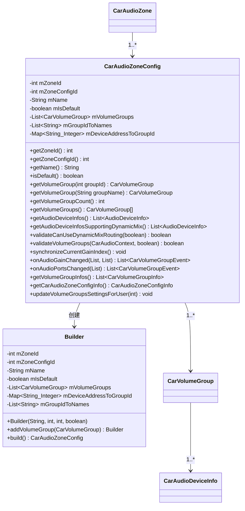
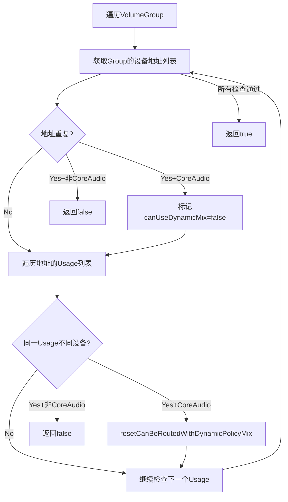
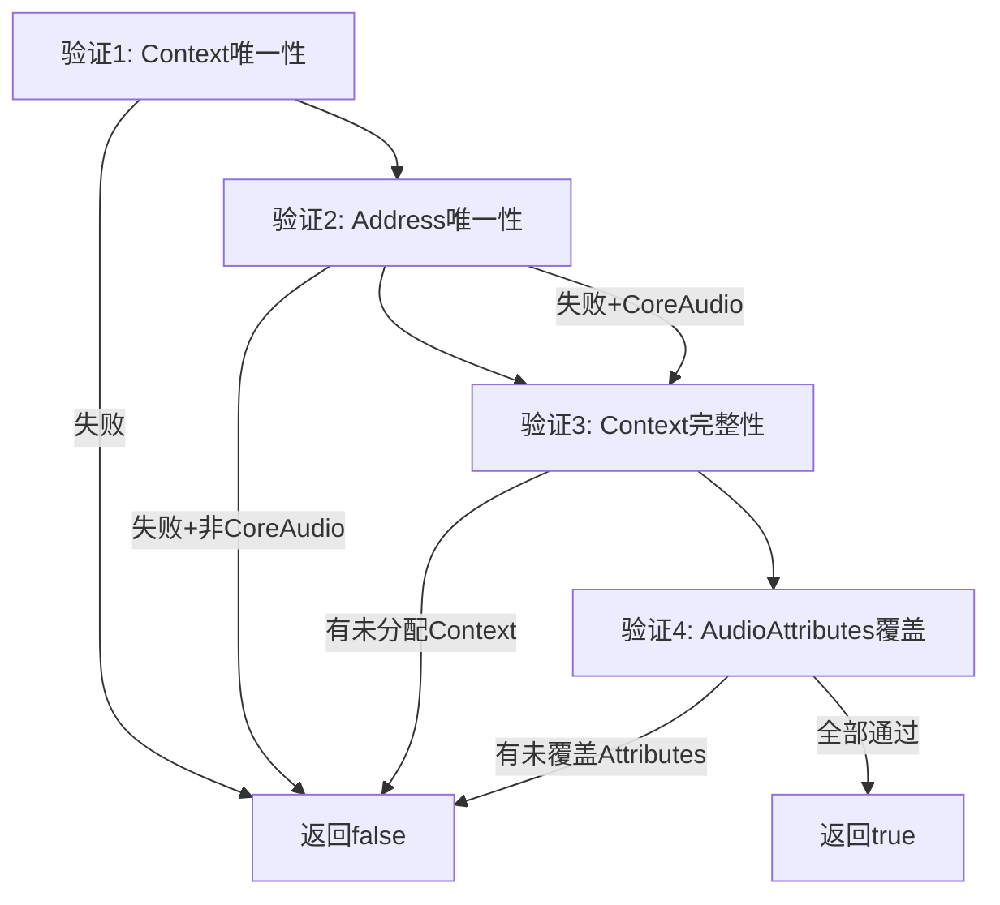
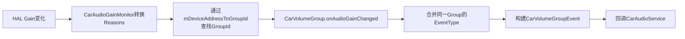
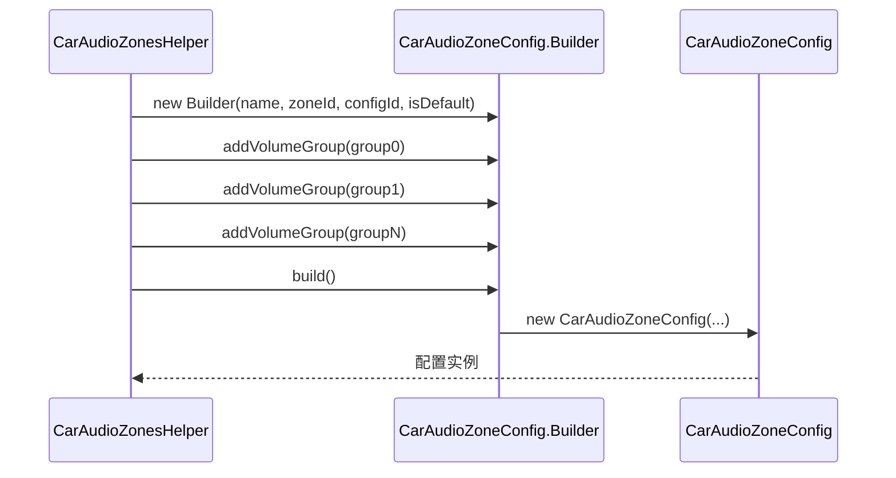
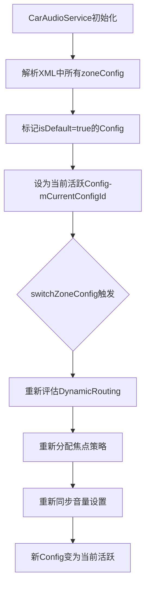
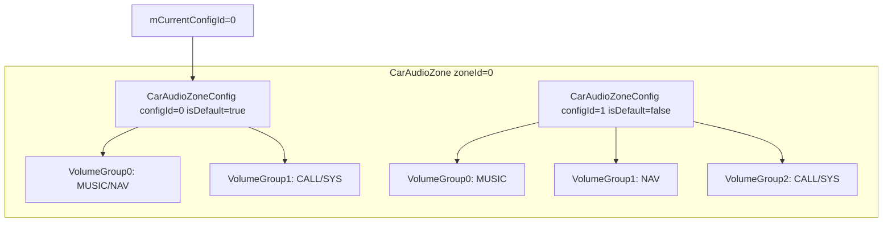

## 9.9 CarAudioZoneConfig — Zone配置管理

> [← 上一个](09_9.8_AAOS多Zone全栈调用链.md) | [返回目录](README.md) | [下一个 →](09_9.10_CarZonesAudioFocus-多Zone焦点分发器.md)

---

### 9.9.1 模块概述

[`CarAudioZoneConfig`](packages/services/Car/service/src/com/android/car/audio/CarAudioZoneConfig.java)封装单个Zone的音频配置，是`CarAudioZone`的核心组成部分。一个Zone可以拥有多个Config（如默认配置和备用配置），支持运行时切换。每个Config包含`CarVolumeGroup`列表、设备地址到GroupId的映射、以及Dynamic Mix路由验证逻辑。

**设计理念：** AAOS14引入多Config机制，允许同一Zone在不同场景下使用不同的音量组配置。例如：普通模式使用默认Config，后排乘客入睡时切换到静音Config。

### 9.9.2 类结构



### 9.9.3 核心数据结构

| 字段 | 类型 | 用途 | 初始化时机 |
|------|------|------|-----------|
| `mZoneId` | `int` | 所属Zone ID | Builder构造时 |
| `mZoneConfigId` | `int` | 配置唯一ID | Builder构造时 |
| `mName` | `String` | 配置名称 | Builder构造时 |
| `mIsDefault` | `boolean` | 是否为默认配置 | Builder构造时 |
| `mVolumeGroups` | `List<CarVolumeGroup>` | 音量组列表 | `addVolumeGroup()` |
| `mGroupIdToNames` | `List<String>` | GroupId→名称映射 | `addVolumeGroup()` |
| `mDeviceAddressToGroupId` | `Map<String, Integer>` | 设备地址→GroupId映射 | `addGroupAddressesToMap()` |

**mDeviceAddressToGroupId构建过程：**

```java
// CarAudioZoneConfig.Builder:445
private void addGroupAddressesToMap(List<String> addresses, int groupId) {
    for (int index = 0; index < addresses.size(); index++) {
        mDeviceAddressToGroupId.put(addresses.get(index), groupId);
    }
}
```

每个VolumeGroup的所有设备地址都会映射到该Group的ID，用于快速从设备地址查找所属Group。

### 9.9.4 Dynamic Mix路由验证

#### 9.9.4.1 validateCanUseDynamicMixRouting详解

[`validateCanUseDynamicMixRouting()`](packages/services/Car/service/src/com/android/car/audio/CarAudioZoneConfig.java:159)验证两个关键约束，确保AudioPolicy Dynamic Mix规则不会冲突：

```java
// CarAudioZoneConfig.java:159
boolean validateCanUseDynamicMixRouting(boolean useCoreAudioRouting) {
    ArraySet<String> addresses = new ArraySet<>();
    SparseArray<CarAudioDeviceInfo> usageToDevice = new SparseArray<>();

    for (int index = 0; index < mVolumeGroups.size(); index++) {
        CarVolumeGroup group = mVolumeGroups.get(index);
        List<String> groupAddresses = group.getAddresses();

        for (int addressIndex = 0; addressIndex < groupAddresses.size(); addressIndex++) {
            String address = groupAddresses.get(addressIndex);
            boolean canUseDynamicMixRoutingForAddress = true;
            CarAudioDeviceInfo info = group.getCarAudioDeviceInfoForAddress(address);
            List<Integer> usagesForAddress = group.getAllSupportedUsagesForAddress(address);

            // 约束1: 同一地址不应出现在两个VolumeGroup中
            if (!addresses.add(address)) {
                if (useCoreAudioRouting) {
                    Slogf.w(CarLog.TAG_AUDIO, "Address %s appears in two groups", address);
                    canUseDynamicMixRoutingForAddress = false;
                }
            }

            // 约束2: 同一usage不应路由到两个不同设备
            for (int usageIndex = 0; usageIndex < usagesForAddress.size(); usageIndex++) {
                int usage = usagesForAddress.get(usageIndex);
                CarAudioDeviceInfo infoForAttr = usageToDevice.get(usage);
                if (infoForAttr != null && !infoForAttr.getAddress().equals(address)) {
                    Slogf.e(CarLog.TAG_AUDIO, "Addresses %s and %s with same usage %s",
                            infoForAttr.getAddress(), address,
                            AudioManagerHelper.usageToXsdString(usage));
                    if (useCoreAudioRouting) {
                        // Core Audio模式下标记设备不可用Dynamic Mix
                        canUseDynamicMixRoutingForAddress = false;
                        infoForAttr.resetCanBeRoutedWithDynamicPolicyMix();
                    } else {
                        // 非Core Audio模式下直接返回false
                        return false;
                    }
                } else {
                    usageToDevice.put(usage, info);
                }
            }
            if (!canUseDynamicMixRoutingForAddress) {
                info.resetCanBeRoutedWithDynamicPolicyMix();
            }
        }
    }
    return true;
}
```

**验证流程图：**



**约束1解析：** AudioPolicy无法为同一设备地址建立多条Dynamic Mix路由规则。如果地址"bus0"同时出现在Group0和Group1中，AudioPolicy无法确定该地址属于哪个Group的路由规则。

**约束2解析：** Dynamic Mix仅支持Usage级别匹配（不支持其他AudioAttributes字段）。如果`USAGE_MEDIA`同时路由到"bus0"和"bus1"，AudioPolicy无法确定匹配规则应该路由到哪个设备。

#### 9.9.4.2 Core Audio与非Core Audio模式差异

| 模式 | 约束冲突时行为 | 适用场景 |
|------|--------------|---------|
| 非Core Audio (`useCoreAudioRouting=false`) | 直接返回`false`，拒绝整个配置 | 传统AAOS路由模式 |
| Core Audio (`useCoreAudioRouting=true`) | 标记冲突设备`resetCanBeRoutedWithDynamicPolicyMix()`，让Core Audio兜底 | AAOS14新路由模式 |

Core Audio模式下，冲突设备不会参与Dynamic Mix路由，而是交给`AudioProductStrategy`路由。

### 9.9.5 VolumeGroup验证 — validateVolumeGroups

```java
// CarAudioZoneConfig.java:228
boolean validateVolumeGroups(CarAudioContext carAudioContext, boolean useCoreAudioRouting) {
    ArraySet<Integer> contexts = new ArraySet<>();
    ArraySet<String> addresses = new ArraySet<>();

    for (int index = 0; index < mVolumeGroups.size(); index++) {
        CarVolumeGroup group = mVolumeGroups.get(index);
        // 验证1: 一个Context不应出现在两个Group中
        int[] groupContexts = group.getContexts();
        for (int groupIndex = 0; groupIndex < groupContexts.length; groupIndex++) {
            int contextId = groupContexts[groupIndex];
            if (!contexts.add(contextId)) {
                Slogf.e(CarLog.TAG_AUDIO, "Context %d appears in two groups", contextId);
                return false;
            }
        }
        // 验证2: 一个地址不应出现在两个Group中（Core Audio模式允许）
        List<String> groupAddresses = group.getAddresses();
        for (int addressIndex = 0; addressIndex < groupAddresses.size(); addressIndex++) {
            String address = groupAddresses.get(addressIndex);
            if (!addresses.add(address)) {
                if (useCoreAudioRouting) continue; // Core Audio允许
                Slogf.w(CarLog.TAG_AUDIO, "Address appears in two groups: " + address);
                return false;
            }
        }
    }
    // 验证3: 所有Context都必须分配到Group
    List<Integer> allContexts = carAudioContext.getAllContextsIds();
    for (int index = 0; index < allContexts.size(); index++) {
        if (!contexts.contains(allContexts.get(index))) {
            Slogf.e(CarLog.TAG_AUDIO, "Audio context %s is not assigned to a group",
                    carAudioContext.toString(allContexts.get(index)));
            return false;
        }
    }
    // 验证4: 所有AudioAttributes都有对应的Context
    List<Integer> contextList = new ArrayList<>(contexts);
    if (!carAudioContext.validateAllAudioAttributesSupported(contextList)) {
        Slogf.e(CarLog.TAG_AUDIO, "Some audio attributes are not assigned to a group");
        return false;
    }
    return true;
}
```

**四项验证要点：**



### 9.9.6 HAL Gain变化处理 — onAudioGainChanged

```java
// CarAudioZoneConfig.java:314
List<CarVolumeGroupEvent> onAudioGainChanged(List<Integer> halReasons,
        List<CarAudioGainConfigInfo> gainInfos) {
    SparseIntArray groupIdsToEventType = new SparseIntArray();
    List<Integer> extraInfos = CarAudioGainMonitor.convertReasonsToExtraInfo(halReasons);

    // 遍历所有Gain变化信息
    for (int index = 0; index < gainInfos.size(); index++) {
        CarAudioGainConfigInfo gainInfo = gainInfos.get(index);
        // 通过设备地址查找所属GroupId
        int groupId = mDeviceAddressToGroupId.getOrDefault(
                gainInfo.getDeviceAddress(), INVALID_GROUP_ID);
        if (groupId == INVALID_GROUP_ID) continue;

        // 通知VolumeGroup处理Gain变化
        int eventType = mVolumeGroups.get(groupId).onAudioGainChanged(halReasons, gainInfo);
        if (eventType == INVALID_EVENT_TYPE) continue;

        // 合并同一Group的多个事件类型
        if (groupIdsToEventType.get(groupId, INVALID_GROUP_ID) != INVALID_GROUP_ID) {
            eventType |= groupIdsToEventType.get(groupId);
        }
        groupIdsToEventType.put(groupId, eventType);
    }

    // 生成CarVolumeGroupEvent列表
    List<CarVolumeGroupEvent> events = new ArrayList<>(groupIdsToEventType.size());
    for (int index = 0; index < groupIdsToEventType.size(); index++) {
        CarVolumeGroupEvent.Builder eventBuilder = new CarVolumeGroupEvent.Builder(
                List.of(mVolumeGroups.get(groupIdsToEventType.keyAt(index))
                        .getCarVolumeGroupInfo()),
                groupIdsToEventType.valueAt(index));
        if (!extraInfos.isEmpty()) {
            eventBuilder.setExtraInfos(extraInfos);
        }
        events.add(eventBuilder.build());
    }
    return events;
}
```

**Gain变化处理流程：**



### 9.9.7 Audio Port变化处理 — onAudioPortsChanged

```java
// CarAudioZoneConfig.java:378
List<CarVolumeGroupEvent> onAudioPortsChanged(List<HalAudioDeviceInfo> deviceInfos) {
    List<CarVolumeGroupEvent> events = new ArrayList<>();
    ArraySet<Integer> updatedGroupIds = new ArraySet<>();

    // 更新CarAudioDeviceInfo
    for (int index = 0; index < deviceInfos.size(); index++) {
        HalAudioDeviceInfo deviceInfo = deviceInfos.get(index);
        int groupId = mDeviceAddressToGroupId.getOrDefault(
                deviceInfo.getAddress(), INVALID_GROUP_ID);
        if (groupId == INVALID_GROUP_ID) continue;
        mVolumeGroups.get(groupId).updateAudioDeviceInfo(deviceInfo);
        updatedGroupIds.add(groupId);
    }

    // 重新计算Gain阶段
    for (int index = 0; index < updatedGroupIds.size(); index++) {
        CarVolumeGroup group = mVolumeGroups.get(updatedGroupIds.valueAt(index));
        int eventType = group.calculateNewGainStageFromDeviceInfos();
        if (eventType != INVALID_EVENT_TYPE) {
            events.add(new CarVolumeGroupEvent.Builder(
                    List.of(group.getCarVolumeGroupInfo()),
                    eventType,
                    List.of(EXTRA_INFO_VOLUME_INDEX_CHANGED_BY_AUDIO_SYSTEM))
                    .build());
        }
    }
    return events;
}
```

**onAudioPortsChanged vs onAudioGainChanged：**

| 维度 | onAudioGainChanged | onAudioPortsChanged |
|------|-------------------|-------------------|
| 触发源 | HAL Gain值变化 | Audio Port配置变化(如热插拔) |
| 数据源 | `CarAudioGainConfigInfo` | `HalAudioDeviceInfo` |
| 处理逻辑 | 更新Gain状态机 | 更新设备信息+重算Gain阶段 |
| 事件ExtraInfo | 从Reasons转换 | 固定`EXTRA_INFO_VOLUME_INDEX_CHANGED_BY_AUDIO_SYSTEM` |

### 9.9.8 Builder模式

```java
// CarAudioZoneConfig.Builder:409
static final class Builder {
    private final int mZoneId;
    private final int mZoneConfigId;
    private final String mName;
    private final boolean mIsDefault;
    private final List<CarVolumeGroup> mVolumeGroups = new ArrayList<>();
    private final Map<String, Integer> mDeviceAddressToGroupId = new ArrayMap<>();
    private final List<String> mGroupIdToNames = new ArrayList<>();

    Builder(String name, int zoneId, int zoneConfigId, boolean isDefault) {
        mName = Objects.requireNonNull(name, "Car audio zone config name cannot be null");
        mZoneId = zoneId;
        mZoneConfigId = zoneConfigId;
        mIsDefault = isDefault;
    }

    Builder addVolumeGroup(CarVolumeGroup volumeGroup) {
        mVolumeGroups.add(volumeGroup);
        mGroupIdToNames.add(volumeGroup.getName());
        addGroupAddressesToMap(volumeGroup.getAddresses(), volumeGroup.getId());
        return this;
    }

    CarAudioZoneConfig build() {
        return new CarAudioZoneConfig(mName, mZoneId, mZoneConfigId, mIsDefault,
                mVolumeGroups, mDeviceAddressToGroupId, mGroupIdToNames);
    }
}
```

**Builder调用链（由CarAudioZonesHelper在XML解析时触发）：**



### 9.9.9 多配置切换机制



**切换时CarAudioZone的处理：**

```java
// CarAudioZone.java:202
void setCurrentCarZoneConfig(CarAudioZoneConfigInfo configInfoSwitchedTo) {
    synchronized (mLock) {
        mCurrentConfigId = configInfoSwitchedTo.getConfigId();
    }
}

// CarAudioZone.java:93 — 所有操作都委托给当前Config
CarAudioZoneConfig getCurrentCarAudioZoneConfig() {
    synchronized (mLock) {
        return mCarAudioZoneConfigs.get(mCurrentConfigId);
    }
}
```

### 9.9.10 CarAudioZone与CarAudioZoneConfig的关系



**关键设计：**
- `CarAudioZone`通过`mCurrentConfigId`跟踪当前活跃Config
- 所有音量/设备查询都委托给`getCurrentCarAudioZoneConfig()`
- `onAudioGainChanged`和`onAudioPortsChanged`仅在当前Config上触发回调
- 多个Config共享同一`CarAudioContext`实例

### 9.9.11 Dynamic Mix设备查询

```java
// CarAudioZoneConfig.java:123
List<AudioDeviceInfo> getAudioDeviceInfosSupportingDynamicMix() {
    List<AudioDeviceInfo> devices = new ArrayList<>();
    for (int index = 0; index < mVolumeGroups.size(); index++) {
        CarVolumeGroup group = mVolumeGroups.get(index);
        List<String> addresses = group.getAddresses();
        for (int addressIndex = 0; addressIndex < addresses.size(); addressIndex++) {
            String address = addresses.get(addressIndex);
            CarAudioDeviceInfo info = group.getCarAudioDeviceInfoForAddress(address);
            if (info.canBeRoutedWithDynamicPolicyMix()) {
                devices.add(info.getAudioDeviceInfo());
            }
        }
    }
    return devices;
}
```

`canBeRoutedWithDynamicPolicyMix()`标志在`validateCanUseDynamicMixRouting()`期间可能被`resetCanBeRoutedWithDynamicPolicyMix()`重置为`false`，表示该设备存在冲突，不应参与Dynamic Mix路由。

---