# 第十篇：AudioControl HAL

> [← 上一篇：AAOS Car Audio](09_AAOS_Car_Audio.md) | [返回导航](README.md) | [下一篇：Vendor Layer →](11_Vendor_Layer.md)

---

## 10.1 AudioControl HAL总览

### 模块职责
AudioControl HAL是AAOS特有的HAL接口，负责车载焦点通知、音量增益回调、静音控制、模块变更通知等。它是CarAudioService与Vehicle HAL/DSP之间的桥梁。

### 版本演进

| 版本 | 接口类型 | 焦点监听 | 静音 | 增益回调 | 模块变更 |
|------|---------|---------|------|---------|---------|
| V1.0 (HIDL) | `IAudioControl@1.0` | 不支持 | 不支持 | 不支持 | 不支持 |
| V2.0 (HIDL) | `IAudioControl@2.0` | `registerFocusListener` | 不支持 | 不支持 | 不支持 |
| AIDL v1 | `IAudioControl/AIDL` | `IFocusListener` | `setMute` | 不支持 | 不支持 |
| AIDL v2 | `IAudioControl/AIDL` | `IFocusListener` | `setMute` | `IAudioGainCallback` | 不支持 |
| AIDL v3 | `IAudioControl/AIDL` | `IFocusListener` | `setMute` | `IAudioGainCallback` | `IModuleChangeCallback` |

---

## 10.2 核心接口

### IAudioControl (AIDL)

| 方法 | 说明 | 方向 |
|------|------|------|
| `onAudioFocusChange()` | 通知焦点变化 | CarSvc → HAL |
| `registerFocusListener()` | 注册焦点监听 | HAL → CarSvc |
| `setBalanceTowardRight()` | 设置左右平衡 | CarSvc → HAL |
| `setFadeTowardFront()` | 设置前后衰减 | CarSvc → HAL |
| `setMute()` | 设置静音 | CarSvc → HAL |
| `registerAudioGainCallback()` | 注册增益回调 | HAL → CarSvc |
| `onDevicesToDuckChange()` | 通知Ducking设备变化 | CarSvc → HAL |
| `onDevicesToMuteChange()` | 通知静音设备变化 | CarSvc → HAL |

### IFocusListener (AIDL)

| 方法 | 说明 | 方向 |
|------|------|------|
| `requestAudioFocus()` | HAL请求焦点 | HAL → CarSvc |
| `abandonAudioFocus()` | HAL释放焦点 | HAL → CarSvc |

### IAudioGainCallback (AIDL v2+)

| 方法 | 说明 |
|------|------|
| `onAudioDeviceGainsChanged()` | 通知增益配置变化 |

### IModuleChangeCallback (AIDL v3)

| 方法 | 说明 |
|------|------|
| `onAudioPortsChanged()` | 通知音频端口变化 |
| `onAudioPatchChanged()` | 通知音频Patch变化 |

---

## 10.3 焦点回调流程

### CarAudioFocus焦点评估核心 — [`evaluateFocusRequestLocked()`](packages/services/Car/service/src/com/android/car/audio/CarAudioFocus.java:207)

AAOS使用自己的焦点管理器`CarAudioFocus`(而非标准Android的`MediaFocusControl`)，通过`AudioPolicy.AudioPolicyFocusListener`接口拦截焦点请求。

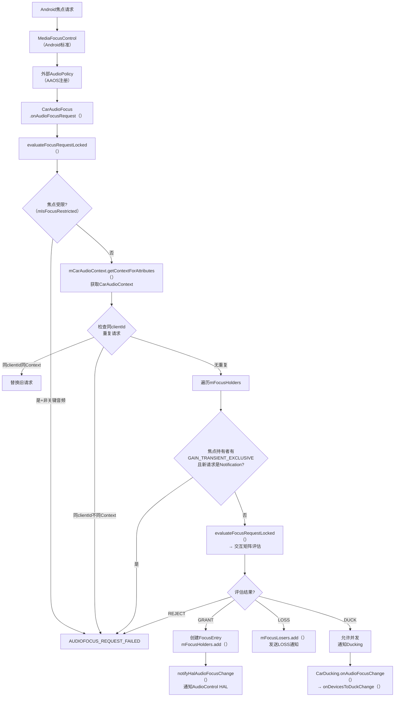

**CarAudioFocus核心数据结构**（源码: [`CarAudioFocus.java:97`](packages/services/Car/service/src/com/android/car/audio/CarAudioFocus.java:97)）

| 字段 | 类型 | 说明 |
|------|------|------|
| `mFocusHolders` | `ArrayMap<String, FocusEntry>` | 当前焦点持有者(clientId→entry) |
| `mFocusLosers` | `ArrayMap<String, FocusEntry>` | 焦点等待恢复者(clientId→entry) |
| `mDelayed_request` | `AudioFocusInfo` | 延迟焦点请求(等待释放) |
| `mIsFocusRestricted` | `boolean` | 焦点受限(如钥匙关闭) |
| `mCarAudioContext` | `CarAudioContext` | CarAudioContext映射 |

> **与标准Android焦点区别**: CarAudioFocus使用`mFocusHolders/mFocusLosers`替代栈模型，支持并发(CONCURRENT)和延迟焦点。交互矩阵决定CONCURRENT/EXCLUSIVE/REJECT。

### CarSvc → HAL: 焦点变化通知

```mermaid
sequenceDiagram
    participant App, MFC, CarAF, ACW, HAL, DSP
    App->>MFC: requestAudioFocus()
    MFC->>CarAF: onAudioFocusRequest(afi)
    CarAF->>CarAF: evaluateFocusRequestLocked()<br>交互矩阵评估
    CarAF->>MFC: setFocusRequestResult()<br>GRANT/REJECT
    CarAF->>ACW: onAudioFocusChange(zoneId, focusChange)
    ACW->>HAL: IAudioControl.onAudioFocusChange()<br>[AIDL] usage, zoneId, focusChange
    HAL->>DSP: DSP执行焦点策略<br>(ducking/muting/routing)

    Note over CarAF,ACW: 如果是CONCURRENT
    CarAF->>CarAF: CarDucking.onAudioFocusChange()
    CarAF->>ACW: onDevicesToDuckChange(duckingInfos)
    ACW->>HAL: IAudioControl.onDevicesToDuckChange()<br>[AIDL] DuckingInfo[]
    HAL->>DSP: DSP执行Ducking(降低增益)
```

### HAL → CarSvc: 外部焦点请求

```mermaid
sequenceDiagram
    participant HAL, ACW, CarAF, MFC, App
    HAL->>ACW: IFocusListener.requestAudioFocus()<br>[AIDL回调] usage, zoneId, focusGain
    ACW->>CarAF: HalAudioFocus处理<br>外部焦点请求
    CarAF->>CarAF: 评估外部焦点请求<br>是否与现有冲突
    CarAF->>MFC: AudioManager.requestAudioFocus()<br>代表HAL请求焦点
    MFC-->>CarAF: GRANT/REJECT
    CarAF-->>HAL: 焦点授予/拒绝<br>通过IFocusListener回调
```

**典型场景**: 外部DSP（如车辆紧急系统/第三方音频源）通过AudioControl HAL请求焦点，CarAudioFocus评估后决定是否授予。

### 外部焦点请求处理 — [`HalAudioFocus`](packages/services/Car/service/src/com/android/car/audio/hal/HalAudioFocus.java)

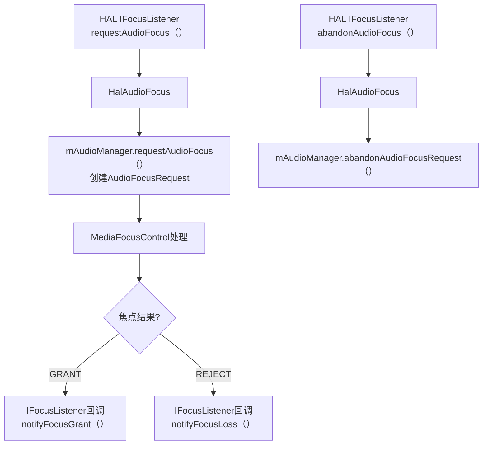

---

## 10.4 Ducking机制

### AAOS系统级自动Ducking完整流程

AAOS的CarAudioFocus在焦点交互矩阵中判定CONCURRENT时，自动通知AudioControl HAL需要Ducking的设备：

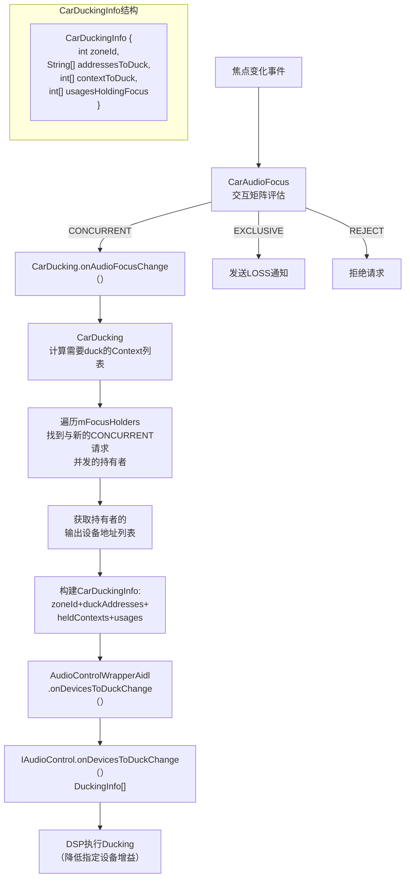

**DuckingInfo HAL AIDL结构**:

| 字段 | 类型 | 说明 |
|------|------|------|
| `zoneId` | int | 音频区域ID(主驾/副驾) |
| `deviceAddressesToDuck` | String[] | 需要Duck的设备地址列表 |
| `usagesHoldingFocus` | int[] | 持有焦点的Usage列表 |
| `zoneId` | int | 音频区域 |

**标准Android vs AAOS Ducking**：
- 标准Android：App自行响应LOSS_TRANSIENT_CAN_DUCK，或框架DuckingManager执行duckPlayers()
- AAOS：CarAudioFocus自动通知HAL，**DSP层面执行Ducking**，App无感知
- AAOS优势：Ducking在DSP层完成，延迟更低，不受App响应速度影响

### Ducking生命周期

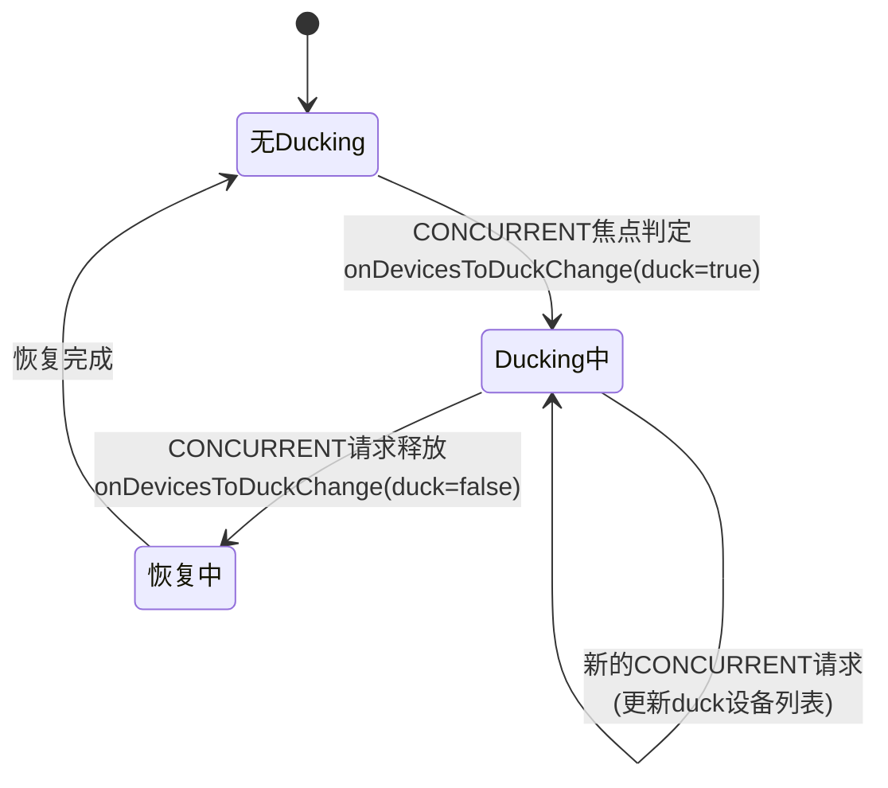

---

## 10.5 Muting机制

### AAOS系统级静音流程

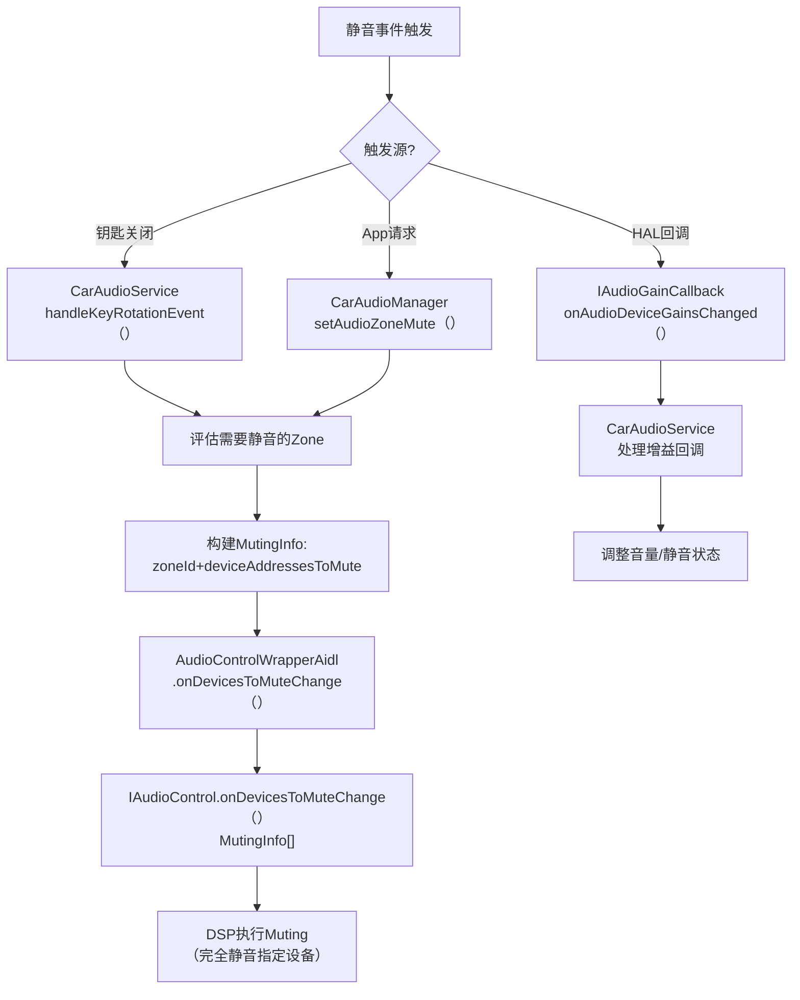

**MutingInfo HAL AIDL结构**:

| 字段 | 类型 | 说明 |
|------|------|------|
| `zoneId` | int | 音频区域ID |
| `deviceAddressesToMute` | String[] | 需要静音的设备地址列表 |

### IAudioControl.setMute() — 直接静音控制

```mermaid
sequenceDiagram
    participant App, CarSvc, ACW, HAL, DSP
    App->>CarSvc: CarAudioManager.setAudioZoneMute(zoneId, mute)
    CarSvc->>ACW: AudioControlWrapper.setMute(mute)
    ACW->>HAL: IAudioControl.setMute(mute)<br>[AIDL] boolean
    HAL->>DSP: DSP执行静音/取消静音
    HAL-->>ACW: 成功/失败
    ACW-->>CarSvc: 结果
    CarSvc-->>App: 操作结果
```

### Ducking vs Muting对比

| 维度 | Ducking | Muting |
|------|---------|--------|
| 音量变化 | 降低到duckLevel(约-20dB) | 完全静音(0dB) |
| 触发 | 焦点交互矩阵CONCURRENT | 显式静音请求/安全事件 |
| 执行层 | DSP增益调整 | DSP完全静音 |
| App感知 | 无感知(不通知App) | 可能收到LOSS_TRANSIENT |
| 恢复 | CONCURRENT请求释放后自动恢复 | 需要显式取消静音 |
| 典型场景 | 导航播报+音乐ducking | 钥匙关闭/车门打开静音 |

### OEM定制点
- **自定义焦点交互矩阵**: 修改`FocusInteraction`的INTERACTION_MATRIX
- **外部焦点请求处理**: 在AudioControl HAL中实现IFocusListener
- **增益控制**: 通过IAudioGainCallback实现动态增益调整
- **模块变更监听**: AIDL v3支持运行时Audio Port/Patch变更通知

---

## 10.6 AudioControlWrapperAidl — AIDL适配层架构

### 类继承体系与桥接机制

[`AudioControlWrapperAidl`](packages/services/Car/service/src/com/android/car/audio/hal/AudioControlWrapperAidl.java:48) 是AAOS Car Audio与AudioControl AIDL HAL之间的核心适配层。它继承自抽象类 [`AudioControlWrapper`](packages/services/Car/service/src/com/android/car/audio/hal/AudioControlWrapper.java:28)，并实现了所有AIDL版本(v1/v2/v3)的接口适配。

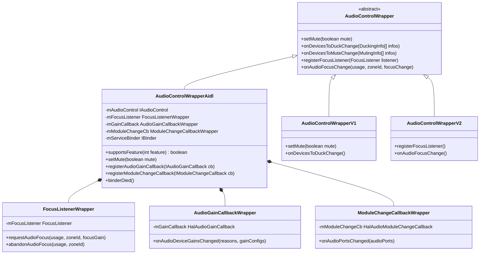

**三个内部Wrapper类的职责**:

| 内部类 | 接口版本 | 代理的AIDL回调 | 注册时机 |
|--------|---------|---------------|---------|
| [`FocusListenerWrapper`](packages/services/Car/service/src/com/android/car/audio/hal/AudioControlWrapperAidl.java:413) | AIDL v1+ | `IFocusListener` | `registerFocusListener()` |
| [`AudioGainCallbackWrapper`](packages/services/Car/service/src/com/android/car/audio/hal/AudioControlWrapperAidl.java:440) | AIDL v2+ | `IAudioGainCallback` | `registerAudioGainCallback()` |
| [`ModuleChangeCallbackWrapper`](packages/services/Car/service/src/com/android/car/audio/hal/AudioControlWrapperAidl.java:470) | AIDL v3 | `IModuleChangeCallback` | `registerModuleChangeCallback()` |

### AIDL服务连接与版本协商

[`AudioControlFactory`](packages/services/Car/service/src/com/android/car/audio/hal/AudioControlFactory.java:28) 按优先级尝试连接HAL: AIDL → HIDL V2 → HIDL V1。连接成功后，[`supportsFeature()`](packages/services/Car/service/src/com/android/car/audio/hal/AudioControlWrapperAidl.java:174) 基于 `getInterfaceVersion()` 判断feature可用性:

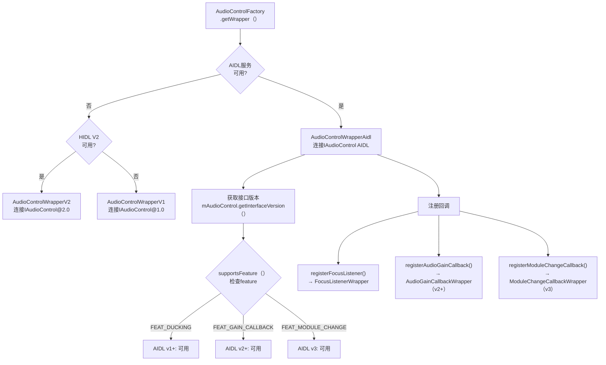

**版本-feature映射表**（源码: [`AudioControlWrapperAidl.java:174`](packages/services/Car/service/src/com/android/car/audio/hal/AudioControlWrapperAidl.java:174)）:

| getInterfaceVersion() | FEAT_DUCKING | FEAT_GAIN_CALLBACK | FEAT_MODULE_CHANGE |
|----------------------|-------------|--------------------|--------------------|
| 1 (AIDL v1) | 支持 | 不支持 | 不支持 |
| 2 (AIDL v2) | 支持 | 支持 | 不支持 |
| 3 (AIDL v3) | 支持 | 支持 | 支持 |

### 核心桥接方法实现

[`AudioControlWrapperAidl`](packages/services/Car/service/src/com/android/car/audio/hal/AudioControlWrapperAidl.java:48) 将CarAudioService的Java调用转换为AIDL HAL接口调用:

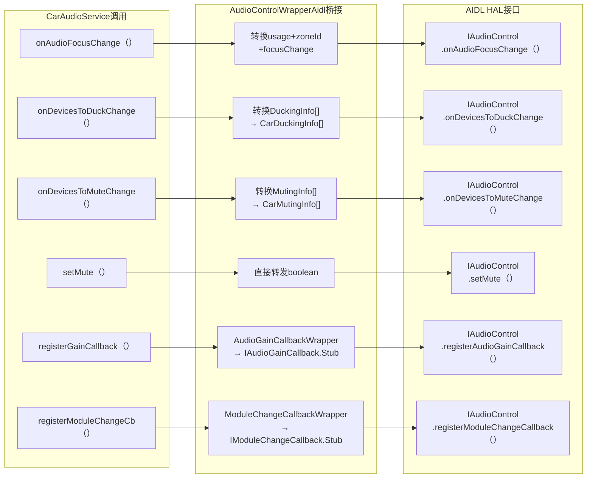

**数据转换要点**:
- DuckingInfo/MutingInfo需要将CarAudioService内部结构转换为AIDL HAL的`CarDuckingInfo/CarMutingInfo` Parcelable
- `FocusListenerWrapper`实现`IFocusListener.Stub`，将HAL回调转发给CarAudioService的`FocusListener`
- `binderDied()`（源码: [`AudioControlWrapperAidl.java:258`](packages/services/Car/service/src/com/android/car/audio/hal/AudioControlWrapperAidl.java:258)）处理HAL进程死亡，触发重新连接

---

## 10.7 HalAudioFocus — 外部焦点请求管理

### 数据结构与存储模型

[`HalAudioFocus`](packages/services/Car/service/src/com/android/car/audio/hal/HalAudioFocus.java:38) 管理来自AudioControl HAL的外部焦点请求。核心数据结构为 `mHalFocusRequestsByZoneAndUsage`:

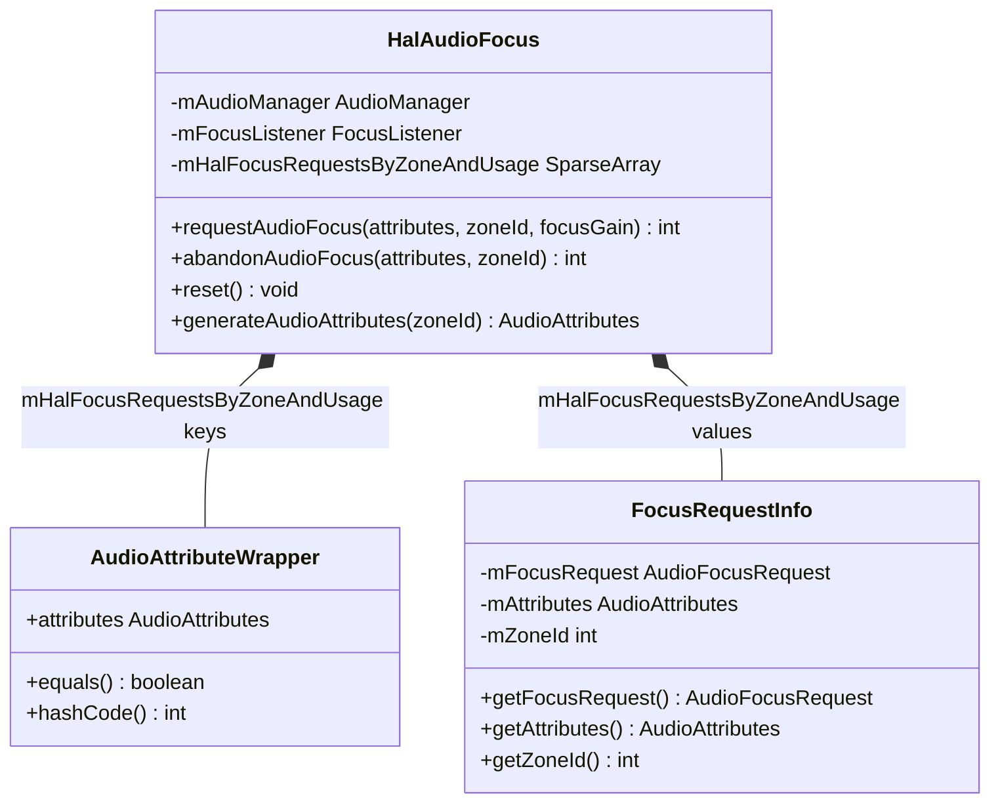

**`mHalFocusRequestsByZoneAndUsage`结构详解**:

| 层级 | 类型 | 说明 |
|------|------|------|
| Key-外层 | `SparseArray<ArrayMap>` | zoneId → zone内焦点请求表 |
| Key-内层 | `AudioAttributeWrapper` | 封装AudioAttributes作为唯一标识 |
| Value | `FocusRequestInfo` | 存储AudioFocusRequest+zoneId+AudioAttributes |

> **为什么使用两层映射**: AAOS支持多音频区域(Multi-zone)，每个zone有独立的焦点空间。zoneId外层隔离不同zone的焦点请求，内层用AudioAttributeWrapper区分同一zone内的不同音频用途。

### requestAudioFocus完整流程

[`HalAudioFocus.requestAudioFocus()`](packages/services/Car/service/src/com/android/car/audio/hal/HalAudioFocus.java:106) 处理HAL侧发起的焦点请求:

```mermaid
sequenceDiagram
    participant HAL, ACW, HAF, AM, MFC, CarAF
    HAL->>ACW: IFocusListener.requestAudioFocus(usage, zoneId, focusGain)
    ACW->>HAF: HalAudioFocus.requestAudioFocus(attributes, zoneId, focusGain)

    HAF->>HAF: generateAudioAttributes(zoneId)<br>构建AudioAttributes(Bundle携带zoneId)
    HAF->>HAF: 创建AudioFocusRequest<br>.setOnAudioFocusChangeListener(callback)
    HAF->>HAF: mHalFocusRequestsByZoneAndUsage<br>.put(zoneId, wrapper, requestInfo)
    HAF->>AM: AudioManager.requestAudioFocus(focusRequest)
    AM->>MFC: MediaFocusControl处理请求
    MFC->>CarAF: CarAudioFocus拦截评估

    CarAF-->>MFC: 评估结果(GRANT/LOSS/DUCK/REJECT)
    MFC-->>AM: 焦点授予/拒绝
    AM-->>HAF: onFocusChange回调触发
    HAF-->>ACW: FocusListenerWrapper转发结果
    ACW-->>HAL: 通过IFocusListener通知结果
```

**`generateAudioAttributes()`关键逻辑**（源码: [`HalAudioFocus.java:214`](packages/services/Car/service/src/com/android/car/audio/hal/HalAudioFocus.java:214)）:

该方法将HAL传入的usage+zoneId转换为Android AudioAttributes。**zoneId通过Bundle extra传递**，使得CarAudioFocus能识别请求来自哪个音频区域:

| 步骤 | 代码 | 说明 |
|------|------|------|
| 1 | `new AudioAttributes.Builder()` | 创建构建器 |
| 2 | `.setUsage(usage)` | 设置AudioAttributes usage |
| 3 | `.addBundle(bundle)` | Bundle中携带zoneId |
| 4 | `.build()` | 构建AudioAttributes |

### abandonAudioFocus流程

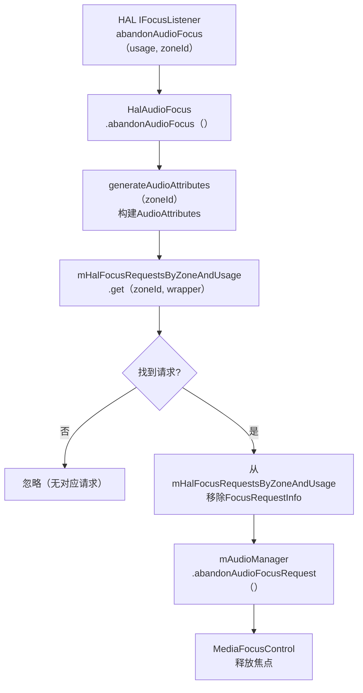

---

## 10.8 IAudioGainCallback — HAL增益回调链路

### 增益回调处理链路

[`IAudioGainCallback`](hardware/interfaces/car/audiocontrol/aidl/android/hardware/car/audiocontrol/IAudioGainCallback.aidl) 是AIDL v2引入的回调接口，当HAL侧检测到增益配置需要变化时，通过此回调通知CarAudioService。

```mermaid
sequenceDiagram
    participant DSP, HAL, ACW, GainCbWrap, CarGainMon, CarSvc, VolGroup
    DSP->>HAL: 硬件增益变化事件<br>(限幅/静音/阻塞等)
    HAL->>ACW: IAudioGainCallback.onAudioDeviceGainsChanged()<br>reasons[], gainConfigs[]
    ACW->>GainCbWrap: AudioGainCallbackWrapper<br>.onAudioDeviceGainsChanged()
    GainCbWrap->>CarGainMon: CarAudioGainMonitor<br>.onAudioDeviceGainsChanged()
    CarGainMon->>CarGainMon: 分类处理Reasons<br>(block/limit/duck/mute/updateVolumeIndex)
    CarGainMon->>CarSvc: CarAudioService回调处理
    CarSvc->>VolGroup: CarVolumeGroup<br>.updateVolumeIndex()
    CarSvc-->>HAL: IAudioControl.setMute()/其他响应
```

### AudioGainConfigInfo结构

[`AudioGainConfigInfo`](hardware/interfaces/car/audiocontrol/aidl/android/hardware/car/audiocontrol/AudioGainConfigInfo.aidl) 是增益回调携带的核心数据结构:

| 字段 | 类型 | 说明 |
|------|------|------|
| `zoneId` | int | 音频区域ID |
| `devicePortAddress` | String | Audio Port设备地址 |
| `gainIndex` | int | 当前增益索引值 |
| `reasons` | Reasons[] | 增益变化原因列表 |

> **devicePortAddress**: 对应AudioPolicy中Audio Port的地址，CarAudioService通过此地址定位到具体的CarVolumeGroup。

### Reasons枚举分类

[`Reasons`](hardware/interfaces/car/audiocontrol/aidl/android/hardware/car/audiocontrol/Reasons.aidl) 定义了10种增益变化原因:

| 枚举值 | 数值 | 分类 | 说明 |
|--------|------|------|------|
| `FORCED_MASTER_MUTE` | 0 | 静音类 | 强制主静音(如钥匙关闭) |
| `FORCED_MASTER_VOLUME` | 1 | 音量类 | 强制主音量限制 |
| `REMOTE_MASTER_VOLUME` | 2 | 音量类 | 远程主音量请求 |
| `REMOTE_MASTER_MUTE` | 3 | 静音类 | 远程主静音请求 |
| `NAVIGATION_VOLUME` | 4 | 音量类 | 导航音量调整 |
| `CALL_VOLUME` | 5 | 音量类 | 电话音量调整 |
| `CALL_MUTE` | 6 | 静音类 | 电话静音 |
| `EMERGENCY_VOLUME` | 7 | 音量类 | 紧急音频音量调整 |
| `EMERGENCY_MUTE` | 8 | 静音类 | 紧急音频静音 |
| `RESTRICTED_VOLUME` | 9 | 音量类 | 受限音量(如儿童模式) |

### CarAudioGainMonitor增益事件分发

[`CarAudioGainMonitor`](packages/services/Car/service/src/com/android/car/audio/CarAudioGainMonitor.java) 是增益回调的中枢分发器，按zoneId分组处理:

| 方法 | 处理的Reason | 行为 |
|------|-------------|------|
| [`shouldBlockVolumeRequest()`](packages/services/Car/service/src/com/android/car/audio/CarAudioGainMonitor.java:89) | FORCED_MASTER_MUTE | 阻止音量请求，强制静音 |
| [`shouldLimitVolumeRequest()`](packages/services/Car/service/src/com/android/car/audio/CarAudioGainMonitor.java:102) | FORCED_MASTER_VOLUME, RESTRICTED_VOLUME | 限制音量到最大值 |
| [`shouldDuckVolume()`](packages/services/Car/service/src/com/android/car/audio/CarAudioGainMonitor.java:115) | NAVIGATION_VOLUME, CALL_VOLUME | Duck音量到指定级别 |
| [`shouldMuteVolume()`](packages/services/Car/service/src/com/android/car/audio/CarAudioGainMonitor.java:128) | CALL_MUTE, EMERGENCY_MUTE | 静音指定设备 |
| [`updateVolumeIndex()`](packages/services/Car/service/src/com/android/car/audio/CarAudioGainMonitor.java:141) | REMOTE_MASTER_VOLUME | 更新音量索引 |

**ExtraInfo映射表**（源码: [`CarAudioGainMonitor`](packages/services/Car/service/src/com/android/car/audio/CarAudioGainMonitor.java)）:

| Reason | ExtraInfo Key | 说明 |
|--------|-------------|------|
| FORCED_MASTER_MUTE | `EXTRA_INFO_FORCED_MUTE` | 强制静音标志 |
| FORCED_MASTER_VOLUME | `EXTRA_INFO_VOLUME_LIMIT` | 音量上限值 |
| RESTRICTED_VOLUME | `EXTRA_INFO_VOLUME_LIMIT` | 受限音量上限 |
| NAVIGATION_VOLUME | `EXTRA_INFO_DUCK_VOLUME` | Duck目标音量 |
| CALL_VOLUME | `EXTRA_INFO_DUCK_VOLUME` | Duck目标音量 |

---

## 10.9 IModuleChangeCallback — 运行时模块变更通知

### 模块变更回调架构 (AIDL v3)

[`IModuleChangeCallback`](hardware/interfaces/car/audiocontrol/aidl/android/hardware/car/audiocontrol/IModuleChangeCallback.aidl) 是AIDL v3新增的回调接口，用于通知CarAudioService音频模块的运行时变更。

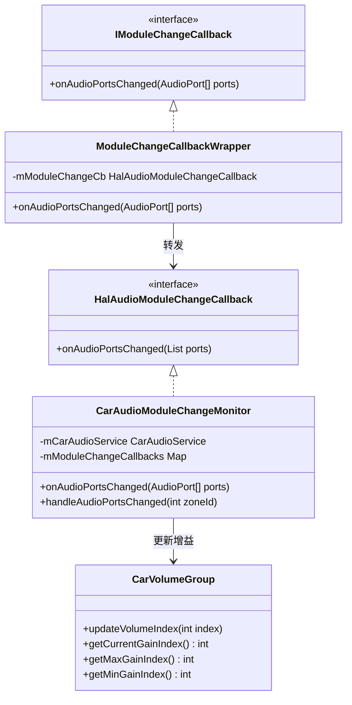

### 动态重配置流程

[`CarAudioModuleChangeMonitor`](packages/services/Car/service/src/com/android/car/audio/CarAudioModuleChangeMonitor.java) 处理AudioPort变更，触发CarVolumeGroup增益更新:

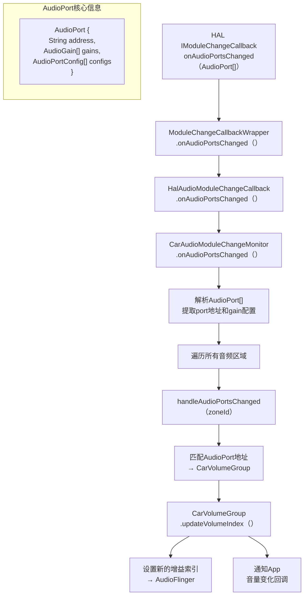

**运行时模块变更的典型场景**:

| 场景 | 触发原因 | CarAudioService响应 |
|------|---------|-------------------|
| DSP重配置 | DSP固件更新或模式切换 | 更新CarVolumeGroup的gain stage |
| 动态增益范围变化 | 安全限制调整(如儿童模式) | 更新minGainIndex/maxGainIndex |
| AudioPort热插拔 | 外部USB音频设备插入 | 重建CarAudioZone配置 |
| 模块初始化 | HAL服务启动 | 同步初始gain配置 |

### AudioControl HAL版本演进对比总表

| 特性 | HIDL V1 | HIDL V2 | AIDL v1 | AIDL v2 | AIDL v3 |
|------|---------|---------|---------|---------|---------|
| 焦点通知 | 不支持 | `registerFocusListener` | `IFocusListener` | `IFocusListener` | `IFocusListener` |
| Ducking通知 | 不支持 | 不支持 | `onDevicesToDuckChange` | `onDevicesToDuckChange` | `onDevicesToDuckChange` |
| Muting通知 | 不支持 | 不支持 | `onDevicesToMuteChange` | `onDevicesToMuteChange` | `onDevicesToMuteChange` |
| 增益回调 | 不支持 | 不支持 | 不支持 | `IAudioGainCallback` | `IAudioGainCallback` |
| 模块变更 | 不支持 | 不支持 | 不支持 | 不支持 | `IModuleChangeCallback` |
| 版本查询 | 不支持 | 不支持 | `getInterfaceVersion` | `getInterfaceVersion` | `getInterfaceVersion` |
| Feature检查 | 不支持 | 不支持 | `supportsFeature` | `supportsFeature` | `supportsFeature` |
| 连接优先级 | 低(最后) | 中 | 高(首选) | 高(首选) | 高(首选) |

> [← 上一篇：AAOS Car Audio](09_AAOS_Car_Audio.md) | [返回导航](README.md) | [下一篇：Vendor Layer →](11_Vendor_Layer.md)