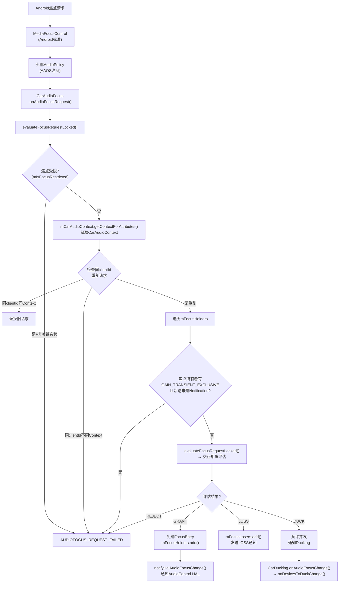
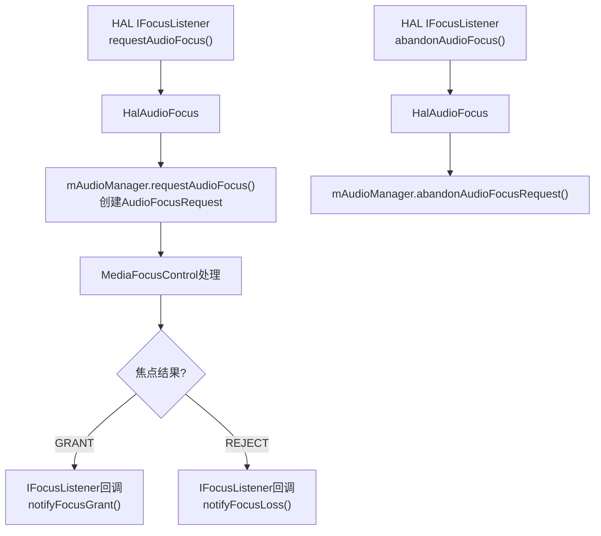
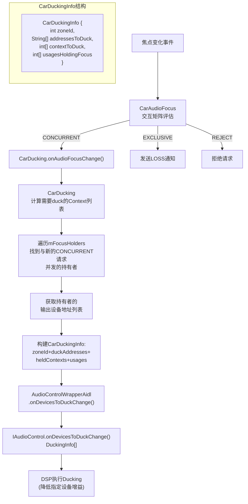
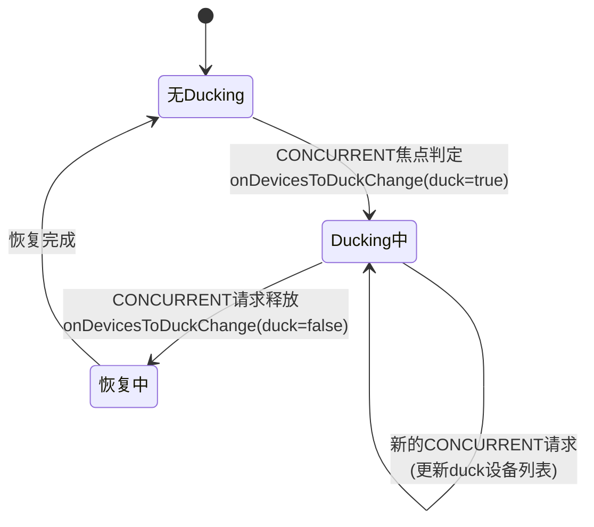
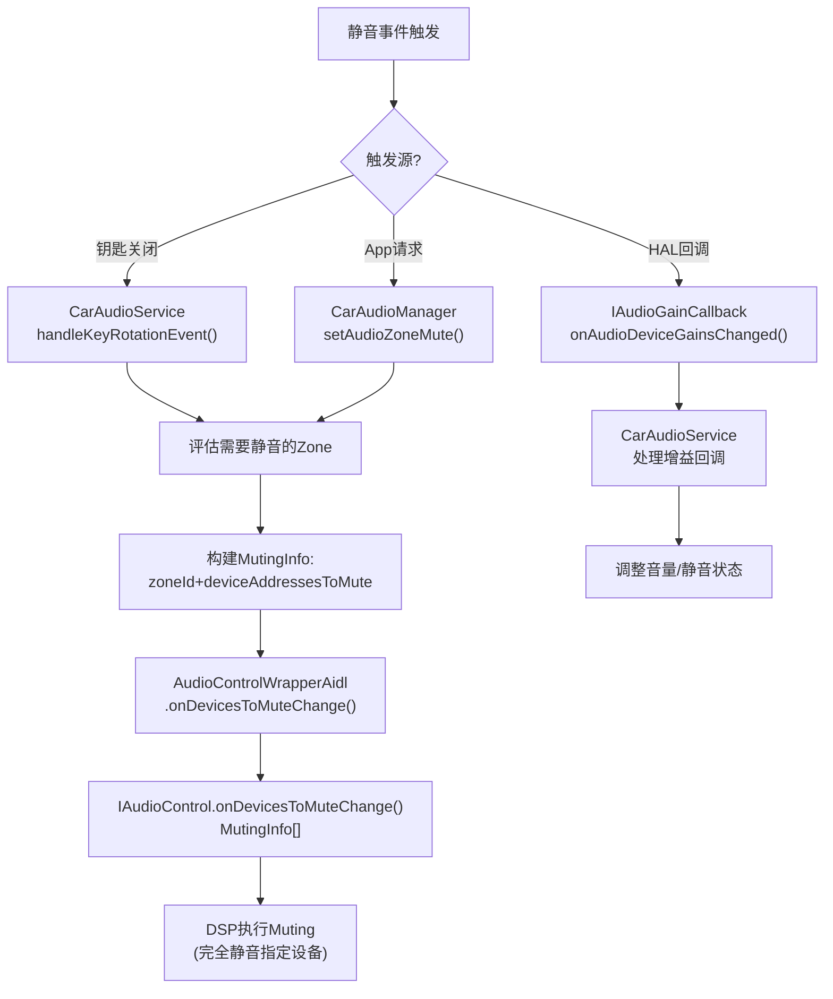

# 第十篇：AudioControl HAL

> [← 上一篇：AAOS Car Audio](09_AAOS_Car_Audio.md) | [返回导航](README.md) | [下一篇：Vendor Layer →](11_Vendor_Layer.md)

---

## 10.1 AudioControl HAL总览

### 模块职责
AudioControl HAL是AAOS特有的HAL接口，负责车载焦点通知、音量增益回调、静音控制、模块变更通知等。它是CarAudioService与Vehicle HAL/DSP之间的桥梁。

### 版本演进

| 版本 | 接口类型 | 焦点监听 | 静音 | 增益回调 | 模块变更 |
|------|---------|---------|------|---------|---------|
| V1.0 (HIDL) | `IAudioControl@1.0` | 不支持 | 不支持 | 不支持 | 不支持 |
| V2.0 (HIDL) | `IAudioControl@2.0` | `registerFocusListener` | 不支持 | 不支持 | 不支持 |
| AIDL v1 | `IAudioControl/AIDL` | `IFocusListener` | `setMute` | 不支持 | 不支持 |
| AIDL v2 | `IAudioControl/AIDL` | `IFocusListener` | `setMute` | `IAudioGainCallback` | 不支持 |
| AIDL v3 | `IAudioControl/AIDL` | `IFocusListener` | `setMute` | `IAudioGainCallback` | `IModuleChangeCallback` |

---

## 10.2 核心接口

### IAudioControl (AIDL)

| 方法 | 说明 | 方向 |
|------|------|------|
| `onAudioFocusChange()` | 通知焦点变化 | CarSvc → HAL |
| `registerFocusListener()` | 注册焦点监听 | HAL → CarSvc |
| `setBalanceTowardRight()` | 设置左右平衡 | CarSvc → HAL |
| `setFadeTowardFront()` | 设置前后衰减 | CarSvc → HAL |
| `setMute()` | 设置静音 | CarSvc → HAL |
| `registerAudioGainCallback()` | 注册增益回调 | HAL → CarSvc |
| `onDevicesToDuckChange()` | 通知Ducking设备变化 | CarSvc → HAL |
| `onDevicesToMuteChange()` | 通知静音设备变化 | CarSvc → HAL |

### IFocusListener (AIDL)

| 方法 | 说明 | 方向 |
|------|------|------|
| `requestAudioFocus()` | HAL请求焦点 | HAL → CarSvc |
| `abandonAudioFocus()` | HAL释放焦点 | HAL → CarSvc |

### IAudioGainCallback (AIDL v2+)

| 方法 | 说明 |
|------|------|
| `onAudioDeviceGainsChanged()` | 通知增益配置变化 |

### IModuleChangeCallback (AIDL v3)

| 方法 | 说明 |
|------|------|
| `onAudioPortsChanged()` | 通知音频端口变化 |
| `onAudioPatchChanged()` | 通知音频Patch变化 |

---

## 10.3 焦点回调流程

### CarAudioFocus焦点评估核心 — [`evaluateFocusRequestLocked()`](packages/services/Car/service/src/com/android/car/audio/CarAudioFocus.java:207)

AAOS使用自己的焦点管理器`CarAudioFocus`(而非标准Android的`MediaFocusControl`)，通过`AudioPolicy.AudioPolicyFocusListener`接口拦截焦点请求。



**CarAudioFocus核心数据结构**（源码: [`CarAudioFocus.java:97`](packages/services/Car/service/src/com/android/car/audio/CarAudioFocus.java:97)）

| 字段 | 类型 | 说明 |
|------|------|------|
| `mFocusHolders` | `ArrayMap<String, FocusEntry>` | 当前焦点持有者(clientId→entry) |
| `mFocusLosers` | `ArrayMap<String, FocusEntry>` | 焦点等待恢复者(clientId→entry) |
| `mDelayedRequest` | `AudioFocusInfo` | 延迟焦点请求(等待释放) |
| `mIsFocusRestricted` | `boolean` | 焦点受限(如钥匙关闭) |
| `mCarAudioContext` | `CarAudioContext` | CarAudioContext映射 |

> **与标准Android焦点区别**: CarAudioFocus使用`mFocusHolders/mFocusLosers`替代栈模型，支持并发(CONCURRENT)和延迟焦点。交互矩阵决定CONCURRENT/EXCLUSIVE/REJECT。

### CarSvc → HAL: 焦点变化通知

```mermaid
sequenceDiagram
    participant App, MFC, CarAF, ACW, HAL, DSP
    App->>MFC: requestAudioFocus()
    MFC->>CarAF: onAudioFocusRequest(afi)
    CarAF->>CarAF: evaluateFocusRequestLocked()<br/>交互矩阵评估
    CarAF->>MFC: setFocusRequestResult()<br/>GRANT/REJECT
    CarAF->>ACW: onAudioFocusChange(zoneId, focusChange)
    ACW->>HAL: IAudioControl.onAudioFocusChange()<br/>[AIDL] usage, zoneId, focusChange
    HAL->>DSP: DSP执行焦点策略<br/>(ducking/muting/routing)

    Note over CarAF,ACW: 如果是CONCURRENT
    CarAF->>CarAF: CarDucking.onAudioFocusChange()
    CarAF->>ACW: onDevicesToDuckChange(duckingInfos)
    ACW->>HAL: IAudioControl.onDevicesToDuckChange()<br/>[AIDL] DuckingInfo[]
    HAL->>DSP: DSP执行Ducking(降低增益)
```

### HAL → CarSvc: 外部焦点请求

```mermaid
sequenceDiagram
    participant HAL, ACW, CarAF, MFC, App
    HAL->>ACW: IFocusListener.requestAudioFocus()<br/>[AIDL回调] usage, zoneId, focusGain
    ACW->>CarAF: HalAudioFocus处理<br/>外部焦点请求
    CarAF->>CarAF: 评估外部焦点请求<br/>是否与现有冲突
    CarAF->>MFC: AudioManager.requestAudioFocus()<br/>代表HAL请求焦点
    MFC-->>CarAF: GRANT/REJECT
    CarAF-->>HAL: 焦点授予/拒绝<br/>通过IFocusListener回调
```

**典型场景**: 外部DSP（如车辆紧急系统/第三方音频源）通过AudioControl HAL请求焦点，CarAudioFocus评估后决定是否授予。

### 外部焦点请求处理 — [`HalAudioFocus`](packages/services/Car/service/src/com/android/car/audio/hal/HalAudioFocus.java)



---

## 10.4 Ducking机制

### AAOS系统级自动Ducking完整流程

AAOS的CarAudioFocus在焦点交互矩阵中判定CONCURRENT时，自动通知AudioControl HAL需要Ducking的设备：



**DuckingInfo HAL AIDL结构**:

| 字段 | 类型 | 说明 |
|------|------|------|
| `zoneId` | int | 音频区域ID(主驾/副驾) |
| `deviceAddressesToDuck` | String[] | 需要Duck的设备地址列表 |
| `usagesHoldingFocus` | int[] | 持有焦点的Usage列表 |
| `zoneId` | int | 音频区域 |

**标准Android vs AAOS Ducking**：
- 标准Android：App自行响应LOSS_TRANSIENT_CAN_DUCK，或框架DuckingManager执行duckPlayers()
- AAOS：CarAudioFocus自动通知HAL，**DSP层面执行Ducking**，App无感知
- AAOS优势：Ducking在DSP层完成，延迟更低，不受App响应速度影响

### Ducking生命周期



---

## 10.5 Muting机制

### AAOS系统级静音流程



**MutingInfo HAL AIDL结构**:

| 字段 | 类型 | 说明 |
|------|------|------|
| `zoneId` | int | 音频区域ID |
| `deviceAddressesToMute` | String[] | 需要静音的设备地址列表 |

### IAudioControl.setMute() — 直接静音控制

```mermaid
sequenceDiagram
    participant App, CarSvc, ACW, HAL, DSP
    App->>CarSvc: CarAudioManager.setAudioZoneMute(zoneId, mute)
    CarSvc->>ACW: AudioControlWrapper.setMute(mute)
    ACW->>HAL: IAudioControl.setMute(mute)<br/>[AIDL] boolean
    HAL->>DSP: DSP执行静音/取消静音
    HAL-->>ACW: 成功/失败
    ACW-->>CarSvc: 结果
    CarSvc-->>App: 操作结果
```

### Ducking vs Muting对比

| 维度 | Ducking | Muting |
|------|---------|--------|
| 音量变化 | 降低到duckLevel(约-20dB) | 完全静音(0dB) |
| 触发 | 焦点交互矩阵CONCURRENT | 显式静音请求/安全事件 |
| 执行层 | DSP增益调整 | DSP完全静音 |
| App感知 | 无感知(不通知App) | 可能收到LOSS_TRANSIENT |
| 恢复 | CONCURRENT请求释放后自动恢复 | 需要显式取消静音 |
| 典型场景 | 导航播报+音乐ducking | 钥匙关闭/车门打开静音 |

### OEM定制点
- **自定义焦点交互矩阵**: 修改`FocusInteraction`的INTERACTION_MATRIX
- **外部焦点请求处理**: 在AudioControl HAL中实现IFocusListener
- **增益控制**: 通过IAudioGainCallback实现动态增益调整
- **模块变更监听**: AIDL v3支持运行时Audio Port/Patch变更通知

---

> [← 上一篇：AAOS Car Audio](09_AAOS_Car_Audio.md) | [返回导航](README.md) | [下一篇：Vendor Layer →](11_Vendor_Layer.md)