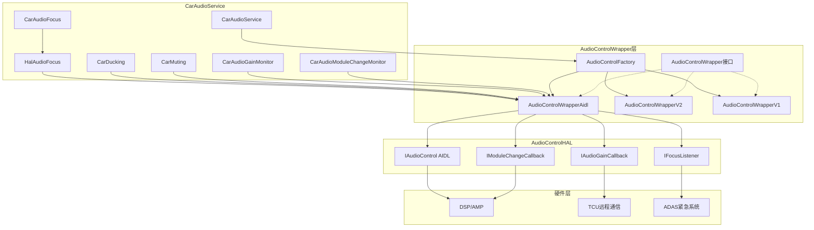
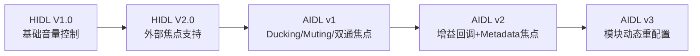
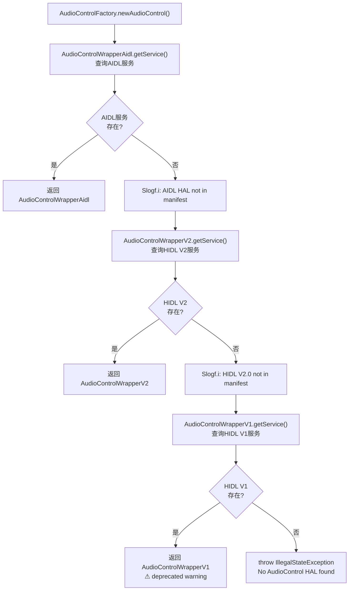
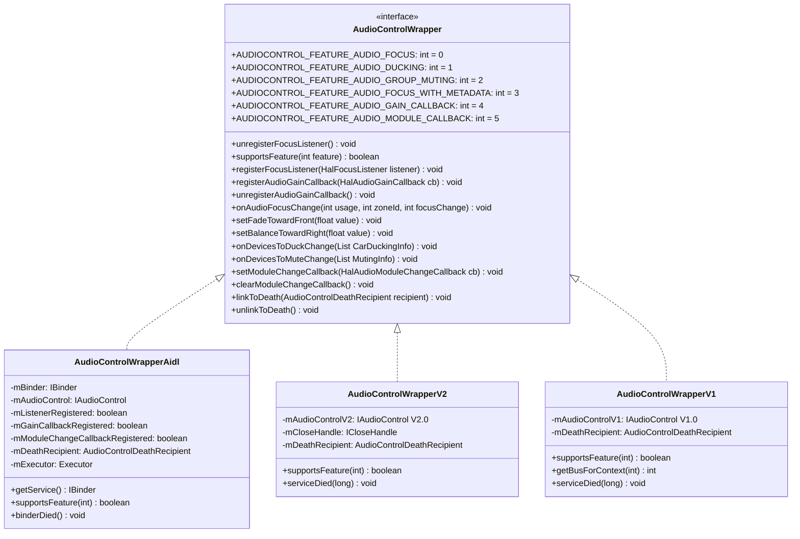
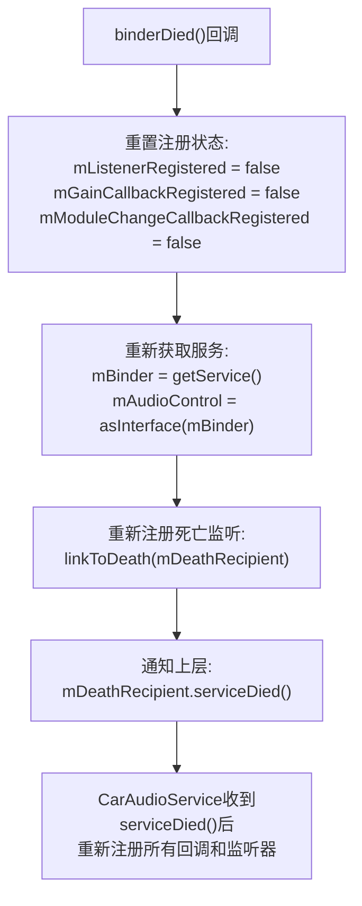
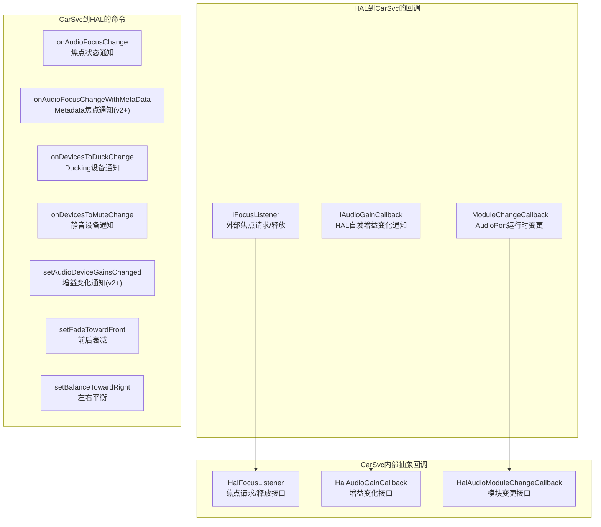

## 10.1 AudioControl HAL总览

> [← 上一篇](../09_AAOS_Car_Audio/README.md) | [← 返回10章](README.md) | [返回导航](../README.md) | [下一个 →](10_10.2_核心接口.md)

---

### 10.1.1 模块定位与职责

AudioControl HAL是AAOS车载音频系统的专属HAL接口，是**CarAudioService与车辆底层音频硬件(DSP/AMP/TCU)之间的桥梁**。它不处理通用音频播放（那是AudioFlinger+ALSA的职责），而是专注于**车载特有**的音频控制逻辑：

| 职责领域 | 说明 | 数据流向 |
|---------|------|---------|
| 外部焦点管理 | 外部音频源(紧急系统/第三方DSP)请求Android焦点 | HAL → CarSvc |
| 焦点状态通知 | 将Android焦点变化通知HAL/DSP | CarSvc → HAL |
| Ducking控制 | 通知HAL哪些设备需要降低增益(并发播放) | CarSvc → HAL |
| Muting控制 | 通知HAL哪些设备需要完全静音 | CarSvc → HAL |
| 增益回调 | HAL侧自发增益变化(热保护/外部静音)通知CarSvc | HAL → CarSvc |
| 模块变更通知 | HAL运行时AudioPort配置变更通知CarSvc | HAL → CarSvc |
| 音量淡入淡出 | 设置前后衰减/左右平衡 | CarSvc → HAL |

### 10.1.2 整体架构



### 10.1.3 版本演进详解

AudioControl HAL经历了从HIDL V1.0到AIDL v3的完整演进，每一步都增加了关键能力：



**版本特性矩阵**（基于源码 [`supportsFeature()`](packages/services/Car/service/src/com/android/car/audio/hal/AudioControlWrapperAidl.java:89)）：

| 特性常量 | HIDL V1 | HIDL V2 | AIDL v1 | AIDL v2 | AIDL v3 |
|---------|---------|---------|---------|---------|---------|
| `AUDIOCONTROL_FEATURE_AUDIO_FOCUS` (0) | 不支持 | 支持 | 支持 | 支持 | 支持 |
| `AUDIOCONTROL_FEATURE_AUDIO_DUCKING` (1) | 不支持 | 不支持 | 支持 | 支持 | 支持 |
| `AUDIOCONTROL_FEATURE_AUDIO_GROUP_MUTING` (2) | 不支持 | 不支持 | 支持 | 支持 | 支持 |
| `AUDIOCONTROL_FEATURE_AUDIO_FOCUS_WITH_METADATA` (3) | 不支持 | 不支持 | 不支持 | 支持 | 支持 |
| `AUDIOCONTROL_FEATURE_AUDIO_GAIN_CALLBACK` (4) | 不支持 | 不支持 | 不支持 | 支持 | 支持 |
| `AUDIOCONTROL_FEATURE_AUDIO_MODULE_CALLBACK` (5) | 不支持 | 不支持 | 不支持 | 不支持 | 支持 |

**版本判断逻辑**（源码 [`AudioControlWrapperAidl.java:89-112`](packages/services/Car/service/src/com/android/car/audio/hal/AudioControlWrapperAidl.java:89)）：

```java
// AIDL_AUDIO_CONTROL_VERSION_1 = 1, AIDL_AUDIO_CONTROL_VERSION_2 = 2
public boolean supportsFeature(int feature) {
    switch (feature) {
        case AUDIOCONTROL_FEATURE_AUDIO_FOCUS:
        case AUDIOCONTROL_FEATURE_AUDIO_DUCKING:
        case AUDIOCONTROL_FEATURE_AUDIO_GROUP_MUTING:
            return true;  // AIDL v1+始终支持
        case AUDIOCONTROL_FEATURE_AUDIO_FOCUS_WITH_METADATA:
        case AUDIOCONTROL_FEATURE_AUDIO_GAIN_CALLBACK:
            return mAudioControl.getInterfaceVersion() > AIDL_AUDIO_CONTROL_VERSION_1;  // v2+
        case AUDIOCONTROL_FEATURE_AUDIO_MODULE_CALLBACK:
            return mAudioControl.getInterfaceVersion() > AIDL_AUDIO_CONTROL_VERSION_2;  // v3+
    }
}
```

### 10.1.4 服务发现与工厂创建

[`AudioControlFactory`](packages/services/Car/service/src/com/android/car/audio/hal/AudioControlFactory.java:33) 负责按优先级创建Wrapper实例：



**服务名称**：
- AIDL: `android.hardware.automotive.audiocontrol.IAudioControl/default`（源码 [`AudioControlWrapperAidl.java:63`](packages/services/Car/service/src/com/android/car/audio/hal/AudioControlWrapperAidl.java:63)）
- HIDL V2: `android.hardware.automotive.audiocontrol@2.0::IAudioControl`
- HIDL V1: `android.hardware.automotive.audiocontrol@1.0::IAudioControl`

### 10.1.5 Wrapper继承体系



### 10.1.6 三个Wrapper实现对比

| 方法 | AudioControlWrapperV1 | AudioControlWrapperV2 | AudioControlWrapperAidl |
|------|----------------------|----------------------|------------------------|
| `registerFocusListener()` | ❌ UnsupportedOperationException | ✅ 通过ICloseHandle注册 | ✅ 通过mAudioControl注册 |
| `onAudioFocusChange()` | ❌ UnsupportedOperationException | ✅ usage+zoneId+focusChange | ✅ xsdString+zoneId+focusChange |
| `onDevicesToDuckChange()` | ❌ UnsupportedOperationException | ❌ UnsupportedOperationException | ✅ DuckingInfo[]转换 |
| `onDevicesToMuteChange()` | ❌ UnsupportedOperationException | ❌ UnsupportedOperationException | ✅ MutingInfo[]直接传递 |
| `registerAudioGainCallback()` | ❌ UnsupportedOperationException | ❌ UnsupportedOperationException | ✅ AIDL v2+ |
| `setModuleChangeCallback()` | ❌ UnsupportedOperationException | ❌ UnsupportedOperationException | ✅ AIDL v3+ |
| `setFadeTowardFront()` | ✅ | ✅ | ✅ |
| `setBalanceTowardRight()` | ✅ | ✅ | ✅ |
| `getBusForContext()` | ✅ deprecated | ❌ | ❌ |
| `supportsFeature()` | 始终false | 仅AUDIO_FOCUS | 版本协商 |
| `unregisterFocusListener()` | ❌ UnsupportedOperationException | ✅ mCloseHandle.close() | 空操作(HAL自动注销) |
| HAL死亡处理 | serviceDied()重连 | serviceDied()重连 | binderDied()重连+重注册 |

### 10.1.7 HAL死亡恢复机制

所有三个Wrapper都实现了HAL死亡监听和自动恢复。以AIDL为例（源码 [`AudioControlWrapperAidl.java:322-335`](packages/services/Car/service/src/com/android/car/audio/hal/AudioControlWrapperAidl.java:322)）：



### 10.1.8 回调接口体系

AudioControl HAL定义了三组回调接口，分别用于不同方向的通信：



### 10.1.9 与CarAudioService的集成关系

AudioControl HAL在CarAudioService中的使用位置：

| CarAudioService组件 | 使用的AudioControl方法 | 用途 |
|--------------------|-----------------------|------|
| `CarAudioFocus` | `onAudioFocusChange()` | 焦点变化通知HAL |
| `HalAudioFocus` | `registerFocusListener()`, `onAudioFocusChange()` | 外部焦点请求管理 |
| `CarDucking` | `onDevicesToDuckChange()` | Ducking设备通知HAL |
| `CarAudioService` | `onDevicesToMuteChange()` | 静音设备通知HAL |
| `CarAudioGainMonitor` | `registerAudioGainCallback()` | 注册增益回调 |
| `CarAudioModuleChangeMonitor` | `setModuleChangeCallback()` | 注册模块变更回调 |
| `CarAudioService` | `setFadeTowardFront()`, `setBalanceTowardRight()` | 前后/左右音量平衡 |

### 10.1.10 AIDL接口版本号与Feature关系

AIDL版本的`getInterfaceVersion()`返回值直接决定feature可用性（源码 [`AudioControlWrapperAidl.java:72-73`](packages/services/Car/service/src/com/android/car/audio/hal/AudioControlWrapperAidl.java:72)）：

```
AIDL_AUDIO_CONTROL_VERSION_1 = 1  →  基础版(焦点/Ducking/Muting)
AIDL_AUDIO_CONTROL_VERSION_2 = 2  →  增加Metadata焦点+增益回调
getInterfaceVersion() > 2         →  增加模块变更回调(v3)
```

| getInterfaceVersion() | 焦点 | Ducking | Muting | Metadata焦点 | 增益回调 | 模块变更 |
|----------------------|------|---------|--------|-------------|---------|---------|
| 1 | ✅ | ✅ | ✅ | ❌ | ❌ | ❌ |
| 2 | ✅ | ✅ | ✅ | ✅ | ✅ | ❌ |
| >2 (v3) | ✅ | ✅ | ✅ | ✅ | ✅ | ✅ |

---

[← 上一篇](../09_AAOS_Car_Audio/README.md) | [← 返回10章](README.md) | [返回导航](../README.md) | [下一个 →](10_10.2_核心接口.md)