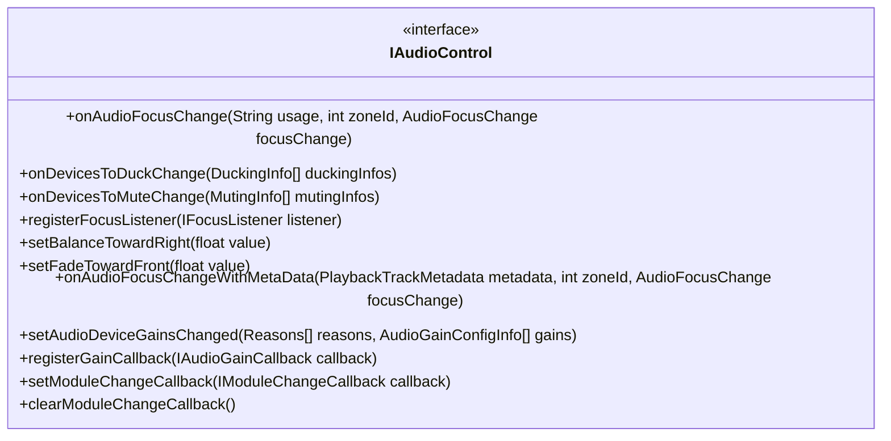
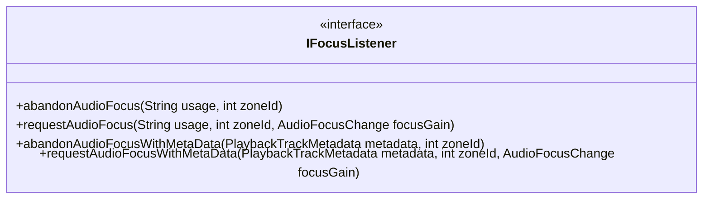
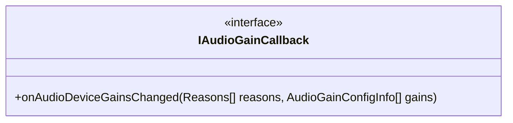
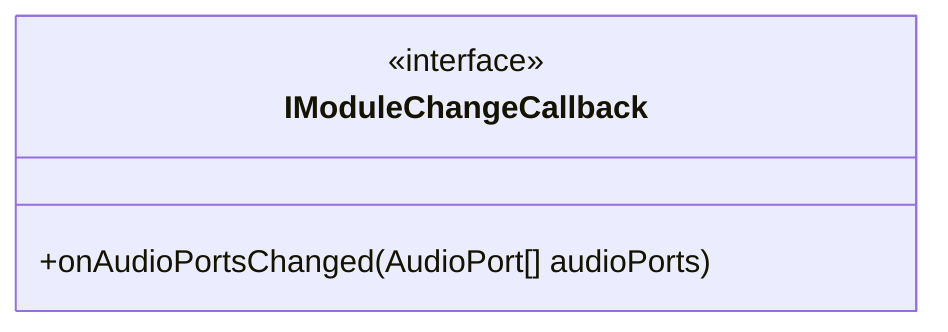
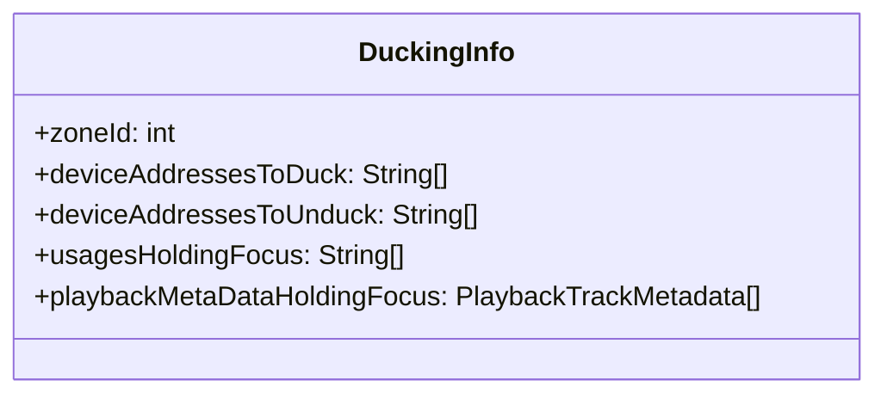
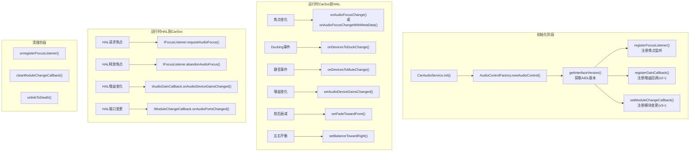

## 10.2 核心接口

> [← 上一个](10_10.1_AudioControl_HAL总览.md) | [← 返回10章](README.md) | [返回导航](../README.md) | [下一个 →](10_10.3_焦点回调流程.md)

---

### 10.2.1 IAudioControl — 主控制接口(AIDL)

[`IAudioControl`](hardware/interfaces/automotive/audiocontrol/aidl/android/hardware/automotive/audiocontrol/IAudioControl.aidl:62) 是AudioControl HAL的核心接口，CarAudioService通过它向HAL下发控制命令。

#### 方法详解

| 方法 | 引入版本 | 调用方向 | oneway | 说明 |
|------|---------|---------|--------|------|
| `onAudioFocusChange()` | v1 | CarSvc→HAL | ✅ | 通知HAL焦点状态变化(deprecated v2+) |
| `onDevicesToDuckChange()` | v1 | CarSvc→HAL | ✅ | 通知HAL需要Ducking的设备列表 |
| `onDevicesToMuteChange()` | v1 | CarSvc→HAL | ✅ | 通知HAL需要静音的设备列表 |
| `registerFocusListener()` | v1 | CarSvc→HAL | ✅ | 注册焦点监听器，HAL通过它请求/释放焦点 |
| `setBalanceTowardRight()` | v1 | CarSvc→HAL | ✅ | 设置左右平衡，+1全右-1全左0居中 |
| `setFadeTowardFront()` | v1 | CarSvc→HAL | ✅ | 设置前后衰减，+1全前-1全后0居中 |
| `onAudioFocusChangeWithMetaData()` | v2 | CarSvc→HAL | ✅ | 带Metadata的焦点变化通知(替代deprecated方法) |
| `setAudioDeviceGainsChanged()` | v2 | CarSvc→HAL | ✅ | 通知HAL增益配置变化及原因 |
| `registerGainCallback()` | v2 | CarSvc→HAL | ✅ | 注册增益回调，HAL通过它报告自发增益变化 |
| `setModuleChangeCallback()` | v3 | CarSvc→HAL | ❌ | 设置模块变更回调(同步调用，可抛异常) |
| `clearModuleChangeCallback()` | v3 | CarSvc→HAL | ❌ | 清除模块变更回调 |

**关键设计说明**（源码注释）：

1. **oneway设计**：大部分方法标记为`oneway`，避免HAL等待CarSvc响应。HAL可在收到`AUDIOFOCUS_GAIN`回调前就开始播放音频，也可忽略`AUDIOFOCUS_LOSS`继续播放。

2. **registerFocusListener替换语义**（源码 [`IAudioControl.aidl:124`](hardware/interfaces/automotive/audiocontrol/aidl/android/hardware/automotive/audiocontrol/IAudioControl.aidl:124)）：若已注册listener，新调用会替换旧listener。若observer死亡，HAL必须自动注销。

3. **setModuleChangeCallback异常**（源码 [`IAudioControl.aidl:185`](hardware/interfaces/automotive/audiocontrol/aidl/android/hardware/automotive/audiocontrol/IAudioControl.aidl:185)）：
   - `EX_UNSUPPORTED_OPERATION`：不支持动态音频配置
   - `EX_ILLEGAL_STATE`：已有callback注册
   - `EX_ILLEGAL_ARGUMENT`：callback为null

### 10.2.2 IFocusListener — 焦点监听器(AIDL)

[`IFocusListener`](hardware/interfaces/automotive/audiocontrol/aidl/android/hardware/automotive/audiocontrol/IFocusListener.aidl:34) 是HAL侧向CarAudioService请求/释放焦点的回调接口。

#### 方法详解

| 方法 | 引入版本 | 调用方向 | oneway | 说明 |
|------|---------|---------|--------|------|
| `requestAudioFocus()` | v1 | HAL→CarSvc | ✅ | HAL请求焦点(deprecated v2+) |
| `abandonAudioFocus()` | v1 | HAL→CarSvc | ✅ | HAL释放焦点(deprecated v2+) |
| `requestAudioFocusWithMetaData()` | v2 | HAL→CarSvc | ✅ | 带Metadata的焦点请求 |
| `abandonAudioFocusWithMetaData()` | v2 | HAL→CarSvc | ✅ | 带Metadata的焦点释放 |

**Usage参数格式**：v1方法中usage参数为XSD字符串格式（如`"MEDIA"`, `"NAVIGATION"`, `"ASSISTANCE_NAVIGATION_GUIDANCE"`），与`audio_policy_configuration.xsd`中`audioUsage`对应。v2方法改用`PlaybackTrackMetadata`，支持更丰富的标识（usage+contentType+tags）。

**focusGain有效值**（源码 [`IFocusListener.aidl:65`](hardware/interfaces/automotive/audiocontrol/aidl/android/hardware/automotive/audiocontrol/IFocusListener.aidl:65)）：

| AudioFocusChange常量 | 值 | 说明 |
|---------------------|---|------|
| GAIN | 1 | 永久获得焦点 |
| GAIN_TRANSIENT | 2 | 短暂获得焦点(如提示音) |
| GAIN_TRANSIENT_MAY_DUCK | 3 | 短暂获得焦点，允许其他音频Duck |
| GAIN_TRANSIENT_EXCLUSIVE | 4 | 短暂独占焦点(如紧急警报) |

**Metadata的Tag规范**（源码 [`IAudioControl.aidl:51`](hardware/interfaces/automotive/audiocontrol/aidl/android/hardware/automotive/audiocontrol/IAudioControl.aidl:51)）：
- 必须为`key=value`格式
- Vendor必须使用命名空间前缀（如`com.google.strategy=VR`）
- Tag必须与`audio_policy_engine_configuration.xml`中定义的`AudioProductStrategy`一致

### 10.2.3 IAudioGainCallback — 增益回调(AIDL v2+)

[`IAudioGainCallback`](hardware/interfaces/automotive/audiocontrol/aidl/android/hardware/automotive/audiocontrol/IAudioGainCallback.aidl:37) 是HAL自发通知增益变化的回调。

**设计理念**（源码注释 [`IAudioGainCallback.aidl:27-37`](hardware/interfaces/automotive/audiocontrol/aidl/android/hardware/automotive/audiocontrol/IAudioGainCallback.aidl:27)）：

这是`onDevicesToDuckChange`、`onDevicesToMuteChange`和`setAudioDeviceGainsChanged`的**反向API**：
- 上述三个API是CarSvc决定Mute/Duck后**委派给HAL执行**
- 本回调是HAL自主决定Mute/Duck后**通知上层**

**灵活性设计**：OEM可选择在HAL层或CarAudioService层处理Ducking/Muting：
- **关键场景**（法规要求）：在HAL层直接处理，更快响应
- **非关键场景**：上报gain和focus，由CarAudioService决策

### 10.2.4 IModuleChangeCallback — 模块变更回调(AIDL v3)

[`IModuleChangeCallback`](hardware/interfaces/automotive/audiocontrol/aidl/android/hardware/automotive/audiocontrol/IModuleChangeCallback.aidl:29) 是AIDL v3新增的运行时音频端口配置变更通知接口。

**AudioPort约束**（源码 [`IModuleChangeCallback.aidl:36-53`](hardware/interfaces/automotive/audiocontrol/aidl/android/hardware/automotive/audiocontrol/IModuleChangeCallback.aidl:36)）：

| 约束项 | 说明 |
|--------|------|
| V3范围限制 | 仅支持可配置AudioGain阶段 |
| Bus设备格式 | `AudioDevice{type: IN/OUT_DEVICE, connection: CONNECTION_BUS, address: string}` |
| Gain模式 | 仅支持`AudioGainMode::JOINT`，其他模式被忽略 |
| 同组一致性 | 映射到同一VolumeGroup的bus必须具有相同的gain stage |
| 范围约束 | 新gain stage必须是audio policy定义的子集(不超过原范围) |
| 重启回调 | AudioControl服务重启/恢复后，必须立即触发一次回调 |
| 客户端重启 | AudioControl服务必须清除过期callback |

### 10.2.5 数据结构详解

#### DuckingInfo

| 字段 | 类型 | 说明 |
|------|------|------|
| `zoneId` | int | 音频区域ID |
| `deviceAddressesToDuck` | String[] | 需要Duck的设备地址列表 |
| `deviceAddressesToUnduck` | String[] | 需要取消Duck的设备地址列表 |
| `usagesHoldingFocus` | String[] | 持有焦点的usage列表(XSD字符串格式) |
| `playbackMetaDataHoldingFocus` | PlaybackTrackMetadata[] | 持有焦点的播放元数据列表(v2+) |

**生成逻辑**（源码 [`CarHalAudioUtils.generateDuckingInfo()`](packages/services/Car/service/src/com/android/car/audio/CarHalAudioUtils.java:44)）：将`CarDuckingInfo`转换为HAL的`DuckingInfo`，usage转XSD字符串，metadata转数组。

#### MutingInfo

| 字段 | 类型 | 说明 |
|------|------|------|
| `zoneId` | int | 音频区域ID |
| `deviceAddressesToMute` | String[] | 需要静音的设备地址列表 |
| `deviceAddressesToUnmute` | String[] | 需要取消静音的设备地址列表 |

#### AudioGainConfigInfo

| 字段 | 类型 | 说明 |
|------|------|------|
| `zoneId` | int | 音频区域ID |
| `devicePortAddress` | String | Audio Port设备地址 |
| `volumeIndex` | int | 增益索引值 |

#### PlaybackTrackMetadata

| 字段 | 类型 | 说明 |
|------|------|------|
| `usage` | int | AudioAttributes usage |
| `contentType` | int | 内容类型(speech/music/movie/sonification) |
| `tags` | String[] | 标签列表(vendor需命名空间前缀) |
| `channelMask` | AudioChannelLayout | 通道布局 |
| `sourceDevice` | AudioDevice | 源设备描述 |

#### Reasons枚举

[`Reasons`](hardware/interfaces/automotive/audiocontrol/aidl/android/hardware/automotive/audiocontrol/Reasons.aidl) 使用bitmask设计，支持多个原因组合：

| 枚举值 | 十六进制 | 分类 | 说明 |
|--------|---------|------|------|
| `FORCED_MASTER_MUTE` | 0x1 | 安全静音 | 强制主静音(网络攻击/紧急按钮) |
| `REMOTE_MUTE` | 0x2 | 外部静音 | IVI外部静音请求(法规) |
| `TCU_MUTE` | 0x4 | 通信静音 | TCU发起静音(通话/紧急) |
| `ADAS_DUCKING` | 0x8 | 安全Ducking | ADAS场景Ducking(法规) |
| `NAV_DUCKING` | 0x10 | 功能Ducking | 导航播报Ducking |
| `PROJECTION_DUCKING` | 0x20 | 功能Ducking | 投影模式Ducking |
| `THERMAL_LIMITATION` | 0x40 | 保护限制 | 功放过热降额 |
| `SUSPEND_EXIT_VOL_LIMITATION` | 0x80 | 保护限制 | 挂起恢复后音量限制防爆音 |
| `EXTERNAL_AMP_VOL_FEEDBACK` | 0x100 | 同步反馈 | 外部功放音量同步 |
| `OTHER` | 0x80000000 | OEM扩展 | 其他OEM自定义原因 |

### 10.2.6 接口调用时序全景

### 10.2.7 HIDL接口对比

#### IAudioControl@2.0 (HIDL V2)

| 方法 | 说明 |
|------|------|
| `registerFocusListener(IFocusListener)` | 注册焦点监听，返回`ICloseHandle`用于注销 |
| `onAudioFocusChange(usage, zoneId, focusChange)` | 焦点状态通知，usage为int值 |
| `setFadeTowardFront(float)` | 前后衰减 |
| `setBalanceTowardRight(float)` | 左右平衡 |

**V2特有机制**：注册焦点监听器返回`ICloseHandle`对象，调用`close()`注销。AIDL版改为HAL自动注销。

#### IAudioControl@1.0 (HIDL V1)

| 方法 | 说明 |
|------|------|
| `setFadeTowardFront(float)` | 前后衰减 |
| `setBalanceTowardRight(float)` | 左右平衡 |
| `getBusForContext(int audioContext)` | **deprecated** 获取CarAudioContext对应的bus编号 |

`getBusForContext()`是V1遗留API，配合旧的`car_volume_groups.xml`使用。从V2开始，音量和路由配置改用`car_audio_configuration.xml`。

---

[← 上一个](10_10.1_AudioControl_HAL总览.md) | [← 返回10章](README.md) | [返回导航](../README.md) | [下一个 →](10_10.3_焦点回调流程.md)