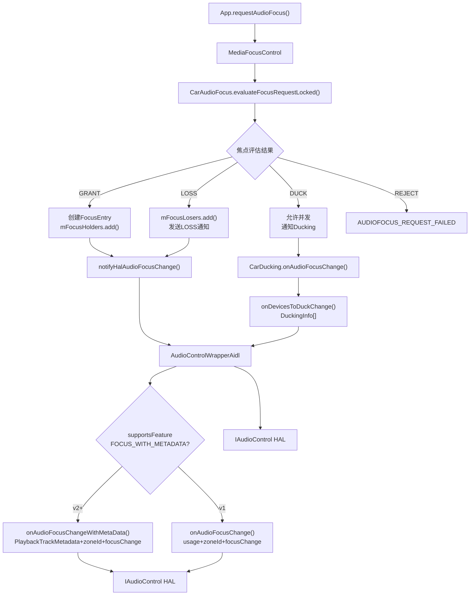
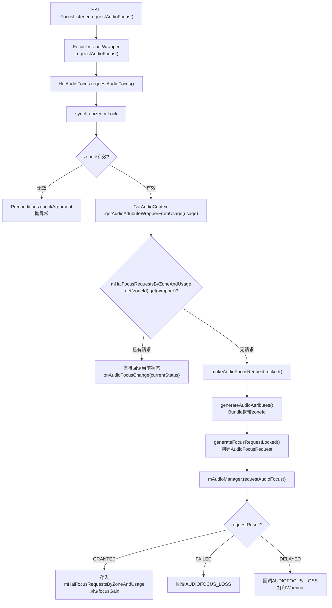
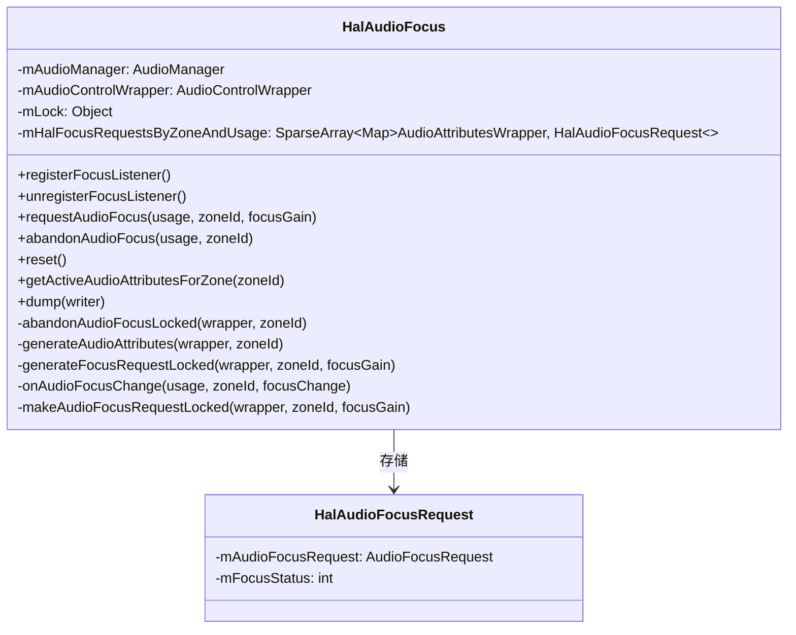
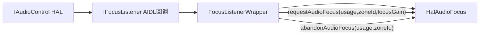
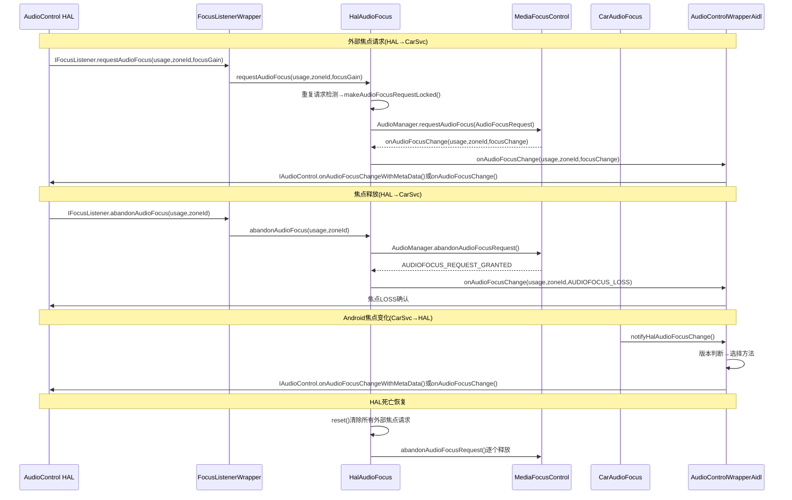

## 10.3 焦点回调流程

> [← 上一个](10_10.2_核心接口.md) | [← 返回10章](README.md) | [返回导航](../README.md) | [下一个 →](10_10.4_Ducking机制.md)

---

AudioControl HAL的焦点机制是**双向交互**：CarSvc→HAL通知焦点变化，HAL→CarSvc请求/释放外部焦点。本节深入解析两个方向的完整流程。

### 10.3.1 CarSvc→HAL焦点通知流程

当Android侧焦点状态变化时，CarAudioService通过AudioControlWrapper将变化通知给HAL。



**关键决策点** — 版本分发逻辑（源码 [`AudioControlWrapperAidl.java:130-148`](packages/services/Car/service/src/com/android/car/audio/hal/AudioControlWrapperAidl.java:130)）：

```java
// L130-148
public void onAudioFocusChange(int usage, int zoneId, int focusChange) {
    if (supportsFeature(AUDIO_FOCUS)) {
        if (supportsFeature(FOCUS_WITH_METADATA)) {
            PlaybackTrackMetadata metadata = ...;
            mAudioControl.onAudioFocusChangeWithMetaData(metadata, zoneId, focusChange);
        } else {
            mAudioControl.onAudioFocusChange(usageToXsdString(usage), zoneId, focusChange);
        }
    }
}
```

| 版本 | 调用方法 | 参数格式 |
|------|---------|---------|
| AIDL v3/v2 | `onAudioFocusChangeWithMetaData()` | `PlaybackTrackMetadata{usage,contentType,tags} + zoneId + focusChange` |
| AIDL v1 | `onAudioFocusChange()` | `XSD字符串usage + zoneId + focusChange` |
| HIDL V2 | `onAudioFocusChange()` | `int usage值 + zoneId + focusChange` |
| HIDL V1 | **不支持焦点通知** | 无此功能 |

### 10.3.2 HAL→CarSvc外部焦点请求流程

外部音频源(DSP/TCU/紧急系统)通过IFocusListener向CarSvc请求焦点，由[`HalAudioFocus`](packages/services/Car/service/src/com/android/car/audio/hal/HalAudioFocus.java:58)处理。



### 10.3.3 HalAudioFocus核心数据结构

[`HalAudioFocus`](packages/services/Car/service/src/com/android/car/audio/hal/HalAudioFocus.java:58) 使用两层嵌套Map管理外部焦点请求：



**核心字段**（源码 [`HalAudioFocus.java:61-70`](packages/services/Car/service/src/com/android/car/audio/hal/HalAudioFocus.java:61)）：

| 字段 | 类型 | 说明 |
|------|------|------|
| `mAudioManager` | AudioManager | 用于向Android框架请求/释放焦点 |
| `mAudioControlWrapper` | AudioControlWrapper | 用于向HAL回调焦点变化 |
| `mLock` | Object | 同步锁，保护mHalFocusRequestsByZoneAndUsage |
| `mHalFocusRequestsByZoneAndUsage` | `SparseArray<Map<AudioAttributesWrapper, HalAudioFocusRequest>>` | 两层映射：zoneId→(usage→request) |

**HalAudioFocusRequest**（源码 [`HalAudioFocus.java:313-337`](packages/services/Car/service/src/com/android/car/audio/hal/HalAudioFocus.java:313)）：

| 字段 | 类型 | 说明 |
|------|------|------|
| `mAudioFocusRequest` | AudioFocusRequest | Android框架焦点请求对象 |
| `mFocusStatus` | int | 当前焦点状态(GAIN/LOSS/DUCK等) |

### 10.3.4 requestAudioFocus源码深度解析

#### 重复请求检测（源码 [`HalAudioFocus.java:103-125`](packages/services/Car/service/src/com/android/car/audio/hal/HalAudioFocus.java:103)）

```java
// L103-125
public void requestAudioFocus(int usage, int zoneId, int focusGain) {
    synchronized (mLock) {
        // L105-106: zoneId校验
        Preconditions.checkArgument(mHalFocusRequestsByZoneAndUsage.contains(zoneId),
                "Invalid zoneId %d provided in requestAudioFocus", zoneId);
        // L111-112: 将usage转为AudioAttributesWrapper
        AudioAttributesWrapper wrapper = CarAudioContext.getAudioAttributeWrapperFromUsage(usage);
        // L113-114: 查找现有请求
        HalAudioFocusRequest currentRequest = mHalFocusRequestsByZoneAndUsage.get(zoneId).get(wrapper);
        if (currentRequest != null) {
            // L120: 重复请求，直接回调当前状态
            mAudioControlWrapper.onAudioFocusChange(usage, zoneId, currentRequest.mFocusStatus);
        } else {
            // L122: 新请求，走完整流程
            makeAudioFocusRequestLocked(wrapper, zoneId, focusGain);
        }
    }
}
```

**设计意义**：避免同一zone+usage的重复焦点请求，HAL持续持有焦点时只需回复当前状态。

#### makeAudioFocusRequestLocked（源码 [`HalAudioFocus.java:283-311`](packages/services/Car/service/src/com/android/car/audio/hal/HalAudioFocus.java:283)）

```java
// L283-311
private void makeAudioFocusRequestLocked(AudioAttributesWrapper wrapper, int zoneId, int focusGain) {
    AudioFocusRequest audioFocusRequest = generateFocusRequestLocked(wrapper, zoneId, focusGain);
    int requestResult = mAudioManager.requestAudioFocus(audioFocusRequest);
    int resultingFocusGain = focusGain;
    if (requestResult == AUDIOFOCUS_REQUEST_GRANTED) {
        // L295-298: 授予焦点，存入Map
        HalAudioFocusRequest req = new HalAudioFocusRequest(audioFocusRequest, focusGain);
        mHalFocusRequestsByZoneAndUsage.get(zoneId).put(wrapper, req);
    } else if (requestResult == AUDIOFOCUS_REQUEST_FAILED) {
        resultingFocusGain = AUDIOFOCUS_LOSS;
    } else if (requestResult == AUDIOFOCUS_REQUEST_DELAYED) {
        resultingFocusGain = AUDIOFOCUS_LOSS; // Delayed视为LOSS
    }
    // L308-310: 无论结果，都回调给HAL
    mAudioControlWrapper.onAudioFocusChange(wrapper.getAudioAttributes().getSystemUsage(),
            zoneId, resultingFocusGain);
}
```

### 10.3.5 abandonAudioFocus源码深度解析

#### abandonAudioFocusLocked（源码 [`HalAudioFocus.java:210-240`](packages/services/Car/service/src/com/android/car/audio/hal/HalAudioFocus.java:210)）

```java
// L210-240
private void abandonAudioFocusLocked(AudioAttributesWrapper wrapper, int zoneId) {
    Map<AudioAttributesWrapper, HalAudioFocusRequest> requests =
            mHalFocusRequestsByZoneAndUsage.get(zoneId);
    HalAudioFocusRequest currentRequest = requests.get(wrapper);
    if (currentRequest == null) {
        return; // 无请求可释放
    }
    requests.remove(wrapper); // 从Map中移除
    int result = mAudioManager.abandonAudioFocusRequest(currentRequest.mAudioFocusRequest);
    if (result == AUDIOFOCUS_REQUEST_GRANTED) {
        // L234-235: 成功释放，回调LOSS给HAL
        mAudioControlWrapper.onAudioFocusChange(
                wrapper.getAudioAttributes().getSystemUsage(), zoneId, AUDIOFOCUS_LOSS);
    }
}
```

### 10.3.6 ZoneId传递机制

[`generateAudioAttributes()`](packages/services/Car/service/src/com/android/car/audio/hal/HalAudioFocus.java:242) 是关键方法，通过Bundle携带zoneId信息：

```java
// L242-251
private AudioAttributes generateAudioAttributes(AudioAttributesWrapper wrapper, int zoneId) {
    AudioAttributes.Builder builder = new AudioAttributes.Builder(wrapper.getAudioAttributes());
    Bundle bundle = new Bundle();
    bundle.putInt(CarAudioManager.AUDIOFOCUS_EXTRA_REQUEST_ZONE_ID, zoneId);
    builder.addBundle(bundle);
    return builder.build();
}
```

**设计意义**：Android标准焦点框架不支持zone概念。通过Bundle附加`AUDIOFOCUS_EXTRA_REQUEST_ZONE_ID`，使CarAudioFocus能识别请求来自哪个音频区域，实现多区域焦点隔离。

### 10.3.7 FocusListenerWrapper — 回调桥接

[`FocusListenerWrapper`](packages/services/Car/service/src/com/android/car/audio/hal/AudioControlWrapperAidl.java:340) 是AIDL回调到HalAudioFocus的桥接层：



**源码**（[`AudioControlWrapperAidl.java:340-400`](packages/services/Car/service/src/com/android/car/audio/hal/AudioControlWrapperAidl.java:340)）：

FocusListenerWrapper实现了IFocusListener的4个方法：
- `requestAudioFocus(usage, zoneId, focusGain)` → 调用`mHalFocusListener.requestAudioFocus()`
- `abandonAudioFocus(usage, zoneId)` → 调用`mHalFocusListener.abandonAudioFocus()`
- `requestAudioFocusWithMetaData(metadata, zoneId, focusGain)` → 提取usage后调用`requestAudioFocus()`
- `abandonAudioFocusWithMetaData(metadata, zoneId)` → 提取usage后调用`abandonAudioFocus()`

**Metadata降级处理**：v2的WithMetaData方法在FocusListenerWrapper中被降级处理——提取metadata中的usage字段，忽略contentType和tags，直接调用v1的requestAudioFocus方法。这是因为HalAudioFocus只按zone+usage管理焦点。

### 10.3.8 HAL死亡恢复 — reset流程

[`reset()`](packages/services/Car/service/src/com/android/car/audio/hal/HalAudioFocus.java:146) 在HAL死亡时被调用，清除所有外部焦点请求：

```java
// L146-160
public void reset() {
    synchronized (mLock) {
        for (int i = 0; i < mHalFocusRequestsByZoneAndUsage.size(); i++) {
            int zoneId = mHalFocusRequestsByZoneAndUsage.keyAt(i);
            Map<AudioAttributesWrapper, HalAudioFocusRequest> requests =
                    mHalFocusRequestsByZoneAndUsage.valueAt(i);
            Set<AudioAttributesWrapper> wrapperSet = new ArraySet<>(requests.keySet());
            for (AudioAttributesWrapper wrapper : wrapperSet) {
                abandonAudioFocusLocked(wrapper, zoneId);
            }
        }
    }
}
```

**设计意义**：HAL进程死亡后，其持有的外部焦点请求不再有效。必须释放所有zone+usage维度的焦点，避免焦点资源永远被占用。重新注册FocusListener时，HAL需重新请求所需焦点。

### 10.3.9 焦点变化回调 — onAudioFocusChange

[`onAudioFocusChange()`](packages/services/Car/service/src/com/android/car/audio/hal/HalAudioFocus.java:266) 是Android框架焦点状态变化的通知入口：

```java
// L266-281
private void onAudioFocusChange(int usage, int zoneId, int focusChange) {
    AudioAttributesWrapper wrapper = CarAudioContext.getAudioAttributeWrapperFromUsage(usage);
    synchronized (mLock) {
        HalAudioFocusRequest currentRequest =
                mHalFocusRequestsByZoneAndUsage.get(zoneId).get(wrapper);
        if (currentRequest != null) {
            if (focusChange == AUDIOFOCUS_LOSS) {
                mHalFocusRequestsByZoneAndUsage.get(zoneId).remove(wrapper);
            } else {
                currentRequest.mFocusStatus = focusChange;
            }
            mAudioControlWrapper.onAudioFocusChange(usage, zoneId, focusChange);
        }
    }
}
```

**关键逻辑**：
- LOSS时从Map中移除请求（焦点已丢失，记录不再需要）
- 其他状态(GAIN/DUCK等)更新`mFocusStatus`（HAL后续重复请求时可直接回复）
- 仅对有记录的usage+zone回调（忽略无关的焦点变化）

### 10.3.10 完整双向时序图



---

[← 上一个](10_10.2_核心接口.md) | [← 返回10章](README.md) | [返回导航](../README.md) | [下一个 →](10_10.4_Ducking机制.md)