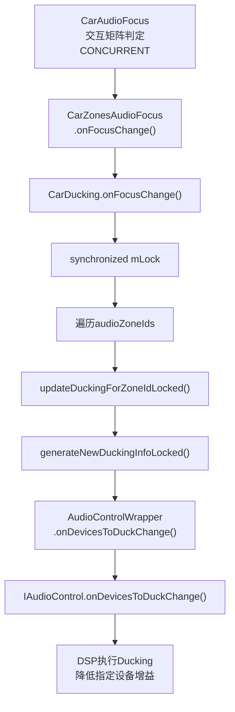
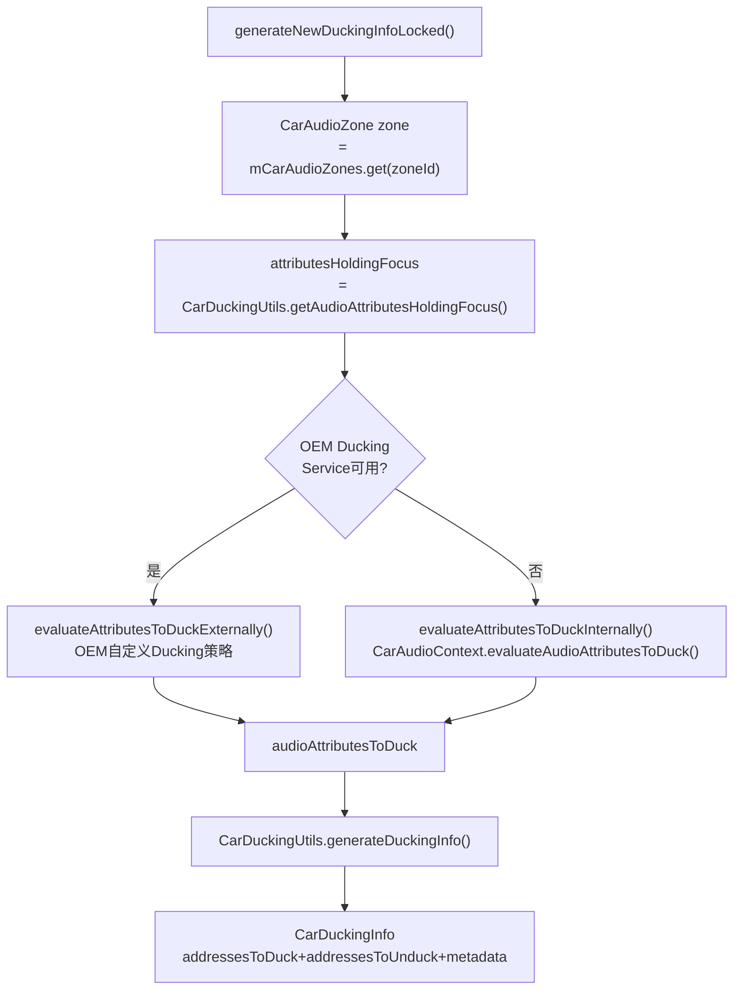
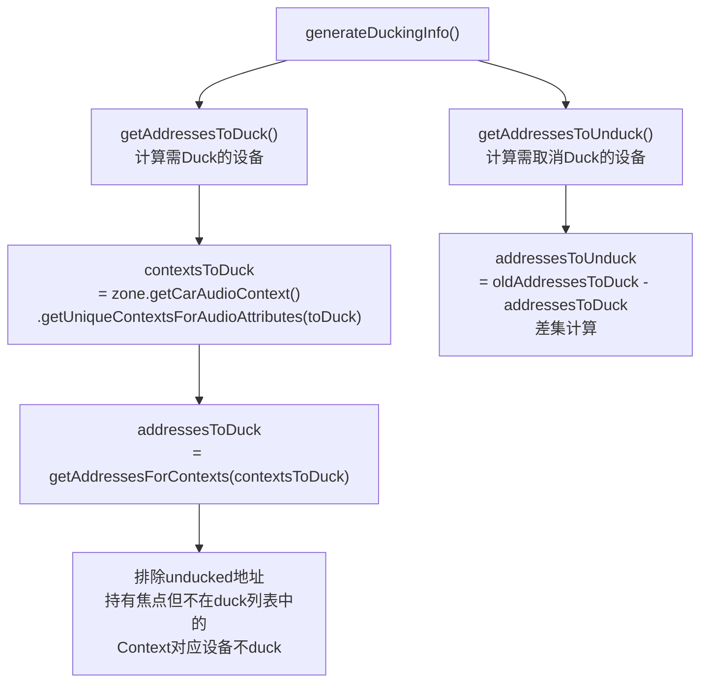
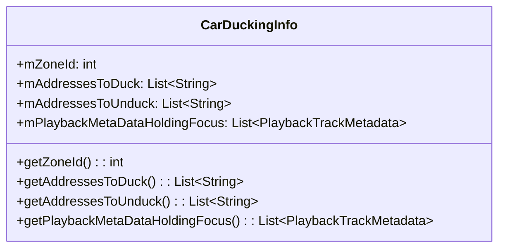
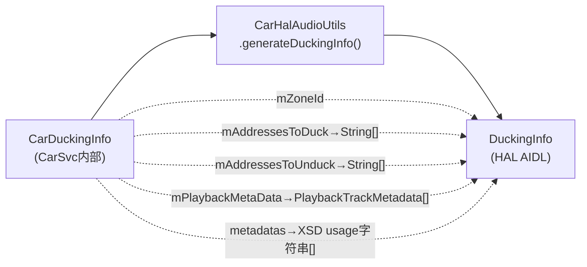
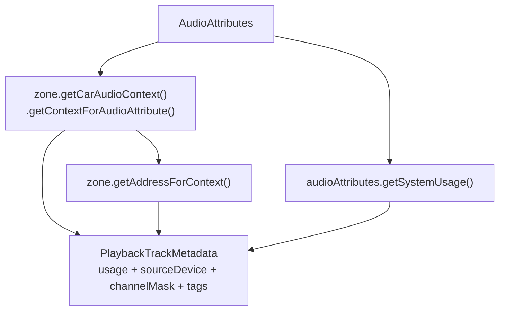
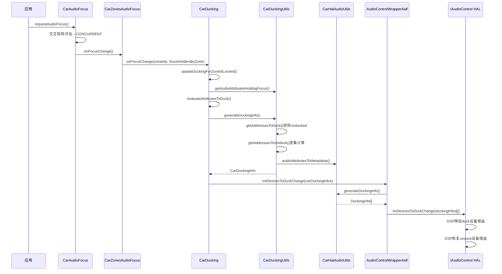

## 10.4 Ducking机制

> [← 上一个](10_10.3_焦点回调流程.md) | [← 返回10章](README.md) | [返回导航](../README.md) | [下一个 →](10_10.5_Muting机制.md)

---

AAOS的Ducking由CarAudioFocus交互矩阵自动触发，通过AudioControl HAL通知DSP执行，在硬件层面降低被Duck设备的增益。

### 10.4.1 Ducking触发入口

[`CarDucking`](packages/services/Car/service/src/com/android/car/audio/CarDucking.java:40) 实现了`CarFocusCallback`接口，焦点变化时由`CarZonesAudioFocus`回调：



**onFocusChange入口**（源码 [`CarDucking.java:72-83`](packages/services/Car/service/src/com/android/car/audio/CarDucking.java:72)）：

```java
// L72-83
public void onFocusChange(int[] audioZoneIds,
        SparseArray<List<AudioFocusInfo>> focusHoldersByZoneId) {
    synchronized (mLock) {
        List<CarDuckingInfo> newDuckingInfos = new ArrayList<>(audioZoneIds.length);
        for (int i = 0; i < audioZoneIds.length; i++) {
            int zoneId = audioZoneIds[i];
            List<AudioFocusInfo> focusHolders = focusHoldersByZoneId.get(zoneId);
            CarDuckingInfo newDuckingInfo = updateDuckingForZoneIdLocked(zoneId, focusHolders);
            newDuckingInfos.add(newDuckingInfo);
        }
        mAudioControlWrapper.onDevicesToDuckChange(newDuckingInfos);
    }
}
```

### 10.4.2 Ducking计算核心 — generateNewDuckingInfoLocked



**OEM扩展机制**（源码 [`CarDucking.java:129-152`](packages/services/Car/service/src/com/android/car/audio/CarDucking.java:129)）：

| 判断条件 | Ducking策略 |
|----------|------------|
| OEM Service可用 | `evaluateAttributesToDuckExternally()` — OEM自定义逻辑 |
| OEM Service不可用 | `evaluateAttributesToDuckInternally()` — 默认CarAudioContext策略 |

### 10.4.3 CarDuckingUtils — Ducking设备计算

[`CarDuckingUtils`](packages/services/Car/service/src/com/android/car/audio/CarDuckingUtils.java:27) 计算需要Duck和取消Duck的设备地址：



**关键逻辑**（源码 [`CarDuckingUtils.java:47-62`](packages/services/Car/service/src/com/android/car/audio/CarDuckingUtils.java:47)）：

1. **getAddressesToDuck**：将需要duck的AudioAttributes映射到Context，再映射到设备地址。排除持有焦点但不在duck列表中的Context对应的设备。
2. **getAddressesToUnduck**：旧duck地址 - 新duck地址 = 需要取消duck的地址。

**设计意义**：同一设备可能被多个Context映射，若其中一个Context持有焦点且不需要duck，该设备不应被duck。

### 10.4.4 CarDuckingInfo数据结构

[`CarDuckingInfo`](packages/services/Car/service/src/com/android/car/audio/CarDuckingInfo.java:37) 是CarSvc内部Ducking信息载体：



| 字段 | 类型 | 说明 |
|------|------|------|
| `mZoneId` | int | 音频区域ID |
| `mAddressesToDuck` | List\<String\> | 需要Duck的设备地址列表 |
| `mAddressesToUnduck` | List\<String\> | 需要取消Duck的设备地址列表 |
| `mPlaybackMetaDataHoldingFocus` | List\<PlaybackTrackMetadata\> | 持有焦点的播放元数据列表 |

### 10.4.5 CarDuckingInfo→HAL DuckingInfo转换

[`CarHalAudioUtils.generateDuckingInfo()`](packages/services/Car/service/src/com/android/car/audio/CarHalAudioUtils.java:44) 将CarSvc内部结构转为HAL AIDL结构：



**转换逻辑**（源码 [`CarHalAudioUtils.java:44-56`](packages/services/Car/service/src/com/android/car/audio/CarHalAudioUtils.java:44)）：

| CarSvc字段 | HAL字段 | 转换方式 |
|------------|---------|---------|
| `mZoneId` | `zoneId` | 直接赋值 |
| `mAddressesToDuck` | `deviceAddressesToDuck` | `List.toArray(String[])` |
| `mAddressesToUnduck` | `deviceAddressesToUnduck` | `List.toArray(String[])` |
| `mPlaybackMetaDataHoldingFocus` | `playbackMetaDataHoldingFocus` | `List.toArray(PlaybackTrackMetadata[])` |
| `mPlaybackMetaDataHoldingFocus` | `usagesHoldingFocus` | `metadatasToUsageStrings()` — usage→XSD字符串 |

### 10.4.6 AudioControlWrapperAidl.onDevicesToDuckChange

源码 [`AudioControlWrapperAidl.java:220-233`](packages/services/Car/service/src/com/android/car/audio/hal/AudioControlWrapperAidl.java:220)：

```java
// L220-233
public void onDevicesToDuckChange(List<CarDuckingInfo> carDuckingInfos) {
    DuckingInfo[] duckingInfos = new DuckingInfo[carDuckingInfos.size()];
    for (int i = 0; i < carDuckingInfos.size(); i++) {
        duckingInfos[i] = CarHalAudioUtils.generateDuckingInfo(carDuckingInfos.get(i));
    }
    try {
        mAudioControl.onDevicesToDuckChange(duckingInfos);
    } catch (RemoteException e) {
        Slogf.e(TAG, e, "onDevicesToDuckChange failed");
    }
}
```

### 10.4.7 PlaybackTrackMetadata生成

[`CarHalAudioUtils.audioAttributeToMetadata()`](packages/services/Car/service/src/com/android/car/audio/CarHalAudioUtils.java:71) 将AudioAttributes转为PlaybackTrackMetadata：



| 字段 | 值来源 | 说明 |
|------|--------|------|
| `usage` | `audioAttributes.getSystemUsage()` | AudioAttributes的系统usage |
| `contentType` | 未设置 | Ducking场景不需要 |
| `tags` | `new String[0]` | 空数组 |
| `channelMask` | `AudioChannelLayout.none(0)` | 无通道布局 |
| `sourceDevice.type` | `AudioDeviceDescription()` | 空描述 |
| `sourceDevice.address` | `AudioDeviceAddress.id(zoneAddress)` | Zone的设备地址 |

### 10.4.8 Ducking完整时序图



### 10.4.9 标准Android vs AAOS Ducking对比

| 对比维度 | 标准Android | AAOS |
|----------|------------|------|
| 触发机制 | App自行响应`LOSS_TRANSIENT_CAN_DUCK` | CarAudioFocus交互矩阵自动判定CONCURRENT |
| 执行位置 | App层(duckPlayers)或框架DuckingManager | DSP层(HAL执行) |
| 通知方式 | `AudioManager.OnAudioFocusChangeListener` | `IAudioControl.onDevicesToDuckChange()` |
| App感知 | App需处理Ducking回调 | App无感知，DSP直接降低增益 |
| 延迟 | 受App响应速度影响 | DSP层执行，延迟极低 |
| 精确度 | 按Player控制 | 按设备地址精确控制 |
| 适用场景 | 通用Android | 车载法规要求(ADAS/导航提示) |

---

[← 上一个](10_10.3_焦点回调流程.md) | [← 返回10章](README.md) | [返回导航](../README.md) | [下一个 →](10_10.5_Muting机制.md)