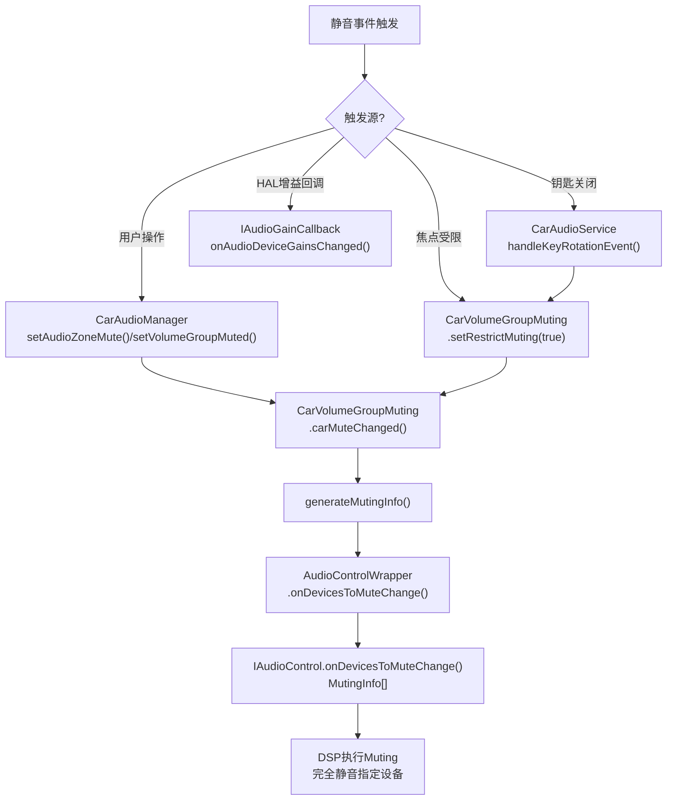
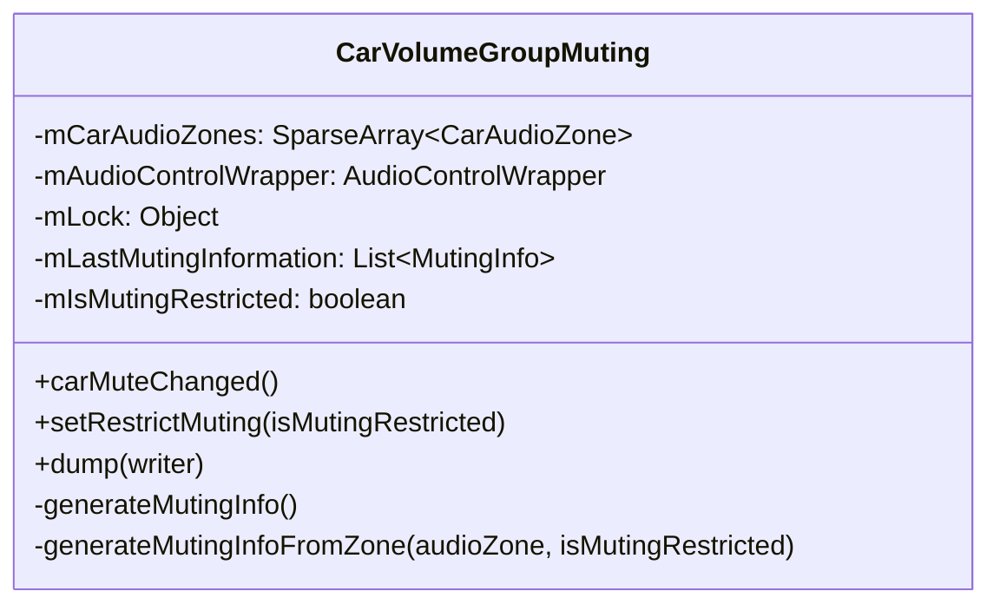
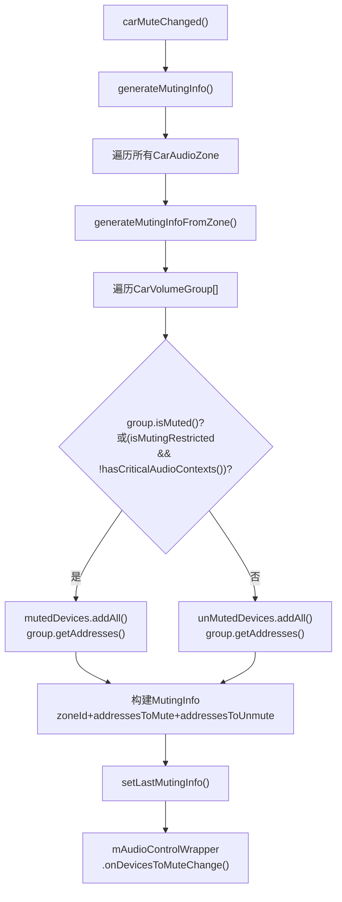
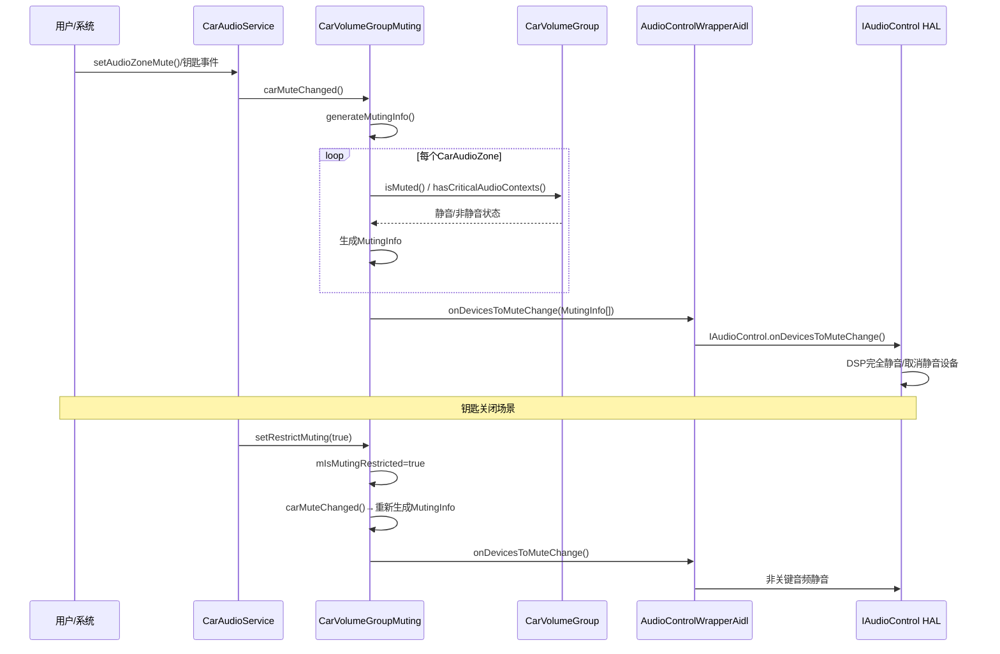

## 10.5 Muting机制

> [← 上一个](10_10.4_Ducking机制.md) | [← 返回10章](README.md) | [返回导航](../README.md) | [下一个 →](10_10.6_AudioControlWrapperAidl-AIDL适配层架构.md)

---

AAOS的Muting机制通过`IAudioControl.onDevicesToMuteChange()`通知HAL完全静音/取消静音指定设备，由[`CarVolumeGroupMuting`](packages/services/Car/service/src/com/android/car/audio/CarVolumeGroupMuting.java:38)管理。

### 10.5.1 Muting触发源与流程



### 10.5.2 CarVolumeGroupMuting核心架构



**核心字段**（源码 [`CarVolumeGroupMuting.java:38-50`](packages/services/Car/service/src/com/android/car/audio/CarVolumeGroupMuting.java:38)）：

| 字段 | 类型 | 说明 |
|------|------|------|
| `mCarAudioZones` | `SparseArray<CarAudioZone>` | 所有音频区域 |
| `mAudioControlWrapper` | AudioControlWrapper | HAL通信层 |
| `mLastMutingInformation` | `List<MutingInfo>` | 上次MutingInfo(增量计算) |
| `mIsMutingRestricted` | boolean | 静音受限标志(钥匙关闭时为true) |

**前置校验**（源码 [`CarVolumeGroupMuting.java:62-68`](packages/services/Car/service/src/com/android/car/audio/CarVolumeGroupMuting.java:62)）：

```java
// L62-68
private static void requireGroupMutingSupported(AudioControlWrapper audioControlWrapper) {
    if (audioControlWrapper.supportsFeature(AUDIOCONTROL_FEATURE_AUDIO_GROUP_MUTING)) {
        return;
    }
    throw new IllegalStateException("audioUseCarVolumeGroupMuting is enabled but "
            + "IAudioControl HAL does not support volume group muting");
}
```

若配置启用了`audioUseCarVolumeGroupMuting`但HAL不支持`GROUP_MUTING`，直接抛异常。

### 10.5.3 carMuteChanged流程



**carMuteChanged**（源码 [`CarVolumeGroupMuting.java:72-79`](packages/services/Car/service/src/com/android/car/audio/CarVolumeGroupMuting.java:72)）：

```java
// L72-79
public void carMuteChanged() {
    List<MutingInfo> mutingInfo = generateMutingInfo();
    setLastMutingInfo(mutingInfo);
    mAudioControlWrapper.onDevicesToMuteChange(mutingInfo);
}
```

### 10.5.4 generateMutingInfoFromZone源码深度解析

源码 [`CarVolumeGroupMuting.java:146-170`](packages/services/Car/service/src/com/android/car/audio/CarVolumeGroupMuting.java:146)：

```java
// L146-170
static MutingInfo generateMutingInfoFromZone(CarAudioZone audioZone,
        boolean isMutingRestricted) {
    MutingInfo mutingInfo = new MutingInfo();
    mutingInfo.zoneId = audioZone.getId();
    List<String> mutedDevices = new ArrayList<>();
    List<String> unMutedDevices = new ArrayList<>();
    CarVolumeGroup[] groups = audioZone.getCurrentVolumeGroups();

    for (int groupIndex = 0; groupIndex < groups.length; groupIndex++) {
        CarVolumeGroup group = groups[groupIndex];
        if (group.isMuted() || (isMutingRestricted && !group.hasCriticalAudioContexts())) {
            mutedDevices.addAll(group.getAddresses());
        } else {
            unMutedDevices.addAll(group.getAddresses());
        }
    }

    mutingInfo.deviceAddressesToMute = mutedDevices.toArray(new String[mutedDevices.size()]);
    mutingInfo.deviceAddressesToUnmute = unMutedDevices.toArray(new String[unMutedDevices.size()]);
    return mutingInfo;
}
```

**静音判定逻辑**：

| 条件 | 结果 | 说明 |
|------|------|------|
| `group.isMuted() == true` | 静音 | VolumeGroup被用户/系统显式静音 |
| `isMutingRestricted && !hasCriticalAudioContexts()` | 静音 | 静音受限(钥匙关闭)且非关键音频 |
| 其他 | 不静音 | 正常播放或关键音频不受限 |

**关键音频保护**：`hasCriticalAudioContexts()`判断VolumeGroup是否包含关键Context（如紧急/安全相关），关键音频在静音受限时也不被静音。

### 10.5.5 setRestrictMuting — 钥匙事件处理

源码 [`CarVolumeGroupMuting.java:81-87`](packages/services/Car/service/src/com/android/car/audio/CarVolumeGroupMuting.java:81)：

```java
// L81-87
public void setRestrictMuting(boolean isMutingRestricted) {
    synchronized (mLock) {
        mIsMutingRestricted = isMutingRestricted;
    }
    carMuteChanged(); // 立即通知HAL
}
```

**场景**：车辆熄火时，CarAudioService调用`setRestrictMuting(true)`，所有非关键VolumeGroup被静音。车辆发动时，调用`setRestrictMuting(false)`恢复正常。

### 10.5.6 AudioControlWrapperAidl.onDevicesToMuteChange

源码 [`AudioControlWrapperAidl.java:235-246`](packages/services/Car/service/src/com/android/car/audio/hal/AudioControlWrapperAidl.java:235)：

```java
// L235-246
public void onDevicesToMuteChange(List<MutingInfo> carZonesMutingInfo) {
    MutingInfo[] mutingInfoToHal = carZonesMutingInfo
            .toArray(new MutingInfo[carZonesMutingInfo.size()]);
    try {
        mAudioControl.onDevicesToMuteChange(mutingInfoToHal);
    } catch (RemoteException e) {
        Slogf.e(TAG, e, "onDevicesToMuteChange failed");
    }
}
```

**注意**：MutingInfo直接使用HAL AIDL类型，无需CarHalAudioUtils转换（与DuckingInfo不同）。

### 10.5.7 Muting完整时序图



### 10.5.8 Ducking vs Muting对比

| 维度 | Ducking | Muting |
|------|---------|--------|
| 音量变化 | 降低到duckLevel(约-20dB) | 完全静音(-∞dB) |
| 触发 | 焦点交互矩阵CONCURRENT | 用户操作/钥匙事件/静音受限 |
| 执行层 | DSP增益调整 | DSP完全静音 |
| App感知 | 无感知(不通知App) | 可能收到LOSS_TRANSIENT |
| 恢复 | CONCURRENT请求释放后自动恢复 | 需要显式取消静音 |
| HAL Feature | `AUDIO_DUCKING`(AIDL v1+) | `GROUP_MUTING`(AIDL v1+) |
| 数据结构 | `DuckingInfo{duck,unduck,usages,metadata}` | `MutingInfo{mute,unmute}` |
| 典型场景 | 导航播报+音乐ducking | 钥匙关闭/车门打开静音 |
| 计算类 | `CarDucking` | `CarVolumeGroupMuting` |
| 增量计算 | addressesToUnduck差集 | addressesToUnmute直接列出 |

---

[← 上一个](10_10.4_Ducking机制.md) | [← 返回10章](README.md) | [返回导航](../README.md) | [下一个 →](10_10.6_AudioControlWrapperAidl-AIDL适配层架构.md)