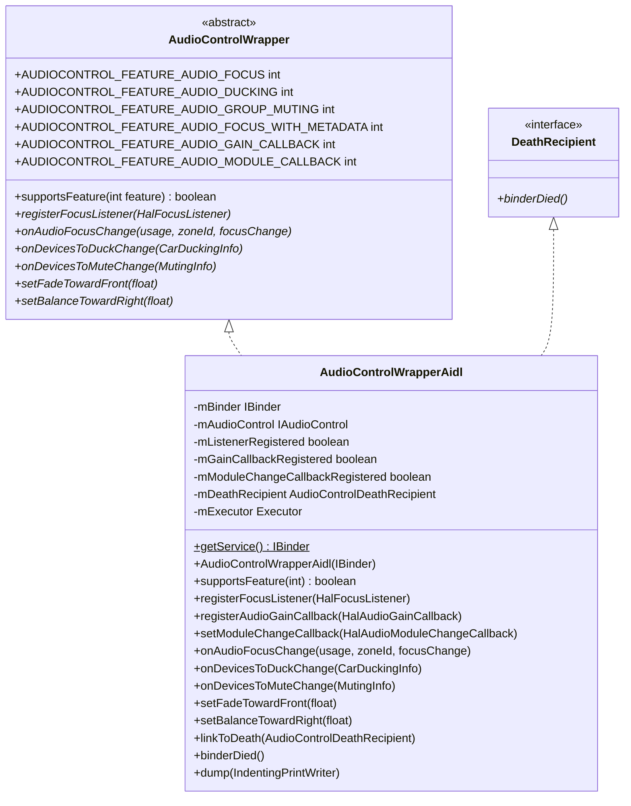
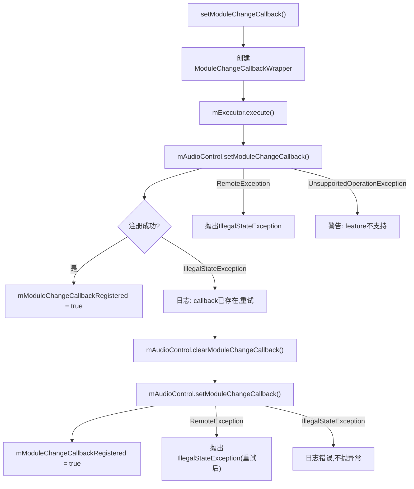
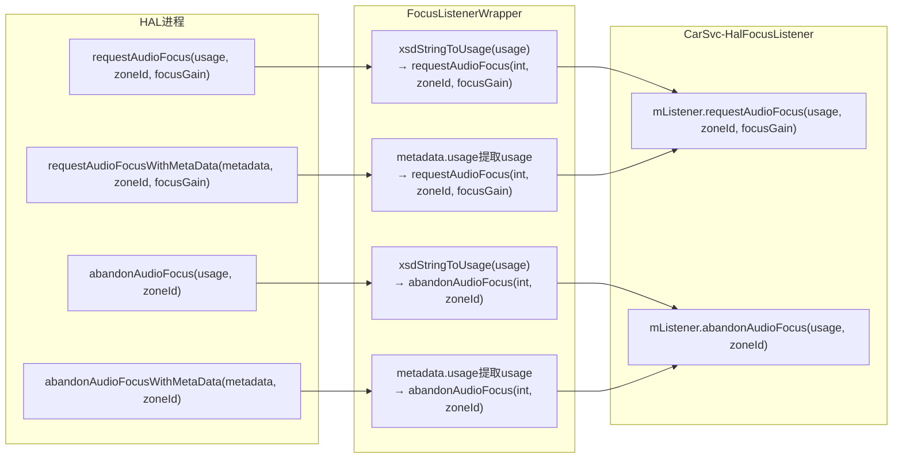
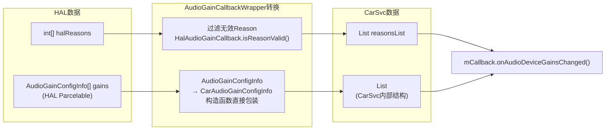
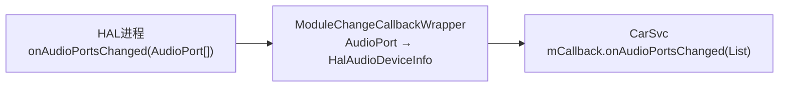
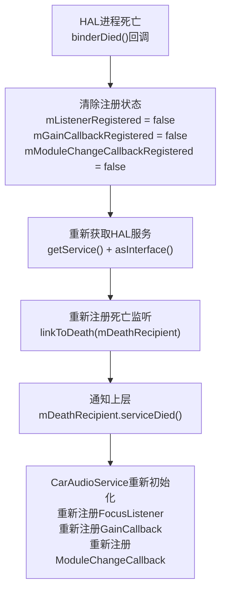

## 10.6 AudioControlWrapperAidl — AIDL适配层架构

> [← 上一个](10_10.5_Muting机制.md) | [← 返回10章](README.md) | [返回导航](../README.md) | [下一个 →](10_10.7_HalAudioFocus-外部焦点请求管理.md)

---

[`AudioControlWrapperAidl`](packages/services/Car/service/src/com/android/car/audio/hal/AudioControlWrapperAidl.java:59) 是AAOS Car Audio与AudioControl AIDL HAL之间的核心适配层，481行源码。它继承 [`AudioControlWrapper`](packages/services/Car/service/src/com/android/car/audio/hal/AudioControlWrapper.java) 抽象接口，同时实现 `IBinder.DeathRecipient` 处理HAL进程死亡。作为AIDL版本的唯一实现，它承载了v1/v2/v3三个版本的全部适配逻辑。

### 10.6.1 类整体结构与成员字段



**核心成员字段详解** (源码L62-76):

| 字段 | 类型 | 行号 | 用途 |
|------|------|------|------|
| `AUDIO_CONTROL_SERVICE` | String | L62 | AIDL服务名`android.hardware.automotive.audiocontrol.IAudioControl/default` |
| `AIDL_AUDIO_CONTROL_VERSION_1` | int=1 | L65 | 版本1常量，用于supportsFeature版本比较 |
| `AIDL_AUDIO_CONTROL_VERSION_2` | int=2 | L67 | 版本2常量，用于supportsFeature版本比较 |
| `mBinder` | IBinder | L68 | HAL服务Binder代理 |
| `mAudioControl` | IAudioControl | L69 | AIDL接口代理对象 |
| `mListenerRegistered` | boolean | L70 | FocusListener是否已注册到HAL |
| `mGainCallbackRegistered` | boolean | L71 | GainCallback是否已注册到HAL |
| `mModuleChangeCallbackRegistered` | boolean | L72 | ModuleChangeCallback是否已注册到HAL |
| `mDeathRecipient` | AudioControlDeathRecipient | L74 | 死亡通知接收者 |
| `mExecutor` | Executor | L76 | 单线程执行器，用于setModuleChangeCallback等异步操作 |

**构造与服务获取** (源码L78-85):

```java
// L78-80: 通过ServiceManager获取AIDL服务Binder
public static IBinder getService() {
    return ServiceManagerHelper.waitForDeclaredService(AUDIO_CONTROL_SERVICE);
}

// L82-85: 构造函数，将Binder转换为IAudioControl代理
public AudioControlWrapperAidl(IBinder binder) {
    mBinder = Objects.requireNonNull(binder);
    mAudioControl = IAudioControl.Stub.asInterface(binder);
}
```

### 10.6.2 supportsFeature版本协商机制

[`supportsFeature()`](packages/services/Car/service/src/com/android/car/audio/hal/AudioControlWrapperAidl.java:94) 是版本协商的核心方法，基于 `getInterfaceVersion()` 判断feature可用性:

```java
// L94-118: supportsFeature版本协商
public boolean supportsFeature(int feature) {
    switch (feature) {
        case AUDIOCONTROL_FEATURE_AUDIO_FOCUS:        // fall through
        case AUDIOCONTROL_FEATURE_AUDIO_DUCKING:      // fall through
        case AUDIOCONTROL_FEATURE_AUDIO_GROUP_MUTING: // AIDL始终支持这3个
            return true;
        case AUDIOCONTROL_FEATURE_AUDIO_FOCUS_WITH_METADATA: // fall through
        case AUDIOCONTROL_FEATURE_AUDIO_GAIN_CALLBACK:
            try {
                return mAudioControl.getInterfaceVersion() > AIDL_AUDIO_CONTROL_VERSION_1;
                // version > 1 即 v2+ 支持
            } catch (RemoteException e) { ... }
            return false;
        case AUDIOCONTROL_FEATURE_AUDIO_MODULE_CALLBACK:
            try {
                return mAudioControl.getInterfaceVersion() > AIDL_AUDIO_CONTROL_VERSION_2;
                // version > 2 即 v3 支持
            } catch (RemoteException e) { ... }
            return false;
        default:
            return false;
    }
}
```

**版本-Feature映射矩阵**:

| Feature常量 | AIDL v1 | AIDL v2 | AIDL v3 | 判断条件 |
|-------------|---------|---------|---------|---------|
| AUDIO_FOCUS | ✓ | ✓ | ✓ | 始终true |
| AUDIO_DUCKING | ✓ | ✓ | ✓ | 始终true |
| AUDIO_GROUP_MUTING | ✓ | ✓ | ✓ | 始终true |
| FOCUS_WITH_METADATA | ✗ | ✓ | ✓ | version > 1 |
| AUDIO_GAIN_CALLBACK | ✗ | ✓ | ✓ | version > 1 |
| AUDIO_MODULE_CALLBACK | ✗ | ✗ | ✓ | version > 2 |

**关键设计点**:
- AIDL版本天生支持FOCUS/DUCKING/GROUP_MUTING三个基础feature（不同于HIDL V1不支持任何feature）
- FOCUS_WITH_METADATA和GAIN_CALLBACK绑定在v2+，因为IFocusListener.v2新增了WithMetaData方法
- MODULE_CALLBACK绑定在v3+，因为IModuleChangeCallback是v3新增接口
- RemoteException时返回false，安全降级

### 10.6.3 CarSvc→HAL方向：焦点与Ducking/Muting通知

#### onAudioFocusChange (L156-168)

```java
// L156-168: CarSvc通知HAL焦点变化
public void onAudioFocusChange(int usage, int zoneId, int focusChange) {
    String usageName = usageToXsdString(usage); // 转换为XSD字符串格式
    mAudioControl.onAudioFocusChange(usageName, zoneId, focusChange);
}
```

**关键转换**: `usage(int)` → `usageToXsdString()` → XSD字符串(如`"MEDIA"`, `"NAVIGATION"`)。AIDL HAL接口使用XSD字符串而非int值，这是AIDL设计规范要求。

#### onDevicesToDuckChange (L219-233)

```java
// L219-233: CarSvc通知HAL Ducking变化
public void onDevicesToDuckChange(List<CarDuckingInfo> carDuckingInfos) {
    DuckingInfo[] duckingInfos = new DuckingInfo[carDuckingInfos.size()];
    for (int i = 0; i < carDuckingInfos.size(); i++) {
        duckingInfos[i] = CarHalAudioUtils.generateDuckingInfo(carDuckingInfos.get(i));
        // CarDuckingInfo → HAL DuckingInfo 转换
    }
    mAudioControl.onDevicesToDuckChange(duckingInfos);
}
```

**数据转换链**: `CarDuckingInfo`(CarSvc内部) → [`CarHalAudioUtils.generateDuckingInfo()`](packages/services/Car/service/src/com/android/car/audio/CarHalAudioUtils.java:44) → `DuckingInfo`(HAL Parcelable)

#### onDevicesToMuteChange (L235-246)

```java
// L235-246: CarSvc通知HAL Muting变化
public void onDevicesToMuteChange(List<MutingInfo> carZonesMutingInfo) {
    Objects.requireNonNull(carZonesMutingInfo, "Muting info can not be null");
    Preconditions.checkArgument(!carZonesMutingInfo.isEmpty(), "Muting info can not be empty");
    MutingInfo[] mutingInfoToHal = carZonesMutingInfo.toArray(new MutingInfo[0]);
    mAudioControl.onDevicesToMuteChange(mutingInfoToHal);
}
```

**关键差异**: MutingInfo直接使用HAL的Parcelable结构，无需额外转换（CarVolumeGroupMuting已直接生成HAL MutingInfo），而DuckingInfo需要CarHalAudioUtils中转。

#### setFadeTowardFront / setBalanceTowardRight (L201-217)

```java
// L201-217: 前后淡入/左右平衡控制，直接转发float值
public void setFadeTowardFront(float value) {
    mAudioControl.setFadeTowardFront(value); // 0.0=全后, 1.0=全前
}
public void setBalanceTowardRight(float value) {
    mAudioControl.setBalanceTowardRight(value); // 0.0=全左, 1.0=全右
}
```

### 10.6.4 HAL→CarSvc方向：回调注册机制

三个回调注册方法对应三个内部Wrapper类，将HAL回调桥接到CarSvc:

#### registerFocusListener (L120-133)

```java
// L120-133: 注册焦点监听回调
public void registerFocusListener(HalFocusListener focusListener) {
    IFocusListener listenerWrapper = new FocusListenerWrapper(focusListener);
    mAudioControl.registerFocusListener(listenerWrapper);
    mListenerRegistered = true;
}
```

**Wrapper创建**: `HalFocusListener`(CarSvc接口) → `FocusListenerWrapper`(IFocusListener.Stub) → HAL通过此Stub回调CarSvc

#### registerAudioGainCallback (L135-149)

```java
// L135-149: 注册增益回调，需v2+支持
public void registerAudioGainCallback(HalAudioGainCallback gainCallback) {
    IAudioGainCallback agc = new AudioGainCallbackWrapper(gainCallback);
    mAudioControl.registerGainCallback(agc);
    mGainCallbackRegistered = true;
}
```

**前置条件**: CarAudioService调用前已通过`supportsFeature(AUDIO_GAIN_CALLBACK)`确认v2+

#### setModuleChangeCallback (L248-282)

```java
// L248-282: 设置模块变更回调，含重试逻辑
public void setModuleChangeCallback(HalAudioModuleChangeCallback moduleChangeCallback) {
    IModuleChangeCallback callback = new ModuleChangeCallbackWrapper(moduleChangeCallback);
    mExecutor.execute(() -> {
        try {
            mAudioControl.setModuleChangeCallback(callback);
            mModuleChangeCallbackRegistered = true;
        } catch (IllegalStateException e) {
            // CarSvc崩溃重启后回调已存在，先清除再重试
            mAudioControl.clearModuleChangeCallback();
            mAudioControl.setModuleChangeCallback(callback);
            mModuleChangeCallbackRegistered = true;
        }
    });
}
```

**重试机制流程**:



**关键设计点**:
- 使用`mExecutor`(单线程)执行，避免阻塞CarSvc主线程
- `IllegalStateException`表示HAL端已有callback(可能是CarSvc崩溃后重启)，先clear再set
- 第二次重试仍失败则只打日志不抛异常，防止CarSvc崩溃
- `clearModuleChangeCallback()`(L284-300)同样在executor中执行

### 10.6.5 FocusListenerWrapper — 焦点回调桥接

[`FocusListenerWrapper`](packages/services/Car/service/src/com/android/car/audio/hal/AudioControlWrapperAidl.java:332) 是`IFocusListener.Stub`的内部实现，将HAL焦点回调桥接到CarSvc的`HalFocusListener`:



**v1回调方法** (L351-361):
```java
// L351-361: v1方法接收XSD字符串usage
public void requestAudioFocus(String usage, int zoneId, int focusGain) {
    int usageValue = xsdStringToUsage(usage); // XSD字符串→int usage
    requestAudioFocus(usageValue, zoneId, focusGain);
}
public void abandonAudioFocus(String usage, int zoneId) {
    int usageValue = xsdStringToUsage(usage);
    abandonAudioFocus(usageValue, zoneId);
}
```

**v2回调方法(WithMetaData)** (L363-381):
```java
// L363-381: v2方法接收PlaybackTrackMetadata
public void requestAudioFocusWithMetaData(PlaybackTrackMetadata playbackMetaData,
        int zoneId, int focusGain) {
    requestAudioFocus(playbackMetaData.usage, zoneId, focusGain);
    // 降级处理：仅提取usage，忽略metadata中的其他字段
}
public void abandonAudioFocusWithMetaData(PlaybackTrackMetadata playbackMetaData,
        int zoneId) {
    abandonAudioFocus(playbackMetaData.usage, zoneId);
}
```

**Metadata降级处理**: v2 WithMetaData方法仅从`PlaybackTrackMetadata`中提取`usage`字段，丢弃`source`、`volume`、`channelMask`等字段。这是因为CarSvc的`HalFocusListener`接口仅接收usage，不处理完整metadata。

### 10.6.6 AudioGainCallbackWrapper — 增益回调桥接

[`AudioGainCallbackWrapper`](packages/services/Car/service/src/com/android/car/audio/hal/AudioControlWrapperAidl.java:392) 将HAL的`IAudioGainCallback`回调桥接到CarSvc的`HalAudioGainCallback`:

```java
// L411-449: onAudioDeviceGainsChanged实现
public void onAudioDeviceGainsChanged(int[] halReasons, AudioGainConfigInfo[] gains) {
    // 步骤1: HAL AudioGainConfigInfo → CarSvc CarAudioGainConfigInfo
    List<CarAudioGainConfigInfo> carAudioGainConfigs = new ArrayList<>();
    for (int index = 0; index < gains.length; index++) {
        carAudioGainConfigs.add(new CarAudioGainConfigInfo(gains[index]));
    }

    // 步骤2: 过滤无效Reason
    List<Integer> reasonsList = new ArrayList<>();
    for (int index = 0; index < halReasons.length; index++) {
        int halReason = halReasons[index];
        if (!HalAudioGainCallback.isReasonValid(halReason)) {
            Slogf.e(TAG, "invalid reasons %d reported, skipped", halReason);
            continue; // 跳过无效Reason
        }
        reasonsList.add(halReason);
    }

    // 步骤3: 转发给CarSvc回调
    mCallback.onAudioDeviceGainsChanged(reasonsList, carAudioGainConfigs);
}
```

**数据转换链**:



**关键处理**:
- `AudioGainConfigInfo` → `CarAudioGainConfigInfo`：直接通过构造函数包装，不丢失任何字段
- Reason有效性校验：[`HalAudioGainCallback.isReasonValid()`](packages/services/Car/service/src/com/android/car/audio/hal/HalAudioGainCallback.java) 确保Reason在合法范围内(0-9)
- 无效Reason被跳过并记录错误日志，不会导致整个回调失败

### 10.6.7 ModuleChangeCallbackWrapper — 模块变更回调桥接

[`ModuleChangeCallbackWrapper`](packages/services/Car/service/src/com/android/car/audio/hal/AudioControlWrapperAidl.java:452) 将HAL的`IModuleChangeCallback`回调桥接到CarSvc:

```java
// L471-479: onAudioPortsChanged实现
public void onAudioPortsChanged(AudioPort[] audioPorts) {
    List<HalAudioDeviceInfo> halAudioDeviceInfos = new ArrayList<>();
    for (int index = 0; index < audioPorts.length; index++) {
        halAudioDeviceInfos.add(new HalAudioDeviceInfo(audioPorts[index]));
    }
    mCallback.onAudioPortsChanged(halAudioDeviceInfos);
}
```

**数据转换**: `AudioPort`(HAL Parcelable) → `HalAudioDeviceInfo`(CarSvc内部) — 通过构造函数直接包装



### 10.6.8 binderDied死亡恢复与生命周期管理

[`binderDied()`](packages/services/Car/service/src/com/android/car/audio/hal/AudioControlWrapperAidl.java:318) 实现了`IBinder.DeathRecipient`接口，处理HAL进程意外死亡的场景:

```java
// L318-330: HAL进程死亡恢复
public void binderDied() {
    Slogf.w(TAG, "AudioControl HAL died. Fetching new handle");
    // 步骤1: 清除所有注册状态
    mListenerRegistered = false;
    mGainCallbackRegistered = false;
    mModuleChangeCallbackRegistered = false;

    // 步骤2: 重新获取HAL服务
    mBinder = AudioControlWrapperAidl.getService();
    mAudioControl = IAudioControl.Stub.asInterface(mBinder);

    // 步骤3: 重新注册死亡监听
    linkToDeath(mDeathRecipient);

    // 步骤4: 通知上层重新初始化
    if (mDeathRecipient != null) {
        mDeathRecipient.serviceDied();
    }
}
```

**死亡恢复完整流程**:



**linkToDeath / unlinkToDeath** (L302-316):

```java
// L302-316: 死亡监听注册与注销
public void linkToDeath(AudioControlDeathRecipient deathRecipient) {
    mBinder.linkToDeath(this, 0);  // this = DeathRecipient
    mDeathRecipient = deathRecipient;
}
public void unlinkToDeath() {
    mBinder.unlinkToDeath(this, 0);
    mDeathRecipient = null;
}
```

**关键设计**: `AudioControlDeathRecipient`是CarSvc定义的上层接口，`binderDied()`自身处理Binder层恢复，然后通过`serviceDied()`通知CarSvc层重新注册所有回调。

### 10.6.9 dump调试信息

[`dump()`](packages/services/Car/service/src/com/android/car/audio/hal/AudioControlWrapperAidl.java:172) 方法输出Wrapper运行时状态，用于dumpsys调试:

```java
// L172-199: dump输出
*Aidl Version: 3
  Focus listener registered on HAL? true
  Audio Gain Callback registered on HAL? true
  Module change Callback set on HAL? true
  Supported Features
    - AUDIOCONTROL_FEATURE_AUDIO_FOCUS
    - AUDIOCONTROL_FEATURE_AUDIO_DUCKING
    - AUDIOCONTROL_FEATURE_AUDIO_FOCUS_WITH_METADATA
    - AUDIOCONTROL_FEATURE_AUDIO_GAIN_CALLBACK
    - AUDIOCONTROL_FEATURE_AUDIO_MODULE_CALLBACK
```

**dump包含的关键信息**:
1. AIDL接口版本号（通过`getInterfaceVersion()`获取）
2. 三个回调注册状态
3. 当前支持的Feature列表（基于supportsFeature动态判断）

### 10.6.10 三个内部Wrapper对比与设计模式

| 维度 | FocusListenerWrapper | AudioGainCallbackWrapper | ModuleChangeCallbackWrapper |
|------|---------------------|-------------------------|----------------------------|
| 源码行 | L332-390 | L392-450 | L452-480 |
| 实现接口 | IFocusListener.Stub | IAudioGainCallback.Stub | IModuleChangeCallback.Stub |
| 代理目标 | HalFocusListener | HalAudioGainCallback | HalAudioModuleChangeCallback |
| 版本要求 | AIDL v1+ | AIDL v2+ | AIDL v3 |
| 注册方法 | registerFocusListener() | registerGainCallback() | setModuleChangeCallback() |
| 注销方法 | 无(自动注销) | 无(自动注销) | clearModuleChangeCallback() |
| 数据转换 | XSD字符串→int usage | AudioGainConfigInfo→CarAudioGainConfigInfo | AudioPort→HalAudioDeviceInfo |
| 特殊处理 | Metadata降级(仅提取usage) | Reason有效性过滤 | 无 |
| 注册方式 | 同步 | 同步 | 异步(mExecutor) |

**共同设计模式**: 三个Wrapper都采用相同的桥接模式 — 实现HAL AIDL的Stub接口，在回调方法中将HAL数据结构转换为CarSvc内部结构，然后转发给CarSvc的回调接口。这种设计将HAL数据结构与CarSvc完全解耦。

**异步注册差异**: `setModuleChangeCallback`使用`mExecutor`异步执行，而前两个是同步注册。原因是setModuleChangeCallback在AIDL侧是同步方法(非oneway)，可能阻塞调用线程，因此放到单独的executor中执行。

---

> [← 上一个](10_10.5_Muting机制.md) | [← 返回10章](README.md) | [返回导航](../README.md) | [下一个 →](10_10.7_HalAudioFocus-外部焦点请求管理.md)