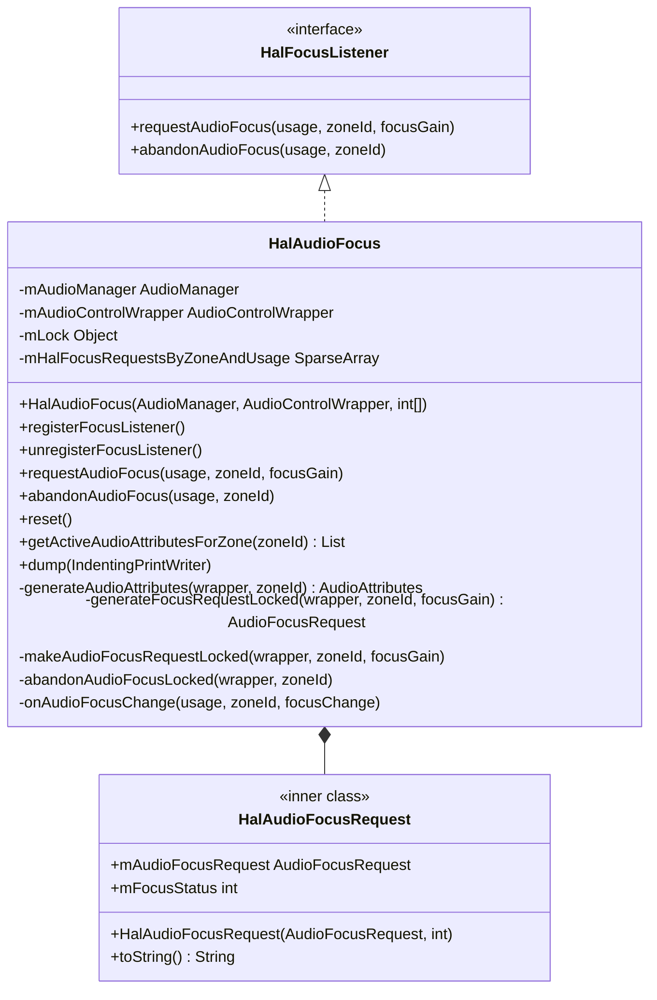
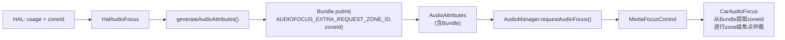
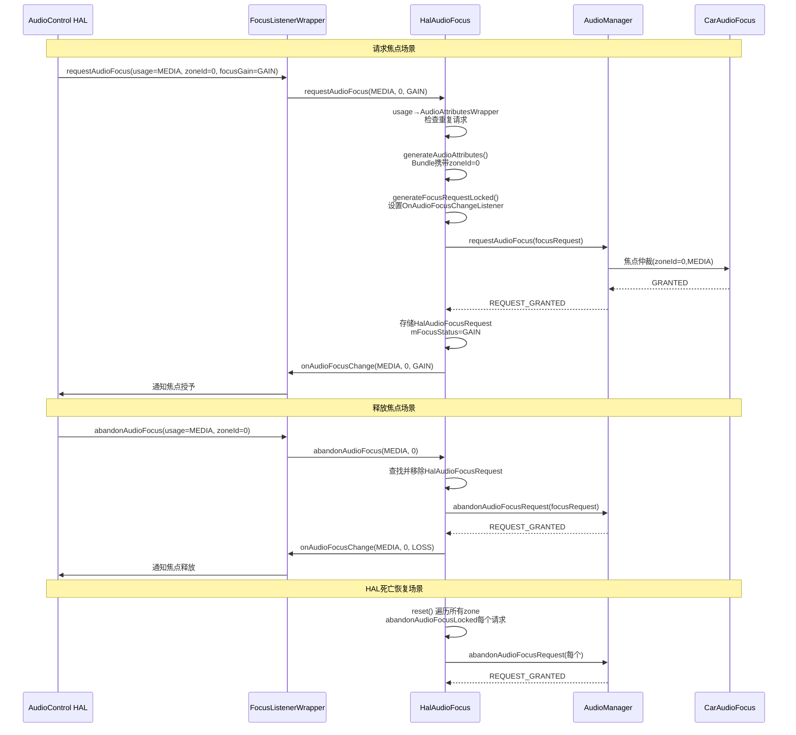

## 10.7 HalAudioFocus — 外部焦点请求管理

> [← 上一个](10_10.6_AudioControlWrapperAidl-AIDL适配层架构.md) | [← 返回10章](README.md) | [返回导航](../README.md) | [下一个 →](10_10.8_IAudioGainCallback-HAL增益回调链路.md)

---

[`HalAudioFocus`](packages/services/Car/service/src/com/android/car/audio/hal/HalAudioFocus.java:58) 是CarSvc中管理AudioControl HAL外部焦点请求的核心类，338行源码。它实现 [`HalFocusListener`](packages/services/Car/service/src/com/android/car/audio/hal/HalFocusListener.java) 接口，接收HAL侧发起的焦点请求/释放，代理向Android音频框架(AudioManager)申请焦点，并将结果回调给HAL。

### 10.7.1 类结构与核心成员



**核心成员字段** (源码L59-70):

| 字段 | 类型 | 行号 | 用途 |
|------|------|------|------|
| `mAudioManager` | AudioManager | L61 | 向Android音频框架请求/释放焦点 |
| `mAudioControlWrapper` | AudioControlWrapper | L62 | 向HAL通知焦点变化结果 |
| `mLock` | Object | L64 | 同步锁，保护mHalFocusRequestsByZoneAndUsage |
| `mHalFocusRequestsByZoneAndUsage` | SparseArray<Map<AudioAttributesWrapper, HalAudioFocusRequest>> | L69-70 | 两层映射：zoneId→(usage→request) |

**构造函数** (L72-83):

```java
// L72-83: 构造时预初始化每个zone的焦点请求Map
public HalAudioFocus(AudioManager audioManager, AudioControlWrapper audioControlWrapper,
        int[] audioZoneIds) {
    mAudioManager = Objects.requireNonNull(audioManager);
    mAudioControlWrapper = Objects.requireNonNull(audioControlWrapper);
    mHalFocusRequestsByZoneAndUsage = new SparseArray<>(audioZoneIds.length);
    for (int index = 0; index < audioZoneIds.length; index++) {
        mHalFocusRequestsByZoneAndUsage.put(audioZoneIds[index], new ArrayMap<>());
        // 每个zoneId预创建一个空的ArrayMap
    }
}
```

**设计要点**: 构造时传入所有zoneId，预先为每个zone创建空Map。后续requestAudioFocus/abandonAudioFocus中通过`Preconditions.checkArgument`校验zoneId合法性。

### 10.7.2 两层映射数据结构详解

`mHalFocusRequestsByZoneAndUsage` 是HalAudioFocus最核心的数据结构:

```
SparseArray<Map<AudioAttributesWrapper, HalAudioFocusRequest>>
  │         │            │                      │
  │         │            └── 内层Key:usage封装   └── 内层Value:请求信息
  └── 外层Key:zoneId
```

**数据结构示意**:

```
zoneId=0 → { MEDIA_WRAPPER → HalAudioFocusRequest(focusGain=GAIN, status=GRANTED)
             NAV_WRAPPER    → HalAudioFocusRequest(focusGain=GAIN_TRANSIENT, status=GRANTED) }
zoneId=1 → { CALL_WRAPPER   → HalAudioFocusRequest(focusGain=GAIN_TRANSIENT, status=GRANTED) }
zoneId=2 → { }  // 空Map，无外部焦点请求
```

**为什么使用两层映射**:
- **外层SparseArray(zoneId)**: AAOS多音频区域隔离，每个zone有独立焦点空间
- **内层Map(AudioAttributesWrapper)**: 同一zone内按usage区分不同焦点请求，防止重复
- **AudioAttributesWrapper**: 封装AudioAttributes提供equals/hashCode，作为Map的Key

### 10.7.3 requestAudioFocus源码深度解析

[`requestAudioFocus()`](packages/services/Car/service/src/com/android/car/audio/hal/HalAudioFocus.java:103) 处理HAL发起的外部焦点请求:

```java
// L103-125: requestAudioFocus完整源码逻辑
public void requestAudioFocus(int usage, int zoneId, int focusGain) {
    synchronized (mLock) {
        // 步骤1: 校验zoneId合法性
        Preconditions.checkArgument(mHalFocusRequestsByZoneAndUsage.contains(zoneId),
                "Invalid zoneId %d provided in requestAudioFocus", zoneId);

        // 步骤2: usage → AudioAttributesWrapper
        AudioAttributesWrapper audioAttributesWrapper =
                CarAudioContext.getAudioAttributeWrapperFromUsage(usage);

        // 步骤3: 检查是否已有相同zone+usage的请求
        HalAudioFocusRequest currentRequest =
                mHalFocusRequestsByZoneAndUsage.get(zoneId).get(audioAttributesWrapper);

        if (currentRequest != null) {
            // 步骤3a: 重复请求 → 直接回复当前焦点状态
            mAudioControlWrapper.onAudioFocusChange(usage, zoneId, currentRequest.mFocusStatus);
        } else {
            // 步骤3b: 新请求 → 向Android框架申请焦点
            makeAudioFocusRequestLocked(audioAttributesWrapper, zoneId, focusGain);
        }
    }
}
```

**重复请求检测逻辑**: 当HAL对同一zone+usage重复请求焦点时，不会重复向AudioManager申请，而是直接返回当前焦点状态给HAL。这是合理的幂等设计。

### 10.7.4 makeAudioFocusRequestLocked源码深度解析

[`makeAudioFocusRequestLocked()`](packages/services/Car/service/src/com/android/car/audio/hal/HalAudioFocus.java:283) 是实际向AudioManager申请焦点的方法:

```java
// L283-311: makeAudioFocusRequestLocked
private void makeAudioFocusRequestLocked(AudioAttributesWrapper audioAttributesWrapper,
        int zoneId, int focusGain) {
    // 步骤1: 生成AudioFocusRequest(含zoneId Bundle)
    AudioFocusRequest audioFocusRequest =
            generateFocusRequestLocked(audioAttributesWrapper, zoneId, focusGain);

    // 步骤2: 向AudioManager请求焦点
    int requestResult = mAudioManager.requestAudioFocus(audioFocusRequest);

    int resultingFocusGain = focusGain;

    // 步骤3: 处理请求结果
    if (requestResult == AUDIOFOCUS_REQUEST_GRANTED) {
        // 成功：存储请求信息
        HalAudioFocusRequest halAudioFocusRequest =
                new HalAudioFocusRequest(audioFocusRequest, focusGain);
        mHalFocusRequestsByZoneAndUsage.get(zoneId)
                .put(audioAttributesWrapper, halAudioFocusRequest);
    } else if (requestResult == AUDIOFOCUS_REQUEST_FAILED) {
        // 失败：结果为LOSS
        resultingFocusGain = AUDIOFOCUS_LOSS;
    } else if (requestResult == AUDIOFOCUS_REQUEST_DELAYED) {
        // 延迟：暂时按LOSS处理
        Slogf.w(TAG, "Delayed result for request...");
        resultingFocusGain = AUDIOFOCUS_LOSS;
    }

    // 步骤4: 通知HAL焦点结果
    mAudioControlWrapper.onAudioFocusChange(
            audioAttributesWrapper.getAudioAttributes().getSystemUsage(),
            zoneId, resultingFocusGain);
}
```

**请求结果处理矩阵**:

| AudioManager返回 | 处理 | resultingFocusGain | 通知HAL |
|-----------------|------|-------------------|---------|
| REQUEST_GRANTED | 存储请求 | focusGain(原值) | 是 |
| REQUEST_FAILED | 不存储 | AUDIOFOCUS_LOSS | 是 |
| REQUEST_DELAYED | 不存储 | AUDIOFOCUS_LOSS | 是 |

**关键设计**: DELAYED结果也按LOSS处理 — HAL不会等待异步焦点授予，而是先得到LOSS结果。后续如果框架授予焦点，`onAudioFocusChange`回调会更新状态。

### 10.7.5 generateFocusRequestLocked与ZoneId传递

[`generateFocusRequestLocked()`](packages/services/Car/service/src/com/android/car/audio/hal/HalAudioFocus.java:253) 构建AudioFocusRequest，其中最关键的是ZoneId的传递:

```java
// L253-264: 生成AudioFocusRequest
private AudioFocusRequest generateFocusRequestLocked(
        AudioAttributesWrapper audioAttributesWrapper, int zoneId, int focusGain) {
    AudioAttributes attributes = generateAudioAttributes(audioAttributesWrapper, zoneId);
    return new AudioFocusRequest.Builder(focusGain)
            .setAudioAttributes(attributes)
            .setOnAudioFocusChangeListener((int focusChange) -> {
                onAudioFocusChange(attributes.getSystemUsage(), zoneId, focusChange);
                // 焦点变化回调 → 通知HAL
            })
            .build();
}

// L242-251: generateAudioAttributes — ZoneId通过Bundle传递
private AudioAttributes generateAudioAttributes(
        AudioAttributesWrapper audioAttributesWrapper, int zoneId) {
    AudioAttributes.Builder builder =
            new AudioAttributes.Builder(audioAttributesWrapper.getAudioAttributes());
    Bundle bundle = new Bundle();
    bundle.putInt(CarAudioManager.AUDIOFOCUS_EXTRA_REQUEST_ZONE_ID, zoneId);
    builder.addBundle(bundle);
    return builder.build();
}
```

**ZoneId传递机制**:



**为什么用Bundle而非直接传zoneId**: AudioManager.requestAudioFocus()的API只接受AudioFocusRequest，没有zoneId参数。AAOS通过在AudioAttributes的Bundle中嵌入zoneId，使得CarAudioFocus能在焦点仲裁时识别请求所属zone。

### 10.7.6 abandonAudioFocusLocked源码深度解析

[`abandonAudioFocusLocked()`](packages/services/Car/service/src/com/android/car/audio/hal/HalAudioFocus.java:210) 处理HAL释放焦点请求:

```java
// L210-240: abandonAudioFocusLocked
private void abandonAudioFocusLocked(AudioAttributesWrapper audioAttributesWrapper,
        int zoneId) {
    Map<AudioAttributesWrapper, HalAudioFocusRequest> halAudioFocusRequests =
            mHalFocusRequestsByZoneAndUsage.get(zoneId);
    HalAudioFocusRequest currentRequest = halAudioFocusRequests.get(audioAttributesWrapper);

    if (currentRequest == null) {
        // 无对应请求 → 忽略(不报错)
        return;
    }

    // 从Map中移除
    halAudioFocusRequests.remove(audioAttributesWrapper);

    // 向AudioManager释放焦点
    int result = mAudioManager.abandonAudioFocusRequest(currentRequest.mAudioFocusRequest);

    if (result == AUDIOFOCUS_REQUEST_GRANTED) {
        // 释放成功 → 通知HAL焦点LOSS
        mAudioControlWrapper.onAudioFocusChange(
                audioAttributesWrapper.getAudioAttributes().getSystemUsage(),
                zoneId, AUDIOFOCUS_LOSS);
    } else {
        Slogf.w(TAG, "Failed to abandon focus...");
    }
}
```

**关键逻辑**:
1. 无对应请求时静默忽略（HAL可能重复释放）
2. 释放成功后主动通知HAL `AUDIOFOCUS_LOSS`，确认焦点已释放
3. 释放失败仅记录警告，不影响后续流程

### 10.7.7 onAudioFocusChange焦点变化回调

[`onAudioFocusChange()`](packages/services/Car/service/src/com/android/car/audio/hal/HalAudioFocus.java:266) 是AudioManager焦点变化通知的回调入口:

```java
// L266-281: Android框架焦点变化通知
private void onAudioFocusChange(int usage, int zoneId, int focusChange) {
    AudioAttributesWrapper wrapper = CarAudioContext.getAudioAttributeWrapperFromUsage(usage);
    synchronized (mLock) {
        HalAudioFocusRequest currentRequest =
                mHalFocusRequestsByZoneAndUsage.get(zoneId).get(wrapper);

        if (currentRequest != null) {
            if (focusChange == AUDIOFOCUS_LOSS) {
                // LOSS → 从Map中移除请求记录
                mHalFocusRequestsByZoneAndUsage.get(zoneId).remove(wrapper);
            } else {
                // 其他变化(GAIN/DUCK/LOSS_TRANSIENT等) → 更新焦点状态
                currentRequest.mFocusStatus = focusChange;
            }
            // 通知HAL焦点变化
            mAudioControlWrapper.onAudioFocusChange(usage, zoneId, focusChange);
        }
        // currentRequest == null 意味着焦点已在abandonAudioFocus中释放，忽略此回调
    }
}
```

**焦点变化处理矩阵**:

| focusChange | 操作 | 通知HAL |
|-------------|------|---------|
| AUDIOFOCUS_LOSS | 从Map移除请求 | 是(LOSS) |
| AUDIOFOCUS_GAIN | 更新mFocusStatus | 是(GAIN) |
| AUDIOFOCUS_LOSS_TRANSIENT | 更新mFocusStatus | 是 |
| AUDIOFOCUS_LOSS_TRANSIENT_CAN_DUCK | 更新mFocusStatus | 是 |

**关键**: LOSS时从Map移除，因为焦点已完全丢失，HAL需要重新requestAudioFocus才能再次获取。非LOSS变化仅更新状态。

### 10.7.8 reset — HAL死亡恢复

[`reset()`](packages/services/Car/service/src/com/android/car/audio/hal/HalAudioFocus.java:146) 在HAL进程死亡时被调用，清除所有外部焦点请求:

```java
// L146-160: 清除所有外部焦点请求
public void reset() {
    Slogf.d(TAG, "Resetting HAL Audio Focus requests");
    synchronized (mLock) {
        for (int i = 0; i < mHalFocusRequestsByZoneAndUsage.size(); i++) {
            int zoneId = mHalFocusRequestsByZoneAndUsage.keyAt(i);
            Map<AudioAttributesWrapper, HalAudioFocusRequest> requestsByAttributes =
                    mHalFocusRequestsByZoneAndUsage.valueAt(i);
            // 复制keySet避免ConcurrentModification
            Set<AudioAttributesWrapper> wrapperSet =
                    new ArraySet<>(requestsByAttributes.keySet());
            for (AudioAttributesWrapper wrapper : wrapperSet) {
                abandonAudioFocusLocked(wrapper, zoneId);
            }
        }
    }
}
```

**关键设计**:
- 遍历所有zone，逐一释放每个焦点请求
- 使用`new ArraySet<>(keySet)`复制key集合，避免在abandonAudioFocusLocked中修改Map导致ConcurrentModificationException
- 每个abandonAudioFocusLocked会向AudioManager释放焦点并通知HAL LOSS（但HAL已死亡，此通知会失败，这是预期行为）

### 10.7.9 HalAudioFocusRequest内部类

[`HalAudioFocusRequest`](packages/services/Car/service/src/com/android/car/audio/hal/HalAudioFocus.java:313) 是存储单个焦点请求信息的内部类:

```java
// L313-337: HalAudioFocusRequest
private static final class HalAudioFocusRequest {
    final AudioFocusRequest mAudioFocusRequest; // 向AudioManager请求的焦点请求对象
    int mFocusStatus;                           // 当前焦点状态(动态更新)

    HalAudioFocusRequest(AudioFocusRequest audioFocusRequest, int focusStatus) {
        mAudioFocusRequest = audioFocusRequest;
        mFocusStatus = focusStatus;
    }
}
```

| 字段 | 类型 | 说明 |
|------|------|------|
| `mAudioFocusRequest` | AudioFocusRequest | 用于abandonAudioFocusRequest的请求对象，final不可变 |
| `mFocusStatus` | int | 当前焦点状态，初始值为focusGain，由onAudioFocusChange动态更新 |

### 10.7.10 完整外部焦点请求时序图



---

> [← 上一个](10_10.6_AudioControlWrapperAidl-AIDL适配层架构.md) | [← 返回10章](README.md) | [返回导航](../README.md) | [下一个 →](10_10.8_IAudioGainCallback-HAL增益回调链路.md)