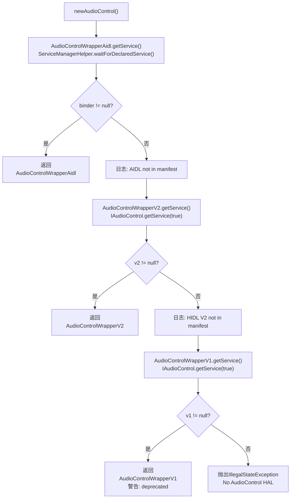
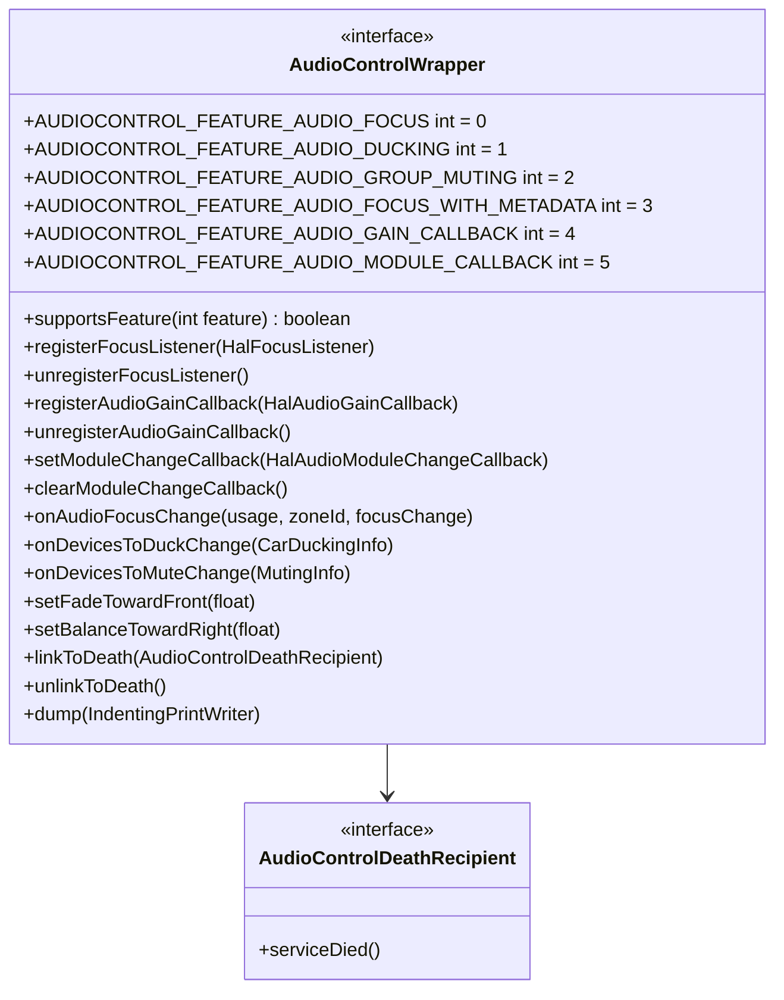
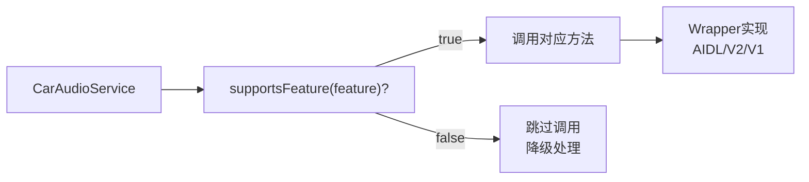

## 10.8 AudioControlFactory与HIDL Wrapper — 工厂模式与版本降级

> [← 上一个](10_10.7_HalAudioFocus-外部焦点请求管理.md) | [← 返回10章](README.md) | [返回导航](../README.md) | [下一个 →](10_10.9_IModuleChangeCallback-运行时模块变更通知.md)

---

本章涵盖 [`AudioControlFactory`](packages/services/Car/service/src/com/android/car/audio/hal/AudioControlFactory.java:28)、[`AudioControlWrapperV2`](packages/services/Car/service/src/com/android/car/audio/hal/AudioControlWrapperV2.java:46) 和 [`AudioControlWrapperV1`](packages/services/Car/service/src/com/android/car/audio/hal/AudioControlWrapperV1.java:42) 三个类。Factory负责服务发现与Wrapper创建，V1/V2是HIDL版本的遗留封装。

### 10.8.1 AudioControlFactory — 服务发现与工厂创建

[`AudioControlFactory`](packages/services/Car/service/src/com/android/car/audio/hal/AudioControlFactory.java:28) 是纯静态工厂类(68行)，负责按优先级发现并创建AudioControl HAL的Wrapper:

```java
// L44-66: newAudioControl() — 工厂方法
public static AudioControlWrapper newAudioControl() {
    // 优先级1: AIDL
    IBinder binder = AudioControlWrapperAidl.getService();
    if (binder != null) {
        return new AudioControlWrapperAidl(binder);
    }
    Slogf.i(TAG, "AIDL AudioControl HAL not in the manifest");

    // 优先级2: HIDL V2
    IAudioControl audioControlV2 = AudioControlWrapperV2.getService();
    if (audioControlV2 != null) {
        return new AudioControlWrapperV2(audioControlV2);
    }
    Slogf.i(TAG, "HIDL AudioControl@V2.0 not in the manifest");

    // 优先级3: HIDL V1 (deprecated)
    IAudioControl audioControlV1 = AudioControlWrapperV1.getService();
    if (audioControlV1 != null) {
        Slogf.w(TAG, "HIDL AudioControl V1.0 is deprecated. Consider upgrading to AIDL");
        return new AudioControlWrapperV1(audioControlV1);
    }

    // 无任何版本 → 抛异常
    throw new IllegalStateException("No version of AudioControl HAL in the manifest");
}
```

**服务发现流程**:



**服务发现机制差异**:

| 版本 | 发现方式 | 服务名 |
|------|---------|--------|
| AIDL | `ServiceManagerHelper.waitForDeclaredService()` | `android.hardware.automotive.audiocontrol.IAudioControl/default` |
| HIDL V2 | `IAudioControl.getService(true)` | HIDL服务管理器自动发现 |
| HIDL V1 | `IAudioControl.getService(true)` | HIDL服务管理器自动发现 |

**异常处理**:
- AIDL: `waitForDeclaredService` 返回null表示服务不存在
- HIDL: `getService(true)` 抛出`NoSuchElementException`表示服务不存在，`RemoteException`表示通信失败

### 10.8.2 AudioControlWrapper接口定义

[`AudioControlWrapper`](packages/services/Car/service/src/com/android/car/audio/hal/AudioControlWrapper.java:39) 是所有Wrapper实现的统一接口(176行)，定义了6个Feature常量和全部方法:



**Feature常量与@IntDef** (L40-57):
- 使用`@IntDef`定义Feature枚举范围，编译期类型安全
- 6个Feature从0递增编号

**AudioControlDeathRecipient** (L169-174): 内嵌接口，定义`serviceDied()`回调方法，HAL进程死亡时触发。

### 10.8.3 AudioControlWrapperV2 — HIDL V2.0封装

[`AudioControlWrapperV2`](packages/services/Car/service/src/com/android/car/audio/hal/AudioControlWrapperV2.java:46) 封装HIDL V2.0接口(225行)，仅支持AUDIO_FOCUS一个Feature。

**核心成员**:

| 字段 | 类型 | 用途 |
|------|------|------|
| `mAudioControlV2` | IAudioControl@2.0 | HIDL V2代理对象 |
| `mDeathRecipient` | AudioControlDeathRecipient | 死亡通知接收者 |
| `mCloseHandle` | ICloseHandle | V2注册FocusListener返回的关闭句柄 |

**supportsFeature** (L82-84):
```java
public boolean supportsFeature(int feature) {
    return feature == AUDIOCONTROL_FEATURE_AUDIO_FOCUS;
    // V2仅支持AUDIO_FOCUS
}
```

**registerFocusListener** (L87-96):
```java
public void registerFocusListener(HalFocusListener focusListener) {
    IFocusListener listenerWrapper = new FocusListenerWrapper(focusListener);
    mCloseHandle = mAudioControlV2.registerFocusListener(listenerWrapper);
    // V2返回ICloseHandle用于注销，V1不支持此方法
}
```

**关键差异 — ICloseHandle**: HIDL V2的`registerFocusListener`返回`ICloseHandle`对象，通过`close()`方法注销焦点监听。AIDL版本没有ICloseHandle，注销由HAL自动处理。

**不支持的方法(抛UnsupportedOperationException)**:

| 方法 | 原因 |
|------|------|
| `registerAudioGainCallback()` | V2无IAudioGainCallback接口 |
| `unregisterAudioGainCallback()` | 同上 |
| `onDevicesToDuckChange()` | V2无onDevicesToDuckChange方法 |
| `onDevicesToMuteChange()` | V2无onDevicesToMuteChange方法 |
| `setModuleChangeCallback()` | V2无IModuleChangeCallback接口 |
| `clearModuleChangeCallback()` | 同上 |

**V2 FocusListenerWrapper** (L207-223):
```java
private static final class FocusListenerWrapper extends IFocusListener.Stub {
    private final HalFocusListener mListener;

    public void requestAudioFocus(int usage, int zoneId, int focusGain) {
        mListener.requestAudioFocus(usage, zoneId, focusGain);
        // HIDL V2直接传递int usage，无需XSD字符串转换
    }
    public void abandonAudioFocus(int usage, int zoneId) {
        mListener.abandonAudioFocus(usage, zoneId);
    }
}
```

**V2 vs AIDL FocusListenerWrapper对比**:

| 维度 | V2 FocusListenerWrapper | AIDL FocusListenerWrapper |
|------|------------------------|--------------------------|
| 接收参数 | int usage | String usage(XSD) / PlaybackTrackMetadata |
| 数据转换 | 无(直接int) | xsdStringToUsage()转换 |
| WithMetaData | 不支持 | 支持(降级提取usage) |
| 焦点变化通知 | onAudioFocusChange(usage, zoneId, focusChange) — int usage | onAudioFocusChange(usageName, zoneId, focusChange) — XSD字符串 |

**serviceDied** (L198-205):
```java
private void serviceDied(long cookie) {
    mAudioControlV2 = AudioControlWrapperV2.getService(); // 重新获取服务
    linkToDeath(mDeathRecipient);
    if (mDeathRecipient != null) { mDeathRecipient.serviceDied(); }
}
```

### 10.8.4 AudioControlWrapperV1 — HIDL V1.0封装(已废弃)

[`AudioControlWrapperV1`](packages/services/Car/service/src/com/android/car/audio/hal/AudioControlWrapperV1.java:42) 封装HIDL V1.0接口(201行)，**不支持任何Feature**。

**supportsFeature** (L91-93):
```java
public boolean supportsFeature(int feature) {
    return false; // V1不支持任何Feature
}
```

**不支持的方法(全部抛UnsupportedOperationException)**:

| 方法 | 原因 |
|------|------|
| `registerFocusListener()` | V1无IFocusListener接口 |
| `unregisterFocusListener()` | 同上 |
| `registerAudioGainCallback()` | V1无IAudioGainCallback接口 |
| `unregisterAudioGainCallback()` | 同上 |
| `onAudioFocusChange()` | V1无焦点回调机制 |
| `onDevicesToDuckChange()` | V1无Ducking通知 |
| `onDevicesToMuteChange()` | V1无Muting通知 |
| `setModuleChangeCallback()` | V1无模块变更 |
| `clearModuleChangeCallback()` | 同上 |

**V1仅支持的方法**:

| 方法 | 说明 |
|------|------|
| `setFadeTowardFront(float)` | 前后淡入控制 |
| `setBalanceTowardRight(float)` | 左右平衡控制 |
| `getBusForContext(int)` | 获取音频上下文对应的bus号(@Deprecated) |
| `linkToDeath()` / `unlinkToDeath()` | 死亡监听 |
| `dump()` | 调试信息 |

**getBusForContext — V1遗留API** (L160-168):
```java
@Deprecated
public int getBusForContext(@CarAudioContext.AudioContext int audioContext) {
    return mAudioControlV1.getBusForContext(audioContext);
    // 返回bus号，如bus001_media → bus 1
    // 已废弃，被car_audio_configuration.xml替代
}
```

**V1定位**: HIDL V1是最初版本，仅提供setFadeTowardFront/setBalanceTowardRight和getBusForContext三个基础能力。所有高级Feature(焦点/Ducking/Muting/增益回调/模块变更)均不支持。

### 10.8.5 三个Wrapper版本对比

| 维度 | AIDL | HIDL V2 | HIDL V1 |
|------|------|---------|---------|
| 源码行数 | 481 | 225 | 201 |
| 接口语言 | AIDL | HIDL | HIDL |
| AUDIO_FOCUS | ✓(v1+) | ✓ | ✗ |
| AUDIO_DUCKING | ✓(v1+) | ✗ | ✗ |
| AUDIO_GROUP_MUTING | ✓(v1+) | ✗ | ✗ |
| FOCUS_WITH_METADATA | ✓(v2+) | ✗ | ✗ |
| AUDIO_GAIN_CALLBACK | ✓(v2+) | ✗ | ✗ |
| AUDIO_MODULE_CALLBACK | ✓(v3) | ✗ | ✗ |
| FocusListener注册 | 直接注册 | 返回ICloseHandle | 不支持 |
| FocusListener注销 | HAL自动处理 | ICloseHandle.close() | 不支持 |
| 焦点变化usage格式 | XSD字符串 | int | 不支持 |
| Ducking/Muting | 支持 | 不支持 | 不支持 |
| 死亡恢复 | IBinder.DeathRecipient | HIDL linkToDeath(cookie) | HIDL linkToDeath(cookie) |
| 废弃警告 | 无 | 无 | 有(deprecated) |

### 10.8.6 版本降级与Feature安全策略

CarAudioService调用Wrapper方法前，始终通过`supportsFeature()`检查Feature可用性，确保不会触发UnsupportedOperationException:



**降级策略示例**:
- `AUDIO_FOCUS` 不支持(V1) → CarSvc不注册FocusListener，HAL无法请求外部焦点
- `AUDIO_DUCKING` 不支持(V1/V2) → CarSvc不调用onDevicesToDuckChange，HAL不感知Ducking
- `AUDIO_GAIN_CALLBACK` 不支持(V1/V2) → CarSvc不注册GainCallback，HAL无法通知增益变化
- `AUDIO_MODULE_CALLBACK` 不支持(V1/V2) → CarSvc不注册ModuleChangeCallback，HAL无法通知模块变更

### 10.8.7 死亡恢复机制对比

三个Wrapper都实现了HAL死亡恢复，但机制不同:

| 维度 | AIDL | HIDL V2 | HIDL V1 |
|------|------|---------|---------|
| 接口 | IBinder.DeathRecipient | HIDL serviceDied(cookie) | HIDL serviceDied(cookie) |
| 注册 | mBinder.linkToDeath(this, 0) | mAudioControlV2.linkToDeath(this::serviceDied, 0) | mAudioControlV1.linkToDeath(this::serviceDied, 0) |
| 回调 | binderDied() | serviceDied(long cookie) | serviceDied(long cookie) |
| 恢复 | getService()+asInterface() | getService() | getService() |
| 重新注册 | linkToDeath+serviceDied | linkToDeath+serviceDied | linkToDeath+serviceDied |
| 状态清除 | 清除3个registered标志 | 无 | 无 |

**AIDL binderDied特殊处理**: 清除`mListenerRegistered`、`mGainCallbackRegistered`、`mModuleChangeCallbackRegistered`三个标志，使得CarSvc重新初始化时会重新注册所有回调。HIDL V2/V1无需此处理，因为V2仅有一个CloseHandle，V1无回调。

---

> [← 上一个](10_10.7_HalAudioFocus-外部焦点请求管理.md) | [← 返回10章](README.md) | [返回导航](../README.md) | [下一个 →](10_10.9_IModuleChangeCallback-运行时模块变更通知.md)