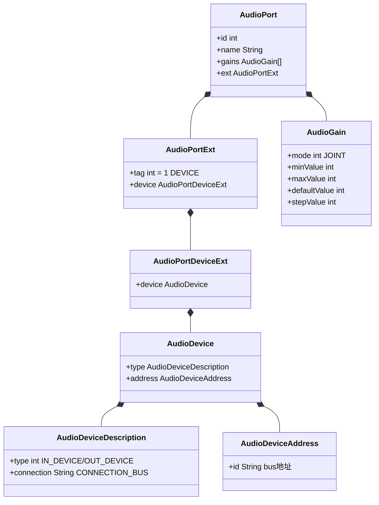
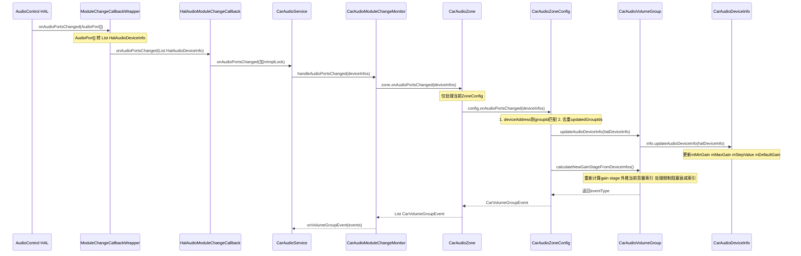
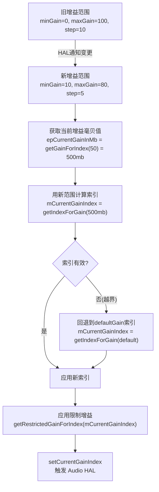

## 10.9 IModuleChangeCallback — 运行时模块变更通知

> [← 上一个](10_10.8_IAudioGainCallback-HAL增益回调链路.md) | [← 返回10章](README.md) | [返回导航](../README.md) | [下一个 →](../11_Vendor_Layer/README.md)

---

[`IModuleChangeCallback`](hardware/interfaces/automotive/audiocontrol/aidl/android/hardware/automotive/audiocontrol/IModuleChangeCallback.aidl:26) 是AIDL v3新增的回调接口，用于HAL通知CarAudioService音频端口的运行时增益配置变更。这是AudioControl HAL中最新的Feature，实现了从静态配置到动态重配置的跨越。

### 10.9.1 IModuleChangeCallback AIDL接口定义

```java
// IModuleChangeCallback.aidl (L26-62)
@VintfStability
oneway interface IModuleChangeCallback {
    void onAudioPortsChanged(in AudioPort[] audioPorts);
}
```

**接口约束(AIDL注释原文)**:

1. **AudioPort限制**: V3仅支持可配置AudioGain stages变更
2. **AudioDevice要求**: 必须是`IN/OUT_DEVICE + CONNECTION_BUS`类型
3. **AudioGain模式**: 仅支持`AudioGainMode::JOINT`，其他模式被忽略
4. **同组一致性**: 同一VolumeGroup映射的多个bus增益配置必须一致
5. **范围限制**: 新增益范围必须是AudioPolicy定义范围的子集(不可超出)
6. **重启回调**: AudioControl服务重启后，必须立即发送一次回调
7. **客户端重启**: AudioControl必须清除过期回调

**AudioPort结构中的关键字段**:



### 10.9.2 回调注册与完整数据链路

模块变更回调从HAL到CarVolumeGroup的完整数据链路涉及5层转换:



### 10.9.3 ModuleChangeCallbackWrapper — HAL到CarSvc桥接

[`ModuleChangeCallbackWrapper`](packages/services/Car/service/src/com/android/car/audio/hal/AudioControlWrapperAidl.java:452) 是AIDL内部类，将HAL的`AudioPort[]`转换为CarSvc的`List<HalAudioDeviceInfo>`:

```java
// L452-480: ModuleChangeCallbackWrapper
private static final class ModuleChangeCallbackWrapper extends IModuleChangeCallback.Stub {
    private final HalAudioModuleChangeCallback mCallback;

    @Override
    public void onAudioPortsChanged(AudioPort[] audioPorts) {
        List<HalAudioDeviceInfo> halAudioDeviceInfos = new ArrayList<>();
        for (int index = 0; index < audioPorts.length; index++) {
            AudioPort port = audioPorts[index];
            halAudioDeviceInfos.add(new HalAudioDeviceInfo(port));
        }
        mCallback.onAudioPortsChanged(halAudioDeviceInfos);
    }
}
```

**数据转换**: `AudioPort` → `HalAudioDeviceInfo`，由[`HalAudioDeviceInfo`](packages/services/Car/service/src/com/android/car/audio/hal/HalAudioDeviceInfo.java:36)构造函数完成。

### 10.9.4 HalAudioDeviceInfo — AudioPort解析与校验

[`HalAudioDeviceInfo`](packages/services/Car/service/src/com/android/car/audio/hal/HalAudioDeviceInfo.java:36) 从AudioPort提取增益信息，并进行严格校验:

```java
// L45-60: 构造函数
public HalAudioDeviceInfo(AudioPort port) {
    Objects.requireNonNull(port, "Audio port can not be null");
    // 校验1: ext必须是DEVICE类型(tag==1)
    Preconditions.checkArgument(port.ext.getTag() == AUDIO_PORT_EXT_DEVICE, ...);
    AudioDevice device = Objects.requireNonNull(port.ext.getDevice().device, ...);
    // 校验2: 必须是IN/OUT_DEVICE + CONNECTION_BUS
    checkIfAudioDeviceIsValidOutputBus(device);

    mId = port.id;
    mName = port.name;
    mAudioGain = getAudioGain(port.gains); // 仅取JOINT模式增益
    mType = device.type.type;
    mConnection = device.type.connection;
    mAddress = device.address.getId(); // bus地址，如"bus001_media"
}
```

**校验逻辑** (L138-148):
- 类型校验: 必须是`OUT_DEVICE`或`IN_DEVICE`
- 连接校验: 必须是`CONNECTION_BUS`
- 地址校验: 地址字符串不能为空

**核心字段**:

| 字段 | 类型 | 来源 | 用途 |
|------|------|------|------|
| `mId` | int | port.id | AudioPort标识(可能不可靠) |
| `mName` | String | port.name | 端口名称 |
| `mAudioGain` | AudioGain | port.gains(仅JOINT) | 增益配置 |
| `mType` | int | device.type.type | IN_DEVICE/OUT_DEVICE |
| `mConnection` | String | device.type.connection | CONNECTION_BUS |
| `mAddress` | String | device.address.getId() | bus地址，匹配VolumeGroup |

**equals/hashCode特殊设计** (L116-136): `mId`不参与equals/hashCode，因为"mId is not reliable until Audio HAL migrates to AIDL"。使用name+gain+type+connection+address组合判断。

### 10.9.5 CarAudioModuleChangeMonitor — 模块变更分发

[`CarAudioModuleChangeMonitor`](packages/services/Car/service/src/com/android/car/audio/CarAudioModuleChangeMonitor.java:35) 是模块变更的分发中心(89行):

```java
// L42-50: 构造函数
CarAudioModuleChangeMonitor(AudioControlWrapper audioControlWrapper,
        CarVolumeInfoWrapper carVolumeInfoWrapper, SparseArray<CarAudioZone> carAudioZones) {
    mAudioControlWrapper = Objects.requireNonNull(audioControlWrapper, ...);
    mCarVolumeInfoWrapper = Objects.requireNonNull(carVolumeInfoWrapper, ...);
    mCarAudioZones = Objects.requireNonNull(carAudioZones, ...);
}
```

**handleAudioPortsChanged** (L69-82):
```java
void handleAudioPortsChanged(List<HalAudioDeviceInfo> deviceInfos) {
    List<CarVolumeGroupEvent> events = new ArrayList<>();
    for (int i = 0; i < mCarAudioZones.size(); i++) {
        CarAudioZone zone = mCarAudioZones.valueAt(i);
        events.addAll(zone.onAudioPortsChanged(deviceInfos));
    }
    // 冗余回调保护：HAL可能发送无实际变更的回调
    if (events.isEmpty()) {
        Slogf.w(CarLog.TAG_AUDIO, "Audio ports changed callback resulted in no events!");
        return;
    }
    mCarVolumeInfoWrapper.onVolumeGroupEvent(events);
}
```

**关键设计**: HAL可能发送冗余回调(如重启后立即回调但配置未变)，通过`events.isEmpty()`检查避免无意义通知。

### 10.9.6 CarAudioZoneConfig — 地址匹配与事件生成

[`CarAudioZoneConfig.onAudioPortsChanged`](packages/services/Car/service/src/com/android/car/audio/CarAudioZoneConfig.java:378) 是核心匹配逻辑:

```java
// L378-406: 两阶段处理
List<CarVolumeGroupEvent> onAudioPortsChanged(List<HalAudioDeviceInfo> deviceInfos) {
    List<CarVolumeGroupEvent> events = new ArrayList<>();
    ArraySet<Integer> updatedGroupIds = new ArraySet<>();

    // 阶段1: 遍历HAL设备信息，匹配地址，更新CarAudioDeviceInfo
    for (int index = 0; index < deviceInfos.size(); index++) {
        HalAudioDeviceInfo deviceInfo = deviceInfos.get(index);
        int groupId = mDeviceAddressToGroupId.getOrDefault(
                deviceInfo.getAddress(), INVALID_GROUP_ID);
        if (groupId == INVALID_GROUP_ID) continue; // 地址不匹配，跳过
        mVolumeGroups.get(groupId).updateAudioDeviceInfo(deviceInfo);
        updatedGroupIds.add(groupId); // 去重：同组多个设备只计算一次
    }

    // 阶段2: 对更新的组重新计算增益阶段
    for (int index = 0; index < updatedGroupIds.size(); index++) {
        CarVolumeGroup group = mVolumeGroups.get(updatedGroupIds.valueAt(index));
        int eventType = group.calculateNewGainStageFromDeviceInfos();
        if (eventType != INVALID_EVENT_TYPE) {
            events.add(new CarVolumeGroupEvent.Builder(
                List.of(group.getCarVolumeGroupInfo()),
                eventType,
                List.of(EXTRA_INFO_VOLUME_INDEX_CHANGED_BY_AUDIO_SYSTEM))
                .build());
        }
    }
    return events;
}
```

**地址匹配机制**: `mDeviceAddressToGroupId`是一个`ArrayMap<String, Integer>`，在Builder阶段通过`addGroupAddressesToMap()`建立，将bus地址(如"bus001_media")映射到VolumeGroup ID。

**CarAudioZone过滤** (L331-341): Zone仅处理当前激活的ZoneConfig:
```java
List<CarVolumeGroupEvent> onAudioPortsChanged(List<HalAudioDeviceInfo> deviceInfos) {
    for (int index = 0; index < mCarAudioZoneConfigs.size(); index++) {
        List<CarVolumeGroupEvent> eventsForZoneConfig =
                mCarAudioZoneConfigs.valueAt(index).onAudioPortsChanged(deviceInfos);
        // 仅当前配置的事件纳入结果
        if (mCarAudioZoneConfigs.keyAt(index) == getCurrentConfigId()) {
            events.addAll(eventsForZoneConfig);
        }
    }
    return events;
}
```

### 10.9.7 CarAudioVolumeGroup — 增益阶段重新计算

[`CarAudioVolumeGroup.calculateNewGainStageFromDeviceInfos`](packages/services/Car/service/src/com/android/car/audio/CarAudioVolumeGroup.java:127) 是模块变更的最终处理逻辑，共7个步骤:

**步骤1 — 聚合增益参数**: 遍历所有`CarAudioDeviceInfo`，计算组的min/max/default/step。同组所有bus的step值必须一致，否则抛异常。

**步骤2 — 计算eventType**: 对比新旧值，minGain变化→GAIN_INDEX_CHANGED|MIN_INDEX_CHANGED，maxGain变化→GAIN_INDEX_CHANGED|MAX_INDEX_CHANGED，stepSize变化→GAIN_INDEX_CHANGED|MAX_INDEX_CHANGED，defaultGain变化→无事件。无任何变化则直接返回。

**步骤3 — 记录旧增益毫贝值**: 在更新范围前，记录currentGainInMb/limitedGainInMb/blockedGainInMb/attenuatedGainInMb。

**步骤4 — 当前索引外推**: 用新范围重新计算当前增益索引。越界则回退到defaultGain:
```java
mCurrentGainIndex = getIndexForGainLocked(epCurrentGainInMb);
if (!isValidGainIndexLocked(mCurrentGainIndex)) {
    mCurrentGainIndex = getIndexForGainLocked(mDefaultGain);
}
```

**步骤5-6 — 限制/阻塞/衰减索引外推**: 外推后无效则重置。AudioControl HAL需在后续回调中重新发送限制。

**步骤7 — 应用增益索引**: `setCurrentGainIndexLocked`触发Audio HAL实际设置增益。

**增益索引外推流程**:



### 10.9.8 注册重试与HAL死亡恢复

**setModuleChangeCallback重试机制** (AudioControlWrapperAidl L248-282):

CarSvc崩溃重启后旧callback仍存在于HAL端，`setModuleChangeCallback`会抛`IllegalStateException`。Wrapper通过`clearModuleChangeCallback + 重新set`的方式恢复。

**HAL死亡恢复** (CarAudioService L2827-2830):
```java
private void audioControlDied() {
    resetHalAudioFocus();
    resetHalAudioGain();
    resetHalAudioModuleChange(); // 重新注册ModuleChangeCallback
}
```

AIDL `binderDied()` 会清除`mModuleChangeCallbackRegistered`标志，确保CarSvc恢复时重新注册。

### 10.9.9 模块变更典型场景

| 场景 | HAL触发 | CarSvc响应 |
|------|---------|-----------|
| DSP重配置 | DSP固件更新→AudioPort增益范围变更 | 重新计算VolumeGroup的min/max/default |
| 安全限制调整 | 儿童模式启用→maxGain降低 | 外推当前索引，可能降低音量 |
| 增益范围扩展 | AMP模式切换→stepSize变更 | 重新计算索引粒度 |
| HAL服务重启 | AudioControl进程重启 | 立即回调当前AudioPort配置(IModuleChangeCallback注释要求) |
| CarSvc重启 | CarSvc崩溃恢复 | clearModuleChangeCallback + 重新注册(重试机制) |

### 10.9.10 模块变更 vs 增益回调对比

| 维度 | IModuleChangeCallback (v3) | IAudioGainCallback (v2+) |
|------|---------------------------|--------------------------|
| 触发方 | HAL主动通知 | HAL主动通知 |
| 数据内容 | AudioPort[] (min/max/default/step) | AudioGainConfigInfo[] (具体增益值+原因) |
| CarSvc处理 | 更新CarAudioDeviceInfo → 重新计算gain stage | CarAudioGainMonitor → 设置具体增益索引 |
| 影响范围 | VolumeGroup的整个增益范围 | 单个设备的当前增益值 |
| 焦点关系 | 无关 | 与Focus事件可关联(Reasons.FOCUS_DUCKING等) |
| 是否改变范围 | 是(min/max/step可变) | 否(仅在现有范围内设置值) |
| 设计意图 | 运行时动态重配置 | 运行时增益调整 |

---

> [← 上一个](10_10.8_IAudioGainCallback-HAL增益回调链路.md) | [← 返回10章](README.md) | [返回导航](../README.md) | [下一个 →](../11_Vendor_Layer/README.md)