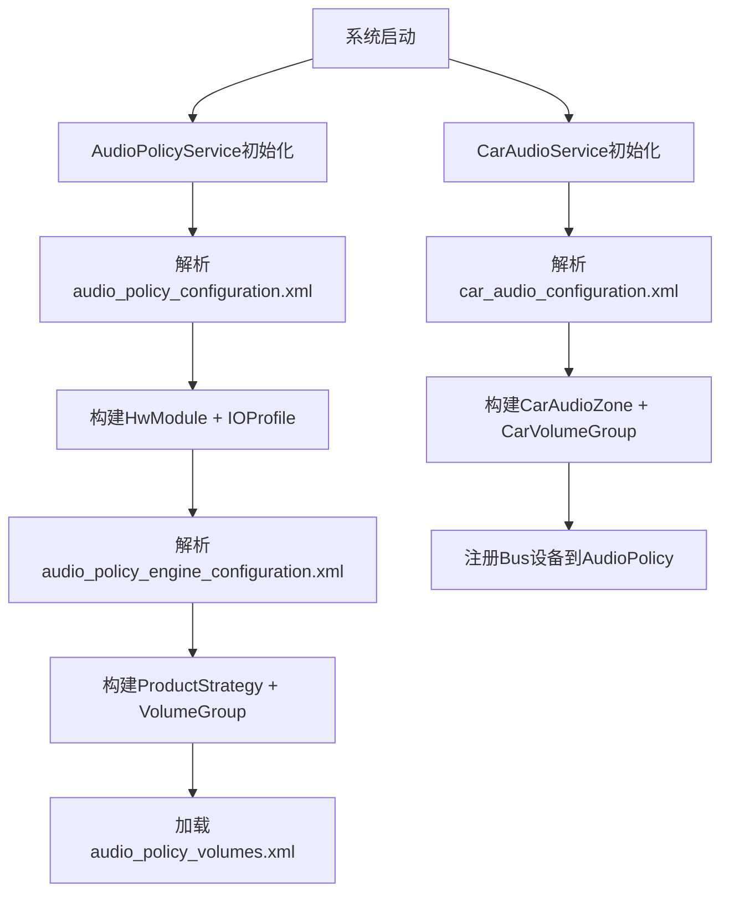
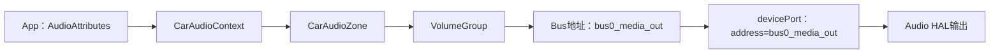
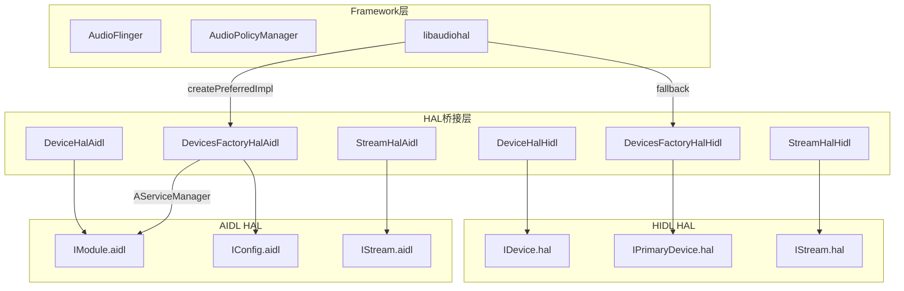

# 第十一篇：Vendor Layer

> [← 上一篇：AudioControl HAL](10_AudioControl_HAL.md) | [返回导航](README.md) | [下一篇：Audio Focus →](12_Audio_Focus_Deep_Dive.md)

---

## 11.1 配置文件体系总览

### 配置文件层次

```
┌───────────────────────────────────────────────────────┐
│ audio_policy_configuration.xml  ← 核心路由/设备配置    │
├───────────────────────────────────────────────────────┤
│ audio_policy_volumes.xml        ← 音量曲线定义         │
├───────────────────────────────────────────────────────┤
│ default_volume_tables.xml       ← 默认音量表          │
├───────────────────────────────────────────────────────┤
│ audio_policy_engine_configuration.xml ← 策略引擎配置  │
├───────────────────────────────────────────────────────┤
│ audio_effects.xml               ← 音效库声明          │
├───────────────────────────────────────────────────────┤
│ audio_effect_policy.xml         ← 系统效果策略        │
├───────────────────────────────────────────────────────┤
│ car_audio_configuration.xml     ← AAOS车载音频配置    │
├───────────────────────────────────────────────────────┤
│ mixer_paths.xml                 ← ALSA mixer路由      │
├───────────────────────────────────────────────────────┤
│ audio_platform_info.xml         ← SoC平台信息         │
└───────────────────────────────────────────────────────┘
```

---

## 11.2 audio_policy_configuration.xml — 核心配置

### 配置结构

```xml
<audioPolicyConfiguration version="7.0">
    <globalConfiguration />
    <modules>
        <module name="primary" halVersion="2.0">
            <attachedDevices>
                <item>Speaker</item>
                <item>Built-In Mic</item>
            </attachedDevices>
            <defaultOutputDevice>Speaker</defaultOutputDevice>
            <mixPorts>
                <mixPort name="primary output" role="source" flags="AUDIO_OUTPUT_FLAG_PRIMARY">
                    <profile ... />
                </mixPort>
            </mixPorts>
            <devicePorts>
                <devicePort tagName="Speaker" type="AUDIO_DEVICE_OUT_SPEAKER" role="sink">
                    <profile ... />
                </devicePort>
            </devicePorts>
            <routes>
                <route type="mix" sink="Speaker" sources="primary output"/>
            </routes>
        </module>
    </modules>
</audioPolicyConfiguration>
```

### 关键配置项解析

| 节点 | 说明 | 影响范围 |
|------|------|----------|
| `<globalConfiguration>` | 全局参数(深缓冲大小等) | AudioFlinger buffer分配 |
| `<module>` | HAL模块定义 | 对应一个Audio HAL库 |
| `<attachedDevices>` | 固定连接设备 | 系统启动时自动注册 |
| `<defaultOutputDevice>` | 默认输出设备 | 无其他设备时的路由目标 |
| `<mixPort>` | 软件混音端口 | 定义AudioFlinger可打开的输出/输入流 |
| `<devicePort>` | 硬件设备端口 | 定义HAL可用的物理设备 |
| `<route>` | 路由规则 | 定义mixPort到devicePort的连接 |

### 配置如何影响Framework行为

1. **mixPort的profile** → 决定AudioFlinger可打开的采样率/格式/通道
2. **mixPort的flags** → 决定Thread类型(PRIMARY→MixerThread, COMPRESS_OFFLOAD→OffloadThread)
3. **devicePort的type** → 决定AudioPolicyManager的设备类型识别
4. **route的sources→sink** → 决定哪些mixPort可以路由到哪些devicePort

---

## 11.3 audio_policy_volumes.xml — 音量曲线

### 曲线结构

```xml
<volumes>
    <volume stream="AUDIO_STREAM_MUSIC" deviceCategory="DEVICE_CATEGORY_SPEAKER">
        <point>0,-9000</point>
        <point>33,-3600</point>
        <point>66,-1600</point>
        <point>100,0</point>
    </volume>
    <volume stream="AUDIO_STREAM_MUSIC" deviceCategory="DEVICE_CATEGORY_HEADSET">
        <point>0,-9000</point>
        <point>33,-3600</point>
        <point>66,-1600</point>
        <point>100,0</point>
    </volume>
</volumes>
```

### 音量曲线映射

```
用户操作: 音量滑块从0到100
  → VolumeGroup查找对应stream type
  → 查找当前设备的deviceCategory(SPEAKER/HEADSET/EARPIECE)
  → 在曲线中插值计算dB衰减
  → 设置到AudioFlinger → HAL
```

---

## 11.4 audio_policy_engine_configuration.xml — 策略引擎配置

### 配置结构

```xml
<AudioPolicyEngineConfiguration>
    <productStrategies>
        <productStrategy name="strategy_media" id="0">
            <attributesGroup streamType="AUDIO_STREAM_MUSIC" volumeGroup="media">
                <attributes priority="1" usage="AUDIO_USAGE_MEDIA"/>
                <attributes priority="2" usage="AUDIO_USAGE_GAME"/>
            </attributesGroup>
        </productStrategy>
    </productStrategies>
    <volumeGroups>
        <volumeGroup name="media" id="0" defaultStream="AUDIO_STREAM_MUSIC">
            <streamType ref="AUDIO_STREAM_MUSIC"/>
        </volumeGroup>
    </volumeGroups>
</AudioPolicyEngineConfiguration>
```

### ProductStrategy → VolumeGroup映射

```
strategy_media → volumeGroup=media
strategy_phone → volumeGroup=voice_call
strategy_nav   → volumeGroup=navigation
strategy_alarm → volumeGroup=alarm
```

---

## 11.5 car_audio_configuration.xml — AAOS车载配置

### 配置结构

```xml
<carAudioConfiguration version="2">
    <zones>
        <zone name="primary zone" id="0" isPrimary="true"
              occupantZoneId="0">
            <volumeGroups>
                <group>
                    <device context="music" bus="0"
                            address="bus0_media_out"
                            useHalAudioRouting="false"/>
                    <device context="navigation" bus="1"
                            address="bus1_navigation_out"/>
                </group>
                <group>
                    <device context="call" bus="2"
                            address="bus2_call_out"/>
                    <device context="alarm" bus="3"
                            address="bus3_alarm_out"/>
                </group>
            </volumeGroups>
        </zone>
        <zone name="rear zone" id="1" occupantZoneId="1">
            <volumeGroups>
                <group>
                    <device context="music" bus="10"
                            address="bus10_rear_media_out"/>
                </group>
            </volumeGroups>
        </zone>
    </zones>
</carAudioConfiguration>
```

### 关键字段说明

| 字段 | 说明 | 影响 |
|------|------|------|
| `isPrimary` | 是否主Zone | 主Zone接收所有未指定Zone的音频 |
| `occupantZoneId` | 关联的乘员Zone | Audio Mirroring时使用 |
| `bus` | Bus地址 | 对应Audio HAL的输出设备地址 |
| `context` | 音频上下文 | CarAudioContext枚举值 |
| `useHalAudioRouting` | 是否使用HAL路由 | false=Framework路由, true=HAL路由 |

---

## 11.6 配置解析流程



---

## 11.7 OEM定制指南

| 定制需求 | 修改文件 | 说明 |
|----------|---------|------|
| 添加新音频设备 | audio_policy_configuration.xml | 添加devicePort + route |
| 修改默认音量曲线 | audio_policy_volumes.xml | 调整point的dB值 |
| 添加新ProductStrategy | audio_policy_engine_configuration.xml | 添加strategy条目 |
| 添加车载Zone | car_audio_configuration.xml | 添加zone + volumeGroup |
| 添加Vendor音效 | audio_effects.xml | 声明effect + library |
| 修改ALSA路由 | mixer_paths.xml | 配置SoC DSP路由 |
| 自定义焦点矩阵 | CarAudioFocus代码 | 修改INTERACTION_MATRIX |

---

## 11.8 audio_policy_configuration.xml 属性详解

### devicePort 完整属性表

| 属性 | 必填 | 说明 | 示例 |
|------|------|------|------|
| `tagName` | 是 | 设备标识名，route引用用此名 | `"Speaker"` |
| `type` | 是 | AUDIO_DEVICE_OUT_* / AUDIO_DEVICE_IN_* | `AUDIO_DEVICE_OUT_SPEAKER` |
| `role` | 是 | `sink`(输出设备) / `source`(输入设备) | `sink` |
| `address` | 否 | 设备地址，Bus设备必填 | `"bus0_media_out"` |
| `encodingFormats` | 否 | 支持的编码格式列表(Compress Offload) | `AUDIO_FORMAT_AC3` |
| `<profile>` 子节点 | 否 | 采样率/格式/通道mask | 见下方profile属性 |

### mixPort 完整属性表

| 属性 | 必填 | 说明 | 示例 |
|------|------|------|------|
| `name` | 是 | 流标识名，route引用用此名 | `"primary output"` |
| `role` | 是 | `source`(输出流) / `sink`(输入流) | `source` |
| `flags` | 否 | AUDIO_OUTPUT_FLAG_* 组合 | `AUDIO_OUTPUT_FLAG_PRIMARY` |
| `maxOpenSessionsCount` | 否 | 最大并发打开session数 | `1` |
| `maxActiveSessionCount` | 否 | 最大活跃session数 | `1` |
| `preferredMixDevice` | 否 | 优先路由目标设备(AIDL新增) | — |
| `<profile>` 子节点 | 否 | 采样率/格式/通道mask | 见下方 |

### profile 属性表

| 属性 | 说明 | 示例 |
|------|------|------|
| `name` | profile标识 | `"primary"` |
| `samplingRates` | 支持的采样率列表 | `48000` |
| `format` | 音频格式 | `AUDIO_FORMAT_PCM_16_BIT` |
| `channelMasks` | 通道mask列表 | `AUDIO_CHANNEL_OUT_STEREO` |

### route 属性表

| 属性 | 说明 | 示例 |
|------|------|------|
| `type` | 路由类型，目前仅`mix` | `mix` |
| `sink` | 目标端(devicePort tagName) | `"Speaker"` |
| `sources` | 源端(mixPort name，逗号分隔) | `"primary output,deep_buffer output"` |

### globalConfiguration 属性表

| 属性 | 说明 | 默认值 |
|------|------|--------|
| `deep_buffer_duration_ms` | 深缓冲输出持续时间 | `2000` |
| `sparse_channel_configuration_mask` | 稀疏通道配置mask | — |

### mixPort flags → Thread类型映射

| flags | Thread类型 | 说明 |
|-------|-----------|------|
| `AUDIO_OUTPUT_FLAG_PRIMARY` | MixerThread(Primary) | 主输出，低延迟 |
| `AUDIO_OUTPUT_FLAG_FAST` | MixerThread(Fast) | 超低延迟，小于10ms |
| `AUDIO_OUTPUT_FLAG_DEEP_BUFFER` | MixerThread(DeepBuffer) | 长缓冲，高吞吐 |
| `AUDIO_OUTPUT_FLAG_COMPRESS_OFFLOAD` | OffloadThread | 硬件解码，不混音 |
| `AUDIO_OUTPUT_FLAG_MMAP_NOIRQ` | MmapThread | AAudio MMap低延迟 |
| `AUDIO_OUTPUT_FLAG_DIRECT` | DirectOutputThread | 不混音直接输出 |

---

## 11.9 car_audio_configuration.xml 深度解析

### CarAudioContext 完整列表

CarAudioContext定义了车载音频上下文的语义分类，每个context对应一组AudioAttributes Usage，影响焦点仲裁和路由决策：

| Context ID | 名称 | 对应AudioAttributes Usage |
|-----------|------|---------------------------|
| 1 | MUSIC | MEDIA, GAME |
| 2 | NAVIGATION | ASSISTANCE_NAVIGATION |
| 3 | VOICE_COMMAND | ASSISTANCE_VOICE_COMMAND |
| 4 | CALL_RING | CALL_RING |
| 5 | CALL | VOICE_COMMUNICATION, VOICE_COMMUNICATION_SIGNALING |
| 6 | ALARM | ALARM |
| 7 | NOTIFICATION | NOTIFICATION, NOTIFICATION_EVENT |
| 8 | SYSTEM_SOUND | ASSISTANCE_SONIFICATION |
| 9 | EMERGENCY | EMERGENCY |
| 10 | SAFETY | SAFETY |
| 11 | VEHICLE_STATUS | VEHICLE_STATUS |
| 12 | ANNOUNCEMENT | ANNOUNCEMENT |

### Zone配置详解

```xml
<zone name="primary zone" id="0" isPrimary="true" occupantZoneId="0">
    <volumeGroups>
        <group name="group1">
            <device context="music" bus="0" address="bus0_media_out"
                    useHalAudioRouting="false"/>
            <device context="navigation" bus="1"
                    address="bus1_navigation_out"/>
        </group>
    </volumeGroups>
    <audioZones id="0"> <!-- 可选：AAOS v3新增 -->
        <zoneConfig name="config1" isDefault="true"
                    volumeGroupIds="0,1" audioZoneDeviceLinks="...">
        </zoneConfig>
    </audioZones>
</zone>
```

### Zone关键属性深度分析

| 属性 | 作用 | 约束条件 |
|------|------|----------|
| `isPrimary="true"` | 主Zone接收所有未指定Zone的音频 | 系统必须至少有1个primary Zone |
| `occupantZoneId` | 绑定乘员Zone，Audio Mirroring分配依据 | 必须与CarOccupantZoneService定义一致 |
| `bus` | Bus号，对应HAL devicePort的address | 不同group内bus不可重复 |
| `useHalAudioRouting` | false=Framework控制路由路由至Bus；true=HAL自行路由 | AIDL模式下建议false |
| `context` | 音频语义分类，影响焦点+音量组+路由 | 每个device必须指定一个context |

### VolumeGroup设计原则

```
VolumeGroup分组原则：
├── 按音量独立控制需求分组（音乐和导航不应同一音量组）
├── 每组有独立音量曲线和音量范围
├── 组内设备共享同一音量设置
├── 不同组可并行播放（依赖焦点仲裁）
└── 每组至少1个输出device
```

### context→Bus→HAL devicePort 路由链路



---

## 11.10 OEM定制点完整矩阵

| 定制领域 | 配置/代码文件 | 关键参数 | 定制影响 | 难度 |
|----------|-------------|---------|---------|------|
| 音频设备声明 | audio_policy_configuration.xml | devicePort type+tagName+address | HAL设备识别+路由基础 | 低 |
| 流能力声明 | audio_policy_configuration.xml | mixPort flags+profile采样率/格式 | Thread类型+支持的音频格式 | 低 |
| 路由规则 | audio_policy_configuration.xml | route sink+sources | mixPort→devicePort路由映射 | 低 |
| 音量曲线 | audio_policy_volumes.xml | volume point百分比→dB | 各设备类别音量插值曲线 | 低 |
| 策略引擎 | audio_policy_engine_configuration.xml | productStrategy+volumeGroup+attributes | Usage→Strategy→VolumeGroup映射 | 中 |
| 车载Zone | car_audio_configuration.xml | zone+volumeGroup+context→bus | 多Zone独立音量/路由 | 中 |
| 焦点交互矩阵 | CarAudioFocus.java | INTERACTION_MATRIX常量 | 不同context间的焦点优先级 | 中 |
| HAL路由模式 | car_audio_configuration.xml | useHalAudioRouting=true/false | Framework路由 vs HAL路由 | 中 |
| ALSA mixer路由 | mixer_paths.xml | ctl name+value | SoC DSP内部路由+增益 | 高 |
| 音效库声明 | audio_effects.xml | effect+library+uuid | 可用音效及其对应Vendor库 | 低 |
| Vendor音效策略 | audio_effect_policy.xml | effect+device+stream | 音效自动附加规则 | 中 |
| 平台信息 | audio_platform_info.xml | codec+device映射 | SoC特定参数覆盖 | 高 |
| AIDL Vendor扩展 | IModule.aidl | get/setVendorParameters | HAL私有参数传递 | 高 |
| Sound Dose | IModule.aidl | getSoundDose | CSD(安全听音剂量)报告 | 高 |
| MMap策略 | IModule.aidl | getMmapPolicyInfos | AAudio MMap低延迟策略 | 高 |

---

## 11.11 AIDL/HIDL Vendor HAL实现架构

### IModule AIDL接口方法分类

AIDL Audio HAL核心接口`IModule.aidl`定义30+方法，按功能分类如下：

| 分类 | 方法 | 数量 |
|------|------|------|
| 流管理 | openInputStream, openOutputStream, getSupportedPlaybackRateFactors, generateHwAvSyncId | 4 |
| 端口配置 | setAudioPortConfig, resetAudioPortConfig, getAudioPortConfigs, getAudioPorts, getAudioPort | 5 |
| Patch路由 | setAudioPatch, resetAudioPatch, getAudioPatches | 3 |
| 设备连接 | connectExternalDevice, disconnectExternalDevice | 2 |
| 路由查询 | getAudioRoutes, getAudioRoutesForAudioPort | 2 |
| 音量控制 | getMasterMute/setMasterMute, getMasterVolume/setMasterVolume, getMicMute/setMicMute | 6 |
| 蓝牙音频 | getTelephony, getBluetooth, getBluetoothA2dp, getBluetoothLe | 4 |
| Vendor扩展 | getVendorParameters, setVendorParameters | 2 |
| 设备效果 | addDeviceEffect, removeDeviceEffect | 2 |
| 系统通知 | updateAudioMode, updateScreenRotation, updateScreenState | 3 |
| AAudio MMap | getMmapPolicyInfos, supportsVariableLatency, getAAudioMixerBurstCount, getAAudioHardwareBurstMinUsec | 4 |
| Sound Dose | getSoundDose | 1 |
| Debug | setModuleDebug | 1 |

### AIDL/HIDL双路径架构



### DevicesFactoryHalAidl 关键实现

[`DevicesFactoryHalAidl.cpp`](frameworks/av/media/libaudiohal/impl/DevicesFactoryHalAidl.cpp) 的核心流程：

1. **入口函数** `createIDevicesFactoryImpl()`：通过`IConfig/default`服务创建Factory
2. **设备发现** `getDeviceNames()`：遍历`IModule`声明的实例名（`default`→`primary`转换）
3. **设备打开** `openDevice()`：查找实例名→`IModule::fromBinder`→创建`DeviceHalAidl`
4. **版本获取** `getHalVersion()`：通过`IConfig::getInterfaceVersion`获取AIDL版本号

### DeviceHalHidl → AIDL迁移对比

| 功能 | HIDL实现 | AIDL实现 |
|------|---------|---------|
| 设备创建 | `IDevice/IPrimaryDevice` HIDL服务 | `IModule` AIDL服务 |
| 音量控制 | `mDevice->setMasterVolume()` Return回调 | `IModule::setMasterVolume()` AIDL状态 |
| 参数传递 | `setParameters()` hidl_vecParameterValue | `setVendorParameters()` VendorParameter |
| Stream创建 | `mDevice->openOutputStream()` Return回调 | `IModule::openOutputStream()` 结构化参数 |
| 蓝牙 | `IPrimaryDevice`单独方法 | `IModule::getBluetooth*()` 统一接口 |
| Sound Dose | HIDL 7.1单独`ISoundDoseFactory` | `IModule::getSoundDose()` 内置 |
| MMap | 不支持 | `getMmapPolicyInfos()` 内置 |

### Vendor参数扩展机制

OEM可通过`getVendorParameters`/`setVendorParameters`传递私有参数：

```
调用链路：
Framework → DeviceHalAidl::setVendorParameters()
         → IModule::setVendorParameters(VendorParameter[])
         → Vendor HAL实现处理

VendorParameter结构：
{
    id: String (Vendor自定义扩展ID)
    params: Parcelable (Vendor自定义参数包)
}
```

---

> [← 上一篇：AudioControl HAL](10_AudioControl_HAL.md) | [返回导航](README.md) | [下一篇：Audio Focus →](12_Audio_Focus_Deep_Dive.md)