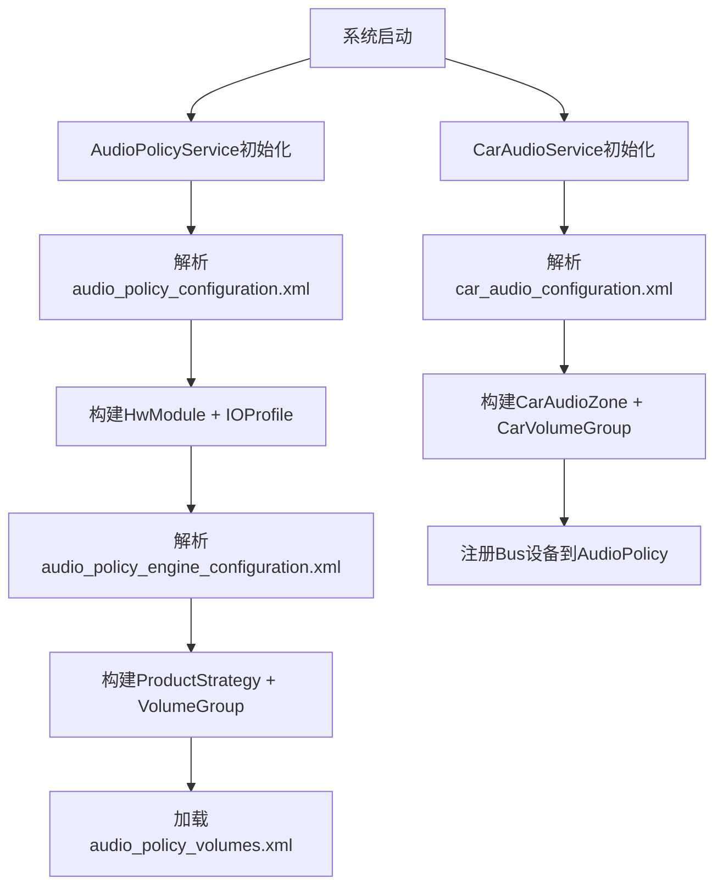

# 第十一篇：Vendor Layer

> [← 上一篇：AudioControl HAL](10_AudioControl_HAL.md) | [返回导航](README.md) | [下一篇：Audio Focus →](12_Audio_Focus_Deep_Dive.md)

---

## 11.1 配置文件体系总览

### 配置文件层次

```
┌───────────────────────────────────────────────────────┐
│ audio_policy_configuration.xml  ← 核心路由/设备配置    │
├───────────────────────────────────────────────────────┤
│ audio_policy_volumes.xml        ← 音量曲线定义         │
├───────────────────────────────────────────────────────┤
│ default_volume_tables.xml       ← 默认音量表          │
├───────────────────────────────────────────────────────┤
│ audio_policy_engine_configuration.xml ← 策略引擎配置  │
├───────────────────────────────────────────────────────┤
│ audio_effects.xml               ← 音效库声明          │
├───────────────────────────────────────────────────────┤
│ audio_effect_policy.xml         ← 系统效果策略        │
├───────────────────────────────────────────────────────┤
│ car_audio_configuration.xml     ← AAOS车载音频配置    │
├───────────────────────────────────────────────────────┤
│ mixer_paths.xml                 ← ALSA mixer路由      │
├───────────────────────────────────────────────────────┤
│ audio_platform_info.xml         ← SoC平台信息         │
└───────────────────────────────────────────────────────┘
```

---

## 11.2 audio_policy_configuration.xml — 核心配置

### 配置结构

```xml
<audioPolicyConfiguration version="7.0">
    <globalConfiguration />
    <modules>
        <module name="primary" halVersion="2.0">
            <attachedDevices>
                <item>Speaker</item>
                <item>Built-In Mic</item>
            </attachedDevices>
            <defaultOutputDevice>Speaker</defaultOutputDevice>
            <mixPorts>
                <mixPort name="primary output" role="source" flags="AUDIO_OUTPUT_FLAG_PRIMARY">
                    <profile ... />
                </mixPort>
            </mixPorts>
            <devicePorts>
                <devicePort tagName="Speaker" type="AUDIO_DEVICE_OUT_SPEAKER" role="sink">
                    <profile ... />
                </devicePort>
            </devicePorts>
            <routes>
                <route type="mix" sink="Speaker" sources="primary output"/>
            </routes>
        </module>
    </modules>
</audioPolicyConfiguration>
```

### 关键配置项解析

| 节点 | 说明 | 影响范围 |
|------|------|----------|
| `<globalConfiguration>` | 全局参数(深缓冲大小等) | AudioFlinger buffer分配 |
| `<module>` | HAL模块定义 | 对应一个Audio HAL库 |
| `<attachedDevices>` | 固定连接设备 | 系统启动时自动注册 |
| `<defaultOutputDevice>` | 默认输出设备 | 无其他设备时的路由目标 |
| `<mixPort>` | 软件混音端口 | 定义AudioFlinger可打开的输出/输入流 |
| `<devicePort>` | 硬件设备端口 | 定义HAL可用的物理设备 |
| `<route>` | 路由规则 | 定义mixPort到devicePort的连接 |

### 配置如何影响Framework行为

1. **mixPort的profile** → 决定AudioFlinger可打开的采样率/格式/通道
2. **mixPort的flags** → 决定Thread类型(PRIMARY→MixerThread, COMPRESS_OFFLOAD→OffloadThread)
3. **devicePort的type** → 决定AudioPolicyManager的设备类型识别
4. **route的sources→sink** → 决定哪些mixPort可以路由到哪些devicePort

---

## 11.3 audio_policy_volumes.xml — 音量曲线

### 曲线结构

```xml
<volumes>
    <volume stream="AUDIO_STREAM_MUSIC" deviceCategory="DEVICE_CATEGORY_SPEAKER">
        <point>0,-9000</point>
        <point>33,-3600</point>
        <point>66,-1600</point>
        <point>100,0</point>
    </volume>
    <volume stream="AUDIO_STREAM_MUSIC" deviceCategory="DEVICE_CATEGORY_HEADSET">
        <point>0,-9000</point>
        <point>33,-3600</point>
        <point>66,-1600</point>
        <point>100,0</point>
    </volume>
</volumes>
```

### 音量曲线映射

```
用户操作: 音量滑块从0到100
  → VolumeGroup查找对应stream type
  → 查找当前设备的deviceCategory(SPEAKER/HEADSET/EARPIECE)
  → 在曲线中插值计算dB衰减
  → 设置到AudioFlinger → HAL
```

---

## 11.4 audio_policy_engine_configuration.xml — 策略引擎配置

### 配置结构

```xml
<AudioPolicyEngineConfiguration>
    <productStrategies>
        <productStrategy name="strategy_media" id="0">
            <attributesGroup streamType="AUDIO_STREAM_MUSIC" volumeGroup="media">
                <attributes priority="1" usage="AUDIO_USAGE_MEDIA"/>
                <attributes priority="2" usage="AUDIO_USAGE_GAME"/>
            </attributesGroup>
        </productStrategy>
    </productStrategies>
    <volumeGroups>
        <volumeGroup name="media" id="0" defaultStream="AUDIO_STREAM_MUSIC">
            <streamType ref="AUDIO_STREAM_MUSIC"/>
        </volumeGroup>
    </volumeGroups>
</AudioPolicyEngineConfiguration>
```

### ProductStrategy → VolumeGroup映射

```
strategy_media → volumeGroup=media
strategy_phone → volumeGroup=voice_call
strategy_nav   → volumeGroup=navigation
strategy_alarm → volumeGroup=alarm
```

---

## 11.5 car_audio_configuration.xml — AAOS车载配置

### 配置结构

```xml
<carAudioConfiguration version="2">
    <zones>
        <zone name="primary zone" id="0" isPrimary="true"
              occupantZoneId="0">
            <volumeGroups>
                <group>
                    <device context="music" bus="0"
                            address="bus0_media_out"
                            useHalAudioRouting="false"/>
                    <device context="navigation" bus="1"
                            address="bus1_navigation_out"/>
                </group>
                <group>
                    <device context="call" bus="2"
                            address="bus2_call_out"/>
                    <device context="alarm" bus="3"
                            address="bus3_alarm_out"/>
                </group>
            </volumeGroups>
        </zone>
        <zone name="rear zone" id="1" occupantZoneId="1">
            <volumeGroups>
                <group>
                    <device context="music" bus="10"
                            address="bus10_rear_media_out"/>
                </group>
            </volumeGroups>
        </zone>
    </zones>
</carAudioConfiguration>
```

### 关键字段说明

| 字段 | 说明 | 影响 |
|------|------|------|
| `isPrimary` | 是否主Zone | 主Zone接收所有未指定Zone的音频 |
| `occupantZoneId` | 关联的乘员Zone | Audio Mirroring时使用 |
| `bus` | Bus地址 | 对应Audio HAL的输出设备地址 |
| `context` | 音频上下文 | CarAudioContext枚举值 |
| `useHalAudioRouting` | 是否使用HAL路由 | false=Framework路由, true=HAL路由 |

---

## 11.6 配置解析流程



---

## 11.7 OEM定制指南

| 定制需求 | 修改文件 | 说明 |
|----------|---------|------|
| 添加新音频设备 | audio_policy_configuration.xml | 添加devicePort + route |
| 修改默认音量曲线 | audio_policy_volumes.xml | 调整point的dB值 |
| 添加新ProductStrategy | audio_policy_engine_configuration.xml | 添加strategy条目 |
| 添加车载Zone | car_audio_configuration.xml | 添加zone + volumeGroup |
| 添加Vendor音效 | audio_effects.xml | 声明effect + library |
| 修改ALSA路由 | mixer_paths.xml | 配置SoC DSP路由 |
| 自定义焦点矩阵 | CarAudioFocus代码 | 修改INTERACTION_MATRIX |

---

> [← 上一篇：AudioControl HAL](10_AudioControl_HAL.md) | [返回导航](README.md) | [下一篇：Audio Focus →](12_Audio_Focus_Deep_Dive.md)