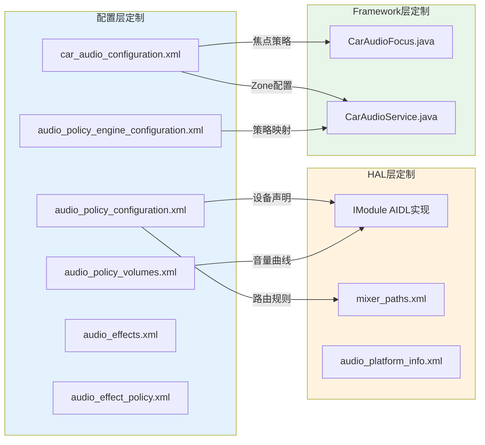
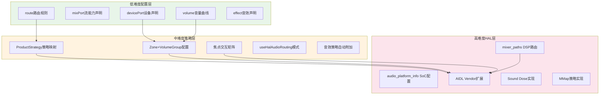

## 11.10 OEM定制点完整矩阵

> [← 上一个](11_11.9_car_audio_configuration.xml_深度解析.md) | [← 返回11章](README.md) | [返回导航](../README.md) | [下一个 →](11_11.11_AIDLHIDL_Vendor_HAL实现架构.md)

---

### 11.10.1 矩阵总览

OEM定制AAOS音频系统涉及6个配置文件和多个源码修改点。本矩阵从定制维度、文件位置、关键参数、影响范围、难度等级5个维度全面梳理所有可定制点。



### 11.10.2 audio_policy_configuration.xml 定制点

#### 11.10.2.1 设备声明定制

| 定制点 | XML标签 | 关键属性 | 定制影响 | 难度 |
|--------|---------|---------|---------|------|
| 输出设备类型 | devicePort | type=AUDIO_DEVICE_OUT_* | HAL设备识别 | 低 |
| Bus设备地址 | devicePort | address=busX_xxx | Car端Context路由 | 低 |
| 设备角色 | devicePort | role=sink/source | 输出/输入方向 | 低 |
| 增益控制 | gains | min/max/step/default | 音量范围和步进 | 低 |
| 增益模式 | gain | mode=JOINT/CHANNELS/RAMP | 增益调节方式 | 中 |
| 音量关联 | gain | useForVolume=true | Car端必须为true | 低 |
| 蓝牙编码 | devicePort | encodedFormats | A2DP支持的编码格式 | 中 |
| 附加设备 | attachedDevices | tagName列表 | Framework可见设备 | 低 |
| 默认输出 | defaultOutputDevice | tagName | 无匹配路由时的输出 | 低 |

**Car端Bus设备定制清单**：

| Bus编号 | 典型用途 | devicePort address | mixPort name | gains范围 |
|---------|---------|-------------------|-------------|-----------|
| bus0 | 媒体 | bus0_media_out | mixport_bus0_media_out | -3200~600 |
| bus1 | 导航 | bus1_navigation_out | mixport_bus1_navigation_out | -3200~600 |
| bus2 | 语音助手 | bus2_voice_command_out | mixport_bus2_voice_command_out | -3200~600 |
| bus3 | 来电铃声 | bus3_call_ring_out | mixport_bus3_call_ring_out | -3200~600 |
| bus4 | 通话 | bus4_call_out | mixport_bus4_call_out | -3200~600 |
| bus5 | 闹钟 | bus5_alarm_out | mixport_bus5_alarm_out | -3200~600 |
| bus6 | 通知 | bus6_notification_out | mixport_bus6_notification_out | -3200~600 |
| bus7 | 系统音 | bus7_system_sound_out | mixport_bus7_system_sound_out | -3200~600 |
| bus100 | Zone1 | bus100_audio_zone_1 | mixport_bus100_audio_zone_1 | -3200~600 |
| bus1000 | 镜像 | bus1000_mirror_device | mixport_bus1000_mirror_device | -3200~600 |

#### 11.10.2.2 流能力定制

| 定制点 | XML标签 | 关键属性 | 定制影响 | 难度 |
|--------|---------|---------|---------|------|
| 输出flags | mixPort | flags=PRIMARY/FAST/DEEP_BUFFER等 | Thread类型选择 | 低 |
| 采样率 | profile | samplingRates | 支持的采样率列表 | 低 |
| 音频格式 | profile | format=PCM_16BIT/PCM_FLOAT等 | 支持的数据格式 | 低 |
| 声道掩码 | profile | channelMasks=STEREO/MONO等 | 声道布局 | 低 |
| 最大活跃流 | mixPort | maxActiveCount | 同类型并发流数 | 中 |
| 最大打开流 | mixPort | maxOpenCount | 同类型最大打开数 | 中 |
| 独占模式 | mixPort | flags=COMPRESS_OFFLOAD | 硬件解码直出 | 中 |

**flags→Thread映射定制约束**：

| flags值 | 对应Thread类型 | 延迟要求 | OEM定制空间 |
|---------|---------------|---------|------------|
| PRIMARY | MixerThread | <20ms | 调整buffer大小 |
| FAST | FastMixerThread | <5ms | 调整burst size |
| DEEP_BUFFER | DeepBufferThread | <100ms | 调整buffer深度 |
| COMPRESS_OFFLOAD | OffloadThread | 不限 | 编码格式扩展 |
| MMAP_NOIRQ | MmapThread | <3ms | DSP固件配置 |
| DIRECT | DirectOutputThread | <50ms | 格式限定 |

#### 11.10.2.3 路由规则定制

| 定制点 | XML标签 | 关键属性 | 定制影响 | 难度 |
|--------|---------|---------|---------|------|
| 输出路由 | route | type=mix, sink=devicePort | mixPort→devicePort映射 | 低 |
| 输入路由 | route | type=mix, source=devicePort | 输入设备→mixPort映射 | 低 |
| 多源路由 | route | sources=逗号分隔列表 | 多mixPort共享devicePort | 中 |

**Car端路由约束**：Car端每Bus必须是1:1:1映射（一个mixPort→一个route→一个devicePort），不支持多对一路由。

### 11.10.3 audio_policy_volumes.xml 定制点

| 定制点 | XML标签 | 关键属性 | 定制影响 | 难度 |
|--------|---------|---------|---------|------|
| 音量曲线定义 | volume | deviceCategory+ref段 | 设备类别音量插值曲线 | 低 |
| 曲线段点 | ref | point=x%,ydB | 音量百分比→增益dB映射 | 低 |
| 设备类别 | volume | deviceCategory=HEADSET/SPEAKER等 | 不同设备独立曲线 | 低 |
| 默认音量表 | default_volume_tables | volume | 未指定设备时使用 | 低 |

**音量曲线定制原则**：

| 设备类别 | 典型min dB | 典型max dB | 推荐段数 | 说明 |
|---------|-----------|-----------|---------|------|
| SPEAKER | -60dB | 0dB | 5-7段 | 车载主输出 |
| HEADSET | -56dB | 0dB | 5-7段 | 耳机输出 |
| EARPIECE | -48dB | 0dB | 4-5段 | 听筒 |
| BUS（Car） | -32dB | 6dB | 5段 | Bus增益范围 |

### 11.10.4 audio_policy_engine_configuration.xml 定制点

| 定制点 | XML标签 | 关键属性 | 定制影响 | 难度 |
|--------|---------|---------|---------|------|
| ProductStrategy | ProductStrategy | id+attributes | Usage→Strategy映射 | 中 |
| Strategy属性 | Attributes | usage+contentType+tags | 策略匹配条件 | 中 |
| VolumeGroup | VolumeGroup | device+ref | Strategy→VolumeGroup关联 | 中 |
| 焦点交互 | LegacyRoutingStrategy | interaction | 焦点优先级定义 | 高 |
| 默认策略 | default | productStrategy | 未匹配时回退策略 | 低 |

**Car端策略引擎定制**：
- CarAudioContext的id可直接对应ProductStrategy的id
- OEM扩展Context需要同步扩展ProductStrategy
- useCoreAudioRouting=true时策略引擎才生效

### 11.10.5 car_audio_configuration.xml 定制点

#### 11.10.5.1 Zone配置定制

| 定制点 | XML标签 | 关键属性 | 定制影响 | 难度 |
|--------|---------|---------|---------|------|
| Zone数量 | zone | audioZoneId | 多区域音频独立 | 中 |
| 主Zone | zone | isPrimary=true | 系统默认音频区域 | 低 |
| 乘员绑定 | zone | occupantZoneId | 乘客Zone自动分配 | 中 |
| Zone名称 | zone | name | 显示标识 | 低 |

#### 11.10.5.2 VolumeGroup定制

| 定制点 | XML标签 | 关键属性 | 定制影响 | 难度 |
|--------|---------|---------|---------|------|
| 音量组数量 | group | name | 独立音量控制维度 | 中 |
| Bus绑定 | device | address | Context→Bus映射 | 低 |
| Context分配 | context | context=xxx | 音频语义到Bus的路由 | 低 |
| HAL路由模式 | device | useHalAudioRouting | Framework vs HAL路由 | 中 |
| 多配置 | zoneConfig | isDefault | 运行时配置切换 | 高 |

#### 11.10.5.3 输入/镜像定制

| 定制点 | XML标签 | 关键属性 | 定制影响 | 难度 |
|--------|---------|---------|---------|------|
| 输入设备 | inputDevice | address | Zone录音设备绑定 | 中 |
| 镜像设备 | mirroringDevice | address | 音频镜像输出 | 高 |
| OEM Context | oemContext | name+id+audioAttributes | 自定义音频上下文 | 高 |

### 11.10.6 audio_effects.xml 定制点

| 定制点 | XML标签 | 关键属性 | 定制影响 | 难度 |
|--------|---------|---------|---------|------|
| 音效库声明 | effectLibraries | library name+path | Vendor音效SO库 | 中 |
| 音效类型 | effect | name+uuid | 可用音效类型标识 | 低 |
| 音效库绑定 | effect | library=xxx | 音效到SO库映射 | 低 |
| 音效代理 | effectProxy | library+uuid | 音效实现代理 | 中 |
| 默认音效 | effect | isDefault=true | 首选音效实现 | 低 |

**车载常用音效清单**：

| 音效类型 | UUID | 用途 | OEM定制 |
|---------|------|------|---------|
| Acoustic Echo Canceler | 7b491460-8d4d-11e0-8c10-0002a5d5c51b | 通话回声消除 | 替换为Vendor实现 |
| Noise Suppression | 58b4b260-8e06-11e0-a2dd-0002a5d5c51b | 通话降噪 | 替换为Vendor实现 |
| Automatic Gain Control | 0a2a18f0-8d4d-11e0-a2dd-0002a5d5c51b | 自动增益控制 | 替换为Vendor实现 |
| Loudness Enhancer | fe3199be-aed0-4f02-acb0-6ce076260e73 | 响度增强 | 车载常用 |
| Equalizer | 0944527a-5a62-463f-8698-3630f5e9e6a3 | 均衡器 | 必须定制 |
| Bass Boost | 6b030350-5aae-11e0-82e4-0002a5d5c51b | 低音增强 | 车载常用 |
| Virtualizer | bf3a6a80-5a62-11e0-a2dd-0002a5d5c51b | 空间音效 | 可选 |
| Dynamics Processing | 7c0cc710-5a62-11e0-a2dd-0002a5d5c51b | 动态处理 | 高端车型 |

### 11.10.7 audio_effect_policy.xml 定制点

| 定制点 | XML标签 | 关键属性 | 定制影响 | 难度 |
|--------|---------|---------|---------|------|
| 音效附加规则 | effect | uuid+stream/device | 自动附加音效 | 中 |
| 输出设备音效 | deviceEffect | deviceAddress+effect | 特定设备音效 | 中 |
| 音效策略 | effects->effect | streamType+usage | 特定流类型音效 | 中 |

### 11.10.8 mixer_paths.xml 定制点

| 定制点 | XML标签 | 关键属性 | 定制影响 | 难度 |
|--------|---------|---------|---------|------|
| 控制器定义 | ctl | name+value | ALSA mixer控制 | 高 |
| 路由路径 | path | name | DSP内部信号路由 | 高 |
| 增益设定 | ctl | name=xxx Gain value | 模拟增益配置 | 高 |
| 开关控制 | ctl | name=xxx Switch | 信号通断控制 | 高 |
| 交叉路由 | path | →交叉引用 | 多路径组合 | 高 |

**mixer_paths.xml典型结构**：

```xml
<mixer>
    <!-- 基础路由 -->
    <path name="media-playback">
        <ctl name="PRI_MI2S_RX Audio Mixer MultiMedia1" value="1"/>
        <ctl name="MultiMedia1 Mixer PRI_MI2S_TX" value="0"/>
    </path>
    <!-- 通话路由 -->
    <path name="voice-call">
        <ctl name="PRI_MI2S_RX_Voice Mixer Voice" value="1"/>
        <ctl name="Voice_Tx Mixer PRI_MI2S_TX_Voice" value="1"/>
    </path>
</mixer>
```

### 11.10.9 audio_platform_info.xml 定制点

| 定制点 | XML标签 | 关键属性 | 定制影响 | 难度 |
|--------|---------|---------|---------|------|
| 编解码器映射 | codec | name+device | SoC codec→设备映射 | 高 |
| 设备参数覆盖 | device | backend+channels+rate | 后端参数覆盖 | 高 |
| 后端配置 | backend | bit_width+sample_rate | I2S/TDM接口配置 | 高 |
| 外部设备 | external_device | type+address | USB/A2DP等外部设备 | 中 |

### 11.10.10 AIDL Vendor扩展定制点

| 定制点 | AIDL方法 | 参数类型 | 定制影响 | 难度 |
|--------|---------|---------|---------|------|
| Vendor参数读 | getVendorParameters | VendorParameter[] | HAL私有参数查询 | 高 |
| Vendor参数写 | setVendorParameters | VendorParameter[] | HAL私有参数配置 | 高 |
| Sound Dose | getSoundDose | ISoundDose | 安全听音剂量 | 高 |
| MMap策略 | getMmapPolicyInfos | MmapPolicyInfo[] | AAudio低延迟策略 | 高 |
| 蓝牙A2DP | getBluetoothA2dp | IBluetoothA2dp | A2DP协议控制 | 中 |
| 蓝牙LE | getBluetoothLe | IBluetoothLe | BLE Audio控制 | 中 |
| 电话 | getTelephony | ITelephony | 通话音频控制 | 中 |

### 11.10.11 Framework层定制点

| 定制点 | 源码文件 | 关键方法/常量 | 定制影响 | 难度 |
|--------|---------|-------------|---------|------|
| 焦点交互矩阵 | CarAudioFocus.java | INTERACTION_MATRIX | Context间焦点优先级 | 高 |
| Duck策略 | CarAudioContext.java | sContextsToDuck | Duck降音关系 | 高 |
| Usage映射 | CarAudioContext.java | sContextsMap | Usage→Context映射 | 中 |
| 音量组限制 | CarAudioService.java | MAX_VOLUME_GROUPS | Zone最大VolumeGroup数 | 低 |
| Zone数量限制 | CarAudioService.java | MAX_AUDIO_ZONES | 最大Zone数量 | 低 |
| 核心路由模式 | CarAudioContext.java | mUseCoreAudioRouting | 传统 vs Strategy路由 | 中 |

### 11.10.12 定制难度与依赖关系



### 11.10.13 定制验证清单

| 验证项 | 验证命令 | 期望结果 |
|--------|---------|---------|
| 设备枚举 | dumpsys media.audio_policy \| grep BUS | 所有Bus设备可见 |
| 路由验证 | dumpsys audio \| grep Route | Context→Bus路由正确 |
| 音量组 | dumpsys audio \| grep VolumeGroup | VolumeGroup映射符合预期 |
| Zone配置 | dumpsys audio \| grep Zone | Zone数量和属性正确 |
| 音效列表 | dumpsys media.audio_flinger \| grep Effect | 音效已加载 |
| 增益范围 | dumpsys audio \| grep gain | gains范围符合gains配置 |
| Vendor参数 | dumpsys audio \| grep vendor | Vendor参数可读写 |

---

[← 上一个](11_11.9_car_audio_configuration.xml_深度解析.md) | [← 返回11章](README.md) | [返回导航](../README.md) | [下一个 →](11_11.11_AIDLHIDL_Vendor_HAL实现架构.md)