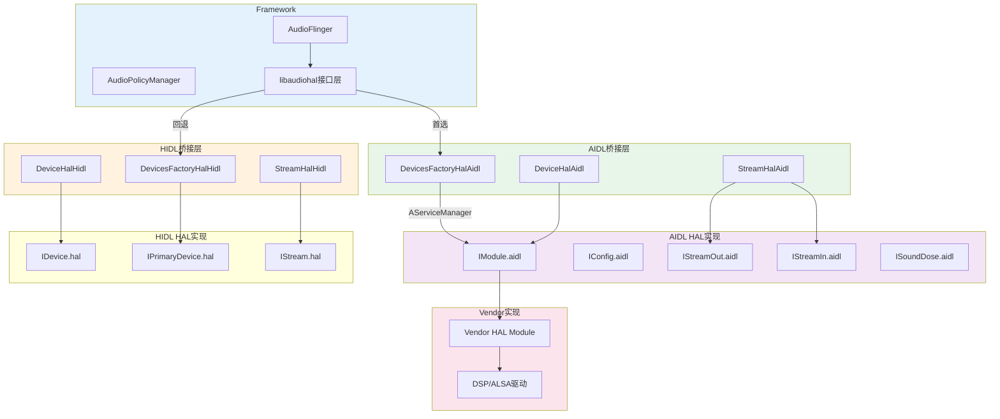
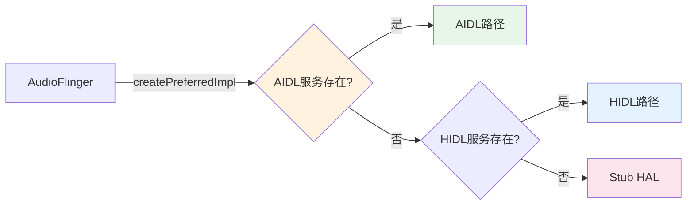

## 11.11 AIDL/HIDL Vendor HAL实现架构

> [← 上一个](11_11.10_OEM定制点完整矩阵.md) | [← 返回11章](README.md) | [返回导航](../README.md) | [下一篇 →](../12_Audio_Focus_Deep_Dive/README.md)

---

### 11.11.1 架构总览

Android 14音频HAL提供AIDL和HIDL双路径架构。AIDL是主要路径（Android 12+），HIDL为兼容路径。OEM必须实现AIDL HAL才能在新平台上运行。



### 11.11.2 IModule AIDL接口完整方法列表

[`IModule.aidl`](hardware/interfaces/audio/aidl/android/hardware/audio/core/IModule.aidl:61)定义了音频HAL模块的完整接口。

#### 11.11.2.1 流管理方法

| 方法 | 返回值 | 说明 |
|------|--------|------|
| [`openInputStream()`](hardware/interfaces/audio/aidl/android/hardware/audio/core/IModule.aidl:387) | IStreamIn + StreamDescriptor | 打开输入流，参数OpenInputStreamArguments |
| [`openOutputStream()`](hardware/interfaces/audio/aidl/android/hardware/audio/core/IModule.aidl:468) | IStreamOut + StreamDescriptor | 打开输出流，参数OpenOutputStreamArguments |
| [`getSupportedPlaybackRateFactors()`](hardware/interfaces/audio/aidl/android/hardware/audio/core/IModule.aidl:495) | SupportedPlaybackRateFactors | 获取播放速率范围（0.5~2.0推荐） |
| [`generateHwAvSyncId()`](hardware/interfaces/audio/aidl/android/hardware/audio/core/IModule.aidl:806) | int | 生成HW AV Sync ID |

**OpenInputStreamArguments结构**：

| 字段 | 类型 | 说明 |
|------|------|------|
| portConfigId | int | mixPort配置ID |
| sinkMetadata | SinkMetadata | 录音描述信息 |
| bufferSizeFrames | long | 请求的buffer最小帧数 |

**OpenOutputStreamArguments结构**：

| 字段 | 类型 | 说明 |
|------|------|------|
| portConfigId | int | mixPort配置ID |
| sourceMetadata | SourceMetadata | 播放描述信息 |
| offloadInfo | AudioOffloadInfo? | Offload模式附加信息 |
| bufferSizeFrames | long | 请求的buffer最小帧数 |
| callback | IStreamCallback? | 非阻塞模式回调 |
| eventCallback | IStreamOutEventCallback? | 流事件回调 |

#### 11.11.2.2 端口配置方法

| 方法 | 返回值 | 说明 |
|------|--------|------|
| [`setAudioPortConfig()`](hardware/interfaces/audio/aidl/android/hardware/audio/core/IModule.aidl:584) | boolean + suggested | 设置端口配置，失败返回建议值 |
| [`resetAudioPortConfig()`](hardware/interfaces/audio/aidl/android/hardware/audio/core/IModule.aidl:619) | void | 重置端口配置 |
| [`getAudioPortConfigs()`](hardware/interfaces/audio/aidl/android/hardware/audio/core/IModule.aidl:289) | AudioPortConfig[] | 获取所有活跃端口配置 |
| [`getAudioPorts()`](hardware/interfaces/audio/aidl/android/hardware/audio/core/IModule.aidl:301) | AudioPort[] | 获取所有端口当前状态 |
| [`getAudioPort()`](hardware/interfaces/audio/aidl/android/hardware/audio/core/IModule.aidl:273) | AudioPort | 获取指定端口状态 |

#### 11.11.2.3 Patch路由方法

| 方法 | 返回值 | 说明 |
|------|--------|------|
| [`setAudioPatch()`](hardware/interfaces/audio/aidl/android/hardware/audio/core/IModule.aidl:544) | AudioPatch | 创建或更新音频Patch |
| [`resetAudioPatch()`](hardware/interfaces/audio/aidl/android/hardware/audio/core/IModule.aidl:597) | void | 重置指定Patch |
| [`getAudioPatches()`](hardware/interfaces/audio/aidl/android/hardware/audio/core/IModule.aidl:258) | AudioPatch[] | 获取所有Patch |

**setAudioPatch约束**：
- 更新Patch不能中断已有Stream的播放
- 端口配置必须通过setAudioPortConfig预先创建
- 必须存在允许连接的AudioRoute
- 独占路由的sink端口已被Patch时返回EX_ILLEGAL_STATE

#### 11.11.2.4 设备连接方法

| 方法 | 返回值 | 说明 |
|------|--------|------|
| [`connectExternalDevice()`](hardware/interfaces/audio/aidl/android/hardware/audio/core/IModule.aidl:227) | AudioPort | 连接外部设备，返回新AudioPort实例 |
| [`disconnectExternalDevice()`](hardware/interfaces/audio/aidl/android/hardware/audio/core/IModule.aidl:248) | void | 断开外部设备 |

**connectExternalDevice协议**：
1. 通过getAudioPorts获取端口模板ID
2. 调用connectExternalDevice，HAL查询设备profile并返回新端口
3. 调用setAudioPortConfig配置端口
4. 通过getAudioRoutesForAudioPort查询可用路由

#### 11.11.2.5 路由查询方法

| 方法 | 返回值 | 说明 |
|------|--------|------|
| [`getAudioRoutes()`](hardware/interfaces/audio/aidl/android/hardware/audio/core/IModule.aidl:313) | AudioRoute[] | 获取所有路由 |
| [`getAudioRoutesForAudioPort()`](hardware/interfaces/audio/aidl/android/hardware/audio/core/IModule.aidl:328) | AudioRoute[] | 获取指定端口相关路由 |

#### 11.11.2.6 音量控制方法

| 方法 | 返回值 | 说明 |
|------|--------|------|
| [`getMasterMute()`](hardware/interfaces/audio/aidl/android/hardware/audio/core/IModule.aidl:633) | boolean | 获取主静音状态 |
| [`setMasterMute()`](hardware/interfaces/audio/aidl/android/hardware/audio/core/IModule.aidl:650) | void | 设置主静音（不影响通话） |
| [`getMasterVolume()`](hardware/interfaces/audio/aidl/android/hardware/audio/core/IModule.aidl:662) | float | 获取主音量（1.0=无衰减，0.0=静音） |
| [`setMasterVolume()`](hardware/interfaces/audio/aidl/android/hardware/audio/core/IModule.aidl:683) | void | 设置主音量（通话音量通过ITelephony控制） |
| [`getMicMute()`](hardware/interfaces/audio/aidl/android/hardware/audio/core/IModule.aidl:695) | boolean | 获取麦克风静音 |
| [`setMicMute()`](hardware/interfaces/audio/aidl/android/hardware/audio/core/IModule.aidl:710) | void | 设置麦克风静音 |

#### 11.11.2.7 蓝牙音频方法

| 方法 | 返回值 | 说明 |
|------|--------|------|
| [`getTelephony()`](hardware/interfaces/audio/aidl/android/hardware/audio/core/IModule.aidl:91) | ITelephony? | 获取电话音频控制接口 |
| [`getBluetooth()`](hardware/interfaces/audio/aidl/android/hardware/audio/core/IModule.aidl:105) | IBluetooth? | 获取BT SCO/HFP控制接口 |
| [`getBluetoothA2dp()`](hardware/interfaces/audio/aidl/android/hardware/audio/core/IModule.aidl:119) | IBluetoothA2dp? | 获取A2DP控制接口 |
| [`getBluetoothLe()`](hardware/interfaces/audio/aidl/android/hardware/audio/core/IModule.aidl:133) | IBluetoothLe? | 获取BLE Audio控制接口 |

**接口返回规则**：
- 不支持时返回null，不抛异常
- 同一HAL模块生命周期内返回同一实例
- 创建失败时抛EX_ILLEGAL_STATE

#### 11.11.2.8 Vendor扩展方法

| 方法 | 返回值 | 说明 |
|------|--------|------|
| [`getVendorParameters()`](hardware/interfaces/audio/aidl/android/hardware/audio/core/IModule.aidl:819) | VendorParameter[] | 获取Vendor参数 |
| [`setVendorParameters()`](hardware/interfaces/audio/aidl/android/hardware/audio/core/IModule.aidl:833) | void | 设置Vendor参数，async=true异步返回 |

**VendorParameter结构**：

```aidl
parcelable VendorParameter {
    @utf8InCpp String id;       // Vendor自定义参数ID
    ParcelableHolder params;    // Vendor自定义参数包
}
```

#### 11.11.2.9 设备音效方法

| 方法 | 返回值 | 说明 |
|------|--------|------|
| [`addDeviceEffect()`](hardware/interfaces/audio/aidl/android/hardware/audio/core/IModule.aidl:849) | void | 对设备端口添加音效 |
| [`removeDeviceEffect()`](hardware/interfaces/audio/aidl/android/hardware/audio/core/IModule.aidl:863) | void | 移除设备端口音效 |

#### 11.11.2.10 系统通知方法

| 方法 | 返回值 | 说明 |
|------|--------|------|
| [`updateAudioMode()`](hardware/interfaces/audio/aidl/android/hardware/audio/core/IModule.aidl:743) | void | 通知音频模式变更 |
| [`updateScreenRotation()`](hardware/interfaces/audio/aidl/android/hardware/audio/core/IModule.aidl:765) | void | 通知屏幕旋转（0/90/180/270） |
| [`updateScreenState()`](hardware/interfaces/audio/aidl/android/hardware/audio/core/IModule.aidl:775) | void | 通知屏幕开关状态 |

#### 11.11.2.11 AAudio MMap方法

| 方法 | 返回值 | 说明 |
|------|--------|------|
| [`getMmapPolicyInfos()`](hardware/interfaces/audio/aidl/android/hardware/audio/core/IModule.aidl:876) | AudioMMapPolicyInfo[] | 获取MMap策略信息 |
| [`supportsVariableLatency()`](hardware/interfaces/audio/aidl/android/hardware/audio/core/IModule.aidl:887) | boolean | 是否支持可变延迟控制 |
| [`getAAudioMixerBurstCount()`](hardware/interfaces/audio/aidl/android/hardware/audio/core/IModule.aidl:900) | int | AAudio mixer burst数（默认2） |
| [`getAAudioHardwareBurstMinUsec()`](hardware/interfaces/audio/aidl/android/hardware/audio/core/IModule.aidl:908) | int | AAudio硬件burst最小微秒数 |

#### 11.11.2.12 Sound Dose方法

| 方法 | 返回值 | 说明 |
|------|--------|------|
| [`getSoundDose()`](hardware/interfaces/audio/aidl/android/hardware/audio/core/IModule.aidl:790) | ISoundDose? | 获取安全听音剂量接口 |

**Sound Dose适用场景**：
- 设备必须符合IEC62368-1第3版音频安全要求
- 使用音频Offload解码或其他直接播放路径
- 音量控制在HAL以下层级完成

#### 11.11.2.13 其他方法

| 方法 | 返回值 | 说明 |
|------|--------|------|
| [`getMicrophones()`](hardware/interfaces/audio/aidl/android/hardware/audio/core/IModule.aidl:726) | MicrophoneInfo[] | 获取内置麦克风信息 |
| [`setModuleDebug()`](hardware/interfaces/audio/aidl/android/hardware/audio/core/IModule.aidl:78) | void | 设置调试配置（仅xTS测试） |

### 11.11.3 DevicesFactoryHalAidl 关键实现

[`DevicesFactoryHalAidl.cpp`](frameworks/av/media/libaudiohal/impl/DevicesFactoryHalAidl.cpp)是AIDL HAL的入口桥接层。

```mermaid
sequenceDiagram
    participant AF as AudioFlinger
    participant DF as DevicesFactoryHalAidl
    participant SM as AServiceManager
    participant IM as IModule AIDL
    participant DH as DeviceHalAidl

    AF->>DF: openDevice(name)
    DF->>SM: getService(name)
    SM->>IM: fromBinder(service)
    DF->>DH: new DeviceHalAidl(IModule)
    DH->>IM: getAudioPorts()
    DH->>IM: getAudioRoutes()
    DH-->>AF: DeviceHalAidl ready
```



**核心流程**：

1. **服务发现**：通过`AServiceManager_getService()`查找`IModule/<name>`服务
2. **设备名映射**：`default`→`primary`转换，支持多模块实例
3. **端口初始化**：打开设备后调用getAudioPorts/getAudioRoutes获取初始状态
4. **版本协商**：通过IConfig::getInterfaceVersion获取AIDL版本号

### 11.11.4 AIDL vs HIDL 完整对比

| 维度 | AIDL实现 | HIDL实现 |
|------|---------|---------|
| 接口定义 | IModule.aidl (900+行) | IDevice.hal + IPrimaryDevice.hal |
| 服务注册 | AServiceManager | HWServicemanager |
| 数据传输 | 共享内存+Binder | FMQ+HwBinder |
| 调用模式 | 同步AIDL调用 | Return<T>回调模式 |
| 音量控制 | setMasterVolume(float) | setMasterVolume(float) Return<void> |
| 参数传递 | setVendorParameters(VendorParameter[]) | setParameters(hidl_vec<ParameterValue>) |
| Stream创建 | openOutputStream(结构化参数) | openOutputStream(Return回调) |
| 蓝牙接口 | getBluetooth*()统一接口 | IPrimaryDevice单独方法 |
| Sound Dose | getSoundDose()内置 | ISoundDoseFactory独立HAL |
| MMap | getMmapPolicyInfos()内置 | 不支持 |
| 设备效果 | addDeviceEffect/removeDeviceEffect | 不支持 |
| 外部设备 | connectExternalDevice/disconnectExternalDevice | 不支持 |
| 版本 | V1 (Android 12-13), V2 (Android 14) | 2.0, 7.1 |

### 11.11.5 Vendor HAL实现模板

OEM需要实现IModule接口的核心子集。以下是车载场景的最小实现模板：

```cpp
// VendorAudioModule.h
class VendorAudioModule : public ::aidl::android::hardware::audio::core::BnModule {
public:
    // --- 必须实现的方法 ---
    ndk::ScopedAStatus getAudioPorts(std::vector<AudioPort>* ports) override;
    ndk::ScopedAStatus getAudioRoutes(std::vector<AudioRoute>* routes) override;
    ndk::ScopedAStatus getAudioPortConfigs(std::vector<AudioPortConfig>* configs) override;
    ndk::ScopedAStatus setAudioPortConfig(const AudioPortConfig& requested,
                                          AudioPortConfig* suggested) override;
    ndk::ScopedAStatus openOutputStream(const OpenOutputStreamArguments& args,
                                         OpenOutputStreamReturn* result) override;
    ndk::ScopedAStatus openInputStream(const OpenInputStreamArguments& args,
                                        OpenInputStreamReturn* result) override;
    ndk::ScopedAStatus setAudioPatch(const AudioPatch& requested,
                                      AudioPatch* result) override;
    ndk::ScopedAStatus resetAudioPatch(int32_t patchId) override;

    // --- 车载必须实现 ---
    ndk::ScopedAStatus getMasterMute(bool* muted) override;
    ndk::ScopedAStatus setMasterMute(bool muted) override;
    ndk::ScopedAStatus getMasterVolume(float* volume) override;
    ndk::ScopedAStatus setMasterVolume(float volume) override;

    // --- Vendor扩展 ---
    ndk::ScopedAStatus getVendorParameters(const std::vector<std::string>& ids,
                                            std::vector<VendorParameter>* params) override;
    ndk::ScopedAStatus setVendorParameters(const std::vector<VendorParameter>& params,
                                            bool async) override;

    // --- 可选实现（返回null/空/UNSUPPORTED） ---
    ndk::ScopedAStatus getTelephone(std::shared_ptr<ITelephony>* telephony) override;
    ndk::ScopedAStatus getBluetooth(std::shared_ptr<IBluetooth>* bt) override;
    ndk::ScopedAStatus getBluetoothA2dp(std::shared_ptr<IBluetoothA2dp>* a2dp) override;
    ndk::ScopedAStatus getBluetoothLe(std::shared_ptr<IBluetoothLe>* le) override;
    ndk::ScopedAStatus getSoundDose(std::shared_ptr<ISoundDose>* sd) override;
};
```

### 11.11.6 Vendor参数扩展实战

OEM通过VendorParameter传递私有参数，实现Framework到HAL的定制通信。

#### 11.11.6.1 参数定义

```aidl
// Vendor自定义参数ID
const String DSC_PARAM_DUCK = "oem_dsc_duck";
const String DSC_PARAM_GAIN = "oem_dsc_gain";
const String DSC_PARAM_DSP_MODE = "oem_dsp_mode";
```

#### 11.11.6.2 Framework端调用

```java
// CarAudioService中设置Vendor参数
AudioManager am = context.getSystemService(AudioManager.class);
// 通过AudioFlinger间接调用setVendorParameters
Bundle params = new Bundle();
params.putInt("bus0_gain_mb", -1200);  // 设置bus0增益为-12dB
am.setParameters("oem_dsc_gain=bus0:-1200");
```

#### 11.11.6.3 HAL端处理

```cpp
ndk::ScopedAStatus VendorAudioModule::setVendorParameters(
        const std::vector<VendorParameter>& params, bool async) {
    for (const auto& param : params) {
        if (param.id == "oem_dsc_gain") {
            // 解析增益参数并应用到ALSA mixer
            int busId, gainMb;
            parseGainParam(param.params, &busId, &gainMb);
            applyBusGain(busId, gainMb);
        } else if (param.id == "oem_dsp_mode") {
            // 切换DSP模式（通话/媒体/导航）
            int mode;
            parseDspModeParam(param.params, &mode);
            switchDspMode(mode);
        }
    }
    return ndk::ScopedAStatus::ok();
}
```

### 11.11.7 Car端HAL实现关键点

#### 11.11.7.1 Bus设备端口初始化

```cpp
ndk::ScopedAStatus VendorAudioModule::getAudioPorts(
        std::vector<AudioPort>* ports) {
    // 添加8个Bus输出端口
    for (int i = 0; i < 8; i++) {
        AudioPort port;
        port.id = generatePortId();
        port.ext.setTag(AudioPortDeviceExt::Tag::device);
        auto& devExt = port.ext.get<AudioPortDeviceExt::Tag::device>();
        devExt.device.type.type = AudioDeviceType::OUT_DEVICE;
        devExt.device.type.connection = AudioDeviceConnection::BUS;
        devExt.address = "bus" + std::to_string(i) + "_" + kBusNames[i];
        // 添加gains配置
        AudioPortDeviceExt::Gain gain;
        gain.mode = AudioGainMode::JOINT;
        gain.minValue = -3200;  // -32dB
        gain.maxValue = 600;    // +6dB
        gain.defaultValue = 0;
        gain.stepValue = 100;   // 1dB步进
        devExt.gains.push_back(gain);
        ports->push_back(port);
    }
    // 添加输入端口(Mic, FM Tuner等)
    // ...
    return ndk::ScopedAStatus::ok();
}
```

#### 11.11.7.2 Patch路由实现

Car端每个Bus设备独立路由，setAudioPatch实现需要：

1. 根据portConfigId查找mixPort和devicePort
2. 检查AudioRoute是否允许该连接
3. 调用ALSA mixer配置DSP路由
4. 返回AudioPatch（含延迟信息）

#### 11.11.7.3 Stream管理

Car端openOutputStream需要：
1. 根据portConfigId确定目标Bus
2. 配置ALSA PCM设备
3. 分配共享内存buffer
4. 返回StreamDescriptor（含buffer信息、延迟、格式）

### 11.11.8 IConfig AIDL接口

IConfig提供全局配置信息，与IModule独立。

| 方法 | 说明 |
|------|------|
| getEngineConfig() | 获取策略引擎配置（ProductStrategy/VolumeGroup） |
| getSurroundSoundConfig() | 获取环绕声配置 |
| getAudioPolicyConfiguration() | 获取XML配置序列化数据 |
| getBluetoothA2dpHwOffloadCapabilities() | A2DP硬件Offload能力 |
| getBluetoothLeAudioHwOffloadCapabilities() | LE Audio硬件Offload能力 |

### 11.11.9 StreamDescriptor 流描述符

每个Stream打开后返回StreamDescriptor，定义了流的数据传输协议。

| 字段 | 类型 | 说明 |
|------|------|------|
| buffer | SharedFileRegion | 共享内存buffer |
| frameSizeBytes | int | 每帧字节数 |
| framesCount | int | buffer总帧数 |
| latencyMs | int | 名义延迟(ms) |
| bufferSizeFrames | int | 最小buffer帧数 |

**流状态机**：STANDBY → IDLE → ACTIVE → DRAINING → STANDBY

### 11.11.10 HIDL兼容路径

Android 14仍支持HIDL HAL作为兼容路径，通过libaudiohal自动检测。



**回退机制**：
1. 优先尝试AIDL服务：`android.hardware.audio.core.IModule/<name>`
2. AIDL不可用时回退HIDL：`android.hardware.audio@7.1::IDeviceFactory/<name>`
3. 都不可用时使用Stub HAL（静音输出）

### 11.11.11 Vendor HAL编译配置

```bp
// Android.bp
cc_binary {
    name: "android.hardware.audio.core-service.vendor",
    vendor: true,
    relative_install_path: "hw",
    srcs: [
        "VendorAudioModule.cpp",
        "VendorStreamOut.cpp",
        "VendorStreamIn.cpp",
    ],
    shared_libs: [
        "libbinder_ndk",
        "liblog",
        "libutils",
        "libalsa",
    ],
    static_libs: [
        "aidl.android.hardware.audio.core-V2-ndk",
    ],
    vintf_fragments: ["manifest.xml"],
}
```

**VINTF Manifest声明**：

```xml
<hal format="aidl">
    <name>android.hardware.audio.core</name>
    <fqname>IModule/default</fqname>
    <version>2</version>
</hal>
<hal format="aidl">
    <name>android.hardware.audio.effect</name>
    <fqname>IFactory/default</fqname>
    <version>2</version>
</hal>
```

### 11.11.12 AIDL HAL调试命令

| 命令 | 用途 |
|------|------|
| dumpsys media.audio_flinger | 查看AudioFlinger HAL连接状态 |
| dumpsys media.audio_policy | 查看AudioPolicy设备/路由信息 |
| lshal \| grep audio | 查看音频HAL服务列表 |
| adb logcat -s AudioFlinger | 查看AudioFlinger日志 |
| adb logcat -s libaudiohal | 查看HAL桥接层日志 |
| adb shell dumpsys audio \| grep AIDL | 验证AIDL路径是否激活 |
| adb shell cat /proc/asound/cards | 查看ALSA声卡列表 |

---

[← 上一个](11_11.10_OEM定制点完整矩阵.md) | [← 返回11章](README.md) | [返回导航](../README.md) | [下一篇 →](../12_Audio_Focus_Deep_Dive/README.md)