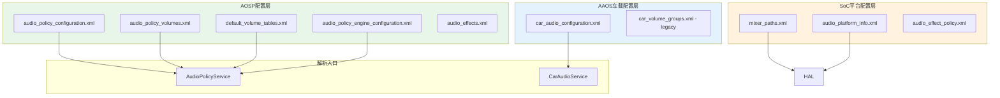
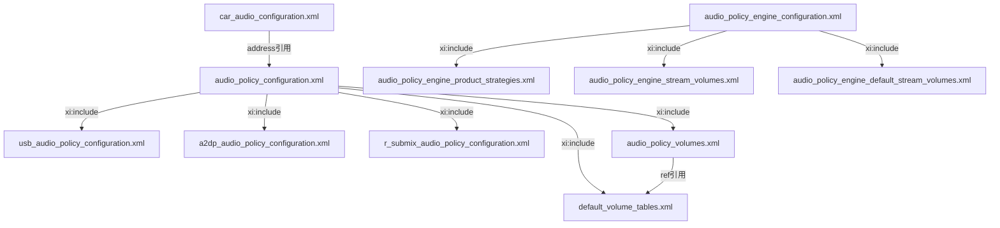
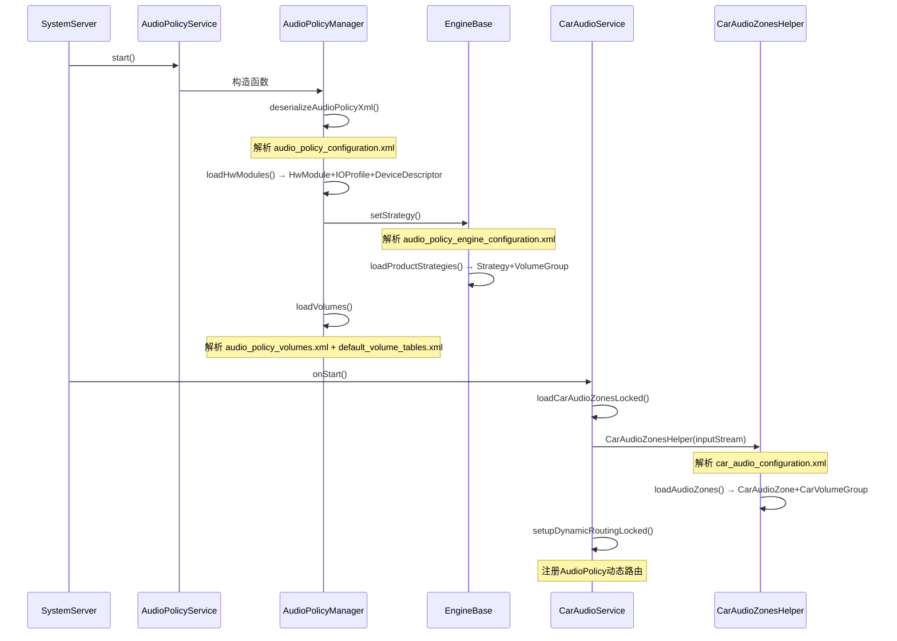

## 11.1 配置文件体系总览

> [← 上一篇](../10_AudioControl_HAL/README.md) | [← 返回11章](README.md) | [返回导航](../README.md) | [下一个 →](11_11.2_audio_policy_configuration.xml-核心配置.md)

---

### 11.1.1 Vendor Layer 配置文件全景

Android音频系统的Vendor Layer是OEM定制的核心区域，承载了硬件描述、路由策略、音量曲线和车载区域等关键配置。这些XML文件在系统启动时被AudioPolicyService和CarAudioService解析，决定了音频数据从应用层到HAL层的完整路径。



### 11.1.2 配置文件清单与部署路径

| 序号 | 配置文件 | 部署路径 | 解析者 | 版本号 | 说明 |
|------|---------|---------|--------|--------|------|
| 1 | `audio_policy_configuration.xml` | `/vendor/etc/` | AudioPolicyService | 1.0/7.0 | 核心：设备+流+路由定义 |
| 2 | `audio_policy_volumes.xml` | `/vendor/etc/` | AudioPolicyManager | — | 音量曲线：stream×deviceCategory |
| 3 | `default_volume_tables.xml` | `/vendor/etc/` | AudioPolicyManager | — | 曲线引用：可复用的reference |
| 4 | `audio_policy_engine_configuration.xml` | `/vendor/etc/` | EngineBase | 1.0 | 策略引擎：strategy+volumeGroup |
| 5 | `audio_policy_engine_product_strategies.xml` | `/vendor/etc/` | EngineBase | — | 子文件：ProductStrategy定义 |
| 6 | `audio_policy_engine_stream_volumes.xml` | `/vendor/etc/` | EngineBase | — | 子文件：策略引擎音量曲线 |
| 7 | `car_audio_configuration.xml` | `/vendor/etc/` | CarAudioService | 2/3 | AAOS：Zone+VolumeGroup+Context |
| 8 | `audio_effects.xml` | `/vendor/etc/` | AudioFlinger | — | 音效库声明：effect+library+uuid |
| 9 | `audio_effect_policy.xml` | `/vendor/etc/` | AudioPolicyManager | — | 音效自动附加策略 |
| 10 | `mixer_paths.xml` | `/vendor/etc/` | Audio HAL (tinyalsa) | — | ALSA mixer控件配置 |
| 11 | `audio_platform_info.xml` | `/vendor/etc/` | Audio HAL (QCOM) | — | SoC平台特定参数 |

### 11.1.3 配置文件依赖关系



### 11.1.4 配置文件分层架构

```
┌────────────────────────────────────────────────────────────────┐
│                    应用层 (Application Layer)                    │
│  AudioAttributes → Usage/ContentType → 决定音频语义              │
├────────────────────────────────────────────────────────────────┤
│                    策略层 (Policy Layer)                         │
│  ┌──────────────────────────────────────────────────────────┐  │
│  │ audio_policy_engine_configuration.xml                    │  │
│  │   ProductStrategy → VolumeGroup → AttributesGroup映射    │  │
│  └──────────────────────────────────────────────────────────┘  │
├────────────────────────────────────────────────────────────────┤
│                    音量层 (Volume Layer)                         │
│  ┌──────────────────────────────────────────────────────────┐  │
│  │ audio_policy_volumes.xml + default_volume_tables.xml     │  │
│  │   Stream × DeviceCategory → dB衰减曲线                   │  │
│  └──────────────────────────────────────────────────────────┘  │
├────────────────────────────────────────────────────────────────┤
│                    路由层 (Routing Layer)                        │
│  ┌──────────────────────────────────────────────────────────┐  │
│  │ audio_policy_configuration.xml                            │  │
│  │   HwModule → IOProfile → DeviceDescriptor → AudioRoute   │  │
│  └──────────────────────────────────────────────────────────┘  │
├────────────────────────────────────────────────────────────────┤
│                    车载层 (Car Audio Layer)                      │
│  ┌──────────────────────────────────────────────────────────┐  │
│  │ car_audio_configuration.xml                               │  │
│  │   CarAudioZone → CarVolumeGroup → Context → Bus地址      │  │
│  └──────────────────────────────────────────────────────────┘  │
├────────────────────────────────────────────────────────────────┤
│                    HAL层 (Hardware Abstraction)                  │
│  ┌──────────────────────────────────────────────────────────┐  │
│  │ mixer_paths.xml + audio_platform_info.xml                 │  │
│  │   ALSA控件 + DSP路由 + SoC特定参数                       │  │
│  └──────────────────────────────────────────────────────────┘  │
└────────────────────────────────────────────────────────────────┘
```

### 11.1.5 各配置文件核心职责

#### 11.1.5.1 audio_policy_configuration.xml — 核心路由/设备配置

这是最关键的配置文件，定义了整个音频硬件的拓扑结构：

| 核心节点 | 职责 | 对应C++类 |
|----------|------|-----------|
| `<module>` | 声明一个Audio HAL模块 | [`HwModule`](frameworks/av/services/audiopolicy/common/managerdefinitions/include/HwModule.h:39) |
| `<mixPort>` | 定义软件混音端口(输出/输入流) | [`IOProfile`](frameworks/av/services/audiopolicy/common/managerdefinitions/include/IOProfile.h:41) |
| `<devicePort>` | 定义硬件设备端口 | [`DeviceDescriptor`](frameworks/av/services/audiopolicy/common/managerdefinitions/include/DeviceDescriptor.h:42) |
| `<route>` | 定义mixPort↔devicePort路由 | [`AudioRoute`](frameworks/av/services/audiopolicy/common/managerdefinitions/include/AudioRoute.h:30) |
| `<attachedDevices>` | 固定连接设备列表 | HwModule的mDeclaredDevices |
| `<defaultOutputDevice>` | 默认输出设备 | APM的default输出 |

#### 11.1.5.2 audio_policy_volumes.xml — 音量曲线定义

定义每种音频流在不同设备类别上的衰减曲线：

| 核心属性 | 说明 |
|----------|------|
| `stream` | 音频流类型，如`AUDIO_STREAM_MUSIC` |
| `deviceCategory` | 设备类别：`SPEAKER`/`HEADSET`/`EARPIECE`/`EXT_MEDIA`/`HEARING_AID` |
| `ref` | 引用`default_volume_tables.xml`中的曲线模板 |
| `<point>` | 曲线控制点：`百分比,dB值`（如`33,-3600`） |

#### 11.1.5.3 default_volume_tables.xml — 默认曲线引用库

提供可复用的音量曲线模板，被`audio_policy_volumes.xml`通过`ref`属性引用：

| 引用名 | 典型用途 | 控制点范围 |
|--------|---------|-----------|
| `FULL_SCALE_VOLUME_CURVE` | 重路由流，0dB固定 | 0,0 ~ 100,0 |
| `SILENT_VOLUME_CURVE` | 静音流 | 0,-9600 ~ 100,-9600 |
| `DEFAULT_MEDIA_VOLUME_CURVE` | 媒体流耳机 | 1,-5800 ~ 100,0 |
| `DEFAULT_SYSTEM_VOLUME_CURVE` | 系统流 | 1,-2400 ~ 100,-600 |
| `DEFAULT_NON_MUTABLE_VOLUME_CURVE` | 不可静音流(如无障碍) | 0,-5800 ~ 100,0 |

#### 11.1.5.4 audio_policy_engine_configuration.xml — 策略引擎配置

定义AudioAttributes Usage到ProductStrategy再到VolumeGroup的映射：

```
AudioAttributes(Usage)
  → AttributesGroup(优先级排序)
    → ProductStrategy(策略分类)
      → VolumeGroup(音量组)
        → StreamType(音频流类型)
```

#### 11.1.5.5 car_audio_configuration.xml — AAOS车载配置

定义车载音频的区域划分和路由映射：

| 核心节点 | 职责 | 版本差异 |
|----------|------|---------|
| `<zone>` | 音频区域定义 | v2/v3通用 |
| `<zoneConfigs>` | 区域配置集合(支持多配置切换) | v3新增 |
| `<volumeGroups>` | 音量组 | v2/v3通用 |
| `<device>` | Bus设备映射 | v2用`bus`属性，v3用`address`属性 |
| `<context>` | 音频上下文绑定 | v2/v3通用 |

### 11.1.6 配置文件版本演进

| 版本 | 对应配置 | 特性变更 |
|------|---------|---------|
| audio_policy_configuration v1.0 | Android 7-10 | 初始XML格式，HIDL HAL |
| audio_policy_configuration v7.0 | Android 11+ | AIDL HAL支持，encodingFormats |
| car_audio_configuration v1 | Android 9 | 早期车载配置(已废弃) |
| car_audio_configuration v2 | Android 10-11 | 简化Zone+Bus+Context映射 |
| car_audio_configuration v3 | Android 12+ | zoneConfigs多配置、address替代bus |

### 11.1.7 配置文件加载时序



### 11.1.8 配置文件与源码对应关系

| 配置文件 | 解析源码 | 关键方法 |
|----------|---------|---------|
| audio_policy_configuration.xml | [`AudioPolicyConfig.cpp`](frameworks/av/services/audiopolicy/common/managerdefinitions/src/AudioPolicyConfig.cpp) | `deserialize()` |
| audio_policy_volumes.xml | [`AudioPolicyManager.cpp`](frameworks/av/services/audiopolicy/managerdefault/AudioPolicyManager.cpp) | `loadVolumes()` |
| default_volume_tables.xml | [`AudioPolicyManager.cpp`](frameworks/av/services/audiopolicy/managerdefault/AudioPolicyManager.cpp) | `loadVolumes()` |
| audio_policy_engine_configuration.xml | [`EngineBase.cpp`](frameworks/av/services/audiopolicy/enginedefault/src/EngineBase.cpp) | `setStrategy()` |
| car_audio_configuration.xml | [`CarAudioZonesHelper.java`](packages/services/Car/service/src/com/android/car/audio/CarAudioZonesHelper.java) | `loadAudioZones()` |
| audio_effects.xml | [`EffectsFactory.cpp`](frameworks/av/media/libaudiohal/EffectsFactory.c) | `loadEffectConfig()` |

### 11.1.9 AAOS vs 手机端配置差异

| 维度 | 手机端 | AAOS车载端 |
|------|--------|-----------|
| 输出设备 | Speaker/Headset/Earpiece | AUDIO_DEVICE_OUT_BUS(多Bus) |
| 路由模型 | 单区域，策略引擎自动路由 | 多Zone，Framework动态路由 |
| 音量模型 | Stream × DeviceCategory曲线 | VolumeGroup × Bus Gain |
| 焦点模型 | 系统焦点(AudioFocus) | CarAudioFocus(INTERACTION_MATRIX) |
| 配置核心 | audio_policy_configuration.xml | car_audio_configuration.xml |
| HAL模块 | primary/A2DP/USB | primary(多Bus输出) |
| 延迟路径 | Fast Mixer / MMap | 不适用(总线架构) |
| 动态设备 | 蓝牙/USB热插拔 | Bus设备固定绑定 |

### 11.1.10 配置文件调试命令

```bash
# 查看当前音频策略配置dump
adb shell dumpsys audio

# 查看AudioPolicyManager已加载的模块
adb shell dumpsys media.audio_policy | grep "HwModule"

# 查看CarAudioZone配置
adb shell dumpsys car_service | grep -A 50 "CarAudioZone"

# 直接查看vendor分区配置文件
adb shell cat /vendor/etc/audio_policy_configuration.xml
adb shell cat /vendor/etc/car_audio_configuration.xml
adb shell cat /vendor/etc/audio_policy_volumes.xml

# 检查配置文件是否存在语法错误
adb logcat -s AudioPolicyService AudioPolicyManager

# 查看AudioFlinger已打开的流
adb shell dumpsys media.audio_flinger | grep "Output thread"
```

### 11.1.11 配置文件修改生效方式

| 修改方式 | 说明 | 生效条件 |
|----------|------|---------|
| 修改vendor分区XML | 重新编译system image | 需要刷机 |
| adb push临时替换 | `adb push xxx.xml /vendor/etc/` | 需要root + 重新挂载 + 重启 |
| overlay资源覆盖 | Runtime Resource Overlay (RRO) | 仅限framework资源 |
| 编译时替换 | device/产品/audio/目录覆盖 | 通过Android.mk/copy-file |

---

[← 上一篇](../10_AudioControl_HAL/README.md) | [← 返回11章](README.md) | [返回导航](../README.md) | [下一个 →](11_11.2_audio_policy_configuration.xml-核心配置.md)