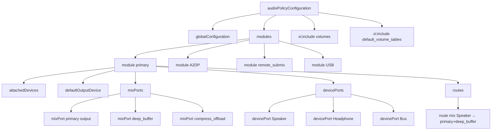

## 11.2 audio_policy_configuration.xml — 核心配置

> [← 上一个](11_11.1_配置文件体系总览.md) | [← 返回11章](README.md) | [返回导航](../README.md) | [下一个 →](11_11.3_audio_policy_volumes.xml-音量曲线.md)

---

### 11.2.1 文件结构总览

`audio_policy_configuration.xml` 是Android音频系统的核心配置文件，定义了所有音频硬件模块的拓扑结构。文件采用XML格式，根节点为`<audioPolicyConfiguration>`，其内部结构如下：



### 11.2.2 根节点与版本声明

```xml
<audioPolicyConfiguration version="1.0" xmlns:xi="http://www.w3.org/2001/XInclude">
```

| 属性 | 说明 | 可选值 |
|------|------|--------|
| `version` | 配置格式版本号 | `"1.0"` (当前唯一版本) |
| `xmlns:xi` | XInclude命名空间声明，允许引用子文件 | 必须声明才能使用`<xi:include>` |

**版本号含义**：`version="1.0"`指配置文件格式的版本，与Audio HAL的`halVersion`是独立概念。HAL版本由`<module>`节点的`halVersion`属性控制。

### 11.2.3 globalConfiguration 全局配置

```xml
<globalConfiguration speaker_drc_enabled="true"/>
```

| 属性 | 类型 | 默认值 | 说明 |
|------|------|--------|------|
| `speaker_drc_enabled` | bool | `"true"` | Speaker DRC(Dynamic Range Compression)是否启用 |
| `deep_buffer_duration_ms` | int | `"2000"` | 深缓冲输出持续时间(毫秒) |

**DRC影响**：当`speaker_drc_enabled="true"`时，AudioFlinger会对Speaker输出路径应用DRC压缩，防止大信号削波失真。OEM可根据Speaker硬件能力调整。

### 11.2.4 module 节点详解

`<module>` 是最核心的配置节点，每个module对应一个Audio HAL实现库：

```xml
<module name="primary" halVersion="3.0">
    <attachedDevices>...</attachedDevices>
    <defaultOutputDevice>...</defaultOutputDevice>
    <mixPorts>...</mixPorts>
    <devicePorts>...</devicePorts>
    <routes>...</routes>
</module>
```

#### 11.2.4.1 module 属性表

| 属性 | 必填 | 说明 | 示例 |
|------|------|------|------|
| `name` | 是 | HAL模块名称，对应Audio HAL库标识 | `"primary"`, `"A2DP"`, `"remote_submix"`, `"usb"` |
| `halVersion` | 是 | Audio HAL接口版本号 | `"2.0"`(HIDL 2.0), `"3.0"`(HIDL 3.0/AIDL) |

**module name与HAL库映射**：

| module name | HAL库 | AIDL服务名 |
|-------------|-------|-----------|
| `primary` | `audio.primary.<device>.so` | `IModule/default` |
| `A2DP` | `audio.a2dp.<device>.so` | 通过`IModule::getBluetoothA2dp()` |
| `remote_submix` | `audio.r_submix.default.so` | 内置 |
| `USB` | `audio.usb.<device>.so` | 通过动态发现 |

#### 11.2.4.2 attachedDevices 固定连接设备

```xml
<attachedDevices>
    <item>Speaker</item>
    <item>Built-In Mic</item>
    <item>bus0_media_out</item>
</attachedDevices>
```

`<attachedDevices>`声明了此模块中永久连接的设备。`<item>`的值必须与某个`<devicePort>`的`tagName`完全匹配。

**关键行为**：
- attachedDevices在系统启动时自动注册为可用设备
- 不需要热插拔检测，始终存在
- AAOS车载场景中，所有Bus输出设备都是attachedDevices

#### 11.2.4.3 defaultOutputDevice 默认输出设备

```xml
<defaultOutputDevice>bus0_media_out</defaultOutputDevice>
```

| 约束条件 | 说明 |
|----------|------|
| 必须在attachedDevices中 | 否则启动时校验失败 |
| 必须有对应的devicePort | tagName必须匹配 |
| 必须是输出设备(role=sink) | 输入设备不可作为defaultOutput |
| 必须有route可达 | 至少一个mixPort能路由到此设备 |

**影响场景**：当AudioPolicyManager找不到更合适的输出设备时(如无蓝牙、无USB)，将路由到此默认设备。

### 11.2.5 mixPorts 详解

`<mixPorts>`定义了AudioFlinger可以打开的所有软件混音端口(输出/输入流)：

```xml
<mixPorts>
    <mixPort name="primary output" role="source"
             flags="AUDIO_OUTPUT_FLAG_PRIMARY">
        <profile name="" format="AUDIO_FORMAT_PCM_16_BIT"
                 samplingRates="48000" channelMasks="AUDIO_CHANNEL_OUT_STEREO"/>
    </mixPort>
    <mixPort name="deep_buffer output" role="source"
             flags="AUDIO_OUTPUT_FLAG_DEEP_BUFFER">
        <profile name="" format="AUDIO_FORMAT_PCM_16_BIT"
                 samplingRates="48000" channelMasks="AUDIO_CHANNEL_OUT_STEREO"/>
    </mixPort>
    <mixPort name="compress_offload" role="source"
             flags="AUDIO_OUTPUT_FLAG_COMPRESS_OFFLOAD">
        <profile name="" format="AUDIO_FORMAT_AC3"
                 samplingRates="48000" channelMasks="AUDIO_CHANNEL_OUT_STEREO"/>
    </mixPort>
    <mixPort name="primary input" role="sink">
        <profile name="" format="AUDIO_FORMAT_PCM_16_BIT"
                 samplingRates="8000,11025,16000,22050,44100,48000"
                 channelMasks="AUDIO_CHANNEL_IN_MONO,AUDIO_CHANNEL_IN_STEREO"/>
    </mixPort>
</mixPorts>
```

#### 11.2.5.1 mixPort 属性完整表

| 属性 | 必填 | 说明 | 示例 |
|------|------|------|------|
| `name` | 是 | 流标识名，route的sources引用此名 | `"primary output"` |
| `role` | 是 | `source`=输出流, `sink`=输入流 | `source` |
| `flags` | 否 | AUDIO_OUTPUT_FLAG_*组合，管道分隔 | `AUDIO_OUTPUT_FLAG_PRIMARY` |
| `maxOpenSessionsCount` | 否 | 最大同时打开session数 | `1` |
| `maxActiveSessionCount` | 否 | 最大活跃session数 | `1` |
| `preferredMixDevice` | 否 | AIDL新增：优先路由目标设备 | — |

#### 11.2.5.2 mixPort flags → Thread类型映射

| flags值 | AudioFlinger Thread类型 | 特性 | 典型延迟 |
|---------|------------------------|------|---------|
| `AUDIO_OUTPUT_FLAG_PRIMARY` | MixerThread(PrimaryOutput) | 系统主输出，所有非特殊流默认路由 | ~20ms |
| `AUDIO_OUTPUT_FLAG_FAST` | MixerThread(FastMixer) | 超低延迟，AAudio Fast Path | <10ms |
| `AUDIO_OUTPUT_FLAG_DEEP_BUFFER` | MixerThread(Normal) | 长缓冲，高吞吐，省电 | ~40ms |
| `AUDIO_OUTPUT_FLAG_COMPRESS_OFFLOAD` | OffloadThread | 硬件解码，不参与混音 | 由DSP决定 |
| `AUDIO_OUTPUT_FLAG_DIRECT` | DirectOutputThread | 不混音直接输出，通常低延迟 | ~10ms |
| `AUDIO_OUTPUT_FLAG_MMAP_NOIRQ` | MmapThread | AAudio MMap低延迟模式 | <5ms |
| `AUDIO_OUTPUT_FLAG_VOIP_RX` | MixerThread | VoIP接收优化 | ~20ms |
| 无flags | MixerThread(Normal) | 普通混音 | ~40ms |

**flags组合示例**：
```xml
<!-- AAOS车载典型配置：每个Bus一个mixPort，PRIMARY仅一个 -->
<mixPort name="mixport_bus0_media_out" role="source"
         flags="AUDIO_OUTPUT_FLAG_PRIMARY">
    <profile name="" format="AUDIO_FORMAT_PCM_16_BIT"
             samplingRates="48000" channelMasks="AUDIO_CHANNEL_OUT_STEREO"/>
</mixPort>
```

#### 11.2.5.3 AAOS车载多Bus mixPort配置模式

AAOS中，每个Bus地址对应一个独立的mixPort，所有Bus共享同一个primary module：

```xml
<!-- 主Zone: 8个Bus对应8个mixPort -->
<mixPort name="mixport_bus0_media_out" role="source" flags="AUDIO_OUTPUT_FLAG_PRIMARY"/>
<mixPort name="mixport_bus1_navigation_out" role="source"/>
<mixPort name="mixport_bus2_voice_command_out" role="source"/>
<mixPort name="mixport_bus3_call_ring_out" role="source"/>
<mixPort name="mixport_bus4_call_out" role="source"/>
<mixPort name="mixport_bus5_alarm_out" role="source"/>
<mixPort name="mixport_bus6_notification_out" role="source"/>
<mixPort name="mixport_bus7_system_sound_out" role="source"/>

<!-- 后排Zone: 独立Bus mixPort -->
<mixPort name="mixport_bus100_audio_zone_1" role="source"/>
<mixPort name="mixport_bus200_audio_zone_2" role="source"/>
```

### 11.2.6 devicePorts 详解

`<devicePorts>`定义了所有硬件设备端口，包括输出设备和输入设备：

```xml
<devicePorts>
    <devicePort tagName="Speaker" role="sink" type="AUDIO_DEVICE_OUT_SPEAKER">
        <profile name="" format="AUDIO_FORMAT_PCM_16_BIT"
                 samplingRates="48000" channelMasks="AUDIO_CHANNEL_OUT_STEREO"/>
    </devicePort>
    <devicePort tagName="bus0_media_out" role="sink" type="AUDIO_DEVICE_OUT_BUS"
                address="bus0_media_out">
        <profile name="" format="AUDIO_FORMAT_PCM_16_BIT"
                 samplingRates="48000" channelMasks="AUDIO_CHANNEL_OUT_STEREO"/>
        <gains>
            <gain name="" mode="AUDIO_GAIN_MODE_JOINT"
                  minValueMB="-3200" maxValueMB="600"
                  defaultValueMB="0" stepValueMB="100"/>
        </gains>
    </devicePort>
    <devicePort tagName="Built-In Mic" type="AUDIO_DEVICE_IN_BUILTIN_MIC"
                role="source" address="Built-In Mic">
        <profile name="" format="AUDIO_FORMAT_PCM_16_BIT"
                 samplingRates="8000,11025,16000,22050,44100,48000"
                 channelMasks="AUDIO_CHANNEL_IN_MONO,AUDIO_CHANNEL_IN_STEREO"/>
    </devicePort>
</devicePorts>
```

#### 11.2.6.1 devicePort 属性完整表

| 属性 | 必填 | 说明 | 示例 |
|------|------|------|------|
| `tagName` | 是 | 设备标识名，route的sink引用此名 | `"Speaker"` |
| `type` | 是 | AUDIO_DEVICE_OUT_*或AUDIO_DEVICE_IN_*枚举 | `AUDIO_DEVICE_OUT_BUS` |
| `role` | 是 | `sink`=输出设备, `source`=输入设备 | `sink` |
| `address` | Bus必填 | 设备地址字符串 | `"bus0_media_out"` |
| `encodingFormats` | 否 | Compress Offload支持的编码格式 | `AUDIO_FORMAT_AC3,AUDIO_FORMAT_DTS` |

#### 11.2.6.2 AUDIO_DEVICE_OUT_* 常用类型

| type值 | 说明 | role | 典型场景 |
|--------|------|------|---------|
| `AUDIO_DEVICE_OUT_SPEAKER` | 内置扬声器 | sink | 手机主输出 |
| `AUDIO_DEVICE_OUT_EARPIECE` | 听筒 | sink | 通话 |
| `AUDIO_DEVICE_OUT_WIRED_HEADPHONE` | 有线耳机 | sink | 3.5mm |
| `AUDIO_DEVICE_OUT_WIRED_HEADSET` | 有线带麦耳机 | sink | 3.5mm+mic |
| `AUDIO_DEVICE_OUT_BLUETOOTH_SCO` | BT SCO | sink | 通话蓝牙 |
| `AUDIO_DEVICE_OUT_BLUETOOTH_A2DP` | BT A2DP | sink | 媒体蓝牙 |
| `AUDIO_DEVICE_OUT_BUS` | Bus输出 | sink | AAOS车载 |
| `AUDIO_DEVICE_OUT_TELEPHONY_TX` | 电话发送 | sink | 通话上行 |
| `AUDIO_DEVICE_OUT_USB_DEVICE` | USB设备 | sink | USB DAC |
| `AUDIO_DEVICE_OUT_USB_HEADSET` | USB耳机 | sink | USB头戴 |
| `AUDIO_DEVICE_OUT_HEARING_AID` | 助听器 | sink | ASHA |
| `AUDIO_DEVICE_OUT_AUX_LINE` | AUX线路 | sink | Line-in |

#### 11.2.6.3 AUDIO_DEVICE_IN_* 常用类型

| type值 | 说明 | role | 典型场景 |
|--------|------|------|---------|
| `AUDIO_DEVICE_IN_BUILTIN_MIC` | 内置麦克风 | source | 语音输入 |
| `AUDIO_DEVICE_IN_BACK_MIC` | 后置麦克风 | source | 录音降噪 |
| `AUDIO_DEVICE_IN_WIRED_HEADSET` | 有线耳机麦克风 | source | 3.5mm |
| `AUDIO_DEVICE_IN_BLUETOOTH_SCO_HEADSET` | BT SCO麦克风 | source | 通话蓝牙 |
| `AUDIO_DEVICE_IN_USB_DEVICE` | USB麦克风 | source | USB mic |
| `AUDIO_DEVICE_IN_FM_TUNER` | FM调谐器 | source | 车载FM |
| `AUDIO_DEVICE_IN_BUS` | Bus输入 | source | 车载输入 |
| `AUDIO_DEVICE_IN_ECHO_REFERENCE` | AEC回声参考 | source | 通话AEC |
| `AUDIO_DEVICE_IN_TELEPHONY_RX` | 电话接收 | source | 通话下行 |

### 11.2.7 gains 节点详解

`<gains>`定义了设备端口的增益控制能力，主要用于AAOS车载Bus设备：

```xml
<gains>
    <gain name="" mode="AUDIO_GAIN_MODE_JOINT"
          minValueMB="-3200" maxValueMB="600"
          defaultValueMB="0" stepValueMB="100"/>
</gains>
```

#### 11.2.7.1 gain 属性表

| 属性 | 说明 | 约束 |
|------|------|------|
| `name` | 增益标识名 | 同一devicePort内唯一 |
| `mode` | 增益模式 | `AUDIO_GAIN_MODE_JOINT`(联合) 或 `AUDIO_GAIN_MODE_CHANNELS`(独立通道) |
| `minValueMB` | 最小增益(毫贝尔) | 典型-3200(-32dB) |
| `maxValueMB` | 最大增益(毫贝尔) | 典型600(6dB) |
| `defaultValueMB` | 默认增益(毫贝尔) | 通常0(0dB) |
| `stepValueMB` | 增益步进(毫贝尔) | 典型100(1dB) |

**约束校验规则**（来自源码注释）：
1. `maxValueMB >= minValueMB`
2. `defaultValueMB >= minValueMB && defaultValueMB <= maxValueMB`
3. `(maxValueMB - minValueMB) % stepValueMB == 0`
4. `(defaultValueMB - minValueMB) % stepValueMB == 0`

**AAOS中的增益控制**：CarAudioService通过`AudioManager.setAudioPortGain()`设置Bus设备的增益，实现VolumeGroup的音量调节。

### 11.2.8 routes 节点详解

`<routes>`定义了mixPort与devicePort之间的连接规则：

```xml
<routes>
    <route type="mix" sink="Speaker"
           sources="primary output,deep_buffer output"/>
    <route type="mix" sink="bus0_media_out"
           sources="mixport_bus0_media_out"/>
    <route type="mix" sink="primary input"
           sources="Built-In Mic,Built-In Back Mic,Echo-Reference Mic"/>
</routes>
```

#### 11.2.8.1 route 属性表

| 属性 | 说明 | 约束 |
|------|------|------|
| `type` | 路由类型：`mix`(可混音) 或 `mux`(互斥) | 目前Android仅使用`mix` |
| `sink` | 目标端，必须是devicePort的tagName(输出)或mixPort的name(输入) | 必须在devicePorts/mixPorts中声明 |
| `sources` | 源端列表，逗号分隔，mixPort name(输出)或devicePort tagName(输入) | 必须在mixPorts/devicePorts中声明 |

**路由语义**：
- 输出路由：`sources`(mixPort names) → `sink`(devicePort tagName)
- 输入路由：`sources`(devicePort tagNames) → `sink`(mixPort name)

#### 11.2.8.2 AAOS车载路由模式

AAOS车载配置中，每个Bus的route是严格一对一映射：

```xml
<!-- 每个Bus只有一条route，对应一个mixPort -->
<route type="mix" sink="bus0_media_out" sources="mixport_bus0_media_out"/>
<route type="mix" sink="bus1_navigation_out" sources="mixport_bus1_navigation_out"/>
<route type="mix" sink="bus4_call_out" sources="mixport_bus4_call_out"/>
```

**与手机端的差异**：手机端允许多个mixPort路由到同一设备(如primary+deep_buffer→Speaker)，但AAOS每个Bus是独立的物理输出通道，不需要多源混音到同一Bus。

### 11.2.9 xi:include 子文件引用

主配置文件通过XInclude机制引用子配置文件：

```xml
<!-- A2DP模块 -->
<xi:include href="a2dp_audio_policy_configuration.xml"/>
<!-- USB模块 -->
<xi:include href="usb_audio_policy_configuration.xml"/>
<!-- Remote Submix模块(屏幕投射) -->
<xi:include href="r_submix_audio_policy_configuration.xml"/>
<!-- 音量曲线 -->
<xi:include href="audio_policy_volumes.xml"/>
<xi:include href="default_volume_tables.xml"/>
```

| 子文件 | 位置 | 说明 |
|--------|------|------|
| `a2dp_audio_policy_configuration.xml` | frameworks/av/services/audiopolicy/config/ | A2DP蓝牙模块定义 |
| `usb_audio_policy_configuration.xml` | frameworks/av/services/audiopolicy/config/ | USB音频模块定义 |
| `r_submix_audio_policy_configuration.xml` | frameworks/av/services/audiopolicy/config/ | 远程子混音模块(投射) |
| `audio_policy_volumes.xml` | frameworks/av/services/audiopolicy/config/ 或 device/产品/ | 音量曲线 |
| `default_volume_tables.xml` | frameworks/av/services/audiopolicy/config/ | 默认曲线引用 |

### 11.2.10 AAOS车载完整配置示例

以下是基于[`device/generic/car/emulator/audio/audio_policy_configuration.xml`](device/generic/car/emulator/audio/audio_policy_configuration.xml)的完整车载配置分析：

```xml
<audioPolicyConfiguration version="1.0" xmlns:xi="http://www.w3.org/2001/XInclude">
    <globalConfiguration speaker_drc_enabled="true"/>

    <modules>
        <module name="primary" halVersion="3.0">
            <!-- 固定连接设备：所有Bus + 麦克风 + FM -->
            <attachedDevices>
                <item>bus0_media_out</item>     <!-- 主Zone: 媒体 -->
                <item>bus1_navigation_out</item> <!-- 主Zone: 导航 -->
                <item>bus2_voice_command_out</item>
                <item>bus3_call_ring_out</item>
                <item>bus4_call_out</item>      <!-- 主Zone: 通话 -->
                <item>bus5_alarm_out</item>
                <item>bus6_notification_out</item>
                <item>bus7_system_sound_out</item>
                <item>bus100_audio_zone_1</item> <!-- Zone 1: 后排左 -->
                <item>bus101_audio_zone_1</item>
                <item>bus200_audio_zone_2</item> <!-- Zone 2: 后排右 -->
                <item>bus201_audio_zone_2</item>
                <item>bus1000_mirror_device</item> <!-- Mirror设备 -->
                <item>Built-In Mic</item>
                <item>Built-In Back Mic</item>
                <item>Echo-Reference Mic</item>
                <item>FM Tuner</item>
            </attachedDevices>
            <defaultOutputDevice>bus0_media_out</defaultOutputDevice>

            <!-- mixPorts：每Bus一个输出mixPort -->
            <mixPorts>
                <mixPort name="mixport_bus0_media_out" role="source"
                         flags="AUDIO_OUTPUT_FLAG_PRIMARY">
                    <profile name="" format="AUDIO_FORMAT_PCM_16_BIT"
                             samplingRates="48000" channelMasks="AUDIO_CHANNEL_OUT_STEREO"/>
                </mixPort>
                <!-- 其他Bus mixPort省略... -->
                <mixPort name="primary input" role="sink">
                    <profile name="" format="AUDIO_FORMAT_PCM_16_BIT"
                             samplingRates="8000,11025,12000,16000,22050,24000,32000,44100,48000"
                             channelMasks="AUDIO_CHANNEL_IN_MONO,AUDIO_CHANNEL_IN_STEREO"/>
                </mixPort>
            </mixPorts>

            <!-- devicePorts：每Bus一个输出devicePort+gains -->
            <devicePorts>
                <devicePort tagName="bus0_media_out" role="sink"
                            type="AUDIO_DEVICE_OUT_BUS" address="bus0_media_out">
                    <profile name="" format="AUDIO_FORMAT_PCM_16_BIT"
                             samplingRates="48000" channelMasks="AUDIO_CHANNEL_OUT_STEREO"/>
                    <gains>
                        <gain name="" mode="AUDIO_GAIN_MODE_JOINT"
                              minValueMB="-3200" maxValueMB="600"
                              defaultValueMB="0" stepValueMB="100"/>
                    </gains>
                </devicePort>
                <!-- 其他Bus devicePort省略... -->
            </devicePorts>

            <!-- routes：每Bus一条route -->
            <routes>
                <route type="mix" sink="bus0_media_out" sources="mixport_bus0_media_out"/>
                <route type="mix" sink="bus1_navigation_out" sources="mixport_bus1_navigation_out"/>
                <!-- ... -->
            </routes>
        </module>
    </modules>
</audioPolicyConfiguration>
```

### 11.2.11 配置如何影响Framework行为

| 配置项 | Framework行为 | 影响链路 |
|--------|---------------|---------|
| mixPort flags=PRIMARY | AudioFlinger创建PrimaryOutput MixerThread | APM::getOutput()优先返回 |
| mixPort profile采样率 | AudioFlinger打开流时协商采样率 | Track::create() → APM::getOutputForAttr() |
| mixPort profile格式 | 决定AudioFlinger可接受的音频格式 | PCM_16_BIT → MixerThread |
| devicePort type=BUS | APM识别为Bus设备，CarAudioService可绑定 | address→CarAudioZone |
| devicePort gains | CarVolumeGroup通过gain控制音量 | setAudioPortGain() → HAL |
| route sources→sink | APM路由决策依据 | getOutputForAttr() → 查找可达devicePort |
| attachedDevices | APM启动时自动设置为可用 | mAvailableOutputDevices.add() |
| defaultOutputDevice | 无其他设备时的兜底路由 | APM::mDefaultOutputDevice |

---

[← 上一个](11_11.1_配置文件体系总览.md) | [← 返回11章](README.md) | [返回导航](../README.md) | [下一个 →](11_11.3_audio_policy_volumes.xml-音量曲线.md)