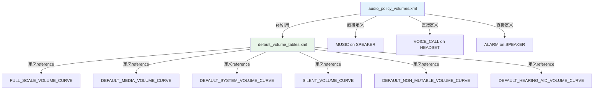
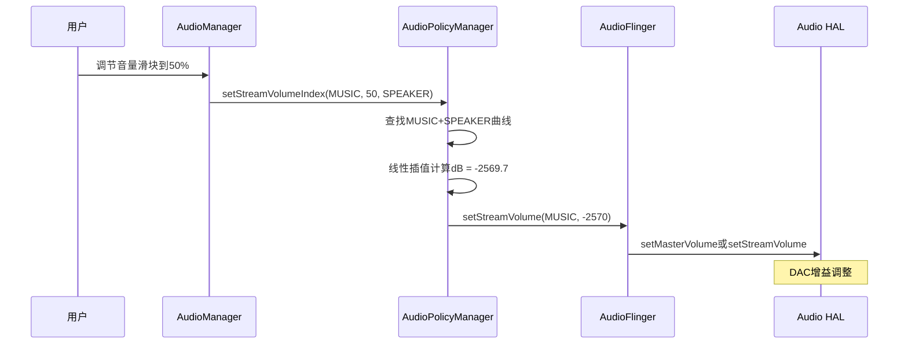

## 11.3 audio_policy_volumes.xml — 音量曲线

> [← 上一个](11_11.2_audio_policy_configuration.xml-核心配置.md) | [← 返回11章](README.md) | [返回导航](../README.md) | [下一个 →](11_11.4_audio_policy_engine_configuration.xml-策略引擎配置.md)

---

### 11.3.1 音量曲线体系概述

Android音频系统的音量控制通过两级XML文件实现：

1. **`audio_policy_volumes.xml`**：定义每种Stream在不同DeviceCategory上的音量衰减曲线
2. **`default_volume_tables.xml`**：定义可复用的曲线引用模板（reference），被前者通过`ref`属性引用

两者都通过`<xi:include>`嵌入到`audio_policy_configuration.xml`中。



### 11.3.2 audio_policy_volumes.xml 文件结构

```xml
<volumes>
    <!-- 直接定义曲线 -->
    <volume stream="AUDIO_STREAM_VOICE_CALL" deviceCategory="DEVICE_CATEGORY_HEADSET">
        <point>0,-4200</point>
        <point>33,-2800</point>
        <point>66,-1400</point>
        <point>100,0</point>
    </volume>
    <!-- 引用曲线模板 -->
    <volume stream="AUDIO_STREAM_MUSIC" deviceCategory="DEVICE_CATEGORY_HEADSET"
            ref="DEFAULT_MEDIA_VOLUME_CURVE"/>
</volumes>
```

### 11.3.3 volume 节点属性详解

| 属性 | 必填 | 说明 | 示例 |
|------|------|------|------|
| `stream` | 是 | 音频流类型枚举 | `AUDIO_STREAM_MUSIC` |
| `deviceCategory` | 是 | 设备类别枚举 | `DEVICE_CATEGORY_SPEAKER` |
| `ref` | 否 | 引用default_volume_tables.xml中的曲线模板，与`<point>`互斥 | `DEFAULT_MEDIA_VOLUME_CURVE` |

**规则**：如果指定了`ref`属性，则不需要(也不能)包含`<point>`子节点；如果没有`ref`，则必须包含至少2个`<point>`子节点。

### 11.3.4 point 控制点详解

`<point>`定义了音量曲线上的一个控制点，格式为`百分比,dB衰减值`：

```xml
<point>0,-9000</point>   <!-- 音量0%时，衰减-90dB -->
<point>33,-3600</point>  <!-- 音量33%时，衰减-36dB -->
<point>66,-1600</point>  <!-- 音量66%时，衰减-16dB -->
<point>100,0</point>     <!-- 音量100%时，衰减0dB(满刻度) -->
```

| 约束条件 | 说明 |
|----------|------|
| 第一个点的百分比 | 可为0(可静音)或1(不可静音，最小音量仍有声音) |
| 最后一个点的百分比 | 必须为100 |
| dB值范围 | -9600(-96dB)到0(0dB) |
| 点的数量 | 最少2个，通常4个 |
| 单调递增 | 百分比和dB值都必须递增 |

**可静音vs不可静音**：
- 百分比从0开始：`<point>0,-9000</point>` → 音量可调至静音
- 百分比从1开始：`<point>1,-5800</point>` → 音量最小仍有声音(不可静音)

### 11.3.5 DeviceCategory 设备类别

| deviceCategory | 对应设备 | 典型使用场景 |
|----------------|---------|-------------|
| `DEVICE_CATEGORY_SPEAKER` | 内置扬声器 | 手机外放、车载Bus |
| `DEVICE_CATEGORY_HEADSET` | 有线耳机/蓝牙A2DP | 耳机听音乐 |
| `DEVICE_CATEGORY_EARPIECE` | 听筒 | 通话 |
| `DEVICE_CATEGORY_EXT_MEDIA` | 外部媒体设备(HDMI/AUX) | 投射/线路输出 |
| `DEVICE_CATEGORY_HEARING_AID` | 助听器(ASHA) | 听力辅助 |

**设备类别映射逻辑**：AudioPolicyManager根据当前路由目标设备的type，查找对应的DeviceCategory：

```
AUDIO_DEVICE_OUT_SPEAKER → DEVICE_CATEGORY_SPEAKER
AUDIO_DEVICE_OUT_WIRED_HEADPHONE → DEVICE_CATEGORY_HEADSET
AUDIO_DEVICE_OUT_WIRED_HEADSET → DEVICE_CATEGORY_HEADSET
AUDIO_DEVICE_OUT_BLUETOOTH_A2DP → DEVICE_CATEGORY_HEADSET
AUDIO_DEVICE_OUT_BLUETOOTH_SCO → DEVICE_CATEGORY_HEADSET
AUDIO_DEVICE_OUT_EARPIECE → DEVICE_CATEGORY_EARPIECE
AUDIO_DEVICE_OUT_BUS → DEVICE_CATEGORY_SPEAKER (AAOS)
```

### 11.3.6 完整Stream类型与默认曲线映射

以下基于[`frameworks/av/services/audiopolicy/config/audio_policy_volumes.xml`](frameworks/av/services/audiopolicy/config/audio_policy_volumes.xml)的完整分析：

| Stream | SPEAKER | HEADSET | EARPIECE | EXT_MEDIA | HEARING_AID |
|--------|---------|---------|----------|-----------|-------------|
| VOICE_CALL | 自定义4点 | 自定义4点 | 自定义4点 | DEFAULT_MEDIA | HEARING_AID |
| SYSTEM | 自定义4点 | 自定义4点 | DEFAULT_SYSTEM | EXT_MEDIA | HEARING_AID |
| RING | 自定义4点 | HEADSET_CURVE | EARPIECE_CURVE | EXT_MEDIA | HEARING_AID |
| MUSIC | SPEAKER_CURVE | DEFAULT_MEDIA | DEFAULT_MEDIA | DEFAULT_MEDIA | HEARING_AID |
| ALARM | 自定义4点 | NON_MUTABLE_HEADSET | NON_MUTABLE_EARPIECE | NON_MUTABLE_EXT | NON_MUTABLE_HEARING_AID |
| NOTIFICATION | 自定义4点 | HEADSET_CURVE | EARPIECE_CURVE | EXT_MEDIA | HEADSET_CURVE |
| BLUETOOTH_SCO | 自定义4点 | 自定义4点 | 自定义4点 | DEFAULT_MEDIA | HEARING_AID |
| ENFORCED_AUDIBLE | 自定义4点 | 自定义4点 | DEFAULT_SYSTEM | EXT_MEDIA | HEARING_AID |
| DTMF | 自定义4点 | 自定义4点 | DEFAULT_SYSTEM | EXT_MEDIA | HEARING_AID |
| TTS | FULL_SCALE | SILENT | SILENT | SILENT | SILENT |
| ACCESSIBILITY | NON_MUTABLE_SPEAKER | NON_MUTABLE | NON_MUTABLE | NON_MUTABLE | NON_MUTABLE_HEARING_AID |
| ASSISTANT | SPEAKER_CURVE | DEFAULT_MEDIA | DEFAULT_MEDIA | DEFAULT_MEDIA | HEARING_AID |
| REROUTING | FULL_SCALE | FULL_SCALE | FULL_SCALE | FULL_SCALE | FULL_SCALE |

### 11.3.7 default_volume_tables.xml 引用模板详解

基于[`frameworks/av/services/audiopolicy/config/default_volume_tables.xml`](frameworks/av/services/audiopolicy/config/default_volume_tables.xml)的完整分析：

#### 11.3.7.1 特殊用途曲线

| 引用名 | 控制点 | 用途 |
|--------|--------|------|
| `FULL_SCALE_VOLUME_CURVE` | 0,0 ~ 100,0 | 始终0dB，用于REROUTING和TTS(扬声器) |
| `SILENT_VOLUME_CURVE` | 0,-9600 ~ 100,-9600 | 始终-96dB，用于TTS(非扬声器) |

#### 11.3.7.2 标准可静音曲线

| 引用名 | 控制点(dB) | 用途 |
|--------|-----------|------|
| `DEFAULT_MEDIA_VOLUME_CURVE` | 1,-5800 / 20,-4000 / 60,-1700 / 100,0 | 媒体流耳机，百分比从1起(不可静音) |
| `DEFAULT_DEVICE_CATEGORY_HEADSET_VOLUME_CURVE` | 1,-4950 / 33,-3350 / 66,-1700 / 100,0 | 铃声耳机 |
| `DEFAULT_DEVICE_CATEGORY_SPEAKER_VOLUME_CURVE` | 1,-5800 / 20,-4000 / 60,-1700 / 100,0 | 媒体流扬声器 |
| `DEFAULT_DEVICE_CATEGORY_EARPIECE_VOLUME_CURVE` | 1,-4950 / 33,-3350 / 66,-1700 / 100,0 | 听筒 |
| `DEFAULT_DEVICE_CATEGORY_EXT_MEDIA_VOLUME_CURVE` | 1,-5800 / 20,-4000 / 60,-2100 / 100,-1000 | 外部媒体(最大不到0dB) |
| `DEFAULT_SYSTEM_VOLUME_CURVE` | 1,-2400 / 33,-1800 / 66,-1200 / 100,-600 | 系统音(最大也仅-6dB) |
| `DEFAULT_HEARING_AID_VOLUME_CURVE` | 1,-12700 / 20,-8000 / 60,-4000 / 100,0 | 助听器(范围极大) |

#### 11.3.7.3 不可静音曲线

不可静音曲线的百分比从0开始(index=0时仍有声音)：

| 引用名 | 控制点(dB) | 用途 |
|--------|-----------|------|
| `DEFAULT_NON_MUTABLE_VOLUME_CURVE` | 0,-5800 / 20,-4000 / 60,-1700 / 100,0 | 无障碍(ALARM等不可静音) |
| `DEFAULT_NON_MUTABLE_HEADSET_VOLUME_CURVE` | 0,-4950 / 33,-3350 / 66,-1700 / 100,0 | 耳机不可静音 |
| `DEFAULT_NON_MUTABLE_SPEAKER_VOLUME_CURVE` | 0,-5800 / 20,-4000 / 60,-1700 / 100,0 | 扬声器不可静音 |
| `DEFAULT_NON_MUTABLE_EARPIECE_VOLUME_CURVE` | 0,-4950 / 33,-3350 / 66,-1700 / 100,0 | 听筒不可静音 |
| `DEFAULT_NON_MUTABLE_EXT_VOLUME_CURVE` | 0,-5800 / 20,-4000 / 60,-2100 / 100,-1000 | 外部媒体不可静音 |
| `DEFAULT_NON_MUTABLE_HEARING_AID_VOLUME_CURVE` | 0,-12700 / 20,-8000 / 60,-4000 / 100,0 | 助听器不可静音 |

### 11.3.8 音量曲线插值算法

当用户调节音量滑块时，AudioPolicyManager通过线性插值计算实际dB衰减值：

```
输入：音量百分比 p (0~100)
查找：找到p所在的区间 [p1, p2]，对应dB值 [db1, db2]
计算：dB = db1 + (db2 - db1) * (p - p1) / (p2 - p1)

示例：p=50
  曲线：0,-9000 / 33,-3600 / 66,-1600 / 100,0
  p=50落在[33,66]区间
  dB = -3600 + (-1600 - (-3600)) * (50 - 33) / (66 - 33)
  dB = -3600 + 2000 * 17 / 33
  dB = -3600 + 1030.3 = -2569.7
```

### 11.3.9 音量曲线端到端流程



### 11.3.10 AAOS车载音量模型差异

AAOS车载系统不使用`audio_policy_volumes.xml`的Stream×DeviceCategory模型，而是通过Bus Gain直接控制：

| 维度 | 手机端 | AAOS车载端 |
|------|--------|-----------|
| 音量曲线 | Stream × DeviceCategory → dB插值 | VolumeGroup → Gain Index → 毫贝尔 |
| 曲线定义 | audio_policy_volumes.xml | CarVolumeGroup内部计算 |
| 音量设置 | setStreamVolume() → AF | setAudioPortGain() → HAL |
| 增益范围 | dB曲线插值 | devicePort gains定义的min/max/step |
| 独立控制 | 同Stream同设备共享音量 | 每个VolumeGroup独立音量 |

**AAOS车载音量控制链路**：

```
用户调节音量
  → CarVolumeGroup.setCurrentGainIndex()
  → 计算gain值: minValueMB + index * stepValueMB
  → CarAudioManager.setGroupVolume()
  → AudioManager.setAudioPortGain(devicePort, gain)
  → AudioFlinger → HAL
```

### 11.3.11 OEM定制音量曲线指南

#### 11.3.11.1 修改现有曲线

```xml
<!-- 示例：让MUSIC在SPEAKER上更响 -->
<!-- 原始: 1,-5800 / 20,-4000 / 60,-1700 / 100,0 -->
<!-- 定制: 提高中低音量段的dB值 -->
<volume stream="AUDIO_STREAM_MUSIC" deviceCategory="DEVICE_CATEGORY_SPEAKER">
    <point>1,-4800</point>   <!-- 原-5800 → -4800, 最小音量更响 -->
    <point>20,-3200</point>  <!-- 原-4000 → -3200 -->
    <point>60,-1200</point>  <!-- 原-1700 → -1200 -->
    <point>100,0</point>     <!-- 最大保持不变 -->
</volume>
```

#### 11.3.11.2 创建新曲线引用模板

```xml
<!-- 在default_volume_tables.xml中添加 -->
<reference name="CUSTOM_CAR_SPEAKER_VOLUME_CURVE">
    <point>0,-4800</point>
    <point>33,-3200</point>
    <point>66,-1200</point>
    <point>100,0</point>
</reference>
```

#### 11.3.11.3 曲线设计原则

| 原则 | 说明 |
|------|------|
| 对数感知 | 人耳对音量感知是对数的，dB值的变化应匹配人耳感知 |
| 避免突变 | 相邻控制点的dB差值不宜过大，避免音量跳变 |
| 不可静音流 | ALARM/ACCESSIBILITY等流的起始index应为0但仍有声音 |
| 安全范围 | 避免最小dB过小(听不见)或最大dB过大(损害听力) |
| 硬件匹配 | 根据实际Speaker/耳机的灵敏度调整曲线范围 |

---

[← 上一个](11_11.2_audio_policy_configuration.xml-核心配置.md) | [← 返回11章](README.md) | [返回导航](../README.md) | [下一个 →](11_11.4_audio_policy_engine_configuration.xml-策略引擎配置.md)