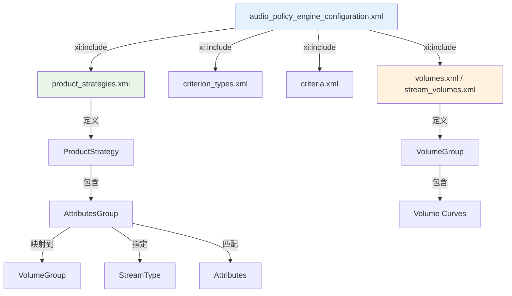
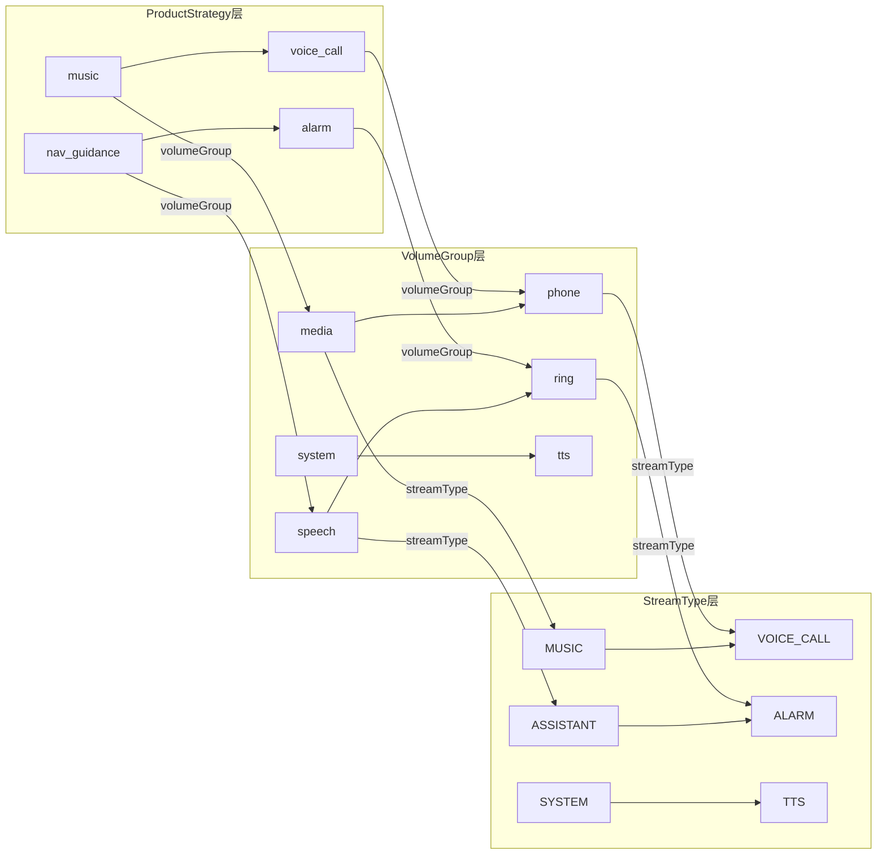
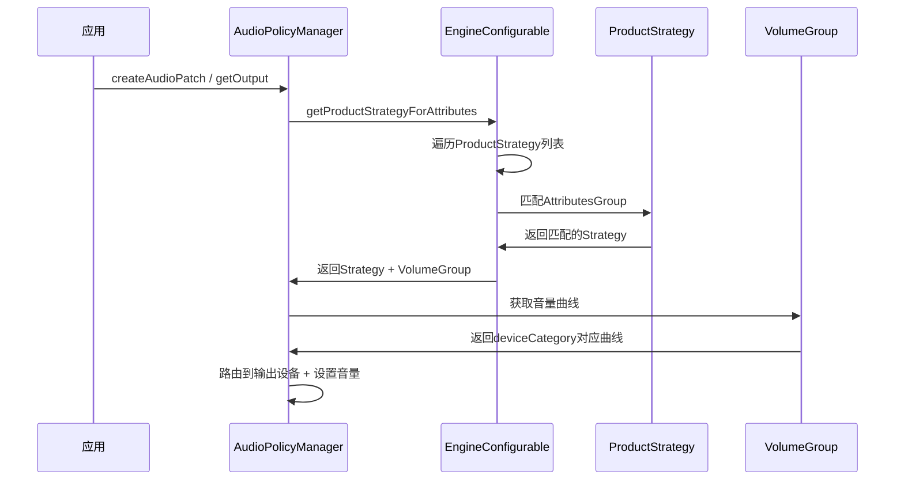

## 11.4 audio_policy_engine_configuration.xml — 策略引擎配置

> [← 上一个](11_11.3_audio_policy_volumes.xml-音量曲线.md) | [← 返回11章](README.md) | [返回导航](../README.md) | [下一个 →](11_11.5_car_audio_configuration.xml-AAOS车载配置.md)

---

### 11.4.1 策略引擎配置体系概述

`audio_policy_engine_configuration.xml` 是Configurable策略引擎的核心配置文件，它通过XInclude机制组合4个子配置文件，定义了ProductStrategy→VolumeGroup→音量曲线的完整映射链。

**注意**：此文件仅在使用`engineconfigurable`（而非默认的`enginedefault`）时生效。部署路径为`/vendor/etc/audio_policy_engine_configuration.xml`。



### 11.4.2 根节点与版本声明

```xml
<configuration version="1.0" xmlns:xi="http://www.w3.org/2001/XInclude">
```

| 属性 | 说明 |
|------|------|
| `version` | 配置文件版本，当前固定为`1.0` |
| `xmlns:xi` | XInclude命名空间声明，用于子文件引用 |

### 11.4.3 子文件引用结构

#### Phone端引用（6个子文件）

```xml
<configuration version="1.0" xmlns:xi="http://www.w3.org/2001/XInclude">
    <xi:include href="audio_policy_engine_product_strategies.xml"/>
    <xi:include href="audio_policy_engine_criterion_types.xml"/>
    <xi:include href="audio_policy_engine_criteria.xml"/>
    <xi:include href="audio_policy_engine_stream_volumes.xml"/>
    <xi:include href="audio_policy_engine_default_stream_volumes.xml"/>
</configuration>
```

#### Automotive端引用（4个子文件）

```xml
<configuration version="1.0" xmlns:xi="http://www.w3.org/2001/XInclude">
    <xi:include href="audio_policy_engine_product_strategies.xml"/>
    <xi:include href="audio_policy_engine_criterion_types.xml"/>
    <xi:include href="audio_policy_engine_criteria.xml"/>
    <xi:include href="audio_policy_engine_volumes.xml"/>
</configuration>
```

| 子文件 | Phone | Automotive | 说明 |
|--------|-------|------------|------|
| `product_strategies.xml` | ✓ | ✓ | ProductStrategy定义，核心路由策略 |
| `criterion_types.xml` | ✓ | ✓ | 判定条件类型定义 |
| `criteria.xml` | ✓ | ✓ | 判定条件值定义 |
| `stream_volumes.xml` | ✓ | — | Phone端VolumeGroup+曲线定义 |
| `default_stream_volumes.xml` | ✓ | — | Phone端默认音量index |
| `volumes.xml` | — | ✓ | Automotive端VolumeGroup+曲线定义 |

### 11.4.4 ProductStrategy 完整解析

ProductStrategy定义了音频属性到策略的映射规则，是策略引擎路由决策的核心。

#### 11.4.4.1 ProductStrategy 节点结构

```xml
<ProductStrategy name="music">
    <AttributesGroup streamType="AUDIO_STREAM_MUSIC" volumeGroup="media">
        <Attributes>
            <Usage value="AUDIO_USAGE_MEDIA"/>
        </Attributes>
        <Attributes>
            <Usage value="AUDIO_USAGE_GAME"/>
        </Attributes>
        <!-- 空Attributes = 默认策略 -->
        <Attributes></Attributes>
    </AttributesGroup>
</ProductStrategy>
```

| 节点/属性 | 必填 | 说明 |
|-----------|------|------|
| `ProductStrategy.name` | 是 | 策略名称，用于标识和调试 |
| `AttributesGroup` | 是 | 属性匹配组，一个Strategy可有多个 |
| `AttributesGroup.streamType` | 否 | 映射的Stream类型 |
| `AttributesGroup.volumeGroup` | 是 | 映射的VolumeGroup名称 |
| `Attributes` | 是 | 属性匹配规则，匹配则路由到此Strategy |

#### 11.4.4.2 Phone端ProductStrategy完整列表

基于[`engineconfigurable/config/example/phone/audio_policy_engine_product_strategies.xml`](frameworks/av/services/audiopolicy/engineconfigurable/config/example/phone/audio_policy_engine_product_strategies.xml)：

| Strategy | StreamType | VolumeGroup | 匹配规则 |
|----------|-----------|-------------|----------|
| STRATEGY_PHONE | VOICE_CALL | voice_call | USAGE_VOICE_COMMUNICATION |
| STRATEGY_PHONE | BLUETOOTH_SCO | bluetooth_sco | FLAG_SCO |
| STRATEGY_SONIFICATION | RING | ring | USAGE_NOTIFICATION_TELEPHONY_RINGTONE |
| STRATEGY_SONIFICATION | ALARM | alarm | USAGE_ALARM |
| STRATEGY_ENFORCED_AUDIBLE | ENFORCED_AUDIBLE | enforced_audible | FLAG_AUDIBILITY_ENFORCED |
| STRATEGY_ACCESSIBILITY | ACCESSIBILITY | accessibility | USAGE_ASSISTANCE_ACCESSIBILITY |
| STRATEGY_SONIFICATION_RESPECTFUL | NOTIFICATION | notification | USAGE_NOTIFICATION / NOTIFICATION_EVENT |
| STRATEGY_MEDIA | ASSISTANT | assistant | CONTENT_SPEECH + USAGE_ASSISTANT |
| STRATEGY_MEDIA | MUSIC | music | USAGE_MEDIA / GAME / ASSISTANT / NAV_GUIDANCE / 默认 |
| STRATEGY_MEDIA | SYSTEM | system | USAGE_ASSISTANCE_SONIFICATION |
| STRATEGY_DTMF | DTMF | dtmf | USAGE_VOICE_COMMUNICATION_SIGNALLING |
| STRATEGY_TRANSMITTED_THROUGH_SPEAKER | TTS | tts | FLAG_BEACON |

**策略优先级**：XML中ProductStrategy的顺序即为优先级顺序，排在前的Strategy优先匹配。STRATEGY_PHONE优先级最高。

#### 11.4.4.3 Automotive端ProductStrategy完整列表

基于[`engineconfigurable/config/example/automotive/audio_policy_engine_product_strategies.xml`](frameworks/av/services/audiopolicy/engineconfigurable/config/example/automotive/audio_policy_engine_product_strategies.xml)：

| Strategy | VolumeGroup | 匹配规则 | 车载类型 |
|----------|-------------|----------|----------|
| oem_traffic_anouncement | oem_traffic_anouncement | CONTENT_SPEECH+NAV_GUIDANCE+oem=1 | OEM定制 |
| oem_strategy_1 | oem_adas_2 | CONTENT_SPEECH+NAV_GUIDANCE+oem=2 | OEM定制 |
| oem_strategy_2 | oem_adas_3 | CONTENT_SPEECH+NAV_GUIDANCE+oem=3 | OEM定制 |
| radio | media_car_audio_type_3 | CONTENT_MUSIC+USAGE_MEDIA+car_audio_type=3 | 收音机 |
| ext_audio_source | media_car_audio_type_7 | CONTENT_MUSIC+USAGE_MEDIA+car_audio_type=7 | 外部音源 |
| voice_command | speech | NAV_GUIDANCE+car_audio_type=1 / ACCESSIBILITY / ASSISTANT | 语音命令 |
| safety_alert | system | CONTENT_SONIFICATION+NOTIFICATION+car_audio_type=2 | 安全警报 |
| music | media | USAGE_MEDIA / GAME / 默认 | 媒体 |
| nav_guidance | speech | USAGE_ASSISTANCE_NAVIGATION_GUIDANCE | 导航 |
| voice_call | phone | USAGE_VOICE_COMMUNICATION / VOICE_COMMUNICATION_SIGNALLING | 通话 |
| voice_call | phone | FLAG_SCO | SCO通话 |
| alarm | ring | USAGE_ALARM | 闹钟 |
| ring | ring | USAGE_NOTIFICATION_TELEPHONY_RINGTONE | 来电铃声 |
| notification | ring | USAGE_NOTIFICATION | 通知 |
| system | system | USAGE_ASSISTANCE_SONIFICATION | 系统 |
| tts | tts | FLAG_BEACON | TTS |

### 11.4.5 AttributesGroup 属性匹配详解

#### 11.4.5.1 Attributes子节点

```xml
<Attributes>
    <ContentType value="AUDIO_CONTENT_TYPE_SPEECH"/>
    <Usage value="AUDIO_USAGE_ASSISTANCE_NAVIGATION_GUIDANCE"/>
    <Flags value="AUDIO_FLAG_SCO"/>
    <Bundle key="car_audio_type" value="1"/>
</Attributes>
```

| 子节点 | 属性 | 说明 | 示例 |
|--------|------|------|------|
| `Usage` | `value` | 音频用途 | `AUDIO_USAGE_MEDIA` |
| `ContentType` | `value` | 内容类型 | `AUDIO_CONTENT_TYPE_SPEECH` |
| `Flags` | `value` | 音频标志 | `AUDIO_FLAG_SCO` |
| `Bundle` | `key` + `value` | 自定义Bundle键值对 | `car_audio_type=1` |

**匹配规则**：一个`<Attributes>`内的所有条件必须同时满足(AND逻辑)；多个`<Attributes>`之间是OR逻辑。

#### 11.4.5.2 车载Bundle扩展

AAOS通过`<Bundle>`扩展属性匹配，实现同Usage+ContentType的细分路由：

```xml
<!-- 同是NAV_GUIDANCE+CONTENT_SPEECH，通过Bundle区分 -->
<AttributesGroup volumeGroup="oem_traffic_anouncement">
    <ContentType value="AUDIO_CONTENT_TYPE_SPEECH"/>
    <Usage value="AUDIO_USAGE_ASSISTANCE_NAVIGATION_GUIDANCE"/>
    <Bundle key="oem" value="1"/>  <!-- 交通公告 -->
</AttributesGroup>

<AttributesGroup volumeGroup="oem_adas_2">
    <ContentType value="AUDIO_CONTENT_TYPE_SPEECH"/>
    <Usage value="AUDIO_USAGE_ASSISTANCE_NAVIGATION_GUIDANCE"/>
    <Bundle key="oem" value="2"/>  <!-- ADAS类型2 -->
</AttributesGroup>
```

**CarAudioAttributesUtil.java中定义的car_audio_type常量**：

| 常量名 | 值 | 含义 |
|--------|-----|------|
| CAR_AUDIO_TYPE_DEFAULT | 0 | 默认 |
| CAR_AUDIO_TYPE_VOICE_COMMAND | 1 | 语音命令 |
| CAR_AUDIO_TYPE_SAFETY_ALERT | 2 | 安全警报 |
| CAR_AUDIO_TYPE_RADIO | 3 | 收音机 |
| CAR_AUDIO_TYPE_SYSTEM | 4 | 系统音 |
| CAR_AUDIO_TYPE_NAVIGATION | 5 | 导航 |
| CAR_AUDIO_TYPE_NOTIFICATION | 6 | 通知 |
| CAR_AUDIO_TYPE_EXTERNAL_AUDIO_SOURCE | 7 | 外部音源 |

### 11.4.6 VolumeGroup 完整解析

VolumeGroup定义了音量控制组，每个组有独立的音量index范围和曲线。

#### 11.4.6.1 VolumeGroup 节点结构

```xml
<volumeGroup>
    <name>media</name>
    <indexMin>0</indexMin>
    <indexMax>40</indexMax>
    <volume deviceCategory="DEVICE_CATEGORY_SPEAKER">
        <point>0,-2400</point>
        <point>33,-1600</point>
        <point>66,-800</point>
        <point>100,0</point>
    </volume>
    <volume deviceCategory="DEVICE_CATEGORY_HEADSET" ref="DEFAULT_MEDIA_VOLUME_CURVE"/>
</volumeGroup>
```

| 子节点 | 说明 |
|--------|------|
| `name` | VolumeGroup名称，与AttributesGroup的volumeGroup属性对应 |
| `indexMin` | 最小音量index（0=可静音，1=不可静音） |
| `indexMax` | 最大音量index |
| `volume` | 该Group在各DeviceCategory上的音量曲线 |

#### 11.4.6.2 Phone端VolumeGroup列表

| VolumeGroup | indexMin | indexMax | 可静音 | 含义 |
|-------------|----------|----------|--------|------|
| voice_call | 1 | 7 | 否 | 通话 |
| bluetooth_sco | 0 | 15 | 是 | 蓝牙SCO |
| system | 0 | 7 | 是 | 系统 |
| ring | 0 | 7 | 是 | 铃声 |
| music | 0 | 25 | 是 | 媒体 |
| alarm | 1 | 7 | 否 | 闹钟 |
| notification | 0 | 7 | 是 | 通知 |
| enforced_audible | 0 | 7 | 是 | 强制 audible |
| dtmf | 0 | 15 | 是 | DTMF |
| tts | 0 | 15 | 是 | TTS |
| accessibility | 1 | 15 | 否 | 无障碍 |
| assistant | 0 | 15 | 是 | 助手 |

#### 11.4.6.3 Automotive端VolumeGroup列表

| VolumeGroup | indexMin | indexMax | 含义 |
|-------------|----------|----------|------|
| oem_traffic_anouncement | 0 | 40 | OEM交通公告 |
| oem_adas_2 | 0 | 40 | OEM ADAS 2 |
| oem_adas_3 | 0 | 40 | OEM ADAS 3 |
| media_car_audio_type_3 | 0 | 40 | 收音机 |
| media_car_audio_type_7 | 0 | 40 | 外部音源 |
| media | 0 | 40 | 媒体 |
| speech | 1 | 40 | 语音(导航/命令) |
| system | 0 | 40 | 系统 |
| phone | 1 | 40 | 通话 |
| ring | 0 | 40 | 铃声 |
| tts | 0 | 15 | TTS |

### 11.4.7 ProductStrategy→VolumeGroup→StreamType 完整映射链



### 11.4.8 enginedefault vs engineconfigurable 对比

| 维度 | enginedefault | engineconfigurable |
|------|---------------|-------------------|
| 配置方式 | C++硬编码策略逻辑 | XML配置驱动策略逻辑 |
| 配置文件 | audio_policy_configuration.xml | audio_policy_engine_configuration.xml系列 |
| 策略修改 | 修改C++源码重编译 | 修改XML重启即可 |
| VolumeGroup | 从Stream隐式推导 | 显式定义在XML中 |
| 适用场景 | 手机端(默认) | 车载/需灵活定制场景 |
| 编译选项 | 默认 | `AUDIO_POLICY_ENGINE=configurable` |

### 11.4.9 Criterion Types 与 Criteria

#### 11.4.9.1 criterion_types.xml

定义策略引擎使用的判定条件类型：

```xml
<CriterionTypes>
    <CriterionType name="phoneState" type="phoneState">
        <Values>
            <Value>PHONE_STATE_OFF</Value>
            <Value>PHONE_STATE_RINGING</Value>
            <Value>PHONE_STATE_IN_CALL</Value>
        </Values>
    </CriterionType>
    <CriterionType name="stream" type="stream">
        <Values>
            <Value>AUDIO_STREAM_MUSIC</Value>
            <Value>AUDIO_STREAM_VOICE_CALL</Value>
            <!-- ... -->
        </Values>
    </CriterionType>
</CriterionTypes>
```

#### 11.4.9.2 criteria.xml

定义策略引擎当前使用的判定条件（运行时状态）：

```xml
<Criteria>
    <Criterion name="phoneState" type="phoneState" default="PHONE_STATE_OFF"/>
    <Criterion name="stream" type="stream" default="AUDIO_STREAM_MUSIC"/>
    <Criterion name="usage" type="usage" default="AUDIO_USAGE_MEDIA"/>
    <Criterion name="contentType" type="contentType" default="AUDIO_CONTENT_TYPE_MUSIC"/>
    <Criterion name="flags" type="flags" default="AUDIO_FLAG_NONE"/>
    <Criterion name="outputDevice" type="outputDevice" default="DEVICE_CATEGORY_SPEAKER"/>
</Criteria>
```

### 11.4.10 策略引擎决策流程



### 11.4.11 OEM定制策略引擎指南

#### 11.4.11.1 添加新的ProductStrategy

```xml
<!-- 示例：添加紧急广播策略 -->
<ProductStrategy name="emergency_broadcast">
    <AttributesGroup streamType="AUDIO_STREAM_SYSTEM" volumeGroup="emergency">
        <ContentType value="AUDIO_CONTENT_TYPE_SONIFICATION"/>
        <Usage value="AUDIO_USAGE_NOTIFICATION"/>
        <Bundle key="oem" value="10"/>
    </AttributesGroup>
</ProductStrategy>
```

#### 11.4.11.2 添加新的VolumeGroup

```xml
<volumeGroup>
    <name>emergency</name>
    <indexMin>1</indexMin>  <!-- 不可静音 -->
    <indexMax>40</indexMax>
    <volume deviceCategory="DEVICE_CATEGORY_SPEAKER">
        <point>0,-1200</point>   <!-- 最小音量也较大 -->
        <point>33,-600</point>
        <point>66,-200</point>
        <point>100,0</point>
    </volume>
</volumeGroup>
```

#### 11.4.11.3 定制注意事项

| 注意事项 | 说明 |
|----------|------|
| Strategy顺序 | 顺序=优先级，OEM定制策略应放在通用策略之前 |
| VolumeGroup命名 | 必须与AttributesGroup的volumeGroup属性精确匹配 |
| indexMin=1 | 安全相关流(ALARM/ACCESSIBILITY/通话)应设为1(不可静音) |
| Bundle扩展 | 车载场景推荐使用car_audio_type或oem key进行细分 |
| 兼容性 | 添加新策略不应影响现有策略的匹配逻辑 |

---

[← 上一个](11_11.3_audio_policy_volumes.xml-音量曲线.md) | [← 返回11章](README.md) | [返回导航](../README.md) | [下一个 →](11_11.5_car_audio_configuration.xml-AAOS车载配置.md)