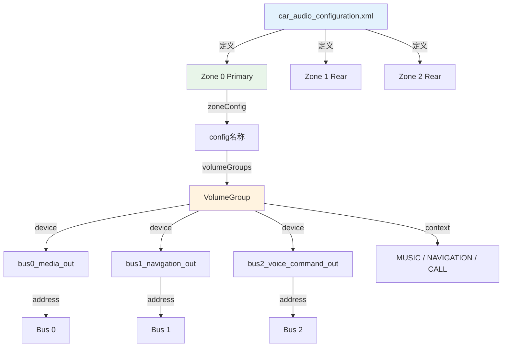
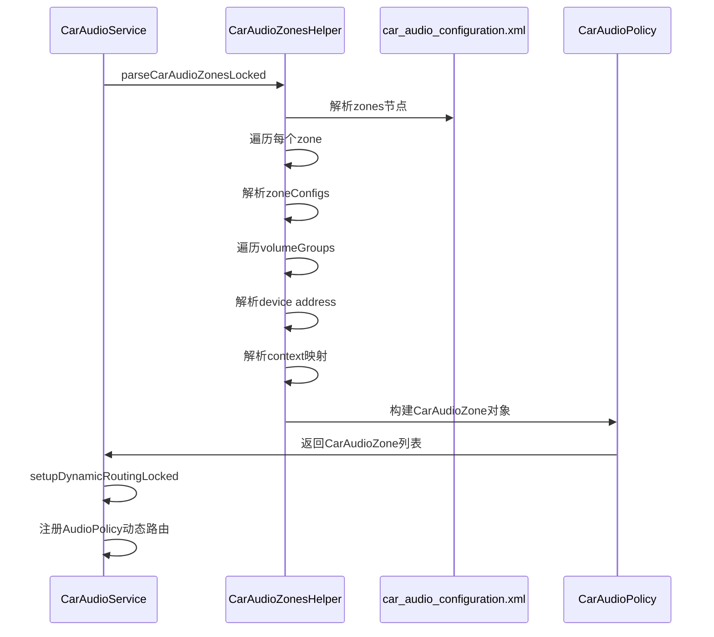

## 11.5 car_audio_configuration.xml — AAOS车载配置

> [← 上一个](11_11.4_audio_policy_engine_configuration.xml-策略引擎配置.md) | [← 返回11章](README.md) | [返回导航](../README.md) | [下一个 →](11_11.6_配置解析流程.md)

---

### 11.5.1 AAOS车载音频配置概述

`car_audio_configuration.xml` 是AAOS车载音频系统的核心配置文件，定义了音频区域(Zone)、音量组(VolumeGroup)、音频上下文(Context)到物理Bus地址的完整映射。它与`audio_policy_configuration.xml`配合使用，后者定义Bus设备，前者定义Bus路由规则。

部署路径：`/vendor/etc/car_audio_configuration.xml`

解析类：[`CarAudioZonesHelper`](packages/services/Car/service/src/com/android/car/audio/CarAudioZonesHelper.java)



### 11.5.2 版本演进

| 版本 | 关键变化 | 兼容性 |
|------|----------|--------|
| v2 | 基础Zone+VolumeGroup+Context映射 | Android 11-13 |
| v3 | 新增zoneConfigs多配置切换机制 | Android 14+ |
| v3 | 支持occupantZoneId乘员区域绑定 | Android 14+ |
| v3 | 支持inputAudioDevice输入设备绑定 | Android 14+ |

### 11.5.3 根节点与版本声明

```xml
<carAudioConfiguration version="3">
    <!-- Zone定义 -->
</carAudioConfiguration>
```

| 属性 | 必填 | 说明 |
|------|------|------|
| `version` | 是 | 配置版本号，当前为`2`或`3` |

### 11.5.4 zones 节点

```xml
<zones>
    <zone name="primary zone" isPrimary="true" audioZoneId="0">
        <!-- zone配置 -->
    </zone>
    <zone name="rear seat zone 1" audioZoneId="1" occupantZoneId="1">
        <!-- zone配置 -->
    </zone>
</zones>
```

#### 11.5.4.1 zone 属性详解

| 属性 | 必填 | 说明 | 约束 |
|------|------|------|------|
| `name` | 是 | 区域名称，仅用于标识和调试 | — |
| `isPrimary` | 否 | 是否为主区域 | 整个配置中只能有一个`isPrimary="true"` |
| `audioZoneId` | 是 | 音频区域唯一ID | 主区域必须为0，其他区域从1递增 |
| `occupantZoneId` | 否(v3) | 绑定的乘员区域ID | 与CarOccupantZoneService关联 |

#### 11.5.4.2 zoneConfigs 节点(v3新增)

v3版本引入`zoneConfigs`，支持同一Zone的多套配置切换：

```xml
<zone name="primary zone" isPrimary="true" audioZoneId="0">
    <zoneConfigs>
        <zoneConfig name="primary configuration" isDefault="true">
            <volumeGroups>
                <!-- 配置1 -->
            </volumeGroups>
        </zoneConfig>
        <zoneConfig name="alternate configuration">
            <volumeGroups>
                <!-- 配置2 -->
            </volumeGroups>
        </zoneConfig>
    </zoneConfigs>
</zone>
```

| 属性 | 必填 | 说明 |
|------|------|------|
| `name` | 是 | 配置名称 |
| `isDefault` | 否 | 是否为默认配置，未指定时第一个为默认 |

**配置切换场景**：
- 不同驾驶模式(普通/运动/经济)下的音频路由
- 不同的乘员配置方案
- 不同的市场/地区配置

### 11.5.5 volumeGroups 节点

```xml
<volumeGroups>
    <group>
        <context context="MUSIC"/>
        <context context="CALL"/>
        <device address="bus0_media_out">
            <context context="MUSIC"/>
        </device>
        <device address="bus2_voice_command_out">
            <context context="CALL"/>
        </device>
    </group>
</volumeGroups>
```

#### 11.5.5.1 group 节点

`<group>`定义一个VolumeGroup，包含一组共享同一音量控制的Context和Device。

| 子节点 | 必填 | 说明 |
|--------|------|------|
| `context` | 是 | 该组包含的音频上下文(组级别或设备级别) |
| `device` | 是 | 该组绑定的Bus设备 |

#### 11.5.5.2 context 定义

Context可以在group级别或device级别定义：

```xml
<!-- 方式1：group级别(所有device共享所有context) -->
<group>
    <context context="MUSIC"/>
    <device address="bus0_media_out"/>
</group>

<!-- 方式2：device级别(每个device独立context) -->
<group>
    <device address="bus0_media_out">
        <context context="MUSIC"/>
    </device>
    <device address="bus1_navigation_out">
        <context context="NAVIGATION"/>
    </device>
</group>
```

#### 11.5.5.3 AAOS AudioContext 完整列表

| Context | 含义 | 对应AudioUsage |
|---------|------|---------------|
| `MUSIC` | 媒体音乐 | MEDIA, GAME |
| `NAVIGATION` | 导航 | ASSISTANCE_NAVIGATION_GUIDANCE |
| `VOICE_COMMAND` | 语音命令 | ASSISTANT |
| `CALL_RING` | 来电铃声 | NOTIFICATION_TELEPHONY_RINGTONE |
| `CALL` | 通话 | VOICE_COMMUNICATION |
| `ALARM` | 闹钟 | ALARM |
| `NOTIFICATION` | 通知 | NOTIFICATION, NOTIFICATION_EVENT |
| `SYSTEM_SOUND` | 系统音 | ASSISTANCE_SONIFICATION |
| `EMERGENCY` | 紧急 | SAFETY_ALERT(car_audio_type=2) |
| `SAFETY` | 安全 | ASSISTANCE_SONIFICATION(强制) |
| `VEHICLE_STATUS` | 车辆状态 | ASSISTANCE_SONIFICATION |
| `ANNOUNCEMENT` | 公告 | ANNOUNCEMENT |
| `RADIO` | 收音机 | MEDIA(car_audio_type=3) |
| `EXTERNAL_AUDIO_SOURCE` | 外部音源 | MEDIA(car_audio_type=7) |

### 11.5.6 device 节点详解

```xml
<device address="bus0_media_out">
    <context context="MUSIC"/>
</device>
```

| 属性 | 必填 | 说明 |
|------|------|------|
| `address` | 是 | Bus设备地址，必须与audio_policy_configuration.xml中devicePort的address精确匹配 |

**Bus地址命名规范**：

| 命名格式 | 示例 | 说明 |
|----------|------|------|
| `bus{N}_{用途}_out` | `bus0_media_out` | 标准命名，N=Bus编号 |
| `bus{N}_{用途}_in` | `bus1000_microphone_in` | 输入设备 |

### 11.5.7 AAOS完整配置示例(v3)

基于[`device/generic/car/emulator/audio/car_audio_configuration.xml`](device/generic/car/emulator/audio/car_audio_configuration.xml)的完整分析：

```xml
<carAudioConfiguration version="3">
    <zones>
        <!-- 主区域 -->
        <zone name="primary zone" isPrimary="true" audioZoneId="0">
            <zoneConfigs>
                <zoneConfig name="primary configuration" isDefault="true">
                    <volumeGroups>
                        <!-- VolumeGroup 0: 媒体+导航 -->
                        <group>
                            <device address="bus0_media_out">
                                <context context="MUSIC"/>
                            </device>
                            <device address="bus1_navigation_out">
                                <context context="NAVIGATION"/>
                            </device>
                        </group>
                        <!-- VolumeGroup 1: 语音命令+通话 -->
                        <group>
                            <device address="bus2_voice_command_out">
                                <context context="VOICE_COMMAND"/>
                            </device>
                            <device address="bus3_call_ring_out">
                                <context context="CALL_RING"/>
                            </device>
                            <device address="bus4_call_out">
                                <context context="CALL"/>
                            </device>
                        </group>
                        <!-- VolumeGroup 2: 通知+系统 -->
                        <group>
                            <device address="bus5_notification_out">
                                <context context="NOTIFICATION"/>
                            </device>
                            <device address="bus6_system_sound_out">
                                <context context="SYSTEM_SOUND"/>
                                <context context="EMERGENCY"/>
                                <context context="SAFETY"/>
                                <context context="VEHICLE_STATUS"/>
                            </device>
                        </group>
                        <!-- VolumeGroup 3: 闹钟 -->
                        <group>
                            <device address="bus7_alarm_out">
                                <context context="ALARM"/>
                            </device>
                        </group>
                    </volumeGroups>
                </zoneConfig>
            </zoneConfigs>
        </zone>

        <!-- 后排区域1 -->
        <zone name="rear seat zone 1" audioZoneId="1" occupantZoneId="1">
            <zoneConfigs>
                <zoneConfig name="rear seat zone 1 config" isDefault="true">
                    <volumeGroups>
                        <group>
                            <device address="bus100_media_out">
                                <context context="MUSIC"/>
                            </device>
                        </group>
                        <group>
                            <device address="bus101_navigation_out">
                                <context context="NAVIGATION"/>
                            </device>
                        </group>
                    </volumeGroups>
                </zoneConfig>
            </zoneConfigs>
        </zone>

        <!-- 后排区域2 -->
        <zone name="rear seat zone 2" audioZoneId="2" occupantZoneId="2">
            <zoneConfigs>
                <zoneConfig name="rear seat zone 2 config" isDefault="true">
                    <volumeGroups>
                        <group>
                            <device address="bus200_media_out">
                                <context context="MUSIC"/>
                            </device>
                        </group>
                        <group>
                            <device address="bus201_navigation_out">
                                <context context="NAVIGATION"/>
                            </device>
                        </group>
                    </volumeGroups>
                </zoneConfig>
            </zoneConfigs>
        </zone>
    </zones>
</carAudioConfiguration>
```

### 11.5.8 CarAudioZonesHelper 解析流程



### 11.5.9 Context→Bus→HAL 端到端路由

```
应用播放音频(Usage=MEDIA)
  → AudioPolicyManager获取ProductStrategy
  → 匹配AttributesGroup得到VolumeGroup=media
  → CarAudioService查找Context=MUSIC
  → 查找当前Zone的VolumeGroup
  → 找到device address=bus0_media_out
  → AudioFlinger路由到primary HAL的bus0输出
  → HAL/DSP输出到对应扬声器
```

### 11.5.10 audio_policy_configuration与car_audio_configuration的配合

两个文件必须严格配合：

| 配置文件 | 定义内容 | 配合关系 |
|----------|----------|----------|
| audio_policy_configuration.xml | devicePort type=BUS address="bus0_media_out" | 定义Bus设备的存在和增益范围 |
| car_audio_configuration.xml | device address="bus0_media_out" | 定义Bus设备的Context路由 |

**约束条件**：
1. car_audio_configuration.xml中的每个`address`必须在audio_policy_configuration.xml中有对应的devicePort
2. 每个Bus设备只能属于一个Zone
3. 每个Context只能出现在一个VolumeGroup中
4. 主Zone的audioZoneId必须为0

### 11.5.11 inputAudioDevice 输入设备绑定(v3)

```xml
<zone name="primary zone" isPrimary="true" audioZoneId="0">
    <inputAudioDevices>
        <device address="bus1000_microphone_in"/>
    </inputAudioDevices>
    <!-- ... -->
</zone>
```

将输入Bus设备绑定到特定Zone，实现分区麦克风输入。

### 11.5.12 OEM定制车载音频配置指南

#### 11.5.12.1 添加新的音频Zone

```xml
<zone name="rear seat zone 3" audioZoneId="3" occupantZoneId="3">
    <zoneConfigs>
        <zoneConfig name="rear zone 3 config" isDefault="true">
            <volumeGroups>
                <group>
                    <device address="bus300_media_out">
                        <context context="MUSIC"/>
                    </device>
                </group>
            </volumeGroups>
        </zoneConfig>
    </zoneConfigs>
</zone>
```

**同时需在audio_policy_configuration.xml中添加**：
```xml
<devicePort tagName="Bus 300 Media Out" type="AUDIO_DEVICE_OUT_BUS"
            address="bus300_media_out" role="sink">
    <gains minGainMB="-3200" maxGainMB="600" stepValueMB="100"/>
</devicePort>
```

#### 11.5.12.2 调整VolumeGroup分组

将导航从媒体组拆分到独立组，实现独立音量控制：

```xml
<!-- 原始：导航和媒体共享音量 -->
<group>
    <device address="bus0_media_out">
        <context context="MUSIC"/>
    </device>
    <device address="bus1_navigation_out">
        <context context="NAVIGATION"/>
    </device>
</group>

<!-- 定制：导航独立音量组 -->
<group>
    <device address="bus0_media_out">
        <context context="MUSIC"/>
    </device>
</group>
<group>
    <device address="bus1_navigation_out">
        <context context="NAVIGATION"/>
    </device>
</group>
```

#### 11.5.12.3 配置验证命令

```bash
# 查看当前Zone配置
adb shell dumpsys audio | grep "CarAudio"

# 查看动态路由配置
adb shell dumpsys audio | grep "Dynamic"

# 查看VolumeGroup信息
adb shell dumpsys audio | grep "VolumeGroup"

# 查看Bus设备列表
adb shell dumpsys media.audio_policy | grep "BUS"
```

---

[← 上一个](11_11.4_audio_policy_engine_configuration.xml-策略引擎配置.md) | [← 返回11章](README.md) | [返回导航](../README.md) | [下一个 →](11_11.6_配置解析流程.md)