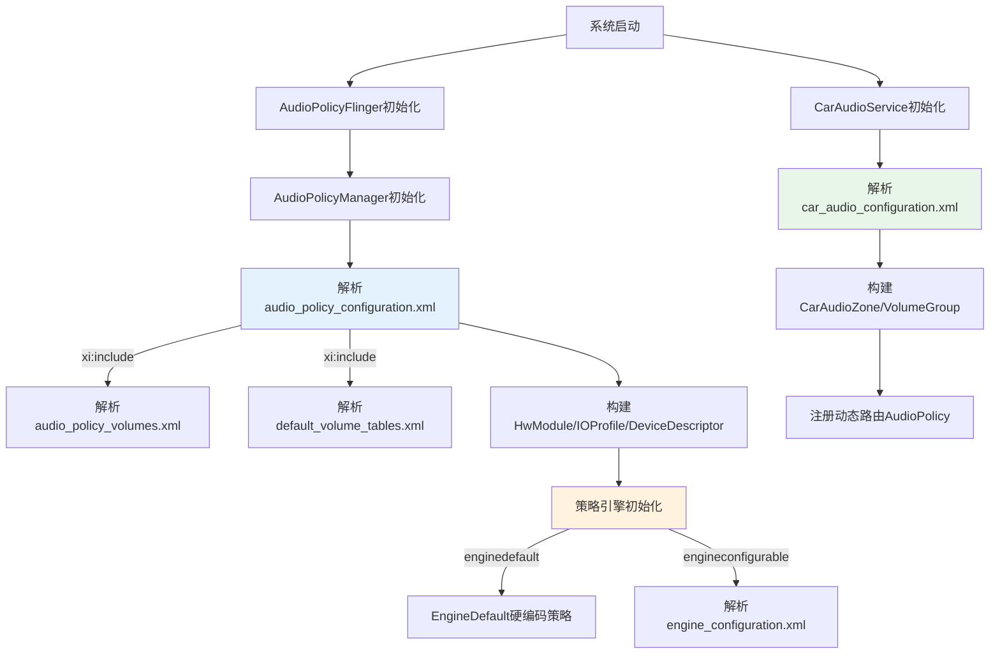
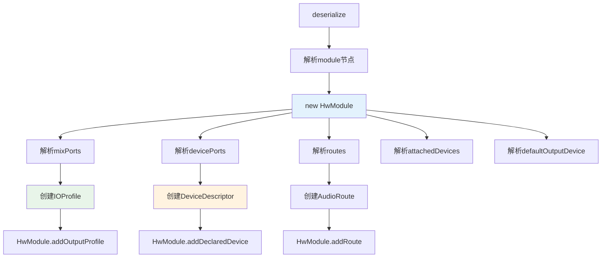
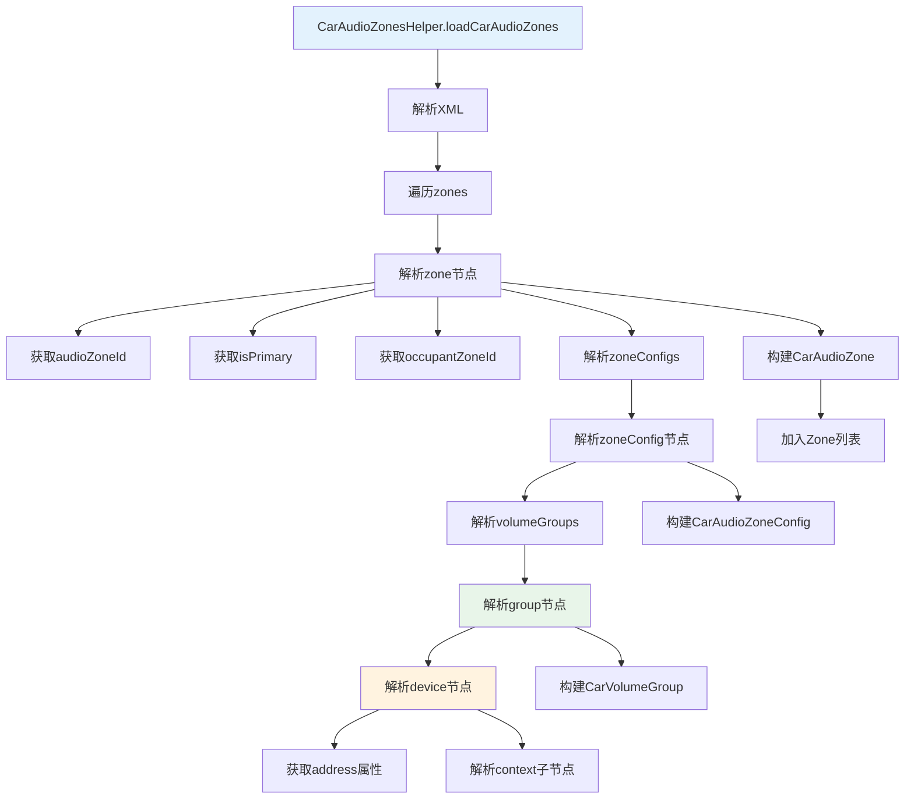
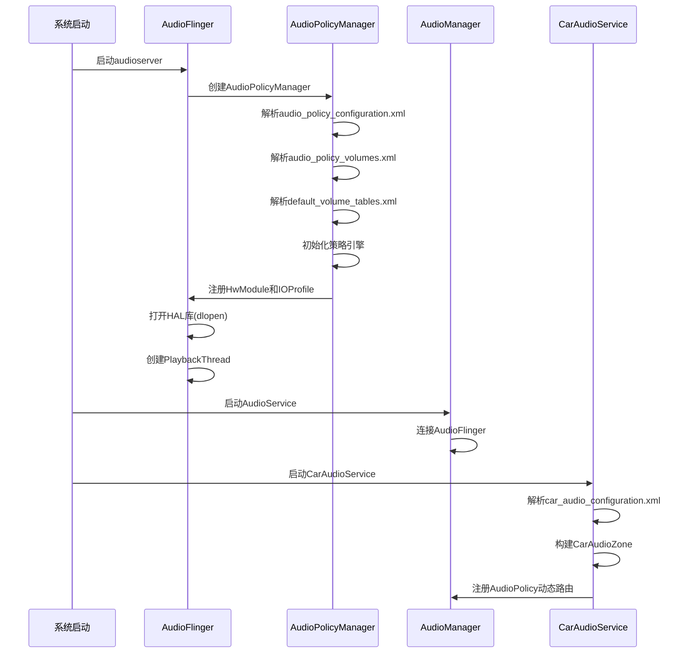

## 11.6 配置解析流程

> [← 上一个](11_11.5_car_audio_configuration.xml-AAOS车载配置.md) | [← 返回11章](README.md) | [返回导航](../README.md) | [下一个 →](11_11.7_OEM定制指南.md)

---

### 11.6.1 配置解析总体架构

Android音频系统启动时，多个组件按序解析各自的XML配置文件，构建内存中的音频策略数据结构。解析流程涉及Native层(AudioPolicyManager)和Java层(CarAudioService)的协作。



### 11.6.2 Native层解析流程

#### 11.6.2.1 AudioPolicyManager初始化

AudioPolicyManager构造函数中的配置解析调用链：

```
AudioPolicyManager::AudioPolicyManager()
  → AudioPolicyManager::onFirstRef()
    → AudioPolicyConfig::parse()
      → deserializeAudioPolicyXmlFile()
        → android::AudioPolicyConfig::deserialize()
```

#### 11.6.2.2 audio_policy_configuration.xml 解析入口

```cpp
// frameworks/av/services/audiopolicy/common/managerdefinitions/src/Serializer.cpp
status_t AudioPolicyConfig::deserialize(const tinyxml2::XMLElement& root) {
    // 1. 解析根节点版本
    // 2. 解析globalConfiguration
    // 3. 解析modules
    // 4. 解析volumes (xi:include展开后)
}
```

#### 11.6.2.3 module 解析流程



#### 11.6.2.4 关键C++解析类与XML节点对应

| XML节点 | 解析C++类 | 关键成员 |
|---------|----------|----------|
| `<module>` | [`HwModule`](frameworks/av/services/audiopolicy/common/managerdefinitions/include/HwModule.h) | mDeclaredDevices, mOutputProfiles, mInputProfiles, mRoutes |
| `<mixPort>` | [`IOProfile`](frameworks/av/services/audiopolicy/common/managerdefinitions/include/IOProfile.h) | mProfiles, mFlags, mSupportedDevices |
| `<devicePort>` | [`DeviceDescriptor`](frameworks/av/services/audiopolicy/common/managerdefinitions/include/DeviceDescriptor.h) | mDeviceType, mAddress, mGains |
| `<route>` | [`AudioRoute`](frameworks/av/services/audiopolicy/common/managerdefinitions/include/AudioRoute.h) | mSource, mSink, mType |
| `<gains>` | [`Gain`](frameworks/av/services/audiopolicy/common/managerdefinitions/include/AudioGain.h) | mMinValueMB, mMaxValueMB, mStepValueMB |
| `<volume>` | [`VolumeCurve`](frameworks/av/services/audiopolicy/common/managerdefinitions/include/VolumeCurve.h) | mCurvePoints |

#### 11.6.2.5 mixPort解析详细流程

```
Serializer::deserializeCollection <mixPort>
  → 遍历每个<mixPort>节点
    → 解析name属性
    → 解析role属性(output/input)
    → 解析flags属性
      → AudioFlagFromString()转换字符串→枚举
    → 解析<profile>子节点(采样率/格式/声道)
    → 创建IOProfile对象
    → HwModule.addOutputProfile() 或 addInputProfile()
```

**flags解析映射**：

| flags字符串 | 枚举值 | 含义 |
|------------|--------|------|
| `AUDIO_OUTPUT_FLAG_PRIMARY` | OUTPUT_FLAG_PRIMARY | 主输出 |
| `AUDIO_OUTPUT_FLAG_DIRECT` | OUTPUT_FLAG_DIRECT | 直接输出(低延迟) |
| `AUDIO_OUTPUT_FLAG_COMPRESS_OFFLOAD` | OUTPUT_FLAG_COMPRESS_OFFLOAD | 硬件解码 |
| `AUDIO_OUTPUT_FLAG_DEEP_BUFFER` | OUTPUT_FLAG_DEEP_BUFFER | 深缓冲 |
| `AUDIO_OUTPUT_FLAG_VOIP_RX` | OUTPUT_FLAG_VOIP_RX | VoIP接收 |
| `AUDIO_OUTPUT_FLAG_INCALL_MUSIC` | OUTPUT_FLAG_INCALL_MUSIC | 通话中音乐 |
| `AUDIO_OUTPUT_FLAG_MMAP_NOIRQ` | OUTPUT_FLAG_MMAP_NOIRQ | MMAP无中断 |

#### 11.6.2.6 devicePort解析详细流程

```
Serializer::deserializeCollection <devicePort>
  → 遍历每个<devicePort>节点
    → 解析tagName属性
    → 解析type属性(AUDIO_DEVICE_OUT_BUS等)
      → deviceFromString()转换字符串→枚举
    → 解析role属性(source/sink)
    → 解析address属性(bus0_media_out等)
    → 解析<gains>子节点
      → Gain::dump()获取min/max/step
    → 创建DeviceDescriptor对象
    → HwModule.addDeclaredDevice()
```

#### 11.6.2.7 volume解析流程

```
Serializer::deserializeVolume <volume>
  → 解析stream属性 → streamType枚举
  → 解析deviceCategory属性 → device_category枚举
  → 检查是否有ref属性
    → 有ref: 从default_volume_tables查找引用曲线
    → 无ref: 解析<point>子节点
  → 创建VolumeCurve对象
  → 添加到mVolumeCurves集合
```

### 11.6.3 Java层解析流程(AAOS)

#### 11.6.3.1 CarAudioService初始化

```java
// packages/services/Car/service/src/com/android/car/audio/CarAudioService.java
private void loadCarAudioConfigurationLocked() {
    // 1. 读取car_audio_configuration.xml
    try (InputStream inputStream = mContext.getResources().openRawResource(
            com.android.car.R.raw.car_audio_configuration)) {
        // 2. 创建CarAudioZonesHelper
        CarAudioZonesHelper zonesHelper = new CarAudioZonesHelper(
                inputStream, mCarAudioSettings, mAudioManager,
                mUseCarVolumeGroupMgmt, mUseDynamicRouting, mUseCoreAudioVolume,
                mUseCoreAudioRouting);
        // 3. 解析Zone配置
        mCarAudioZones = zonesHelper.loadCarAudioZones();
    }
}
```

#### 11.6.3.2 CarAudioZonesHelper解析详细流程



#### 11.6.3.3 动态路由注册

CarAudioService完成配置解析后，通过AudioManager注册动态路由策略：

```java
// CarAudioService.java
private void setupDynamicRoutingLocked() {
    // 1. 遍历所有Zone
    for (CarAudioZone zone : mCarAudioZones) {
        // 2. 遍历每个VolumeGroup
        for (CarVolumeGroup group : zone.getVolumeGroups()) {
            // 3. 构建AudioTrack/Stream→Bus的路由规则
            AudioPolicy.Builder builder = new AudioPolicy.Builder();
            // 4. 添加路由规则
            builder.addRule(/* attributes → device */);
        }
    }
    // 5. 注册AudioPolicy
    mAudioManager.registerAudioPolicy(mAudioPolicy);
}
```

### 11.6.4 配置文件加载时序



### 11.6.5 配置文件搜索路径

AudioPolicyManager按以下顺序搜索配置文件：

| 优先级 | 路径 | 说明 |
|--------|------|------|
| 1 | `/vendor/etc/audio_policy_configuration.xml` | Vendor定制配置(最高优先) |
| 2 | `/system/etc/audio_policy_configuration.xml` | 系统默认配置 |
| 3 | `/odm/etc/audio_policy_configuration.xml` | ODM配置 |

CarAudioService搜索路径：

| 优先级 | 来源 | 说明 |
|--------|------|------|
| 1 | `R.raw.car_audio_configuration` | overlay资源 |
| 2 | `/vendor/etc/car_audio_configuration.xml` | Vendor配置 |

### 11.6.6 解析错误处理

| 错误类型 | 处理方式 |
|----------|----------|
| 缺少必需属性 | 忽略该节点，输出ERROR日志 |
| type/address不匹配 | 忽略该节点，输出WARNING日志 |
| Bus地址重复 | 后定义的覆盖先定义的 |
| Version不匹配 | 使用默认版本解析，输出WARNING |
| XML格式错误 | 加载失败，使用硬编码默认配置 |
| VolumeGroup中device无对应devicePort | 忽略该device，输出ERROR日志 |

### 11.6.7 配置热更新机制

| 配置文件 | 是否支持热更新 | 更新方式 |
|----------|--------------|----------|
| audio_policy_configuration.xml | 否 | 重启audioserver |
| audio_policy_volumes.xml | 否 | 重启audioserver |
| car_audio_configuration.xml | v3支持zoneConfig切换 | CarAudioManager.setZoneConfigSwitch() |
| audio_policy_engine_configuration.xml | 否 | 重启audioserver |

**v3 zoneConfig切换流程**：

```
CarAudioManager.setZoneConfigSwitch(zoneId, configName)
  → CarAudioService.switchZoneConfig(zoneId, configName)
  → CarAudioZone.switchZoneConfig(configName)
  → 重建VolumeGroup路由
  → 重新注册AudioPolicy
```

### 11.6.8 配置验证工具

```bash
# 验证audio_policy_configuration.xml
adb shell dumpsys media.audio_policy

# 验证音量曲线
adb shell dumpsys media.audio_policy | grep "Volume"

# 验证动态路由
adb shell dumpsys audio | grep "CarAudio"

# 验证HwModule加载
adb shell dumpsys media.audio_flinger | grep "Output"

# 验证HAL库加载
adb shell lsof | grep audio.primary

# 检查XML格式
xmllint --schema audio_policy_configuration.xsd audio_policy_configuration.xml
```

---

[← 上一个](11_11.5_car_audio_configuration.xml-AAOS车载配置.md) | [← 返回11章](README.md) | [返回导航](../README.md) | [下一个 →](11_11.7_OEM定制指南.md)