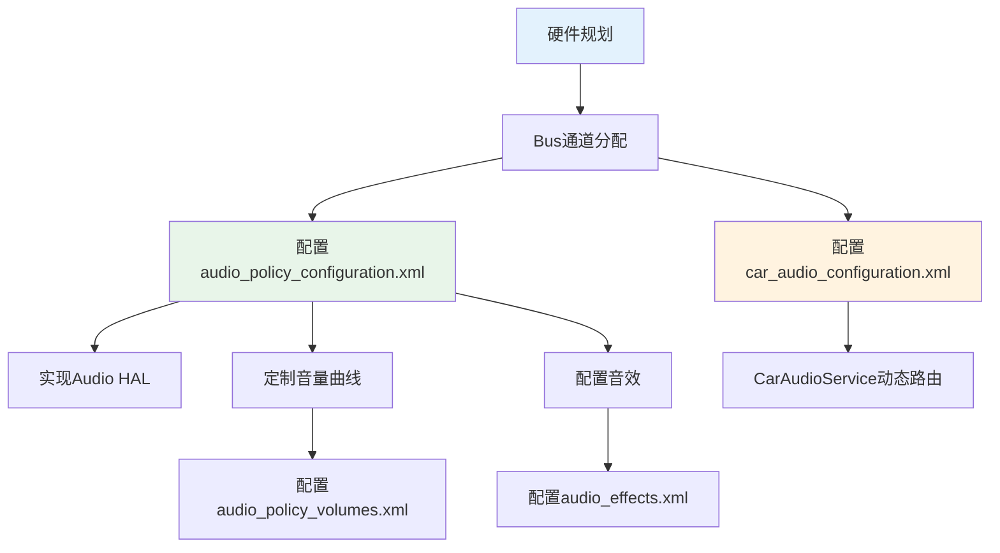

## 11.7 OEM定制指南

> [← 上一个](11_11.6_配置解析流程.md) | [← 返回11章](README.md) | [返回导航](../README.md) | [下一个 →](11_11.8_audio_policy_configuration.xml_属性详解.md)

---

### 11.7.1 OEM定制概述

AAOS车载音频系统的OEM定制主要通过修改XML配置文件和实现Audio HAL来完成，无需修改Framework源码。本指南覆盖从硬件规划到软件配置的完整定制流程。



### 11.7.2 定制文件清单与职责

| 文件 | 部署路径 | 定制内容 | 影响范围 |
|------|----------|----------|----------|
| audio_policy_configuration.xml | /vendor/etc/ | 设备/路由/增益定义 | 音频路由和设备枚举 |
| audio_policy_volumes.xml | /vendor/etc/ | 音量曲线 | 音量控制 |
| default_volume_tables.xml | /vendor/etc/ | 曲线模板 | 音量曲线引用 |
| car_audio_configuration.xml | /vendor/etc/ | Zone/VolumeGroup/Context | AAOS动态路由 |
| audio_effects.xml | /vendor/etc/ | 音效配置 | 音效处理链 |
| audio_policy_engine_configuration.xml | /vendor/etc/ | 策略引擎 | 策略路由决策 |

### 11.7.3 Step 1: 硬件规划与Bus通道分配

#### 11.7.3.1 Bus通道规划原则

| 原则 | 说明 |
|------|------|
| 一Context一Bus | 每个AudioContext分配独立Bus，实现独立音量控制 |
| 安全优先 | EMERGENCY/SAFETY必须独立Bus，不被其他流衰减 |
| Zone隔离 | 不同Zone的Bus编号不重叠 |
| 预留扩展 | Bus编号留间隔(主Zone用0-7, Zone1用100-107) |

#### 11.7.3.2 典型车载Bus分配方案

| Bus | 地址 | 用途 | Zone |
|-----|------|------|------|
| 0 | bus0_media_out | 媒体音乐 | Primary |
| 1 | bus1_navigation_out | 导航提示 | Primary |
| 2 | bus2_voice_command_out | 语音命令 | Primary |
| 3 | bus3_call_ring_out | 来电铃声 | Primary |
| 4 | bus4_call_out | 通话语音 | Primary |
| 5 | bus5_notification_out | 通知 | Primary |
| 6 | bus6_system_sound_out | 系统/安全/紧急 | Primary |
| 7 | bus7_alarm_out | 闹钟 | Primary |
| 100 | bus100_media_out | 后排媒体 | Zone 1 |
| 101 | bus101_navigation_out | 后排导航 | Zone 1 |
| 1000 | bus1000_microphone_in | 麦克风输入 | Primary |

### 11.7.4 Step 2: 配置audio_policy_configuration.xml

#### 11.7.4.1 定义Bus设备

```xml
<module name="primary" halVersion="3.0">
    <attachedDevices>
        <item>Bus 0 Media Out</item>
        <item>Bus 1 Navigation Out</item>
    </attachedDevices>
    <defaultOutputDevice>Bus 0 Media Out</defaultOutputDevice>

    <devicePorts>
        <devicePort tagName="Bus 0 Media Out" type="AUDIO_DEVICE_OUT_BUS"
                    address="bus0_media_out" role="sink">
            <gains minGainMB="-3200" maxGainMB="600" stepValueMB="100"
                   defaultValueMB="-800" useForVolume="true"/>
        </devicePort>
        <devicePort tagName="Bus 1 Navigation Out" type="AUDIO_DEVICE_OUT_BUS"
                    address="bus1_navigation_out" role="sink">
            <gains minGainMB="-3200" maxGainMB="600" stepValueMB="100"
                   defaultValueMB="-800" useForVolume="true"/>
        </devicePort>
    </devicePorts>

    <routes>
        <route type="mix" sink="Bus 0 Media Out"
               sources="primary output,deep_buffer,compressed_offload"/>
        <route type="mix" sink="Bus 1 Navigation Out"
               sources="primary output,deep_buffer"/>
    </routes>
</module>
```

#### 11.7.4.2 gains参数设定指南

| 参数 | 设定依据 | 典型范围 |
|------|----------|----------|
| minGainMB | 功放最小增益(静音附近) | -3200至-4800 mB |
| maxGainMB | 功放最大增益(不失真) | 0至600 mB |
| stepValueMB | 音量步进精度 | 50至100 mB |
| defaultValueMB | 开机默认增益 | -800至-1600 mB |
| useForVolume | AAOS必须为true | true |

**增益校准方法**：
1. 确定功放0dB增益时的声压级(SPL)
2. 测量最大不失真SPL对应的增益值设为maxGainMB
3. 测量可听最小SPL对应的增益值设为minGainMB
4. 计算步进步数建议30至100步

### 11.7.5 Step 3: 配置car_audio_configuration.xml

参见[11.5节](11_11.5_car_audio_configuration.xml-AAOS车载配置.md)的详细配置示例。

关键定制点：
- Zone划分和audioZoneId分配
- VolumeGroup分组策略
- Context到Bus映射关系
- zoneConfig多配置切换

### 11.7.6 Step 4: 定制音量曲线

#### 11.7.6.1 AAOS音量控制模型

AAOS使用Bus Gain而非Stream Volume，音量控制链路：

```
用户调节音量
  → CarVolumeGroup.setCurrentGainIndex(index)
  → 计算gainMB = minGainMB + index x stepValueMB
  → setAudioPortGain(device, gainMB)
  → AudioFlinger → HAL → DSP或功放增益
```

#### 11.7.6.2 音量步数计算

```
indexMax = (maxGainMB - minGainMB) / stepValueMB
示例: (600 - (-3200)) / 100 = 38步 (indexMin=0, indexMax=38)
```

### 11.7.7 Step 5: 实现Audio HAL

#### 11.7.7.1 AIDL Audio HAL (Android 14+)

关键实现方法：

| 方法 | 说明 |
|------|------|
| openOutputStream | 打开Bus输出流 |
| setAudioPortGain | 设置Bus增益实现音量控制 |
| setAudioPortConfig | 设置音频格式和采样率 |
| getAudioPort | 获取端口信息 |

#### 11.7.7.2 HAL实现模板

```cpp
class AudioModule : public BnModule {
public:
    ndk::ScopedAStatus setAudioPortGain(
            const AudioPort& port, const GainConfig& gain) override {
        // 1. 解析port地址获取Bus编号
        // 2. 将gainMB转换为DSP或功放增益寄存器值
        // 3. 通过ioctl或sysfs设置硬件增益
        return ndk::ScopedAStatus::ok();
    }
};
```

### 11.7.8 Step 6: 音效配置

#### 11.7.8.1 车载常用音效

| 音效 | 用途 | 路径 |
|------|------|------|
| Equalizer | 均衡器调节 | libbundlewrapper.so |
| BassBoost | 低音增强 | libbundlewrapper.so |
| Virtualizer | 环绕声 | libbundlewrapper.so |
| LoudnessEnhancer | 响度增强 | libldnhncr.so |
| NoiseSuppression | 降噪(输入) | libaudiopreprocessing.so |
| AcousticEchoCanceler | 回声消除(输入) | libaudiopreprocessing.so |

### 11.7.9 Step 7: 编译与部署

```bash
# 推送配置到设备
adb push audio_policy_configuration.xml /vendor/etc/
adb push car_audio_configuration.xml /vendor/etc/

# 重启audioserver使配置生效
adb shell killall audioserver

# 重启CarAudioService
adb shell killall car_service

# 验证配置加载
adb shell dumpsys media.audio_policy | head -50
adb shell dumpsys audio | grep "CarAudio"
```

### 11.7.10 定制验证清单

| 验证项 | 命令或方法 | 预期结果 |
|--------|-----------|----------|
| Bus设备枚举 | dumpsys media.audio_policy查找BUS | 所有Bus设备可见 |
| Zone配置 | dumpsys audio查找CarAudio | Zone数量和ID正确 |
| VolumeGroup | dumpsys audio查找VolumeGroup | 分组和Context映射正确 |
| 音量控制 | 调节音量滑块 | 对应Bus增益变化 |
| 路由正确性 | 播放不同Usage音频 | 路由到正确Bus |
| HAL加载 | lsof查找audio.primary | HAL库已加载 |
| 音效加载 | dumpsys media.audio_flinger查找effect | 音效链路正确 |

### 11.7.11 常见问题排查

| 问题 | 原因 | 解决方案 |
|------|------|----------|
| 无声音 | Bus地址不匹配 | 检查两个XML的address一致 |
| 音量不可控 | gains未设置useForVolume=true | 修改gains配置 |
| 路由错误 | Context映射不正确 | 检查car_audio_configuration.xml |
| HAL crash | gains范围超出硬件支持 | 调整min/maxGainMB |
| Zone切换失败 | occupantZoneId未绑定 | 检查Zone配置 |
| 多Zone串音 | route source包含多余mixPort | 精简routes配置 |

---

[← 上一个](11_11.6_配置解析流程.md) | [← 返回11章](README.md) | [返回导航](../README.md) | [下一个 →](11_11.8_audio_policy_configuration.xml_属性详解.md)