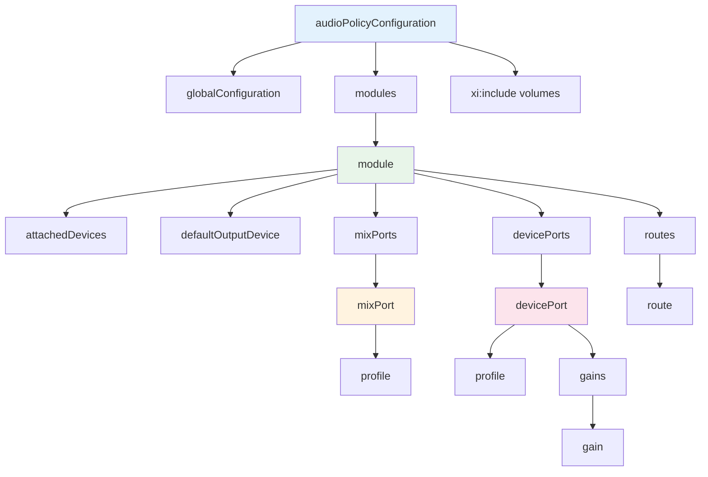

## 11.8 audio_policy_configuration.xml 属性详解

> [← 上一个](11_11.7_OEM定制指南.md) | [← 返回11章](README.md) | [返回导航](../README.md) | [下一个 →](11_11.9_car_audio_configuration.xml_深度解析.md)

---

### 11.8.1 文档结构总览

audio_policy_configuration.xml是Audio Policy系统的核心配置文件，定义了音频硬件模块、设备端口、混音端口和路由关系。本文档对所有XML标签和属性进行方法级详解。



### 11.8.2 根节点 audioPolicyConfiguration

| 属性 | 必填 | 类型 | 说明 |
|------|------|------|------|
| version | 是 | string | 配置版本号，格式major.minor |

**版本演进**：

| 版本 | 对应Android版本 | 关键变更 |
|------|-----------------|----------|
| 1.0 | Android 7-8 | 初始版本，基础设备/路由定义 |
| 2.0 | Android 9-10 | 增加Audio HAL 2.0支持 |
| 7.0 | Android 11-14 | 增加AIDL HAL支持、call_screen_mode等 |

**Phone端示例**（[`redfin`](device/google/redfin/audio/audio_policy_configuration.xml:17)）：
```xml
<audioPolicyConfiguration version="7.0" xmlns:xi="http://www.w3.org/2001/XInclude">
```

**Car端示例**（[`car_emulator`](device/generic/car/emulator/audio/audio_policy_configuration.xml:17)）：
```xml
<audioPolicyConfiguration version="1.0" xmlns:xi="http://www.w3.org/2001/XInclude">
```

### 11.8.3 globalConfiguration 全局配置

| 属性 | 类型 | 默认值 | 说明 |
|------|------|--------|------|
| speaker_drc_enabled | bool | false | 扬声器DRC（动态范围压缩）开关 |
| call_screen_mode_supported | bool | false | 通话屏幕模式支持（Android 11+） |

**Phone端示例**：
```xml
<globalConfiguration speaker_drc_enabled="true" call_screen_mode_supported="true"/>
```

**Car端示例**：
```xml
<globalConfiguration speaker_drc_enabled="true"/>
```

**speaker_drc_enabled深度解析**：
- 启用后AudioFlinger对SPEAKER设备输出应用DRC压缩
- 目的：防止扬声器过载失真，保护硬件
- 实现位置：AudioFlinger::PlaybackThread中检查mGlobalConfig speaker_drc_enabled
- 车载场景：通常设为true，防止功放过载

**call_screen_mode_supported深度解析**：
- Android 11新增，支持通话时将音频路由到屏幕
- 仅Phone端使用，Car端不涉及
- 影响AudioPolicy路由决策中CALL_SCREEN策略

### 11.8.4 module 模块节点

module代表一个Audio HAL实现，每个HAL对应一个module。

| 属性 | 必填 | 类型 | 说明 |
|------|------|------|------|
| name | 是 | string | 模块名，决定加载哪个HAL库 |
| halVersion | 是 | string | HAL版本号，格式major.minor |

**name属性取值表**：

| name | HAL库文件 | 说明 |
|------|-----------|------|
| primary | audio.primary.*.so | 主音频HAL，必需 |
| a2dp | audio.a2dp.*.so | 蓝牙A2DP HAL |
| usb | audio.usb.*.so | USB音频HAL |
| r_submix | audio.r_submix.*.so | 远程子混音HAL |
| bluetooth_hearing_aid | bluetooth_hearing_aid.*.so | 助听器HAL |
| stub | audio.stub.*.so | 空实现HAL（模拟器用） |

**halVersion对应关系**：

| halVersion | HAL接口类型 | 说明 |
|------------|------------|------|
| 2.0 | HIDL | Android 8-10传统HAL |
| 3.0 | HIDL | Android 11扩展HAL |
| 1.0 (AIDL) | AIDL | Android 13+，使用IModule接口 |

**Phone端primary模块**：
```xml
<module name="primary" halVersion="2.0">
```

**Car端primary模块**：
```xml
<module name="primary" halVersion="3.0">
```

### 11.8.5 attachedDevices 永久附加设备

列出物理上永久连接的设备，这些设备不可热插拔。

```xml
<attachedDevices>
    <item>Speaker</item>           <!-- Phone端：扬声器 -->
    <item>Earpiece</item>          <!-- Phone端：听筒 -->
    <item>Built-In Mic</item>      <!-- 内置麦克风 -->
</attachedDevices>
```

**Car端典型配置**（[`car_emulator`](device/generic/car/emulator/audio/audio_policy_configuration.xml:52)）：
```xml
<attachedDevices>
    <item>bus0_media_out</item>
    <item>bus1_navigation_out</item>
    <item>bus2_voice_command_out</item>
    <item>bus3_call_ring_out</item>
    <item>bus4_call_out</item>
    <item>bus5_alarm_out</item>
    <item>bus6_notification_out</item>
    <item>bus7_system_sound_out</item>
    <item>bus100_audio_zone_1</item>
    <item>bus101_audio_zone_1</item>
    <item>bus1000_mirror_device</item>
    <item>Built-In Mic</item>
    <item>Built-In Back Mic</item>
    <item>Echo-Reference Mic</item>
    <item>FM Tuner</item>
    <item>Tone Generator 0</item>
    <item>Tone Generator 1</item>
</attachedDevices>
```

**关键约束**：
- item值必须与devicePort的tagName完全匹配
- 未在attachedDevices中的设备被视为可移除设备（如USB、蓝牙）
- Car端所有Bus设备均为attachedDevices

### 11.8.6 defaultOutputDevice 默认输出设备

当AudioPolicy无法根据策略路由时使用的默认设备。

```xml
<defaultOutputDevice>Speaker</defaultOutputDevice>  <!-- Phone -->
<defaultOutputDevice>bus0_media_out</defaultOutputDevice>  <!-- Car -->
```

**约束**：必须是在attachedDevices中列出的设备tagName。

### 11.8.7 mixPort 混音端口详解

mixPort定义音频流端点，代表AudioFlinger与HAL之间的数据通道。

#### 11.8.7.1 mixPort完整属性表

| 属性 | 必填 | 类型 | 说明 | 示例 |
|------|------|------|------|------|
| name | 是 | string | 端口标识名，route引用用此名 | primary output |
| role | 是 | enum | source=输出流，sink=输入流 | source |
| flags | 否 | string | AUDIO_OUTPUT_FLAG_*组合，空格分隔 | AUDIO_OUTPUT_FLAG_PRIMARY |
| maxOpenSessionsCount | 否 | int | 最大同时打开session数 | 1 |
| maxActiveSessionsCount | 否 | int | 最大活跃session数（旧名maxActiveCount） | 1 |
| preferredMixDevice | 否 | complex | 优先路由目标设备（AIDL新增） | — |

#### 11.8.7.2 输出flags详解与Thread映射

| flags值 | 值(int) | Thread类型 | 延迟 | 说明 |
|---------|---------|-----------|------|------|
| AUDIO_OUTPUT_FLAG_PRIMARY | 0x01 | MixerThread(Primary) | ~20ms | 系统主输出，唯一 |
| AUDIO_OUTPUT_FLAG_FAST | 0x04 | MixerThread(Fast) | <10ms | 超低延迟，触摸反馈 |
| AUDIO_OUTPUT_FLAG_DEEP_BUFFER | 0x08 | MixerThread(DeepBuffer) | ~50ms | 长缓冲高吞吐 |
| AUDIO_OUTPUT_FLAG_COMPRESS_OFFLOAD | 0x10 | OffloadThread | N/A | 硬件解码不混音 |
| AUDIO_OUTPUT_FLAG_DIRECT | 0x20 | DirectOutputThread | ~20ms | 不混音直接输出 |
| AUDIO_OUTPUT_FLAG_MMAP_NOIRQ | 0x80 | MmapThread | <5ms | AAudio MMap模式 |
| AUDIO_OUTPUT_FLAG_VOIP_RX | 0x100 | MixerThread | ~10ms | VoIP接收专用 |
| AUDIO_OUTPUT_FLAG_INCALL_MUSIC | 0x800 | — | N/A | 通话中上行音乐 |
| AUDIO_OUTPUT_FLAG_RAW | 0x40 | MixerThread(Fast) | <10ms | 原始数据直传 |
| AUDIO_OUTPUT_FLAG_GAPLESS_OFFLOAD | 0x200 | OffloadThread | N/A | 无缝播放Offload |
| AUDIO_OUTPUT_FLAG_NON_BLOCKING | 0x400 | OffloadThread | N/A | 非阻塞Offload |

**flags组合规则**：
- 一个mixPort可指定多个flags，空格分隔
- PRIMARY和DEEP_BUFFER互斥
- COMPRESS_OFFLOAD必须同时指定DIRECT

**Phone端典型mixPort配置**（[`redfin`](device/google/redfin/audio/audio_policy_configuration.xml:38)）：
```xml
<mixPort name="primary output" role="source"
         flags="AUDIO_OUTPUT_FLAG_PRIMARY AUDIO_OUTPUT_FLAG_FAST">
    <profile name="" format="AUDIO_FORMAT_PCM_16_BIT"
             samplingRates="48000" channelMasks="AUDIO_CHANNEL_OUT_STEREO"/>
</mixPort>
<mixPort name="deep_buffer" role="source"
         flags="AUDIO_OUTPUT_FLAG_DEEP_BUFFER">
    <profile name="" format="AUDIO_FORMAT_PCM_24_BIT_PACKED"
             samplingRates="44100 48000"
             channelMasks="AUDIO_CHANNEL_OUT_STEREO"/>
</mixPort>
<mixPort name="compressed_offload" role="source"
         flags="AUDIO_OUTPUT_FLAG_DIRECT AUDIO_OUTPUT_FLAG_COMPRESS_OFFLOAD
                AUDIO_OUTPUT_FLAG_NON_BLOCKING AUDIO_OUTPUT_FLAG_GAPLESS_OFFLOAD">
    <profile name="" format="AUDIO_FORMAT_MP3"
             samplingRates="8000 11025 12000 16000 22050 24000 32000 44100 48000"
             channelMasks="AUDIO_CHANNEL_OUT_STEREO AUDIO_CHANNEL_OUT_MONO"/>
    <profile name="" format="AUDIO_FORMAT_AAC_LC"
             samplingRates="8000 11025 12000 16000 22050 24000 32000 44100 48000 64000 88200 96000"
             channelMasks="AUDIO_CHANNEL_OUT_STEREO AUDIO_CHANNEL_OUT_MONO"/>
</mixPort>
```

**Car端典型mixPort配置**（[`car_emulator`](device/generic/car/emulator/audio/audio_policy_configuration.xml:82)）：
```xml
<!-- Car端：每Bus一个mixPort，一一映射 -->
<mixPort name="mixport_bus0_media_out" role="source"
         flags="AUDIO_OUTPUT_FLAG_PRIMARY">
    <profile name="" format="AUDIO_FORMAT_PCM_16_BIT"
             samplingRates="48000" channelMasks="AUDIO_CHANNEL_OUT_STEREO"/>
</mixPort>
<mixPort name="mixport_bus1_navigation_out" role="source">
    <profile name="" format="AUDIO_FORMAT_PCM_16_BIT"
             samplingRates="48000" channelMasks="AUDIO_CHANNEL_OUT_STEREO"/>
</mixPort>
```

**Car端 vs Phone端差异**：
| 特征 | Phone端 | Car端 |
|------|---------|-------|
| mixPort数量 | 6-8个 | 每Bus一个 |
| flags使用 | 多种flags混合 | 仅PRIMARY给Bus0 |
| profile采样率 | 多采样率 | 固定48000 |
| 命名规则 | 功能命名(primary/deep_buffer) | Bus命名(mixport_busX_xxx) |

#### 11.8.7.3 输入flags详解

| flags值 | 值(int) | 说明 |
|---------|---------|------|
| AUDIO_INPUT_FLAG_FAST | 0x01 | 低延迟输入 |
| AUDIO_INPUT_FLAG_HW_HOTWORD | 0x02 | 硬件热词检测 |
| AUDIO_INPUT_FLAG_MMAP_NOIRQ | 0x80 | MMap低延迟输入 |
| AUDIO_INPUT_FLAG_VOIP_TX | 0x100 | VoIP发送专用 |

**输入mixPort示例**：
```xml
<mixPort name="primary input" role="sink" maxActiveCount="0">
    <profile name="" format="AUDIO_FORMAT_PCM_8_24_BIT"
             samplingRates="8000 11025 12000 16000 22050 24000 32000 44100 48000"
             channelMasks="AUDIO_CHANNEL_IN_MONO AUDIO_CHANNEL_IN_STEREO
                           AUDIO_CHANNEL_IN_FRONT_BACK AUDIO_CHANNEL_INDEX_MASK_3"/>
</mixPort>
<mixPort name="hotword input" role="sink" flags="AUDIO_INPUT_FLAG_HW_HOTWORD">
    <profile name="" format="AUDIO_FORMAT_PCM_16_BIT"
             samplingRates="8000 11025 12000 16000 22050 24000 32000 44100 48000"
             channelMasks="AUDIO_CHANNEL_IN_MONO AUDIO_CHANNEL_IN_STEREO"/>
</mixPort>
```

**maxActiveCount/maxOpenSessionsCount**：
- maxActiveCount=0表示无限制
- 通常用于限制并发录音session数
- 输入端用maxActiveCount，输出端用maxOpenSessionsCount

### 11.8.8 devicePort 设备端口详解

devicePort定义物理或虚拟音频设备端点。

#### 11.8.8.1 devicePort完整属性表

| 属性 | 必填 | 类型 | 说明 | 示例 |
|------|------|------|------|------|
| tagName | 是 | string | 设备标识名，attachedDevices和route引用 | Speaker |
| type | 是 | string | AUDIO_DEVICE_OUT_*或AUDIO_DEVICE_IN_* | AUDIO_DEVICE_OUT_SPEAKER |
| role | 是 | enum | sink=输出设备，source=输入设备 | sink |
| address | 条件必填 | string | 设备地址，Bus/FM/Tuner必填 | bus0_media_out |
| encodingFormats | 否 | string | 支持的编码格式列表(Offload设备) | AUDIO_FORMAT_AC3 |

#### 11.8.8.2 输出设备类型完整列表

| type | tagName典型值 | 说明 |
|------|--------------|------|
| AUDIO_DEVICE_OUT_EARPIECE | Earpiece | 听筒（Phone独有） |
| AUDIO_DEVICE_OUT_SPEAKER | Speaker | 扬声器 |
| AUDIO_DEVICE_OUT_SPEAKER_SAFE | Speaker Safe | 安全音量扬声器 |
| AUDIO_DEVICE_OUT_WIRED_HEADSET | Wired Headset | 有线耳机(带麦) |
| AUDIO_DEVICE_OUT_WIRED_HEADPHONE | Wired Headphones | 有线耳机(无麦) |
| AUDIO_DEVICE_OUT_LINE | Line Out | 线路输出 |
| AUDIO_DEVICE_OUT_BLUETOOTH_SCO | BT SCO | 蓝牙SCO |
| AUDIO_DEVICE_OUT_BLUETOOTH_SCO_HEADSET | BT SCO Headset | 蓝牙SCO耳机 |
| AUDIO_DEVICE_OUT_BLUETOOTH_SCO_CARKIT | BT SCO Car Kit | 蓝牙SCO车载 |
| AUDIO_DEVICE_OUT_BLUETOOTH_A2DP | BT A2DP Out | 蓝牙A2DP |
| AUDIO_DEVICE_OUT_BLUETOOTH_A2DP_HEADPHONES | BT A2DP Headphones | A2DP耳机 |
| AUDIO_DEVICE_OUT_BLUETOOTH_A2DP_SPEAKER | BT A2DP Speaker | A2DP音箱 |
| AUDIO_DEVICE_OUT_USB_DEVICE | USB Device Out | USB设备 |
| AUDIO_DEVICE_OUT_USB_HEADSET | USB Headset Out | USB耳机 |
| AUDIO_DEVICE_OUT_USB_ACCESSORY | USB Host Out | USB附件 |
| AUDIO_DEVICE_OUT_TELEPHONY_TX | Telephony Tx | 电话发送 |
| AUDIO_DEVICE_OUT_BUS | bus0_media_out | 车载Bus设备 |
| AUDIO_DEVICE_OUT_FM | FM Out | FM输出 |
| AUDIO_DEVICE_OUT_AUX_LINE | Aux Line Out | AUX线路输出 |
| AUDIO_DEVICE_OUT_HDMI | HDMI Out | HDMI输出 |
| AUDIO_DEVICE_OUT_HEARING_AID | Hearing Aid Out | 助听器 |

#### 11.8.8.3 输入设备类型完整列表

| type | tagName典型值 | 说明 |
|------|--------------|------|
| AUDIO_DEVICE_IN_BUILTIN_MIC | Built-In Mic | 内置麦克风 |
| AUDIO_DEVICE_IN_BACK_MIC | Built-In Back Mic | 后置麦克风 |
| AUDIO_DEVICE_IN_WIRED_HEADSET | Wired Headset Mic | 有线耳机麦 |
| AUDIO_DEVICE_IN_BLUETOOTH_SCO_HEADSET | BT SCO Headset Mic | 蓝牙SCO麦 |
| AUDIO_DEVICE_IN_USB_DEVICE | USB Device In | USB输入设备 |
| AUDIO_DEVICE_IN_USB_HEADSET | USB Headset In | USB耳机输入 |
| AUDIO_DEVICE_IN_TELEPHONY_RX | Telephony Rx | 电话接收 |
| AUDIO_DEVICE_IN_FM_TUNER | FM Tuner | FM调谐器 |
| AUDIO_DEVICE_IN_BUS | Tone Generator X | 车载Bus输入 |
| AUDIO_DEVICE_IN_ECHO_REFERENCE | Echo-Reference Mic | 回声参考 |
| AUDIO_DEVICE_IN_REMOTE_SUBMIX | Remote Submix In | 远程子混音输入 |

#### 11.8.8.4 address属性详解

address属性用于区分同type的多个设备实例：

| 设备类型 | address格式 | 示例 |
|---------|------------|------|
| AUDIO_DEVICE_OUT_BUS | bus<编号>_<名称> | bus0_media_out |
| AUDIO_DEVICE_IN_BUS | input_bus_tone_zone_<X> | input_bus_tone_zone_0 |
| AUDIO_DEVICE_IN_FM_TUNER | tuner<N> | tuner0 |
| AUDIO_DEVICE_OUT_FM | fm_out | fm_out |
| 蓝牙A2DP | <mac_address> | 00:11:22:33:44:55 |
| USB | <card>-<device> | 1-0 |

**Car端Bus设备address规范**（[`car_emulator`](device/generic/car/emulator/audio/audio_policy_configuration.xml:190)）：
```xml
<devicePort tagName="bus0_media_out" role="sink" type="AUDIO_DEVICE_OUT_BUS"
            address="bus0_media_out">
    <profile name="" format="AUDIO_FORMAT_PCM_16_BIT"
             samplingRates="48000" channelMasks="AUDIO_CHANNEL_OUT_STEREO"/>
    <gains>
        <gain name="" mode="AUDIO_GAIN_MODE_JOINT"
              minValueMB="-3200" maxValueMB="600"
              defaultValueMB="0" stepValueMB="100"/>
    </gains>
</devicePort>
```

#### 11.8.8.5 encodedFormats属性

仅蓝牙A2DP设备使用，声明支持的编码格式：

```xml
<devicePort tagName="BT A2DP Out" type="AUDIO_DEVICE_OUT_BLUETOOTH_A2DP" role="sink"
            encodedFormats="AUDIO_FORMAT_LDAC AUDIO_FORMAT_APTX AUDIO_FORMAT_APTX_HD
                           AUDIO_FORMAT_AAC AUDIO_FORMAT_SBC">
```

支持的encodedFormats值：

| 格式 | 说明 | 比特率 |
|------|------|--------|
| AUDIO_FORMAT_SBC | SBC基础编码 | 128-345 kbps |
| AUDIO_FORMAT_AAC | AAC编码 | 128-512 kbps |
| AUDIO_FORMAT_APTX | aptX编码 | 352 kbps |
| AUDIO_FORMAT_APTX_HD | aptX HD编码 | 576 kbps |
| AUDIO_FORMAT_LDAC | LDAC高解析 | 330/660/990 kbps |

### 11.8.9 gains 增益节点详解

gains定义设备的增益控制参数，Car端Bus设备必须有gains配置。

#### 11.8.9.1 gain属性表

| 属性 | 必填 | 类型 | 单位 | 说明 |
|------|------|------|------|------|
| name | 否 | string | — | 增益名，通常为空 |
| mode | 是 | string | — | AUDIO_GAIN_MODE_JOINT等 |
| minValueMB | 是 | int | mB | 最小增益值 |
| maxValueMB | 是 | int | mB | 最大增益值 |
| defaultValueMB | 是 | int | mB | 默认增益值 |
| stepValueMB | 是 | int | mB | 增益步进值 |
| minRampMs | 否 | int | ms | 最小渐变时间 |
| maxRampMs | 否 | int | ms | 最大渐变时间 |
| useForVolume | 否 | bool | — | 是否用于音量控制 |

#### 11.8.9.2 mode取值

| mode | 值 | 说明 |
|------|-----|------|
| AUDIO_GAIN_MODE_JOINT | 0x01 | 联合模式，所有通道统一增益 |
| AUDIO_GAIN_MODE_CHANNELS | 0x02 | 独立通道模式，可单独设置 |
| AUDIO_GAIN_MODE_RAMP | 0x04 | 渐变模式，支持平滑过渡 |

Car端通常使用JOINT模式。

#### 11.8.9.3 gains数学约束

根据[`car_emulator`](device/generic/car/emulator/audio/audio_policy_configuration.xml:32)源码注释：
```
maxValueMB >= minValueMB
defaultValueMB >= minValueMB && defaultValueMB <= maxValueMB
(maxValueMB - minValueMB) % stepValueMB == 0
(defaultValueMB - minValueMB) % stepValueMB == 0
```

**增益单位mB(millibel)**：
- 1 dB = 100 mB
- -3200 mB = -32 dB
- 600 mB = 6 dB
- 步进数 = (maxValueMB - minValueMB) / stepValueMB
- 示例：(600-(-3200))/100 = 38步

#### 11.8.9.4 useForVolume属性

| 值 | 说明 | 使用场景 |
|----|------|---------|
| true | 该增益用于音量控制 | Car端Bus设备必须设true |
| false(默认) | 该增益仅用于路由后增益微调 | Phone端Speaker/耳机 |

**Car端关键**：只有useForVolume=true的设备增益才会被CarAudioService用于音量控制。

#### 11.8.9.5 Phone端vs Car端gains对比

| 特征 | Phone端 | Car端 |
|------|---------|-------|
| 是否配置gains | 通常不配置 | Bus设备必须配置 |
| useForVolume | 不设(默认false) | 必须设true |
| 音量控制方式 | Stream Volume + 曲线插值 | Bus Gain直接控制 |
| minValueMB | N/A | -3200至-4800 |
| maxValueMB | N/A | 0至600 |
| defaultValueMB | N/A | 0或-800 |

### 11.8.10 profile 配置模板详解

profile定义端口支持的音频参数组合。

| 属性 | 必填 | 类型 | 说明 |
|------|------|------|------|
| name | 否 | string | profile标识，可为空字符串 |
| format | 是 | string | 音频格式，AUDIO_FORMAT_* |
| samplingRates | 是 | string | 采样率列表，空格或逗号分隔 |
| channelMasks | 是 | string | 通道mask列表，空格或逗号分隔 |

#### 11.8.10.1 常用format值

| format | 位深 | 说明 |
|--------|------|------|
| AUDIO_FORMAT_PCM_16_BIT | 16bit | 最常用，默认格式 |
| AUDIO_FORMAT_PCM_24_BIT_PACKED | 24bit packed | 高解析度音频 |
| AUDIO_FORMAT_PCM_8_24_BIT | 24bit(8+24) | 高解析度输入 |
| AUDIO_FORMAT_PCM_32_BIT | 32bit | 专业音频 |
| AUDIO_FORMAT_PCM_FLOAT | 32bit float | 内部处理用 |
| AUDIO_FORMAT_MP3 | N/A | MP3压缩格式(Offload) |
| AUDIO_FORMAT_AAC_LC | N/A | AAC编码(Offload) |
| AUDIO_FORMAT_AAC_HE_V1 | N/A | AAC HE v1(Offload) |
| AUDIO_FORMAT_AAC_HE_V2 | N/A | AAC HE v2(Offload) |
| AUDIO_FORMAT_AC3 | N/A | Dolby AC3(Offload) |
| AUDIO_FORMAT_LDAC | N/A | LDAC蓝牙编码 |

#### 11.8.10.2 常用samplingRates值

| 采样率 | 用途 |
|--------|------|
| 8000 | 电话语音 |
| 11025 | 低质量音频 |
| 16000 | 宽带语音/VoIP |
| 22050 | 中等质量 |
| 44100 | CD品质 |
| 48000 | 专业音频(最常用) |
| 96000 | 高解析度 |
| 192000 | 超高解析度 |

#### 11.8.10.3 常用channelMasks值

| 输出mask | 通道数 | 说明 |
|----------|--------|------|
| AUDIO_CHANNEL_OUT_MONO | 1 | 单声道 |
| AUDIO_CHANNEL_OUT_STEREO | 2 | 立体声 |
| AUDIO_CHANNEL_OUT_5POINT1 | 6 | 5.1环绕声 |
| AUDIO_CHANNEL_OUT_7POINT1POINT2 | 10 | 7.1.2 Atmos |
| AUDIO_CHANNEL_INDEX_MASK_X | X | 索引通道mask |

| 输入mask | 通道数 | 说明 |
|----------|--------|------|
| AUDIO_CHANNEL_IN_MONO | 1 | 单声道输入 |
| AUDIO_CHANNEL_IN_STEREO | 2 | 立体声输入 |
| AUDIO_CHANNEL_IN_FRONT_BACK | 2 | 前后麦克风 |
| AUDIO_CHANNEL_INDEX_MASK_3 | 3 | 3通道索引 |

### 11.8.11 route 路由详解

route定义mixPort与devicePort之间的连接关系。

| 属性 | 必填 | 类型 | 说明 |
|------|------|------|------|
| type | 是 | enum | 路由类型：mix或mux |
| sink | 是 | string | 目标端，devicePort的tagName或mixPort的name |
| sources | 是 | string | 源端列表，逗号分隔 |

#### 11.8.11.1 type取值

| type | 说明 | 使用场景 |
|------|------|---------|
| mix | 多源混合路由 | 绝大多数场景，允许多个source同时活跃 |
| mux | 多路复用路由 | 互斥路由，同一时刻仅一个source可用 |

**当前实现**：Android 14中所有route均使用type="mix"。

#### 11.8.11.2 输出路由规则

输出路由：mixPort(role=source) → devicePort(role=sink)

```xml
<!-- Phone端：多mixPort汇聚到同一设备 -->
<route type="mix" sink="Speaker"
       sources="primary output,raw,deep_buffer,compressed_offload,mmap_no_irq_out,voip_rx"/>
<route type="mix" sink="Wired Headset"
       sources="primary output,raw,deep_buffer,compressed_offload,mmap_no_irq_out,voip_rx"/>
```

```xml
<!-- Car端：一个mixPort到一个devicePort的一一映射 -->
<route type="mix" sink="bus0_media_out" sources="mixport_bus0_media_out"/>
<route type="mix" sink="bus1_navigation_out" sources="mixport_bus1_navigation_out"/>
```

#### 11.8.11.3 输入路由规则

输入路由：devicePort(role=source) → mixPort(role=sink)

```xml
<!-- Phone端：多输入设备汇聚到同一mixPort -->
<route type="mix" sink="primary input"
       sources="Built-In Mic,Built-In Back Mic,Wired Headset Mic,
                BT SCO Headset Mic,USB Device In,USB Headset In"/>
```

```xml
<!-- Car端：输入设备到输入mixPort -->
<route type="mix" sink="primary input"
       sources="Built-In Mic,Built-In Back Mic,Echo-Reference Mic"/>
<route type="mix" sink="mixport_tuner0" sources="FM Tuner"/>
<route type="mix" sink="mixport_input_bus_tone_zone_0" sources="Tone Generator 0"/>
```

#### 11.8.11.4 路由设计约束

| 约束 | 说明 |
|------|------|
| sink唯一性 | 同一sink可出现在多条route中，系统合并所有sources |
| source跨路由 | 同一source可出现在不同sink的route中 |
| 双向约束 | 输出route的sink必须是devicePort(role=sink) |
| 双向约束 | 输入route的sink必须是mixPort(role=sink) |
| Car端约束 | 每Bus的route建议1:1映射，避免多源混合 |

### 11.8.12 xi:include 外部引用

audio_policy_configuration.xml通过XInclude机制引用外部配置文件。

**Phone端引用**（[`redfin`](device/google/redfin/audio/audio_policy_configuration.xml:237)）：
```xml
<xi:include href="r_submix_audio_policy_configuration.xml"/>
<xi:include href="bluetooth_hearing_aid_audio_policy_configuration.xml"/>
<xi:include href="audio_policy_volumes.xml"/>
<xi:include href="default_volume_tables.xml"/>
```

**Car端引用**（[`car_emulator`](device/generic/car/emulator/audio/audio_policy_configuration.xml:440)）：
```xml
<xi:include href="a2dp_audio_policy_configuration.xml"/>
<xi:include href="usb_audio_policy_configuration.xml"/>
<xi:include href="r_submix_audio_policy_configuration.xml"/>
```

### 11.8.13 Car端特殊设备端口

Car端除了标准Bus设备外，还有以下特殊设备端口：

#### 11.8.13.1 FM Tuner

```xml
<devicePort tagName="FM Tuner" type="AUDIO_DEVICE_IN_FM_TUNER" role="source"
            address="tuner0">
    <profile name="" format="AUDIO_FORMAT_PCM_16_BIT"
             samplingRates="48000" channelMasks="AUDIO_CHANNEL_IN_STEREO"/>
    <gains>
        <gain name="" mode="AUDIO_GAIN_MODE_JOINT"
              minValueMB="-3200" maxValueMB="600"
              defaultValueMB="0" stepValueMB="100"/>
    </gains>
</devicePort>
```

#### 11.8.13.2 Echo Reference Mic

```xml
<devicePort tagName="Echo-Reference Mic" type="AUDIO_DEVICE_IN_ECHO_REFERENCE"
            role="source" address="Echo-Reference Mic">
    <profile name="" format="AUDIO_FORMAT_PCM_16_BIT"
             samplingRates="8000,11025,12000,16000,22050,24000,32000,44100,48000"
             channelMasks="AUDIO_CHANNEL_IN_MONO,AUDIO_CHANNEL_IN_STEREO,AUDIO_CHANNEL_IN_FRONT_BACK"/>
</devicePort>
```

#### 11.8.13.3 Mirror Device

```xml
<devicePort tagName="bus1000_mirror_device" role="sink" type="AUDIO_DEVICE_OUT_BUS"
            address="bus1000_mirror_device">
    <profile name="" format="AUDIO_FORMAT_PCM_16_BIT"
             samplingRates="48000" channelMasks="AUDIO_CHANNEL_OUT_STEREO"/>
    <gains>
        <gain name="" mode="AUDIO_GAIN_MODE_JOINT"
              minValueMB="-3200" maxValueMB="600"
              defaultValueMB="0" stepValueMB="100"/>
    </gains>
</devicePort>
```

Mirror设备用于Audio Mirroring功能，将一个Zone的音频镜像到另一个Zone。

### 11.8.14 版本差异汇总

| 特性 | version=1.0 | version=7.0 |
|------|-------------|-------------|
| globalConfiguration | speaker_drc_enabled | +call_screen_mode_supported |
| mixPort flags | 基础flags | +VOIP_RX/INCALL_MUSIC |
| devicePort | 基础设备 | +encodingFormats |
| gains | 基础属性 | +useForVolume/rampMs |
| xi:include | 基础引用 | +hearing_aid |

---

[← 上一个](11_11.7_OEM定制指南.md) | [← 返回11章](README.md) | [返回导航](../README.md) | [下一个 →](11_11.9_car_audio_configuration.xml_深度解析.md)