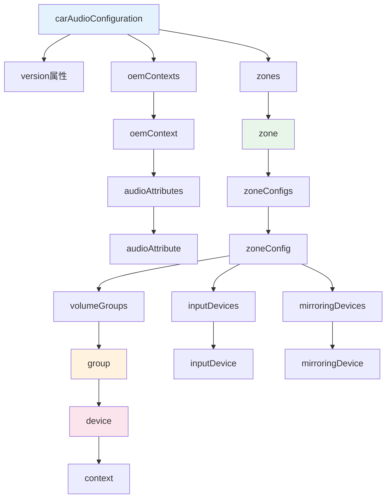
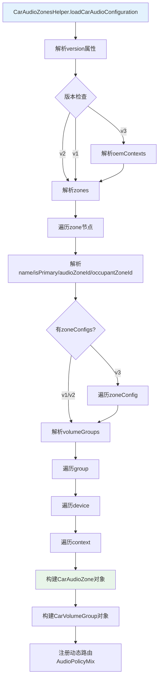
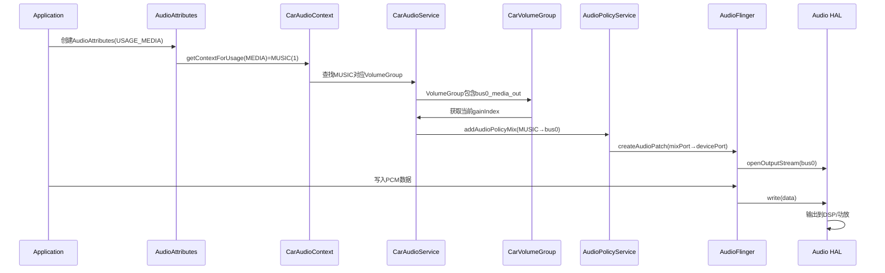

## 11.9 car_audio_configuration.xml 深度解析

> [← 上一个](11_11.8_audio_policy_configuration.xml_属性详解.md) | [← 返回11章](README.md) | [返回导航](../README.md) | [下一个 →](11_11.10_OEM定制点完整矩阵.md)

---

### 11.9.1 文档结构总览

car_audio_configuration.xml是AAOS车载音频系统的核心配置文件，定义了音频Zone、VolumeGroup、Context到Bus的映射关系。本文档基于源码对每个XML标签和属性进行方法级深度解析。



### 11.9.2 根节点 carAudioConfiguration

| 属性 | 必填 | 类型 | 说明 |
|------|------|------|------|
| version | 是 | int | 配置版本号，1/2/3 |

**版本演进**：

| 版本 | Android版本 | 关键变更 |
|------|------------|----------|
| 1 | Android 8-9 | 初始版本，基础Zone/VolumeGroup定义 |
| 2 | Android 10-11 | 增加inputDevices、mirroringDevices |
| 3 | Android 12-14 | 增加zoneConfigs多配置切换、oemContexts |

### 11.9.3 oemContexts OEM自定义上下文

oemContexts允许OEM定义额外的AudioContext，扩展系统预定义的12个Context。

```xml
<carAudioConfiguration version="3">
    <oemContexts>
        <oemContext name="OEM_TRAFFIC_ANNOUNCEMENT" id="100">
            <audioAttributes>
                <audioAttribute usage="USAGE_ASSISTANCE_NAVIGATION_GUIDANCE"
                               contentType="CONTENT_TYPE_SPEECH"
                               tags="oem=traffic_announcement"/>
            </audioAttributes>
        </oemContext>
        <oemContext name="OEM_ADAS_WARNING" id="101">
            <audioAttributes>
                <audioAttribute usage="USAGE_SAFETY"
                               contentType="CONTENT_TYPE_SONIFICATION"
                               tags="oem=adas_warning"/>
            </audioAttributes>
        </oemContext>
    </oemContexts>
</carAudioConfiguration>
```

#### 11.9.3.1 oemContext属性

| 属性 | 必填 | 类型 | 说明 |
|------|------|------|------|
| name | 是 | string | 自定义Context名称 |
| id | 是 | int | Context ID，必须>=100避免与系统冲突 |

#### 11.9.3.2 audioAttribute属性

| 属性 | 必填 | 类型 | 说明 |
|------|------|------|------|
| usage | 是 | string | AudioAttributes USAGE_* |
| contentType | 否 | string | 内容类型 CONTENT_TYPE_* |
| tags | 否 | string | 扩展标签，oem=xxx格式 |

**OEM Context约束**：
- id值必须>=100（0-99为系统保留）
- 一个oemContext可包含多个audioAttribute
- tags用于细分同Usage的不同场景

### 11.9.4 CarAudioContext 完整列表

CarAudioContext定义了车载音频上下文的语义分类，每个context对应一组AudioAttributes Usage。源码定义在[`CarAudioContext.java`](packages/services/Car/service/src/com/android/car/audio/CarAudioContext.java:50)。

#### 11.9.4.1 NON_CAR_SYSTEM_CONTEXTS（通用上下文）

| ID | 名称 | 对应AudioAttributes Usage | 优先级 |
|----|------|--------------------------|--------|
| 1 | MUSIC | USAGE_UNKNOWN, USAGE_GAME, USAGE_MEDIA | 低 |
| 2 | NAVIGATION | USAGE_ASSISTANCE_NAVIGATION_GUIDANCE | 中 |
| 3 | VOICE_COMMAND | USAGE_ASSISTANCE_ACCESSIBILITY, USAGE_ASSISTANT | 中高 |
| 4 | CALL_RING | USAGE_NOTIFICATION_RINGTONE | 高 |
| 5 | CALL | USAGE_VOICE_COMMUNICATION, USAGE_CALL_ASSISTANT, USAGE_VOICE_COMMUNICATION_SIGNALLING | 高 |
| 6 | ALARM | USAGE_ALARM | 中 |
| 7 | NOTIFICATION | USAGE_NOTIFICATION, USAGE_NOTIFICATION_EVENT | 中 |
| 8 | SYSTEM_SOUND | USAGE_ASSISTANCE_SONIFICATION | 中 |

#### 11.9.4.2 CAR_SYSTEM_CONTEXTS（车载专用上下文）

| ID | 名称 | 对应AudioAttributes Usage | 优先级 |
|----|------|--------------------------|--------|
| 9 | EMERGENCY | USAGE_EMERGENCY | 最高 |
| 10 | SAFETY | USAGE_SAFETY | 极高 |
| 11 | VEHICLE_STATUS | USAGE_VEHICLE_STATUS | 高 |
| 12 | ANNOUNCEMENT | USAGE_ANNOUNCEMENT | 中 |

#### 11.9.4.3 Duck策略矩阵

基于[`CarAudioContext.java`](packages/services/Car/service/src/com/android/car/audio/CarAudioContext.java:274)的sContextsToDuck静态表：

| 活跃Context | 被Duck的Context列表 |
|------------|---------------------|
| MUSIC | 无 |
| NAVIGATION | MUSIC, CALL_RING, CALL, ALARM, NOTIFICATION, SYSTEM_SOUND, VEHICLE_STATUS, ANNOUNCEMENT |
| VOICE_COMMAND | CALL_RING |
| CALL_RING | 无 |
| CALL | CALL_RING, ALARM, NOTIFICATION, VEHICLE_STATUS |
| ALARM | MUSIC |
| NOTIFICATION | MUSIC, ALARM, ANNOUNCEMENT |
| SYSTEM_SOUND | MUSIC, ALARM, ANNOUNCEMENT |
| EMERGENCY | CALL |
| SAFETY | MUSIC, NAVIGATION, VOICE_COMMAND, CALL_RING, CALL, ALARM, NOTIFICATION, SYSTEM_SOUND, VEHICLE_STATUS, ANNOUNCEMENT |
| VEHICLE_STATUS | MUSIC, CALL_RING, ANNOUNCEMENT |
| ANNOUNCEMENT | 无 |

**Duck策略解析**：
- EMERGENCY仅Duck CALL（碰撞警告时仅降低通话音量）
- SAFETY Duck几乎所有Context（倒车雷达优先）
- MUSIC和ANNOUNCEMENT不会被Duck（最低优先级）
- NAVIGATION Duck范围广泛（导航提示时降低媒体/铃声等）

### 11.9.5 zone 区域配置详解

zone定义一个独立的音频区域，每个Zone有独立的音量控制和焦点管理。

#### 11.9.5.1 zone属性表

| 属性 | 必填 | 类型 | 说明 |
|------|------|------|------|
| name | 是 | string | Zone显示名称 |
| audioZoneId | 条件 | int | Zone ID，非Primary Zone必填 |
| isPrimary | 否 | bool | 是否为主Zone，默认false |
| occupantZoneId | 否 | int | 绑定乘员Zone ID |

#### 11.9.5.2 isPrimary深度解析

```xml
<!-- Primary Zone：接收所有未指定Zone的音频 -->
<zone name="primary zone" isPrimary="true" occupantZoneId="0">
```

- 系统必须有且仅有一个Primary Zone
- Primary Zone的audioZoneId默认为0
- 未指定Zone的音频流自动路由到Primary Zone
- isPrimary=true时audioZoneId可省略

#### 11.9.5.3 occupantZoneId绑定

occupantZoneId将音频Zone与CarOccupantZoneService定义的乘员Zone绑定：

```xml
<!-- 主驾Zone绑定乘员Zone 0 -->
<zone name="primary zone" isPrimary="true" occupantZoneId="0">
<!-- 后排Zone绑定乘员Zone 1 -->
<zone name="rear seat zone 1" audioZoneId="1" occupantZoneId="1">
```

**用途**：
- Audio Mirroring分配依据
- 乘员登录时自动切换音频Zone
- 必须与CarOccupantZoneService的zoneId一致

### 11.9.6 zoneConfigs 多配置切换（v3新增）

zoneConfigs允许一个Zone定义多个配置，运行时可切换。

#### 11.9.6.1 zoneConfig属性表

| 属性 | 必填 | 类型 | 说明 |
|------|------|------|------|
| name | 是 | string | 配置名称，用于标识和切换 |
| isDefault | 否 | bool | 是否为默认配置 |

**v3完整示例**（[`car_emulator`](device/generic/car/emulator/audio/car_audio_configuration.xml:28)）：

```xml
<zone name="primary zone" isPrimary="true" occupantZoneId="0">
    <zoneConfigs>
        <zoneConfig name="primary zone config 0" isDefault="true">
            <volumeGroups>
                <group>
                    <device address="bus0_media_out">
                        <context context="music"/>
                        <context context="announcement"/>
                    </device>
                    <device address="bus6_notification_out">
                        <context context="notification"/>
                    </device>
                </group>
            </volumeGroups>
        </zoneConfig>
    </zoneConfigs>
</zone>
```

#### 11.9.6.2 配置切换场景

| 场景 | 切换方式 | 说明 |
|------|---------|------|
| 驾驶模式切换 | CarAudioService.switchZoneConfig() | 运动模式/舒适模式不同音量分组 |
| 乘客变化 | 乘员登录触发 | 后排有乘客时启用后排Zone配置 |
| 夜间模式 | 系统设置触发 | 夜间降低媒体音量上限 |

#### 11.9.6.3 v1/v2 vs v3格式对比

| 特性 | v1/v2 | v3 |
|------|-------|-----|
| VolumeGroup位置 | zone直接包含volumeGroups | zone→zoneConfigs→zoneConfig→volumeGroups |
| 多配置 | 不支持 | zoneConfigs支持多个zoneConfig |
| 默认配置 | 隐式唯一 | isDefault=true指定 |
| 切换API | 无 | switchZoneConfig() |

### 11.9.7 volumeGroups 音量组详解

volumeGroups将Context分组，同组共享音量设置。

#### 11.9.7.1 group属性

| 属性 | 必填 | 说明 |
|------|------|------|
| name | 否（v1/v2）/ 是（v3） | 组名称，v3中用于标识 |

#### 11.9.7.2 device节点

device定义一组Context到同一个Bus设备的映射。

| 属性 | 必填 | 说明 |
|------|------|------|
| address | 是 | Bus设备地址，必须与audio_policy_configuration.xml一致 |
| useHalAudioRouting | 否 | 是否由HAL控制路由，默认false |

**useHalAudioRouting详解**：
- false（默认）：Framework通过AudioPolicyMix将Context路由到对应Bus
- true：Framework不干预路由，由HAL自行决定音频输出路径
- AIDL模式下建议设false

#### 11.9.7.3 context节点

context声明该Bus设备承载的音频语义类型。

| 属性 | 必填 | 说明 |
|------|------|------|
| context | 是 | CarAudioContext名称（小写） |

**context两种定义位置**：

1. **组级别context**（v2常用）：context定义在group下，所有device共享
2. **设备级别context**（v3推荐）：context定义在device下，每个Bus独立指定

```xml
<!-- 设备级别context（v3推荐） -->
<group>
    <device address="bus0_media_out">
        <context context="music"/>
        <context context="announcement"/>
    </device>
    <device address="bus1_navigation_out">
        <context context="navigation"/>
    </device>
</group>
```

### 11.9.8 完整配置解析流程

CarAudioZonesHelper负责解析car_audio_configuration.xml，标签常量定义在[`CarAudioZonesHelper.java`](packages/services/Car/service/src/com/android/car/audio/CarAudioZonesHelper.java:61)。



### 11.9.9 Context→Bus→HAL端到端路由链



### 11.9.10 inputDevices 输入设备绑定

inputDevices定义Zone的音频输入设备（v2+）。

```xml
<zoneConfig name="primary zone config 0" isDefault="true">
    <volumeGroups>...</volumeGroups>
    <inputDevices>
        <inputDevice address="Built-In Mic"/>
        <inputDevice address="Built-In Back Mic"/>
    </inputDevices>
</zoneConfig>
```

| 属性 | 必填 | 说明 |
|------|------|------|
| address | 是 | 输入设备地址，与devicePort tagName匹配 |

**约束**：
- 每个输入设备只能绑定到一个Zone
- 输入设备必须是在audio_policy_configuration.xml中定义的source设备
- Zone的输入设备在焦点管理中参与录音焦点仲裁

### 11.9.11 mirroringDevices 镜像设备

mirroringDevices定义音频镜像输出设备（v2+）。

```xml
<zoneConfig name="primary zone config 0" isDefault="true">
    <volumeGroups>...</volumeGroups>
    <mirroringDevices>
        <mirroringDevice address="bus1000_mirror_device"/>
    </mirroringDevices>
</zoneConfig>
```

**Audio Mirroring功能**：
- 将一个Zone的音频输出复制到镜像设备
- 用于后排耳机收听主Zone音频
- 镜像设备不参与焦点管理
- 镜像设备必须有对应的devicePort和gains配置

### 11.9.12 v3完整配置示例

基于[`car_emulator`](device/generic/car/emulator/audio/car_audio_configuration.xml)的实际配置：

```xml
<carAudioConfiguration version="3">
    <zones>
        <!-- Primary Zone: 主驾 -->
        <zone name="primary zone" isPrimary="true" occupantZoneId="0">
            <zoneConfigs>
                <zoneConfig name="primary zone config 0" isDefault="true">
                    <volumeGroups>
                        <!-- 组1: 媒体+通知 -->
                        <group>
                            <device address="bus0_media_out">
                                <context context="music"/>
                                <context context="announcement"/>
                            </device>
                            <device address="bus6_notification_out">
                                <context context="notification"/>
                            </device>
                        </group>
                        <!-- 组2: 导航+语音 -->
                        <group>
                            <device address="bus1_navigation_out">
                                <context context="navigation"/>
                            </device>
                            <device address="bus2_voice_command_out">
                                <context context="voice_command"/>
                            </device>
                        </group>
                        <!-- 组3: 通话 -->
                        <group>
                            <device address="bus4_call_out">
                                <context context="call"/>
                            </device>
                            <device address="bus3_call_ring_out">
                                <context context="call_ring"/>
                            </device>
                        </group>
                        <!-- 组4: 告警+系统+安全 -->
                        <group>
                            <device address="bus5_alarm_out">
                                <context context="alarm"/>
                            </device>
                            <device address="bus7_system_sound_out">
                                <context context="system_sound"/>
                                <context context="emergency"/>
                                <context context="safety"/>
                                <context context="vehicle_status"/>
                            </device>
                        </group>
                    </volumeGroups>
                </zoneConfig>
            </zoneConfigs>
        </zone>

        <!-- Zone 1: 后排左 -->
        <zone name="rear seat zone 1" audioZoneId="1">
            <zoneConfigs>
                <zoneConfig name="rear seat zone 1 config 0" isDefault="true">
                    <volumeGroups>
                        <group>
                            <device address="bus100_audio_zone_1">
                                <context context="music"/>
                            </device>
                        </group>
                    </volumeGroups>
                </zoneConfig>
            </zoneConfigs>
        </zone>
    </zones>
</carAudioConfiguration>
```

### 11.9.13 两个XML文件配合约束

car_audio_configuration.xml与audio_policy_configuration.xml必须严格配合：

| 约束项 | 说明 | 错误后果 |
|--------|------|---------|
| address匹配 | car_audio_configuration的device address必须与devicePort的address一致 | 路由失败，无声音 |
| Bus数量一致 | car_audio_configuration引用的Bus必须在devicePort中定义 | 解析异常 |
| gains必须配置 | 被car_audio引用的Bus设备必须有gains且useForVolume=true | 音量不可控 |
| mixPort映射 | 每个Bus设备的route必须指向正确的mixPort | 音频无法输出 |
| attachedDevices | Bus设备必须在attachedDevices中声明 | 设备不可见 |

### 11.9.14 CarAudioContext与AudioProductStrategy映射

Car端有两种路由模式，由[`CarAudioContext`](packages/services/Car/service/src/com/android/car/audio/CarAudioContext.java:374)的mUseCoreAudioRouting控制：

| 路由模式 | 实现方式 | Context映射 |
|---------|---------|------------|
| 传统模式(useCoreAudioRouting=false) | CarAudioService通过AudioPolicyMix直接路由 | CarAudioContext→Bus直接映射 |
| 核心路由模式(useCoreAudioRouting=true) | 依赖AudioProductStrategy路由 | CarAudioContext→Strategy→Bus映射 |

**核心路由模式**：
- 基于audio_policy_engine_configuration.xml的ProductStrategy定义
- CarAudioContext的id直接对应Strategy的id
- OEM扩展Context需要通过mOemExtensionContexts标记

### 11.9.15 VolumeGroup分组设计原则

```
VolumeGroup分组决策树：
├── 是否需要独立音量控制？
│   ├── 是 → 独立VolumeGroup
│   └── 否 → 可合并到同组
├── 音量范围是否不同？
│   ├── 是 → 独立VolumeGroup
│   └── 否 → 可合并到同组
├── 是否有Duck关系？
│   ├── 是 → Duck方和被Duck方可同组
│   └── 否 → 按功能分组
└── 安全优先级
    ├── EMERGENCY/SAFETY → 独立组或与SYSTEM_SOUND同组
    └── 其他 → 按用户体验分组
```

**典型4组方案**（如car_emulator）：

| 组 | 包含Context | 设计理由 |
|----|-----------|---------|
| 组1 | MUSIC, ANNOUNCEMENT, NOTIFICATION | 媒体类共享音量 |
| 组2 | NAVIGATION, VOICE_COMMAND | 语音提示类共享音量 |
| 组3 | CALL, CALL_RING | 通话类共享音量 |
| 组4 | ALARM, SYSTEM_SOUND, EMERGENCY, SAFETY, VEHICLE_STATUS | 系统/安全类共享音量 |

### 11.9.16 CarAudioZonesHelper标签常量映射

[`CarAudioZonesHelper.java`](packages/services/Car/service/src/com/android/car/audio/CarAudioZonesHelper.java:63)定义的XML标签常量：

| 常量 | 值 | 对应XML标签 |
|------|-----|-----------|
| TAG_ROOT | carAudioConfiguration | 根节点 |
| TAG_OEM_CONTEXTS | oemContexts | OEM Context容器 |
| TAG_OEM_CONTEXT | oemContext | OEM Context项 |
| TAG_AUDIO_ZONES | zones | Zone容器 |
| TAG_AUDIO_ZONE | zone | Zone项 |
| TAG_AUDIO_ZONE_CONFIGS | zoneConfigs | Zone配置容器 |
| TAG_AUDIO_ZONE_CONFIG | zoneConfig | Zone配置项 |
| TAG_VOLUME_GROUPS | volumeGroups | 音量组容器 |
| TAG_VOLUME_GROUP | group | 音量组项 |
| TAG_AUDIO_DEVICE | device | 设备项 |
| TAG_CONTEXT | context | 上下文项 |
| TAG_INPUT_DEVICES | inputDevices | 输入设备容器 |
| TAG_INPUT_DEVICE | inputDevice | 输入设备项 |
| TAG_MIRRORING_DEVICES | mirroringDevices | 镜像设备容器 |
| TAG_MIRRORING_DEVICE | mirroringDevice | 镜像设备项 |

| 属性常量 | 值 | 对应XML属性 |
|---------|-----|-----------|
| ATTR_VERSION | version | 版本号 |
| ATTR_IS_PRIMARY | isPrimary | 是否主Zone |
| ATTR_IS_CONFIG_DEFAULT | isDefault | 是否默认配置 |
| ATTR_ZONE_NAME | name | Zone名称 |
| ATTR_DEVICE_ADDRESS | address | 设备地址 |
| ATTR_CONTEXT_NAME | context | Context名称 |
| ATTR_ZONE_ID | audioZoneId | Zone ID |
| ATTR_OCCUPANT_ZONE_ID | occupantZoneId | 乘员Zone ID |

### 11.9.17 验证与调试命令

| 命令 | 用途 |
|------|------|
| dumpsys audio \| grep CarAudio | 查看CarAudioService配置 |
| dumpsys audio \| grep VolumeGroup | 查看VolumeGroup映射 |
| dumpsys audio \| grep Zone | 查看Zone配置 |
| dumpsys media.audio_policy \| grep BUS | 验证Bus设备枚举 |
| adb logcat -s CarAudioService | 查看CarAudio日志 |
| adb logcat -s CarAudioZonesHelper | 查看解析日志 |

---

[← 上一个](11_11.8_audio_policy_configuration.xml_属性详解.md) | [← 返回11章](README.md) | [返回导航](../README.md) | [下一个 →](11_11.10_OEM定制点完整矩阵.md)