# 第十二篇：Audio Focus 深度解析

> [← 上一篇：Vendor Layer](11_Vendor_Layer.md) | [返回导航](README.md) | [下一篇：Volume & Device →](13_Volume_Device_Deep_Dive.md)

---

Audio Focus是Android音频系统最核心的协调机制。本篇从状态机模型、全栈调用链、框架执行机制、AAOS交互矩阵四个维度深度解析焦点系统。

## 12.1 Focus栈模型与核心数据结构

Android音频焦点采用**栈模型**管理，最新请求者位于栈顶持有焦点。

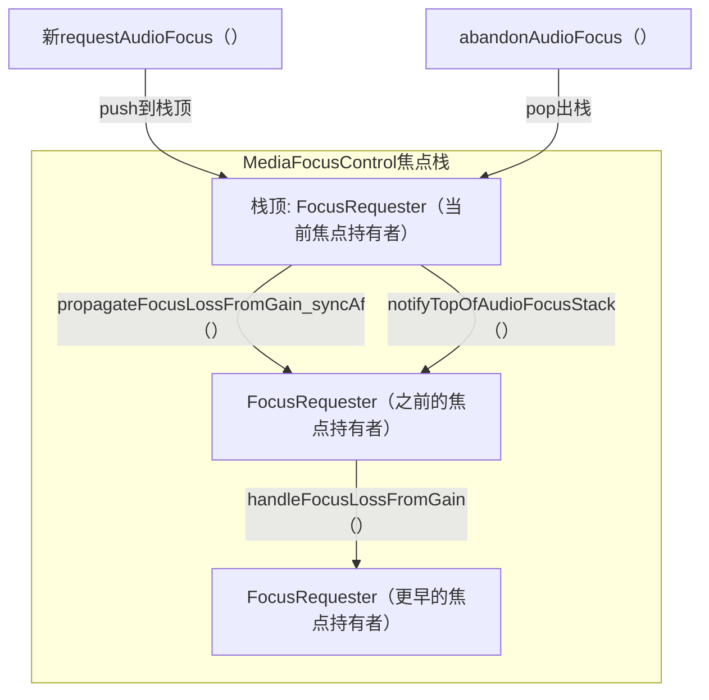

**核心数据结构**（源码: [`MediaFocusControl.java`](frameworks/base/services/core/java/com/android/server/audio/MediaFocusControl.java)）

| 字段 | 类型 | 说明 |
|------|------|------|
| `mFocusStack` | `Stack<FocusRequester>` | 焦点栈，栈顶为当前焦点持有者 |
| `mMultiAudioFocusList` | `ArrayList<FocusRequester>` | 多焦点模式列表(AAOS启用) |
| `mFocusPolicy` | `AudioPolicy` | 外部焦点策略(如AAOS AudioPolicy) |
| `mRingOrCallActive` | `boolean` | 来电/通话焦点是否活跃 |
| `mAudioFocusLock` | `Object` | 焦点操作同步锁 |

**FocusRequester关键字段**（源码: [`FocusRequester.java`](frameworks/base/services/core/java/com/android/server/audio/FocusRequester.java:39)）

| 字段 | 类型 | 说明 |
|------|------|------|
| `mFocusGainRequest` | `int` | 请求的焦点类型(GAIN/GAIN_TRANSIENT/GAIN_TRANSIENT_MAY_DUCK) |
| `mGrantFlags` | `int` | 授予标志(DELAY_OK/LOCK/PAUSES_ON_DUCKABLE_LOSS) |
| `mFocusLossReceived` | `int` | 当前收到的焦点丢失类型 |
| `mFocusLossWasNotified` | `boolean` | 焦点丢失是否已通知 |
| `mFocusLossFadeLimbo` | `boolean` | 是否在淡出"悬停"状态(已失焦但未释放) |
| `mAttributes` | `AudioAttributes` | 请求的音频属性(Usage/ContentType) |

## 12.2 完整焦点状态机（含Fade Limbo状态）

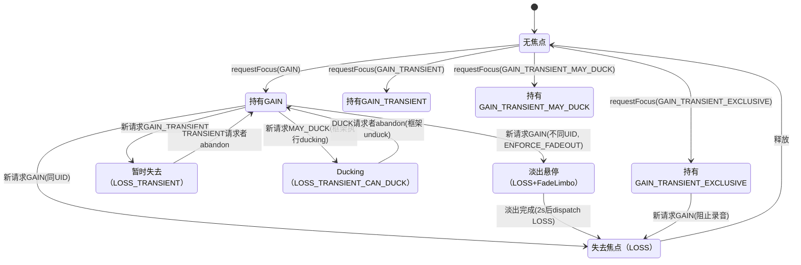

## 12.3 requestAudioFocus()完整流程

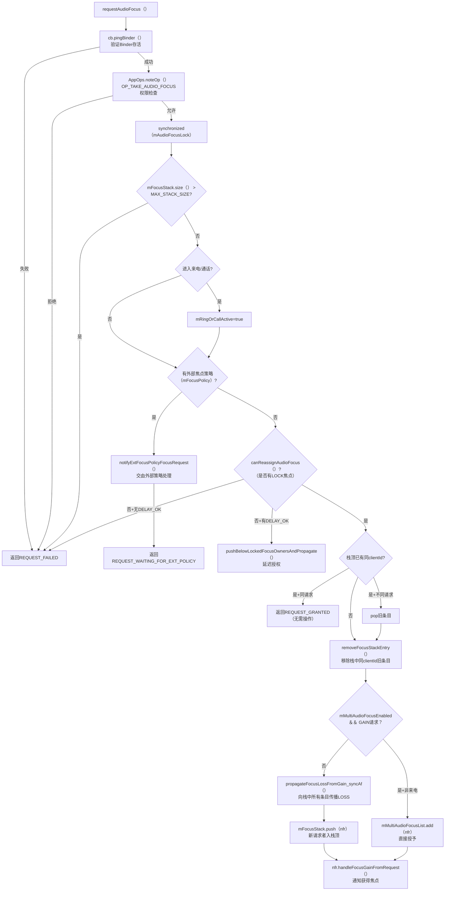

**关键源码位置**：[`MediaFocusControl.requestAudioFocus()`](frameworks/base/services/core/java/com/android/server/audio/MediaFocusControl.java:952)

## 12.4 焦点Loss传播与Loss类型映射

焦点Loss类型由**请求者的Gain类型**和**当前Loss状态**共同决定。核心映射函数 [`focusLossForGainRequest()`](frameworks/base/services/core/java/com/android/server/audio/FocusRequester.java:267):

| 新请求Gain类型 | 当前Loss状态 | 产生的Loss类型 |
|----------------|-------------|---------------|
| GAIN | NONE/LOSS/LOSS_TRANSIENT/LOSS_TRANSIENT_CAN_DUCK | **LOSS**(永久) |
| GAIN_TRANSIENT | NONE/LOSS_TRANSIENT_CAN_DUCK/LOSS_TRANSIENT | **LOSS_TRANSIENT**(临时) |
| GAIN_TRANSIENT | LOSS | **LOSS**(已是永久，不降级) |
| GAIN_TRANSIENT_MAY_DUCK | NONE/LOSS_TRANSIENT_CAN_DUCK | **LOSS_TRANSIENT_CAN_DUCK**(可Duck) |
| GAIN_TRANSIENT_MAY_DUCK | LOSS_TRANSIENT | **LOSS_TRANSIENT**(已升级，不降级) |
| GAIN_TRANSIENT_MAY_DUCK | LOSS | **LOSS**(已永久，不降级) |

> **关键原则**：焦点Loss只能**升级**（DUCK→TRANSIENT→LOSS），不会**降级**。即如果已经收到LOSS，不会再收到LOSS_TRANSIENT。

## 12.5 框架级焦点执行机制

Android 14框架不再仅依赖App自行响应焦点变化，而是**主动执行**ducking/fadeout/muting：

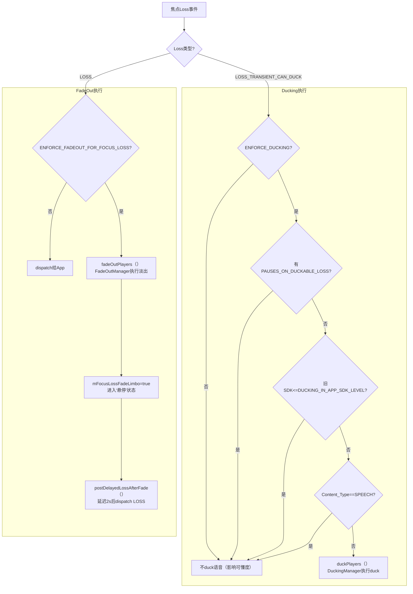

**DuckingManager执行流程**（源码: [`PlaybackActivityMonitor.duckPlayers()`](frameworks/base/services/core/java/com/android/server/audio/PlaybackActivityMonitor.java:762)）

1. 遍历`mPlayers`，找到与loser同UID且正在播放(PLAYER_STATE_STARTED)的播放器
2. 排除不可Duck的播放器:
   - `CONTENT_TYPE_SPEECH` → 不duck语音（影响可懂度）
   - `UNDUCKABLE_PLAYER_TYPES` → 不duck某些播放器类型
3. `mDuckingManager.duckUid()` → 调用`PlayerProxy.setVolume()`降低音量
4. 强Duck(Strong Duck): USAGE_ASSISTANCE请求者会触发更低的duck音量

**FadeOutManager执行流程**（源码: [`FadeOutManager`](frameworks/base/services/core/java/com/android/server/audio/FadeOutManager.java:36)）

1. 使用VolumeShaper执行2秒淡出曲线: `1.0→0.65→0.0`
2. 不可淡出的类型: SPEECH内容/AAUDIO/JAM_SOUNDPOOL播放器
3. 可淡出的Usage: USAGE_GAME/USAGE_MEDIA
4. 淡出完成后进入**Limbo状态**，2s后dispatch LOSS给App

## 12.6 AAOS焦点交互矩阵

```
              请求者 →
持有者 ↓       | EMERGENCY | SAFETY  | CALL    | NAV     | MUSIC   | NOTIF   | SYSTEM  |
EMERGENCY     | CONCURRENT| CONCUR  | CONCUR  | CONCUR  | CONCUR  | CONCUR  | CONCUR  |
SAFETY        | CONCURRENT| CONCUR  | EXCLUSIVE| CONCUR | CONCUR  | CONCUR  | CONCUR  |
CALL          | CONCURRENT| EXCLUSIVE| EXCLUSIVE| REJECT | EXCLUSIVE| REJECT | REJECT  |
NAVIGATION    | CONCURRENT| CONCUR  | EXCLUSIVE| CONCUR  | CONCUR  | CONCUR  | CONCUR  |
MUSIC         | CONCURRENT| CONCUR  | EXCLUSIVE| CONCUR  | CONCUR  | CONCUR  | CONCUR  |
NOTIFICATION  | CONCURRENT| CONCUR  | EXCLUSIVE| CONCUR  | CONCUR  | CONCUR  | CONCUR  |
SYSTEM_SOUND  | CONCURRENT| CONCUR  | EXCLUSIVE| CONCUR  | CONCUR  | CONCUR  | CONCUR  |
```

| 交互结果 | 含义 | 行为 |
|----------|------|------|
| CONCURRENT | 并发播放 | 新请求者获得焦点，持有者被Duck |
| EXCLUSIVE | 独占 | 新请求者获得焦点，持有者失去焦点 |
| REJECT | 拒绝 | 新请求被拒绝，持有者保持焦点 |

> **关键规则**: EMERGENCY始终CONCURRENT(最高优先级)；CALL对NAV/NOTIF/SYSTEM执行REJECT(通话期间拒绝非关键音频)

## 12.7 abandonAudioFocus()流程

```mermaid
sequenceDiagram
    participant App, AMC as MediaFocusControl, Stack as FocusStack, Top as 新栈顶
    App->>AMC: abandonAudioFocus(clientId)
    AMC->>AMC: synchronized(mAudioFocusLock)
    AMC->>Stack: 遍历查找clientId
    AMC->>Stack: remove(found entry)
    AMC->>Stack: release() 旧条目(解绑Binder death)
    AMC->>AMC: mRingOrCallActive判断(来电焦点退出)
    AMC->>Top: notifyTopOfAudioFocusStack()
    Top->>Top: handleFocusGain(AUDIOFOCUS_GAIN)
    Top->>Top: mFocusLossReceived = NONE
    Top->>Top: restoreVShapedPlayers()<br>恢复被duck/fadeout的播放器
    AMC-->>App: 返回AUDIOFOCUS_REQUEST_GRANTED
```

## 12.8 Audio Focus全栈调用链

### 标准Android焦点链路

```mermaid
sequenceDiagram
    participant App1, App2, AM, AS, MFC
    App1->>AM: requestAudioFocus(GAIN)
    AM->>AS: requestAudioFocus() [Binder]
    AS->>MFC: requestAudioFocus()
    MFC->>MFC: 创建FocusRequester → 入栈
    MFC-->>App1: AUDIOFOCUS_REQUEST_GRANTED
    App2->>AM: requestAudioFocus(GAIN)
    AM->>AS: requestAudioFocus()
    AS->>MFC: requestAudioFocus()
    MFC->>MFC: App1出栈 → LOSS通知
    MFC-->>App1: AUDIOFOCUS_LOSS
    MFC-->>App2: AUDIOFOCUS_REQUEST_GRANTED
```

### AAOS焦点链路

```mermaid
sequenceDiagram
    participant App, AS, MFC, CarAF, FI, ACW, HAL
    App->>AS: requestAudioFocus(GAIN)
    AS->>MFC: requestAudioFocus()
    MFC->>MFC: 检测外部AudioPolicy
    MFC->>CarAF: onAudioFocusRequest(afi)
    CarAF->>FI: evaluateAgainstFocusHoldersLocked()
    FI-->>CarAF: INTERACTION_CONCURRENT
    CarAF->>ACW: onAudioFocusChange(zone, FOCUS_GAIN)
    ACW->>HAL: IAudioControl.onAudioFocusChange() [AIDL]
    CarAF-->>MFC: setFocusRequestResult(GRANTED)
    MFC-->>App: AUDIOFOCUS_REQUEST_GRANTED
```

## 12.9 通话Muting机制

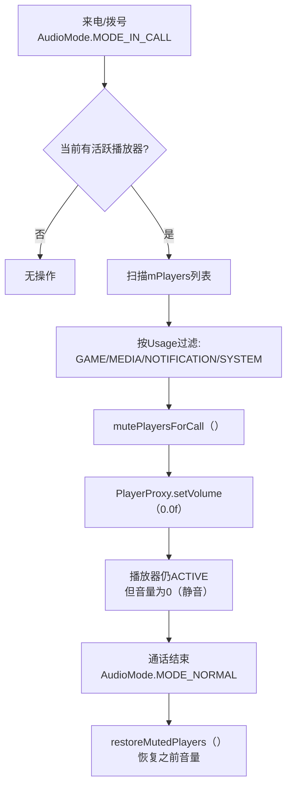

> **通话Muting vs Ducking**: 通话期间直接Mute到0（而非Duck到-20dB），这是设计决策——通话时其他音频完全静音，避免干扰通话质量。

---

## 12.10 FadeOutManager深度解析

AOSP14新增的**框架级FadeOut执行器**，在焦点永久丢失(LOSS)时对播放器执行平滑淡出而非瞬间静音，提供更好的用户体验。

**源码**: [`FadeOutManager.java`](frameworks/base/services/core/java/com/android/server/audio/FadeOutManager.java:36)

### 12.10.1 核心常量与VolumeShaper曲线

| 常量 | 值 | 说明 |
|------|------|------|
| `FADE_OUT_DURATION_MS` | 2000ms | 淡出曲线持续时间 |
| `DELAY_FADE_IN_OFFENDERS_MS` | 2000ms | 违规App回淡延迟（不遵守焦点Loss的App在淡出后延迟2s再fade in） |
| `FADEOUT_VSHAPE` | times={0, 0.25, 1.0}, volumes={1, 0.65, 0.0} | 淡出VolumeShaper曲线 |

**VolumeShaper曲线详解**（源码: [`FadeOutManager.java:53`](frameworks/base/services/core/java/com/android/server/audio/FadeOutManager.java:53)）：

```
时间轴(ms):    0       500      2000
               │        │         │
音量曲线:    1.0 ──→ 0.65 ──→ 0.0
               │    快速下降    缓慢归零
               │   (前25%时间)  (后75%时间)
```

- 前25%时间(0→500ms)：音量从1.0快速降至0.65，用户立即感知音量降低
- 后75%时间(500→2000ms)：音量从0.65缓慢降至0.0，平滑过渡到静音
- 使用`OPTION_FLAG_CLOCK_TIME`确保基于挂钟时间而非系统时间执行

### 12.10.2 Fade决策逻辑

**canCauseFadeOut()判断**（源码: [`FadeOutManager.java:93`](frameworks/base/services/core/java/com/android/server/audio/FadeOutManager.java:93)）——决定**焦点请求者**是否会触发淡出：

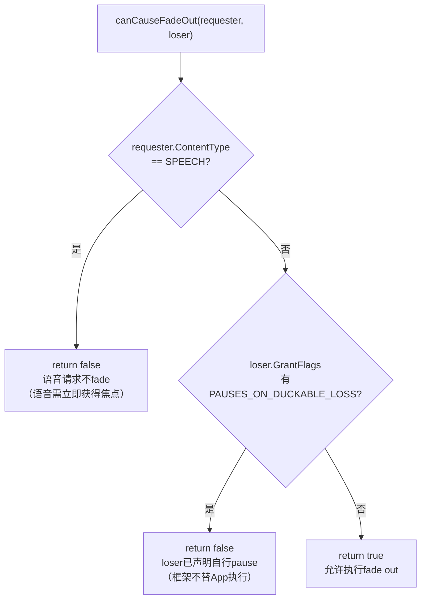

**canBeFadedOut()判断**（源码: [`FadeOutManager.java:113`](frameworks/base/services/core/java/com/android/server/audio/FadeOutManager.java:113)）——决定**焦点丢失者的播放器**是否可被淡出：

| 过滤维度 | 条件 | 值 | 原因 |
|----------|------|------|------|
| 播放器类型 | `UNFADEABLE_PLAYER_TYPES` | PLAYER_TYPE_AAUDIO, PLAYER_TYPE_JAM_SOUNDPOOL | AAudio低延迟通道不支持VolumeShaper；SoundPool为短音效无需淡出 |
| 内容类型 | `UNFADEABLE_CONTENT_TYPES` | CONTENT_TYPE_SPEECH | 语音淡出会降低可懂度，必须立即静音或暂停 |
| Usage | `FADEABLE_USAGES` | USAGE_GAME, USAGE_MEDIA | 只有媒体/游戏类Usage允许淡出 |

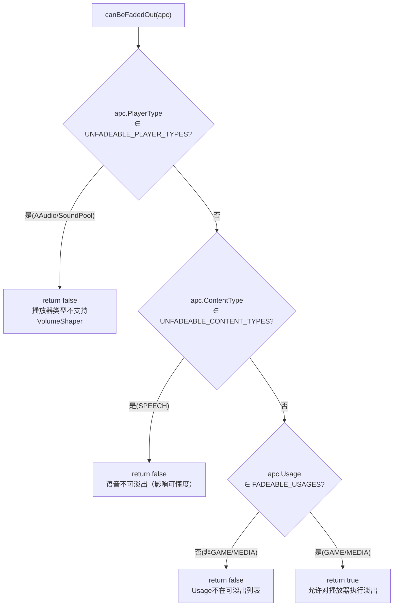

### 12.10.3 FadeOut执行流程

**FadedOutApp内部类**（源码: [`FadeOutManager.java:216`](frameworks/base/services/core/java/com/android/server/audio/FadeOutManager.java:216)）：每个UID对应一个`FadedOutApp`实例，维护被淡出的播放器piid列表。

核心方法：
- [`fadeOutUid()`](frameworks/base/services/core/java/com/android/server/audio/FadeOutManager.java:150)：为UID创建FadedOutApp，遍历播放器调用`addFade(apc, false)`
- [`addFade()`](frameworks/base/services/core/java/com/android/server/audio/FadeOutManager.java:239)：通过`PlayerProxy.applyVolumeShaper(FADEOUT_VSHAPE, PLAY_CREATE_IF_NEEDED)`执行淡出
- [`unfadeOutUid()`](frameworks/base/services/core/java/com/android/server/audio/FadeOutManager.java:166)：通过`VolumeShaper.Operation.REVERSE`执行反向淡入恢复
- [`checkFade()`](frameworks/base/services/core/java/com/android/server/audio/FadeOutManager.java:177)：新播放器启动时检查其UID是否在被淡出列表中，若在则立即应用淡出（skipRamp=true）

### 12.10.4 DELAY_FADE_IN_OFFENDERS_MS回淡逻辑

当App不遵守焦点Loss（收到LOSS通知后仍继续播放），框架执行fadeout使其静音。当焦点恢复时，该App不会立即恢复音量，而是：

1. 等待`DELAY_FADE_IN_OFFENDERS_MS=2000ms`延迟
2. 再执行fade in（反向VolumeShaper）
3. 给App 2秒时间来响应`AUDIOFOCUS_GAIN`回调并自行调整音量

这个机制防止"违规App"比"守法App"更快恢复播放，确保焦点系统的公平性。

### 12.10.5 三种焦点执行路径对比

| 维度 | 框架Fade | App回调 | DSP Ducking |
|------|----------|---------|-------------|
| **触发条件** | LOSS + ENFORCE_FADEOUT_FOR_FOCUS_LOSS=true | 任何焦点Loss通知 | AAOS路径：AudioControl HAL下发 |
| **执行方式** | VolumeShaper曲线（2s淡出） | App自行pause/降低音量 | DSP硬件级音量衰减 |
| **延迟** | 2s淡出 + 2s延迟回淡 | App自行决定 | 几乎零延迟 |
| **适用对象** | GAME/MEDIA Usage的播放器 | 所有App | 所有音频流 |
| **音量精度** | 曲线控制（1.0→0.65→0.0） | App自行控制 | 硬件精度 |
| **可靠性** | 框架强制执行，App无法逃避 | 依赖App遵守回调 | HAL强制执行 |
| **适用场景** | 永久焦点Loss(不同UID) | 临时焦点Loss | AAOS车载区域Duck |

> **设计哲学**: 框架fade是Android 14对"流氓App"的应对——不遵守焦点Loss的App会被框架强制淡出，而不是等待App自行响应。

## 12.11 PlaybackActivityMonitor Duck执行深度

`PlaybackActivityMonitor`是框架级ducking/muting/fadeout的**核心执行器**，实现了`PlayerFocusEnforcer`接口，通过VolumeShaper精确控制播放器音量。

**源码**: [`PlaybackActivityMonitor.java`](frameworks/base/services/core/java/com/android/server/audio/PlaybackActivityMonitor.java:76)

### 12.11.1 四种VolumeShaper配置

| VolumeShaper | ID | 曲线(times→volumes) | 衰减量 | 用途 |
|--------------|------|---------------------|--------|------|
| **DUCK_VSHAPE** | 1 | {0,1}→{1, 0.2} | -14dB | 标准Duck（通知/铃声叠加时） |
| **STRONG_DUCK_VSHAPE** | 4 | {0,1}→{1, 0.017783} | -35dB | 强Duck（USAGE_ASSISTANT请求时） |
| **FADEOUT_VSHAPE** | 2 | {0,0.25,1}→{1,0.65,0} | →0 | 淡出（永久Loss时，由FadeOutManager管理） |
| **MUTE_AWAIT_CONNECTION_VSHAPE** | 3 | {0,1}→{1, 0} | 完全静音 | 蓝牙设备连接等待（临时mute） |

**源码位置**:
- [`DUCK_VSHAPE`](frameworks/base/services/core/java/com/android/server/audio/PlaybackActivityMonitor.java:88): 标准-14dB duck
- [`STRONG_DUCK_VSHAPE`](frameworks/base/services/core/java/com/android/server/audio/PlaybackActivityMonitor.java:103): 强-35dB duck
- [`MUTE_AWAIT_CONNECTION_VSHAPE`](frameworks/base/services/core/java/com/android/server/audio/PlaybackActivityMonitor.java:123): 连接等待静音

### 12.11.2 duckPlayers()实现

**源码**: [`PlaybackActivityMonitor.duckPlayers()`](frameworks/base/services/core/java/com/android/server/audio/PlaybackActivityMonitor.java:762)

执行逻辑：
1. 遍历`mPlayers`，筛选与loser同UID且PLAYER_STATE_STARTED的播放器
2. 排除不可Duck的播放器:
   - `CONTENT_TYPE_SPEECH` → 不duck语音（除非forceDuck=true）
   - `UNDUCKABLE_PLAYER_TYPES` → 不duck AAudio/JamSoundPool
3. 调用`mDuckingManager.duckUid(uid, apcsToDuck, reqCausesStrongDuck(winner))`
4. [`reqCausesStrongDuck()`](frameworks/base/services/core/java/com/android/server/audio/PlaybackActivityMonitor.java:810)判断：winner的Usage为USAGE_ASSISTANT时触发强Duck

### 12.11.3 Duck vs Strong Duck对比

| 维度 | DUCK_VSHAPE | STRONG_DUCK_VSHAPE |
|------|-------------|---------------------|
| **衰减量** | -14dB (0.2倍) | -35dB (0.017783倍) |
| **触发条件** | 一般MAY_DUCK请求 | USAGE_ASSISTANT请求(语音助手) |
| **音量倍率** | 原音量的20% | 原音量的1.8% |
| **unduck恢复** | `DUCK_ID` + REVERSE | `STRONG_DUCK_ID` + REVERSE |
| **设计意图** | 通知/铃声叠加时降低背景音 | 语音助手激活时几乎静音其他音频 |

### 12.11.4 MuteAwaitConnection机制

**源码**: [`PlaybackActivityMonitor.muteAwaitConnection()`](frameworks/base/services/core/java/com/android/server/audio/PlaybackActivityMonitor.java:1421)

当蓝牙音频设备正在连接但尚未就绪时，框架临时mute特定Usage的播放器，避免音频通过扬声器泄露：

1. 收到`muteAwaitConnection(usages, device, timeOutMs)`请求
2. 对指定Usage的活跃播放器应用`MUTE_AWAIT_CONNECTION_VSHAPE`（使用PLAY_SKIP_RAMP直接跳到静音端）
3. 设定超时定时器`MSG_L_TIMEOUT_MUTE_AWAIT_CONNECTION`
4. 蓝牙设备连接就绪后，通过`VolumeShaper.Operation.REVERSE`恢复音量（100ms渐入）
5. 超时未连接则强制恢复音量，放弃等待

### 12.11.5 PlaybackActivityMonitor类关系

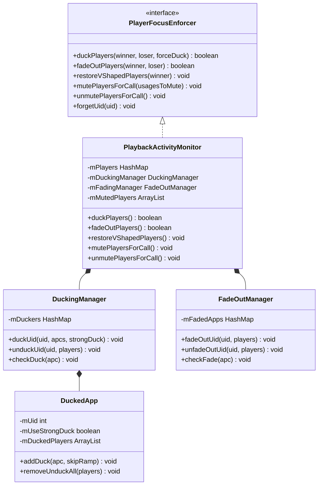

### 12.11.6 Duck执行链路时序图

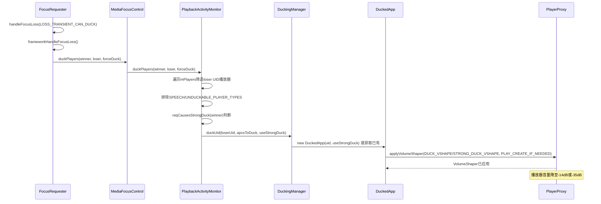

## 12.12 FocusRequester内部机制

`FocusRequester`是焦点栈中每个条目的**封装对象**，记录焦点请求者的全部信息，并负责焦点Loss/Gain的分发与框架级执行决策。

**源码**: [`FocusRequester.java`](frameworks/base/services/core/java/com/android/server/audio/FocusRequester.java:39)

### 12.12.1 核心字段详解

| 字段 | 类型 | 初始值 | 说明 |
|------|------|--------|------|
| `mClientId` | `String` | 构造传入 | 客户端唯一标识，用于栈中查找/移除 |
| `mPackageName` | `String` | 构造传入 | 请求者包名，用于权限检查和日志 |
| `mCallingUid` | `int` | 构造传入 | 请求者UID，用于duck/fade/mute的播放器匹配 |
| `mAttributes` | `AudioAttributes` | 构造传入 | 请求的音频属性(Usage/ContentType)，决定duck/fade是否适用 |
| `mFocusGainRequest` | `int` | 构造传入 | 请求的焦点类型(GAIN/GAIN_TRANSIENT/MAY_DUCK等) |
| `mGrantFlags` | `int` | 构造传入 | 授予标志(DELAY_OK/LOCK/PAUSES_ON_DUCKABLE_LOSS) |
| `mFocusLossReceived` | `int` | AUDIOFOCUS_NONE | 当前收到的焦点丢失类型 |
| `mFocusLossWasNotified` | `boolean` | true | 焦点丢失是否已通知给App |
| `mFocusLossFadeLimbo` | `boolean` | false | 是否在淡出"悬停"状态(已失焦但未释放) |
| `mFocusDispatcher` | `IAudioFocusDispatcher` | 构造传入 | Binder回调接口，用于向App分发焦点变化 |
| `mDeathHandler` | `AudioFocusDeathHandler` | 构造传入 | Binder死亡监控，App进程死亡时自动清理焦点 |
| `mSdkTarget` | `int` | 构造传入 | App的targetSdkVersion，决定duck/fade策略 |

**源码位置**: [`FocusRequester构造函数`](frameworks/base/services/core/java/com/android/server/audio/FocusRequester.java:95)

### 12.12.2 handleFocusLoss()分发逻辑

**源码**: [`FocusRequester.handleFocusLoss()`](frameworks/base/services/core/java/com/android/server/audio/FocusRequester.java:369)

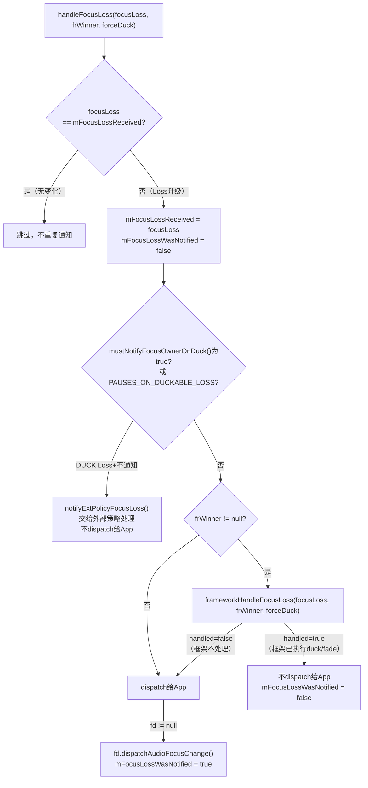

**frameworkHandleFocusLoss()决策**（源码: [`FocusRequester.java:435`](frameworks/base/services/core/java/com/android/server/audio/FocusRequester.java:435)）：

| Loss类型 | 框架行为 | 条件 |
|----------|----------|------|
| LOSS_TRANSIENT_CAN_DUCK | 执行duck | ENFORCE_DUCKING=true 且非PAUSES_ON_DUCKABLE_LOSS 且新SDK |
| LOSS | 执行fadeout | ENFORCE_FADEOUT_FOR_FOCUS_LOSS=true 且canCauseFadeOut且canBeFadedOut |
| LOSS_TRANSIENT | 不执行框架操作 | 交给App自行处理 |

**关键: 同UID焦点变化不触发框架执行**——如果winner和loser属于同一UID，`frameworkHandleFocusLoss()`直接返回false，让App自行处理。

### 12.12.3 FocusRequester生命周期

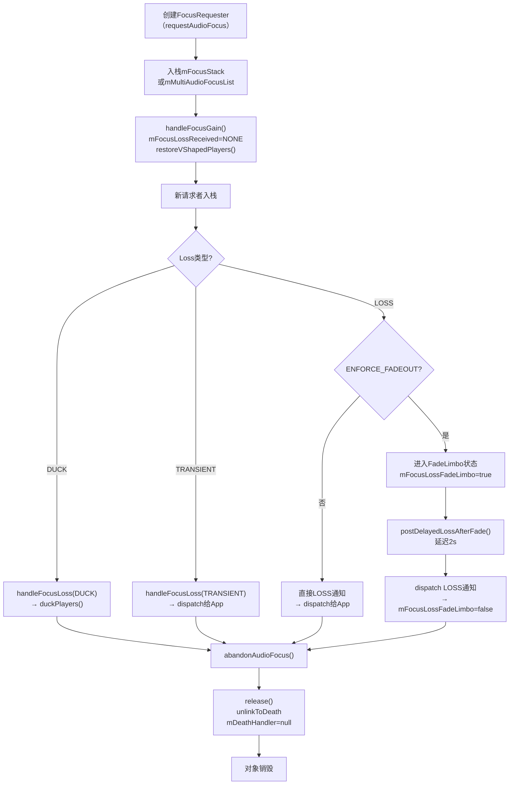

> **Limbo状态关键**: 当FocusRequester处于FadeLimbo时，`maybeRelease()`不会调用`release()`——因为焦点Loss通知还未dispatch给App，需要保留FocusRequester直到fadeout完成。

## 12.13 多用户焦点隔离

Android音频焦点系统在多用户环境下通过**UID隔离**和**多焦点模式**确保用户间焦点独立性。

### 12.13.1 多用户焦点隔离原理

Android焦点系统通过以下机制实现用户间隔离：

1. **UID匹配**: duck/fade/mute操作仅作用于与loser同UID的播放器，不同用户的App拥有不同UID，天然隔离
2. **焦点栈全局共享**: `mFocusStack`是全局单栈，但焦点请求通过`mCallingUid`区分用户
3. **多焦点模式(AAOS)**: `mMultiAudioFocusEnabled`启用后，允许多个播放器同时持有焦点

**源码**: [`MediaFocusControl.java`](frameworks/base/services/core/java/com/android/server/audio/MediaFocusControl.java:97)

| 隔离维度 | 标准Android | AAOS |
|----------|-------------|------|
| 焦点栈 | 全局单栈mFocusStack | 单栈 + mMultiAudioFocusList |
| UID隔离 | 播放器操作按UID匹配 | 同上 |
| 多焦点 | 不支持 | mMultiAudioFocusEnabled=true |
| 并发播放 | 不允许（栈顶独占） | 允许（CONCURRENT交互） |

### 12.13.2 mMultiAudioFocusList机制

**源码**: [`MediaFocusControl.mMultiAudioFocusList`](frameworks/base/services/core/java/com/android/server/audio/MediaFocusControl.java:329)

当`mMultiAudioFocusEnabled=true`时（AAOS通过Settings.System启用）：

- 焦点请求类型为GAIN的请求者，除了入栈`mFocusStack`外，还会加入`mMultiAudioFocusList`
- `mMultiAudioFocusList`中的成员不会被LOSS/DUCK——它们享有"并发焦点"
- 只有当新请求者的交互结果为EXCLUSIVE时，`mMultiAudioFocusList`中的成员才会收到Loss

[`updateMultiAudioFocus()`](frameworks/base/services/core/java/com/android/server/audio/MediaFocusControl.java:1215)方法在启用/禁用多焦点时遍历栈，转换焦点状态。

### 12.13.3 用户切换时的焦点迁移

Android多用户场景下（如车载系统驾驶员/乘客切换）：

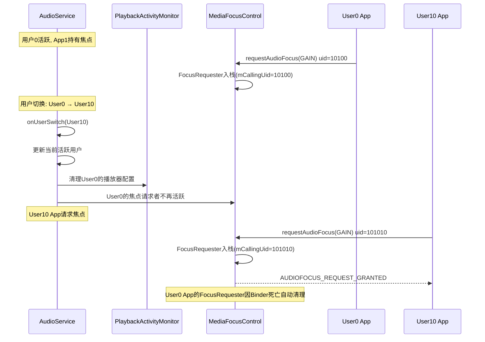

**关键机制**:
- 用户切换后，旧用户的App进程可能被冻结或终止，`AudioFocusDeathHandler.binderDied()`自动清理焦点
- 新用户的App通过正常`requestAudioFocus()`流程获取焦点
- `PlaybackActivityMonitor`通过`mPlayers`的UID区分不同用户的播放器，duck/fade操作不会跨用户

### 12.13.4 FLAG_DELAY_OK延迟焦点

**源码**: [`MediaFocusControl.java:1016`](frameworks/base/services/core/java/com/android/server/audio/MediaFocusControl.java:1016)

当焦点栈顶有LOCK焦点持有者时，新请求可能被阻塞。`AUDIOFOCUS_FLAG_DELAY_OK`标志允许请求者接受延迟授权：

1. 检测`canReassignAudioFocus()`返回false（有LOCK焦点持有者）
2. 如果请求带`FLAG_DELAY_OK` → 调用`pushBelowLockedFocusOwnersAndPropagate()`，将新请求者插入到LOCK持有者之后
3. 如果不带`FLAG_DELAY_OK` → 直接返回`REQUEST_FAILED`
4. LOCK焦点释放后，延迟请求者会自动获得焦点

> **设计意图**: FLAG_DELAY_OK用于紧急音频（如安全提示），允许在LOCK焦点持有者仍在时排队等待，而非立即拒绝。

## 12.14 焦点与音量的联动机制

焦点Loss通过三种路径影响播放器音量，从框架层到DSP层形成完整的执行链路。

### 12.14.1 三种Loss类型的音量联动路径

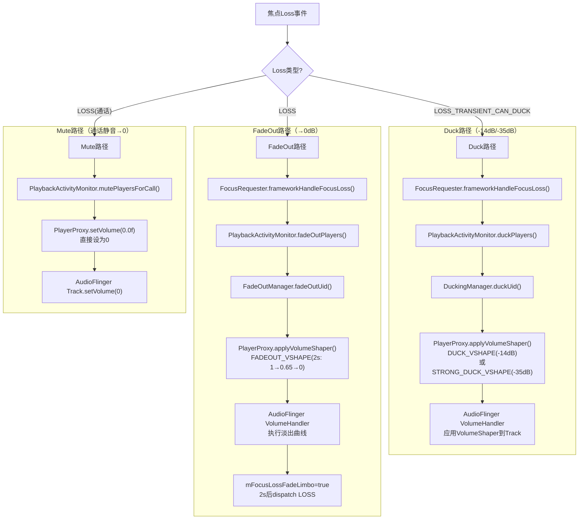

### 12.14.2 VolumeShaper在AudioFlinger中的执行

`PlayerProxy.applyVolumeShaper()`通过Binder调用到AudioFlinger：

1. `AudioService.applyVolumeShaper()` → `AudioSystem.applyVolumeShaper()` → AudioFlinger
2. AudioFlinger的`PlaybackThread::VolumeHandler`管理VolumeShaper实例
3. `VolumeHandler`在每次`mix()`操作中计算当前帧的音量乘数
4. 音量乘数与Track的原音量相乘，得到最终输出音量

**关键**: VolumeShaper不影响Track的volume字段本身——它是叠加乘数。当VolumeShaper结束（REVERSE操作恢复）后，Track恢复原音量。

### 12.14.3 AAOS路径：AudioControl HAL执行

AAOS车载系统中，焦点Loss可以通过另一条路径执行：

```
焦点Loss → MediaFocusControl → CarAudioFocus → AudioControl HAL → DSP硬件
```

1. [`MediaFocusControl`](frameworks/base/services/core/java/com/android/server/audio/MediaFocusControl.java)检测到外部AudioPolicy，交由`CarAudioFocus`处理
2. `CarAudioFocus`根据交互矩阵决定CONCURRENT/EXCLUSIVE/REJECT
3. CONCURRENT结果：通过[`IAudioControl.onAudioFocusChange()`](device/google_car/car_audio_policy_configuration/AudioControl_HAL.aidl)通知HAL
4. HAL在DSP层执行ducking——硬件级音量衰减，无需框架VolumeShaper参与
5. DSP ducking优势：零延迟、所有音频流（包括AAudio低延迟流）均可被duck

| 执行路径 | 延迟 | 适用范围 | 音量精度 |
|----------|------|----------|----------|
| 框架VolumeShaper | ~2s曲线 | 仅支持VolumeShaper的播放器 | 曲线精确 |
| App回调 | App自行决定 | 所有App | App自行控制 |
| DSP Ducking(AAOS) | 近零延迟 | 所有音频流 | 硬件精度 |

### 12.14.4 焦点恢复时音量恢复链路

当焦点恢复（GAIN/abandon）时，[`restoreVShapedPlayers()`](frameworks/base/services/core/java/com/android/server/audio/PlaybackActivityMonitor.java:822)负责恢复被duck/fadeout的播放器：

1. `DuckingManager.unduckUid()` → 对每个被duck的播放器执行`VolumeShaper.Operation.REVERSE`
2. `FadeOutManager.unfadeOutUid()` → 对每个被fadeout的播放器执行`FADEOUT_VSHAPE.REVERSE`（反向淡入）
3. 对于"违规App"，先等待`DELAY_FADE_IN_OFFENDERS_MS=2000ms`再执行fade in
4. 通话结束时`unmutePlayersForCall()` → `PlayerProxy.setVolume(1.0f)`恢复原音量

> **完整路径**: 焦点Loss → frameworkHandleFocusLoss → duckPlayers/fadeOutPlayers/mutePlayersForCall → VolumeShaper/setVolume → AudioFlinger VolumeHandler → 音量输出。恢复时逆向执行REVERSE操作。

---

> [← 上一篇：Vendor Layer](11_Vendor_Layer.md) | [返回导航](README.md) | [下一篇：Volume & Device →](13_Volume_Device_Deep_Dive.md)