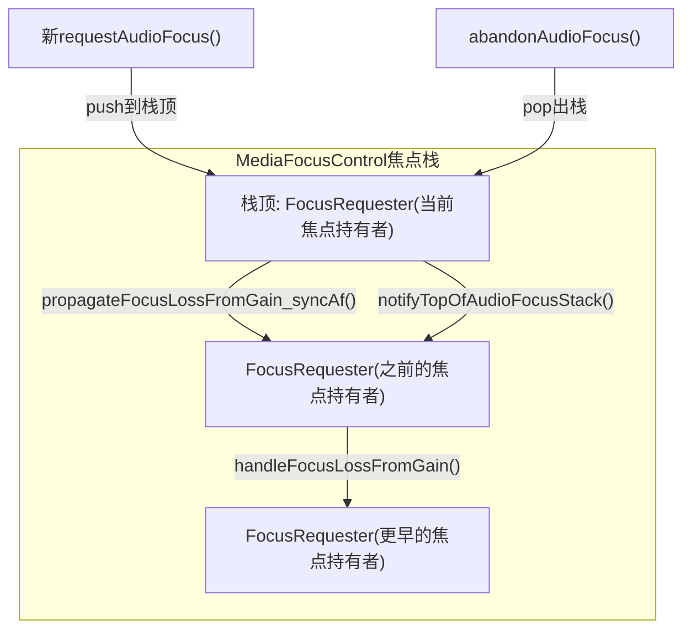
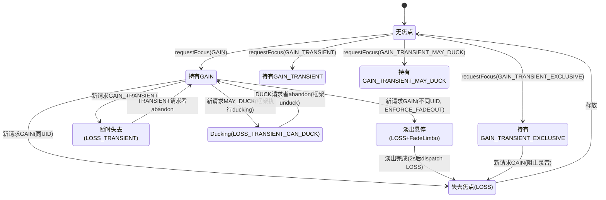
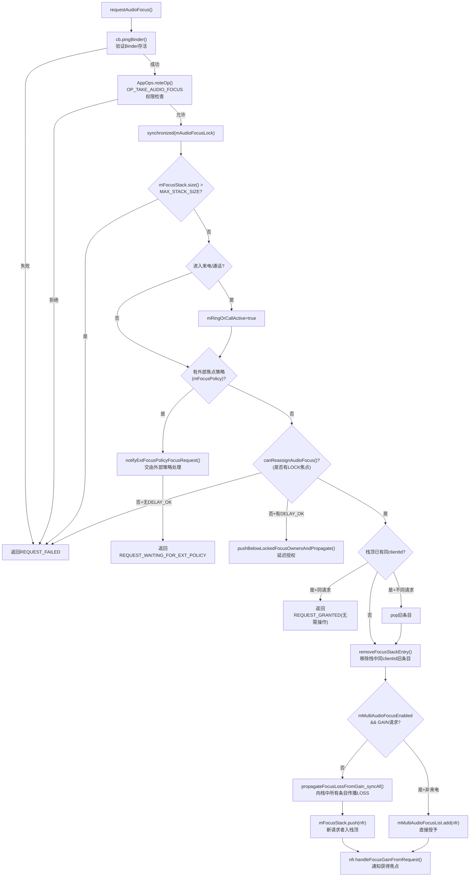
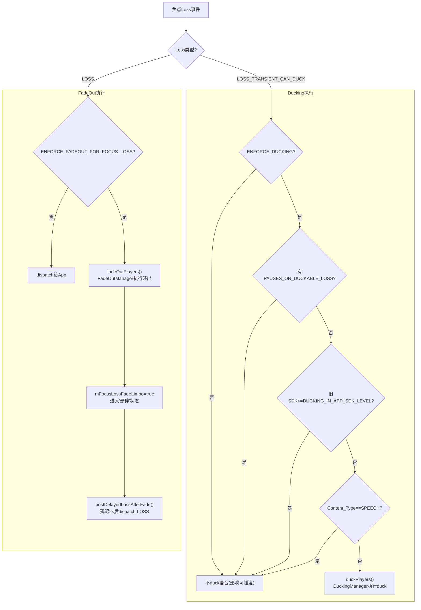
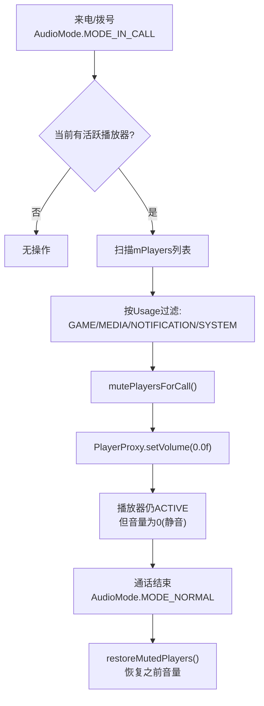

# 第十二篇：Audio Focus 深度解析

> [← 上一篇：Vendor Layer](11_Vendor_Layer.md) | [返回导航](README.md) | [下一篇：Volume & Device →](13_Volume_Device_Deep_Dive.md)

---

Audio Focus是Android音频系统最核心的协调机制。本篇从状态机模型、全栈调用链、框架执行机制、AAOS交互矩阵四个维度深度解析焦点系统。

## 12.1 Focus栈模型与核心数据结构

Android音频焦点采用**栈模型**管理，最新请求者位于栈顶持有焦点。



**核心数据结构**（源码: [`MediaFocusControl.java`](frameworks/base/services/core/java/com/android/server/audio/MediaFocusControl.java)）

| 字段 | 类型 | 说明 |
|------|------|------|
| `mFocusStack` | `Stack<FocusRequester>` | 焦点栈，栈顶为当前焦点持有者 |
| `mMultiAudioFocusList` | `ArrayList<FocusRequester>` | 多焦点模式列表(AAOS启用) |
| `mFocusPolicy` | `AudioPolicy` | 外部焦点策略(如AAOS AudioPolicy) |
| `mRingOrCallActive` | `boolean` | 来电/通话焦点是否活跃 |
| `mAudioFocusLock` | `Object` | 焦点操作同步锁 |

**FocusRequester关键字段**（源码: [`FocusRequester.java`](frameworks/base/services/core/java/com/android/server/audio/FocusRequester.java:39)）

| 字段 | 类型 | 说明 |
|------|------|------|
| `mFocusGainRequest` | `int` | 请求的焦点类型(GAIN/GAIN_TRANSIENT/GAIN_TRANSIENT_MAY_DUCK) |
| `mGrantFlags` | `int` | 授予标志(DELAY_OK/LOCK/PAUSES_ON_DUCKABLE_LOSS) |
| `mFocusLossReceived` | `int` | 当前收到的焦点丢失类型 |
| `mFocusLossWasNotified` | `boolean` | 焦点丢失是否已通知 |
| `mFocusLossFadeLimbo` | `boolean` | 是否在淡出"悬停"状态(已失焦但未释放) |
| `mAttributes` | `AudioAttributes` | 请求的音频属性(Usage/ContentType) |

## 12.2 完整焦点状态机（含Fade Limbo状态）



## 12.3 requestAudioFocus()完整流程



**关键源码位置**：[`MediaFocusControl.requestAudioFocus()`](frameworks/base/services/core/java/com/android/server/audio/MediaFocusControl.java:952)

## 12.4 焦点Loss传播与Loss类型映射

焦点Loss类型由**请求者的Gain类型**和**当前Loss状态**共同决定。核心映射函数 [`focusLossForGainRequest()`](frameworks/base/services/core/java/com/android/server/audio/FocusRequester.java:267):

| 新请求Gain类型 | 当前Loss状态 | 产生的Loss类型 |
|----------------|-------------|---------------|
| GAIN | NONE/LOSS/LOSS_TRANSIENT/LOSS_TRANSIENT_CAN_DUCK | **LOSS**(永久) |
| GAIN_TRANSIENT | NONE/LOSS_TRANSIENT_CAN_DUCK/LOSS_TRANSIENT | **LOSS_TRANSIENT**(临时) |
| GAIN_TRANSIENT | LOSS | **LOSS**(已是永久，不降级) |
| GAIN_TRANSIENT_MAY_DUCK | NONE/LOSS_TRANSIENT_CAN_DUCK | **LOSS_TRANSIENT_CAN_DUCK**(可Duck) |
| GAIN_TRANSIENT_MAY_DUCK | LOSS_TRANSIENT | **LOSS_TRANSIENT**(已升级，不降级) |
| GAIN_TRANSIENT_MAY_DUCK | LOSS | **LOSS**(已永久，不降级) |

> **关键原则**：焦点Loss只能**升级**（DUCK→TRANSIENT→LOSS），不会**降级**。即如果已经收到LOSS，不会再收到LOSS_TRANSIENT。

## 12.5 框架级焦点执行机制

Android 14框架不再仅依赖App自行响应焦点变化，而是**主动执行**ducking/fadeout/muting：



**DuckingManager执行流程**（源码: [`PlaybackActivityMonitor.duckPlayers()`](frameworks/base/services/core/java/com/android/server/audio/PlaybackActivityMonitor.java:762)）

1. 遍历`mPlayers`，找到与loser同UID且正在播放(PLAYER_STATE_STARTED)的播放器
2. 排除不可Duck的播放器:
   - `CONTENT_TYPE_SPEECH` → 不duck语音（影响可懂度）
   - `UNDUCKABLE_PLAYER_TYPES` → 不duck某些播放器类型
3. `mDuckingManager.duckUid()` → 调用`PlayerProxy.setVolume()`降低音量
4. 强Duck(Strong Duck): USAGE_ASSISTANCE请求者会触发更低的duck音量

**FadeOutManager执行流程**（源码: [`FadeOutManager`](frameworks/base/services/core/java/com/android/server/audio/FadeOutManager.java:36)）

1. 使用VolumeShaper执行2秒淡出曲线: `1.0→0.65→0.0`
2. 不可淡出的类型: SPEECH内容/AAUDIO/JAM_SOUNDPOOL播放器
3. 可淡出的Usage: USAGE_GAME/USAGE_MEDIA
4. 淡出完成后进入**Limbo状态**，2s后dispatch LOSS给App

## 12.6 AAOS焦点交互矩阵

```
              请求者 →
持有者 ↓       | EMERGENCY | SAFETY  | CALL    | NAV     | MUSIC   | NOTIF   | SYSTEM  |
EMERGENCY     | CONCURRENT| CONCUR  | CONCUR  | CONCUR  | CONCUR  | CONCUR  | CONCUR  |
SAFETY        | CONCURRENT| CONCUR  | EXCLUSIVE| CONCUR | CONCUR  | CONCUR  | CONCUR  |
CALL          | CONCURRENT| EXCLUSIVE| EXCLUSIVE| REJECT | EXCLUSIVE| REJECT | REJECT  |
NAVIGATION    | CONCURRENT| CONCUR  | EXCLUSIVE| CONCUR  | CONCUR  | CONCUR  | CONCUR  |
MUSIC         | CONCURRENT| CONCUR  | EXCLUSIVE| CONCUR  | CONCUR  | CONCUR  | CONCUR  |
NOTIFICATION  | CONCURRENT| CONCUR  | EXCLUSIVE| CONCUR  | CONCUR  | CONCUR  | CONCUR  |
SYSTEM_SOUND  | CONCURRENT| CONCUR  | EXCLUSIVE| CONCUR  | CONCUR  | CONCUR  | CONCUR  |
```

| 交互结果 | 含义 | 行为 |
|----------|------|------|
| CONCURRENT | 并发播放 | 新请求者获得焦点，持有者被Duck |
| EXCLUSIVE | 独占 | 新请求者获得焦点，持有者失去焦点 |
| REJECT | 拒绝 | 新请求被拒绝，持有者保持焦点 |

> **关键规则**: EMERGENCY始终CONCURRENT(最高优先级)；CALL对NAV/NOTIF/SYSTEM执行REJECT(通话期间拒绝非关键音频)

## 12.7 abandonAudioFocus()流程

```mermaid
sequenceDiagram
    participant App, AMC as MediaFocusControl, Stack as FocusStack, Top as 新栈顶
    App->>AMC: abandonAudioFocus(clientId)
    AMC->>AMC: synchronized(mAudioFocusLock)
    AMC->>Stack: 遍历查找clientId
    AMC->>Stack: remove(found entry)
    AMC->>Stack: release() 旧条目(解绑Binder death)
    AMC->>AMC: mRingOrCallActive判断(来电焦点退出)
    AMC->>Top: notifyTopOfAudioFocusStack()
    Top->>Top: handleFocusGain(AUDIOFOCUS_GAIN)
    Top->>Top: mFocusLossReceived = NONE
    Top->>Top: restoreVShapedPlayers()<br/>恢复被duck/fadeout的播放器
    AMC-->>App: 返回AUDIOFOCUS_REQUEST_GRANTED
```

## 12.8 Audio Focus全栈调用链

### 标准Android焦点链路

```mermaid
sequenceDiagram
    participant App1, App2, AM, AS, MFC
    App1->>AM: requestAudioFocus(GAIN)
    AM->>AS: requestAudioFocus() [Binder]
    AS->>MFC: requestAudioFocus()
    MFC->>MFC: 创建FocusRequester → 入栈
    MFC-->>App1: AUDIOFOCUS_REQUEST_GRANTED
    App2->>AM: requestAudioFocus(GAIN)
    AM->>AS: requestAudioFocus()
    AS->>MFC: requestAudioFocus()
    MFC->>MFC: App1出栈 → LOSS通知
    MFC-->>App1: AUDIOFOCUS_LOSS
    MFC-->>App2: AUDIOFOCUS_REQUEST_GRANTED
```

### AAOS焦点链路

```mermaid
sequenceDiagram
    participant App, AS, MFC, CarAF, FI, ACW, HAL
    App->>AS: requestAudioFocus(GAIN)
    AS->>MFC: requestAudioFocus()
    MFC->>MFC: 检测外部AudioPolicy
    MFC->>CarAF: onAudioFocusRequest(afi)
    CarAF->>FI: evaluateAgainstFocusHoldersLocked()
    FI-->>CarAF: INTERACTION_CONCURRENT
    CarAF->>ACW: onAudioFocusChange(zone, FOCUS_GAIN)
    ACW->>HAL: IAudioControl.onAudioFocusChange() [AIDL]
    CarAF-->>MFC: setFocusRequestResult(GRANTED)
    MFC-->>App: AUDIOFOCUS_REQUEST_GRANTED
```

## 12.9 通话Muting机制



> **通话Muting vs Ducking**: 通话期间直接Mute到0（而非Duck到-20dB），这是设计决策——通话时其他音频完全静音，避免干扰通话质量。

---

> [← 上一篇：Vendor Layer](11_Vendor_Layer.md) | [返回导航](README.md) | [下一篇：Volume & Device →](13_Volume_Device_Deep_Dive.md)