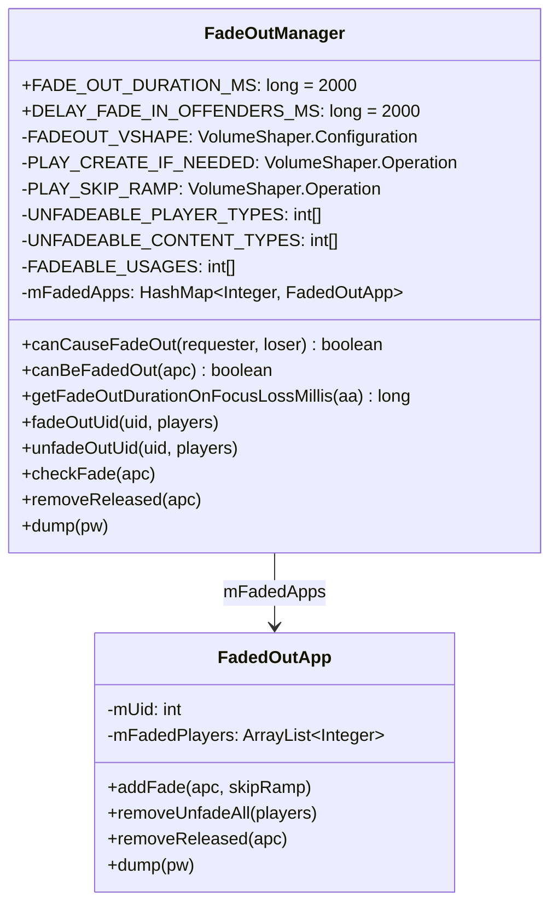
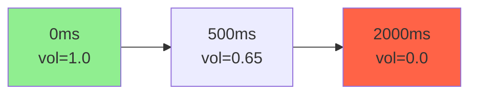
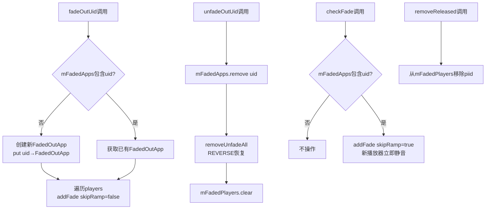
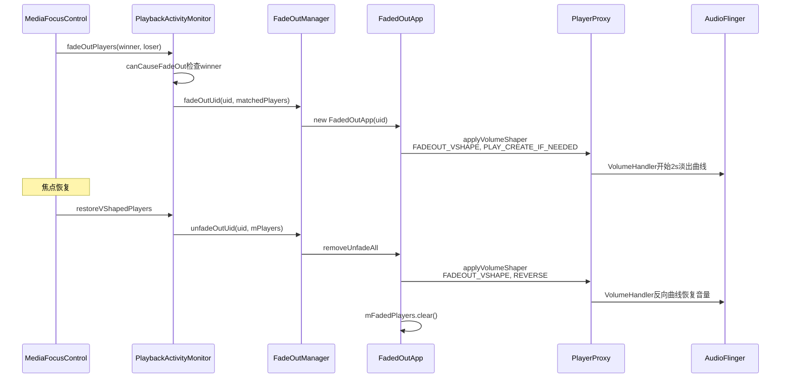

## 12.10 FadeOutManager深度解析

> [← 上一个](12_12.9_通话Muting机制.md) | [← 返回12章](README.md) | [返回导航](../README.md) | [下一个 →](12_12.11_PlaybackActivityMonitor_Duck执行深度.md)

---

FadeOutManager是框架级焦点执行的第二条路径（Duck/FadeOut/Mute），负责在焦点Loss时对媒体播放器执行渐出淡出操作。与Duck的音量衰减和Mute的瞬间静音不同，FadeOut使用VolumeShaper曲线在2秒内平滑降低音量至0。

### 12.10.1 FadeOutManager类结构



### 12.10.2 FADEOUT_VSHAPE曲线配置

源码位置：[`FadeOutManager.java`](frameworks/base/services/core/java/com/android/server/audio/FadeOutManager.java:53)

```java
// L53-60
private static final VolumeShaper.Configuration FADEOUT_VSHAPE =
    new VolumeShaper.Configuration.Builder()
        .setId(PlaybackActivityMonitor.VOLUME_SHAPER_SYSTEM_FADEOUT_ID)
        .setCurve(new float[]{0.f, 0.25f, 1.0f},    // 时间点
                  new float[]{1.f, 0.65f, 0.0f})     // 音量点
        .setOptionFlags(VolumeShaper.Configuration.OPTION_FLAG_CLOCK_TIME)
        .setDuration(FADE_OUT_DURATION_MS)            // 2000ms
        .build();
```

**三段曲线详解：**

| 段 | 时间范围 | 音量范围 | 持续时间 | 衰减量 |
|----|----------|----------|----------|--------|
| 第1段 | 0→0.5s (0→0.25×2s) | 1.0→0.65 | 500ms | -3.7dB |
| 第2段 | 0.5s→2s (0.25→1.0×2s) | 0.65→0.0 | 1500ms | -∞dB |
| 总计 | 0→2s | 1.0→0.0 | 2000ms | 完全静音 |



- 第1段(0-500ms)：快速衰减到65%，用户感知明显但不太突兀
- 第2段(500-2000ms)：缓慢衰减到0，平滑过渡到静音
- OPTION_FLAG_CLOCK_TIME：使用墙钟时间而非播放时间，确保即使播放暂停曲线仍继续

### 12.10.3 UNFADEABLE和FADEABLE定义

源码位置：[`FadeOutManager.java`](frameworks/base/services/core/java/com/android/server/audio/FadeOutManager.java:66)

```java
// L66-69: 不可淡出的播放器类型
private static final int[] UNFADEABLE_PLAYER_TYPES = {
    AudioPlaybackConfiguration.PLAYER_TYPE_AAUDIO,    // AAudio低延迟播放器
    AudioPlaybackConfiguration.PLAYER_TYPE_JAM_SOUNDPOOL, // Java SoundPool
};

// L71-73: 不可淡出的内容类型
private static final int[] UNFADEABLE_CONTENT_TYPES = {
    AudioAttributes.CONTENT_TYPE_SPEECH,  // 语音内容
};

// L75-78: 可淡出的Usage
private static final int[] FADEABLE_USAGES = {
    AudioAttributes.USAGE_GAME,   // 游戏
    AudioAttributes.USAGE_MEDIA,  // 媒体
};
```

| 类别 | 值 | 原因 |
|------|-----|------|
| PLAYER_TYPE_AAUDIO | 低延迟播放器 | AAudio用于低延迟场景，淡出会引入延迟 |
| PLAYER_TYPE_JAM_SOUNDPOOL | SoundPool | 短音效不适合淡出 |
| CONTENT_TYPE_SPEECH | 语音 | 语音淡出听起来不自然 |
| USAGE_GAME | 游戏 | 游戏音效可淡出 |
| USAGE_MEDIA | 媒体 | 音乐可淡出 |

### 12.10.4 canCauseFadeOut资格判定

源码位置：[`FadeOutManager.java`](frameworks/base/services/core/java/com/android/server/audio/FadeOutManager.java:93)

```java
// L93-106
static boolean canCauseFadeOut(@NonNull FocusRequester requester,
        @NonNull FocusRequester loser) {
    // 条件1: 新焦点获得者不是SPEECH
    if (requester.getAudioAttributes().getContentType()
            == AudioAttributes.CONTENT_TYPE_SPEECH) {
        return false;
    }
    // 条件2: 失去焦点者没有PAUSES_ON_DUCKABLE_LOSS标志
    if ((loser.getGrantFlags()
            & AudioManager.AUDIOFOCUS_FLAG_PAUSES_ON_DUCKABLE_LOSS) != 0) {
        return false;
    }
    return true;
}
```

**判定逻辑：** 新焦点获得者(requester)是否会导致旧焦点持有者(loser)被淡出

| 条件 | 结果 | 原因 |
|------|------|------|
| requester是SPEECH | 不淡出 | 语音获得焦点时，旧App应直接暂停而非淡出 |
| loser有PAUSES_ON_DUCKABLE_LOSS | 不淡出 | App声明在Duck Loss时自行暂停，框架无需淡出 |
| 其他情况 | 淡出 | 框架执行淡出作为兜底 |

### 12.10.5 canBeFadedOut资格判定

源码位置：[`FadeOutManager.java`](frameworks/base/services/core/java/com/android/server/audio/FadeOutManager.java:113)

```java
// L113-133
static boolean canBeFadedOut(@NonNull AudioPlaybackConfiguration apc) {
    if (ArrayUtils.contains(UNFADEABLE_PLAYER_TYPES, apc.getPlayerType())) {
        return false;  // 播放器类型不可淡出
    }
    if (ArrayUtils.contains(UNFADEABLE_CONTENT_TYPES,
            apc.getAudioAttributes().getContentType())) {
        return false;  // 内容类型不可淡出
    }
    if (!ArrayUtils.contains(FADEABLE_USAGES, apc.getAudioAttributes().getUsage())) {
        return false;  // Usage不在可淡出列表
    }
    return true;
}
```

**完整资格矩阵：**

| 播放器类型 | 内容类型 | Usage | canBeFadedOut |
|-----------|---------|-------|---------------|
| AAUDIO | * | * | false |
| SOUNDPOOL | * | * | false |
| * | SPEECH | * | false |
| * | * | 非MEDIA/GAME | false |
| 其他 | 非SPEECH | MEDIA/GAME | **true** |

### 12.10.6 fadeOutUid执行

源码位置：[`FadeOutManager.java`](frameworks/base/services/core/java/com/android/server/audio/FadeOutManager.java:150)

```java
// L150-159
synchronized void fadeOutUid(int uid, ArrayList<AudioPlaybackConfiguration> players) {
    if (!mFadedApps.containsKey(uid)) {
        mFadedApps.put(uid, new FadedOutApp(uid));  // 首次创建FadedOutApp
    }
    final FadedOutApp fa = mFadedApps.get(uid);
    for (AudioPlaybackConfiguration apc : players) {
        fa.addFade(apc, false /*skipRamp*/);  // 不跳过，执行完整淡出曲线
    }
}
```

**执行流程：**
1. 检查UID是否已有FadedOutApp，没有则创建
2. 遍历该UID的所有播放器
3. 对每个播放器调用addFade(apc, false)执行完整淡出曲线

### 12.10.7 unfadeOutUid恢复

源码位置：[`FadeOutManager.java`](frameworks/base/services/core/java/com/android/server/audio/FadeOutManager.java:166)

```java
// L166-173
synchronized void unfadeOutUid(int uid, HashMap<Integer, AudioPlaybackConfiguration> players) {
    final FadedOutApp fa = mFadedApps.remove(uid);  // 从map中移除
    if (fa == null) return;
    fa.removeUnfadeAll(players);  // 恢复所有播放器
}
```

### 12.10.8 checkFade新播放器检查

源码位置：[`FadeOutManager.java`](frameworks/base/services/core/java/com/android/server/audio/FadeOutManager.java:177)

```java
// L177-187
synchronized void checkFade(@NonNull AudioPlaybackConfiguration apc) {
    final FadedOutApp fa = mFadedApps.get(apc.getClientUid());
    if (fa == null) return;  // 该UID不在淡出列表
    fa.addFade(apc, true);   // skipRamp=true，直接跳到曲线末端(静音)
}
```

**checkFade场景：** 当App失去焦点被淡出后，如果又启动新播放器，checkFade确保新播放器也立即静音（skipRamp=true跳过淡出曲线，直接到0）。

### 12.10.9 FadedOutApp内部类详解

源码位置：[`FadeOutManager.java`](frameworks/base/services/core/java/com/android/server/audio/FadeOutManager.java:216)

```java
// L216-288
private static final class FadedOutApp {
    private final int mUid;
    private final ArrayList<Integer> mFadedPlayers = new ArrayList<Integer>();

    void addFade(@NonNull AudioPlaybackConfiguration apc, boolean skipRamp) {
        final int piid = apc.getPlayerInterfaceId();
        if (mFadedPlayers.contains(piid)) return;  // 已淡出，跳过
        apc.getPlayerProxy().applyVolumeShaper(
                FADEOUT_VSHAPE,
                skipRamp ? PLAY_SKIP_RAMP : PLAY_CREATE_IF_NEEDED);
        mFadedPlayers.add(piid);
    }

    void removeUnfadeAll(HashMap<Integer, AudioPlaybackConfiguration> players) {
        for (int piid : mFadedPlayers) {
            final AudioPlaybackConfiguration apc = players.get(piid);
            if (apc != null) {
                apc.getPlayerProxy().applyVolumeShaper(
                        FADEOUT_VSHAPE,
                        VolumeShaper.Operation.REVERSE);  // 反向曲线恢复
            }
        }
        mFadedPlayers.clear();
    }

    void removeReleased(@NonNull AudioPlaybackConfiguration apc) {
        mFadedPlayers.remove(new Integer(apc.getPlayerInterfaceId()));
    }
}
```

**FadedOutApp数据结构：**

| 字段 | 类型 | 用途 |
|------|------|------|
| mUid | int | 被淡出App的UID |
| mFadedPlayers | ArrayList\<Integer\> | 被淡出播放器的piid列表 |

**addFade参数语义：**

| skipRamp | VolumeShaper.Operation | 效果 |
|----------|----------------------|------|
| false | PLAY_CREATE_IF_NEEDED | 从曲线起点开始，2s淡出到0 |
| true | PLAY_SKIP_RAMP | 跳到曲线末端，立即静音 |

### 12.10.10 mFadedApps管理



### 12.10.11 DELAY_FADE_IN_OFFENDERS_MS

源码位置：[`FadeOutManager.java`](frameworks/base/services/core/java/com/android/server/audio/FadeOutManager.java:49)

```java
// L49
static final long DELAY_FADE_IN_OFFENDERS_MS = 2000;
```

**含义：** 当焦点恢复时，对"违规"App（未响应Loss仍播放的App）延迟2s才开始淡入恢复。这是Limbo状态(MSG_L_FOCUS_LOSS_AFTER_FADE)的延迟时间。

### 12.10.12 FadeOut完整生命周期



### 12.10.13 getFadeOutDurationOnFocusLossMillis

源码位置：[`FadeOutManager.java`](frameworks/base/services/core/java/com/android/server/audio/FadeOutManager.java:135)

```java
// L135-143
static long getFadeOutDurationOnFocusLossMillis(AudioAttributes aa) {
    if (ArrayUtils.contains(UNFADEABLE_CONTENT_TYPES, aa.getContentType())) {
        return 0;  // SPEECH不淡出
    }
    if (!ArrayUtils.contains(FADEABLE_USAGES, aa.getUsage())) {
        return 0;  // 非MEDIA/GAME不淡出
    }
    return FADE_OUT_DURATION_MS;  // 2000ms
}
```

此方法供AudioService查询，用于在焦点请求时告知App预期淡出时间。

### 12.10.14 与DuckingManager对比

| 维度 | FadeOutManager | DuckingManager |
|------|---------------|----------------|
| 管理粒度 | UID→FadedOutApp→piid列表 | UID→DuckedApp→piid列表 |
| 曲线 | FADEOUT_VSHAPE(2s三段) | DUCK_VSHAPE(-14dB) |
| 恢复曲线 | REVERSE(反向淡入) | REVERSE(反向duck) |
| 资格判定 | canCauseFadeOut+canBeFadedOut | 排除SPEECH+UNDUCKABLE |
| skipRamp | 有(新播放器立即静音) | 有(skipRamp语义) |
| Limbo | 有(2s延迟派发LOSS) | 无 |
| ENFORCE开关 | ENFORCE_FADEOUT_FOR_FOCUS_LOSS | ENFORCE_DUCKING |

---

[← 上一个](12_12.9_通话Muting机制.md) | [← 返回12章](README.md) | [返回导航](../README.md) | [下一个 →](12_12.11_PlaybackActivityMonitor_Duck执行深度.md)